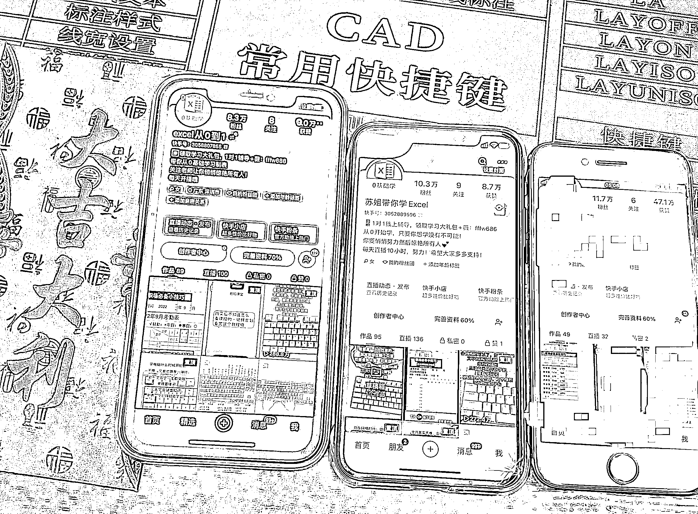

# 《拆解下我是如何通过快手无人直播+知识付费+私域月入 3w+》

> 原文：[`www.yuque.com/for_lazy/thfiu8/vezeswzany26uelr`](https://www.yuque.com/for_lazy/thfiu8/vezeswzany26uelr)

## (91 赞)《拆解下我是如何通过快手无人直播+知识付费+私域月入 3w+》 

作者： 雨林 

日期：2023-03-24 

哈喽大家好，我是生财圈友雨林。 

这是我的第一篇文章，写这篇目的呢有 2 点。 

1：感谢生财的优质文章，这里就像定向推送商业创业内容的抖音。一进来就有看不完的干货，出都出不去。使我的认知及见识得到了许多提升。其次呢，做这个项目也是在生财的风向标里面给我的灵感。所以，我理应为生财做出一点贡献。毕竟写这篇文章还是有许多思想斗争的，可能会导致我的赛道加剧内卷。 

2：输入后不输出，知识其实不属于你，它只会在你的大脑里面稍纵即逝。所以就拿这个我有点成绩的项目当做我的第一篇文章，以后也会多写文章，保持思考，持续进步。 

一：先分享一下这半年我的快手无人直播的成果（10 月份开始做） 

全网粉丝 60w+，变现 20w+（直播收益 16w+私域收益 4w） 

以下是其中 3 个账号 

  

内容有点长，请移步飞书：[https://sq065yn6aoy.feishu.cn/docx/KpMRdNVS1olPpoxAvZjcZJ0znRc](https://sq065yn6aoy.feishu.cn/docx/KpMRdNVS1olPpoxAvZjcZJ0znRc) 

评论区： 

Tango_lo : 细分领域出人才 不困 : 厉害啊，新的思路！ 结合一下又是新的方向🧭 我也是从 10 月份开始做快手无人直播，我运气比较好，勉勉强强活了下来 雨林 : [握手][握手][握手]一起进步 lydia : 咱 20w 的营收是三个号一起的收益吗 雨林 : 6 个 lydia : 感谢！搞无人直播对设备是什么要求？一个帐号一台电脑么？ 雨林 : 我买了个 1000 多专门多开的可以挂 4-5 台，普通的电脑应该可以挂 2 个 蛋蛋。 : 学习到了，看到了一个中老年人的市场