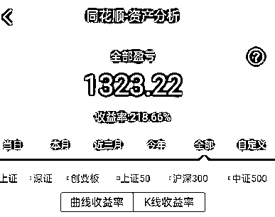
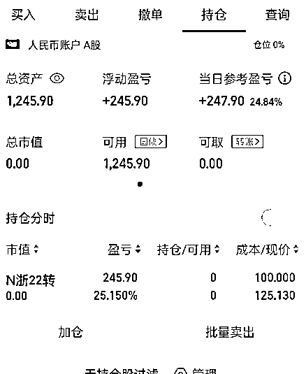

# 《银行大额存款拆借项目无风险套利一天赚 10W 》

> 原文：[`www.yuque.com/for_lazy/thfiu8/quxrog8c0qgdg6pz`](https://www.yuque.com/for_lazy/thfiu8/quxrog8c0qgdg6pz)

<ne-h2 id="4e178e1f" data-lake-id="4e178e1f"><ne-heading-ext><ne-heading-anchor></ne-heading-anchor><ne-heading-fold></ne-heading-fold></ne-heading-ext><ne-heading-content><ne-text id="u50d743ab">(43 赞)《银行大额存款拆借项目无风险套利一天赚 10W 》</ne-text></ne-heading-content></ne-h2> <ne-p id="u407b8acb" data-lake-id="u407b8acb"><ne-text id="u154f0c9e">作者： 老胡</ne-text></ne-p> <ne-p id="u41ad302d" data-lake-id="u41ad302d"><ne-text id="u5da7b788">日期：2023-03-20</ne-text></ne-p> <ne-p id="u9112f6d6" data-lake-id="u9112f6d6"><ne-text id="ua0e05725">银行大额存款拆借项目怎么来的？其实就是来自于银行行长每月的任务指标，每月月底他们都会尽量完成自己的任务指标，如果有任务额没法完成的话，他们就会在圈内同行之间拆借，支付一定的拆借利息。</ne-text></ne-p> <ne-p id="u52387ad2" data-lake-id="u52387ad2"><ne-text id="u01612192">而这个套利的方式就是在月底的时候帮他们往银行里存钱，赚钱利息差价，但是要注意的一点是需要大额资金投入，比如想要 1 天赚 10 W ，那就需要千万的资金投入。</ne-text></ne-p> <ne-p id="u49fde5c1" data-lake-id="u49fde5c1"><ne-text id="u577db3e7">不过，这也不需要担心有任何风险，所有的资金交易都是自己操作，在自己的卡里完成，资金也可随时取出。</ne-text></ne-p> <ne-p id="u0bb783ef" data-lake-id="u0bb783ef"><ne-text id="u443b723b">这个赛道目前也算是一个比较好的生意，具体的详细操作步骤都放在文章里了，大家可以了解一下。</ne-text></ne-p> <ne-h1 id="95753c61" data-lake-id="95753c61"><ne-heading-ext><ne-heading-anchor></ne-heading-anchor><ne-heading-fold></ne-heading-fold></ne-heading-ext><ne-heading-content><ne-text id="u705fa859">一、机会挖掘</ne-text></ne-heading-content></ne-h1> <ne-p id="udc58c498" data-lake-id="udc58c498"><ne-text id="u0bca08a0">金融无风险套利一天赚 10w ，机会是聊出来的，不同的圈子之间其实存在着不少的信息差和套利的机会，下面分享一个自己破圈之后，GET 到的一个信息差和无风险套利机会，大家一起生财有术！</ne-text></ne-p> <ne-h1 id="ac067cc0" data-lake-id="ac067cc0"><ne-heading-ext><ne-heading-anchor></ne-heading-anchor><ne-heading-fold></ne-heading-fold></ne-heading-ext><ne-heading-content><ne-text id="uc5660c9d">二、项目名称</ne-text></ne-heading-content></ne-h1> <ne-p id="u00373622" data-lake-id="u00373622"><ne-text id="u9d85d6af">银行隔天大额存款拆借无风险套利项目</ne-text></ne-p> <ne-h1 id="ec6d05cc" data-lake-id="ec6d05cc"><ne-heading-ext><ne-heading-anchor></ne-heading-anchor><ne-heading-fold></ne-heading-fold></ne-heading-ext><ne-heading-content><ne-text id="u7a3aeea5">三、项目缘起</ne-text></ne-heading-content></ne-h1> <ne-p id="u629e8e39" data-lake-id="u629e8e39"><ne-text id="u9b9be180">交际圈层破圈，信息差。</ne-text></ne-p> <ne-p id="u94cd6bc7" data-lake-id="u94cd6bc7"><ne-text id="u9782486f">这个项目缘起线下银行系统的朋友，熟悉我的朋友都知道我们家族是做线下实体生意的，平常都有跟银行系统的朋友打交道，去年年末的时候，跟这位朋友操作了可转债的打新，取得的不错的收益。</ne-text></ne-p> <ne-p id="u190cc1a0" data-lake-id="u190cc1a0"><ne-card data-card-name="image" data-card-type="inline" id="OGXzX" data-event-boundary="card"></ne-card></ne-p> <ne-p id="u791dc536" data-lake-id="u791dc536"><ne-card data-card-name="image" data-card-type="inline" id="Vn3Rc" data-event-boundary="card"></ne-card></ne-p> <ne-p id="u539a5392" data-lake-id="u539a5392"><ne-card data-card-name="image" data-card-type="inline" id="ex726" data-event-boundary="card">  <ne-p id="u4ab16b50" data-lake-id="u4ab16b50"><ne-card data-card-name="image" data-card-type="inline" id="N9COk" data-event-boundary="card"></ne-card></ne-p> <ne-p id="uaca63d4e" data-lake-id="uaca63d4e"><ne-card data-card-name="image" data-card-type="inline" id="iPP76" data-event-boundary="card"></ne-card></ne-p> <ne-p id="u293ba352" data-lake-id="u293ba352"><ne-text id="u551455ee">以上是企业打新债的一部分，虽然每次中签大概能赚个几百，但是因为我们做的是淘宝店群，本身企业执照就多，不知道是不是个人感觉，企业户去打可转债感觉中签率挺高的.</ne-text></ne-p> <ne-p id="u6e20ea9a" data-lake-id="u6e20ea9a"><ne-text id="u1c564446">（圈友们可以自行验证下，做电商有执照的可以自行去开企业户试试）。</ne-text></ne-p> <ne-p id="u10836c35" data-lake-id="u10836c35"><ne-text id="u82642660">有了可转债打新的接触，慢慢就熟悉起来，2 月份搬了新办公室，邀请这位朋友来泡茶，聊天的时候，他才知道我做互联网好几年了,</ne-text></ne-p> <ne-p id="u8d27847a" data-lake-id="u8d27847a"><ne-text id="u4c30a2b8">聊了很久，最后决定让我帮他从知乎和抖音上面去引粉丝到个人微信上面去做证券开户的正规服务。</ne-text></ne-p> <ne-p id="u61565112" data-lake-id="u61565112"><ne-text id="u4ebd9b14">在细聊的过程中，聊到了他银行的本职工作，也讲到了这个无风险的套利。</ne-text></ne-p> <ne-h1 id="7486e74b" data-lake-id="7486e74b"><ne-heading-ext><ne-heading-anchor></ne-heading-anchor><ne-heading-fold></ne-heading-fold></ne-heading-ext><ne-heading-content><ne-text id="u4515a531">四、项目背景</ne-text></ne-heading-content></ne-h1> <ne-p id="ub478b393" data-lake-id="ub478b393"><ne-text id="u3c624af9">1）其实每个银行行长后面都有一定的揽储等任务额，考核任务直接关系到自己的指标，所以通常在月末，他们都会尽量完成自己的任务指标，如果有任务额没法完成的话他们就会在圈内同行之间拆借，支付一定的拆借利息。</ne-text></ne-p> <ne-p id="u249e9a09" data-lake-id="u249e9a09"><ne-text id="u997244ac">2）这个拆借通常是短期的，一天或者两天，通常都是在月末。</ne-text></ne-p> <ne-p id="uc8d7cf2f" data-lake-id="uc8d7cf2f"><ne-text id="ub5772c26">3）这个拆借是隐性非公开，这个就是为什么有的朋友到月底的时候，有银行的朋友会找你有没有空出来的短期现金，帮忙存几天完成任务。</ne-text></ne-p> <ne-h1 id="98743ea6" data-lake-id="98743ea6"><ne-heading-ext><ne-heading-anchor></ne-heading-anchor><ne-heading-fold></ne-heading-fold></ne-heading-ext><ne-heading-content><ne-text id="ua36480ae">五、操作流程</ne-text></ne-heading-content></ne-h1> <ne-p id="u9b879636" data-lake-id="u9b879636"><ne-text id="u56d314e9">近几年，整体疫情的影响，在加上国家设置一人一个银行一张一类的设定标准，导致很多银行的行长要引流存款完成时，变得很麻烦。</ne-text></ne-p> <ne-p id="u1c68082f" data-lake-id="u1c68082f"><ne-text id="uca320d64">所以银行系统科技就设置了一个二类卡关联一类卡的方法，只需要输入银行的工作人员编号，就能产生一个新的卡号，然后再从银行主卡转入自己的二类卡，任务结束了再从二类卡转入一类卡后就可以销户。</ne-text></ne-p> <ne-p id="u2100e76b" data-lake-id="u2100e76b"><ne-text id="u8a4e7b63">整个流程操作只有用户本人自己银行卡之间互相转账，不存在代操作，款转他人账户等问题，资金安全有保证，无风险。</ne-text></ne-p> <ne-h1 id="6476f5e5" data-lake-id="6476f5e5"><ne-heading-ext><ne-heading-anchor></ne-heading-anchor><ne-heading-fold></ne-heading-fold></ne-heading-ext><ne-heading-content><ne-text id="u49107429">六、具体操作</ne-text></ne-heading-content></ne-h1> <ne-p id="u6b416392" data-lake-id="u6b416392"><ne-text id="ue98ad72a">工行存款办法：</ne-text></ne-p> <ne-p id="u156596b9" data-lake-id="u156596b9"><ne-text id="u221084b7">存款-通知存款-一天通知-输入代码，输入金额，到期日点一下选择明日-下一步-存款保存-查看我的存款</ne-text></ne-p> <ne-p id="u6acdb672" data-lake-id="u6acdb672"><ne-text id="ude29ef64">农行存款办法：</ne-text></ne-p> <ne-p id="u8ff12093" data-lake-id="u8ff12093"><ne-text id="uc8cc5a15">我的账户-开通电子户-输入他行卡-填写信息跟开户网点代码-绑定账户换绑成农行主卡-转入-第二天转出（转出后可以销户）</ne-text></ne-p> <ne-p id="u6eaac7da" data-lake-id="u6eaac7da"><ne-card data-card-name="image" data-card-type="inline" id="dGY7v" data-event-boundary="card"></ne-card></ne-p> <ne-p id="u5852ee47" data-lake-id="u5852ee47"><ne-card data-card-name="image" data-card-type="inline" id="L2L7A" data-event-boundary="card"></ne-card></ne-p> <ne-p id="ucf5393b2" data-lake-id="ucf5393b2"><ne-card data-card-name="image" data-card-type="inline" id="JQOBg" data-event-boundary="card">  <ne-p id="u23901aa0" data-lake-id="u23901aa0"><ne-text id="u077b4e27">建行、中行、邮储开户办法跟农行大同小异，建行比较繁琐一点点。</ne-text></ne-p> <ne-p id="ue7822845" data-lake-id="ue7822845"><ne-text id="uaef0fab8">需要详细教程。不用担心开错误点，错了都是可以销户重来。不会存在卡死现象。</ne-text></ne-p> <ne-h1 id="73b04339" data-lake-id="73b04339"><ne-heading-ext><ne-heading-anchor></ne-heading-anchor><ne-heading-fold></ne-heading-fold></ne-heading-ext><ne-heading-content><ne-text id="u8bba303f">七、自身实操验证</ne-text></ne-heading-content></ne-h1> <ne-p id="u74dbd2af" data-lake-id="u74dbd2af"><ne-text id="udf72f07a">了解需求和价格，先是自己银行的授信和资金准备好，时间长点的我们还有可以做一个年化 4% 的理财利息（ + 0.25% 银行活期利息，当时银行理财利息 2.2% 左右，所以差价 2% ），做了一个月。</ne-text></ne-p> <ne-p id="uf04e33b2" data-lake-id="uf04e33b2"><ne-text id="ub0fc99a4">刚好做衔接季度末最后一天的过夜资金，相当于无风险三分多利息，预先的价格是一千万 1 天 1 万多块钱，</ne-text></ne-p> <ne-p id="uc4f99269" data-lake-id="uc4f99269"><ne-text id="u3851a94d">那么我一个月相当于收益到我手上时，差价就有 500 万（自有）* 2 % / 12 = 8200 + 季度 1000 万 * 0.0012 =12000 元（订的早了），总的盈利 2 万。</ne-text></ne-p> <ne-p id="u998403b8" data-lake-id="u998403b8"><ne-text id="u11acd4df">然后大头来了，因为我朋友是某公司的股东，我就问题他要不要做银行存款，他就说什么是银行存款，我就说你们公司可以在自己卡里做帮银行月末冲刺，没风险。</ne-text></ne-p> <ne-p id="ud9992d23" data-lake-id="ud9992d23"><ne-text id="u507ad866">他跟我说他回去跟其他股东说一下。我说好。本来没报什么希望，我也问了其他几个朋友。他们也都说先了解了解。我跟他们讲说，你们理财利息成本 1 天也就 1000 万 600 块钱。</ne-text></ne-p> <ne-p id="ude919087" data-lake-id="ude919087"><ne-text id="u572f1bfb">这边是 1000 万一天 11000 元（兜底）。差价十来倍。后面，有一天这个公司的朋友他打电话来说公司几个人账上合起来有 3 个亿，刚好还没去飙地，刚好下个月要用，这个月不用。</ne-text></ne-p> <ne-p id="u01d1b0ad" data-lake-id="u01d1b0ad"><ne-text id="ua9b67b86">多赚个几十万也是不错的啊。那我赶紧确定渠道，然后我们以一亿一天 11 万的价格确定了合作。然后渠道和我开始确认。因为季度末需求量肯定大，渠道给我保底 1 万 2 的价格确认，后面价格涨的部分再一半分我或者我跟她们确定好价格，按季度末价格配合我，二选一。</ne-text></ne-p> <ne-p id="u554e6632" data-lake-id="u554e6632"><ne-text id="u4f45b394">我谨慎一点，选择了前者，想着万一呢。后面还真的涨了价格，大量的需求啊。后面的事情就是他们资金提前一天出来了，也开好了电子户，资金转入他们账上的电子户。</ne-text></ne-p> <ne-p id="u45461035" data-lake-id="u45461035"><ne-text id="u645c155e">过了季度底到 1 号，渠道把尾款给我，我资金也打给他们了。中间差价 6 万就来了。这是最大一笔。</ne-text></ne-p> <ne-p id="ubcee820a" data-lake-id="ubcee820a"><ne-text id="ua8465fda">然后其他的朋友有资金的最后几天也联系我，有个炒股的朋友闲置资金也有几千万，也配合了我一些（日均 + 月末）。</ne-text></ne-p> <ne-p id="u77004bcb" data-lake-id="u77004bcb"><ne-text id="u80eb3f3a">也赚了 2 万多块钱。这就是妥妥的一天 10 万啊。</ne-text></ne-p> <ne-p id="u53877dee" data-lake-id="u53877dee"><ne-text id="uce8ac8bb">后面具体收入就不一一细说了。有时候价格合适，我朋友就做。价格不合适，放着理财也无所谓，也不是只季度末才有，平常一些日常资金、月末、季度末都有。</ne-text></ne-p> <ne-p id="u39091761" data-lake-id="u39091761"><ne-text id="u7d29a680">就看价格你能不能接受。反正一不欠账，二无风险，三交朋友。所以这个我也分享给大家知道，有需要的可以对接这个口子。</ne-text></ne-p> <ne-h1 id="a9aa7109" data-lake-id="a9aa7109"><ne-heading-ext><ne-heading-anchor></ne-heading-anchor><ne-heading-fold></ne-heading-fold></ne-heading-ext><ne-heading-content><ne-text id="u50a69afc">八、总结</ne-text></ne-heading-content></ne-h1> <ne-p id="u62e76016" data-lake-id="u62e76016"><ne-text id="uad3f3e36">（1）这种有没有风险</ne-text></ne-p> <ne-p id="ufc331bab" data-lake-id="ufc331bab"><ne-text id="u245b7c7e">答：自己操作过那么多次了，钱放自己卡里，也没什么好担忧的，而且做的全部都是工行、建行、农行、邮储、中行这些国有大型银行，所有的资金交易都是自己操作，自己在自己的卡里完成，资金无风险。</ne-text></ne-p> <ne-p id="u75d7e411" data-lake-id="u75d7e411"><ne-text id="u6ffb7a1a">（2）钱怎么给我</ne-text></ne-p> <ne-p id="ua2ea3345" data-lake-id="ua2ea3345"><ne-text id="uc550b9d4">答：银行的人付的款，都怕投诉，所以几乎不存在欠账问题。账款第二天就立马给了。渠道那边也不用担心，他自己几千万资金在自己账上，因为都是现结，也不担忧。要真发生万一。你也就损失理财利息。没赚这种差额嘛。所以这个赛道是个好生意。</ne-text></ne-p> <ne-p id="uc20906f2" data-lake-id="uc20906f2"><ne-text id="ud9db102d">（3）这个生意能不能长久</ne-text></ne-p> <ne-p id="u5441f207" data-lake-id="u5441f207"><ne-text id="u338d77fd">答：经过这些时间的观察，这些银行的需求一直都是很持续的，目前看，长期还是极具可操作性的，目前对接的这个资源</ne-text></ne-p> <ne-p id="u18cbd8fe" data-lake-id="u18cbd8fe"><ne-text id="u8d34f363">（4）价格稳不稳定</ne-text></ne-p> <ne-p id="u0b7703cd" data-lake-id="u0b7703cd"><ne-text id="ue8365a9c">答：银行不同，时间点不同价格不一样。价格还是存在一定的波动，事先会跟你协定好的价格，这个价格你满意，我们就做，看不上这个价格，也没关系和损失。</ne-text></ne-p> <ne-p id="uc7fbf9a4" data-lake-id="uc7fbf9a4"><ne-text id="uddf00366">（5）自己能不能去对接和操作？</ne-text></ne-p> <ne-p id="u44cb4866" data-lake-id="u44cb4866"><ne-text id="ua77a6376">答：可以的，如果你认识银行相关的朋友，可以去咨询他们愿不愿意一起拿出来跟你合作这个，通常这个几率比较小，因为如果单纯只是个人无法形成稳定长期的资源来源，他们做这个事情就没有动力。</ne-text></ne-p> <ne-p id="ufd54eb58" data-lake-id="ufd54eb58"><ne-text id="ub8f99d4c">（6）缺点是什么？</ne-text></ne-p> <ne-p id="u51d5b411" data-lake-id="u51d5b411"><ne-text id="u5bc15ff8">答： 需要的资金要求较大，通常都是 100W 起，太小没有意义，所以对自有资金有一定要求。</ne-text></ne-p> <ne-hole id="u5ac2fc5a" data-lake-id="u5ac2fc5a"><ne-card data-card-name="hr" data-card-type="block" id="QcAdi" data-event-boundary="card"><ne-p id="ued36f27b" data-lake-id="ued36f27b"><ne-text id="udb681d3a">评论区：</ne-text></ne-p> <ne-p id="u72c1f7e4" data-lake-id="u72c1f7e4"><ne-text id="u8a7162da">米斯特 LIu : 这个学不来，走，兄弟们，下一家👻👻👻</ne-text> <ne-text id="ud7355f29">老胡 : 哈哈，不用学，这个，直接动动手指头，每个月末赚点私房钱[偷笑]</ne-text> <ne-text id="uf270bd3d">风不停 : 小银行的话慎重，我有朋友入坑的</ne-text> <ne-text id="ue8a83658">老胡 : 四大行，资金都在自己卡里，不存在本来损失那些，对于利息的话，是有承保。</ne-text> <ne-text id="ue6b3e8bd">风不停 : 嗯嗯'大银行问题不大</ne-text> <ne-text id="u7330a146">亦仁 : 怎么入坑的？</ne-text> <ne-text id="ud4d83e85">Fredrich : 我们隔壁公司就是给银行拉这些每月每年的指标，总感觉乖乖的，可能是受迫害妄想症</ne-text> <ne-text id="ub2fce589">老胡 : 非常小众的领域和不公开的操作，认准一点，做四大行还有款在自己卡里周转无转他人就可以。</ne-text></ne-p></ne-card></ne-hole></ne-card></ne-p></ne-card></ne-p>