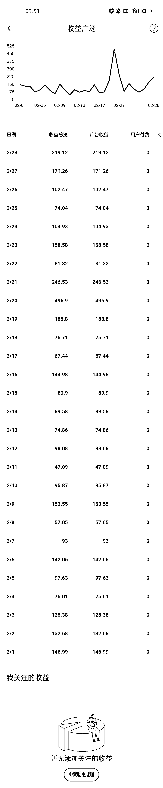

# 《百家号月入 5000~10000 元口播玩法介绍，保姆级教程来啦！》

> 原文：[`www.yuque.com/for_lazy/thfiu8/tw5hopgecg9cdm02`](https://www.yuque.com/for_lazy/thfiu8/tw5hopgecg9cdm02)

## (68 赞)《百家号月入 5000~10000 元口播玩法介绍，保姆级教程来啦！》 

作者： 书豪 

日期：2023-03-23 

大家好，我是在杭州的圈友书豪，一个连续创业三年的 95 后，目前连续三年都年入百万。 

今天给大家整理一下通过百度旗下的「百家号」平台，发布视频赚钱的攻略。 

咱们今天先讲我们最熟悉、实践经验最丰富的口播号的玩法，以月入 5000 元为例，依靠百家号月入 5000 其实是很简单的，月入 1 万就需要矩阵操作，这对大部分人来说都有难度，本篇主要讲单账号的玩法。 

# 一、如何在百家号发布视频 <ne-oli><ne-oli-i>1</ne-oli-i><ne-oli-c class="ne-oli-content" id="u174ccdee" data-lake-id="u174ccdee">注册百家号账号，登录官网：[https://baijiahao.baidu.com/](https://baijiahao.baidu.com/)，或者手机下载百家号 App。开通账号选择个人即可，然后根据步骤完成真实性验证(上传身份证啥的)。</ne-oli-c></ne-oli> <ne-oli><ne-oli-i>2</ne-oli-i><ne-oli-c class="ne-oli-content" id="ue30dddd2" data-lake-id="ue30dddd2">发布视频，官网/百家号 App 上操作即可。这里推荐蚁小二([https://www.yixiaoer.cn/](https://www.yixiaoer.cn/))，免费版支持绑定 5 个账号，可以一键多平台发布，省时省力。</ne-oli-c></ne-oli> <ne-oli><ne-oli-i>3</ne-oli-i><ne-oli-c class="ne-oli-content" id="u5f7793ee" data-lake-id="u5f7793ee">百家号支持竖版小视频，在视频号等平台的小视频可以直接发布到百家号，注意选择竖版小视频即可。</ne-oli-c></ne-oli> <ne-oli><ne-oli-i>4</ne-oli-i><ne-oli-c class="ne-oli-content" id="u32a077fc" data-lake-id="u32a077fc">竖版视频的话，封面图建议将标题居中，这样各平台裁剪封面后，标题都能正常展示，当然也支持每个平台单独去调整封面。</ne-oli-c></ne-oli> 

# 二、百家号发布视频如何赚钱 <ne-oli><ne-oli-i>1</ne-oli-i><ne-oli-c class="ne-oli-content" id="u274a08d8" data-lake-id="u274a08d8">只要发就有收益。</ne-oli-c></ne-oli> 

目前个人经验是，新人刚注册完，发了视频就有收益。新人注册应该会自动开通视频流量收益。以我个人经验为例，在开始将视频同步到百家号，一开始的几个视频播放量一般，平均每天 3-4K 播放量，收益只有 3、4 毛。前面 14 天收益低很正常，但是不要气馁，一旦你在百家号的粉丝量突破 100 个，就可以开通小视频原创标识，流量收益会突飞猛进。 <ne-oli><ne-oli-i>1</ne-oli-i><ne-oli-c class="ne-oli-content" id="u32698946" data-lake-id="u32698946">坚持渡过新手期。</ne-oli-c></ne-oli> 

新手期大概 7 天左右，会有相应的新手任务，完成后可以获得对应流量包，领取后 7 天内需要使用掉。不过百家号的流量包加速比较慢，投放后一周内生效。新手期应当多发视频并且尽快积累粉丝，争取开通视频原创认证，百粉后开通小视频原创认证。 <ne-oli><ne-oli-i>1</ne-oli-i><ne-oli-c class="ne-oli-content" id="u3ddec70f" data-lake-id="u3ddec70f">开通各种权益。</ne-oli-c></ne-oli> 

时刻关注「我的权益」中，哪些权益可以申请开通，或者自动开通了。横版视频必须开通视频原创权益，竖版视频必须开通小视频原创权益，开通这两个权益会提高收入，如果只发竖版小视频，优先保证小视频原创认证开通。如果发布了违规视频，会被扣除信用分，有时候会被回收原创权益，这个有可能会导致视频无收益。实测视频原创认证权益被收回后，仅有小视频原创认证的情况下，不影响竖版视频的收益。 

新手刚刚注册，应该就会自动开通视频流量收益。 

  <ne-oli><ne-oli-i>1</ne-oli-i><ne-oli-c class="ne-oli-content" id="u6d6e9dfa" data-lake-id="u6d6e9dfa">具体收益计算。</ne-oli-c></ne-oli> 

目前没有得出明确收益计算公式。 

从现有的信息来看，竖版视频的收入基本都是来源于广告收益，在达到万粉后，可以开通「小视频赞赏」权益，用户可以对你的小视频进行打赏，但这部分纯靠用户心情，可以忽略不计。 

而广告收益则是平台自动分发给每个视频，最终依据广告的曝光量进行收益结算，并且收益也跟用户的点赞、评论、分享等这些互动数据相挂钩，即所谓的「活力值增量」，所以一个能带动用户评论点赞的视频比单纯播放量高的视频的收益会高一些。 

所以百家号的广告收益补贴不是一个恒定值，会有较大的波动。我自己实测过有 30w 播放可能会带来 100 元的收益，也可能有 150 元左右的日收益，更极端的情况上是 30 万播放有时候会有 500 元左右的收益。 

而且每个人的账号权重都不一样，同样是 30 万播放和互动数据，也会存在你是 100 元收益，他是 200 元收益的不同情况。 

但有一个点是恒定不变的，即播放量越高，收益越多。 

  <ne-oli><ne-oli-i>1</ne-oli-i><ne-oli-c class="ne-oli-content" id="u50fc3a73" data-lake-id="u50fc3a73">收益延迟。</ne-oli-c></ne-oli> 

目前百家号的收益结算是 T+1 的，播放量的数据是当天 14 点更新前一天的播放数据，但是收益结算有可能延迟比较久，大部分情况在当天 18-19 点之后能更新前一天的收益，目测收益越高，结算延迟越高，所以当天 14 点收益如果没出来，大家也不用着急，临睡前看一眼自己前一天的收益即可，收益不会丢。 

# 三、百家号发布视频如何选择话题 

### 分两部分讲： 

#### 实测过的爆款话题 <ne-oli><ne-oli-i>1</ne-oli-i><ne-oli-c class="ne-oli-content" id="u5770f92e" data-lake-id="u5770f92e">热点相关。</ne-oli-c></ne-oli> <ne-oli><ne-oli-i>2</ne-oli-i><ne-oli-c class="ne-oli-content" id="ucd7e450e" data-lake-id="ucd7e450e">  比如胡萝卜、叶婷事件、雨衣妹妹、世界杯事件等能引起大众讨论的时事热点话题，再从多角度去分析这些事件也能获得不错的流量；</ne-oli-c></ne-oli> <ne-oli><ne-oli-i>3</ne-oli-i><ne-oli-c class="ne-oli-content" id="u9bbd3c16" data-lake-id="u9bbd3c16">  重要的话再讲一遍，口播号的话题以实时热点为优先选题。</ne-oli-c></ne-oli> <ne-oli><ne-oli-i>1</ne-oli-i><ne-oli-c class="ne-oli-content" id="u84742b4c" data-lake-id="u84742b4c">以上述热点为轴心，讲述一些与该热点可能有所牵连的事件。</ne-oli-c></ne-oli> <ne-oli><ne-oli-i>2</ne-oli-i><ne-oli-c class="ne-oli-content" id="u8227c61a" data-lake-id="u8227c61a">  比如从胡萝卜失踪的角度出发，可以引申出贩卖人口、器官买卖、校园安全、家庭教育等等相关的话题，这种好处是可以将热点事件用户引流到自己的垂类群体上，同时提供更多的选题角度。如世界杯事件，以及其中相关的赛事以及热点人物梅西的人生过往励志经历等</ne-oli-c></ne-oli> 

#### 非实测但一直都是热门的话题 <ne-oli><ne-oli-i>1</ne-oli-i><ne-oli-c class="ne-oli-content" id="u95670dc5" data-lake-id="u95670dc5">影视剪辑，无需露脸，这个在哪个平台都火，但要剪好也是一门技术，且要面临版权的问题，影视剪辑做得好的话，可以在「好看视频」（百家号上横屏视频的发布平台）上发布，收益单价相对于竖屏小视频来说更高一些；</ne-oli-c></ne-oli> <ne-oli><ne-oli-i>2</ne-oli-i><ne-oli-c class="ne-oli-content" id="u8cfbc2d7" data-lake-id="u8cfbc2d7">娱乐八卦，也是在哪个平台都火；</ne-oli-c></ne-oli> <ne-oli><ne-oli-i>3</ne-oli-i><ne-oli-c class="ne-oli-content" id="u2a8cb610" data-lake-id="u2a8cb610">美女！！！（比如 世界杯啦啦队直拍）百家号动态里，通过美女图片涨粉的很多，现在 AI 绘图很流行，完全可以 AI 生成图片来涨粉，但要注意尺度，被封就得不偿失；</ne-oli-c></ne-oli> <ne-oli><ne-oli-i>4</ne-oli-i><ne-oli-c class="ne-oli-content" id="ufd541a8d" data-lake-id="ufd541a8d">传奇人物类的选题也可以考虑，就以讲故事的形式进行介绍，带动观众，大家都爱听故事。部分猎奇且大众化选题，也可尝试诗词等小众领域不推荐，百家号流量池子太小，精细赛道没那么多受众。</ne-oli-c></ne-oli> <ne-oli><ne-oli-i>5</ne-oli-i><ne-oli-c class="ne-oli-content" id="u9a0a8243" data-lake-id="u9a0a8243">军事/历史类如果有兴趣，是一个大的方向，但是用户评论的走向不太好受把控</ne-oli-c></ne-oli> <ne-oli><ne-oli-i>6</ne-oli-i><ne-oli-c class="ne-oli-content" id="u57dc785b" data-lake-id="u57dc785b">情感/鸡汤类，百家号用户群体年纪与视频号差不多，年龄层偏大，家家有本难念的经，所以情感类也是一个大方向</ne-oli-c></ne-oli> 

### 测试过的爆款选题 

中国哪个省最安全 

中国科学界最大的悲哀 

中国男足我错了向你们郑重道歉 

河南为什么被黑的最惨 

中国近 1000 年最伟大的人是谁 

江苏天才少女放弃美国国籍 

特斯拉被中国工厂深深地上了一课 

张艺谋移民 

李宁事件 

姚桐斌 

大汉奸 

...... 

重要的话再讲一遍，实时热点为优先选题。 

热点是社会大众都关注的话题，只有大热点，才有百万千万的单视频播放流量。1000 万播放流量可以赚到 5000 元左右，本人已经赚到了，亲测项目。 

# 四、不能碰的敏感话题 <ne-oli><ne-oli-i>1</ne-oli-i><ne-oli-c class="ne-oli-content" id="u0072cdac" data-lake-id="u0072cdac">宣扬不良文化和不良生活方式，表现消极颓废的人生观、世界观和价值观；</ne-oli-c></ne-oli> <ne-oli><ne-oli-i>2</ne-oli-i><ne-oli-c class="ne-oli-content" id="ue826a5fa" data-lake-id="ue826a5fa">宣扬拜金主义、奢靡之风、享乐主义、极端个人主义；</ne-oli-c></ne-oli> <ne-oli><ne-oli-i>3</ne-oli-i><ne-oli-c class="ne-oli-content" id="u66820e81" data-lake-id="u66820e81">对西方文化进行全面性肯定，强化殖民文化心理，否定中华传统文化；</ne-oli-c></ne-oli> <ne-oli><ne-oli-i>4</ne-oli-i><ne-oli-c class="ne-oli-content" id="u02bb4286" data-lake-id="u02bb4286">美化不正义战争及人物，如美化法西斯侵略战争及侵略行为，美化日本侵略中国等给人类造成极大灾难的历史事件；</ne-oli-c></ne-oli> <ne-oli><ne-oli-i>5</ne-oli-i><ne-oli-c class="ne-oli-content" id="u8aff334c" data-lake-id="u8aff334c">个人或自媒体发布无著作权的内容；</ne-oli-c></ne-oli> <ne-oli><ne-oli-i>6</ne-oli-i><ne-oli-c class="ne-oli-content" id="ue28064c9" data-lake-id="ue28064c9">借社会负面现象宣扬悲观和偏激论调，以偏概全渲染负面情绪，对局势进行过度消极预测和分析的内容；</ne-oli-c></ne-oli> <ne-oli><ne-oli-i>7</ne-oli-i><ne-oli-c class="ne-oli-content" id="u01f5ff0f" data-lake-id="u01f5ff0f">对房价升降、经济形式等关系民生的社会事件进行悲观预测分析，制造恐慌情绪。</ne-oli-c></ne-oli> <ne-oli><ne-oli-i>8</ne-oli-i><ne-oli-c class="ne-oli-content" id="uc129e2dc" data-lake-id="uc129e2dc">伪科学</ne-oli-c></ne-oli> <ne-oli><ne-oli-i>9</ne-oli-i><ne-oli-c class="ne-oli-content" id="ub2fdad7e" data-lake-id="ub2fdad7e">其他平台的广告信息（微信、淘宝、西瓜视频等等）</ne-oli-c></ne-oli> <ne-oli><ne-oli-i>10</ne-oli-i><ne-oli-c class="ne-oli-content" id="udb018502" data-lake-id="udb018502">医疗敏感：涉及中药偏方，土方等，无依据判定是否真实有效，存在误导用户就医风险；涉及癌症等重大疾病治疗方法，存在误导用户就医风险。</ne-oli-c></ne-oli> 

如若有球友在采纳本攻略上的策略执行之，遇到问题，可以找到我们，我们可以给你提供解答，你自己悄悄执行也没问题，也很想知道对大家是否有用，不枉我们一番整理。 

#### 最后抱团取暖才是王道 <ne-oli><ne-oli-i>1</ne-oli-i><ne-oli-c class="ne-oli-content" id="ua2378996" data-lake-id="ua2378996">【利他是最大的利己】</ne-oli-c></ne-oli> <ne-oli><ne-oli-i>2</ne-oli-i><ne-oli-c class="ne-oli-content" id="ue53d5176" data-lake-id="ue53d5176">【真诚是最有效的套路】</ne-oli-c></ne-oli> 

评论区： 

cocomany : 播放就有收益，是不是也可发到中视频？ 郭耀天 : 剩下几百个账号 有用处了 书豪 : 中视频是 1 分钟以上的横板视频，我们一般以竖版视频为核心 书豪 : 猛干 lydia : 视频是原创吗 书豪 : 原创 Ruigo : 文案难写啊 书豪 : 招对标账号