# 《团队年净利润达 30W+ 的百度竞价冷门项目投放策略分享》

> 原文：[`www.yuque.com/for_lazy/thfiu8/nzk68eqsh1umoyx7`](https://www.yuque.com/for_lazy/thfiu8/nzk68eqsh1umoyx7)

<ne-h2 id="6e8476ac" data-lake-id="6e8476ac"><ne-heading-ext><ne-heading-anchor></ne-heading-anchor><ne-heading-fold></ne-heading-fold></ne-heading-ext><ne-heading-content><ne-text id="u5f3765f6">(37 赞)《团队年净利润达 30W+ 的百度竞价冷门项目投放策略分享》</ne-text></ne-heading-content></ne-h2> <ne-p id="u62b53ba0" data-lake-id="u62b53ba0"><ne-text id="uc0498205">作者： 王永超</ne-text></ne-p> <ne-p id="u026ef2bc" data-lake-id="u026ef2bc"><ne-text id="u709a09b0">日期：2023-03-23</ne-text></ne-p> <ne-p id="u75507a6e" data-lake-id="u75507a6e"><ne-text id="u55beeae8">百度竞价冷门项目就是花钱去购买客户，那具体怎么操作？接下来我就给大家展开讲讲做这个百度蓝海项目的六个步骤：</ne-text></ne-p> <ne-p id="u4a1c1554" data-lake-id="u4a1c1554"><ne-text id="ua7ab87ff">1、找到一款自己能打得过的产品</ne-text></ne-p> <ne-p id="u2c36f3e0" data-lake-id="u2c36f3e0"><ne-text id="u6028276f">2、一个可以正常投放百度账户，开户金：2400 广告费</ne-text></ne-p> <ne-p id="u19bc3595" data-lake-id="u19bc3595"><ne-text id="u677c5d9e">3、准备一个承接流量的微信号</ne-text></ne-p> <ne-p id="u9456b0c8" data-lake-id="u9456b0c8"><ne-text id="uaa7aceeb">4、把这款产品通过百度账户投放广告，让客户看见加到微信上</ne-text></ne-p> <ne-p id="u420f4710" data-lake-id="u420f4710"><ne-text id="u0157de20">5、在微信上把产品卖出去</ne-text></ne-p> <ne-p id="u85196321" data-lake-id="u85196321"><ne-text id="ua056b8f0">6、赚的钱复投到广告中</ne-text></ne-p> <ne-p id="u91430431" data-lake-id="u91430431"><ne-text id="uca15d337">同时讲解从百度上花钱购买客户，通过百度账户以小见大，窥探整个投放领域的投放策略，这不仅限于百度投放，小红书等多个平台都可以参考，只要产品找得对，投放策略打好就有机会赚钱。</ne-text></ne-p> <ne-p id="uf8eb3a57" data-lake-id="uf8eb3a57"><ne-text id="u7d1aee61">以下是全文目录，便于圈友们对本篇文章的了解，也更方便大家阅读：</ne-text></ne-p> <ne-p id="u46c94516" data-lake-id="u46c94516"><ne-text id="ufb777016">一、项目介绍</ne-text></ne-p> <ne-p id="ucb88cd03" data-lake-id="ucb88cd03"><ne-text id="uc82535af">二、项目核心</ne-text></ne-p> <ne-p id="u25921452" data-lake-id="u25921452"><ne-text id="ufb95fc22">三、选品</ne-text></ne-p> <ne-p id="u81175904" data-lake-id="u81175904"><ne-text id="u94f9b3a2">四、获取流量</ne-text></ne-p> <ne-p id="u49ef78fd" data-lake-id="u49ef78fd"><ne-text id="u5831dea9">五、承接进入私域</ne-text></ne-p> <ne-p id="u92ca5abe" data-lake-id="u92ca5abe"><ne-text id="u972c4862">六、投放外番</ne-text></ne-p> <ne-p id="u09c2f779" data-lake-id="u09c2f779"><ne-text id="ua8210da4">七、投放避坑（适用于所有平台）</ne-text></ne-p> <ne-p id="u7f26ce85" data-lake-id="u7f26ce85"><ne-text id="ue918b5d2">八、新人想做的门槛和建议</ne-text></ne-p> <ne-h1 id="22b5e354" data-lake-id="22b5e354"><ne-heading-ext><ne-heading-anchor></ne-heading-anchor><ne-heading-fold></ne-heading-fold></ne-heading-ext><ne-heading-content><ne-text id="uf12e9a3b">一、介绍</ne-text></ne-heading-content></ne-h1> <ne-p id="u7219d2d5" data-lake-id="u7219d2d5">[<ne-text id="u4d82ca85">王永超的成长历程</ne-text>](https://crse5s1mvs.feishu.cn/docx/HwIpdn7mVoBc24xPs13cVTQtnzf) <ne-text id="u6444cf2c">想看看的可以了解下，影响不大</ne-text></ne-p> <ne-h2 id="6f85edf7" data-lake-id="6f85edf7"><ne-heading-ext><ne-heading-anchor></ne-heading-anchor><ne-heading-fold></ne-heading-fold></ne-heading-ext><ne-heading-content><ne-text id="udc290fe0">（1）项目介绍</ne-text></ne-heading-content></ne-h2> <ne-p id="ubf241147" data-lake-id="ubf241147"><ne-text id="ucbee6e73">百度竞价冷门项目，是通过从百度上找到一些蓝海产品，通过投放广告获取流量，卖出产品的</ne-text></ne-p> <ne-p id="uc3d2cafc" data-lake-id="uc3d2cafc"><ne-text id="u4442e83a">找到百度上正在投放广告的产品中自己能打得过的同行，自己开个户去投放广告，截取流量来卖这款产品</ne-text></ne-p> <ne-h2 id="c0530f92" data-lake-id="c0530f92"><ne-heading-ext><ne-heading-anchor></ne-heading-anchor><ne-heading-fold></ne-heading-fold></ne-heading-ext><ne-heading-content><ne-text id="uf13ab098">（2）项目流程</ne-text></ne-heading-content></ne-h2> <ne-p id="u6117a364" data-lake-id="u6117a364"><ne-text id="ua0b408b9">① 找到一款自己能打得过的产品</ne-text></ne-p> <ne-p id="uffe176d0" data-lake-id="uffe176d0"><ne-text id="u95884e56">②一个可以正常投放百度账户，开户金：2400 广告费</ne-text></ne-p> <ne-p id="u33063666" data-lake-id="u33063666"><ne-text id="u710cd2a8">③准备一个承接流量的微信号</ne-text></ne-p> <ne-p id="u5260cac4" data-lake-id="u5260cac4"><ne-text id="u1df48761">④把这款产品通过百度账户投放广告，让客户看见加到微信上</ne-text></ne-p> <ne-p id="u610e5d5a" data-lake-id="u610e5d5a"><ne-text id="u25e75d73">⑤在微信上把产品卖出去</ne-text></ne-p> <ne-p id="u39aa33c4" data-lake-id="u39aa33c4"><ne-text id="ud765a921">⑥赚的钱复投到广告中</ne-text></ne-p> <ne-h1 id="929d59b3" data-lake-id="929d59b3"><ne-heading-ext><ne-heading-anchor></ne-heading-anchor><ne-heading-fold></ne-heading-fold></ne-heading-ext><ne-heading-content><ne-text id="ufc268e09">二、项目核心</ne-text></ne-heading-content></ne-h1> <ne-p id="u46c9d191" data-lake-id="u46c9d191"><ne-text id="u7101e999" ne-bold="true">（1）广告投放获取客户</ne-text></ne-p> <ne-p id="u93477781" data-lake-id="u93477781"><ne-text id="uc24a5cce">分为两种，一种叫做信息流广告，一种叫做搜索广告</ne-text></ne-p> <ne-p id="uc69c9b3f" data-lake-id="uc69c9b3f"><ne-text id="u44d341a1">信  息  流：货找人</ne-text></ne-p> <ne-p id="u48c25657" data-lake-id="u48c25657"><ne-text id="ua93af866">搜索广告：人找货</ne-text></ne-p> <ne-p id="uf17b63ce" data-lake-id="uf17b63ce"><ne-text id="u6601b7b9">搜索广告是最精准的广告。</ne-text></ne-p> <ne-p id="u06501752" data-lake-id="u06501752"><ne-text id="u86114279">我做的就是这个，也尝试过信息流，不赚钱也就没继续学，本质上是可以盈利的，</ne-text><ne-text id="u276d0e0f" style="background-color: rgba(255, 246, 122, 0.8);">有同行再投</ne-text></ne-p> <ne-p id="u65e1849a" data-lake-id="u65e1849a"><ne-text id="u46bd3db0" style="background-color: rgba(255, 246, 122, 0.8);">有同行在投放</ne-text><ne-text id="u8df7dbe6">，记住这句话，有人长期投放的，它就不可能不赚钱</ne-text></ne-p> <ne-p id="u856fa26a" data-lake-id="u856fa26a"><ne-text id="uf9f4e832">无论什么项目，如果有一个人一直在做，半年，一年都在做，那这个项目就不可能不赚钱，如果不赚钱就是自己不赚钱</ne-text></ne-p> <ne-h2 id="acd1ce05" data-lake-id="acd1ce05"><ne-heading-ext><ne-heading-anchor></ne-heading-anchor><ne-heading-fold></ne-heading-fold></ne-heading-ext><ne-heading-content><ne-text id="ub6aaf019">（2）选品：找价格不是很透明且同行不如自己的产品</ne-text></ne-heading-content></ne-h2> <ne-p id="u9ffeaef7" data-lake-id="u9ffeaef7"><ne-text id="u1933116a">价格透明是相对的，没有绝对透明或者不透明。</ne-text></ne-p> <ne-p id="uc55ce3cb" data-lake-id="uc55ce3cb"><ne-text id="u205fcf7d">我们找的也都是相对不透明的产品，例如：虚拟资料，滋补品，玉石，檀香，机械，无牌电子产品等等</ne-text></ne-p> <ne-h1 id="852f0be9" data-lake-id="852f0be9"><ne-heading-ext><ne-heading-anchor></ne-heading-anchor><ne-heading-fold></ne-heading-fold></ne-heading-ext><ne-heading-content><ne-text id="u65e6ebff">三、选品</ne-text></ne-heading-content></ne-h1> <ne-p id="u9fb4b22e" data-lake-id="u9fb4b22e"><ne-text id="udc4ad036">选品本质上肯定是要有利润的产品，因为我们有广告费，需要用利润覆盖广告费和成本，这也是为什么选择价格不透明的产品，方便加价。</ne-text></ne-p> <ne-p id="u5a3bc103" data-lake-id="u5a3bc103"><ne-text id="u1c313f6a">同时我也把选品分成 3 个小结：</ne-text></ne-p> <ne-p id="u5f909d9f" data-lake-id="u5f909d9f"><ne-text id="ub1e9b1ef">①选品</ne-text></ne-p> <ne-p id="u8933168a" data-lake-id="u8933168a"><ne-text id="u86e73200">②验证产品</ne-text></ne-p> <ne-p id="u72617f33" data-lake-id="u72617f33"><ne-text id="ud3f76588">③干掉产品</ne-text></ne-p> <ne-p id="ue181daa3" data-lake-id="ue181daa3"><ne-text id="u3a372636">行内的两句话：</ne-text></ne-p> <ne-p id="udec2f175" data-lake-id="udec2f175"><ne-text id="u10eac61d">①万物皆可投</ne-text></ne-p> <ne-p id="u774d7e14" data-lake-id="u774d7e14"><ne-text id="ua128f58e">②百度不倒，竞价到老</ne-text></ne-p> <ne-h2 id="bb0b2249" data-lake-id="bb0b2249"><ne-heading-ext><ne-heading-anchor></ne-heading-anchor><ne-heading-fold></ne-heading-fold></ne-heading-ext><ne-heading-content><ne-text id="ud8a26ec7">（1）选品</ne-text></ne-heading-content></ne-h2> <ne-p id="u5fd2d3ef" data-lake-id="u5fd2d3ef"><ne-text id="uc1d416b2">将产品分为虚拟产品和实物产品两种来讲，还有一种高利润产品，我了解的不多简单说一下，本人没有做，一共有 3 种选品方法</ne-text></ne-p> <ne-p id="uf3368ebf" data-lake-id="uf3368ebf"><ne-text id="u6fda1cce" ne-bold="true">① 淘宝搜索</ne-text></ne-p> <ne-p id="u6ffd6713" data-lake-id="u6ffd6713"><ne-text id="u2bc7f60b" ne-bold="true">1）虚拟资料</ne-text></ne-p> <ne-p id="u32f11b7e" data-lake-id="u32f11b7e"><ne-text id="u42c3a54e">去搜索特定的关键词教程，课程，资料等，像下面这个闲鱼教程，在百度就有投放的</ne-text></ne-p> <ne-p id="u609d109e" data-lake-id="u609d109e"><ne-card data-card-name="image" data-card-type="inline" id="o7bJ5" data-event-boundary="card">  <ne-p id="uf63c4001" data-lake-id="uf63c4001"><ne-card data-card-name="image" data-card-type="inline" id="xm6ju" data-event-boundary="card">  <ne-p id="ued03cc25" data-lake-id="ued03cc25"><ne-text id="u9fd25751">只是简单搜一下，想玩的话可以自己搜索看，现在使用百度搜索，并且不知道这种资料淘宝能买的人群画像需要了解，年龄主要分布在 35 岁以上，三四线城市为主，等等</ne-text></ne-p> <ne-h4 id="7039832e" data-lake-id="7039832e"><ne-heading-ext><ne-heading-anchor></ne-heading-anchor><ne-heading-fold></ne-heading-fold></ne-heading-ext><ne-heading-content><ne-text id="u13aa54a8">2）实物产品</ne-text></ne-heading-content></ne-h4> <ne-p id="u5ca6dd59" data-lake-id="u5ca6dd59"><ne-text id="u76bfdf7e">特定的关键词：黑科技，机器，风水工具等等，扫地机器人之前我老师卖过，</ne-text></ne-p> <ne-p id="u968a445c" data-lake-id="u968a445c"><ne-card data-card-name="image" data-card-type="inline" id="dhMzz" data-event-boundary="card">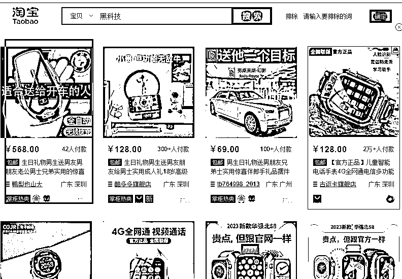  <ne-p id="u8a79f493" data-lake-id="u8a79f493"><ne-card data-card-name="image" data-card-type="inline" id="DFqB1" data-event-boundary="card">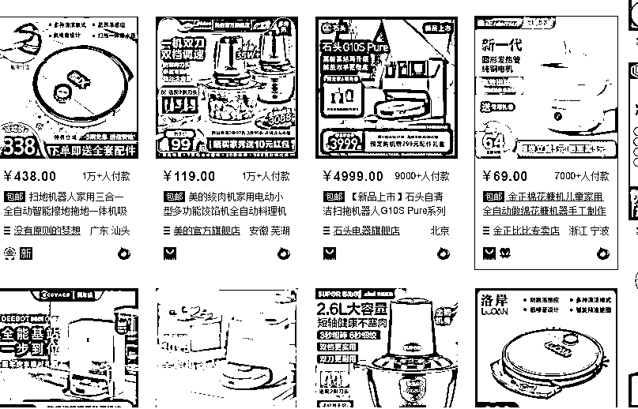  <ne-p id="u0b93b097" data-lake-id="u0b93b097"><ne-card data-card-name="image" data-card-type="inline" id="uugNl" data-event-boundary="card">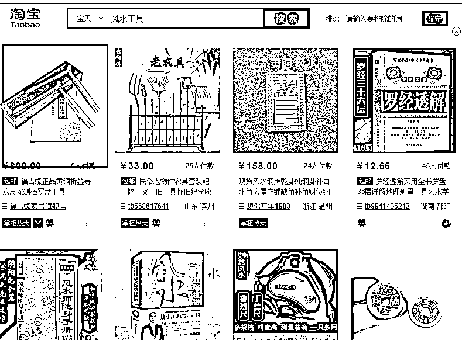  <ne-p id="u4dda4d12" data-lake-id="u4dda4d12"><ne-text id="uf330640c">实物产品很多产品这样搜，搜不出来。</ne-text></ne-p> <ne-p id="ua2ea9e79" data-lake-id="ua2ea9e79"><ne-text id="uc2ca7893">没有特别固定的关键词，只能找自己知道的那个小类别，里面的产品不透明</ne-text></ne-p> <ne-h4 id="ac5af26c" data-lake-id="ac5af26c"><ne-heading-ext><ne-heading-anchor></ne-heading-anchor><ne-heading-fold></ne-heading-fold></ne-heading-ext><ne-heading-content><ne-text id="ue4e58f08">3）高利润产品</ne-text></ne-heading-content></ne-h4> <ne-p id="ue96d29ae" data-lake-id="ue96d29ae"><ne-text id="u6e8acec3">特定关键词：野生，天然，机器，培训班，加盟等</ne-text></ne-p> <ne-p id="ud0c4b2a6" data-lake-id="ud0c4b2a6"><ne-card data-card-name="image" data-card-type="inline" id="pvjT6" data-event-boundary="card">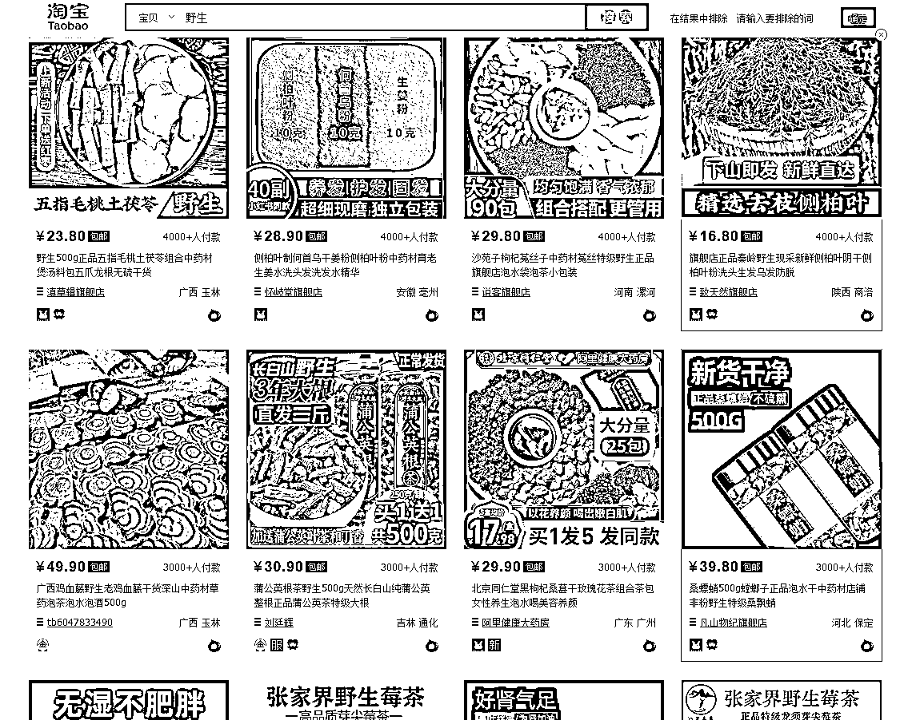  <ne-p id="u87dec98d" data-lake-id="u87dec98d"><ne-card data-card-name="image" data-card-type="inline" id="kbQPf" data-event-boundary="card">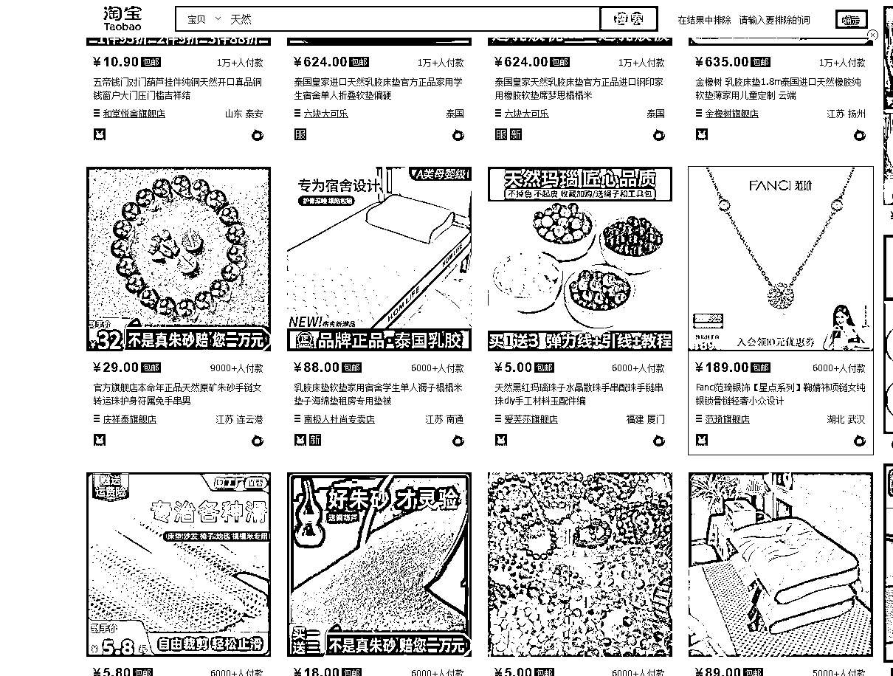  <ne-p id="ua335ed21" data-lake-id="ua335ed21"><ne-text id="uc659e13f">还有同城服务，可以去 58 上找，</ne-text></ne-p> <ne-p id="u30b35495" data-lake-id="u30b35495"><ne-card data-card-name="image" data-card-type="inline" id="xU9OR" data-event-boundary="card">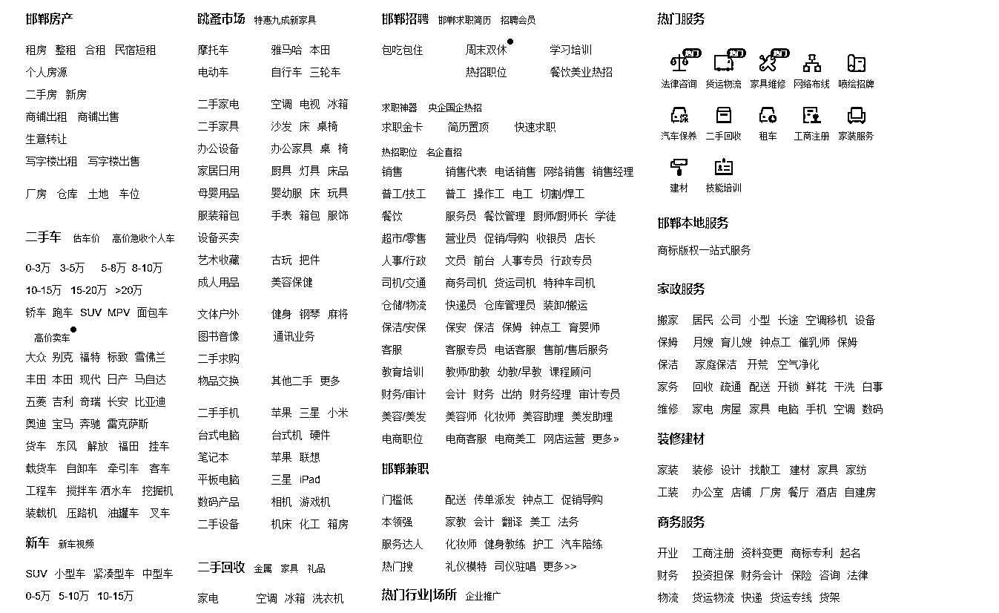  <ne-h3 id="f2d8f8c0" data-lake-id="f2d8f8c0"><ne-heading-ext><ne-heading-anchor></ne-heading-anchor><ne-heading-fold></ne-heading-fold></ne-heading-ext><ne-heading-content><ne-text id="uec57019f">② 商家店铺</ne-text></ne-heading-content></ne-h3> <ne-p id="uc18d6915" data-lake-id="uc18d6915"><ne-text id="u6fa03fa4">一般淘宝上卖一种产品的人，通常还有其他同类型的产品，例如：ai 教程</ne-text></ne-p> <ne-p id="u9ef596a6" data-lake-id="u9ef596a6"><ne-card data-card-name="image" data-card-type="inline" id="G7wNt" data-event-boundary="card">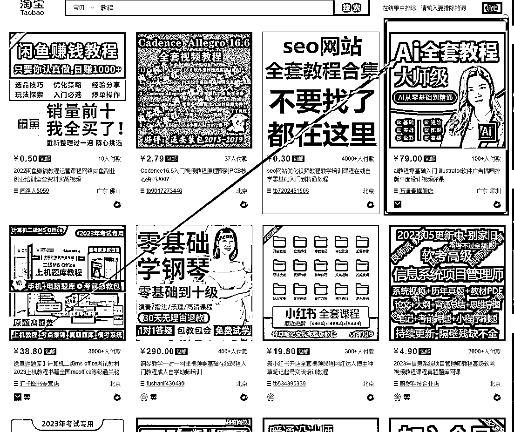  <ne-p id="u7e905a49" data-lake-id="u7e905a49"><ne-text id="uef3ec21d">点进去是这样的</ne-text></ne-p> <ne-p id="u55ffa53b" data-lake-id="u55ffa53b"><ne-card data-card-name="image" data-card-type="inline" id="JpxZH" data-event-boundary="card">  <ne-p id="u7084bf47" data-lake-id="u7084bf47"><ne-text id="u4ed0a71e">再比如：党参，点进去这些基本都有人在卖，感兴趣的可以去搜一下</ne-text></ne-p> <ne-p id="ub92ef87f" data-lake-id="ub92ef87f"><ne-card data-card-name="image" data-card-type="inline" id="HIulI" data-event-boundary="card">  <ne-p id="u3364a967" data-lake-id="u3364a967"><ne-card data-card-name="image" data-card-type="inline" id="fkdCd" data-event-boundary="card">  <ne-p id="u084889c4" data-lake-id="u084889c4"><ne-text id="uf4a5ea69">不能点，你们知道吗，一点同行的，我的产品都出来了（捂脸笑），在我们这行忌讳谈论产品</ne-text></ne-p> <ne-h3 id="b2ef66dd" data-lake-id="b2ef66dd"><ne-heading-ext><ne-heading-anchor></ne-heading-anchor><ne-heading-fold></ne-heading-fold></ne-heading-ext><ne-heading-content><ne-text id="u13d9d89e">③ 5118 长尾词</ne-text></ne-heading-content></ne-h3> <ne-p id="u205c85c0" data-lake-id="u205c85c0"><ne-text id="u1dfae758">一样搜索关键词就可以了（试用所有类型的产品）</ne-text></ne-p> <ne-p id="u951da633" data-lake-id="u951da633"><ne-card data-card-name="image" data-card-type="inline" id="IFlRR" data-event-boundary="card">  <ne-p id="ua8c1b981" data-lake-id="ua8c1b981"><ne-card data-card-name="image" data-card-type="inline" id="D6Pqe" data-event-boundary="card">  <ne-p id="ue52538e1" data-lake-id="ue52538e1"><ne-card data-card-name="image" data-card-type="inline" id="hzwfY" data-event-boundary="card">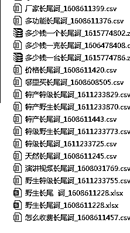  <ne-p id="u508031ea" data-lake-id="u508031ea"><ne-text id="ue9f448d1">这个是我之前挖的词，基本上大部分产品都可以挖出来，找的时候很费力，但是找到一款特别好的产品，还没什么同行就爽歪歪了。我就有这种产品，哈哈哈</ne-text></ne-p> <ne-h2 id="b857ea6b" data-lake-id="b857ea6b"><ne-heading-ext><ne-heading-anchor></ne-heading-anchor><ne-heading-fold></ne-heading-fold></ne-heading-ext><ne-heading-content><ne-text id="u6e087ab4">（2）验证产品</ne-text></ne-heading-content></ne-h2> <ne-h4 id="53411278" data-lake-id="53411278"><ne-heading-ext><ne-heading-anchor></ne-heading-anchor><ne-heading-fold></ne-heading-fold></ne-heading-ext><ne-heading-content><ne-text id="u3026f1f1">① 淘宝购买人数（证明这个产品有需求）</ne-text></ne-heading-content></ne-h4> <ne-p id="u99f9f5c0" data-lake-id="u99f9f5c0"><ne-text id="u8a2e492f">这个数值，我现在不怎么看了，但是如果是打算专注一个行业，比如说就要做人参的，那肯定要好好看了</ne-text></ne-p> <ne-p id="u71ff5591" data-lake-id="u71ff5591"><ne-card data-card-name="image" data-card-type="inline" id="Y7BEW" data-event-boundary="card">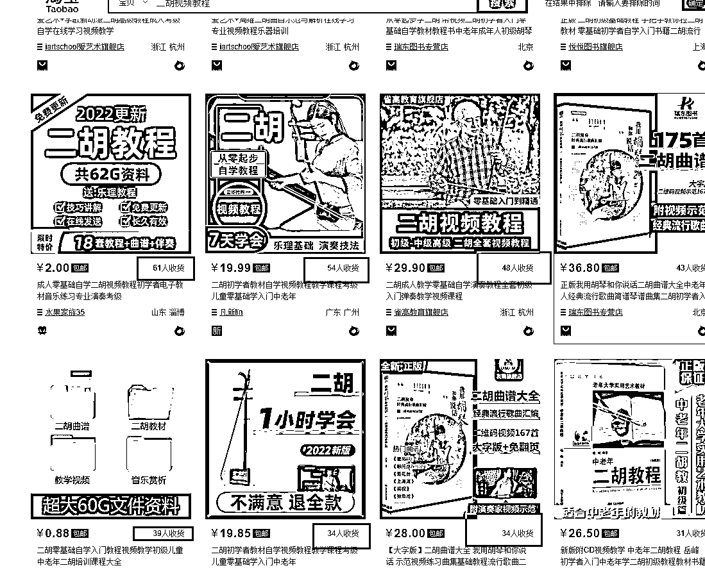  <ne-p id="ucfb05577" data-lake-id="ucfb05577"><ne-card data-card-name="image" data-card-type="inline" id="ok3gM" data-event-boundary="card">  <ne-h4 id="25694099" data-lake-id="25694099"><ne-heading-ext><ne-heading-anchor></ne-heading-anchor><ne-heading-fold></ne-heading-fold></ne-heading-ext><ne-heading-content><ne-text id="uaf8c3f71">③ 百度有人长期投放（证明在百度上能赚钱）</ne-text></ne-heading-content></ne-h4> <ne-p id="u4b6bc9d4" data-lake-id="u4b6bc9d4"><ne-text id="ucb9cbd85">还是那句话，有同行在长期投放的，肯定赚钱，他们投放花的也是真金白银啊，这样我们赚钱的概率会高一些</ne-text></ne-p> <ne-p id="ue7bfa511" data-lake-id="ue7bfa511"><ne-card data-card-name="image" data-card-type="inline" id="dxA09" data-event-boundary="card">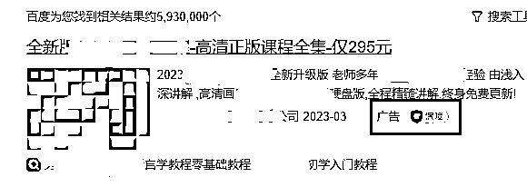  <ne-p id="u8fd1c5ee" data-lake-id="u8fd1c5ee"><ne-card data-card-name="image" data-card-type="inline" id="eXHD7" data-event-boundary="card">  <ne-p id="ud27104ef" data-lake-id="ud27104ef"><ne-text id="u20536e52">这就是同行</ne-text></ne-p> <ne-h4 id="739a19ad" data-lake-id="739a19ad"><ne-heading-ext><ne-heading-anchor></ne-heading-anchor><ne-heading-fold></ne-heading-fold></ne-heading-ext><ne-heading-content><ne-text id="u1ba9eacc">③ 百度关键词规划师里搜索量（这个代表有人在百度找这个产品）</ne-text></ne-heading-content></ne-h4> <ne-p id="u6dcf2327" data-lake-id="u6dcf2327"><ne-text id="u62234be2">这个搜索量还表示一周内搜这个产品的人，这就决定了，你这个产品能赚多少钱</ne-text></ne-p> <ne-p id="u9071dd9a" data-lake-id="u9071dd9a"><ne-text id="u44f11c10">比如：二胡教程，周搜索量 80，就代表平均一周搜有 80 次搜索</ne-text></ne-p> <ne-p id="uea7286ae" data-lake-id="uea7286ae"><ne-card data-card-name="image" data-card-type="inline" id="cThXj" data-event-boundary="card">  <ne-p id="u36c95a16" data-lake-id="u36c95a16"><ne-text id="u0786faff">咱们再看下人参，这相当于一周搜索 7900 次，平均每天 1100 多次搜索。</ne-text></ne-p> <ne-p id="u5fa85d3f" data-lake-id="u5fa85d3f"><ne-card data-card-name="image" data-card-type="inline" id="SvRV8" data-event-boundary="card">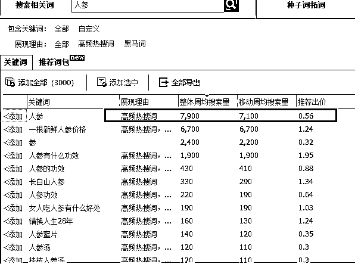  <ne-p id="ud7892eb1" data-lake-id="ud7892eb1"><ne-text id="u0ec5b526">这个数据就决定了，我们能赚多少钱</ne-text></ne-p> <ne-h2 id="5600e642" data-lake-id="5600e642"><ne-heading-ext><ne-heading-anchor></ne-heading-anchor><ne-heading-fold></ne-heading-fold></ne-heading-ext><ne-heading-content><ne-text id="ub8fc6759">（3）测试产品</ne-text></ne-heading-content></ne-h2> <ne-p id="ue97466bc" data-lake-id="ue97466bc"><ne-text id="u38179d70" ne-bold="true">① 低价</ne-text></ne-p> <ne-p id="ucd23d430" data-lake-id="ucd23d430"><ne-text id="ub278e17a">投放一单的利润，还不赚钱，并且去看关键词，搜索词，无刷量，就可以删掉，下一个了，</ne-text></ne-p> <ne-p id="u0fb8b742" data-lake-id="u0fb8b742"><ne-text id="u9bfb5f61">一般同时测的产品很多，我们每天都会加几个产品，有时候翻翻之前的删掉的品，再看看，再上试试</ne-text></ne-p> <ne-p id="ua91e17ae" data-lake-id="ua91e17ae"><ne-text id="ufcd8d5aa">例如：我投放了“二胡教程”这个产品,然后，整个二胡教程消费了 200 元，到达我的预期了，</ne-text></ne-p> <ne-p id="uaae27694" data-lake-id="uaae27694"><ne-text id="u40461483">关键词：</ne-text></ne-p> <ne-p id="u9b141764" data-lake-id="u9b141764"><ne-text id="u8c2c7520">关键词：二胡入门基础教程，</ne-text></ne-p> <ne-p id="u2b9bb872" data-lake-id="u2b9bb872"><ne-text id="u85426253">200 中有 180 都是这个词消费的，我就会把这个词删掉，再试试</ne-text></ne-p> <ne-p id="u194ce318" data-lake-id="u194ce318"><ne-text id="u309266ea">搜索词：</ne-text></ne-p> <ne-p id="u4e135aca" data-lake-id="u4e135aca"><ne-text id="u34f41eb1">所有搜索词中带有“免费”这个词的消费了 150，就把这个词否掉再试试</ne-text></ne-p> <ne-p id="u88e205c1" data-lake-id="u88e205c1"><ne-text id="u4e3c38e8">刷量：</ne-text></ne-p> <ne-p id="u84c78959" data-lake-id="u84c78959"><ne-text id="uf73530d9">搜索词：二胡教程</ne-text></ne-p> <ne-p id="u14a914af" data-lake-id="u14a914af"><ne-text id="u3fe05593">全部是搜索这一个词的，这一个词消费了 198，就把这个词否掉，或者把对应的关键词停掉</ne-text></ne-p> <ne-p id="u7069b642" data-lake-id="u7069b642"><ne-text id="u446af02e" ne-bold="true">特殊提醒：</ne-text></ne-p> <ne-p id="u4a993e74" data-lake-id="u4a993e74"><ne-text id="u720fadcf">千万不要留恋一个产品或者词，我之前有个品每个月能赚 5 千多，突然开始下滑了，慢慢不赚钱了，我的品太多，后来忘记了，发现时候，已经赔 2 千了</ne-text></ne-p> <ne-p id="uc797f948" data-lake-id="uc797f948"><ne-text id="u70698b40">一旦发现它不赚钱，流量没有问题，直接掐掉</ne-text></ne-p> <ne-p id="u24479256" data-lake-id="u24479256"><ne-text id="u06b1688c">同行的话，如果做的是其他平台，可以在做的平台上找同行，如果有个人在做，并且赚钱，上就行了，不要犹豫</ne-text></ne-p> <ne-p id="u5aabf10e" data-lake-id="u5aabf10e"><ne-text id="uab3c1b2c">给你看下，懒的结果，我 22 年 8 月份前后的 4 个月中投放了 1 个半月，其中一个账户的数据</ne-text></ne-p> <ne-p id="u1ceb960a" data-lake-id="u1ceb960a"><ne-text id="uc6c6d61d">最前面的是产品，我给截掉了，最下面有几十个产品都是非常赔钱的，一般词没问题赔钱超过 300 我就干掉了</ne-text></ne-p> <ne-p id="u49fb3462" data-lake-id="u49fb3462">[<ne-text id="u4051c1aa">1b6ed38e954b7ef20357c606f02151e.png</ne-text>](https://crse5s1mvs.feishu.cn/file/boxcnMqPpiCqxozPbBIXt2azrvh)</ne-p> <ne-p id="ud3cf4d81" data-lake-id="ud3cf4d81"><ne-text id="u91a098ef" ne-bold="true">② 高价</ne-text></ne-p> <ne-p id="ub02a0ead" data-lake-id="ub02a0ead"><ne-text id="u0d048665">这类产品相对来说，同行的质量度会高很多，需要判断是否能打得过同行，自己是否能支撑的起来这款产品</ne-text></ne-p> <ne-h4 id="1c4cc4c5" data-lake-id="1c4cc4c5"><ne-heading-ext><ne-heading-anchor></ne-heading-anchor><ne-heading-fold></ne-heading-fold></ne-heading-ext><ne-heading-content><ne-text id="ua1defd21">1）产品的加粉成本我是否能坚持下来？</ne-text></ne-heading-content></ne-h4> <ne-p id="ud149d33c" data-lake-id="ud149d33c"><ne-text id="u01a61c55">先定好自己能承受的加粉成本，然后投放 3 倍的加粉成本，感受下这个产品的加粉成本</ne-text></ne-p> <ne-p id="u62b07dbd" data-lake-id="u62b07dbd"><ne-text id="u48cd36c4">如果预算是 200/1 个微信，投出来是 50，可以继续向下一步测试，投出来 400，那就可以直接放弃了</ne-text></ne-p> <ne-h4 id="cc7ac541" data-lake-id="cc7ac541"><ne-heading-ext><ne-heading-anchor></ne-heading-anchor><ne-heading-fold></ne-heading-fold></ne-heading-ext><ne-heading-content><ne-text id="u59ddaf70">2）同行的转化过程，我是否能抄的出来</ne-text></ne-heading-content></ne-h4> <ne-p id="u7cd94375" data-lake-id="u7cd94375"><ne-text id="u3370570b">加上同行，模仿客户，看同行的话术，准备，朋友圈等等，看看自己是否能搞定</ne-text></ne-p> <ne-h4 id="f606eb69" data-lake-id="f606eb69"><ne-heading-ext><ne-heading-anchor></ne-heading-anchor><ne-heading-fold></ne-heading-fold></ne-heading-ext><ne-heading-content><ne-text id="u4c8e4a60">3）测试自己的转化率</ne-text></ne-heading-content></ne-h4> <ne-p id="u81a543bf" data-lake-id="u81a543bf"><ne-text id="ucc81a88f">加上的好友，直接去抄同行话术，去测试自己的转化率</ne-text></ne-p> <ne-p id="ue2921815" data-lake-id="ue2921815"><ne-text id="ua1d68eff">利润 2000/ 每单，转化率 15%，加粉成本 50/ 每粉</ne-text></ne-p> <ne-p id="ufcfce251" data-lake-id="ufcfce251"><ne-text id="u4882f403">那就，加词，放匹配，加价，上同类产品，多开户抢流量，各种扩量</ne-text></ne-p> <ne-p id="u580db66c" data-lake-id="u580db66c"><ne-text id="uda7f313e">持平，或者略低，可以考虑优化一下，一般可以赚钱</ne-text></ne-p> <ne-p id="ue2c00dfe" data-lake-id="ue2c00dfe"><ne-text id="u2e591653">差距太大，就放弃吧！</ne-text></ne-p> <ne-h1 id="5a55bb46" data-lake-id="5a55bb46"><ne-heading-ext><ne-heading-anchor></ne-heading-anchor><ne-heading-fold></ne-heading-fold></ne-heading-ext><ne-heading-content><ne-text id="u7b36fc9d">四、 获取流量</ne-text></ne-heading-content></ne-h1> <ne-p id="u146019b3" data-lake-id="u146019b3"><ne-text id="ud5da7998">我们确定了要做二胡教程，并且前面也都全部验证了</ne-text></ne-p> <ne-h3 id="8790535e" data-lake-id="8790535e"><ne-heading-ext><ne-heading-anchor></ne-heading-anchor><ne-heading-fold></ne-heading-fold></ne-heading-ext><ne-heading-content><ne-text id="u86bd837b">（1）开户以及账户的基本设置</ne-text></ne-heading-content></ne-h3> <ne-p id="u0285a35d" data-lake-id="u0285a35d"><ne-text id="u7a0c4ff9">拿到账户第一件事，把能扩大流量的，先全部关掉</ne-text></ne-p> <ne-p id="ub96cd4b8" data-lake-id="ub96cd4b8"><ne-card data-card-name="image" data-card-type="inline" id="rp6jG" data-event-boundary="card">  <ne-p id="uff38f2eb" data-lake-id="uff38f2eb"><ne-text id="uc72c5a35">预算设定，避免跑飞，还有一些看着很好看的，该关就关，我这个户是之前的账户，为了扩流开的意图地域词，</ne-text></ne-p> <ne-p id="u57c98fb0" data-lake-id="u57c98fb0"><ne-text id="udb12bfc8">刚开始把流量控制到最小，账户里面的一些 BUG，全部干掉，</ne-text></ne-p> <ne-p id="u7f300fcb" data-lake-id="u7f300fcb"><ne-text id="u23250447">我又不会用，你别想骗我钱，哼（就是这种感觉）</ne-text></ne-p> <ne-p id="u325a0be3" data-lake-id="u325a0be3"><ne-text id="uc4d5076f">其他平台账户也一样</ne-text></ne-p> <ne-h3 id="b5590e6f" data-lake-id="b5590e6f"><ne-heading-ext><ne-heading-anchor></ne-heading-anchor><ne-heading-fold></ne-heading-fold></ne-heading-ext><ne-heading-content><ne-text id="u2c5c36e8">（2）制定投放策略</ne-text></ne-heading-content></ne-h3> <ne-p id="u4ca78ca7" data-lake-id="u4ca78ca7"><ne-text id="ue42045c5">不同平台的制定是不一样的，但大体应该都差不多</ne-text></ne-p> <ne-p id="u58294924" data-lake-id="u58294924"><ne-card data-card-name="image" data-card-type="inline" id="DWlKV" data-event-boundary="card">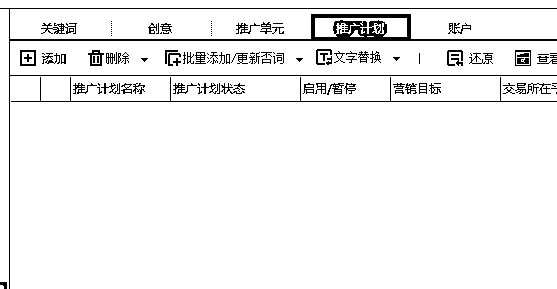  <ne-p id="u2a9f7233" data-lake-id="u2a9f7233"><ne-text id="ufe94ec02">从计划开始分，到单元，创意，关键词</ne-text></ne-p> <ne-h4 id="30f95668" data-lake-id="30f95668"><ne-heading-ext><ne-heading-anchor></ne-heading-anchor><ne-heading-fold></ne-heading-fold></ne-heading-ext><ne-heading-content><ne-text id="u42c94374">① 计划，单元</ne-text></ne-heading-content></ne-h4> <ne-p id="u9cf81c49" data-lake-id="u9cf81c49"><ne-text id="uc3d6854d">这两个层级，主要是划分投放方向，产品，时段等等</ne-text></ne-p> <ne-p id="u81ca2774" data-lake-id="u81ca2774"><ne-card data-card-name="image" data-card-type="inline" id="s43hk" data-event-boundary="card">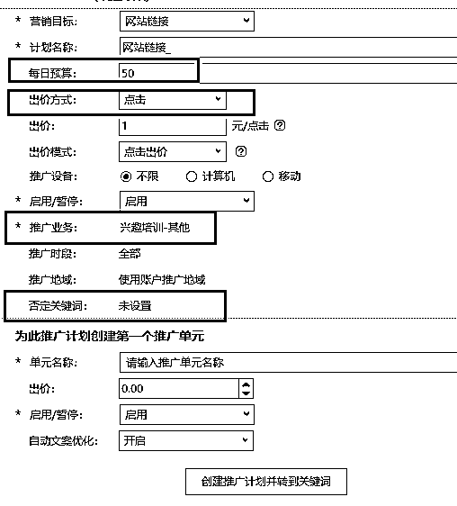  <ne-h5 id="129d8464" data-lake-id="129d8464"><ne-heading-ext><ne-heading-anchor></ne-heading-anchor><ne-heading-fold></ne-heading-fold></ne-heading-ext><ne-heading-content><ne-text id="u6b6c0a83">② 计划名称</ne-text></ne-heading-content></ne-h5> <ne-p id="ubc16044e" data-lake-id="ubc16044e"><ne-text id="u59753231">按照什么维度划分就写什么，例如：产品名字、重点地域、重点时段、甚至词太多可以分为，重点地区 pc，重点时段 yd 等等</ne-text></ne-p> <ne-p id="u7eb8c339" data-lake-id="u7eb8c339"><ne-text id="ua1d7ce88">带有倒三角的是计划，下面是单元</ne-text></ne-p> <ne-p id="ua1b028d3" data-lake-id="ua1b028d3"><ne-card data-card-name="image" data-card-type="inline" id="KqZkw" data-event-boundary="card">  <ne-p id="u922cbbf1" data-lake-id="u922cbbf1"><ne-text id="uff26d495">我这里先按最基础的产品名字划分</ne-text></ne-p> <ne-h5 id="e791baf5" data-lake-id="e791baf5"><ne-heading-ext><ne-heading-anchor></ne-heading-anchor><ne-heading-fold></ne-heading-fold></ne-heading-ext><ne-heading-content><ne-text id="uf373f3c5">② 预算</ne-text></ne-heading-content></ne-h5> <ne-p id="u6fb8d5ad" data-lake-id="u6fb8d5ad"><ne-text id="u68b7f723">一定要设置预算，预算可以保证我们不跑飞</ne-text></ne-p> <ne-p id="uf62937f5" data-lake-id="uf62937f5"><ne-text id="u8bbca204">例如：我们投放的这个二胡教程，突然有人刷量了，10 分钟刷了 50，然后我们设有预算，可以让他在到 50 的时候停下</ne-text></ne-p> <ne-h5 id="a85929bd" data-lake-id="a85929bd"><ne-heading-ext><ne-heading-anchor></ne-heading-anchor><ne-heading-fold></ne-heading-fold></ne-heading-ext><ne-heading-content><ne-text id="ua1715bb4">③ 出价模式</ne-text></ne-heading-content></ne-h5> <ne-p id="ub21b1a38" data-lake-id="ub21b1a38"><ne-text id="u2b9bc2f3">平台默认出价模式为是增强，我们要换成点击，每一个选项后面都有小问号，点开它看看什么意思，</ne-text></ne-p> <ne-p id="u82fc37f5" data-lake-id="u82fc37f5"><ne-text id="ue686842b">增强可控性更低，我们基础嘛，就怎么在控制范围内怎么来，按照点击付费就行了。</ne-text></ne-p> <ne-h5 id="39e2e76b" data-lake-id="39e2e76b"><ne-heading-ext><ne-heading-anchor></ne-heading-anchor><ne-heading-fold></ne-heading-fold></ne-heading-ext><ne-heading-content><ne-text id="u37cf971b">④ 时段/地域</ne-text></ne-heading-content></ne-h5> <ne-p id="ue8b4d09d" data-lake-id="ue8b4d09d"><ne-text id="u33500aca">在我们没有基础属于之前，可以设置，也可以不设置，后面有数据后再调整</ne-text></ne-p> <ne-p id="uf9709ad1" data-lake-id="uf9709ad1"><ne-text id="ue59544ac">例如：</ne-text></ne-p> <ne-p id="u38e49ec3" data-lake-id="u38e49ec3"><ne-card data-card-name="image" data-card-type="inline" id="h2abh" data-event-boundary="card">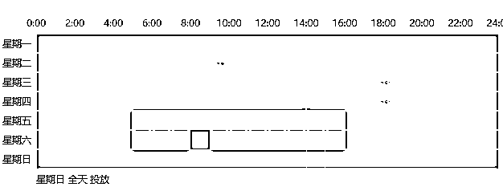  <ne-p id="u10f99139" data-lake-id="u10f99139"><ne-card data-card-name="image" data-card-type="inline" id="y9Gcx" data-event-boundary="card">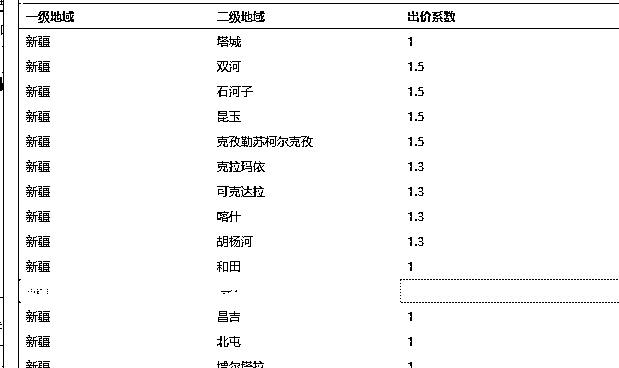  <ne-p id="u8fef36d0" data-lake-id="u8fef36d0"><ne-text id="ue65f7f31">时段，地域的溢价，看图，我设定的时段和地域上面有 1.3/1.5</ne-text></ne-p> <ne-p id="u0f0d8af5" data-lake-id="u0f0d8af5"><ne-text id="u8d03a6c4">就代表，我在这个时间或者地域愿意出价比我正常出价高 1.3/1.5 倍的价格</ne-text></ne-p> <ne-p id="ue9f3ef31" data-lake-id="ue9f3ef31"><ne-text id="u617efdd6">要注意的是，倍数相乘，如果我设定的价格是 2 块，客户是新疆石河子的在周二 8 点钟点击这个广告，我可以接受的最高价格就是：2*1.5*1.5=4.5</ne-text></ne-p> <ne-p id="u439efa2a" data-lake-id="u439efa2a"><ne-text id="ubcb76933">这样我对于这个时段和地域来说，我的出价最高，那么排名肯定更靠前</ne-text></ne-p> <ne-p id="uc2a88427" data-lake-id="uc2a88427"><ne-text id="u7110e483">是不是可以获得更多流量呢？</ne-text></ne-p> <ne-h5 id="46567f6f" data-lake-id="46567f6f"><ne-heading-ext><ne-heading-anchor></ne-heading-anchor><ne-heading-fold></ne-heading-fold></ne-heading-ext><ne-heading-content><ne-text id="ud4acf321">⑤ 否词</ne-text></ne-heading-content></ne-h5> <ne-p id="uaa68d47b" data-lake-id="uaa68d47b"><ne-text id="u03ddf9ed">这个很关键，意思是，搜索什么词，不要展现我的广告，不展现了肯定就没人点击了，就不花钱了。</ne-text></ne-p> <ne-p id="u5efc41fa" data-lake-id="u5efc41fa"><ne-text id="ua6f7cf8e">例如：免费这个词，搜这个词能购买的吗？</ne-text></ne-p> <ne-p id="ud2d879fb" data-lake-id="ud2d879fb"><ne-text id="ua2d26b32">感觉不行就否掉，搜免费的都看不到我们了</ne-text></ne-p> <ne-p id="ud6f177b5" data-lake-id="ud6f177b5"><ne-text id="u0563ead4">实际上，经过我的测试，免费这个词还是可以出单的</ne-text></ne-p> <ne-p id="ufac7bd70" data-lake-id="ufac7bd70"><ne-card data-card-name="image" data-card-type="inline" id="qXBRx" data-event-boundary="card">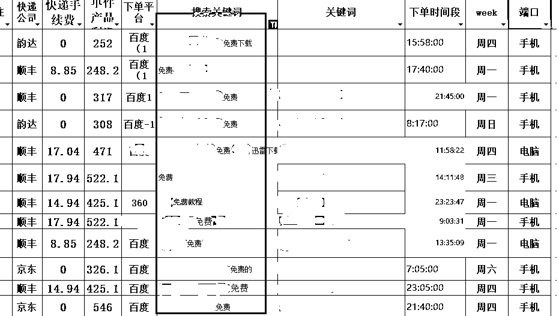  <ne-p id="uce7c69ae" data-lake-id="uce7c69ae"><ne-text id="ue9ac836a">这是经过筛选的，不是全部都免费下的单，刚开始还是建议把这类词否掉的，因为不确定后面赚钱可以再测试，否掉之后，还可以放开。</ne-text></ne-p> <ne-h5 id="810672d9" data-lake-id="810672d9"><ne-heading-ext><ne-heading-anchor></ne-heading-anchor><ne-heading-fold></ne-heading-fold></ne-heading-ext><ne-heading-content><ne-text id="uee7c290b">⑥ 单元名称</ne-text></ne-heading-content></ne-h5> <ne-p id="u39d2fba3" data-lake-id="u39d2fba3"><ne-text id="u8e0da494">和计划一样，以维度为标准，我们刚开始可以合用一个维度，</ne-text></ne-p> <ne-p id="ud6aedf5d" data-lake-id="ud6aedf5d"><ne-text id="ufa503d27">例如：计划是二胡教程，单元也叫二胡教程，直接先投放，这是冷门产品，热度高的产品，还是建议做多层分维，更有利于控制</ne-text></ne-p> <ne-p id="uf2bfc048" data-lake-id="uf2bfc048"><ne-card data-card-name="image" data-card-type="inline" id="BLbpp" data-event-boundary="card">  <ne-h5 id="c045381f" data-lake-id="c045381f"><ne-heading-ext><ne-heading-anchor></ne-heading-anchor><ne-heading-fold></ne-heading-fold></ne-heading-ext><ne-heading-content><ne-text id="ufc721c74">⑦ 单元的 BUG 以及必填项</ne-text></ne-heading-content></ne-h5> <ne-p id="u93ed1d25" data-lake-id="u93ed1d25"><ne-card data-card-name="image" data-card-type="inline" id="nty7Y" data-event-boundary="card">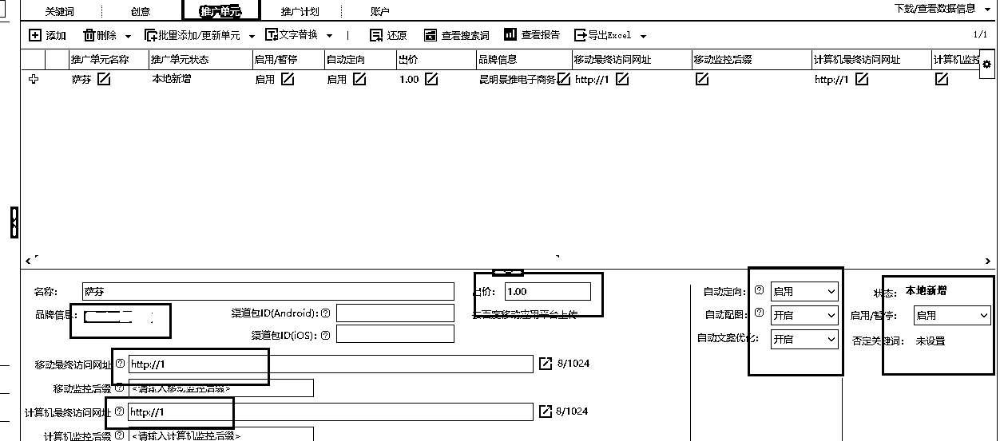  <ne-p id="u17f18e6a" data-lake-id="u17f18e6a"><ne-text id="u363cd468">名称我就不在说了，计划的单元维度的出价，都不必在意，我们最后会在关键词位置出价</ne-text></ne-p> <ne-p id="uba8e0ec6" data-lake-id="uba8e0ec6"><ne-text id="uf9b134a7">（ ocpc 需要在这两个维度中出价，这里不展开讲了，属于高级玩法）</ne-text></ne-p> <ne-p id="u47cd494c" data-lake-id="u47cd494c"><ne-text id="ue3dfc3ed">名称下面这三个框，网址就是投放的主域名，品牌名称点击，直接选择就可以了</ne-text></ne-p> <ne-p id="u9507f117" data-lake-id="u9507f117"><ne-text id="uee1c0059">出价后面这个框看清楚：都是什么自动，就是百度想给你玩点花样，干掉它</ne-text></ne-p> <ne-p id="ued9e3f86" data-lake-id="ued9e3f86"><ne-text id="ua0517ec4">上面有小问号，可以自己点看看看是啥，赚钱后再决定开不开</ne-text></ne-p> <ne-p id="ucadc3715" data-lake-id="ucadc3715"><ne-text id="ue14abfd0">单元层级还有一个否词，和计划层级一样，一个账户可以建 100 个计划，一个计划能建多少单元我不清楚，我最多的建了 600 多个，还没碰到限制</ne-text></ne-p> <ne-h4 id="9240b455" data-lake-id="9240b455"><ne-heading-ext><ne-heading-anchor></ne-heading-anchor><ne-heading-fold></ne-heading-fold></ne-heading-ext><ne-heading-content><ne-text id="u2d16860d">⑧ 创意</ne-text></ne-heading-content></ne-h4> <ne-p id="ua6573b68" data-lake-id="ua6573b68"><ne-card data-card-name="image" data-card-type="inline" id="QX2Yy" data-event-boundary="card">  <ne-p id="u9012d9e5" data-lake-id="u9012d9e5"><ne-card data-card-name="image" data-card-type="inline" id="tFyDf" data-event-boundary="card">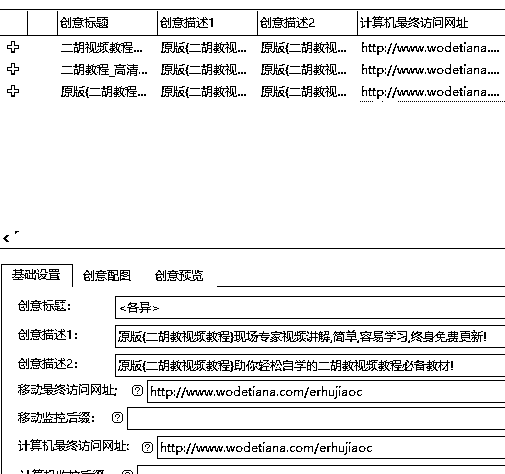  <ne-p id="uc86cb501" data-lake-id="uc86cb501"><ne-text id="u2864d9cb">上面是平台显示的结果，下面是我们填写的，创意标题对应最上面的一行大字</ne-text></ne-p> <ne-p id="u3c3040bd" data-lake-id="u3c3040bd"><ne-text id="ud3ff1cec">下面的两个描述对应，大字下面的小字</ne-text></ne-p> <ne-p id="u6b54a641" data-lake-id="u6b54a641"><ne-text id="u7540ec6b">这个投放的创意中没图片，图片是下面这个这个后面的创意配图，根据自己的产品加图，再往下移动端和计算机端访问的网址，就是我们的落地页</ne-text></ne-p> <ne-p id="u6b3cffc4" data-lake-id="u6b3cffc4"><ne-text id="ufd6aa104">建议最少添加两条创意，让百度可以选择，</ne-text></ne-p> <ne-p id="udc2e0b06" data-lake-id="udc2e0b06"><ne-text id="u3e52a0e9">（我们和平台之间本质上是合作关系，他们希望我们做优质内容，让用户看到点击，留存，我们写两条就可以让平台选择那个好就展现那个）</ne-text></ne-p> <ne-p id="u5e88d3f4" data-lake-id="u5e88d3f4"><ne-text id="uc2aaf5f3">（相对来说点击价格也会降低，但是我们只有一条就相当于你就给我弄这个就行了，平台感觉你不好，就要你出更高的价格才能给你展现，人家还特别不愿意，你给钱不到，那你就别想让人看到）</ne-text></ne-p> <ne-p id="u4d627002" data-lake-id="u4d627002"><ne-text id="ufa120714">我一般都写个 4-5 条</ne-text></ne-p> <ne-p id="u46877871" data-lake-id="u46877871"><ne-text id="uaef50af8">怎写呢？抄同行啊！抄就完了</ne-text></ne-p> <ne-h4 id="c6cc1024" data-lake-id="c6cc1024"><ne-heading-ext><ne-heading-anchor></ne-heading-anchor><ne-heading-fold></ne-heading-fold></ne-heading-ext><ne-heading-content><ne-text id="ue5318d23">⑨ 关键词</ne-text></ne-heading-content></ne-h4> <ne-p id="uf7da1c95" data-lake-id="uf7da1c95"><ne-text id="ubb1b37af">关键词，就是我们，我们投放的词，它和搜索词的区别是，搜索词是通过它匹配出来的词</ne-text></ne-p> <ne-p id="ud9bb39ee" data-lake-id="ud9bb39ee"><ne-card data-card-name="image" data-card-type="inline" id="VtatT" data-event-boundary="card">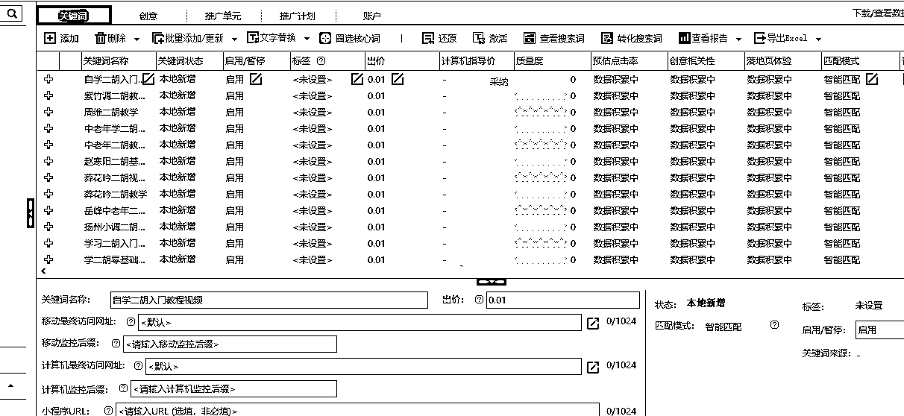  <ne-p id="uf3286474" data-lake-id="uf3286474"><ne-text id="u2d0e0905">匹配方式就是限定我们投放词可以匹配出来的搜索词的宽度，具体区别参考下面这个链接</ne-text></ne-p> <ne-p id="u51a22690" data-lake-id="u51a22690">[<ne-text id="uf03cb8ab">百度竞价关键词四大匹配模式对比总结 _ 网络营销动态 _ 互联网课堂 _ 网新科技集团有限公司</ne-text>](https://www.ibw.cn/3617.html?12380=lWyoE)</ne-p> <ne-p id="ubed6b8b6" data-lake-id="ubed6b8b6"><ne-text id="u43414d8b">出价就是，我们愿意为这个词出的最高价格，</ne-text></ne-p> <ne-p id="u235a5209" data-lake-id="u235a5209"><ne-text id="u5daba325">意思是说，我就出这么多，你感觉能给我点流量，就给，不给我也不给你更多钱</ne-text></ne-p> <ne-p id="u5426271e" data-lake-id="u5426271e"><ne-text id="uad81807b">虽然会少一部分流量但是可以降低成本，如果出单好，后面可以加价格</ne-text></ne-p> <ne-h4 id="559ad859" data-lake-id="559ad859"><ne-heading-ext><ne-heading-anchor></ne-heading-anchor><ne-heading-fold></ne-heading-fold></ne-heading-ext><ne-heading-content><ne-text id="ufde47069">⑩ 其他</ne-text></ne-heading-content></ne-h4> <ne-p id="u6f8575d3" data-lake-id="u6f8575d3"><ne-text id="u62a0509d">1）ocpc ，高级创意</ne-text></ne-p> <ne-p id="u0034132a" data-lake-id="u0034132a"><ne-text id="u3c2887b5">这两个不说了，高级玩法，低价的产品，我很少玩，除非特别好的品</ne-text></ne-p> <ne-p id="ue138224a" data-lake-id="ue138224a"><ne-text id="uc28d64e5" style="background-color: rgba(255, 246, 122, 0.8);">可以看到上面关键词，单元，创意，计划，每点开一个下面都有一个添加，点击添加就可以加对应的</ne-text></ne-p> <ne-p id="u4c46567a" data-lake-id="u4c46567a"><ne-text id="uf1c63956">初级阶段先投起来，其他的，后面在慢慢研究，所有的可以使用，操作的都是工具，不需要知道它是啥，只要知道它能干啥就行了。后面兴趣再看</ne-text></ne-p> <ne-p id="u468fd1b4" data-lake-id="u468fd1b4"><ne-card data-card-name="image" data-card-type="inline" id="NA014" data-event-boundary="card">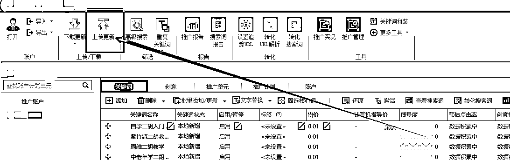  <ne-p id="u9308423d" data-lake-id="u9308423d"><ne-text id="uc0643e07">到这点击上传，</ne-text><ne-text id="u568bb19d" style="background-color: rgba(255, 246, 122, 0.8);">就可以完成了，投放起来了</ne-text><ne-text id="u1a25da27">，</ne-text><ne-text id="u09a17427" style="background-color: rgb(247, 105, 100);">高价产品一样</ne-text></ne-p> <ne-p id="u0b91b19c" data-lake-id="u0b91b19c"><ne-text id="u836a01f1">2）搜索词</ne-text></ne-p> <ne-p id="u3ccff938" data-lake-id="u3ccff938"><ne-text id="u79dc5879">这里确实没办法给你们看数据，里面涉及到了产品，只要记住一点，没事的时候看看可以看看搜索词，里面出来的词如果有不是自己想要的可以加到否词里面</ne-text></ne-p> <ne-h1 id="551aeb4a" data-lake-id="551aeb4a"><ne-heading-ext><ne-heading-anchor></ne-heading-anchor><ne-heading-fold></ne-heading-fold></ne-heading-ext><ne-heading-content><ne-text id="u5fd617e6">五、承接进入私域</ne-text></ne-heading-content></ne-h1> <ne-h2 id="3285992e" data-lake-id="3285992e"><ne-heading-ext><ne-heading-anchor></ne-heading-anchor><ne-heading-fold></ne-heading-fold></ne-heading-ext><ne-heading-content><ne-text id="u2a89552b">（1）低价产品很多在单页上就成交了</ne-text></ne-heading-content></ne-h2> <ne-p id="uac9ff858" data-lake-id="uac9ff858"><ne-text id="u1dd07d7f">单页比较简单，有兴趣可以去搜一下，加微信也很简单的聊一下，因为客户的决策成本低</ne-text></ne-p> <ne-p id="u05b66dc2" data-lake-id="u05b66dc2"><ne-card data-card-name="image" data-card-type="inline" id="AJZOJ" data-event-boundary="card">  <ne-h2 id="cad39048" data-lake-id="cad39048"><ne-heading-ext><ne-heading-anchor></ne-heading-anchor><ne-heading-fold></ne-heading-fold></ne-heading-ext><ne-heading-content><ne-text id="u5483dea6">（2）高客单需要承接进入私域，页面如何更好的展现</ne-text></ne-heading-content></ne-h2> <ne-p id="ubecafe01" data-lake-id="ubecafe01"><ne-text id="u7d78d500">这个页面的关键点：人物，故事，简介，恐慌，干货，客户反馈，采摘实景，加微信领取优惠</ne-text></ne-p> <ne-p id="u4ad2b170" data-lake-id="u4ad2b170"><ne-text id="u9d27cd94">这是一整个销售流程，做页面，就是在销售客户，让客户相信，拉近熟悉度，最终加到微信</ne-text></ne-p> <ne-h5 id="fcc03411" data-lake-id="fcc03411"><ne-heading-ext><ne-heading-anchor></ne-heading-anchor><ne-heading-fold></ne-heading-fold></ne-heading-ext><ne-heading-content><ne-text id="u84ae1924">① 人物，故事，简介</ne-text></ne-heading-content></ne-h5> <ne-p id="u36297170" data-lake-id="u36297170"><ne-text id="uc752cae3">我是谁，是干什么的，你为什么加我</ne-text></ne-p> <ne-h5 id="2fa049c5" data-lake-id="2fa049c5"><ne-heading-ext><ne-heading-anchor></ne-heading-anchor><ne-heading-fold></ne-heading-fold></ne-heading-ext><ne-heading-content><ne-text id="uc1552f8e">② 恐慌</ne-text></ne-heading-content></ne-h5> <ne-p id="u689cb70c" data-lake-id="u689cb70c"><ne-text id="u198f6f20">你不加我，有可能上当，有可能吃亏</ne-text></ne-p> <ne-h5 id="db039b10" data-lake-id="db039b10"><ne-heading-ext><ne-heading-anchor></ne-heading-anchor><ne-heading-fold></ne-heading-fold></ne-heading-ext><ne-heading-content><ne-text id="u567bcd92">③ 干货</ne-text></ne-heading-content></ne-h5> <ne-p id="u55a13c90" data-lake-id="u55a13c90"><ne-text id="u10bd06c8">你看我多专业，交我这样一个朋友，就算你不买，也能白票知识</ne-text></ne-p> <ne-h5 id="185d7706" data-lake-id="185d7706"><ne-heading-ext><ne-heading-anchor></ne-heading-anchor><ne-heading-fold></ne-heading-fold></ne-heading-ext><ne-heading-content><ne-text id="ue38120c2">④ 客户反馈</ne-text></ne-heading-content></ne-h5> <ne-p id="u3b1c9684" data-lake-id="u3b1c9684"><ne-text id="ub8630297">你看我家的客户吃的多好，你不来看看我家的货？</ne-text></ne-p> <ne-h5 id="eff90a97" data-lake-id="eff90a97"><ne-heading-ext><ne-heading-anchor></ne-heading-anchor><ne-heading-fold></ne-heading-fold></ne-heading-ext><ne-heading-content><ne-text id="u8f104157">⑥ 采摘实景</ne-text></ne-heading-content></ne-h5> <ne-p id="u1820a7e1" data-lake-id="u1820a7e1"><ne-text id="ud0bc1a59">你看我就是源头，肯定可以以最便宜的价格，拿到最好的货</ne-text></ne-p> <ne-h5 id="20110ca0" data-lake-id="20110ca0"><ne-heading-ext><ne-heading-anchor></ne-heading-anchor><ne-heading-fold></ne-heading-fold></ne-heading-ext><ne-heading-content><ne-text id="u3af8c4bc">⑦ 加微信领取优惠，看一手价</ne-text></ne-heading-content></ne-h5> <ne-p id="uba0b40f6" data-lake-id="uba0b40f6"><ne-text id="uc01a7076">临门一脚，一个助推器，</ne-text></ne-p> <ne-p id="u56bb276c" data-lake-id="u56bb276c"><ne-text id="u25e5c609">最后这个图，一点击就直接复制成功了，在手机端没有找到这个人的页面，但是其他投放的人都是复制成功之后下面会直接出现”打开微信“的字样，点击就可以打开</ne-text></ne-p> <ne-p id="u4b026f65" data-lake-id="u4b026f65"><ne-text id="u1f98494c">这是什么意思呢？</ne-text></ne-p> <ne-p id="u5d46ce14" data-lake-id="u5d46ce14"><ne-text id="u086ad07c">就是说，尽量少的给用户增加步骤，每一步都有可能让用户不再加我</ne-text></ne-p> <ne-p id="ue7bd233d" data-lake-id="ue7bd233d"><ne-text id="uc2e35328">应用到内容平台，给客户发图片和直接发微信号，把微信号和引导话术分开，就是这个意思</ne-text></ne-p> <ne-p id="u298f3107" data-lake-id="u298f3107"><ne-card data-card-name="image" data-card-type="inline" id="brrSi" data-event-boundary="card">  <ne-p id="u3e2e2d6b" data-lake-id="u3e2e2d6b"><ne-card data-card-name="image" data-card-type="inline" id="YuHMG" data-event-boundary="card">  <ne-p id="u25bab254" data-lake-id="u25bab254"><ne-card data-card-name="image" data-card-type="inline" id="G69lK" data-event-boundary="card">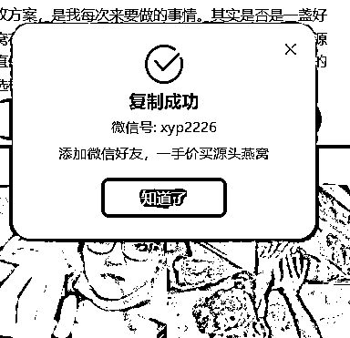  <ne-p id="ue854b9b2" data-lake-id="ue854b9b2"><ne-text id="u1c600651">到这基本该加微信的就已经加微信了，然后抄同行的话术去聊就可以了</ne-text></ne-p> <ne-h2 id="2967f3e1" data-lake-id="2967f3e1"><ne-heading-ext><ne-heading-anchor></ne-heading-anchor><ne-heading-fold></ne-heading-fold></ne-heading-ext><ne-heading-content><ne-text id="ua8e88ca3">（3）外番</ne-text></ne-heading-content></ne-h2> <ne-p id="u471b786d" data-lake-id="u471b786d"><ne-text id="u76c318c4">运营一段时间基本上也就可以确定这个产品行不行了，该留就留，该删就删</ne-text></ne-p> <ne-p id="u557b3926" data-lake-id="u557b3926"><ne-text id="u06e8aed5">如果是有自己产品的老板，如果百度不赚钱，可以去测试其他平台，或者其他引流渠道了</ne-text></ne-p> <ne-h1 id="e242ec70" data-lake-id="e242ec70"><ne-heading-ext><ne-heading-anchor></ne-heading-anchor><ne-heading-fold></ne-heading-fold></ne-heading-ext><ne-heading-content><ne-text id="ude4e5616">六，投放外番</ne-text></ne-heading-content></ne-h1> <ne-h3 id="b9ffe9b2" data-lake-id="b9ffe9b2"><ne-heading-ext><ne-heading-anchor></ne-heading-anchor><ne-heading-fold></ne-heading-fold></ne-heading-ext><ne-heading-content><ne-text id="u8a8c71b3">（1）根据平台情况，开始投放找感觉</ne-text></ne-heading-content></ne-h3> <ne-p id="uda59b346" data-lake-id="uda59b346"><ne-text id="u6a84b848">我们要理解一个概念：平台算法</ne-text></ne-p> <ne-p id="u2f06e007" data-lake-id="u2f06e007"><ne-text id="u8999b0f1">我们的投放，和用户之间，是有一个平台算法的，就是调动投放策略，平台对你的调动做出判断，再分配给不同的用户</ne-text></ne-p> <ne-p id="u212d61bb" data-lake-id="u212d61bb"><ne-text id="u87205221">例 1：</ne-text></ne-p> <ne-p id="u1f7ed2d5" data-lake-id="u1f7ed2d5"><ne-text id="u88cd7133">账户很差，我删掉一个词，账户效果突然好了</ne-text></ne-p> <ne-p id="u4f4ae80f" data-lake-id="u4f4ae80f"><ne-text id="ueb4b9b4b">是因为这个词吗？</ne-text></ne-p> <ne-p id="u58bfa69c" data-lake-id="u58bfa69c"><ne-text id="u7b4be6f5">不一定，</ne-text></ne-p> <ne-p id="u35e766db" data-lake-id="u35e766db"><ne-text id="u6f2eee13">是因为我删了这个词后，平台感觉到我有什么意思，整体调整的结果</ne-text></ne-p> <ne-p id="ueaabee9a" data-lake-id="ueaabee9a"><ne-text id="uaa81d6a1">例 2：</ne-text></ne-p> <ne-p id="u2952b29e" data-lake-id="u2952b29e"><ne-text id="u8d185a49">我原本这个产品很赚钱，我想在多加一些精准词，让他流量变大</ne-text></ne-p> <ne-p id="ucc4aa72e" data-lake-id="ucc4aa72e"><ne-text id="u7c13df6f">但是加词后，突然就不赚钱了</ne-text></ne-p> <ne-p id="u07356151" data-lake-id="u07356151"><ne-text id="u373018b4">是因为这些词不精准吗？</ne-text></ne-p> <ne-p id="u68402505" data-lake-id="u68402505"><ne-text id="ubc4c8b08">不一定，</ne-text></ne-p> <ne-p id="u57c411e6" data-lake-id="u57c411e6"><ne-text id="u99839b4a">是因为这些词加到这个账户里面，平台对这个账户整体做出了调整</ne-text></ne-p> <ne-p id="u0c223a38" data-lake-id="u0c223a38"><ne-text id="ufeeee5b9">还有一个关键点：平台的算法在不断迭代的，不能以极长的以往的经验去判断整体调整</ne-text></ne-p> <ne-p id="ud0cb9620" data-lake-id="ud0cb9620"><ne-text id="u26cffdde">这种意识很重要，就是我们的投放并不是我们能完全掌控的，只能在可掌控范围内，逐步优化</ne-text></ne-p> <ne-h3 id="f44044dc" data-lake-id="f44044dc"><ne-heading-ext><ne-heading-anchor></ne-heading-anchor><ne-heading-fold></ne-heading-fold></ne-heading-ext><ne-heading-content><ne-text id="u70ebacc6">（2）放开流量</ne-text></ne-heading-content></ne-h3> <ne-p id="u1d1ad593" data-lake-id="u1d1ad593"><ne-text id="u9ac62424">当我们投放的足够多时，就会有大量的数据</ne-text></ne-p> <ne-p id="uee1011ab" data-lake-id="uee1011ab"><ne-text id="u2a2a9667">例如，我投放 30w，下午出单占比 70%，我就可以尝试分开投放，下午多投一点，其他时间少投一点</ne-text></ne-p> <ne-p id="u4fc9bdfc" data-lake-id="u4fc9bdfc"><ne-text id="u453e6a2d">地域也一样，试效果和预想一样，就继续投放，效果和预想不一样，就改回去就好了</ne-text></ne-p> <ne-h3 id="827e1e30" data-lake-id="827e1e30"><ne-heading-ext><ne-heading-anchor></ne-heading-anchor><ne-heading-fold></ne-heading-fold></ne-heading-ext><ne-heading-content><ne-text id="uf2b39c6c">（3）其他平台可复用的流量策略</ne-text></ne-heading-content></ne-h3> <ne-p id="ua86b2012" data-lake-id="ua86b2012"><ne-text id="u8b090dfd">① 投放地域，越多，流量越多</ne-text></ne-p> <ne-p id="u7cac6c11" data-lake-id="u7cac6c11"><ne-text id="u3b867851">② 投放时段，越全，流量越高</ne-text></ne-p> <ne-p id="u79f549a9" data-lake-id="u79f549a9"><ne-text id="u731c780f">③ 投放的词，产品，（对应自媒体的文章）越多流量越多</ne-text></ne-p> <ne-p id="ub7d948ab" data-lake-id="ub7d948ab"><ne-text id="u8c515371">④ 出价越高，流量越多</ne-text></ne-p> <ne-p id="uc4c3b07e" data-lake-id="uc4c3b07e"><ne-text id="u5e6a009a">⑤ 限制越少，流量越多，也越杂</ne-text></ne-p> <ne-p id="u581aeff6" data-lake-id="u581aeff6"><ne-text id="u1505fc4b">反之亦然</ne-text></ne-p> <ne-h4 id="8b7d8455" data-lake-id="8b7d8455"><ne-heading-ext><ne-heading-anchor></ne-heading-anchor><ne-heading-fold></ne-heading-fold></ne-heading-ext><ne-heading-content><ne-text id="u8eb7dad8">案例 1：抖音的巨量广告</ne-text></ne-heading-content></ne-h4> <ne-p id="ube61df4c" data-lake-id="ube61df4c"><ne-card data-card-name="image" data-card-type="inline" id="dvCbf" data-event-boundary="card">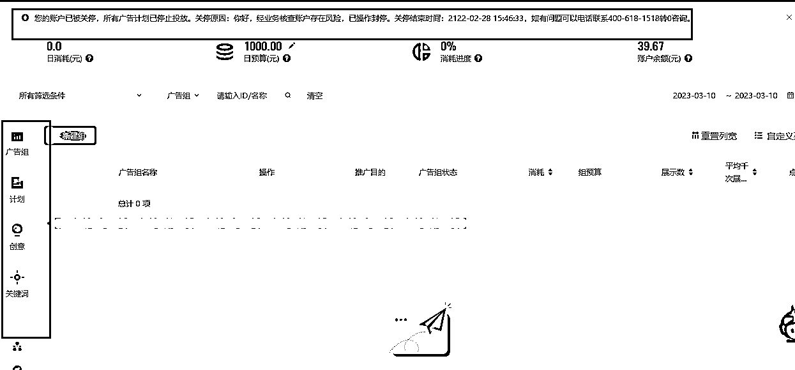  <ne-p id="u9d5fced3" data-lake-id="u9d5fced3"><ne-text id="uf8f6c7c7">想建立几个计划的，但是账户好久没用，封掉了，看左侧：</ne-text></ne-p> <ne-p id="u5a4329f7" data-lake-id="u5a4329f7"><ne-text id="ue3878fff">广告组--百度的计划</ne-text></ne-p> <ne-p id="ud379b81d" data-lake-id="ud379b81d"><ne-text id="ub1ede9d0">计划--百度的单元</ne-text></ne-p> <ne-p id="uc355d071" data-lake-id="uc355d071"><ne-text id="u407b7084">创意---百度的创意</ne-text></ne-p> <ne-p id="u7b980a05" data-lake-id="u7b980a05"><ne-text id="u1020c05e">关键词---百度的关键词</ne-text></ne-p> <ne-p id="uf2874cf3" data-lake-id="uf2874cf3"><ne-text id="u57451c7b">里面的具体细节，基本每个设置后面都户有解释，就像百度里面的小问号，看官方解释就可以了</ne-text></ne-p> <ne-p id="u4787d517" data-lake-id="u4787d517"><ne-text id="u2d22d3c0">要注意的是，巨量引擎是信息流广告，没有搜索词</ne-text></ne-p> <ne-p id="ue6c002af" data-lake-id="ue6c002af"><ne-text id="ube7f015e">但是对我们影响不大，我们的目的是赚钱，我建个策略，在我投入成本范围内，赚钱我就接着投，不赚钱就调，换新词，新创意；</ne-text></ne-p> <ne-p id="u13fff5bf" data-lake-id="u13fff5bf"><ne-text id="u37bc4e5c">再不行砍掉，重新上。当这个产品花够预算，就不投了</ne-text></ne-p> <ne-h4 id="77aff35b" data-lake-id="77aff35b"><ne-heading-ext><ne-heading-anchor></ne-heading-anchor><ne-heading-fold></ne-heading-fold></ne-heading-ext><ne-heading-content><ne-text id="ud1765c19">案例 2：小红书的聚光</ne-text></ne-heading-content></ne-h4> <ne-p id="ucb737dcb" data-lake-id="ucb737dcb"><ne-card data-card-name="image" data-card-type="inline" id="GvZmo" data-event-boundary="card">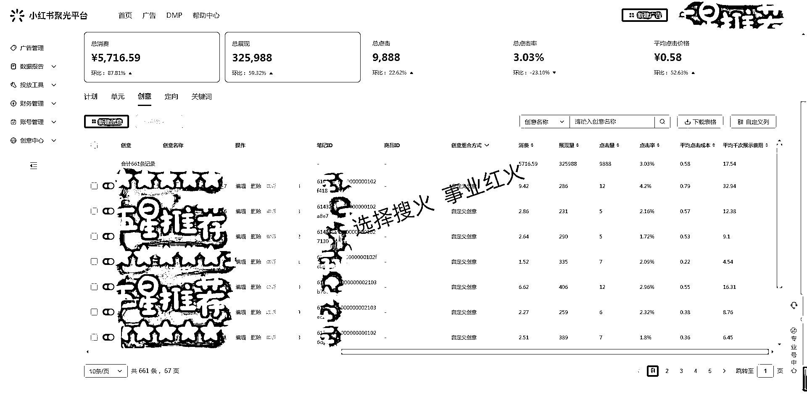  <ne-p id="u019a37cc" data-lake-id="u019a37cc"><ne-text id="u904867a9">从朋友圈看到的，我自己还没有投放小红书，但是可以看到本质上是一样的，计划，单元，创意，关键词，</ne-text></ne-p> <ne-p id="ub501dadb" data-lake-id="ub501dadb"><ne-text id="u11c85e85">多了一个定向，应该有解释的，我记着抖音里面好像也有，给忘记了</ne-text></ne-p> <ne-p id="ud500d9b6" data-lake-id="ud500d9b6"><ne-text id="ud80b9ebf">没关系对我们影响不大，工具，能让我赚钱就行，我不需要懂，会用就行了</ne-text></ne-p> <ne-h4 id="35e34260" data-lake-id="35e34260"><ne-heading-ext><ne-heading-anchor></ne-heading-anchor><ne-heading-fold></ne-heading-fold></ne-heading-ext><ne-heading-content><ne-text id="u0f2762bb">其他平台</ne-text></ne-heading-content></ne-h4> <ne-p id="u2f84af3a" data-lake-id="u2f84af3a"><ne-text id="u5453fb07">其他平台我没见过，但想着总体差不多，能投起来，可以控制，不影响我赚钱，管它天花乱坠</ne-text></ne-p> <ne-h4 id="0a8710ea" data-lake-id="0a8710ea"><ne-heading-ext><ne-heading-anchor></ne-heading-anchor><ne-heading-fold></ne-heading-fold></ne-heading-ext><ne-heading-content><ne-text id="u11a71124">拓展方向</ne-text></ne-heading-content></ne-h4> <ne-p id="u659353c7" data-lake-id="u659353c7"><ne-text id="ue028a137">投放的不仅仅是我们的内容，可以买来换取流量的都叫做投放，</ne-text></ne-p> <ne-p id="u5b9580f2" data-lake-id="u5b9580f2"><ne-text id="uf2b04ee3">比如说：找一些达人带货，那么我们是不是可以找些达人帮我们带货？或者说带我们自己这个货物，只是博主就是在卖自己</ne-text></ne-p> <ne-p id="udc276fcf" data-lake-id="udc276fcf"><ne-text id="u43f31916">同样从几个点考虑：</ne-text></ne-p> <ne-p id="ub7233cf1" data-lake-id="ub7233cf1"><ne-text id="ud10b7a73">① 试错成本要低，可以反复测试，</ne-text></ne-p> <ne-p id="u39db23ed" data-lake-id="u39db23ed"><ne-text id="u4c7f5cf6">② 流量尽量可控</ne-text></ne-p> <ne-p id="u06864af1" data-lake-id="u06864af1"><ne-text id="u3f3c7f52">③ 可以快速放大</ne-text></ne-p> <ne-p id="u650a1057" data-lake-id="u650a1057"><ne-text id="u3b8b0b1d">怎么做呢？</ne-text></ne-p> <ne-p id="u58f979f4" data-lake-id="u58f979f4"><ne-text id="u5eaa62ea">找小达人，或者腰部达人，他们便宜----试错成本够低</ne-text></ne-p> <ne-p id="u823c4d19" data-lake-id="u823c4d19"><ne-text id="u6189b518">每个博主风格不同----流量方向可控</ne-text></ne-p> <ne-p id="u64a9ed2a" data-lake-id="u64a9ed2a"><ne-text id="uc9e42bf7">一但找到合适的，同风格达人，快速铺铺货----可以快速放大</ne-text></ne-p> <ne-h1 id="dc55c41c" data-lake-id="dc55c41c"><ne-heading-ext><ne-heading-anchor></ne-heading-anchor><ne-heading-fold></ne-heading-fold></ne-heading-ext><ne-heading-content><ne-text id="u0c04040e">七、投放避坑（适用于所有平台）</ne-text></ne-heading-content></ne-h1> <ne-h3 id="bef38222" data-lake-id="bef38222"><ne-heading-ext><ne-heading-anchor></ne-heading-anchor><ne-heading-fold></ne-heading-fold></ne-heading-ext><ne-heading-content><ne-text id="ud0f0e084">（1）选品重于投放</ne-text></ne-heading-content></ne-h3> <ne-p id="uc975f643" data-lake-id="uc975f643"><ne-text id="ue42811f7">一定要保证，自己能打得过同行，这样才能保证能抢到流量变现的顺畅度，才能保证赚钱，可以复投到广告中</ne-text></ne-p> <ne-p id="u2431c538" data-lake-id="u2431c538"><ne-text id="uf4275741" ne-bold="true">能看到的标准：</ne-text></ne-p> <ne-p id="u65500d76" data-lake-id="u65500d76"><ne-text id="u4fea4369">① 页面我可以做的更漂亮，</ne-text></ne-p> <ne-p id="u3d1a96af" data-lake-id="u3d1a96af"><ne-text id="u7b1dd46d">② 销售流程，可以做的更好</ne-text></ne-p> <ne-p id="u4af835a3" data-lake-id="u4af835a3"><ne-text id="uab677789" ne-bold="true">看不到的标准：</ne-text></ne-p> <ne-p id="u8b537ad8" data-lake-id="u8b537ad8"><ne-text id="u6799e6cf">① 投放策略，只能以基础的标准去做</ne-text></ne-p> <ne-p id="u81c2b325" data-lake-id="u81c2b325"><ne-text id="ud9161177">② 然后赚钱，复投，不断优化</ne-text></ne-p> <ne-h3 id="b89ada73" data-lake-id="b89ada73"><ne-heading-ext><ne-heading-anchor></ne-heading-anchor><ne-heading-fold></ne-heading-fold></ne-heading-ext><ne-heading-content><ne-text id="uf23012b9">（2）投放页面重于投放策略</ne-text></ne-heading-content></ne-h3> <ne-p id="ufb629232" data-lake-id="ufb629232"><ne-text id="uf0d56058">什么好页面？</ne-text></ne-p> <ne-p id="u906d8ddb" data-lake-id="u906d8ddb"><ne-text id="uaaaa399e">（对应内容，内容的标准稍微不一样一点）</ne-text></ne-p> <ne-p id="ub0ac5af9" data-lake-id="ub0ac5af9"><ne-text id="uf8ea29e3">① 能给客户信任，急迫感，</ne-text></ne-p> <ne-p id="ufa6315b0" data-lake-id="ufa6315b0"><ne-text id="u927951ba">② 有好的钩子，</ne-text></ne-p> <ne-p id="u39ee12a1" data-lake-id="u39ee12a1"><ne-text id="u9a8f5d45">③ 下单或加 V 的阻碍少</ne-text></ne-p> <ne-p id="ud8107ea9" data-lake-id="ud8107ea9"><ne-text id="ub16a9545">参考第五章节的页面</ne-text></ne-p> <ne-h3 id="acf71bc3" data-lake-id="acf71bc3"><ne-heading-ext><ne-heading-anchor></ne-heading-anchor><ne-heading-fold></ne-heading-fold></ne-heading-ext><ne-heading-content><ne-text id="uc052ad55">（3）投放策略重于关键词以及搜索词</ne-text></ne-heading-content></ne-h3> <ne-p id="u0b538e09" data-lake-id="u0b538e09"><ne-text id="u8f685bcd">投放的计划+单元的调整，比一两个搜跑偏的关键词要重要</ne-text></ne-p> <ne-h3 id="945fb94e" data-lake-id="945fb94e"><ne-heading-ext><ne-heading-anchor></ne-heading-anchor><ne-heading-fold></ne-heading-fold></ne-heading-ext><ne-heading-content><ne-text id="uceb5acff">（4）创意尽量多</ne-text></ne-heading-content></ne-h3> <ne-p id="u52e83416" data-lake-id="u52e83416"><ne-text id="u2a1b6c1a">创意多了，平台的选择就会更多，平台也可以针对不同人群去帮我们展现不同的创意，对应内容生产者的可投放的内容</ne-text></ne-p> <ne-h3 id="3190d7b8" data-lake-id="3190d7b8"><ne-heading-ext><ne-heading-anchor></ne-heading-anchor><ne-heading-fold></ne-heading-fold></ne-heading-ext><ne-heading-content><ne-text id="u290ff4d7">（5）留意自己花的钱</ne-text></ne-heading-content></ne-h3> <ne-p id="u862913e1" data-lake-id="u862913e1"><ne-text id="uffa1dcbf">曾经因为自己的疏忽：</ne-text></ne-p> <ne-p id="u1975166b" data-lake-id="u1975166b"><ne-text id="u538c0534">① 一个产品消费了 2000，没有效果还在投放</ne-text></ne-p> <ne-p id="u9d2c1c79" data-lake-id="u9d2c1c79"><ne-text id="u44a2a5af">② 一个账户投放的产品有一部分不赚钱了，还没有意识到.........</ne-text></ne-p> <ne-p id="u384d23a3" data-lake-id="u384d23a3"><ne-text id="uce5bb7ba">为什么？因为我整体账户赚钱，边边角角没在意，哈哈哈</ne-text></ne-p> <ne-h1 id="496fa797" data-lake-id="496fa797"><ne-heading-ext><ne-heading-anchor></ne-heading-anchor><ne-heading-fold></ne-heading-fold></ne-heading-ext><ne-heading-content><ne-text id="u6beda283">八、新人想做的门槛和建议</ne-text></ne-heading-content></ne-h1> <ne-h3 id="bf7e2447" data-lake-id="bf7e2447"><ne-heading-ext><ne-heading-anchor></ne-heading-anchor><ne-heading-fold></ne-heading-fold></ne-heading-ext><ne-heading-content></ne-heading-content></ne-h3><ne-h3 id="5ffdfc8a" data-lake-id="5ffdfc8a"><ne-heading-ext><ne-heading-anchor></ne-heading-anchor><ne-heading-fold></ne-heading-fold></ne-heading-ext><ne-heading-content><ne-text id="u9e465bbd">（1）项目建议</ne-text></ne-heading-content></ne-h3> <ne-p id="ueab9adbf" data-lake-id="ueab9adbf"><ne-text id="ue4369c86">这个项目几乎没什么门槛，重点就是执行力，稍微要一点思维能力</ne-text></ne-p> <ne-p id="ua2e5faed" data-lake-id="ua2e5faed"><ne-text id="uc9f8ec11">建议刚开始测试产品的时候，多找一些产品，最少 10 个，一起上，可以增加刚开始的出单率</ne-text></ne-p> <ne-p id="ub92cb876" data-lake-id="ub92cb876"><ne-text id="u1ee54467">选的品不一定每个都赚钱，尽快拿到正反馈，也更容易做下去</ne-text></ne-p> <ne-p id="u09c230cb" data-lake-id="u09c230cb"><ne-text id="uc95c399a">同时，这套选品和投放的逻辑，到任何平台都是通用的，研究一下平台，随便鼓捣一下，先投 1,2 百找找感觉</ne-text></ne-p> <ne-p id="uca82768c" data-lake-id="uca82768c"><ne-text id="ufe8947c9">我们前期的利润很难雇得起一名投手，不投放又会损失很多流量，我们简单了解一下，可以尝试下，投开就知道了，</ne-text></ne-p> <ne-p id="u2c2fb899" data-lake-id="u2c2fb899"><ne-text id="u991a13d4">一旦开始赚钱，那就是：只要投不死，就往死里投</ne-text></ne-p> <ne-p id="ubb138042" data-lake-id="ubb138042"><ne-text id="uadb4ac29">最后希望大家不要把自己能够承受范围内的</ne-text><ne-text id="u7ae70975" style="background-color: rgba(255, 246, 122, 0.8);">试错成本</ne-text><ne-text id="ua923b542">，当成门槛</ne-text></ne-p> <ne-h3 id="e554b5bb" data-lake-id="e554b5bb"><ne-heading-ext><ne-heading-anchor></ne-heading-anchor><ne-heading-fold></ne-heading-fold></ne-heading-ext><ne-heading-content><ne-text id="u2e7c5e6e">（2）项目外建议</ne-text></ne-heading-content></ne-h3> <ne-p id="u35b8419f" data-lake-id="u35b8419f"><ne-text id="ub4bab55a">这里的试错成本，不仅仅指投放，还有生活</ne-text></ne-p> <ne-p id="ucf3c3bd1" data-lake-id="ucf3c3bd1"><ne-text id="u09055e90">比如：加入生财有术，这个钱会给我造成的影响和自己预想可以得到的</ne-text></ne-p> <ne-p id="ud53c7226" data-lake-id="ud53c7226"><ne-text id="u30a45f66">比如：我报名一个课程的费用，加入一个星球的费用，给一个人发的红包，不仅仅知识，钱是可以的得到的，印象，好感，情感链接等等</ne-text></ne-p> <ne-p id="u71b74e72" data-lake-id="u71b74e72"><ne-text id="u6cbcaa05">给大家举个例子：</ne-text></ne-p> <ne-p id="u019bd0cb" data-lake-id="u019bd0cb"><ne-text id="u54948dac">每天送老婆一朵花，经济实力不够可以三天、一周一朵</ne-text></ne-p> <ne-p id="u68d3ba8e" data-lake-id="u68d3ba8e"><ne-text id="u43c519db">付出的：10*30 = 300 元每月的成本</ne-text></ne-p> <ne-p id="u72fae275" data-lake-id="u72fae275"><ne-text id="u81001b7c">换来的：全家每天的开开心心</ne-text></ne-p> <ne-p id="u76a94ca8" data-lake-id="u76a94ca8"><ne-text id="u0a79e940">开心，内耗的减少，情绪价值，甚至都不需要你记住，跟花店老板商量好，他们会准时送到</ne-text></ne-p> <ne-p id="uc8b4d8b6" data-lake-id="uc8b4d8b6"><ne-text id="ud40fa189">以上这些都是属于投放</ne-text></ne-p> <ne-p id="ube4ec572" data-lake-id="ube4ec572"><ne-text id="ub2e12754">敢于花钱，可以用到很多地方，它是保持生活的必须品，同时也是我们的工具。</ne-text></ne-p> <ne-p id="ub6bc7aec" data-lake-id="ub6bc7aec"><ne-text id="u290d0cc2">我在我可以承受范围内的关于知识，认知方面花钱是无限花，哪怕性价比极低。</ne-text></ne-p> <ne-p id="u6ebcf564" data-lake-id="u6ebcf564"><ne-text id="u199cfe17">可以想象一下，我现在 25 岁，我基本还有 50 年可以活，哪怕 10w 买一个知识点，平均每年也才 2000 块，10w 只是个比喻，超出了我的可支付范围的（捂脸笑）</ne-text></ne-p> <ne-p id="u715a6e7b" data-lake-id="u715a6e7b"><ne-text id="ua924abd5">并且我从这个点，可以往上爬的速度会加快很多，复利的效果非常强大。</ne-text></ne-p> <ne-p id="uea4d30dd" data-lake-id="uea4d30dd"><ne-text id="ud0ca3e93">即使买了一个完全没用的，那还有买便宜的，比如生财，匀匀就好了。</ne-text></ne-p> <ne-p id="u9a247711" data-lake-id="u9a247711"><ne-text id="ue3023caf">面对生活无所畏惧，勇往直前</ne-text></ne-p> <ne-hole id="u52fe4e9e" data-lake-id="u52fe4e9e"><ne-card data-card-name="hr" data-card-type="block" id="LitT3" data-event-boundary="card"><ne-p id="ue258658e" data-lake-id="ue258658e"><ne-text id="ua7763c00">评论区：</ne-text></ne-p> <ne-p id="u7b0508a9" data-lake-id="u7b0508a9"><ne-text id="u11a310b2">Kilo : 厉害了老哥，白酒行业投放可以大概讲解一下吗</ne-text> <ne-text id="udfbb0c90">王永超 : 你这个问题，实在不好说。你们现在是什么情况，是工厂，还是什么。</ne-text></ne-p> <ne-p id="u6f48966d" data-lake-id="u6f48966d"><ne-text id="u40ea6a10">你们是已经在投放了？还是打算投放？有多少数据做支撑？</ne-text> <ne-text id="u7edae139">Kilo : 哈哈，抱歉哥，是我问得太唐突了。</ne-text> <ne-text id="u1d7686ba">1.我们自有工厂，自有产品链。</ne-text> <ne-text id="u7de3021e">2.目前是主打一个低端方向，人群标签很明确。</ne-text> <ne-text id="uc91ed4b6">3.是新开发产品，未进行线上投放以及开发。</ne-text> <ne-text id="u2d5d74bd">4.没有线上开发所以没有数据可以做参考，只有线下私域交易数据。</ne-text> <ne-text id="u6d4cd7b7">王永超 : 线下数据也可以参考，你可以自己开个户，小投一下，找找感觉，后面可以招个投手</ne-text> <ne-text id="uff20dd0f">希声。 : 写的真好</ne-text> <ne-text id="uefbbc8e7">王永超 : 感谢</ne-text> <ne-text id="ud0c19ea1">侠狼 : 写的真心不错</ne-text> <ne-text id="u5d09c6f8">王永超 : 哈哈哈，感谢</ne-text></ne-p></ne-card></ne-hole></ne-card></ne-p></ne-card></ne-p></ne-card></ne-p></ne-card></ne-p></ne-card></ne-p></ne-card></ne-p></ne-card></ne-p></ne-card></ne-p></ne-card></ne-p></ne-card></ne-p></ne-card></ne-p></ne-card></ne-p></ne-card></ne-p></ne-card></ne-p></ne-card></ne-p></ne-card></ne-p></ne-card></ne-p></ne-card></ne-p></ne-card></ne-p></ne-card></ne-p></ne-card></ne-p></ne-card></ne-p></ne-card></ne-p></ne-card></ne-p></ne-card></ne-p></ne-card></ne-p></ne-card></ne-p></ne-card></ne-p></ne-card></ne-p></ne-card></ne-p></ne-card></ne-p></ne-card></ne-p></ne-card></ne-p></ne-card></ne-p></ne-card></ne-p></ne-card></ne-p></ne-card></ne-p></ne-card></ne-p></ne-card></ne-p></ne-card></ne-p>