# 《 Etsy 注册最新最全指南》

> 原文：[`www.yuque.com/for_lazy/thfiu8/pra2r7xildmhuu56`](https://www.yuque.com/for_lazy/thfiu8/pra2r7xildmhuu56)

<ne-h2 id="a1246d2d" data-lake-id="a1246d2d"><ne-heading-ext><ne-heading-anchor></ne-heading-anchor><ne-heading-fold></ne-heading-fold></ne-heading-ext><ne-heading-content><ne-text id="u2551ff5d">(32 赞)《 Etsy 注册最新最全指南》</ne-text></ne-heading-content></ne-h2> <ne-p id="udca84b60" data-lake-id="udca84b60"><ne-text id="u6f72399d">作者： 希声。</ne-text></ne-p> <ne-p id="u9333f989" data-lake-id="u9333f989"><ne-text id="u2ec53b01">日期：2023-03-20</ne-text></ne-p> <ne-p id="u5c16acc7" data-lake-id="u5c16acc7"><ne-text id="u8dbe72fe" ne-bold="true">还在苦恼 Etsy 怎么注册？</ne-text></ne-p> <ne-p id="u32955c10" data-lake-id="u32955c10"><ne-text id="ubf3a2e2d" ne-bold="true">不清楚注册 Etsy 需要哪些材料？</ne-text></ne-p> <ne-p id="ub815bfd1" data-lake-id="ub815bfd1"><ne-text id="uc81412f5" ne-bold="true">注册后如何避免封店？店铺被暂停、封店后如何申诉？</ne-text></ne-p> <ne-p id="u5a6679cd" data-lake-id="u5a6679cd"><ne-text id="u09de9652" ne-bold="true">如果你有以上这些问题，那么这一篇文章可以解决以上所有问题！</ne-text></ne-p> <ne-p id="u1ff1d4f0" data-lake-id="u1ff1d4f0"><ne-card data-card-name="image" data-card-type="inline" id="gH4Xw" data-event-boundary="card">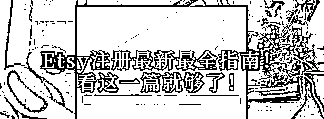  <ne-h1 id="72064d9d" data-lake-id="72064d9d"><ne-heading-ext><ne-heading-anchor></ne-heading-anchor><ne-heading-fold></ne-heading-fold></ne-heading-ext><ne-heading-content><ne-text id="u5fa51de1" ne-bold="true">本文目录：</ne-text></ne-heading-content></ne-h1> <ne-p id="u0ef960f0" data-lake-id="u0ef960f0"><ne-text id="u64835809">01 新手是否适合入场做 Etsy</ne-text></ne-p> <ne-p id="u01e1abe6" data-lake-id="u01e1abe6"><ne-text id="u970181ca">02Etsy 注册所需准备的资料</ne-text></ne-p> <ne-p id="u0269d700" data-lake-id="u0269d700"><ne-text id="uf3936ad6">03Etsy 注册的完整图文实操流程</ne-text></ne-p> <ne-p id="ucc4e58d8" data-lake-id="ucc4e58d8"><ne-text id="u74bf12e0">04Etsy 注册中的注意事项和常见问题</ne-text></ne-p> <ne-p id="uea2e2543" data-lake-id="uea2e2543"><ne-text id="ue15b13bd">05Etsy 如何避免被封店</ne-text></ne-p> <ne-p id="uac6f0eda" data-lake-id="uac6f0eda"><ne-text id="u97ed8363">06Etsy 被暂停、封店后如何申诉</ne-text></ne-p> <ne-p id="uc2e86c19" data-lake-id="uc2e86c19"><ne-text id="udf9fdf71">07Etsy 发货和物流指南&指纹浏览器的用法</ne-text></ne-p> <ne-h1 id="09e368f9" data-lake-id="09e368f9"><ne-heading-ext><ne-heading-anchor></ne-heading-anchor><ne-heading-fold></ne-heading-fold></ne-heading-ext><ne-heading-content><ne-text id="u9846742e">01 新手是否适合入场做 Etsy</ne-text></ne-heading-content></ne-h1> <ne-p id="u7fa0e982" data-lake-id="u7fa0e982"><ne-text id="u5f979d1f">我的回答是：不建议。</ne-text></ne-p> <ne-p id="u41cc8c58" data-lake-id="u41cc8c58"><ne-text id="ua27526fe">原因如下：</ne-text></ne-p> <ne-p id="ue68027af" data-lake-id="ue68027af"><ne-text id="u1cdea740">1.使用国内资料是无法注册 Etsy 的。</ne-text></ne-p> <ne-p id="ud58f2f35" data-lake-id="ud58f2f35"><ne-text id="u583fb643">2.即使你有国外的资料，那么也无法保证注册成功。</ne-text></ne-p> <ne-p id="u40f09ca8" data-lake-id="u40f09ca8"><ne-text id="u7791f202">3.即使注册成功了，因为这个平台极高的风控，店铺依然很容易被暂停甚至封店。</ne-text></ne-p> <ne-p id="u74e1cdb9" data-lake-id="u74e1cdb9"><ne-text id="u25ea1f06">所以很多人问我：我是新手，我想做 Etsy，应该怎么开始？</ne-text></ne-p> <ne-p id="u93478023" data-lake-id="u93478023"><ne-text id="udde67623">我的回答都是：如果你没有海外的朋友，那么就不要开始了。因为一旦开始，你就要进入开店，封店的恶性循环之中，最后疲惫地放弃这个平台，精力和金钱都损失，何必呢？</ne-text></ne-p> <ne-p id="uc66b2801" data-lake-id="uc66b2801"><ne-text id="u21c2d2b7">那么，什么样的情况下适合做 Etsy？</ne-text></ne-p> <ne-p id="u680cb013" data-lake-id="u680cb013"><ne-text id="ufec53c01">有海外的朋友，且这个朋友愿意配合你开店的情况下，是新手入局 Etsy 最好的方式、</ne-text></ne-p> <ne-h1 id="f1f21842" data-lake-id="f1f21842"><ne-heading-ext><ne-heading-anchor></ne-heading-anchor><ne-heading-fold></ne-heading-fold></ne-heading-ext><ne-heading-content><ne-text id="u896f8d0d" ne-bold="true">02</ne-text><ne-text id="u9890233c" ne-bold="true">Etsy 注册所需准备的资料</ne-text></ne-heading-content></ne-h1> <ne-h1 id="e9f5bbe4" data-lake-id="e9f5bbe4"><ne-heading-ext><ne-heading-anchor></ne-heading-anchor><ne-heading-fold></ne-heading-fold></ne-heading-ext><ne-heading-content><ne-text id="u9b0929e1" ne-bold="true">资料准备</ne-text></ne-heading-content></ne-h1> <ne-p id="u46864efb" data-lake-id="u46864efb"><ne-text id="uba7a7449">证件照片、邮箱、电话号码、地址信息、付款卡、收款账户、手机验证器软件、产品照片、IP 网络、浏览器环境。</ne-text></ne-p> <ne-h1 id="50d687c1" data-lake-id="50d687c1"><ne-heading-ext><ne-heading-anchor></ne-heading-anchor><ne-heading-fold></ne-heading-fold></ne-heading-ext><ne-heading-content><ne-text id="uec1a22cf" ne-bold="true">资料详细说明</ne-text></ne-heading-content></ne-h1> <ne-h1 id="c89606aa" data-lake-id="c89606aa"><ne-heading-ext><ne-heading-anchor></ne-heading-anchor><ne-heading-fold></ne-heading-fold></ne-heading-ext><ne-heading-content><ne-text id="ub0cd6d98" ne-bold="true">证件照片：</ne-text></ne-heading-content></ne-h1> <ne-p id="ufeac7053" data-lake-id="ufeac7053"><ne-text id="u1648779f">驾照，护照，身份证等。</ne-text></ne-p> <ne-h1 id="76daee7c" data-lake-id="76daee7c"><ne-heading-ext><ne-heading-anchor></ne-heading-anchor><ne-heading-fold></ne-heading-fold></ne-heading-ext><ne-heading-content><ne-text id="ua91dc441" ne-bold="true">邮箱：</ne-text></ne-heading-content></ne-h1> <ne-p id="udf5e2dcc" data-lake-id="udf5e2dcc"><ne-text id="ubadbf59e">使用国外的邮箱，不要使用国内的 qq，163 等。</ne-text></ne-p> <ne-p id="u8f656287" data-lake-id="u8f656287"><ne-text id="u6de2a8ae">不建议用 gmail 邮箱，因为 gmail 邮箱容易被封号，可以使用 outlook 或者其他国外邮箱。</ne-text></ne-p> <ne-h1 id="c44c00e9" data-lake-id="c44c00e9"><ne-heading-ext><ne-heading-anchor></ne-heading-anchor><ne-heading-fold></ne-heading-fold></ne-heading-ext><ne-heading-content><ne-text id="u07f51f52" ne-bold="true">电话号码：</ne-text></ne-heading-content></ne-h1> <ne-p id="ua29836de" data-lake-id="ua29836de"><ne-text id="u794cc901">国外的电话，但是不需要接收验证码，只要填写进去。</ne-text></ne-p> <ne-p id="u49104653" data-lake-id="u49104653"><ne-text id="u9b7091a7">可以上网搜索一个相对应国家的电话号码。</ne-text></ne-p> <ne-h1 id="1274606b" data-lake-id="1274606b"><ne-heading-ext><ne-heading-anchor></ne-heading-anchor><ne-heading-fold></ne-heading-fold></ne-heading-ext><ne-heading-content><ne-text id="ud6973492" ne-bold="true">地址：</ne-text></ne-heading-content></ne-h1> <ne-p id="ua43229d8" data-lake-id="ua43229d8"><ne-text id="u4dffc3a9">一个真实存在的住址。可以到一些国外的房地产网站或者点评网站上面找。</ne-text></ne-p> <ne-h1 id="fa346e10" data-lake-id="fa346e10"><ne-heading-ext><ne-heading-anchor></ne-heading-anchor><ne-heading-fold></ne-heading-fold></ne-heading-ext><ne-heading-content><ne-text id="ue8a4372e" ne-bold="true">付款卡：</ne-text></ne-heading-content></ne-h1> <ne-p id="u5f441bd9" data-lake-id="u5f441bd9"><ne-text id="u0970286b">用信用卡作为付款的卡，也可以使用下面这几家服务商的虚拟信用卡，开卡成本比较低。</ne-text></ne-p> <ne-p id="uf910010f" data-lake-id="uf910010f"><ne-text id="u0e9634a9">万里汇付卡、pingpong 福卡、连连越达卡、派安盈，空中云汇的虚拟卡。</ne-text></ne-p> <ne-p id="u4e491e79" data-lake-id="u4e491e79"><ne-text id="u3487ab82">注意：这几家服务商的虚拟卡，都要求账户要有余额，所以如果你的账户没有收过款，那么大概率是无法成功开卡的，可以看这些渠道：Bkbpay 贝卡帮、某宝购买。</ne-text></ne-p> <ne-p id="u26119624" data-lake-id="u26119624"><ne-text id="ufe15b1ea">使用前一定要查卡头，卡头必须和注册国家一致。</ne-text></ne-p> <ne-p id="ubd4a4c2d" data-lake-id="ubd4a4c2d"><ne-text id="u004f5404">比如注册的是美国店，那么卡头也必须是美国的。</ne-text></ne-p> <ne-p id="u370d96f2" data-lake-id="u370d96f2"><ne-text id="u417e562c">使用这个链接（</ne-text>[<ne-text id="uc9f8efee">bincheck.io</ne-text>](http://bincheck.io)<ne-text id="u8837569a">），输入虚拟卡号的前 6 位查询是属于哪个国家的。</ne-text></ne-p> <ne-p id="u0f9cf886" data-lake-id="u0f9cf886"><ne-card data-card-name="image" data-card-type="inline" id="iauzm" data-event-boundary="card">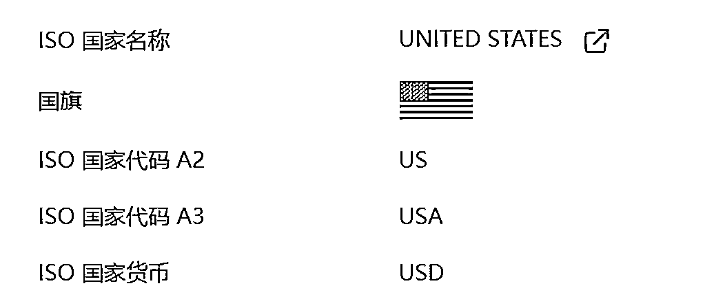  <ne-h1 id="c1617744" data-lake-id="c1617744"><ne-heading-ext><ne-heading-anchor></ne-heading-anchor><ne-heading-fold></ne-heading-fold></ne-heading-ext><ne-heading-content><ne-text id="u44268822" ne-bold="true">收款账户：</ne-text></ne-heading-content></ne-h1> <ne-p id="u2b434f26" data-lake-id="u2b434f26"><ne-text id="u81d1b84f">收款账号服务商推荐：万里汇、连连、Pingpong、空中云汇、光子易。</ne-text></ne-p> <ne-p id="uce223e97" data-lake-id="uce223e97"><ne-text id="ua4f636c8">注意：开设的货币类型要和目标国家的货币类型一致。美区的 Etsy 因为需要过 plaid 验证，所以暂时没有好的方案来收款。</ne-text></ne-p> <ne-h1 id="e3f8d200" data-lake-id="e3f8d200"><ne-heading-ext><ne-heading-anchor></ne-heading-anchor><ne-heading-fold></ne-heading-fold></ne-heading-ext><ne-heading-content><ne-text id="ufee3b64d" ne-bold="true">手机验证器：</ne-text></ne-heading-content></ne-h1> <ne-p id="u4f903a3e" data-lake-id="u4f903a3e"><ne-text id="u5ad69d0e">用在注册的最后一步做验证，可以使用谷歌或者微软的验证器软件。</ne-text></ne-p> <ne-p id="ud133b952" data-lake-id="ud133b952"><ne-text id="u5c468cd0">谷歌的叫 Google Authenticator，微软验证器的名字叫 Microsoft Authenticator。</ne-text></ne-p> <ne-p id="u4eb9f246" data-lake-id="u4eb9f246"><ne-text id="u38d5c86e">国内的安卓手机不好安装，建议直接用苹果手机下载。</ne-text></ne-p> <ne-p id="ue61a7e6c" data-lake-id="ue61a7e6c"><ne-card data-card-name="image" data-card-type="inline" id="dvgtc" data-event-boundary="card">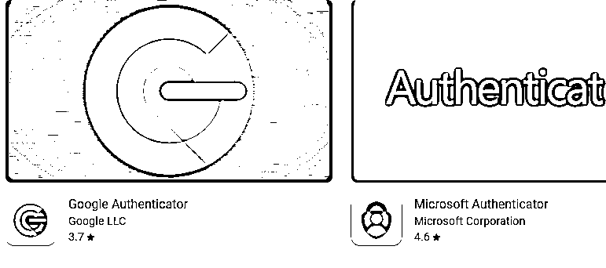  <ne-p id="ub5ba1eb6" data-lake-id="ub5ba1eb6"><ne-text id="u30a59bf1">注意：</ne-text></ne-p> <ne-p id="u162b68cd" data-lake-id="u162b68cd"><ne-text id="u7e03a500">1.不建议使用手机短信的方式来验证，因为如果你用的是国外手机号，忘记续费的话，就收不到短信，会导致店铺无法登录。</ne-text></ne-p> <ne-p id="uee468e75" data-lake-id="uee468e75"><ne-text id="u5adaf51b">2.验证器软件是在手机上的，如果手机丢失，或者恢复出厂设置了，那么数据也会丢失，无法恢复。所以建议也要把验证时的二维码截图保存下来。</ne-text></ne-p> <ne-p id="u737dbeaa" data-lake-id="u737dbeaa"><ne-text id="uc67d390f">3.或者也可以使用这个软件：enpass，是个密码管理软件，也支持保存这种一次性验证码，可以绑定云盘，手机即使丢了只要 enpass 账号还在那么就可以恢复。</ne-text></ne-p> <ne-h1 id="fa5d906d" data-lake-id="fa5d906d"><ne-heading-ext><ne-heading-anchor></ne-heading-anchor><ne-heading-fold></ne-heading-fold></ne-heading-ext><ne-heading-content><ne-text id="ud6a32d82" ne-bold="true">产品照片：</ne-text></ne-heading-content></ne-h1> <ne-p id="ufb039554" data-lake-id="ufb039554"><ne-text id="uba351dd5">这是非常重要的一点，但是很容易被大家忽略。因为 Etsy 明确表示了，这是一个手工产品和复古产品的平台。所以我们的产品照片必须能够符合这一点。</ne-text></ne-p> <ne-p id="u340f6486" data-lake-id="u340f6486"><ne-text id="u08c145db">注意，不是我们自己判断产品是否符合标准，最重要的是要拍得让他知道我们的产品是符合标准的。</ne-text></ne-p> <ne-p id="uc6829eca" data-lake-id="uc6829eca"><ne-text id="uf03a0864">那么最简单的办法就是能把产品的制作过程拍下来，然后作为主图。</ne-text></ne-p> <ne-p id="ua2492439" data-lake-id="ua2492439"><ne-text id="u244860b7">同时，最好保留一份产品制作视频，有利于后期触发审核时申诉。</ne-text></ne-p> <ne-p id="u5384f702" data-lake-id="u5384f702"><ne-text id="u447e0bc3">如果使用的是网图（网络上找的图片），注意要修改图片的名称，并使用工具修改或者增加图片的元数据。</ne-text></ne-p> <ne-p id="u1e32816b" data-lake-id="u1e32816b"><ne-text id="uef6a2dfb">图片元数据修改工具可以用 Magicexif。</ne-text></ne-p> <ne-p id="uec682c39" data-lake-id="uec682c39"><ne-text id="u3964a3a7">网上下载下来的图片的元数据一般是空白的，修改之后就会有数据。</ne-text></ne-p> <ne-p id="uc8a10aad" data-lake-id="uc8a10aad"><ne-text id="ud41f1dda">操作前后变化如下：</ne-text></ne-p> <ne-p id="u68cd835c" data-lake-id="u68cd835c"><ne-card data-card-name="image" data-card-type="inline" id="VPbF5" data-event-boundary="card">  <ne-p id="u41d0e0a0" data-lake-id="u41d0e0a0"><ne-card data-card-name="image" data-card-type="inline" id="Wnm06" data-event-boundary="card">  <ne-p id="ud84bb4e0" data-lake-id="ud84bb4e0"><ne-text id="ua410445e">同时也可以准备好产品的英文标题，英文描述，最好也是自己写之后翻译，可以简单一些。</ne-text></ne-p> <ne-h1 id="9c5a1271" data-lake-id="9c5a1271"><ne-heading-ext><ne-heading-anchor></ne-heading-anchor><ne-heading-fold></ne-heading-fold></ne-heading-ext><ne-heading-content><ne-text id="u14eba723" ne-bold="true">IP 网络：</ne-text></ne-heading-content></ne-h1> <ne-p id="uce6a0ffa" data-lake-id="uce6a0ffa"><ne-text id="uad31fb5e">主要有四种 IP 注册和运营方式。</ne-text></ne-p> <ne-p id="ufe969f8d" data-lake-id="ufe969f8d"><ne-text id="u4401e14c">第一种，使用动态住宅 IP 注册，等店铺稳定之后再更换到固定 IP。</ne-text></ne-p> <ne-p id="ub95fcebf" data-lake-id="ub95fcebf"><ne-text id="u8224704d">第二种，一开始注册就使用小众的服务器 IP 直接注册，后续运营时 IP 不变。</ne-text></ne-p> <ne-p id="ua9eb6dfd" data-lake-id="ua9eb6dfd"><ne-text id="u8a342d7e">第三种，注册和运营就一直用动态住宅 IP，但费用比较贵。</ne-text></ne-p> <ne-p id="ufe384ac5" data-lake-id="ufe384ac5"><ne-text id="u70f29826">第四张，有当地的朋友，直接给一台专属电脑，远程操控，这是最理想最好的情况。</ne-text></ne-p> <ne-p id="ud8e8247d" data-lake-id="ud8e8247d"><ne-text id="u3b5f4efe">同时注意，使用 IP 前，先检查 IP 是否属于目标国家，并且可以用这个网站（</ne-text>[<ne-text id="u1ccf4846">scamalytics.com/ip</ne-text>](http://scamalytics.com/ip) <ne-text id="u05dfc06f">）看 IP 的垃圾值是否过高，绿色提示最好，黄色一般，红色直接不要用。</ne-text></ne-p> <ne-p id="u07ef892c" data-lake-id="u07ef892c"><ne-text id="ub6339c29">建议注册 Etsy 店铺时使用动态住宅 IP（不了解什么是动态住宅 IP？可以看文末的链接），因为这样的 IP 是最干净的。</ne-text></ne-p> <ne-p id="u7c467d87" data-lake-id="u7c467d87"><ne-text id="u8999ea02">至于 IP 服务商这里就不做推荐了，网络上搜索一下有很多。如果不知道怎么选择，那么就选比较贵的，原因是越贵的，用的人越少，用的人越少就越不容易导致风控。</ne-text></ne-p> <ne-h1 id="2cca914f" data-lake-id="2cca914f"><ne-heading-ext><ne-heading-anchor></ne-heading-anchor><ne-heading-fold></ne-heading-fold></ne-heading-ext><ne-heading-content><ne-text id="uffcbf939" ne-bold="true">浏览器环境：</ne-text></ne-heading-content></ne-h1> <ne-p id="u700f01e4" data-lake-id="u700f01e4"><ne-text id="ucb24d4dc">使用指纹浏览器软件，建议使用 adspower 或者 Hubstudio。</ne-text></ne-p> <ne-p id="u28a94d86" data-lake-id="u28a94d86"><ne-text id="u67ea6469">这个可以延伸的内容比较多，到时候我会再单独写一篇文章来说明。</ne-text></ne-p> <ne-h1 id="2db824eb" data-lake-id="2db824eb"><ne-heading-ext><ne-heading-anchor></ne-heading-anchor><ne-heading-fold></ne-heading-fold></ne-heading-ext><ne-heading-content><ne-text id="uaa56cb87" ne-bold="true">03</ne-text><ne-text id="u23709af4" ne-bold="true">Etsy 注册的完整图文实操流程</ne-text></ne-heading-content></ne-h1> <ne-p id="uba79733b" data-lake-id="uba79733b"><ne-text id="ube4a0bd4">打开网址：</ne-text>[<ne-text id="u00ba0dad">www.etsy.com</ne-text>](http://www.etsy.com)</ne-p> <ne-p id="uae9fc2d4" data-lake-id="uae9fc2d4"><ne-text id="u47c79522">首先，滑到底部看国家和货币是否和要注册的国家地区一致，如果不一致，说明 IP 不对，停止注册并更换 IP。</ne-text></ne-p> <ne-p id="u8d86878b" data-lake-id="u8d86878b"><ne-card data-card-name="image" data-card-type="inline" id="RLjUN" data-event-boundary="card">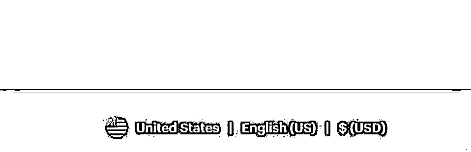  <ne-p id="uc32939b9" data-lake-id="uc32939b9"><ne-text id="u34d0faf9">如果一致，点击右上角。</ne-text></ne-p> <ne-p id="u2bc4a1d1" data-lake-id="u2bc4a1d1"><ne-card data-card-name="image" data-card-type="inline" id="gu5OT" data-event-boundary="card">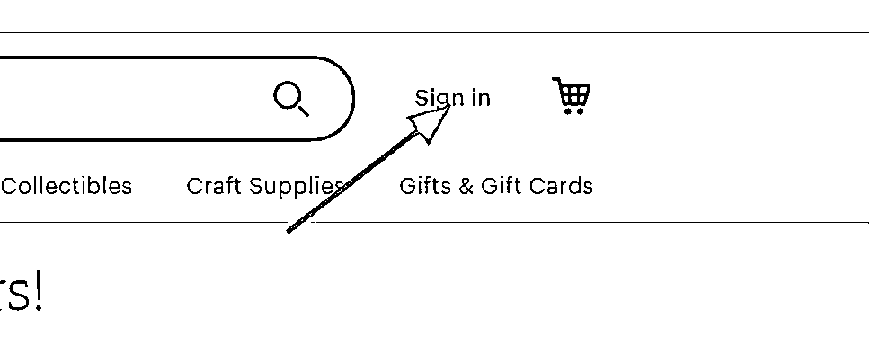  <ne-h1 id="6645bcea" data-lake-id="6645bcea"><ne-heading-ext><ne-heading-anchor></ne-heading-anchor><ne-heading-fold></ne-heading-fold></ne-heading-ext><ne-heading-content><ne-text id="u46117f14" ne-bold="true">注册账号</ne-text></ne-heading-content></ne-h1> <ne-p id="u1004171a" data-lake-id="u1004171a"><ne-text id="u273f7923">选择注册。</ne-text></ne-p> <ne-p id="u32314471" data-lake-id="u32314471"><ne-card data-card-name="image" data-card-type="inline" id="ktjiG" data-event-boundary="card">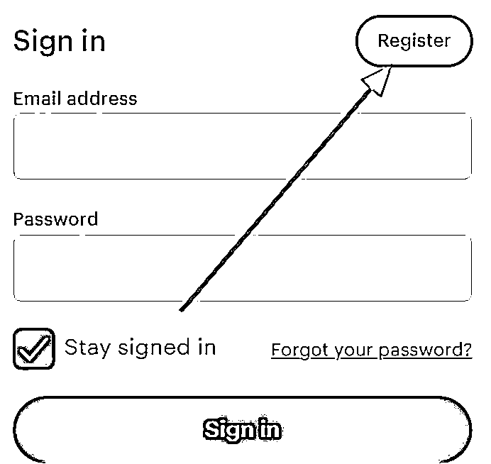  <ne-p id="u86aa876b" data-lake-id="u86aa876b"><ne-text id="u8de325b6">邮箱，FirstName，店铺密码，输入，然后点击注册。</ne-text></ne-p> <ne-p id="ud957ecd8" data-lake-id="ud957ecd8"><ne-card data-card-name="image" data-card-type="inline" id="EPPMP" data-event-boundary="card">  <ne-p id="u880c5b07" data-lake-id="u880c5b07"><ne-text id="u1cc540ea">登录邮箱。</ne-text></ne-p> <ne-p id="uc821dc7f" data-lake-id="uc821dc7f"><ne-text id="u309d787e">找到 Etsy 的邮件，点击确认账号。</ne-text></ne-p> <ne-p id="uad11ec89" data-lake-id="uad11ec89"><ne-card data-card-name="image" data-card-type="inline" id="wiJzH" data-event-boundary="card">  <ne-p id="u0761150a" data-lake-id="u0761150a"><ne-text id="uc789c1e2">邮箱确认成功。</ne-text></ne-p> <ne-p id="ua1ab8b8c" data-lake-id="ua1ab8b8c"><ne-card data-card-name="image" data-card-type="inline" id="i86NT" data-event-boundary="card">  <ne-p id="u5c933869" data-lake-id="u5c933869"><ne-text id="u4d3d5c10">点击右上角的头像，选择“Sell on Etsy”</ne-text></ne-p> <ne-p id="u3af71307" data-lake-id="u3af71307"><ne-card data-card-name="image" data-card-type="inline" id="Q5yYk" data-event-boundary="card">  <ne-p id="u87a92399" data-lake-id="u87a92399"><ne-text id="ub2a3e907">按照下面步骤点击。</ne-text></ne-p> <ne-p id="u1ddec8c2" data-lake-id="u1ddec8c2"><ne-card data-card-name="image" data-card-type="inline" id="iCqTQ" data-event-boundary="card">  <ne-p id="u72b6053c" data-lake-id="u72b6053c"><ne-card data-card-name="image" data-card-type="inline" id="zahob" data-event-boundary="card">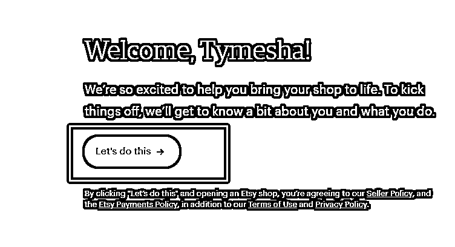  <ne-p id="uabebba03" data-lake-id="uabebba03"><ne-card data-card-name="image" data-card-type="inline" id="C5ntV" data-event-boundary="card">  <ne-p id="u45ad3e32" data-lake-id="u45ad3e32"><ne-text id="uf301a66e">随便勾选几个选项。下一步。</ne-text></ne-p> <ne-p id="u42a7697b" data-lake-id="u42a7697b"><ne-card data-card-name="image" data-card-type="inline" id="U4CM8" data-event-boundary="card">  <ne-p id="u02dc7308" data-lake-id="u02dc7308"><ne-card data-card-name="image" data-card-type="inline" id="yYH4y" data-event-boundary="card">  <ne-h1 id="0f6178ad" data-lake-id="0f6178ad"><ne-heading-ext><ne-heading-anchor></ne-heading-anchor><ne-heading-fold></ne-heading-fold></ne-heading-ext><ne-heading-content><ne-text id="u8a20fb23" ne-bold="true">填写店铺信息</ne-text></ne-heading-content></ne-h1> <ne-p id="u872efbf0" data-lake-id="u872efbf0"><ne-text id="u42f6099f">Shop language 选择目标国家语言。</ne-text></ne-p> <ne-p id="u822357a8" data-lake-id="u822357a8"><ne-text id="u65c11953">Shop country 选择注册的国家。</ne-text></ne-p> <ne-p id="u7953e6f0" data-lake-id="u7953e6f0"><ne-text id="ua086b0bd">Shop currency 选择注册国家的货币。</ne-text></ne-p> <ne-p id="u71e7ae56" data-lake-id="u71e7ae56"><ne-card data-card-name="image" data-card-type="inline" id="Mn183" data-event-boundary="card">  <ne-p id="u020e5161" data-lake-id="u020e5161"><ne-text id="u6956bcfe">填入商店名称。</ne-text></ne-p> <ne-p id="u71d6ee9c" data-lake-id="u71d6ee9c"><ne-text id="ud0c38a71">不要有特殊符号和空格。</ne-text></ne-p> <ne-p id="ua914b54c" data-lake-id="ua914b54c"><ne-card data-card-name="image" data-card-type="inline" id="DhJfc" data-event-boundary="card">  <ne-p id="u19e1f4ab" data-lake-id="u19e1f4ab"><ne-text id="u279d2c8d">店铺名许可之后，进入下一步。</ne-text></ne-p> <ne-p id="ubd4f53d3" data-lake-id="ubd4f53d3"><ne-card data-card-name="image" data-card-type="inline" id="xSMX6" data-event-boundary="card">  <ne-h1 id="9ba7787a" data-lake-id="9ba7787a"><ne-heading-ext><ne-heading-anchor></ne-heading-anchor><ne-heading-fold></ne-heading-fold></ne-heading-ext><ne-heading-content><ne-text id="ubd78caca" ne-bold="true">上传产品</ne-text></ne-heading-content></ne-h1> <ne-p id="ua692abb3" data-lake-id="ua692abb3"><ne-text id="u402a3fa9">点击开始上传产品图片。</ne-text></ne-p> <ne-p id="u68a52f9e" data-lake-id="u68a52f9e"><ne-card data-card-name="image" data-card-type="inline" id="HAqAd" data-event-boundary="card">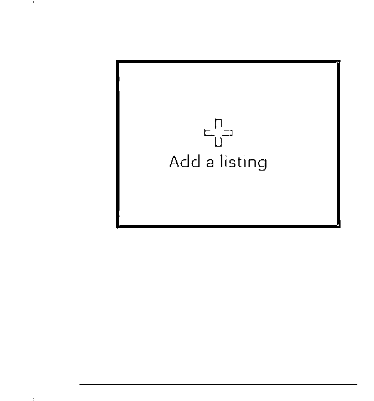  <ne-p id="ue2c01874" data-lake-id="ue2c01874"><ne-card data-card-name="image" data-card-type="inline" id="L7144" data-event-boundary="card">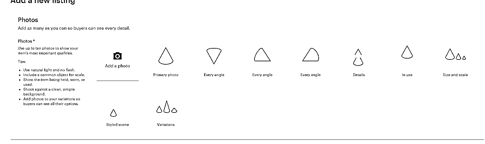  <ne-p id="u5866aa4d" data-lake-id="u5866aa4d"><ne-text id="uc254b18b">视频不用上传。</ne-text></ne-p> <ne-p id="u7d9c16ac" data-lake-id="u7d9c16ac"><ne-card data-card-name="image" data-card-type="inline" id="gH1Uv" data-event-boundary="card">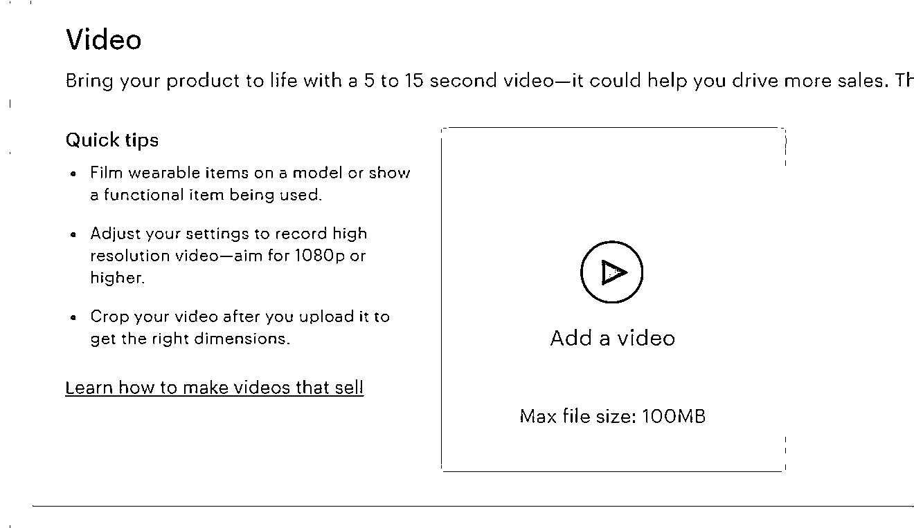  <ne-p id="u4910d46e" data-lake-id="u4910d46e"><ne-text id="u5fae9560">填入 listing 标题，可以参考同类产品标题或者自己写标题翻译成英文。</ne-text></ne-p> <ne-p id="ufb64401d" data-lake-id="ufb64401d"><ne-card data-card-name="image" data-card-type="inline" id="Qd2Ya" data-event-boundary="card">  <ne-p id="uafe34b66" data-lake-id="uafe34b66"><ne-text id="u72dc0d72">这些带*号的都是必填的，</ne-text></ne-p> <ne-p id="u193a3993" data-lake-id="u193a3993"><ne-card data-card-name="image" data-card-type="inline" id="Efuun" data-event-boundary="card">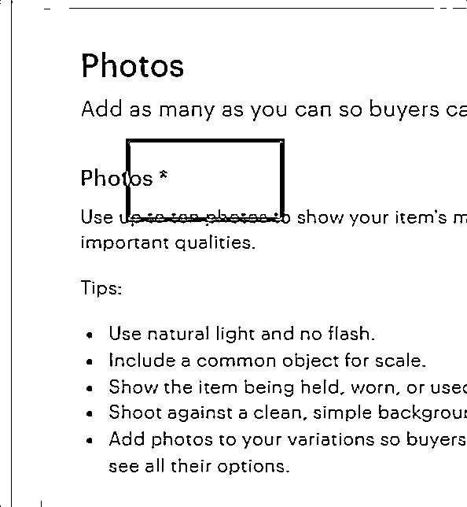  <ne-p id="uceb6006c" data-lake-id="uceb6006c"><ne-text id="uc681bda6">带“optional”则是可选的，可不填。</ne-text></ne-p> <ne-p id="u74368a96" data-lake-id="u74368a96"><ne-text id="u2560d769">但我建议会填的最好也填一下，为了让信息更完善。</ne-text></ne-p> <ne-p id="uf1dd2453" data-lake-id="uf1dd2453"><ne-card data-card-name="image" data-card-type="inline" id="tWo2O" data-event-boundary="card">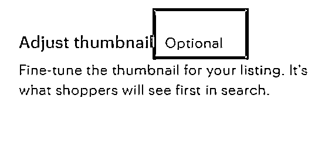  <ne-p id="u37e84a0c" data-lake-id="u37e84a0c"><ne-text id="u10247a4b">自动更新或者手动更新 listing，建议选择自动。</ne-text></ne-p> <ne-p id="u8dcbea82" data-lake-id="u8dcbea82"><ne-text id="ud52d8ce0">选择产品是实体产品还是虚拟产品。</ne-text></ne-p> <ne-p id="u4c828524" data-lake-id="u4c828524"><ne-card data-card-name="image" data-card-type="inline" id="jjtII" data-event-boundary="card">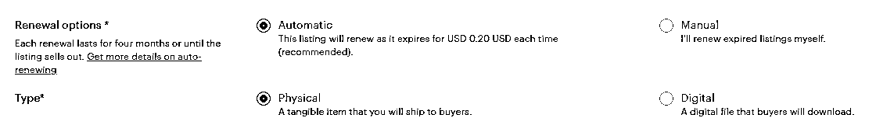  <ne-p id="u3644fb2d" data-lake-id="u3644fb2d"><ne-text id="u3fd0b9e8">tag 是很重要的一个内容，后期所有的产品建议都填写 tag。</ne-text></ne-p> <ne-p id="u3f0c5813" data-lake-id="u3f0c5813"><ne-text id="ua7fd16f5">因为 Etsy 的广告触发机制会爬取 listing 的 tag。相当于多了一行可以填写关键词的地方。</ne-text></ne-p> <ne-p id="u26c5438d" data-lake-id="u26c5438d"><ne-card data-card-name="image" data-card-type="inline" id="zh0Wu" data-event-boundary="card">  <ne-p id="ua8fac869" data-lake-id="ua8fac869"><ne-text id="udf904ced">前期数量建议填少一些，最好是个位数。</ne-text></ne-p> <ne-p id="u1ae9f624" data-lake-id="u1ae9f624"><ne-card data-card-name="image" data-card-type="inline" id="xrT11" data-event-boundary="card">  <ne-p id="u153dfe80" data-lake-id="u153dfe80"><ne-text id="u724bfd57">如果你有多个 sku，可以创建变体。</ne-text></ne-p> <ne-p id="ude6ee89a" data-lake-id="ude6ee89a"><ne-text id="u9688007e">个性化选项是一个可供用户自己输入自定义内容的文本框，一般适用于定制化产品。</ne-text></ne-p> <ne-p id="u106b3e76" data-lake-id="u106b3e76"><ne-card data-card-name="image" data-card-type="inline" id="XAUXx" data-event-boundary="card">  <ne-p id="ued3b4f62" data-lake-id="ued3b4f62"><ne-text id="u5d4dddf7">处理时间，指的是客户下单到你发货的时间。</ne-text></ne-p> <ne-p id="u32c69f7e" data-lake-id="u32c69f7e"><ne-card data-card-name="image" data-card-type="inline" id="woh1x" data-event-boundary="card">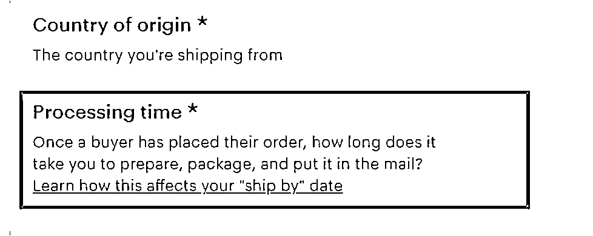  <ne-p id="ub1b1b697" data-lake-id="ub1b1b697"><ne-text id="u7d6067f6">点击保持和继续。</ne-text></ne-p> <ne-p id="ueed63105" data-lake-id="ueed63105"><ne-card data-card-name="image" data-card-type="inline" id="rXXVD" data-event-boundary="card">  <ne-p id="uca9668e9" data-lake-id="uca9668e9"><ne-text id="u5c4db5f4">产品全部上传后点击右下角继续。</ne-text></ne-p> <ne-p id="u90a7ae69" data-lake-id="u90a7ae69"><ne-card data-card-name="image" data-card-type="inline" id="EjHiF" data-event-boundary="card">  <ne-h1 id="95c4fad9" data-lake-id="95c4fad9"><ne-heading-ext><ne-heading-anchor></ne-heading-anchor><ne-heading-fold></ne-heading-fold></ne-heading-ext><ne-heading-content><ne-text id="u15ba1d72" ne-bold="true">填写个人/公司资料</ne-text></ne-heading-content></ne-h1> <ne-p id="u7d70e048" data-lake-id="u7d70e048"><ne-text id="u72ca8f60">如果是个人卖家，就选择第一个，如果是公司注册，就选择第二个。</ne-text></ne-p> <ne-p id="u54df1e3d" data-lake-id="u54df1e3d"><ne-card data-card-name="image" data-card-type="inline" id="esEPF" data-event-boundary="card">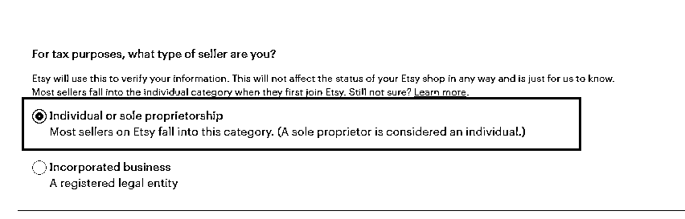  <ne-p id="u89731e0a" data-lake-id="u89731e0a"><ne-text id="ubc940929">这里以个人为例填写。</ne-text></ne-p> <ne-p id="u2427650d" data-lake-id="u2427650d"><ne-text id="u684eea7f">选择目标国家，填入个人资料。</ne-text></ne-p> <ne-p id="u58900173" data-lake-id="u58900173"><ne-text id="u75350c4f">包含名字，出生日期，地址，电话号码。</ne-text></ne-p> <ne-p id="u9688625f" data-lake-id="u9688625f"><ne-text id="ud6ed872c">地址方面，国外的地址是按照从小到大排列。</ne-text></ne-p> <ne-p id="u01f70dac" data-lake-id="u01f70dac"><ne-text id="u739a6eae">所以左边的 number 填写的是应该是这条路的几号，填入数字。右边则填写的是路的名称。</ne-text></ne-p> <ne-p id="u6af5ec4c" data-lake-id="u6af5ec4c"><ne-card data-card-name="image" data-card-type="inline" id="bB1i8" data-event-boundary="card">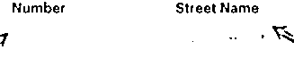  <ne-h1 id="5e26e8a4" data-lake-id="5e26e8a4"><ne-heading-ext><ne-heading-anchor></ne-heading-anchor><ne-heading-fold></ne-heading-fold></ne-heading-ext><ne-heading-content><ne-text id="ud8451b5f" ne-bold="true">填写收款账号</ne-text></ne-heading-content></ne-h1> <ne-p id="u8e0ad0e1" data-lake-id="u8e0ad0e1"><ne-text id="u2bf428d5">这里以 pingpong 为例，演示如何申请一个适用于 Etsy 的虚拟收款账号。</ne-text></ne-p> <ne-p id="u70dfa3e7" data-lake-id="u70dfa3e7"><ne-text id="u49677361">先到 pingpong 上注册一个账号，申请一个对应地区的 Etsy 的账户，然后填入店铺名称。</ne-text></ne-p> <ne-p id="u0e777352" data-lake-id="u0e777352"><ne-card data-card-name="image" data-card-type="inline" id="zrw3Y" data-event-boundary="card">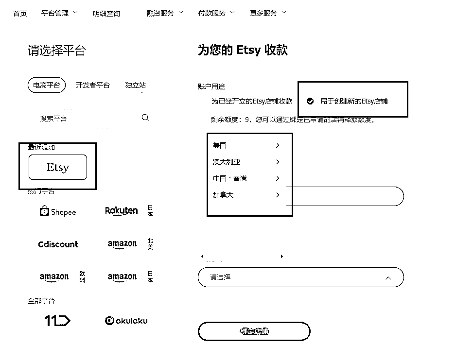  <ne-p id="u57f02da7" data-lake-id="u57f02da7"><ne-text id="u3c883dac">pingpong 申请下来的银行账号，主要有以下这些信息。</ne-text></ne-p> <ne-p id="u6e1bef50" data-lake-id="u6e1bef50"><ne-card data-card-name="image" data-card-type="inline" id="WLhly" data-event-boundary="card">  <ne-p id="u53570df8" data-lake-id="u53570df8"><ne-text id="u51596e69">回到 Etsy 页面，选择目标国家。</ne-text></ne-p> <ne-p id="ucafeec14" data-lake-id="ucafeec14"><ne-text id="ue03ea1c9">账号类型选择 Checking。</ne-text></ne-p> <ne-p id="u9b91ee9f" data-lake-id="u9b91ee9f"><ne-text id="udf94f522">Bank Name 就是银行的名称</ne-text></ne-p> <ne-p id="u4ee8dfe6" data-lake-id="u4ee8dfe6"><ne-text id="u6f30e49c">Bank Code 就是银行代码</ne-text></ne-p> <ne-p id="uaf7931e1" data-lake-id="uaf7931e1"><ne-text id="ufbb824d2">Branch Code 就是分行代码</ne-text></ne-p> <ne-p id="u48e0013b" data-lake-id="u48e0013b"><ne-text id="u8ca3c792">Account Number 就是银行账户号码</ne-text></ne-p> <ne-p id="u045e0f35" data-lake-id="u045e0f35"><ne-text id="u24f04629">填写的时候注意前后不要有空格。</ne-text></ne-p> <ne-p id="u2806ea7d" data-lake-id="u2806ea7d"><ne-card data-card-name="image" data-card-type="inline" id="S7Ala" data-event-boundary="card">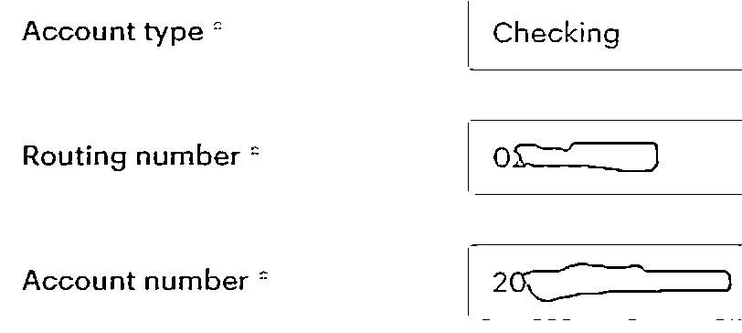  <ne-p id="u307493cc" data-lake-id="u307493cc"><ne-text id="u21c87f5f">点击保存下一步。</ne-text></ne-p> <ne-p id="u0bb136ac" data-lake-id="u0bb136ac"><ne-text id="u1618295e">如果遇到保存失败，像这样：</ne-text></ne-p> <ne-p id="u2b501405" data-lake-id="u2b501405"><ne-card data-card-name="image" data-card-type="inline" id="drc6Y" data-event-boundary="card">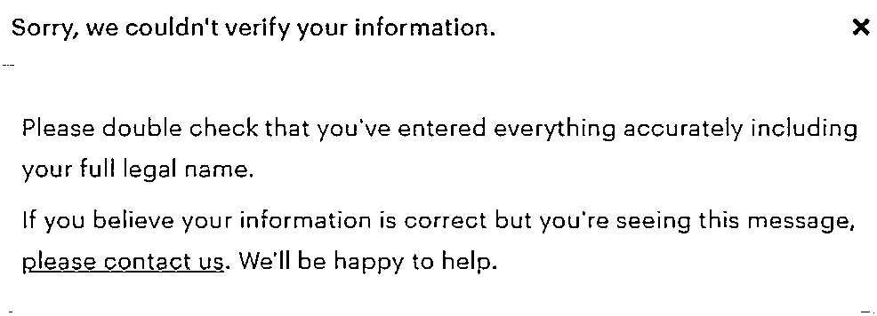  <ne-p id="u2bd568ec" data-lake-id="u2bd568ec"><ne-text id="u564d84b0">按照这个步骤改动：</ne-text></ne-p> <ne-p id="ufd673bba" data-lake-id="ufd673bba"><ne-text id="u3ceb63a1">排查一下邮编中有无空格，地址栏中有无空格，手机号中有无括号，破折扣，空格之类的符号，删除，然后保存。如果还无法保存，可以删除部分信息，手动填写（就是用键盘一个一个字母敲上去），再次保存，一般就都能搞定了。</ne-text></ne-p> <ne-h1 id="f6e54091" data-lake-id="f6e54091"><ne-heading-ext><ne-heading-anchor></ne-heading-anchor><ne-heading-fold></ne-heading-fold></ne-heading-ext><ne-heading-content><ne-text id="ud794cd80" ne-bold="true">上传证件资料</ne-text></ne-heading-content></ne-h1> <ne-p id="u6856b70b" data-lake-id="u6856b70b"><ne-text id="u7490f2be">选择证件的类型，上传证件。</ne-text></ne-p> <ne-p id="u53750fbb" data-lake-id="u53750fbb"><ne-card data-card-name="image" data-card-type="inline" id="KSKrZ" data-event-boundary="card">  <ne-p id="uf1167f7b" data-lake-id="uf1167f7b"><ne-text id="u0b979d51">证件的国家和类型一定要注意不要选错。</ne-text></ne-p> <ne-p id="u10cad450" data-lake-id="u10cad450"><ne-text id="u148037ee">护照是选择 passport。</ne-text></ne-p> <ne-p id="u65b28d88" data-lake-id="u65b28d88"><ne-text id="u76420301">驾照/驾驶证选择 Drivers License。</ne-text></ne-p> <ne-p id="u8f5e5939" data-lake-id="u8f5e5939"><ne-text id="ub1d1f935">ID 卡选择 Identity Card。</ne-text></ne-p> <ne-p id="uc05d8054" data-lake-id="uc05d8054"><ne-text id="u214136a3">上传前要注意资料图片的名称不能含有中文，有的话要修改后再上传。</ne-text></ne-p> <ne-p id="u498f82ae" data-lake-id="u498f82ae"><ne-card data-card-name="image" data-card-type="inline" id="YNyaq" data-event-boundary="card">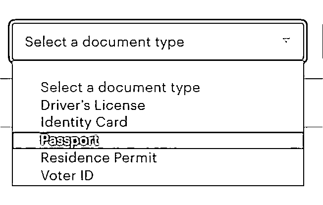  <ne-p id="u45200987" data-lake-id="u45200987"><ne-text id="u928255af">上传之后，点击下面的 save 按钮</ne-text></ne-p> <ne-p id="u1742eb30" data-lake-id="u1742eb30"><ne-card data-card-name="image" data-card-type="inline" id="nZNz4" data-event-boundary="card">  <ne-p id="ubbffaa4a" data-lake-id="ubbffaa4a"><ne-text id="u48d7d6f9">选择打开 turn on。</ne-text></ne-p> <ne-p id="uee4bd0c5" data-lake-id="uee4bd0c5"><ne-card data-card-name="image" data-card-type="inline" id="jDZ1E" data-event-boundary="card">  <ne-p id="ua764ec0e" data-lake-id="ua764ec0e"><ne-card data-card-name="image" data-card-type="inline" id="mXdaQ" data-event-boundary="card">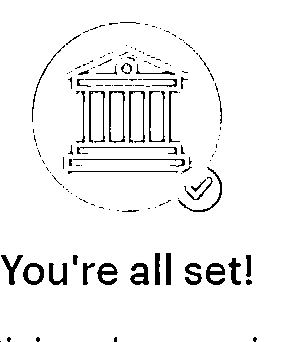  <ne-p id="u2162cde0" data-lake-id="u2162cde0"><ne-text id="ua2baa884">空白处随便点击一下，下一步。</ne-text></ne-p> <ne-p id="u77122ea8" data-lake-id="u77122ea8"><ne-card data-card-name="image" data-card-type="inline" id="zxaqI" data-event-boundary="card">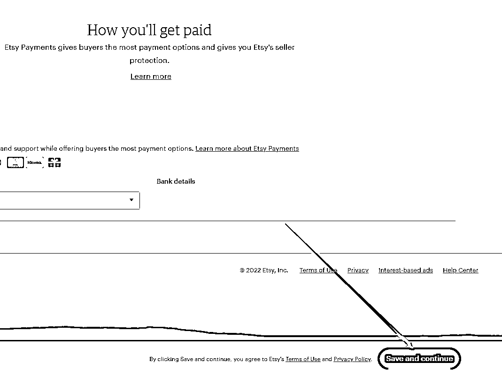  <ne-h1 id="9c383b04" data-lake-id="9c383b04"><ne-heading-ext><ne-heading-anchor></ne-heading-anchor><ne-heading-fold></ne-heading-fold></ne-heading-ext><ne-heading-content><ne-text id="u24bcec25" ne-bold="true">填写付款账号</ne-text></ne-heading-content></ne-h1> <ne-p id="uf59d4621" data-lake-id="uf59d4621"><ne-text id="ued13984f">开始填写付款账号信息。</ne-text></ne-p> <ne-p id="u6f418731" data-lake-id="u6f418731"><ne-text id="u6e3007a1">cvv 是信用卡的验证号码，是三位数。</ne-text></ne-p> <ne-p id="u9bab9ac8" data-lake-id="u9bab9ac8"><ne-text id="uca24e3c9">Expiration date 到期时间，月份在前，年份在后。</ne-text></ne-p> <ne-p id="udc3fda51" data-lake-id="udc3fda51"><ne-text id="uca199a0a">Nmae on card 填写全名（Full name）</ne-text></ne-p> <ne-p id="u6fe2a9ca" data-lake-id="u6fe2a9ca"><ne-text id="u5eb69cb2">老外的名字一般都是名在前，姓在后，所以组合起来就是 full name</ne-text></ne-p> <ne-p id="u35440560" data-lake-id="u35440560"><ne-text id="uea30a0c9">信用卡地址按照之前填写过的个人信息地址一样的方式填写。</ne-text></ne-p> <ne-h1 id="319b5b36" data-lake-id="319b5b36"><ne-heading-ext><ne-heading-anchor></ne-heading-anchor><ne-heading-fold></ne-heading-fold></ne-heading-ext><ne-heading-content><ne-text id="u4dbb74ee" ne-bold="true">选择验证方式</ne-text></ne-heading-content></ne-h1> <ne-p id="ue6a8a75a" data-lake-id="ue6a8a75a"><ne-text id="udccd4dfe">选择验证的方式。</ne-text></ne-p> <ne-p id="u6feb1cca" data-lake-id="u6feb1cca"><ne-text id="uacc52b17">建议下载一个谷歌验证器或者微软验证器。</ne-text></ne-p> <ne-p id="ue77212db" data-lake-id="ue77212db"><ne-text id="ud033af86">然后选择验证器软件的方式验证。</ne-text></ne-p> <ne-p id="u966b4b3c" data-lake-id="u966b4b3c"><ne-card data-card-name="image" data-card-type="inline" id="I9vWb" data-event-boundary="card">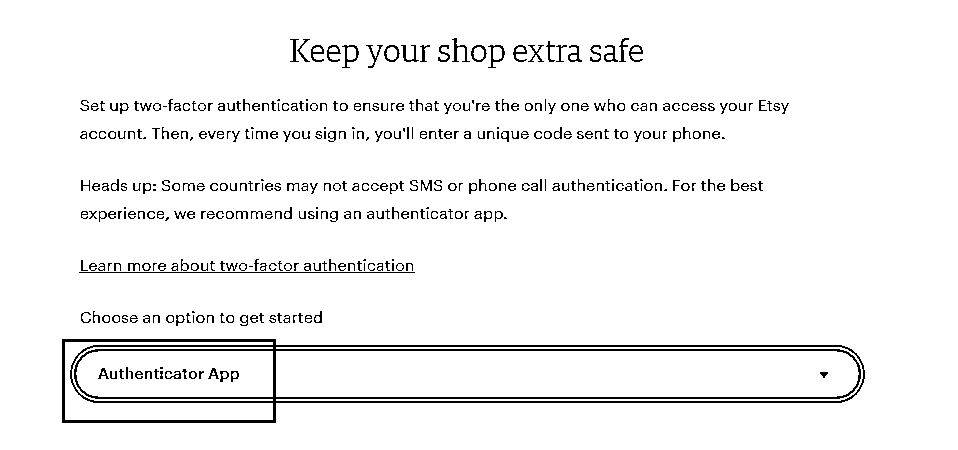  <ne-p id="u61826ef4" data-lake-id="u61826ef4"><ne-text id="ub33b7642">出现验证二维码，这个二维码建议可以先截图下来。</ne-text></ne-p> <ne-p id="u65560658" data-lake-id="u65560658"><ne-text id="ucdc8e67d">扫描验证器二维码，输入验证码。</ne-text></ne-p> <ne-p id="ubd9648d0" data-lake-id="ubd9648d0"><ne-text id="ub92fb7e7">然后出现十串验证数字，也可以手动保存下来。</ne-text></ne-p> <ne-p id="u73724c1d" data-lake-id="u73724c1d"><ne-card data-card-name="image" data-card-type="inline" id="cXW9I" data-event-boundary="card">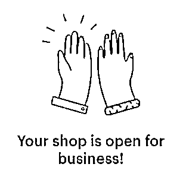  <ne-p id="u6f7c6d54" data-lake-id="u6f7c6d54"><ne-text id="u916e24cc">恭喜！注册成功！</ne-text></ne-p> <ne-h1 id="e80b024d" data-lake-id="e80b024d"><ne-heading-ext><ne-heading-anchor></ne-heading-anchor><ne-heading-fold></ne-heading-fold></ne-heading-ext><ne-heading-content><ne-text id="u4622c940" ne-bold="true">04</ne-text><ne-text id="uc7352845" ne-bold="true">Etsy 注册中的注意事项和常见问题</ne-text></ne-heading-content></ne-h1> <ne-h1 id="ca652186" data-lake-id="ca652186"><ne-heading-ext><ne-heading-anchor></ne-heading-anchor><ne-heading-fold></ne-heading-fold></ne-heading-ext><ne-heading-content><ne-text id="uaab8a791" ne-bold="true">Etsy 注册中的注意事项</ne-text></ne-heading-content></ne-h1> <ne-p id="u22f84676" data-lake-id="u22f84676"><ne-text id="u479ee4db">1.付款卡和收款卡越小众越好。因为越大众的平台，用的人很多，而这些账号的卡头都是一样的，所以触发审核的概率高。越小众，越不容易被审核。</ne-text></ne-p> <ne-p id="u11a230e0" data-lake-id="u11a230e0"><ne-text id="uc7a7345c">2.Etsy 的审核机制看的是综合维度，从身份信息、IP、环境、付款卡、收款卡、产品这些综合计算欺诈风险分数，欺诈风险分数越高，就越容易触发审核。</ne-text></ne-p> <ne-p id="u920e8ef8" data-lake-id="u920e8ef8"><ne-text id="u8376e1da">3.最安全的运营方式就是，所有信息，付款，收款，环境都用当地真实的信息，做到这一点的话，一般都是直接和当地的人用分成的方式去合作。</ne-text></ne-p> <ne-p id="u2cafe106" data-lake-id="u2cafe106"><ne-text id="u6346960a">4..注册成功的核心是：真实的资料和符合标准的产品，这里最容易被忽略的就是符合标准的产品。重点不是产品是否真的是手工产品，而是能否让 Etsy 看出这个是手工产品。</ne-text></ne-p> <ne-p id="u5ced3242" data-lake-id="u5ced3242"><ne-text id="u204b14ad">5.现在不建议注册美国地区的 Etsy，会触发 plaid 验证，而市面上的虚拟收款账户暂时基本都无法通过 plaid 验证。</ne-text></ne-p> <ne-p id="u4549d745" data-lake-id="u4549d745"><ne-card data-card-name="image" data-card-type="inline" id="S2LYe" data-event-boundary="card">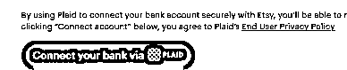  <ne-p id="u16997f68" data-lake-id="u16997f68"><ne-text id="ufeb38b03">6.如果注册账号的时候提示这个，大概率是 IP 问题，直接换 IP 服务商，同时注册时候的邮箱，密码，也需要更换，防止关联。</ne-text></ne-p> <ne-p id="ueb643d01" data-lake-id="ueb643d01"><ne-card data-card-name="image" data-card-type="inline" id="h2eke" data-event-boundary="card">  <ne-p id="uc4fe1af0" data-lake-id="uc4fe1af0"><ne-text id="ue1fa73e5">7.如果店铺被暂停，建议使用邮件申诉，成功的概率比客服提交申诉的概率要高一些。</ne-text></ne-p> <ne-h1 id="9b05cea7" data-lake-id="9b05cea7"><ne-heading-ext><ne-heading-anchor></ne-heading-anchor><ne-heading-fold></ne-heading-fold></ne-heading-ext><ne-heading-content><ne-text id="u8d62c66e" ne-bold="true">Etsy 注册的常见问题</ne-text></ne-heading-content></ne-h1> <ne-h1 id="056b21cc" data-lake-id="056b21cc"><ne-heading-ext><ne-heading-anchor></ne-heading-anchor><ne-heading-fold></ne-heading-fold></ne-heading-ext><ne-heading-content><ne-text id="u02463c69" ne-bold="true">Q：国人注册美国公司，英国公司，香港公司，然后再注册 Etsy 是否可行？</ne-text></ne-heading-content></ne-h1> <ne-p id="u8632e059" data-lake-id="u8632e059"><ne-text id="u78d36262">A：经过大量测试，有的成功，有的失败。</ne-text></ne-p> <ne-p id="ub2759648" data-lake-id="ub2759648"><ne-text id="uf986b664">所以如果你有现成的资料，那么可以去试试看，但如果为此特地去注册一家公司，那么我是不大建议的，毕竟如果失败了成本太高。</ne-text></ne-p> <ne-h1 id="03d7f929" data-lake-id="03d7f929"><ne-heading-ext><ne-heading-anchor></ne-heading-anchor><ne-heading-fold></ne-heading-fold></ne-heading-ext><ne-heading-content><ne-text id="u1a09a29c" ne-bold="true">Q：如果不确定自己找的网图是否在 Etsy 上被别人用过了怎么办？</ne-text></ne-heading-content></ne-h1> <ne-p id="u0b184cb6" data-lake-id="u0b184cb6"><ne-text id="ub1248629">A：</ne-text><ne-text id="ua1a8512d" style="color: rgb(0, 0, 0);">可以手机上下载一个 Etsy 软件，手机端的 Etsy 有以图识货的功能，可以先扫描看一下有没有同类产品。</ne-text></ne-p> <ne-h1 id="6cb86096" data-lake-id="6cb86096"><ne-heading-ext><ne-heading-anchor></ne-heading-anchor><ne-heading-fold></ne-heading-fold></ne-heading-ext><ne-heading-content><ne-text id="u3d8a1d33" ne-bold="true">Q：我想要有个稳定的 Etsy 店铺，最靠谱的操作是什么？</ne-text></ne-heading-content></ne-h1> <ne-p id="uaf4025f1" data-lake-id="uaf4025f1"><ne-text id="ue37d9721">A：最稳定的办法就是一切模拟正常人的行为。假设，我有一个在澳大利亚的亲戚，那么我就可以这么做：</ne-text></ne-p> <ne-p id="ud1bec223" data-lake-id="ud1bec223"><ne-text id="u5a0765d6">让这位亲戚在澳大利亚开一台电脑（拥有了当地的电脑环境和 IP 地址），然后用这个亲戚的驾照照片（其他证件资料也可以，比如护照，身份证），银行卡（真实卡片，信任度高）和信用卡去注册店铺。店铺注册下来之后，用远程操控的方式操作这台电脑。</ne-text></ne-p> <ne-p id="uf33a6ba4" data-lake-id="uf33a6ba4"><ne-text id="u7e7af479">以上就是最最安全稳妥的店铺运营模式：真实不重复的资料，海外的电脑环境，海外干净的 IP，真实的付款卡，收款卡。</ne-text></ne-p> <ne-p id="uddb6c56d" data-lake-id="uddb6c56d"><ne-text id="u8d65af1f">弊端也是有的，比如钱是先收到亲戚的卡里面，一是要再转过来，比较麻烦，二是会有税费（如果不是欧美地区的人则一般不会有额外的税）的产生。</ne-text></ne-p> <ne-p id="u003343cd" data-lake-id="u003343cd"><ne-text id="u5afbe427">解决方案就是：可以在店铺开下来并运营一段时间后，把收款卡改为虚拟收款卡，比如万里汇这一类的，那就能解决税费（无需额外纳税）和收款（钱直接到自己的账上，再提现）的问题。</ne-text></ne-p> <ne-h1 id="fe9b9d43" data-lake-id="fe9b9d43"><ne-heading-ext><ne-heading-anchor></ne-heading-anchor><ne-heading-fold></ne-heading-fold></ne-heading-ext><ne-heading-content><ne-text id="u6cc7a781" ne-bold="true">Q：如果我有份亲戚的海外资料，我可以自己在国内操作开店吗？</ne-text></ne-heading-content></ne-h1> <ne-p id="u5ea81be9" data-lake-id="u5ea81be9"><ne-text id="u78568868">A：店铺注册有六个要点：1.干净的 IP；2.模拟当地的电脑环境；3.真实的资料；4.干净的付款卡；5.干净的收款卡；6.“原创”产品的图片。</ne-text></ne-p> <ne-p id="u7046329d" data-lake-id="u7046329d"><ne-text id="ubfc19c07">对于第二点，可以用指纹浏览器解决。</ne-text></ne-p> <ne-p id="u2b1706ab" data-lake-id="u2b1706ab"><ne-text id="ub8bfc0cf">第六点的原创两字之所以打引号，是因为这里原创的定义其实是平台没收录的图片。可以自己拍，或者找一些没被上传到这个平台的产品图（比如找一些产品视频然后截图作为主图）。</ne-text></ne-p> <ne-p id="u13889da4" data-lake-id="u13889da4"><ne-text id="u3d0e1c25">最难的是第一、第四、第五点。</ne-text></ne-p> <ne-p id="u8fd3c0a9" data-lake-id="u8fd3c0a9"><ne-text id="ufe777d32">对于第一点，如果我们在国内，那么意味着我们只能去服务商那里买国外的 IP。IP 分为两大类，一种是服务器 IP，一种是住宅 IP。</ne-text></ne-p> <ne-p id="ub86de797" data-lake-id="ub86de797"><ne-text id="u8b94605a">服务器 IP 就是阿里云，腾讯云，谷歌云，亚马逊云这种。</ne-text></ne-p> <ne-p id="u2a5480e5" data-lake-id="u2a5480e5"><ne-text id="u3c4cbe1d">住宅 IP 是 ISP（互联网服务提供商）或者 ADSL 提供商分配给个人用户的实际家庭住宅 IP 地址，家庭住宅 IP 是真实的用户设备 IP，与普通网络用户使用的 IP 完全一致。可以简单理解为我们自己用的电信网络，移动网络这种，是更接近为真实用户的 IP 类型。</ne-text></ne-p> <ne-p id="uf6d42817" data-lake-id="uf6d42817"><ne-text id="u3579c536">逻辑上来说，住宅 IP 是优于服务器 IP 的。只不过住宅 IP 比较贵（比如 10 刀/G），且有很多假的住宅 IP，所以鱼龙混杂。</ne-text></ne-p> <ne-p id="uba8a88b9" data-lake-id="uba8a88b9"><ne-text id="uf734a7cd">第四点，第五点都有专门的虚拟卡和收款服务商可以解决。比如你可以用万里汇的“万里付卡”这个卡作为付款卡，再用万里汇的收款账号作为收款卡。</ne-text></ne-p> <ne-p id="uc3215f0b" data-lake-id="uc3215f0b"><ne-text id="u5469a75e">但是！以上这些都解决了，就能开一个稳定的 Etsy 店铺吗？答案是：不。具体原因会在下面解释。</ne-text></ne-p> <ne-h1 id="87665319" data-lake-id="87665319"><ne-heading-ext><ne-heading-anchor></ne-heading-anchor><ne-heading-fold></ne-heading-fold></ne-heading-ext><ne-heading-content><ne-text id="uf2603b6b" ne-bold="true">Q：我用海外亲戚的证件资料就一定能开店铺吗？</ne-text></ne-heading-content></ne-h1> <ne-p id="u54e988a9" data-lake-id="u54e988a9"><ne-text id="ubbcd6202">我用香港的信用卡给美国店铺作为付款卡可以吗？</ne-text></ne-p> <ne-p id="u5948409f" data-lake-id="u5948409f"><ne-text id="ue59c5718">我用英国的证件资料去开美国店可以吗？</ne-text></ne-p> <ne-p id="uca0637e1" data-lake-id="uca0637e1"><ne-text id="uba8d56dc">我想开澳洲店，但是我没有澳洲的信用卡，我用香港信用卡或者美国信用卡可以吗？</ne-text></ne-p> <ne-p id="u11b22d93" data-lake-id="u11b22d93"><ne-text id="u9fa8c5f8">A：以上这些问题，都可以用一个答案来回答：越接近真实的情况，你开店的成功率就越高。</ne-text></ne-p> <ne-p id="uc47144cf" data-lake-id="uc47144cf"><ne-text id="uefecf101">每个平台都有一套风控系统，风控系统的背后我们可以简单理解为是一套欺诈值打分的系统，我们的资料（证件资料，IP 地址，信用卡等），我们的操作越不像个“正常人”那么我们的欺诈分数肯定就越高。而当这个欺诈分数达到某个临界值时，Etsy 就会封店了。</ne-text></ne-p> <ne-p id="u2dfb6114" data-lake-id="u2dfb6114"><ne-text id="ua469256f">Etsy 平台这套欺诈值打分系统是怎么计算的，我们永远无法得知，但是我们能做的就是在每一个细节上面，越接近一个“正常人”，努力降低这个分数，那么店铺就会越稳定。</ne-text></ne-p> <ne-p id="u5b111a1a" data-lake-id="u5b111a1a"><ne-text id="u7c773e0c">所以，以上的这些问题都不能简单地回答为行或者不行。</ne-text></ne-p> <ne-p id="u30d516ad" data-lake-id="u30d516ad"><ne-text id="u79f5c13d">只能回答：可以去试试，但不一定成功。如果有条件，则一切资料，一切操作都要向“正常人”靠拢。</ne-text></ne-p> <ne-p id="u5cd350a1" data-lake-id="u5cd350a1"><ne-text id="u80d2c291">比如我是一个美国人，我要注册一个 Etsy，“正常人”的操作指的就是打开家里的电脑（用的是美国的电脑环境和美国干净的住宅 IP），上传自己的证件资料（自己的资料，所以不会重复），用自己的信用卡作为付款卡（不是虚拟信用卡，卡段用的人少，所以真实性高），用自己的银行卡作为收款卡（不是虚拟银行账号，卡段用的人少，所以真实性也高）。</ne-text></ne-p> <ne-p id="uef5fd01e" data-lake-id="uef5fd01e"><ne-text id="u47564606">啰嗦了这么多，一句话总结就是：风控是一个概率问题，不是简单的“是”或者“不是”的问题。有条件就尽量接近真实，如果没条件就要接受有被封的可能性，没人能肯定这么做是封还是不封。</ne-text></ne-p> <ne-h1 id="962ebb27" data-lake-id="962ebb27"><ne-heading-ext><ne-heading-anchor></ne-heading-anchor><ne-heading-fold></ne-heading-fold></ne-heading-ext><ne-heading-content><ne-text id="ua43ffc2d" ne-bold="true">Q：买的店铺，买的资料靠谱吗？</ne-text></ne-heading-content></ne-h1> <ne-p id="ub2dcd2ee" data-lake-id="ub2dcd2ee"><ne-text id="u1f46daef">A：不知道。</ne-text></ne-p> <ne-p id="uacbac9e0" data-lake-id="uacbac9e0"><ne-text id="u83cbd9ca">买资料最大的问题是，你永远不知道卖家会把一份资料卖给多少人，而拿着重复的资料去注册店铺，肯定是很容易出问题的。</ne-text></ne-p> <ne-p id="uc84ec4c6" data-lake-id="uc84ec4c6"><ne-text id="u57fbce09">买店铺同理，店铺给到我们的时候没被封，但不代表后期不会封，而后期被封了到底是资料问题还是操作问题，就没办法说得清。</ne-text></ne-p> <ne-h1 id="d001bce4" data-lake-id="d001bce4"><ne-heading-ext><ne-heading-anchor></ne-heading-anchor><ne-heading-fold></ne-heading-fold></ne-heading-ext><ne-heading-content><ne-text id="u2e27650c" ne-bold="true">Q：我没有亲戚在国外，我有啥办法弄一个稳定的 Etsy 店铺？</ne-text></ne-heading-content></ne-h1> <ne-p id="u60870e71" data-lake-id="u60870e71"><ne-text id="u5ead709e">A：那就不建议做这个平台。</ne-text></ne-p> <ne-p id="u5ecf285f" data-lake-id="u5ecf285f"><ne-text id="ud1970ad3">已经有太多人跟我说，买了很多店铺，辛苦弄了几个月，最后封干净了。</ne-text></ne-p> <ne-p id="u7ec9acaa" data-lake-id="u7ec9acaa"><ne-text id="u62d6ee2f">这个平台真的是封店最凶的一个平台了，为了防止钱，时间两空，何必强迫自己呢？</ne-text></ne-p> <ne-h1 id="586a4885" data-lake-id="586a4885"><ne-heading-ext><ne-heading-anchor></ne-heading-anchor><ne-heading-fold></ne-heading-fold></ne-heading-ext><ne-heading-content><ne-text id="ufdf4823a" ne-bold="true">Q：可以用中国护照申请香港店铺吗？</ne-text></ne-heading-content></ne-h1> <ne-p id="u11b6014c" data-lake-id="u11b6014c"><ne-text id="uc321de14">可以用香港公司注册香港店铺吗？</ne-text></ne-p> <ne-p id="u0375a6b8" data-lake-id="u0375a6b8"><ne-text id="u114d9fe9">A：我自己测试用中国护照开港店是不行的。但对于中国人开的香港公司，然后用香港公司营业执照去注册 Etsy 的测试结果是：有一定的概率能成功。多位朋友测试过了，有的成功，有的失败，失败居多。所以丑话说在前头：如果你有现成的香港公司，可以去试试看，万一可以了呢~但一定要有被封的心理准备。但如果没有香港公司，就不要浪费钱注册一个再去测试了。</ne-text></ne-p> <ne-h1 id="f89debac" data-lake-id="f89debac"><ne-heading-ext><ne-heading-anchor></ne-heading-anchor><ne-heading-fold></ne-heading-fold></ne-heading-ext><ne-heading-content><ne-text id="ucd5cbfd4" ne-bold="true">Q：我的店铺运营一段时间了，也出单了，是不是就稳定了？</ne-text></ne-heading-content></ne-h1> <ne-p id="ucfdad054" data-lake-id="ucfdad054"><ne-text id="ucb76df92">A：有许多人开了 Etsy 店铺，卖一些淘宝，1688 上面的普通产品，运营一段时间之后，店铺就封了，然后跑来问我为什么？其实一般都是产品问题。</ne-text></ne-p> <ne-p id="u8231ff4e" data-lake-id="u8231ff4e"><ne-text id="ucb432ac5">Etsy 这个平台有个最大的特点就是会不定时检查产品的合规性。</ne-text></ne-p> <ne-p id="u57b0cd26" data-lake-id="u57b0cd26"><ne-text id="ue3572433">什么是产品合规性？就是要符合这个平台“原创、手工”的定义。</ne-text></ne-p> <ne-p id="u38b0f3be" data-lake-id="u38b0f3be"><ne-text id="u0e8038f1">那“原创、手工”又该怎么界定？</ne-text></ne-p> <ne-p id="uccbd0432" data-lake-id="uccbd0432"><ne-text id="u784e7b33">没法界定，看 Etsy 审核人员的心情，毕竟这个店铺上还有卖家在卖蔬菜的呢…</ne-text></ne-p> <ne-p id="u952a4f55" data-lake-id="u952a4f55"><ne-text id="uf185824a">不开玩笑了，正经回答是：</ne-text></ne-p> <ne-p id="u61d77aed" data-lake-id="u61d77aed"><ne-text id="u7cbd110b">第一，这是个很主观的定义，因为我们都不是 Etsy 审核人员，所以我们怎么认为并不重要，重要是 Etsy 审核人员怎么认为。</ne-text></ne-p> <ne-p id="u9e1ae500" data-lake-id="u9e1ae500"><ne-text id="u833f61ab">第二，我们要做的就是，能自己拍图就自己拍图。不要盗用平台上的图片，不要直接搬运淘宝 1688 等图片，如果要搬运，至少要二次修改。</ne-text></ne-p> <ne-p id="u153067e2" data-lake-id="u153067e2"><ne-text id="udfcf38e0">所以这还是个风控问题，而不是“是”和“不是”的问题。风控的意思就是说，没有百分百，但只要你做到了尽可能接近平台的要求，店铺活下来的概率就越高。</ne-text></ne-p> <ne-h1 id="1af803f8" data-lake-id="1af803f8"><ne-heading-ext><ne-heading-anchor></ne-heading-anchor><ne-heading-fold></ne-heading-fold></ne-heading-ext><ne-heading-content><ne-text id="u35dd8f55" ne-bold="true">Q：为什么有的店铺卖的明显和“手工原创”不沾边的东西，店铺还活着？</ne-text></ne-heading-content></ne-h1> <ne-p id="u5d70f649" data-lake-id="u5d70f649"><ne-text id="u049e2e76">A：如果你有一个真实的美国店铺，我觉得在上面直接卖蔬菜也是可能的哈。</ne-text></ne-p> <ne-p id="u96ce0387" data-lake-id="u96ce0387"><ne-text id="u92be9342">其实，这还是和上面说过的风控一个道理。</ne-text></ne-p> <ne-p id="u59dd4fa0" data-lake-id="u59dd4fa0"><ne-text id="u75b08087">为了最直观地说明风控的原理，我们可以先假设这样一个情况：Etsy 对于欺诈值的临界点分数是 60 分（超过 60 分就封店）。A 店铺是用真实资料注册的，但是付款和收款用的都是虚拟卡，Etsy 对于 A 店铺的欺诈值打分是 50 分，这个时候，Etsy 发现我们在卖蔬菜，于是欺诈值就加了 10 分，达到 60 分，所以店铺就被封了。而有一个真实美国的 Etsy 店铺 B，Etsy 对这个 B 店铺的欺诈值打分可能是 10 分，然后发现也在卖蔬菜，那么即使欺诈值分数增加到了 20 分，但还是没到临界值，所以店铺存活。</ne-text></ne-p> <ne-p id="u7e6f02cc" data-lake-id="u7e6f02cc"><ne-text id="ub1aa8e48">同时，随着店铺越老，销售额越高，那么 Etsy 对于这个店铺的宽容度也会变高，也可以简单理解为欺诈值分数就会慢慢下降。</ne-text></ne-p> <ne-h1 id="3131a432" data-lake-id="3131a432"><ne-heading-ext><ne-heading-anchor></ne-heading-anchor><ne-heading-fold></ne-heading-fold></ne-heading-ext><ne-heading-content><ne-text id="ua7ef0741" ne-bold="true">Q：为什么我是自己做的产品，自己拍摄图片，为什么出单后还是被封了？</ne-text></ne-heading-content></ne-h1> <ne-p id="ubaeef8ab" data-lake-id="ubaeef8ab"><ne-text id="ucbdaca6b">A：店铺开始稳定运营之后，被封店最大的问题一般都是产品不合规导致的。</ne-text></ne-p> <ne-p id="ub6b3bfcf" data-lake-id="ub6b3bfcf"><ne-text id="u6f4b97b0">但并不是说只要产品合规了就一定不封店，还有可能导致封店原因如下：</ne-text></ne-p> <ne-p id="u32831775" data-lake-id="u32831775"><ne-text id="u7eab43bd">1.订单短时间激增；</ne-text></ne-p> <ne-p id="u7a4250c4" data-lake-id="u7a4250c4"><ne-text id="u8bccd926">2.过多订单未发货；</ne-text></ne-p> <ne-p id="ue57ec032" data-lake-id="ue57ec032"><ne-text id="u261b0176">3.客户投诉，侵权造假；</ne-text></ne-p> <ne-p id="u1227e6fd" data-lake-id="u1227e6fd"><ne-text id="u540776d4">4.差评过多；</ne-text></ne-p> <ne-p id="u42bf1242" data-lake-id="u42bf1242"><ne-text id="ud566ff19">5.没有支付平台费用；</ne-text></ne-p> <ne-p id="u0b6aea67" data-lake-id="u0b6aea67"><ne-text id="ua8877f4b">6.资料、运营环境不合格。</ne-text></ne-p> <ne-p id="u37962ff9" data-lake-id="u37962ff9"><ne-text id="u5781a9dd">是的，即使你店铺已经在稳定运营了，Etsy 还是可能会随时查看我们的产品、资料和环境，只要他们觉得欺诈风险过高，就有可能封店。</ne-text></ne-p> <ne-h1 id="2b18b93c" data-lake-id="2b18b93c"><ne-heading-ext><ne-heading-anchor></ne-heading-anchor><ne-heading-fold></ne-heading-fold></ne-heading-ext><ne-heading-content><ne-text id="uc9b05264" ne-bold="true">Q：我注册了美国店，可以从国内发货吗？</ne-text></ne-heading-content></ne-h1> <ne-p id="u0cb62862" data-lake-id="u0cb62862"><ne-text id="uf1f18d2c">我有个英国店，可以从英国直接发货吗？</ne-text></ne-p> <ne-p id="u4168fef7" data-lake-id="u4168fef7"><ne-text id="ude0337b7">A：都可以。具体怎么操作看文末的链接。</ne-text></ne-p> <ne-h1 id="70df7708" data-lake-id="70df7708"><ne-heading-ext><ne-heading-anchor></ne-heading-anchor><ne-heading-fold></ne-heading-fold></ne-heading-ext><ne-heading-content><ne-text id="u83e8af0d" ne-bold="true">Q：我的店铺被暂停了怎么办？为什么店铺无法登录了？</ne-text></ne-heading-content></ne-h1> <ne-p id="udb0d2472" data-lake-id="udb0d2472"><ne-text id="u22733dea">A：对于 Etsy 觉得有欺诈风险的店铺，一般有三种处理方式：第一种是让店铺处于假期模式，第二种是店铺出现了被暂停的提示，第三种就是店铺账号无法登录。</ne-text></ne-p> <ne-p id="u49cfb7ab" data-lake-id="u49cfb7ab"><ne-text id="u5e2f31e7">当店铺的欺诈值越高，平台的处理方式就越严格，换句话说，如果你的账号无法登录，就是 Etsy 给店铺打的欺诈值分数就很高，所以直接会让账号无法登录。</ne-text></ne-p> <ne-p id="u53a30cba" data-lake-id="u53a30cba"><ne-text id="u2f50d90e">三种情况都可以申诉，但是情况越严重，申诉成功率越低。</ne-text></ne-p> <ne-h1 id="c1b42f70" data-lake-id="c1b42f70"><ne-heading-ext><ne-heading-anchor></ne-heading-anchor><ne-heading-fold></ne-heading-fold></ne-heading-ext><ne-heading-content><ne-text id="uf1ac28b2" ne-bold="true">Q：怎么判断自己的店铺是正常的？</ne-text></ne-heading-content></ne-h1> <ne-p id="u2ea5a7d1" data-lake-id="u2ea5a7d1"><ne-text id="u2b32e7ff">A：在前台搜索自己的店铺或者产品，只要能搜索得到，说明正常。</ne-text></ne-p> <ne-h1 id="366d7027" data-lake-id="366d7027"><ne-heading-ext><ne-heading-anchor></ne-heading-anchor><ne-heading-fold></ne-heading-fold></ne-heading-ext><ne-heading-content><ne-text id="uc1d66a05" ne-bold="true">05</ne-text></ne-heading-content></ne-h1> <ne-h1 id="6b5692fd" data-lake-id="6b5692fd"><ne-heading-ext><ne-heading-anchor></ne-heading-anchor><ne-heading-fold></ne-heading-fold></ne-heading-ext><ne-heading-content><ne-text id="ub70406f7" ne-bold="true">Etsy 如何避免被封店</ne-text></ne-heading-content></ne-h1> <ne-h1 id="9ef96ca8" data-lake-id="9ef96ca8"><ne-heading-ext><ne-heading-anchor></ne-heading-anchor><ne-heading-fold></ne-heading-fold></ne-heading-ext><ne-heading-content><ne-text id="u9a6d3620" ne-bold="true">常见被封店的原因</ne-text></ne-heading-content></ne-h1> <ne-p id="ue47c3671" data-lake-id="ue47c3671"><ne-text id="u7d0356ba">（1）产品不符合 Etsy 的手工产品定义（最普遍的原因）</ne-text></ne-p> <ne-p id="u4e48eee8" data-lake-id="u4e48eee8"><ne-text id="ub77ffe83">（2）收款账号未验证（出首单之后就要在 30 天内进行收款账户验证）</ne-text></ne-p> <ne-p id="ue3ff2388" data-lake-id="ue3ff2388"><ne-text id="u545d4378">（3）店铺的账单未支付（每个月的 21 号之前要支付上个月的账单）</ne-text></ne-p> <ne-p id="u37303c2c" data-lake-id="u37303c2c"><ne-text id="u27576f8b">（4）客户投诉，产品侵权等</ne-text></ne-p> <ne-p id="u8eeae539" data-lake-id="u8eeae539"><ne-text id="u9722cedf">（5）太多订单未能按时发货</ne-text></ne-p> <ne-p id="u48e2bcf3" data-lake-id="u48e2bcf3"><ne-text id="ud5dd2d6b">（6）短时间内单量增速过快</ne-text></ne-p> <ne-p id="u62fc57a5" data-lake-id="u62fc57a5"><ne-text id="ud93c15fa">（7）支付信用卡异常</ne-text></ne-p> <ne-p id="u62b73b0c" data-lake-id="u62b73b0c"><ne-text id="uc8b7ba8e">（8）资料不对，或者被多次使用</ne-text></ne-p> <ne-p id="u0d31789e" data-lake-id="u0d31789e"><ne-text id="ud86c1a2b">（9）IP 变动</ne-text></ne-p> <ne-h1 id="d6f428d9" data-lake-id="d6f428d9"><ne-heading-ext><ne-heading-anchor></ne-heading-anchor><ne-heading-fold></ne-heading-fold></ne-heading-ext><ne-heading-content><ne-text id="u63e9d9e3" ne-bold="true">运营中如何避免封店</ne-text></ne-heading-content></ne-h1> <ne-p id="u33459c3b" data-lake-id="u33459c3b"><ne-text id="u8543f800">不管是新店还是老店，平时运营过程中都要注意以下这些点：</ne-text></ne-p> <ne-p id="uc8c35d52" data-lake-id="uc8c35d52"><ne-text id="u05969e6e">1.店铺名称、店铺运营者名字不要改动，店铺密码、店铺收款、店铺邮箱尽量少改，容易被封店。</ne-text></ne-p> <ne-p id="u41add3f1" data-lake-id="u41add3f1"><ne-text id="ucec4ce32">2.广告费要慢慢提高，新开店铺不要一上来就把预算拉到最高。</ne-text></ne-p> <ne-p id="u188a4e3d" data-lake-id="u188a4e3d"><ne-text id="uf521536b">3.不要刷单，不要刷单，不要刷单。</ne-text></ne-p> <ne-p id="u814e71c5" data-lake-id="u814e71c5"><ne-text id="ua5d88fdf">4.图片最好是原创的，最好不要使用电商平台上面的图片。</ne-text></ne-p> <ne-p id="u28bc58ad" data-lake-id="u28bc58ad"><ne-text id="ue9ad7127">5.不能使用 Etsy 同行的图片和文案。</ne-text></ne-p> <ne-p id="uc0643128" data-lake-id="uc0643128"><ne-text id="ufba08b5f">6.前期上传的产品最好是是纯手工产品，那些半手工产品或者工厂货如果要上传最好等店铺稳定之后再上传。</ne-text></ne-p> <ne-p id="u2f9a34a8" data-lake-id="u2f9a34a8"><ne-text id="u5c185c49">7.一般来说，店铺出了 30 单之后，就是比较稳定了。</ne-text></ne-p> <ne-p id="u586d2299" data-lake-id="u586d2299"><ne-text id="u730b6613">8.上架产品过程中，价格就设定好，调动价格最好用折扣调整。</ne-text></ne-p> <ne-p id="u29afdb21" data-lake-id="u29afdb21"><ne-text id="u4568fd32">9.新店每日产品上架数量最好不超过 3 个。</ne-text></ne-p> <ne-p id="uc2b189af" data-lake-id="uc2b189af"><ne-text id="udcdef897">10.不要碰侵权产品。</ne-text></ne-p> <ne-p id="u6a14a81c" data-lake-id="u6a14a81c"><ne-text id="ubc53e252">11.如果店铺后台出现 CASE 必须及时解决，不要等官方介入。</ne-text></ne-p> <ne-p id="u9240dd9d" data-lake-id="u9240dd9d"><ne-text id="ue5a57213">12.如果店铺出现差评，及时和客户沟通解决，退部分款或重寄，差评过多容易引起风控。</ne-text></ne-p> <ne-p id="u27d8ddfb" data-lake-id="u27d8ddfb"><ne-text id="uca80ab39">13.新店注册时上传的产品最好不要做任何改动。</ne-text></ne-p> <ne-p id="udce25d1b" data-lake-id="udce25d1b"><ne-text id="uada6e183">14.不要大范围地使用低折扣，比如所有产品都打折，或者都是同样的折扣。</ne-text></ne-p> <ne-p id="u9d613880" data-lake-id="u9d613880"><ne-text id="u18caab57">15.客户的留言需要在 24 小时之内回复。</ne-text></ne-p> <ne-p id="uba7ad958" data-lake-id="uba7ad958"><ne-text id="u2958c976">16.发货一定要选择填写尾程单号，物流轨迹不能显示从中国发货。</ne-text></ne-p> <ne-p id="u2909c5d5" data-lake-id="u2909c5d5"><ne-text id="u89b1d723">17.发货不得超期，超期轻则导致店铺权重下降，重则封店。</ne-text></ne-p> <ne-h1 id="1df85849" data-lake-id="1df85849"><ne-heading-ext><ne-heading-anchor></ne-heading-anchor><ne-heading-fold></ne-heading-fold></ne-heading-ext><ne-heading-content><ne-text id="ubfb8550e" ne-bold="true">06</ne-text><ne-text id="uc0fe0296" ne-bold="true">Etsy 被暂停、封店后如何申诉</ne-text></ne-heading-content></ne-h1> <ne-p id="ufecc9959" data-lake-id="ufecc9959"><ne-text id="u4f0c50e6">新店创建完成后，我们一般什么都不操作，放置 7 天，7 天后如果一切正常，那么就可以开始店铺装修，上传产品等正常操作。</ne-text></ne-p> <ne-p id="u4ec956d5" data-lake-id="u4ec956d5"><ne-text id="ub70295b7">但是如果 7 天内如果店铺被暂停，那我们就需要进行店铺申诉。</ne-text></ne-p> <ne-p id="udc8947a3" data-lake-id="udc8947a3"><ne-card data-card-name="image" data-card-type="inline" id="N4sOq" data-event-boundary="card">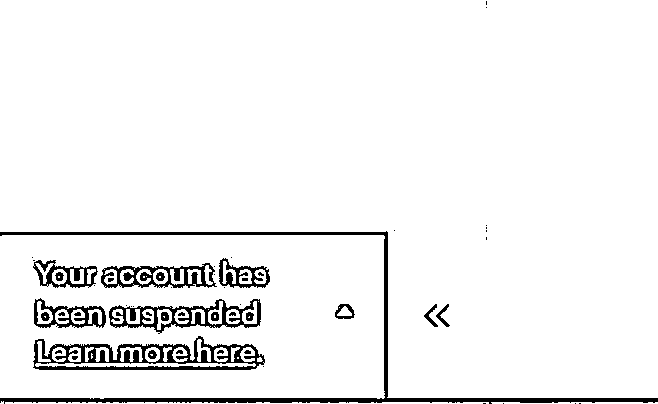  <ne-h1 id="0aaf1940" data-lake-id="0aaf1940"><ne-heading-ext><ne-heading-anchor></ne-heading-anchor><ne-heading-fold></ne-heading-fold></ne-heading-ext><ne-heading-content><ne-text id="u3e1c537a" ne-bold="true">申诉流程</ne-text></ne-heading-content></ne-h1> <ne-p id="u11c5096b" data-lake-id="u11c5096b"><ne-text id="u88013901">首先，点击联系 Etsy 支持。</ne-text></ne-p> <ne-p id="u582b734d" data-lake-id="u582b734d"><ne-text id="ud6228484">点击 learn more here，点击 contact Etsy support</ne-text></ne-p> <ne-p id="u2c737cc7" data-lake-id="u2c737cc7"><ne-card data-card-name="image" data-card-type="inline" id="eH4xa" data-event-boundary="card">  <ne-p id="u01c13812" data-lake-id="u01c13812"><ne-card data-card-name="image" data-card-type="inline" id="v6TDQ" data-event-boundary="card">  <ne-p id="u1650ab7e" data-lake-id="u1650ab7e"><ne-text id="u2fccc0fc">拉到底部，点击联系支持。</ne-text></ne-p> <ne-p id="u1ef8dc9a" data-lake-id="u1ef8dc9a"><ne-card data-card-name="image" data-card-type="inline" id="FmGaS" data-event-boundary="card">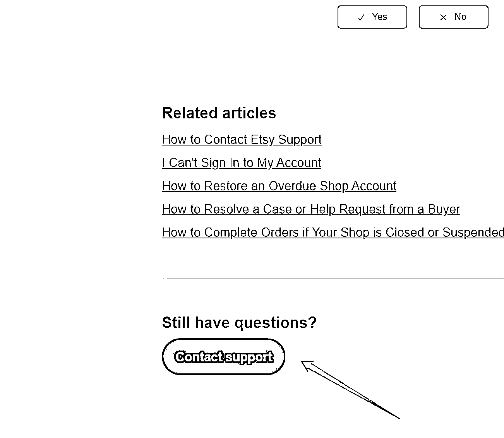  <ne-p id="uc7fec93c" data-lake-id="uc7fec93c"><ne-card data-card-name="image" data-card-type="inline" id="Cyy21" data-event-boundary="card">  <ne-p id="u360397bb" data-lake-id="u360397bb"><ne-card data-card-name="image" data-card-type="inline" id="e4zHJ" data-event-boundary="card">  <ne-p id="u13b5fc2d" data-lake-id="u13b5fc2d"><ne-card data-card-name="image" data-card-type="inline" id="t2Uvf" data-event-boundary="card">  <ne-p id="uccedf483" data-lake-id="uccedf483"><ne-card data-card-name="image" data-card-type="inline" id="yYfiH" data-event-boundary="card">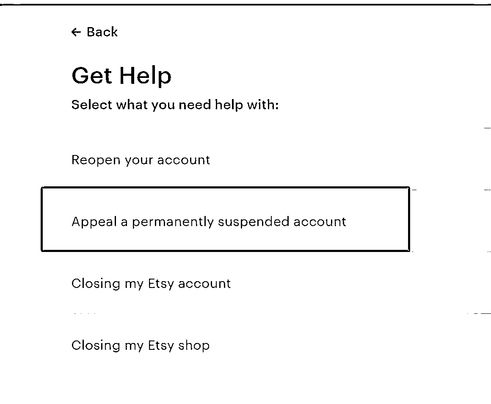  <ne-p id="ud64628c2" data-lake-id="ud64628c2"><ne-card data-card-name="image" data-card-type="inline" id="C9SSx" data-event-boundary="card">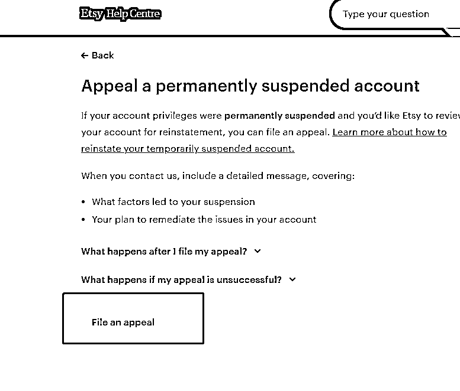  <ne-p id="u6a532d82" data-lake-id="u6a532d82"><ne-text id="u46587b1b">选择邮件申诉。</ne-text></ne-p> <ne-p id="u498b432f" data-lake-id="u498b432f"><ne-card data-card-name="image" data-card-type="inline" id="imhuN" data-event-boundary="card">  <ne-p id="u0fab2f24" data-lake-id="u0fab2f24"><ne-text id="u2f3ab6e8">进入申诉页面，第一个框先打勾。</ne-text></ne-p> <ne-p id="u22a5e666" data-lake-id="u22a5e666"><ne-card data-card-name="image" data-card-type="inline" id="FiAhn" data-event-boundary="card">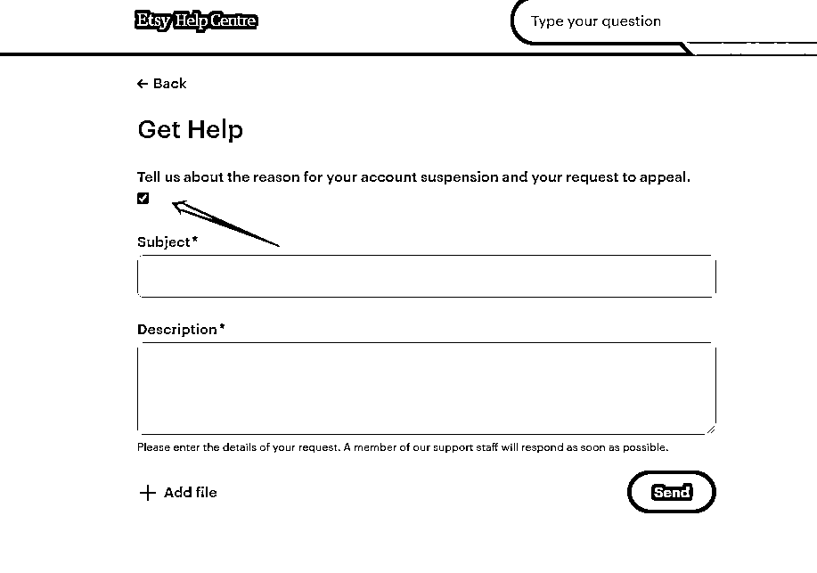  <ne-p id="u0fd93836" data-lake-id="u0fd93836"><ne-text id="uc46f327e">然后开始写我们的申诉内容。</ne-text></ne-p> <ne-p id="u09eec636" data-lake-id="u09eec636"><ne-text id="u86c8edf7">申诉的内容我们就如实填写自己的情况，申诉内容的长短并不会直接影响最终判定结果。</ne-text></ne-p> <ne-p id="u797d4c27" data-lake-id="u797d4c27"><ne-text id="u0b5abd7a">如果是新店被暂停，那么在附件的地方，可以选择上传产品的手工制作视频（要上传的话最好在申诉中先进行说明），如果没有那就不传。</ne-text></ne-p> <ne-p id="udb22a683" data-lake-id="udb22a683"><ne-text id="ue7d2322d">写完之后点击 Send。</ne-text></ne-p> <ne-p id="u79405178" data-lake-id="u79405178"><ne-text id="uf7d0a79e">申诉之后，Etsy 会给你发送一封自动邮件（发送到注册时的邮箱里面），过几天之后就会再发一封审核结果的邮件。</ne-text></ne-p> <ne-p id="ua11a83fc" data-lake-id="ua11a83fc"><ne-text id="uc7349653">Etsy 现在回复邮件的时间越来越慢，7-14 都有可能。</ne-text></ne-p> <ne-p id="u383f0371" data-lake-id="u383f0371"><ne-text id="u60f43a42">申诉后一般有两种情况。</ne-text></ne-p> <ne-p id="u9fa73f9e" data-lake-id="u9fa73f9e"><ne-text id="uf6cab87d">第一种是店铺恢复：</ne-text></ne-p> <ne-p id="uaa16a52f" data-lake-id="uaa16a52f"><ne-card data-card-name="image" data-card-type="inline" id="f2KkQ" data-event-boundary="card">  <ne-p id="u29c825a9" data-lake-id="u29c825a9"><ne-text id="u3c3ceca6">第二种则是店铺被封：</ne-text></ne-p> <ne-p id="uf20d689a" data-lake-id="uf20d689a"><ne-card data-card-name="image" data-card-type="inline" id="gHmV9" data-event-boundary="card">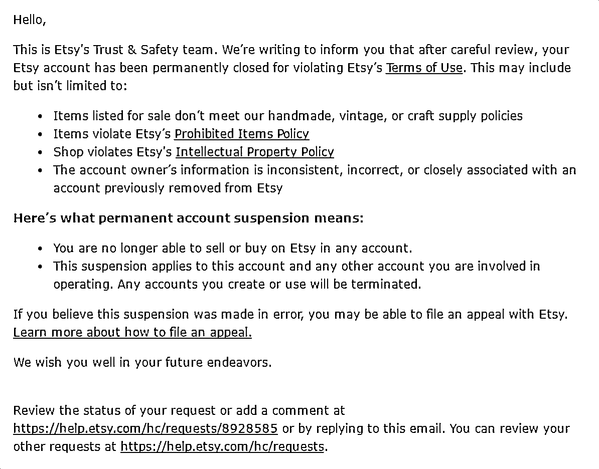  <ne-h1 id="b1a0483b" data-lake-id="b1a0483b"><ne-heading-ext><ne-heading-anchor></ne-heading-anchor><ne-heading-fold></ne-heading-fold></ne-heading-ext><ne-heading-content><ne-text id="udebb85bc" ne-bold="true">申诉的说明</ne-text></ne-heading-content></ne-h1> <ne-p id="u6dc80785" data-lake-id="u6dc80785"><ne-text id="ub28c6b25">1.如果 7 天内店铺没有恢复（红色暂停标识消失），且没有收到邮件回复，可以再追加一份申诉。</ne-text></ne-p> <ne-p id="u177a6452" data-lake-id="u177a6452"><ne-text id="ua26b1fdb">2.店铺恢复之后，可以到前台搜索一下产品或者店铺名，如果能搜索到，那么恭喜，可以开始正常运营了。</ne-text></ne-p> <ne-p id="ue3ef3304" data-lake-id="ue3ef3304"><ne-text id="u1c666476">3.即使申诉成功，并不意味着你的店铺就可以一劳永逸了。Etsy 会在店铺出首单，三四单，十单，三十单，百单，甚至千单左右都会再次审核。如果审核不过，则会再次暂停店铺或者直接无法登录账号。</ne-text></ne-p> <ne-p id="uc87ba6ca" data-lake-id="uc87ba6ca"><ne-text id="uc0c0bd8d">4.除非特别原因（产品侵权，客户投诉等），不然 Etsy 很少会说明暂停店铺、封店的原因，所以我们只能自己排查这个店铺信息和运营行为，看是哪里有问题导致的。</ne-text></ne-p> <ne-h1 id="ccbfe9dd" data-lake-id="ccbfe9dd"><ne-heading-ext><ne-heading-anchor></ne-heading-anchor><ne-heading-fold></ne-heading-fold></ne-heading-ext><ne-heading-content><ne-text id="u3484f437" ne-bold="true">07</ne-text><ne-text id="ubaa20105" ne-bold="true">Etsy 发货和物流指南&指纹浏览器的用法</ne-text></ne-heading-content></ne-h1> <ne-p id="u0bbdb7eb" data-lake-id="u0bbdb7eb"><ne-text id="u27384e4e">Etsy 能否从国内发货？</ne-text></ne-p> <ne-p id="u5ada9c91" data-lake-id="u5ada9c91"><ne-text id="ub30cf2d3">应该选择什么物流公司？</ne-text></ne-p> <ne-p id="ub8724376" data-lake-id="ub8724376"><ne-text id="u375066e1">物流单号怎么填写？</ne-text></ne-p> <ne-p id="ue2f3e667" data-lake-id="ue2f3e667"><ne-text id="udfd0c1d8">什么是指纹浏览器？</ne-text></ne-p> <ne-p id="u95c6bfc4" data-lake-id="u95c6bfc4"><ne-text id="uc2261762">指纹浏览器有什么作用？</ne-text></ne-p> <ne-p id="ud2b6ac3e" data-lake-id="ud2b6ac3e"><ne-text id="u8b683f52">如何利用指纹浏览器养上百个社媒账号？</ne-text></ne-p> <ne-p id="u4ac4990f" data-lake-id="u4ac4990f"><ne-text id="u9cd2c710">指纹浏览器如何使用？</ne-text></ne-p> <ne-p id="u41574890" data-lake-id="u41574890"><ne-text id="u53cbdb7b">什么是什么是住宅 IP？什么是服务器 IP？什么是动态 IP？什么是动态住宅 IP？</ne-text></ne-p> <ne-p id="u1d83881d" data-lake-id="u1d83881d"><ne-text id="u7da4e7b4">如何选择 IP？</ne-text></ne-p> <ne-p id="u734f3cd3" data-lake-id="u734f3cd3"><ne-text id="ub53565ca">这两个话题到时候我会再各自发一篇出来供大家参考。</ne-text></ne-p> <ne-p id="u2049060e" data-lake-id="u2049060e"><ne-text id="ueddfdf85">以上。</ne-text></ne-p> <ne-p id="u0d11f16c" data-lake-id="u0d11f16c"><ne-text id="ue2e0e859">——————————————</ne-text></ne-p> <ne-p id="u01818d17" data-lake-id="u01818d17"><ne-text id="u726cd741">也许有的人会发现已经在圈子看过类似的内容，嘿嘿，那是去年我老婆（去年她加入了生财但是我没加入）整理了一部分内容先发在圈子里了。今年是我加入生财的第一年，整理了写的所有和 etsy 注册的有关内容，为的就是能一次性回答所有 etsy 注册的问题。</ne-text></ne-p> <ne-p id="u30dc3a76" data-lake-id="u30dc3a76"><ne-text id="u99ccd03e">希望这篇分享能对想做 etsy 的人有一个帮助，如果有问题可以加我微信：afg5887。</ne-text></ne-p> <ne-hole id="u865c3ddf" data-lake-id="u865c3ddf"><ne-card data-card-name="hr" data-card-type="block" id="E2688" data-event-boundary="card"><ne-p id="ud08d29bf" data-lake-id="ud08d29bf"><ne-text id="ud2f8cb97">评论区：</ne-text></ne-p> <ne-p id="udc5aa870" data-lake-id="udc5aa870"><ne-text id="u4d433085">Fredrich : 看过希声大佬从第一版一直到 2023 的每一版本手把手新手 Etsy，我读书少，两个字表达心声：感谢</ne-text> <ne-text id="u46c692e4">希声。 : [呲牙]有用就好</ne-text> <ne-text id="u0dce937c">石头头 : 人在大陆的话有什么办法能弄到海外的资料呢</ne-text> <ne-text id="u5cb27844">希声。 : 正如我文章中说的，没有亲戚朋友海外的，就不建议弄。不然大多数人的做法都是买的，但是基本都会被封</ne-text> <ne-text id="u14403b71">石头头 : 方便留个 v 吗 想请教一下如果找海外朋友注册的话要规避的风险</ne-text> <ne-text id="uaf08f356">希声。 : 文章底部有</ne-text></ne-p></ne-card></ne-hole></ne-card></ne-p></ne-card></ne-p></ne-card></ne-p></ne-card></ne-p></ne-card></ne-p></ne-card></ne-p></ne-card></ne-p></ne-card></ne-p></ne-card></ne-p></ne-card></ne-p></ne-card></ne-p></ne-card></ne-p></ne-card></ne-p></ne-card></ne-p></ne-card></ne-p></ne-card></ne-p></ne-card></ne-p></ne-card></ne-p></ne-card></ne-p></ne-card></ne-p></ne-card></ne-p></ne-card></ne-p></ne-card></ne-p></ne-card></ne-p></ne-card></ne-p></ne-card></ne-p></ne-card></ne-p></ne-card></ne-p></ne-card></ne-p></ne-card></ne-p></ne-card></ne-p></ne-card></ne-p></ne-card></ne-p></ne-card></ne-p></ne-card></ne-p></ne-card></ne-p></ne-card></ne-p></ne-card></ne-p></ne-card></ne-p></ne-card></ne-p></ne-card></ne-p></ne-card></ne-p></ne-card></ne-p></ne-card></ne-p></ne-card></ne-p></ne-card></ne-p></ne-card></ne-p></ne-card></ne-p></ne-card></ne-p></ne-card></ne-p></ne-card></ne-p></ne-card></ne-p></ne-card></ne-p></ne-card></ne-p></ne-card></ne-p></ne-card></ne-p></ne-card></ne-p></ne-card></ne-p></ne-card></ne-p></ne-card></ne-p></ne-card></ne-p></ne-card></ne-p>