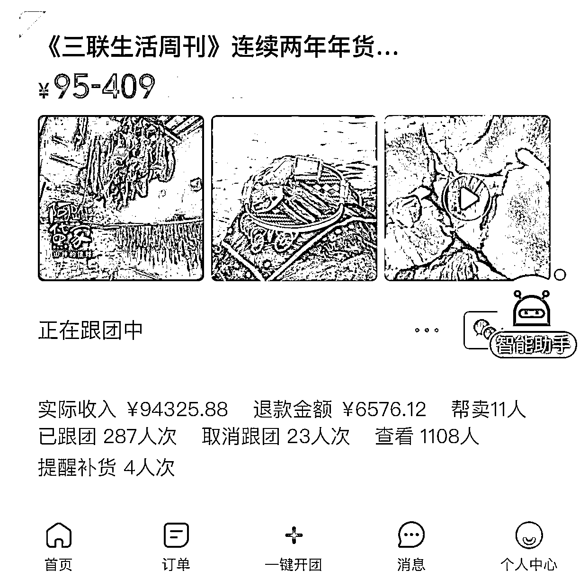
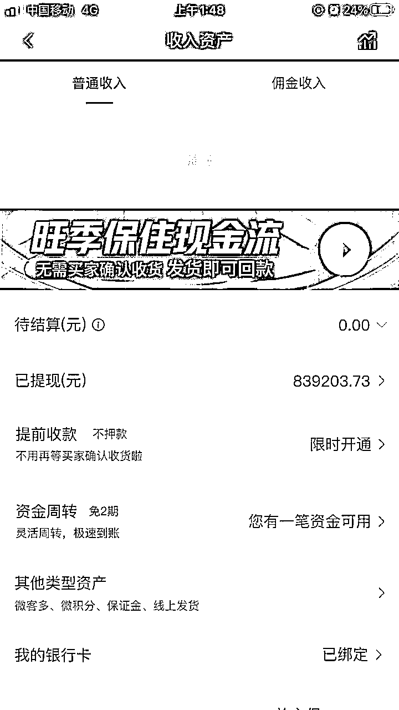
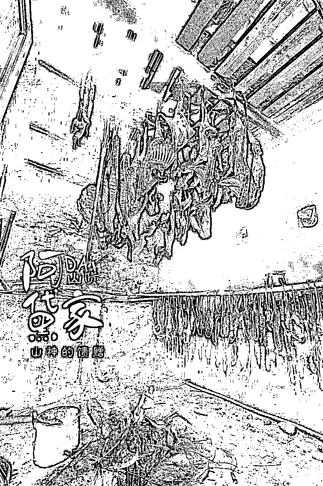
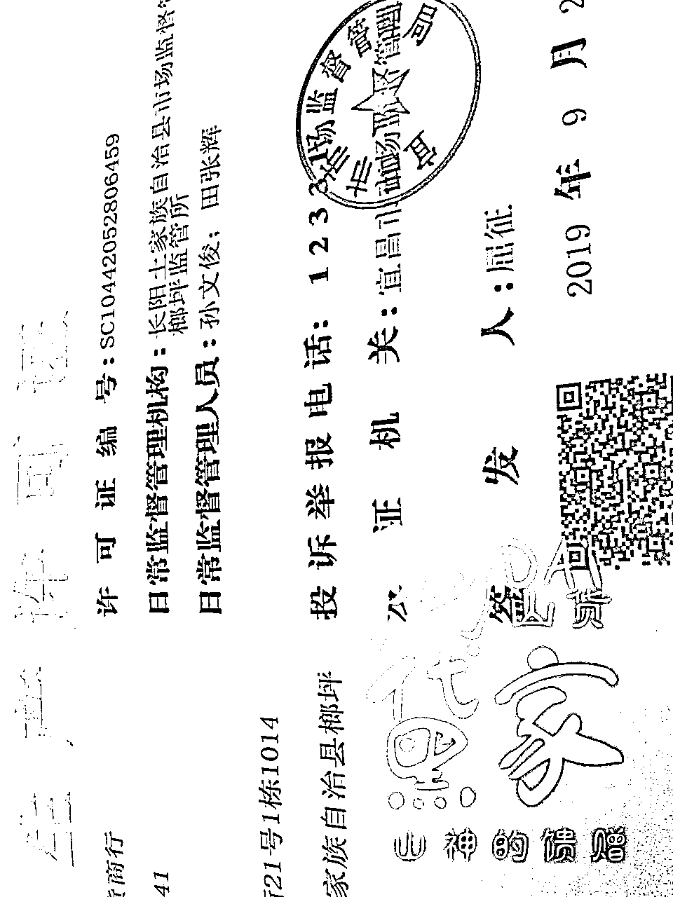
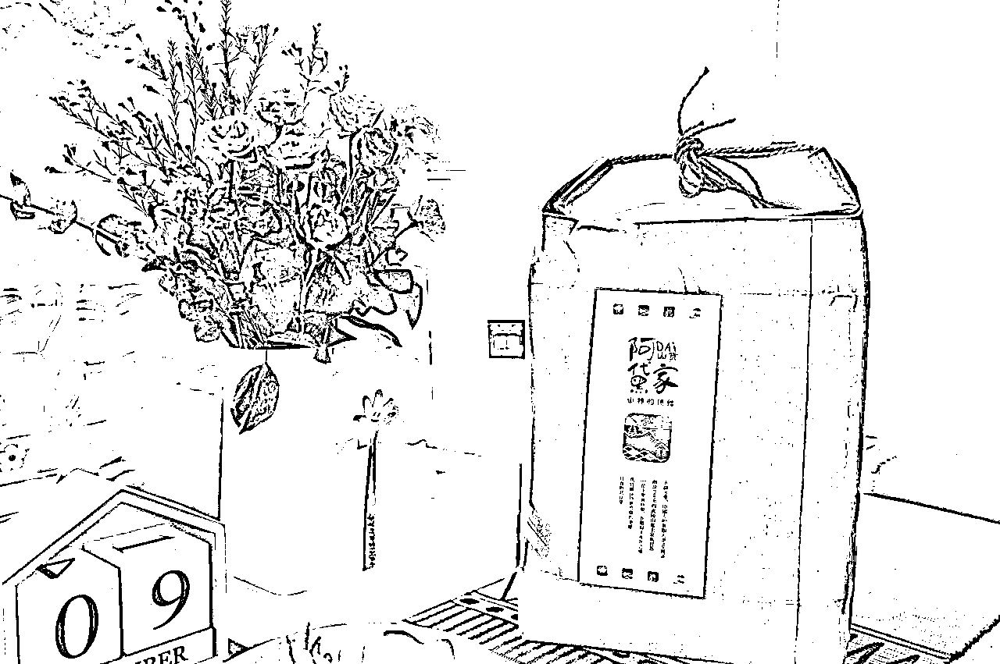
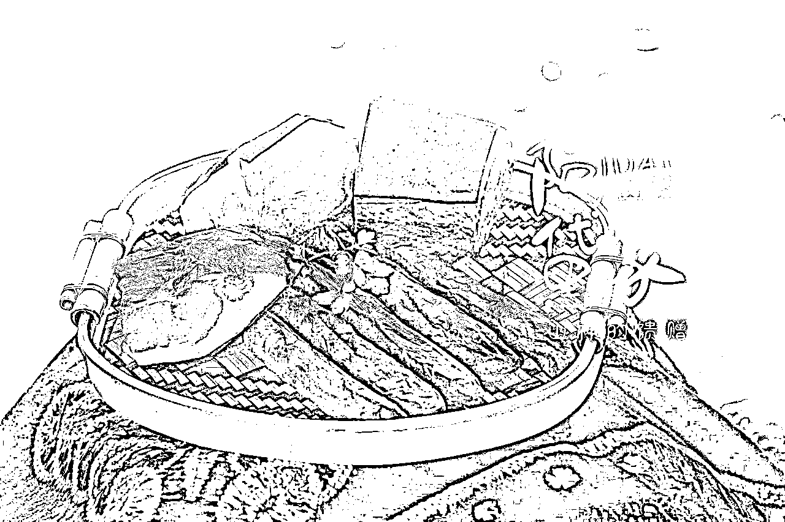
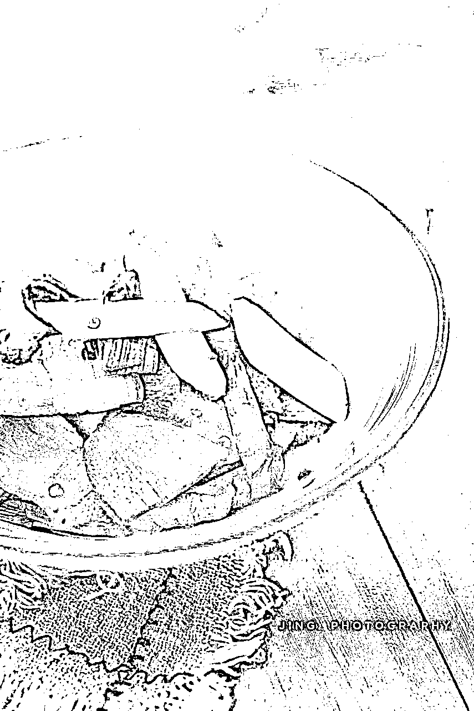
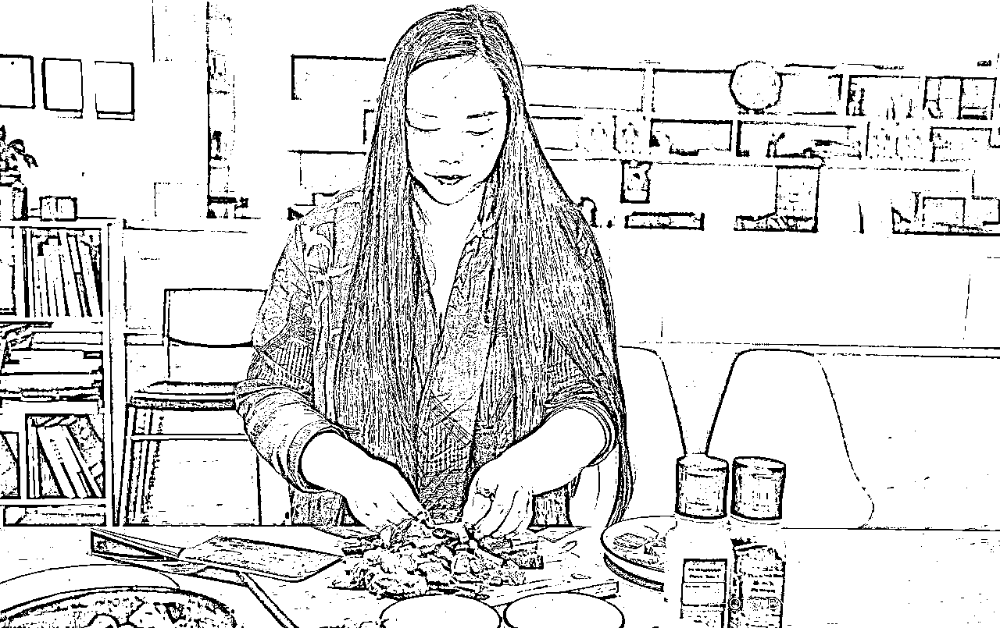
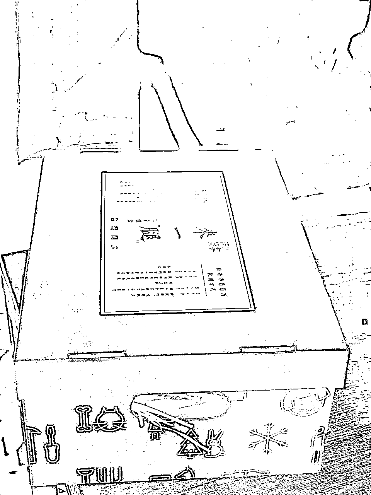

# 我是如何将腊肉卖到县城同类产品top级的

> 来源：[https://y2w73sabxw.feishu.cn/docx/A47Vd3fekoelzRxZpdUcTl9Cn7W](https://y2w73sabxw.feishu.cn/docx/A47Vd3fekoelzRxZpdUcTl9Cn7W)

我是阿黛，湖北宜昌土家族人，目前在郑州生活，是刚刚加入生财的萌新。

年轻的时候主业是房地产开发管理，后来创业做销售公司，私域做家乡特产一直是副业，从2015年开始，每年只销售三个月，在2018年的时候做到县城同类产品的TOP级，这样的成绩，在大佬云集的生财完全说不上嘴，但还是愿意将过程分享出来，给像我一样的新手一些参考。

首先上微店和近年快团零售入账截图，多数大笔是公对公转账。

阿黛家山货品牌创立过程

我的家乡是鄂西南一个非常偏僻的山村，跟重庆四川交界，崇山峻岭，交通极为不便。88年村里通电，我高中毕业的时候，98年，我爸爸他们人力挖出一条摩托车道通到家门口，联结了一条矿山公路，矿山公里联结著名的318国道，通往山外。

2009年沪蓉高速通车，路过家乡小镇，随后高铁才通。原先从我家到成都，开车坐车都得两天，现在几个小时就好了。

因为小时候觉得山里环境太过恶劣，九岁开始就不得不开始寄读，往返几十公里上学非常艰苦，就下定决心一定要到外面去生活。后来机缘巧合停留在河南郑州，十几年直到现在。

20岁出头进入房地产业，开始是文案，后来转策划岗，再到营销总监，当整个项目的操盘手，2012年离职创立自己的房地产顾问销售公司，十几年里销售过百万平米。

我的前东家居易国际在北方是比较知名的地产企业，我获得过2006年感动人物奖，在2010年获得郑州市楼盘推动力人物奖。

地产行业确实给我很多收获，不仅是经济收入，还有工作习惯啊营销的专业度这些。为什么开始做山货呢，其实是一个非常小的偶然。

大约2014年年底，我跟我的第一个合伙人拆分，虽然分手分的还算体面，但我个人的钱包和感情确实还是受到了一些伤害，刚好年纪也不小了，前些年一直非常拼命的工作，付出了许多代价，包括身体的健康（2006年罹患股骨头坏死，迄今没有痊愈），还有作为一名适龄的女士还没有生育，于是在2015年的时候我休养生息。

到了12月份的时候，和我两个女朋友喝咖啡，她们两个给我说，你反正闲着，网上卖卖腊肉呗，其实放到今天来看，其实是我太实诚了，她们两个都曾随我回过山里湖北的家，她们吃过我家的腊肉，特别喜欢，想问我要不好意思，于是就建议我卖，哪里想到我这么耿直，那就卖呗。

人其实都是有故土基因的，那会儿刚好父母也随我在郑州居住和生活了，难得回一趟的家乡，当时对非常想离开的家乡，倒有了不少的眷恋之意，于是自己搜集资料，一看不得了，平时觉得平常的土家族腊肉，其实被《三联生活周刊》连续两年年货特辑推荐过。

做腊肉的产区这么多，我们土家族的做法大不同，我们是用花栎木慢慢在瓦屋土墙的房子里冷烟慢熏出来的，所以色泽是金黄的，不是黑乎乎干硬的那种，吃起来香和软，对老人孩子都特别友好，文章里指明产地，是湖北宜昌长阳，而长阳街上随便一问，最好吃的腊肉是我们榔坪镇来的。

我也有美食家朋友跟我到家吃过，后来他写了一本书，盛赞口感是“溏心”的，所以我自己整理文字，让设计组设计LOGO，带了摄影师回山里拍摄照片，我叫阿黛，就直接以我的名字命名，一晃到现在已经八年了。

这八年里确实取得了一些微不足道的成绩，卖到香港、非洲、法国、日本、泰国等，也不停的在修正各种细节错误，但是一直以来没有进行系统的梳理，趁着这个机会也算是做个自我总结。

做阿黛家第一年，决定做之前我已经定下了印度行，签证机票酒店都出了，所以产品上架之后我就出国了，那一年临时起意开始的晚，过年又早，线上卖了一个月我在印度半个月，没啥大影响。

第二年腊肉季开始我刚生完孩子，人还躺在月子中心，也不影响卖货的，就是那会儿还没建立山里的发货团队，都是山里一股脑儿先寄给我，我自己再分开打包寄出去。

第三年呢我又接了一个地产项目，营销周期跟整个腊肉季重叠，但那会儿基于前两年的基础，我又把山里的保障力量搭建好，也顺利度过了。后来就是猪瘟和疫情，每年都有新的幺蛾子，都挺过来了。

如果你的个人微信里有3000个有效用户就等于开了一间大店，而不用承担高昂店租，这个成本实打实变成了利润。最可爱的一点还有它的可持续性，你的产品年复一年生产，自己培养了一大批用户，年年形成购买，现金流太好了。

在我做阿黛家山货这几年里，地产业务也有在进行，卖的再好要帐都特别困难，要账难已经是各行各业乙方都面临的困境，有些都被拖到破产，唯有电商，钱到才发货，是能做到老的生意，不用转型换跑道。

好处很多，做起来的难关也很多，有一些东西是必须坚持的，在大的方向上有底线，就等于打好了地基，才能稳稳的向前。首先就是我们的产品品质。

1.     产品品质是基础，不管产品的核心卖点是什么，只有品质才会决定复购率。

现在咨讯大爆炸，获得的通路非常多，客户们都见过世面，随便糊弄是不可持续的。

从乡村获得的产品核心卖点应该多是生态、绿色健康这些，那你说的什么就必须做到什么，不能只是营销口号，你的客户直接用订单投票的，真的好就一直买一直买，不好买一次，不但不买了，还告诉很多人你的东西不好，没人买了那自然就没法继续了。

比如我阿黛家的主要产品腊肉，有年猪肉价格飞涨，之前同样多一皮卡车肉，三万多块就可以，后来得八万多，涨了百分之二百还要多，就有人建议可以买一些冻肉来替代，说真的，我第一次听说这种操作，就是会有些地方和企业，会收购一些猪肉，放到冷库冻着，等着市场供应量不够的时候拿出来获利，但我直觉上认为这些冻过的肉肉组织应该冻死了，即便还是使用我们的传统方法熏制，口感上还是会有很大差别的，这个是能吃出来的。

我肯定是缺钱，我也知道降低成本一来二去的利润就多出不少，但我还是坚持选用当年长成的新鲜猪肉来做，客户其实能感受到差别，这是你的基石，不能动摇的。

做别的也是如此，生态的就是生态的，你没有使用催熟剂没有使用膨大剂，不以次充好，年复一年保证同一品质，你的客户真的有感知的。

做我们这一行，有时候难免依赖天时，说不准哪一年产量供应链会有问题，但这种时候就有时间静下心来看自己的整个环节有哪些BUG，修补好，完善护城河，为旺年做准备。

2.     目标设定及合法合规（框架拉大，慢慢填充）

做一件事情，开始之前就要目标长远一点，不是说你一下就要完成，而是一步步一点点的往前推进。

比方说来，我们参加一个考试，心里想我要考100分，然后努力努力，最后可能考了90分，但一开始你就想，说考个60分就可以了，也努力，最后果真考到60分，也比那个90分少了30，所以梦想一定要有，目标可以大，但记得是要一点点积累才行。

你的第一批客人，肯定是身边的朋友和熟人，他们和你之间相互信任，并愿意为你在其他客户那里做信任背书，我常常分享的一点，就是开始卖东西，你就得忘掉你认识的人，眼光盯在熟人身上，觉得他没买没帮你卖什么的，那你什么时候都卖不多，你才认识多少人，朋友们也没这个义务对吧，要把眼光放到陌生人身上，想想世界多广阔，陌生人有多少，你的市场有多大。

但是，肯定第一步是由愿意帮你的朋友出来，购买和宣传，第一你肯定不能辜负这些人，他们用他们的人品为你和你的产品做了担保的，产品做好，好多陌生人知道了你的产品，确实好，也介绍给别人，这个时候你的市场慢慢变大，你就要注意摆脱家庭作坊的模式了。

我建议可以注册个体户，不麻烦的，而且有很多免税政策支持，这样有什么好处呢，第一很多单位集体采买是要你提供发票了，第二是客户多了什么事情都有可能发生，可能就会有人投诉你没有售卖执照食品经营许可什么的，很麻烦，所以这些证照我是建议要办的。

比如我的阿黛家，因为帮忙宣传的多了，猪肉有时候有时疫什么的，所以除了注册农产品公司办理食品经营许可外，我还要求叔叔他们即使是我们自己家养的猪，也要到镇上定点的宰杀点宰杀，做好出入库，进来有多少斤肉，熏多少斤腊肉，卖出去多少，都有依据可查，每一步都清晰明了，后来我们甚至历尽艰难把食品生产许可证都办下了，有了这个进商超都没问题了。

这些会让你的产品看起来更正规更可信，毕竟是有国家监管部门为你做了信任背书的。

3.     包装及用户体验(转介绍)

再说回来，刚刚开始，确定了产品，还有价格，确定个名字，然后就是包装，因为涉及到运输，特别是比较容易破损的农产品，首先是考虑坚固度，确保运输没有问题之后再考虑美观，农产的话我是非常建议极简的，不用铺张豪华过度包装，没必要的，就是朴素点，让人一看确实是用心了的，这个就比较贴合。

量少不需要特别定制，就按自己需要的分开采买，成本低一些，我阿黛家腊肉的包装就是这样，普通的牛皮纸袋，然后自己的LOGO，发货的时候一贴，就可以了。只在年底的时候有些客户觉得买了千八百的肉，只一个袋子不太体面，才换成大的礼品盒子，这个盒子也是另外采买。

销售过程中是一定要注意这些客户体验的，不要觉得我东西好，质量过硬，这些不用在乎，还是要在意的，这些细节也是你产品的一部分，你的服务也是，卖产品不仅仅是卖产品，它还有附加值的部分，因为现在客户的选择太多太多了，每一个细节都要特别注意。

我的腊肉每年是我表姐叔叔啊他们给我发，他们是家人，肯定万事就从我的角度考虑，觉得能省一点是一点，所以就不那么讲究好看，一个袋子明明只能放两个，为了省个袋子，拼命放三个进去，看起来鼓鼓囊囊，不好看不体面，客户收到感受肯定不会好，更不会想着送他的朋友了。

后来我就给山里做了硬性规定，一个两个装小袋子，三个及三个以上就用大袋子，这是我自己试过的，比较合理的。

还有我爸爸妈妈，有次我认识的一个人，要去香港送礼，说来几份腊肉吧，要送朋友，我出差，就拜托我爸爸妈妈帮我一下，结果我回家的时候别人没来得及拿走，我一看贴的标签，一边大一边小，连忙撕了重贴。

分享这些是什么意思呢，物质如此丰富的现在，客户已经对我们有了极高的要求，返璞归真没错，极简也没错，但美的鉴赏力啊这些我们也要提升。

产品品质过硬加上体验也很好，你的客户就乐意买了送人，义务给你分享，越来越多的人购买，这就是个良性循环了，也说明产品确实经受住市场考验了。

4\. 个人IP的打造，从真实场景开始，建立个人形象

所谓个人IP，就是让别人看起来你是个什么样的人，是不是善良真诚的，是不是专业可信的，就是所谓的个人魅力，让你的陌生客户和你建立联结产生信任，巩固客户黏性，这个不是一朝一夕能完成的。

就我们普通人来说，最直接容易的通道就是微信朋友圈，微信的口号就是“个人即品牌”，好好经营自己的朋友圈，积累几个月半年一年效果就会开始显现了。

朋友圈怎么经营呢，其实不需要多么好的拍照技术，不需要多么好的文采，就是勤奋和真实，真实本身就是力量，抛开产品本身，你可以分享村儿里的景色，你的个人生活，村里的集体活动，以及你产品的生产过程。

你产品的生产过程这点最有意思，我的腊肉只在冬天售卖，但对用户的故事可从小猪仔就开始讲起了，你讲你是粮食野菜喂养，拍照写朋友圈，你说山里环境真好无污染，拍照写朋友圈，你说你的菜完全有机种植，对土地的有机修复过程，撒种的整个过程，破土发芽人工除草的过程，你说你的果实你的茶也是天然有机的，不用喊口号，给你的客户看树上结的蜘蛛网，那个蜘蛛跟果实一起都在长大，旁边是什么鸟的叫声，每个环节都分享，你的用户看着噢可算成熟了在卖，赶紧买吧，因为你的分享过程已经给他心里种草了。

同样的东西，超市冰柜里的来路不明，你的是他看着长成的，格外亲切。这个过程他也感受到你的态度，你是专业的可信的，产品是可信的，不认识你的陌生人加了好友，来翻你的朋友圈也能看到这些内容。别人想买什么东西，马上就想到你，这样你的个人形象就完成了，在此后的销售里不断发力，这个积累付出绝对是必要的，也是值得的。

农产品有个问题，就是季节性售卖，除了分享生产生长过程还可以在不同季节创造场景，其实就是所谓的场景营销，你就是自己产品最好的代言人，随时随地为产品站台，把产品融入自己的日常生活。

比如我家腊肉，当季推广就不说了，我会开个山谷里的产品发布会啊，会带意见领袖回山里吃年猪饭啦，杀年猪是我们土家族人仅次于春节的盛大节日，这样的营销节点我肯定不会错过，我会去朋友公司煮腊排骨腊蹄子请三五十号员工来吃，好吃他们会帮你朋友圈推广，而你自己做这么多人吃的饭毫不费力，是和产品“优质食材极简烹饪”的核心卖点吻合的。

食物也是可以组CP的，比如豌豆和松茸的季节并非腊肉的季节，但它们在售的时候我会在一些美食工作室做腊肉豌豆洋芋焖饭还有腊肉松茸洋芋焖饭和大家分享，让大家别忘记你是卖啥的，还有呢煮腊肉在西藏和藏人过林卡，去和朋友们野餐，去音乐节卖焖饭，做诗会。

有时候这些机会不用刻意，它们是顺手的，让你嫁接自己的产品，看起来有趣引起关注，也实打实扩大了营销面，让更多人尝到了你的产品。

一般产品的推广内容，我有个模式给大家分享一下，首先是有篇方便转发的开始售卖的文章，被转发一波，转发的时候你可以截图发朋友圈，这是个很好的提示，有些朋友可能没注意到，没想到，看见了会帮你发一下。

然后就是订单，特别的订单截图发圈，把故事用文字描述一下，也会引起关注购买。第一波发货的场面一般会比较大，要渲染，然后收到货的买家秀就开始了，买家秀都够做内容很长一段时间，而且引起和客户之间的互动，这个互动是很重要的。

一般朋友圈一天至少保证5条左右的内容，少了会有很多人看不见，他们也没办法用意念感知到你在卖东西。要克制群发信息，特别是生硬的广告，比较败好感。

另外妥善处理和朋友们的关系，我有好几个在他们圈子里比较有名气的朋友，甚至说的上是网红，一般我先看一下，如果他特别积极乐意主动帮我转发推介，那么在我自己的内容里我会有互动，如果他只默默自己买，在任何社交平台只字不提，我也就当这件事情没有发生，购买本身就是支持，我比较在意和朋友们的相处，不想因为蹭他们流量搞的不好继续相处。

5.跨界联合推广，共享客户资源，获取新客（目标客层），互利共赢

销售到一定程度后一定会有瓶颈，这个是正常的，你的影响力会有半径，而且实际上别看现在咨讯现在这么丰富，但我们每个人都有认知壁垒，比如岳云鹏红成这样，如果你不听相声根本不知道他是谁，同样的，在电竞领域，即便是冠军得主，出了这个领域没人认识，所以现在明星们都想出圈被更多人认识，这都是一样的。

怎么突破这个问题，很简单，就是跟别的领域做的好的人联合，共享客户资源。

比如有售楼部要招待他们的业主，会邀请我去做所谓的家宴，这样的一群人，他们原本没可能了解到我的产品，但这样一来就有了通路。

还有朋友是做德国厨具的，他们的锅非常好看，但现在硬卖也卖不动，需要大量内容填充，刚好我的腊肉跟他们“优质食材极简烹饪”的理念是统一的，就邀请我出镜，带着我家腊肉，拍煮的视频给他们的客户看，他们的客户会被我的腊肉吸引，我的客户看到会被他们的锅吸引，转化成销售就实现了共享客户资源，达成共赢了。

有这样的机会，首先还要判断一下，双方客户的匹配度如何，如果不是同一消费群体，那也没什么用处，买奢侈品包包的人肯定不会和热衷砍价的人同一消费习惯。

6.渠道（合作团队）建立，降低边际成本，打造“睡后”收入

说到渠道，基于我们的产品特性，其实是不适合进驻淘宝京东这些平台的，进驻门槛相当高，没个几十万的投入根本开不了店，非标品，产能也承接不了太大的流量。

睡后收入其实是非常微商的说法，意思是说只要你建立起一支稳定的销售队伍，即便是你不工作，下面的销售还在进行，金字塔尖的你可以所谓的躺赚，但这个其实很难。基于售卖单价和利润空间，我们其实也没办法形成微商这样的层级销售模式，微商产品一定是利润空间非常大的，比如一个成本二十几的东西卖三四百，利润是支持分级，每个级别的利润都有保障。

微商都会鼓励代理大量囤货，如果产品不是在终端消耗掉，都会压在小代理手里，被这样收割几轮之后，你现在找所谓代理不像之前那么容易。

再加上农产品都是非工业流水线产品，在保证严格品控的前提下，产量是有限度的，你也没货给人家囤。那怎么办呢，首先市场其实是非常大的，你找到有固定客户的那群人，让利合作。

比如有朋友茶叶卖的特别好，茶叶不便宜，喜欢正山小种的人喜欢烟熏味，那我就让出一些利润给她，让她把腊肉推荐给她的客户。

还有一个姐姐特别有关系，她只在节假日的时候能中到一些事业单位的年终福利单，那在每份礼盒里都会搭配一份腊肉提升整体价值，这种批量采购你也让一些利润出来。

还有京东管采购的，她的客户基数大，还有在其他城市的美食博主，都是谈好利润，代发货替他处理好客诉，也是销售额构成的一大部分。

越往前走这种方式越有必要，毕竟你个人精力有限，都做一对一的销售的话，只有借助这样的力量，才能轻松卖更多。

7.公关与售后：换位思考，疑罪从无，给出比客户预期多一点点的解决方案

销售的时候真的会遇见各种各样的客户，问题五花八门，让人意想不到。

首先我们得明白一件事，我们自己得认知也是狭隘的，比如我卖腊肉之前，简直认为这个世界上所有的人都和我们土家族人一样，一年四季一天三顿顿顿吃腊肉，后来才发现很多人在认识我之前根本没吃过一口。

我生活在北方，北方的人收到一块原生态连毛都没去的腊肉时根本束手无策，完全不知道怎么处理，而且只有在冬天，他们才会想要尝一尝，再加上过水真空处理过的肉在夏天也不便运输，所以我的主战场就决定一年里我只有两个多月不到三个月的时间经营这个产品。

所以有客户会问我要放盐嘛，我说明书做法指导上都会写得明明白白，要出水要出水，其实就是去盐的过程，没用，得问你，还有人会问辣吗，腌肉的时候只放盐什么都不放辣椒一般腊肠才放辣椒，但别人不懂啊，后来你一查，还真有些地方的腊肉真会用辣椒腌了做。

还有人问，是连袋子一起隔水蒸吗，你明明写的就有，开袋即烹，因为蹄子排骨我们都是去毛清洗晾干切割成小块了真空包装发货的，我也不明白为啥会有人对厨房不了解到这种程度，会连真空袋一起蒸的，前几年对我来讲真是巨大的考验，分分钟翻白眼想爆炸，这几年态度就好很多。

你司空见惯的事真有人没见过的，还有口味的问题，众口难调，酸甜苦辣的程度每个人的感受力不一样，经常会有客人问有多辣有多酸，让人苦笑不得，保持耐心，给客户解释清楚，把他教会让他爱上，每一个都是你的市场占有率。

也会因为快递的时效背锅，时效我们不能控制，但我们积极协助客户追踪，有个解决问题的态度，如果快件确实丢失，马上先给客户补发再找快递公司理赔，别让客户和快递公司扯，客户感受就太不好了。

前面我们说到客户体验，这也是体验的一部分。我曾经在爸妈生日的时候定过一个蛋糕，卖家叫了跑腿，送的过程中师傅把蛋糕摔了一下，整个奶油糊掉非常恶心，我爸妈没有拆开看就签收了，我回家一看立马投诉，蛋糕店客户给的建议就是让我找跑腿扯皮，我一听就很生气，从此以后再没买过他们家任何产品。

一年里家人自己朋友生日，平时的面包点心消耗，一年下来是一笔不小的开支，可能损失我一个还不要紧，要有这样的十个一百个流失了呢，肯定是大损失，遇见投诉先换位思考一下，如果是你自己遇见这样的问题，找人投诉，哪种解决方案会让自己满意和舒服，就选这个。

一般客户都很通情达理，真想占便宜的想碰瓷的是极少数，遇见了坐实了你就满足一下他的要求，视情况决定下次要不要继续交易，老话说，嫌家才是真买家，事儿多的人不一定不会买单，所以保持好心态，宽容一点，大方一点，只要给出比他期许多一点点的解决方案，就能得到一个忠粉。坏事也变好事。

学习是一方面，但运用也是很重要的，没法照本宣科，就找有用的点儿根据自己的实际状况灵活变通来用。

早些年中央台天气预报前后的广告报价几个亿，现在都没人看电视了，瞬息万变的现在，你还看老教授编的营销课那就太荒唐了。

市场是我们最好的老师，没有必要迷信所谓的权威，只要尊重常识，面对并且沉浸到自己的市场里，结果都不会太差。

到这儿我所有的分享就全部结束了，祝大家的产品都大卖，新的一年都发财，谢谢。