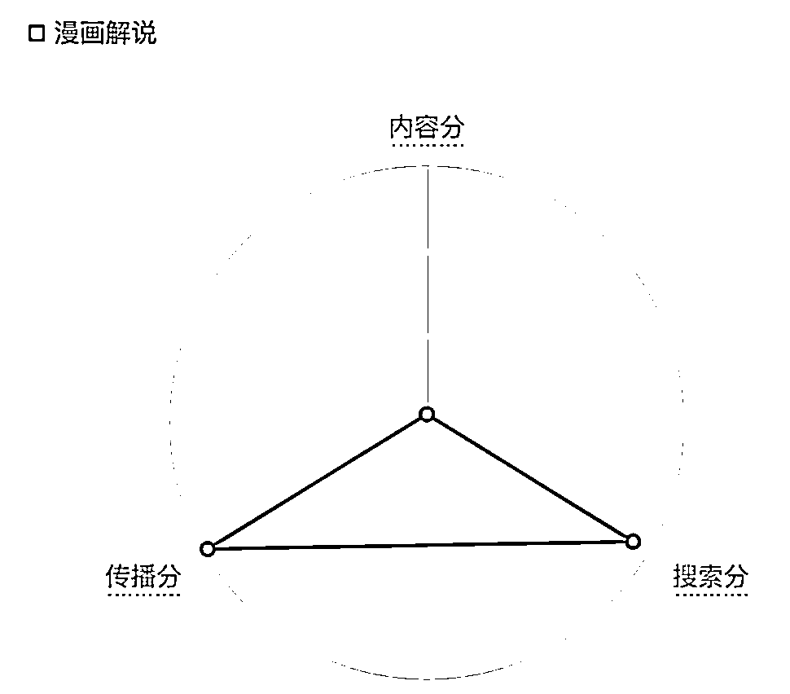

# 生财有术赚钱体系梳理（新人启航指南）

> 来源：[https://trvzn3ack7.feishu.cn/docx/EnMvdgCPboEplRxJPdXcMUrznbf](https://trvzn3ack7.feishu.cn/docx/EnMvdgCPboEplRxJPdXcMUrznbf)

# 前言

作为刚加入星球的新人，先简单做下自我介绍以及为什么想写这篇文章

## 自我介绍

我是老猪，19 年进入跨境电商 Shein 做产品经理，21 年在一家出海企业做千万 DAU 量级的短视频和工具产品，现在出来专注搞钱

## 为什么写这篇文章

近期刷了 N 篇精华、N 个风向标、N 个项目帖子后，情绪亢奋，仿佛已经财富自由。

但冷静下来，会发现尽管输入了很多信息，但是这些信息是相对碎片化的，并没有融入到自己的体系或方法论内，那这些宝藏信息相当于白看了。希望能够发挥自己比较强的分析和梳理能力，建立一个初版的关于赚钱的体系，既可以帮助自己梳理和建立起一个相对全面的认知，也可以给有类似需求的圈友提供一些体系参考～

————————————————————————现在进入正文——————————————————————————

# 1.赚钱的本质是什么？

解读一下：在整个社会或市场内，存在许许多多的需求方，他们在不同平台不同场景下遇到了多种问题或产生了多样诉求，这时候如果我们能够找到他们，为他们提供解决问题的方案，无论这个方案是实体产品还是虚拟服务，用户愿意为这套解决方案买单，我们就能赚钱。

因此，里面存在几个非常重要的关键词，它们直接决定了我们赚钱的整体思路

# 2.赚钱的要素组成是？

沿着赚钱的本质是什么，我们将一门赚钱的生意或模式拆分成以下几个要素

序号

要素

说明

1

User Need

用户需求，来源有非常多种

2

Product Solution

产品服务（提供产品能力或相关服务给用户），在我们设计产品时是有一些抓手进行参考与设计的：

3

User Growth

4

Monetization

商业变现（采用相关策略与手段转化用户盈利），只有到达这步产生交易才有所谓的赚钱，我们可以列举一条公式：利润 = 用户规模 * 客单价 - 成本，商业模式取决于你的客单价是由整个链路上的哪个角色进行支付，因此构思变现模式本质上在思考流程上各个角色如何交互

# 3.为什么你能够赚钱

## 3.1 能够赚钱的一些原因

赚钱的本质是自己卖了一个东西给别人，那为什么别人要从你这里买呢？《肿安娜的生财思维之路》

原因

分析

用户没有接触到其他产品服务或解决方案

用户有接触对比其他产品服务或解决方案

而以上的本质，是提供了在同等需求下提供了更多的价值，帮助用户降低了更多的成本，因为一个用户买单的路径是十分长的，每个环节都会存在成本，如果你能够为用户降低成本，你就比起别人天然具有优势

## 3.2 关于信息差的思考

关于信息不对称这类信息差生意，有几个思考

# 4.如何找赚钱方向？

如果此篇文章看到这，你还产生了这个疑问，可以回到【赚钱闭环要素】内看下 User Need 内容，赚钱的方向或起点在于找到用户真实需求

# 5.如何筛选赚钱方向？

当我们已经有一些赚钱的方向了，还需要有一个筛选的环节，将与自己不契合的项目给筛选掉，以下是一些筛选方式

# 6.赚钱内必备的一些能力

## 6.1 项目失败的一些原因

勇气不是毫无准备的冒险，它是基于一定确定性基础上通过对未来风险的驾驭来博取收益。项目失败的原因一般有几种：

## 6.2 成功项目的底层能力

# 7.关于赚钱过程中一些问题

## 7.1 这个事情天花板有点低不想碰

可以结合【5.如何筛赚钱方向】的「收益天花板」来思考

## 7.2 这个事情已经有人做过了

当你所要做的事情已经有竞争对手入局了，本质上你是在思考你是否可以在竞争格局中还能赚钱，这时候可以从几个维度去进行评估是否还能入局

如果从以上 2 大视角去分析，目前要做的事情，在当前阶段自己还能有一些可接受的收益，那就是可以入局

## 7.3 这个事情没什么壁垒

这个可以结合这个可以结合【3.2 关于信息差的思考】来思考和 【7.2 这个事情已经有人做过了】来思考

## 7.4 这个事情不可持续

这个可以结合【3.2 关于信息差的思考】来思考

# 最后

以上是目前 1.0 的赚钱体系，如果对圈友有一点点作用，可以给我点赞评论反馈一下下～

有新认知会不断在这篇文章上做更新，祝愿我们大家都能赚到第一桶金，一起生财有术！

有想法或机会都可以互相聊聊～