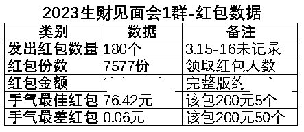
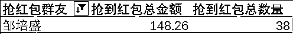
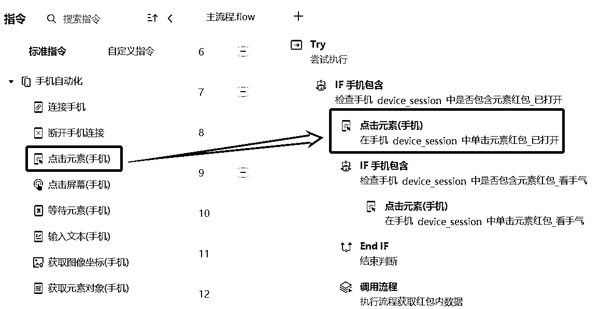
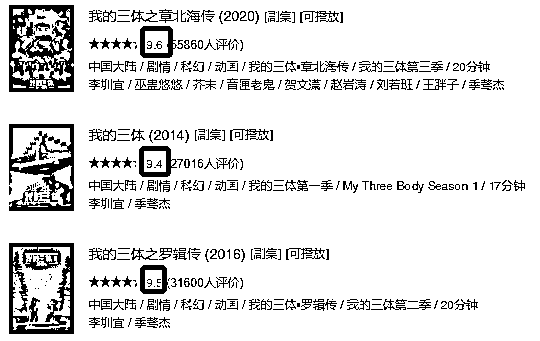
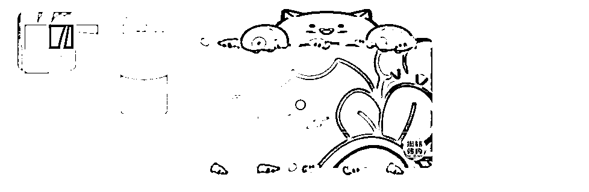
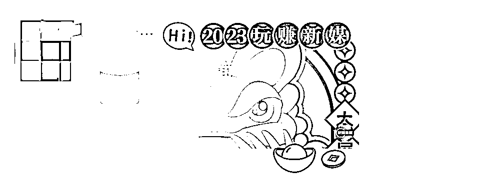
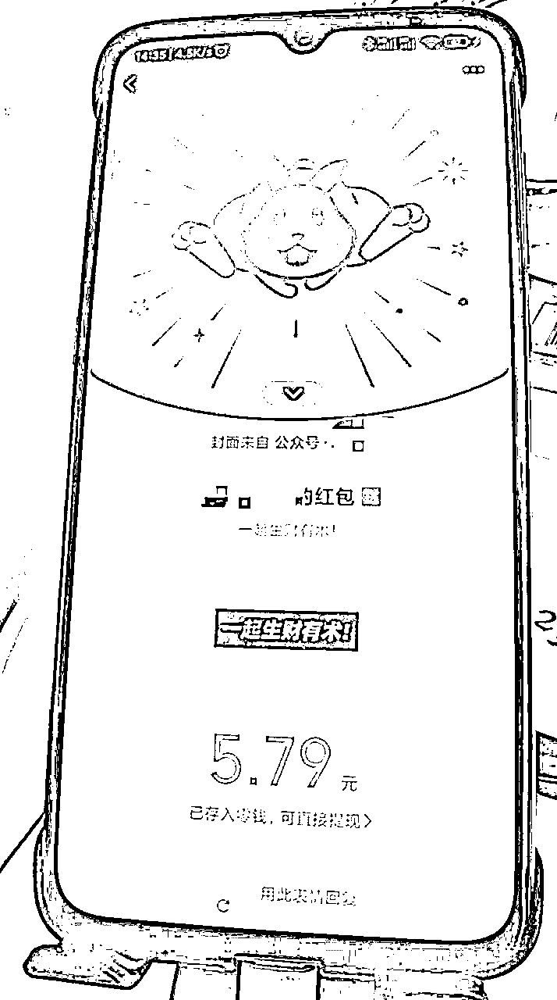
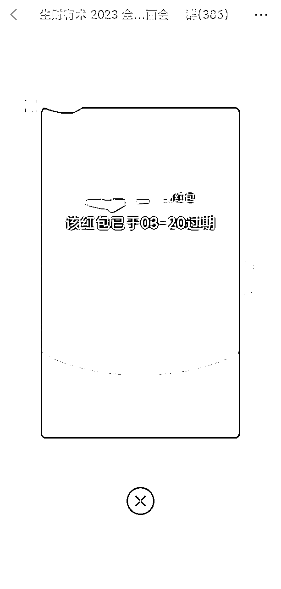
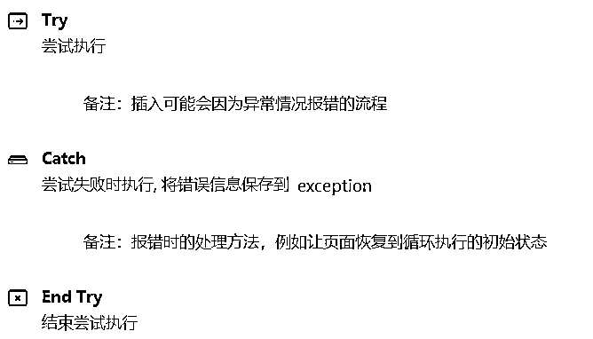
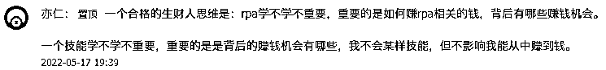

# 7天9000+份红包雨，我用影刀RPA爬取生财见面会群微信红包数据

> 来源：[https://ih195hg9y3.feishu.cn/docx/EtosdPFUuo1iPexWVKxclw4jnYg](https://ih195hg9y3.feishu.cn/docx/EtosdPFUuo1iPexWVKxclw4jnYg)

2023见面会大合照镇楼

大家好呀，我是阿盛，坐标广州，在做量化交易和流程咨询，也在用RPA帮中小企业和超级个体将业务流程“超自动化”运作。

这次分享的是一个“红包数据爬虫”，一说到爬取数据，大家可能会想到网页爬虫，用python代码或八爪鱼等工具，从电商或自媒体平台扒数据，在手机端把APP数据导出的插件和应用估计也见过，但是微信群的红包数据爬虫可能比较新鲜吧~

虽然这明显是属于“手工耿”类的应用，有点技术，看似无用，但有趣的是想法（万一微调或换个场景后就能搞钱呢？)，所以我将这次分享定义为一个“熟悉场景里的新鲜操作”技术分享帖，让非技术圈友能一窥RPA的能力和技术实现，理解RPA自动化流程的思路，可以识别出自己业务中高频重复的部分，在需要用自动化提升效率时，可以和开发者有更高效的沟通。

### 〇、阅读指引

为节省圈友们宝贵的时间，预估不同了解程度的圈友可能的收获：

收获

从未听说过

可以了解RPA是什么，能做什么，是怎么做出来的

还没动手用过

消除自我设限，按附录的教程尝试动手做一个

已经做过应用

在手机端的操作或许会有启发

大佬们

人才库里的开发者+1

### 一、缘起

这个月生财圈里最大的事情莫过于“三年磨一见”的千人见面会了，从上周在见面会群里就开始各小组的自我介绍，每天晚上1小时，足足分享8天时间。

既然“谈钱不伤感情”，见面随喜一个红包，让钱流动起来，这样的互动挺符合生财的调性，一天还行，这要是持续一周，那不得是一场红包暴雨？

是的，这就是见面会的实景，并且还有一位气象观测员，记录了这场暴雨中每一滴雨水的流向。

来看几个数据：

虽然我把爬取的数据做了个透视表，但因为涉及群友隐私，就不放出完整版了（如果想要另做测试，欢迎拉我进有红包雨的群~)，不过可以放出我自己的数据，徒手抢了38个红包，平均3.9元，相当标准的均值了。

显然我并不是“蓄谋已久”地要搞事情，而是在3月22号晚上，最后一场圈友介绍结束后，鱼丸再次发出见面会流程和地点提醒时，才发觉“呀，真的要见面了呢”，回想起这几天群里的介绍，能让我印象深刻的介绍，按不严格的分类是有三种：有成果，有能力，有作品。

作品类可以分三个台阶：

那么，当我在和圈友见面时，可以提起一件什么样的事情能留下一点印象？

从当时最应景的场景出发，和现在做的事情结合起来，还要有点意思，想法就有了：

确定想法后，接着就可以开始捋一下实现思路了。

### 二、实现思路

#### 小白也能看懂的RPA简介

首先还是要照顾非技术的圈友，了解一下RPA是什么，和其他软件工具有什么不同：

RPA（Robotic Process Automation，即机器人流程自动化），这是一种通过软件模拟人类在计算机上执行操作的技术，可以帮助我们自动完成一些重复性的工作，例如数据录入、发送邮件、网页操作和控制软件等。

请注意这里的加粗：模拟人类在计算机上执行操作。

按我的理解，RPA可以定义为”软件的软件“，它的核心功能是可以模仿人类的操作，使用鼠标、键盘或指令来操控其他各种软件（网页浏览器也属于软件），还可以进行数据处理、调用API等需要用代码实现的功能。

前者早就有”按键精灵“等应用可以做到基础的点击、输入，后者是编程的常规操作，但是把这两项能力结合起来，加上人工智能技术的文本识别、图像识别和自然语言处理，RPA就能“看见”它要操作的软件和内容具体是什么，即使你把软件的窗口缩小或是挪一下位置，它也能找到对应的按键在哪里。

并且RPA软件大多是属于“可视化编程”或是“低代码”，就是把操作其他软件的各项基础能力，包装成一个个积木块，你拖动一下就能加入这个功能，可以看一下我在影刀RPA做的“微信群红包爬虫”应用的编辑界面。

当我想要点击手机屏幕中的红包是，只需要把“点击元素”这一个指令，拖到右侧流程中，然后在配置选择“红包元素”，就能完成这一个动作。

其他的大部分操作，都是找到需要用到的指令，拖拽过去，按需求进行配置。这种制作应用的方式，是不是像极了搭积木？

那么，会不会因为简单，就意味着功能弱一些呢？这里可以参考一下《我的世界》这种“积木游戏”，像我估计就只能拼出一棵树，高手可以搭一个城堡，而大神就可以做出一整部方块人版的《我的三体》，在B站连出三季，豆瓣评分9.4。

简单，意味着可以有更高的开放性，也同样能让更多有想法、有痛点的人，可以迈过开发的门槛，让想法得以实现。就像现在大热的ChatGPT或AI绘画同样如此，一个产品的界面只有一个输入框，你能表达清楚遇到的问题或是描述你想要的画面，AI就会帮你实现。所以对于这类具备较高开放性的工具，值得研究一番，提升搞钱效率。

#### 开发过程

好了，现在可以进入正题啦，我已经知道想要“获取一个微信群里所有红包的数据”，那要怎么“教会”RPA机器人，让它能帮我去把上百个红包全都打开，用小本本做好记录呢？

在我做一个RPA机器人的时候，一般会分成这5个步骤：手动操作-步骤梳理-模块开发-运行测试-修复BUG，可以完成一个小应用的开发。

#### 手动操作

前面我们已经对RPA的工作原理做了介绍，它是“模拟人类在计算机上执行操作”，既然要“模拟”，我们就得先做好示范，并且不只是“能用就行”的常规操作，还要考虑到异常情况。

我们先看常规操作是怎么看到一个红包数据的：

重复这4个步骤，就可以把群里所有的红包数据全部收集。

这里有一个小细节，当你打开一个红包时，会发现里面的群友名字和金额，是没法直接复制的，如果手动统计的话，只能选择...敲键盘录入，除了费时不说，还有可能出错。但是用RPA，是可以直接识别到这些文字内容，按原样保存。这类“不可复制”的情况在很多网页、软件和APP的场景里是常有的，也是使用RPA的一个优势。

那么群里的红包会有哪些“异常情况”呢？这也是拜生财群友所赐，才能一次尝试个够，比如：

#### 步骤梳理

好了，现在我们已经知道要怎么查看群聊里红包数据，并且可能有哪些要可能出现的异常情况，那就能够画出一个流程图，教会RPA怎么去做这件事情。

其实不止是RPA，所有的编程语言，都是在对机器做一次“操作流程”培训，内容其实也非常清晰，因为流程无非只有三种：顺序（逐个去做的）、循环（重复做的）和分支（判断要不要做的）。那些看起来复杂可怕的英文和符号，只是不同的编程语言用来做标记的。当然，这里不是说编程多么简单，和前文提到的“积木”同理，只是觉得咱们不用被它“吓到”。

回到我们获取红包数据的流程，简要版的图示如下，这里每一步，就是我们要教会RPA的一个小动作。

#### 开发与调试

具体的编程内容在这里就不展开讲解了，只提几个关键的地方，在操作其他手机应用时也能有启发：

#### 数据处理

当然，我们用RPA获取了这些数据，要把它以直观的方式呈现出来，最方便的就是用Excel的数据透视表了，简单说一下数据处理的思路：

sheet页

1-底表

2-发出红包统计

3-抢到红包统计

4-总结

用这样一个框架处理完数据，即使是“闹着玩”的小项目，看起来好像也有点能随时拿来做汇报的感觉[手动狗头]

### 三、总结

感谢阅读到这里，希望这一篇分享能让更多想要了解RPA的圈友能有所启发。对我而言也是从“试一下控制手机的指令”开始，一不小心就做出了这个应用，原本以为挺难的问题，在实操时摸索着就解决了。

当然在探索这一项新技术、新工具时，也时常记得亦仁老大的这段话，时刻不忘“搞钱”才是正事，把所学所得用搞钱做好闭环，这是我要加强的修炼。

最后，在ChatGPT带来一场生产力变革的AI时代，理解编程思维，更懂AI才能用得更好；掌握操控“软件的软件”，让我们在众多新工具涌现时能够有“影分身”帮我们干活。

* * *

### 附录

#### 附录1：启发文献

这是生财圈里对我研究RPA极有启发的几篇文章，我开始用起影刀也是在小排老师的文章里看到，感谢大佬们的分享。

二哥：如何利用 RPA 实现自动化获客，让项目提效躺赚？

二哥：RPA 自动化适合普通人赚钱的方式

刘小排：流量密码：普通人用AI做内容创作，有手就行

#### 附录2：入门通道

影刀注册：影刀官网

影刀课程（B站）：影刀初级课程

影刀官方提供的课程还是不错的，按课程讲解的内容实操上手难度不大。如果遇到问题也可以联系我交流，我也准备自己录制一个“项目导向”的实操课程，以搭建一个具体的应用为目标，在学习过程中掌握基础知识，要么是有趣好玩，要么是解决实际问题。

#### 附录3：上船指引

如果你都看到这里了，但还不了解“生财有术”是啥，可以扫下面的二维码了解，或者问下发这篇文章给你的朋友。

