# 一份新人视角的生财探索指南

> 来源：[https://airv1tukxm.feishu.cn/docx/FgeSdrK4no16NRxepk5cnXUVnvf](https://airv1tukxm.feishu.cn/docx/FgeSdrK4no16NRxepk5cnXUVnvf)

本文分别从以下几个角度展开我对生财的思考：

#### 一些正反馈

#### 我的困惑与思考

#### 生财新手期高效探索指南

#### 我的副业路径规划

#### 我的学习工具分享

# 一、一些正反馈

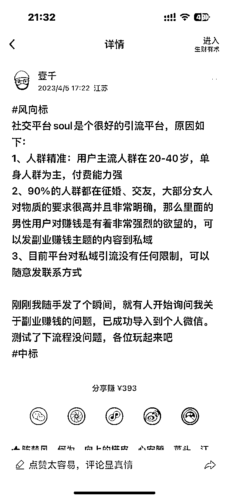

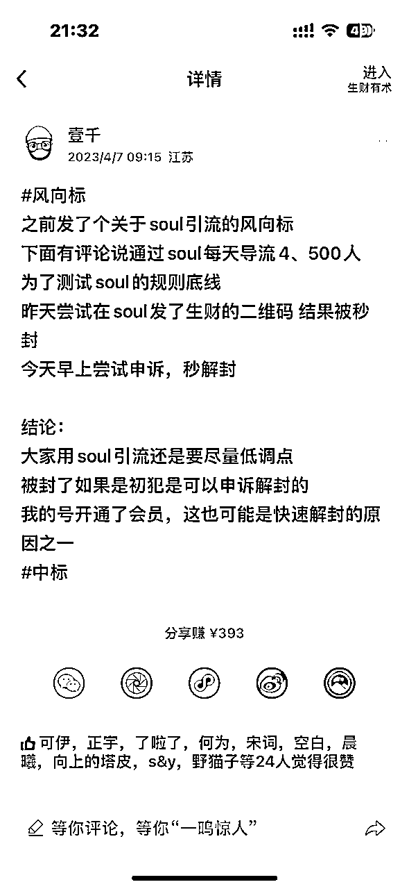

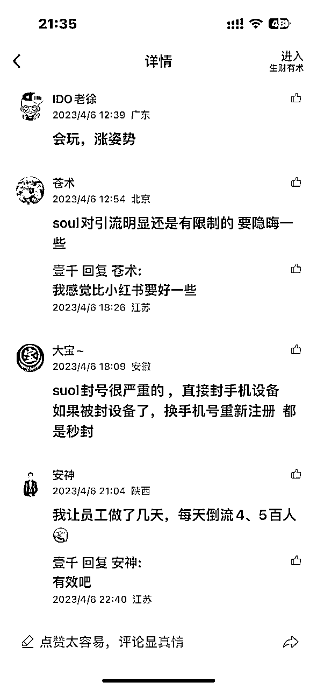

加入生财的第 3 天，我做好了我的副业计划

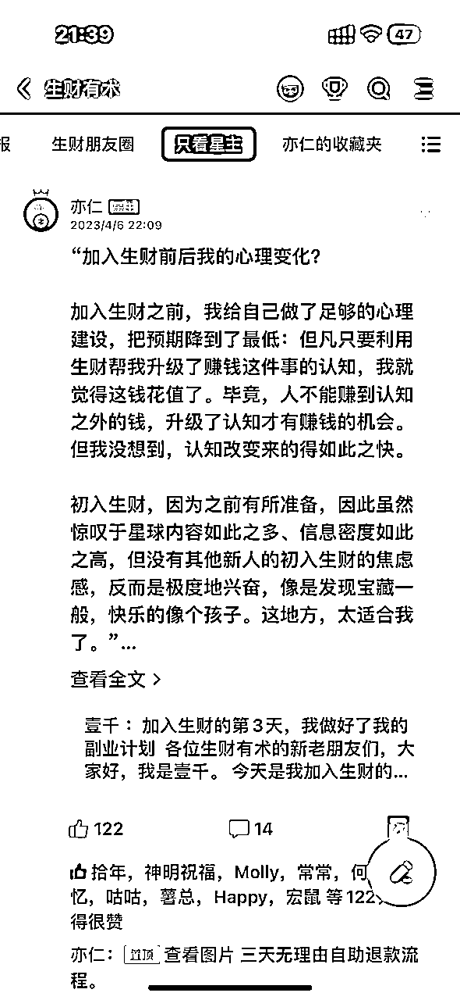

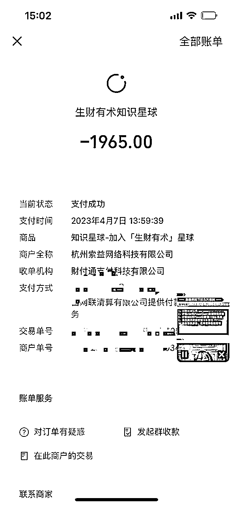

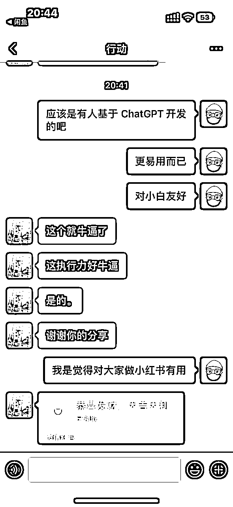

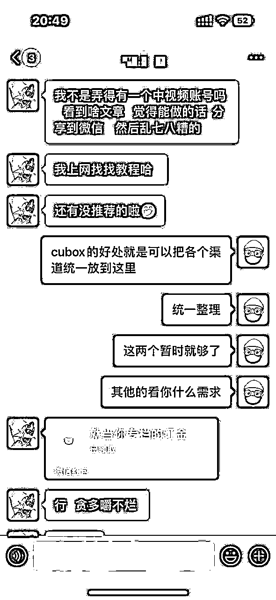

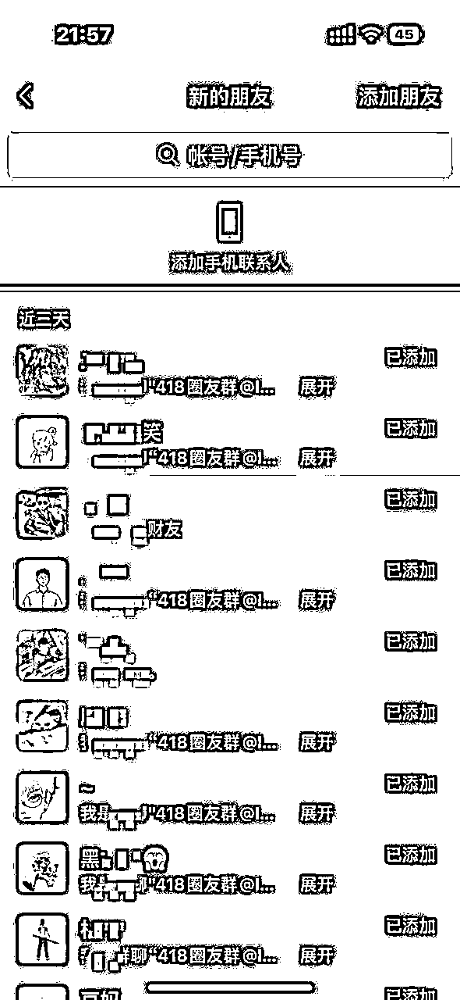

还记得在进入生财的第一天，在新人指南中刷到这样一段话：

经过这几天的实践以及收到的反馈，才真正理解了“利他就是利己”这句话的真正含义，在这里再次感谢我的生财领路人@IDO 老徐的鼓励与引导。

插播小建议：学到新知识，别忘了思考和分享。不要追求完美，也不要妄自菲薄，不完整的思考也是有价值的。重要的是马上行动、快速迭代，持续获得正反馈。

# 二、我的困惑与思考

加入生财的第一天，我其实是没有焦虑的，根据@IDO老徐给的建议，制定了初步的学习策略：

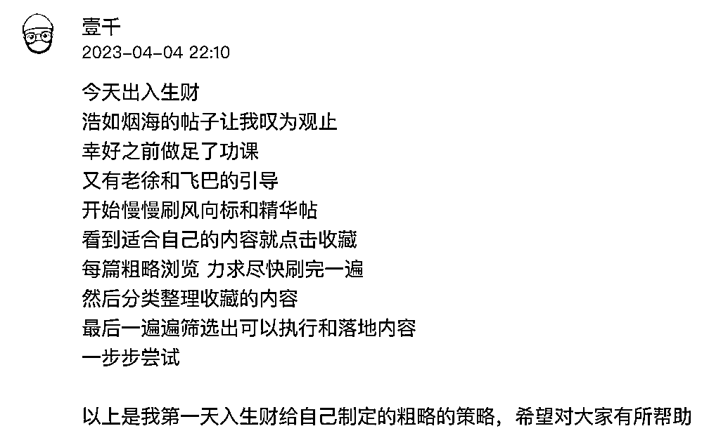

但实在是低估了生财精华贴的深度和数量，刷了几十条我便感觉不对劲，星球的优质内容太多了，每一篇精华贴都是前辈们的倾囊相授，内容全面、细致又深入。我这么没头没脑地刷帖，还是像只无头苍蝇一样。此时我突然想起了《生财有术｜第七期新人指南》，当即决定还是老老实实的看完新人指南再说！

新人指南确实贴心，把新手探索生财的过程分成四个阶段，每个阶段又有相应的推荐阅读，但是在阅读“推荐阅读”的过程中，我踩了个大坑：

推荐阅读里的每篇帖子都让我受益匪浅，但每篇精华帖的结尾又“附赠”了新的推荐阅读。那些标题十分具有诱惑力，想必内容一定非常有用。作为一个新手，我很难抵住诱惑不去点开。就这样，我被层层“套娃”，巨大的内容焦虑再次向我袭来。

插播小建议：在阅读新人指南的时候，先快速阅读一遍一级页面的内容，对生财有个大致的了解。读完后，再阅读第二遍，此时可以点开推荐阅读的帖子进行阅读，每篇推荐贴读完就收手，回到一级页面阅读其他推荐贴。

当我意识到自己被套娃，我强迫自己停下来，开始思考我应该如何使用生财。同时在@IDO 老徐的社群里，我观察到，不止我一个人有这样的感受：

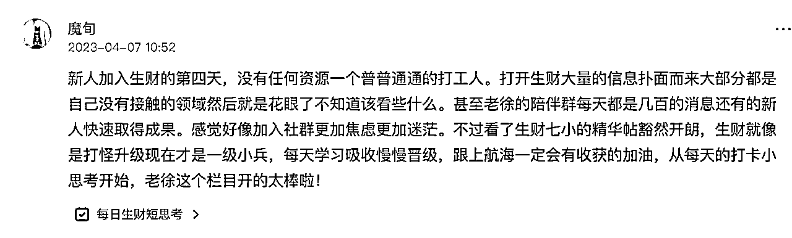

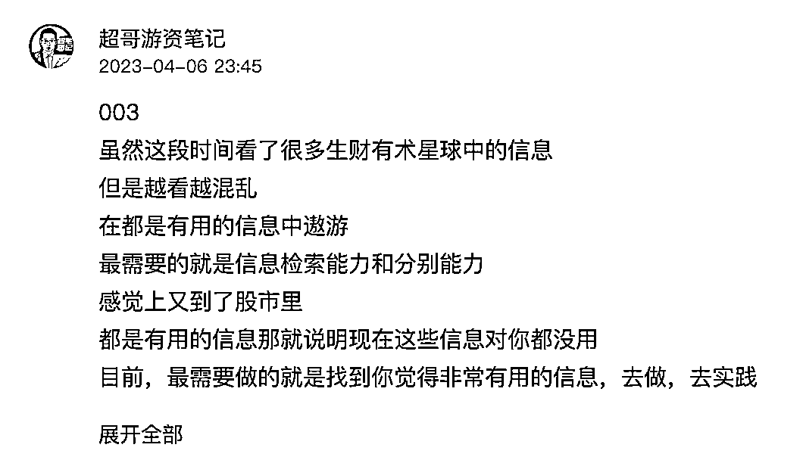

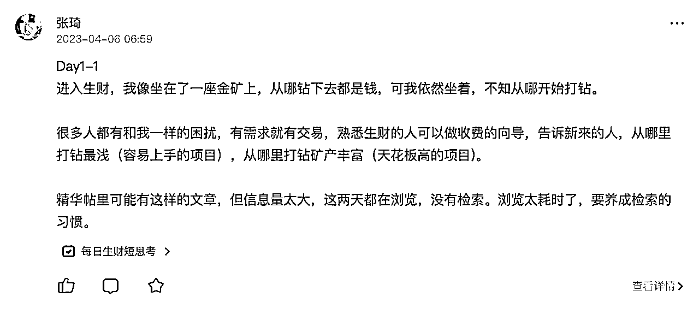

在我正迷茫的时候，无意中发现这篇帖子《想体验生财有术，可先看这 28 篇精华帖》，其中有几篇帖子对我的启发很大，可以说升级了我的认知，其中有些内容甚至是互相验证的：

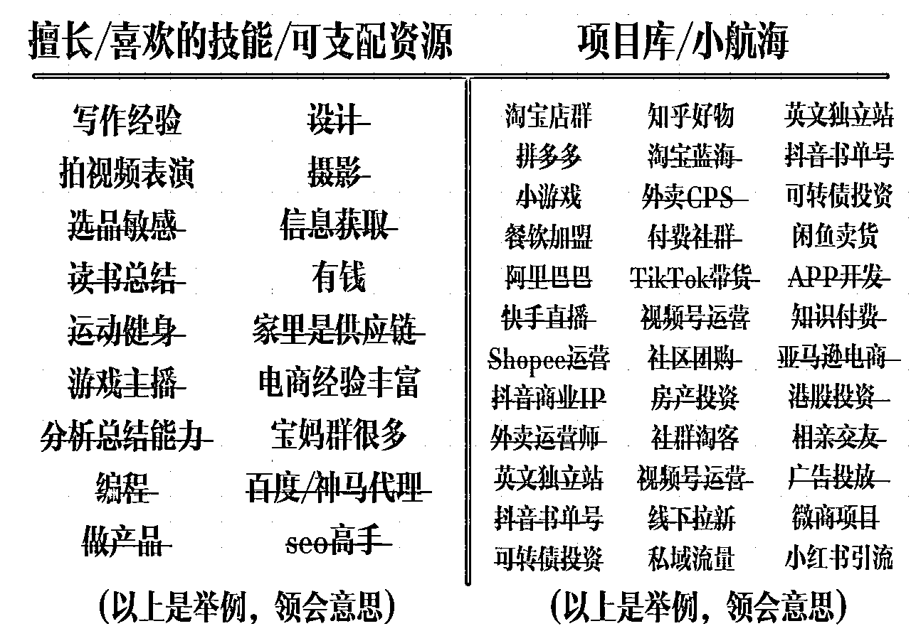

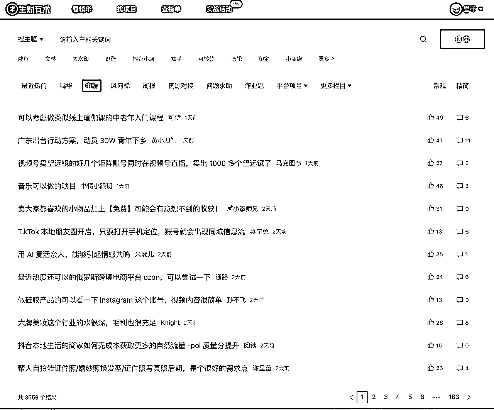

......

在生财短短几天，真的受益良多。阅读到精彩的文章，不禁拍案叫绝。在此感谢诸位前辈的无私分享。

插播小建议：像我一样的生财小白，可以考虑优先阅读能够帮助提升赚钱认知的帖子，为未来的搞钱之旅，打下坚实的基础，不至于迷失在茫茫的生财海洋之中。

# 三、新手期生财高效探索指南

进入生财第一件事，读完新手指南，。建议阅读不要过分深入，仅做大概了解即可，以免迷失在精华帖里徒生焦虑。

对生财小白来说，最重要的事，是先搞明白副业赚钱的底层道理，快速提升认知。这篇贴子对我帮助很大，也推荐你阅读，重点推荐阅读新手篇和人物篇。

对小白来说，与其迷失在精华帖里，不如先了解生财有哪些项目可以做。

在航海实战里，往期的实战活动已经为小白们分门别类整理好。可以通过阅读对应的航海手册，找到自己喜欢的、适合自己的项目，再按图索骥，使用 生财有术 精华贴索引工具 2.0 搜索与自己问题相关的精华帖，更加高效的探索生财宝库。

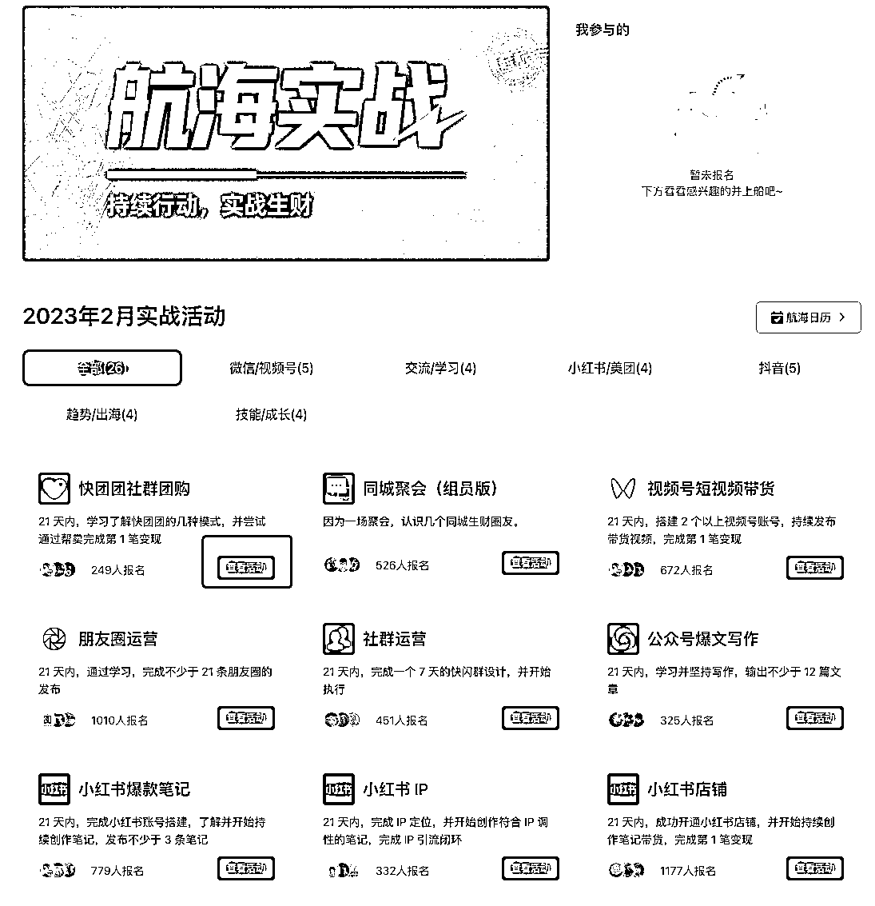

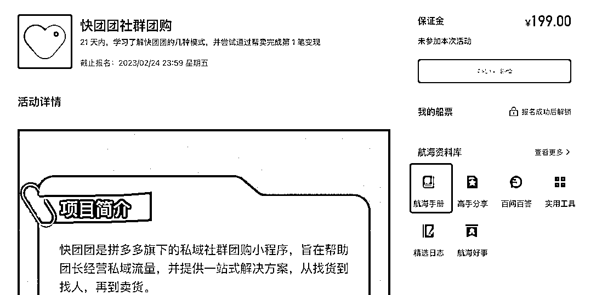

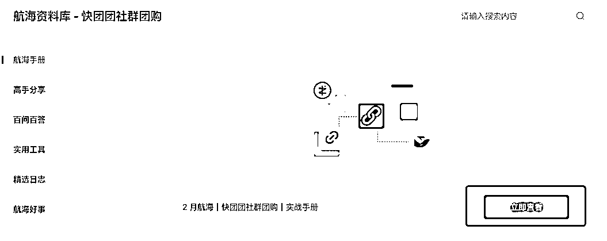

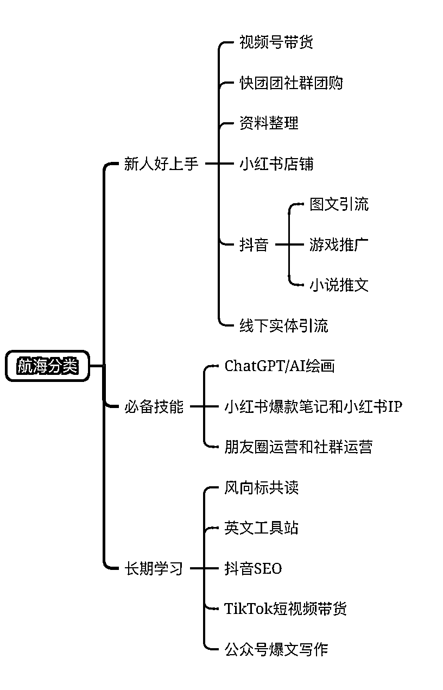

# 四、我的副业路径

# 五、我的学习工具分享

本人就职于一家餐饮连锁，负责公司的项目策划以及营销体系的搭建。因工作原因，常常需要学习新领域、新知识，在此过程中总结了一套自己的碎片知识学习和体系搭建的方法论，不敢藏拙，希望能对新人们有些许帮助。

这套方法论涉及到以下几个我常用的软件，大家可以先下载备用：

软件介绍

我的使用方法和技巧（以遨游生财举例）

我在刷生财精华贴的时候，一旦看到让我觉得共鸣的片段，便会记录下来。在记录的时候，我会简化作者的文字，尽量用自己的理解重新组织语言。这样一来，每一条笔记都可以作为内容平台的灵感来源（这里呼应上了亦仁的边学边分享的理念）。

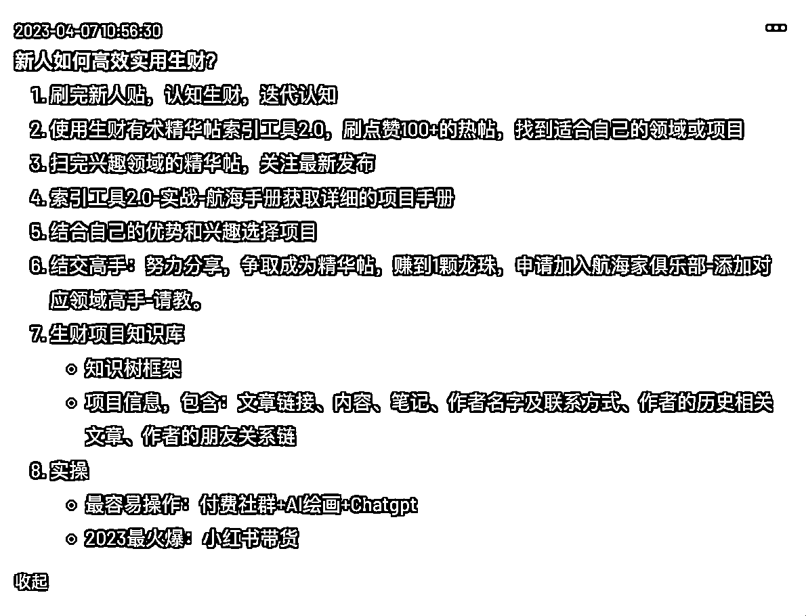

上述内容适合记录认知类的知识，当遇见高手分享的详细操作攻略怎么办？漏掉任何细节都可能拿不到预期的结果，这时候Cubox 就派上用场了。

我一般喜欢用 google 浏览器阅读精华贴，看到那些当下用不到但未来极有可能会用到的内容，我会用 Cubox 的浏览器插件一键收藏、并在特定时间集中二次阅读和拆解，阅读完分类保存，便于日后再次查阅（这里我还未走到分类那一步）。

当大家在生财找到自己的定位和项目方向之后，可以使用 Xmind 梳理这个定位或项目所需的技能和步骤，给自己列一个大纲。下图是我梳理的“品牌策划”框架的部分内容，形式可以作为参考。

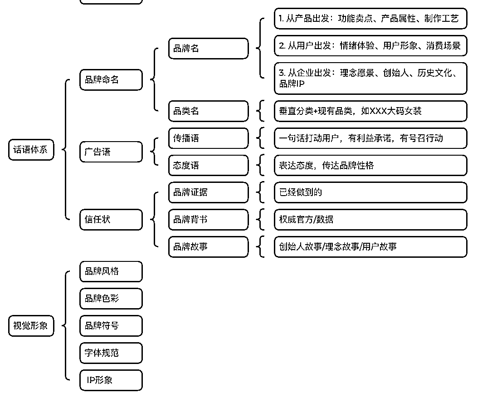

梳理完框架之后，我们需要把之前记录在 flomo 的碎片知识分门别类的填充进去，此时思维导图就不合适了。

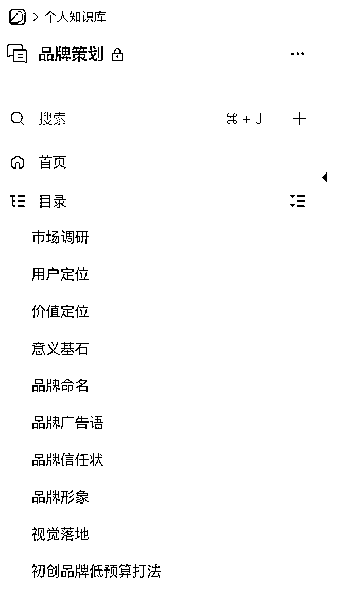

### 以上是我从一个生财新人的视角，输出的一些浅薄想法。

### 希望能够给和我一样迷茫的生财萌新们一些帮助和启发，欢迎交流～