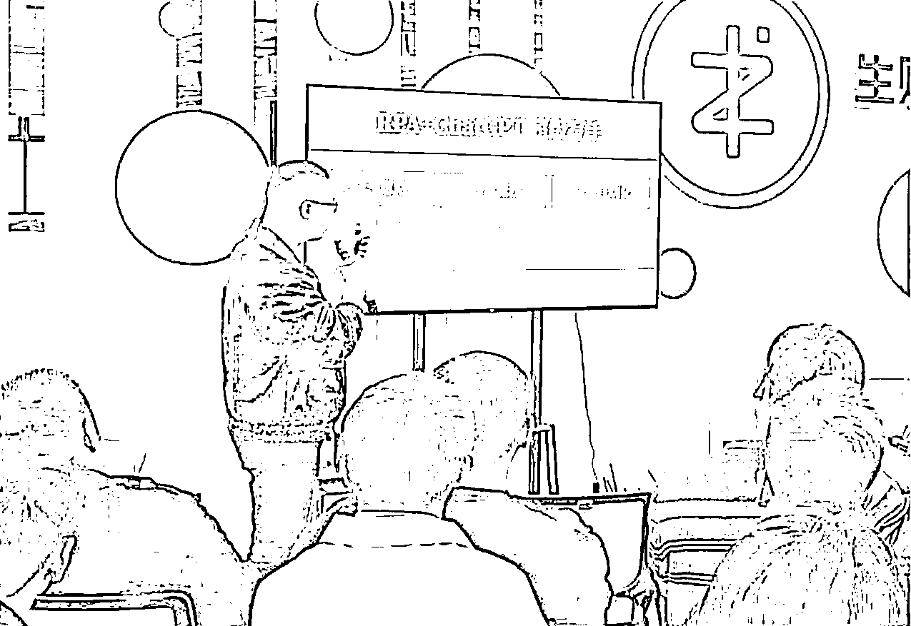
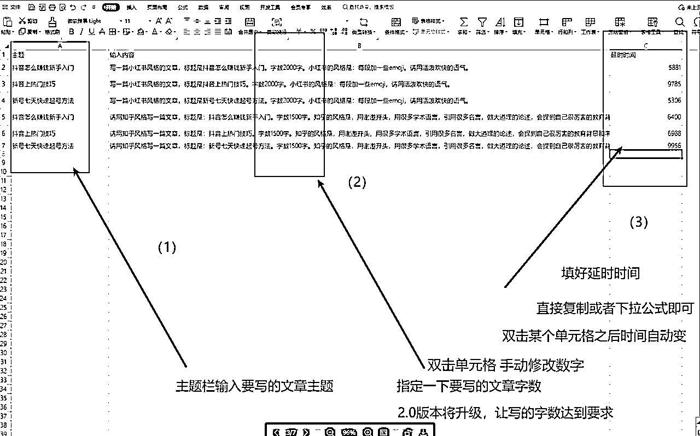
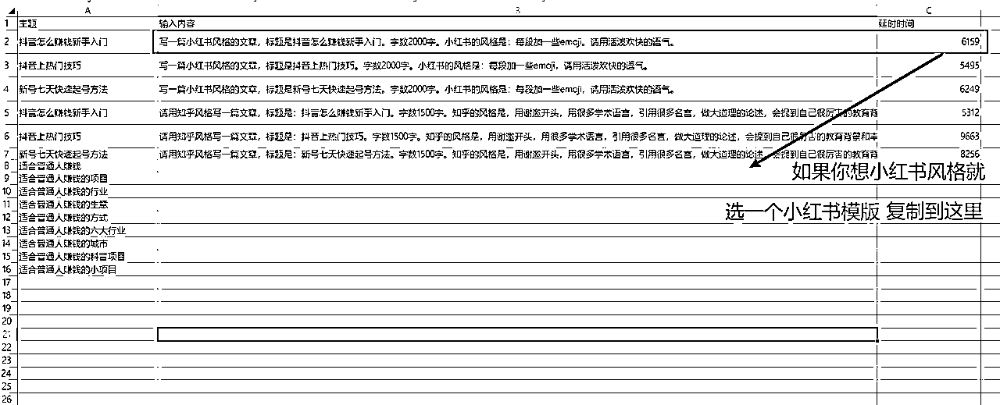
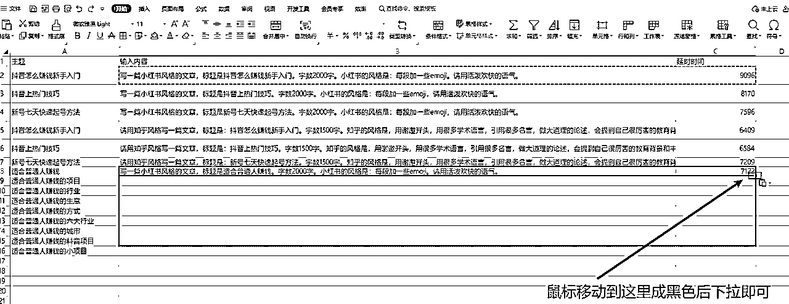
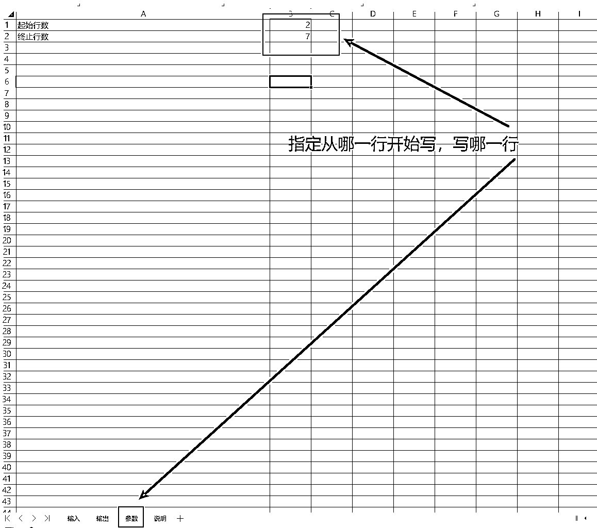
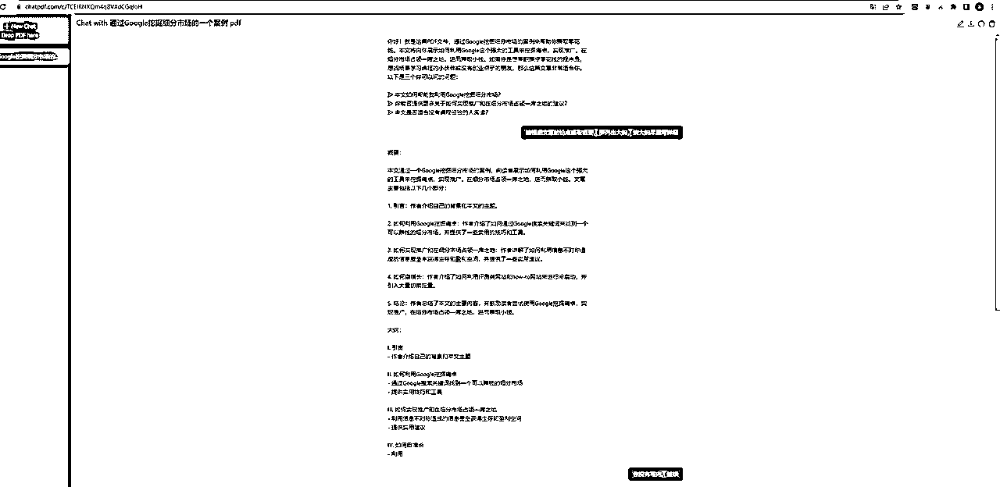
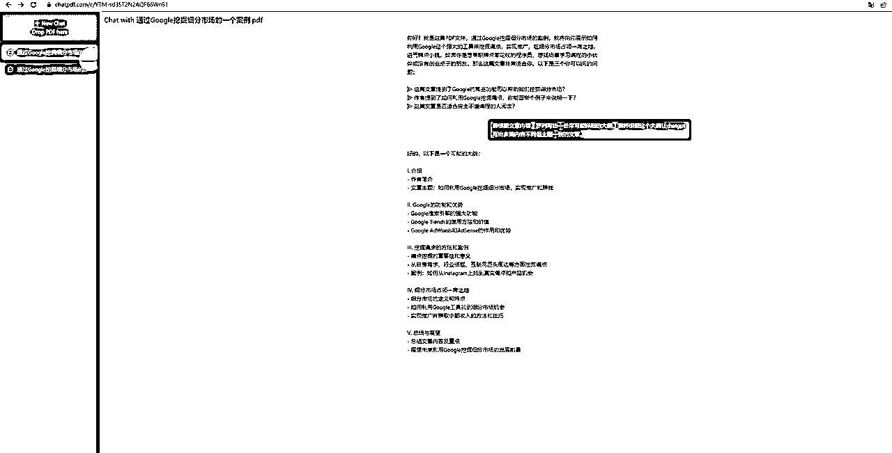
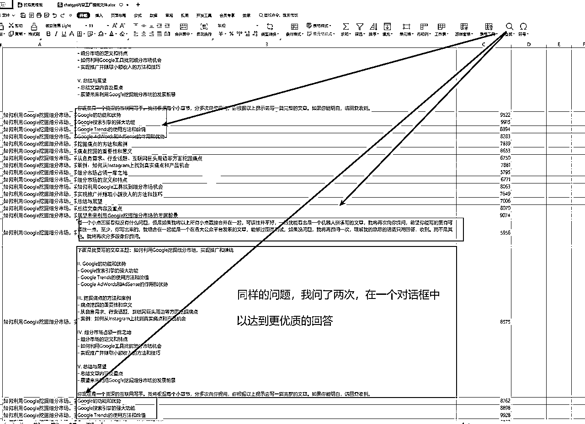
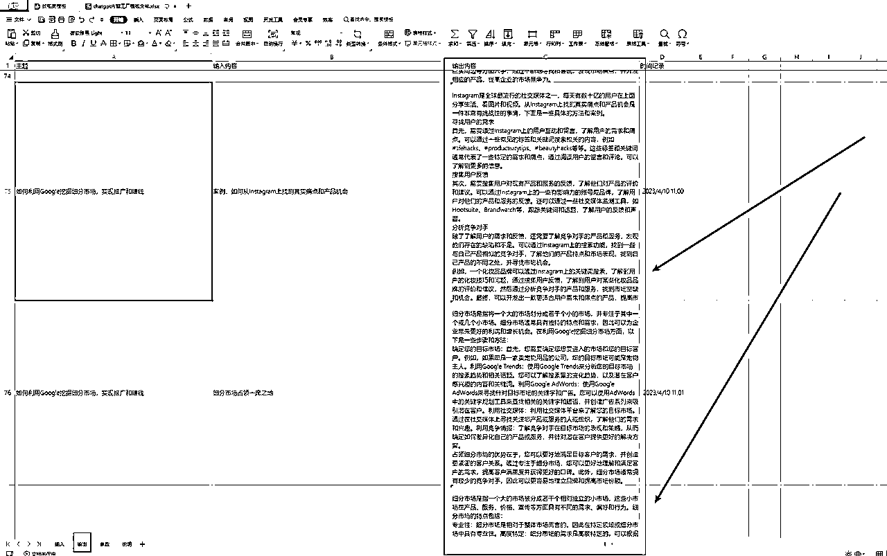

# chatgpt超级写手机器人1.0【生财有术-渣渣浩】

> 来源：[https://juejinniu.feishu.cn/docx/IOL6dRP5yo30bxx7aUKc25nWn5c](https://juejinniu.feishu.cn/docx/IOL6dRP5yo30bxx7aUKc25nWn5c)

市面上的第一个适合普通人的，全自动批量化内容生产工具，本文会给出源码，已获RPA帮阿愚呱呱授权，

生财圈友福利。

1.0版本的所有问题都可以向我提出，知无不言。

源码在生财帖子下方

https://t.zsxq.com/0cC5e4Pkn

直达链接如下：

chatgpt超级写手演示视频直达：

chatgpt超级写手机器人系统版本以及功能：

chatgpt超级写手1.0手把手教程：

运行你的第一个RPA机器人

# 一.开发背景：

## 【1】chatgpt常见的痛点

ChatGPT是一款功能强大的人工智能模型，它使用深度学习技术训练而成，可以用于许多不同的应用场景，包括内容创作领域。

在内容创作方面，ChatGPT可以用于以下几个方面的功能作用：

总之，ChatGPT在内容创作领域的功能作用非常广泛，可以大大提高内容创作的效率和质量，帮助用户更好地获取所需的信息。

这个功能像个水文一样，但是结尾会用到里面的内容，绝对牛叉！！！

后面的chatgpf正是基于这个获得大纲摘要，从而实现真正意义上的全自动化，而不是半自动化创作。

用chatgpt写作时常常遇到以下问题：

01.写了一段，没写完就停了

02.停了之后，你发继续写，上下文衔接不上来，甚至毫不相干

03.提问和和回答都需要手动复制粘贴

04.提问次数多了，整理提问回答很麻烦

05.提问回答无法自动保存

06.chatgpt的提问回答次数有限，不能太多，也不能太快，如果用多账号多浏览器解决问题，人工守着去处理停顿故障很费人力。

但如此好的人工智能模型，有一个巨大的痛点：很多很多使用它的操作，都非常依赖人的手动，只能辅助创作。

## 【2】chatgpt是人工智能领域的基础设施

蒸汽时代的蒸汽机、电气时代的发电机、信息时代的计算机和互联网，人工智能（AI）时代的chatgpt，看似人工智能很新潮，但实际上，早在1956年就被第一次提出人工智能这一专业术语了。

很多家企业，很久以前就进行了很多年的人工智能研究开发工作，

他们有强大的研发团队和财力物力，人工智能是真正意义上的，并不需要太多的手动操作。

chatgpt作为第一款面向普通用户的人工智能模型，却离不开大量重复且机械化的手动操作，

对于 大企业来说，根本不是问题，他们有自己的程序员，有自己的开发团队，自动化非常容易实现。

chatgpt是人工智能领域的一个基础设施，就像一块砖，一堆沙，一包水泥，

只有将chatgpt和其他的工具产品组合在一起才能成为一个真正上的人工智能自动化利器。

但是对于我们才接触1，2个月的普通人来说，并没有程序员团队，也没有开发预算，

怎么让这个chatgpt显得像个智能化的产品，而不是一个蹩脚的小可爱（傻X）显得尤为重要，且急迫。

## 【3】RPA+chatgpt实现创作的全自动真批量

市面上的有很多chatgpt宣传文案，chatgpt批量制作500篇小红书文案，批量制作1000篇抖音文案，

但是他们的方法，不谈别的，就让你手动复制500个问题，粘贴500个回答就够呛了。

他们绝不敢用全自动批量这个词。

## 【4】chatgpt超级写手机器人系统版本迭代升级

# 二.手把手教你配置你的第一个RPA机器人

由于chatgpt超级写手是基于RPA这个低代码工具开发的，

所以，有必要先带大家花几分钟学会配置和使用RPA机器人。

## [1].uibot软件安装

## [2].使用你的第一个RPA机器人（批量联系微信好友）

# 三.Chatgpt超级写手机器人1.0使用教程：

## 【1】源码

https://t.zsxq.com/0cC5e4Pkn

## 【2】复制粘贴，完全不需要用户懂编程，懂代码

1.复制机器人压缩包到常用位置解压

2.用uibot打开机器人文件夹

3.用listary打开chatgpt内容工厂模版文件

4.根据自己的需要写入

RPA机器人的使用都超级简单，

就是复制粘贴，完全不需要用户懂编程，懂代码

如果怎么用机器人压缩包不清楚，

请仔细看上面的教程：

chatgpt超级写手1.0版本的功能

文章自动生成

自动续写，无需等待

续写回答时，自动分段保存，方便拼接修改逻辑不对的上下文回答

写作完成后自动保存提问和回答到excel表格

虽然比3.0版本差点，但是也足够强大。

就不写这个机器人多牛逼了吧，因为写再多，旁人看了无非就一个目的。

在RPA帮的定价体系上来看，50个机器人500不到，这玩意，就10块。

也没有太多需要强调的。

## 【3】机器人运行视频

【3】

# 四.chatgpt超级写手1.0实战案例

我们以”如何利用Google挖掘细分市场，实现推广和赚钱“这篇文章为例，让chatgpt根据这个文章重写一遍。

## 第一步：利用chatpdf提炼出大纲

www.chatpdf.com

## 第二步：将大纲复制到chatgpt超级写手模板表格

由于刚好卡在饭点，要干饭了，就没去再跑一遍看chatgpt调优后的效果了，这个展示只是模板，大家使用根据实际需要来。

## 第三步：提问全部回答完后，整理每段的答案

注意了，有的朋友喜欢直接生成一篇完整的文章，而不是这样拼接，但是这样并不一定好，

因为chatgpt有时候会出现上下文不一致，对不上逻辑的情况，如果全合在一起，你改的话都不知道从何开始。

## 演示视频

# 四.结束语

用了chatgpt超级写手机器人之后，自己的chatgpt终于不像一个小可爱（傻X）了，也不再只是一个需要你调教的电子宠物。

本文分享的是1.0版，1.0版本对于99%的创作者已经够用了，据开发者生财圈友阿愚呱呱透露， 还计划开发另外几个版本，后面几个版本对于大点的团队可能有帮助，小个体有没有用确定性不大。有兴趣的可以了解下。

chatgpt超级写手机器人在RPA帮的定价让人看不懂，按照RPA帮阿愚呱呱的计划，每年上架50个类似的机器人，只进知识星球的话，平均一个机器人不到10块。如果为了这个机器人买盗版课，超过10块，需要慎重考虑。

缺点就是10块钱的机器人可能没有答疑服务（生财圈友，这个chatgpt超级写手机器人1.0版免费且送答疑），

不过好在RPA帮知识星球送了入门训练营，基本上独立完成个人需求的微改动问题不大。只是一卡通会员可以免费定制各种通用场景的需求，以及终身的RPA答疑服务，不会解散的微信群，社群不用续费，无限续杯。对动手能力强的，B站粉丝，其实性价比一般，无法就是多花点时间，重复造轮子，踩坑。刚毕业的新人，或者没有项目，也不缺时间。