# 如何利用数据分析进行小红书电商选品？

> 来源：[https://rlp3cigezs.feishu.cn/docx/IwUDdGvHhojaL2xwtUzc6YyZnHh](https://rlp3cigezs.feishu.cn/docx/IwUDdGvHhojaL2xwtUzc6YyZnHh)

大家好，我是沐风，最近应该有很多同学在尝试做小红书电商项目，对于大多数自身没有货源，而且是刚开始接触电商的同学来讲，可能一开始都会面临一个问题：面临这么多行业类目和品类，到底该如何进行选择呢？

这个时候，稍微有点经验的同学可能都会想到借助一些类似蝉小红、新红这样的小红书三方数据平台来辅助自己选品，而不是全凭自己的感觉，毕竟感觉可能会有偏差，但是数据不会骗人。不过，获取数据只是第一步，更重要的是，我们该如何对这些数据进行分析，并利用它们来辅助我们选择行业类目和品类呢？这里，我就给大家分享一下我的一些思路和探索。

首先，我们可以先从大的行业类目着手去分析，基于数据分析的结果选定完行业类目之后，再用类似的思路去分析出对我们来说相对比较有价值的品类。

# 行业类目

做电商时，我们经常会听到一句话叫：选品定生死，这其实是因为任何商业活动本质上都离不开产品-流量-转化-交付这四个环节，其中产品是后面三个环节的基础。而产品的背后则是需求，我们可以说，所有的产品本质上都是某类需求的解决方案。因此，在选择行业大类和细分类目的时候，我们首先要考虑的是：

## 需求度

小红书本身是一个以图文为主的内容平台，电商性质的内容当然也属于其中的一部分，因此，我们首先需要关注的是用户对于某个行业内容的需求度，这里我就以蝉小红为例，来给大家演示一下我在分析用户对于不同行业类目内容需求度的思路：

首先，我们可以打开蝉小红官网，然后点击工具，找到行业流量大盘，如下图所示：

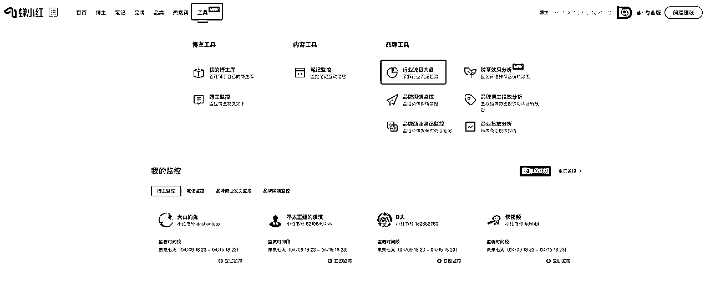

此时，我们就可以看到某个行业类目的一些数据，例如：

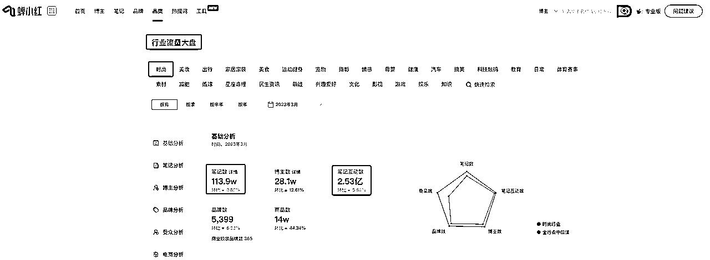

这里我们重点关注笔记互动数和笔记数这两个值的比例，也就是：

笔记互动数/笔记数

这个比例越大，则说明用户对这类笔记的参与度越高，也就侧面反映了用户对这类笔记的需求度越高，当然，这里我们不能只关注两者的比例，同时还要关注其绝对数量。

通过这种方式，我们就可以分析出用户对于每一个行业的内容需求度，但是蝉小红并不支持导出相关的数据，所以，我利用 RPA 搭建了一个自动化流程，来批量的抓取出这些数据，并自动计算出笔记互动数和笔记数之间的比例，之后再利用 RPA 把这些数据导入到 Excel 表格中，并根据【笔记互动数/笔记数】这个比值对这些数据进行排序。

以下是我开发好的 RPA 应用，这里我只需要选择一下我们要分析的行业流量类型，Excel保存的文件夹路径以及数据统计方式就可以了，之后点击确定，它就会自动帮我们把分析好的数据整理到 Excel 中，效果如下：

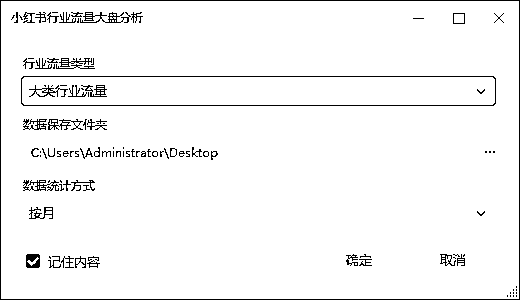

这样我们就可以获取到的如下数据：

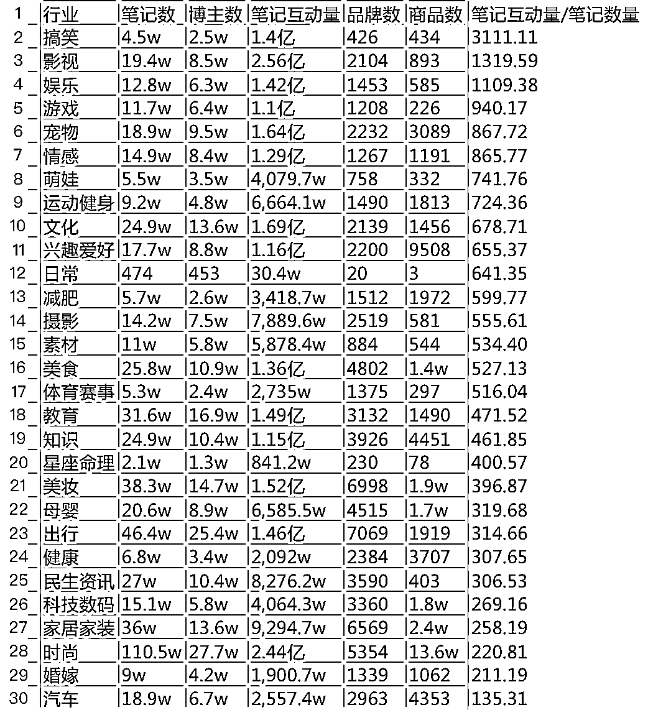

这样我们就通过横向对比，得出用户对不同行业的内容需求度，但是，仅凭这一个指标并不足以支持我们选择行业类目，例如，排名第一的是搞笑类目，即便不通过数据分析，我们也能直观的感受到，在这个类目下，我们可能很难进行电商带货，也就是说，虽然这个类目的内容需求量很大，但如果我们很难进行电商带货的话，那对于我们来说，价值也不是特别大。

因此，在供需关系的基础之上，我们需要考虑一下第二个因素：

## 电商价值

针对电商价值这个指标，我们需要重点关注的是：

因为带货笔记占比和商品数越多，就意味着这个行业中可以商业化的产品就越多。

注：通过这种方式统计到的数据仅针对可以直接通过小红书店铺带货的行业类目和品类，不包含通过小红书引流至私域再二次转化的产品。

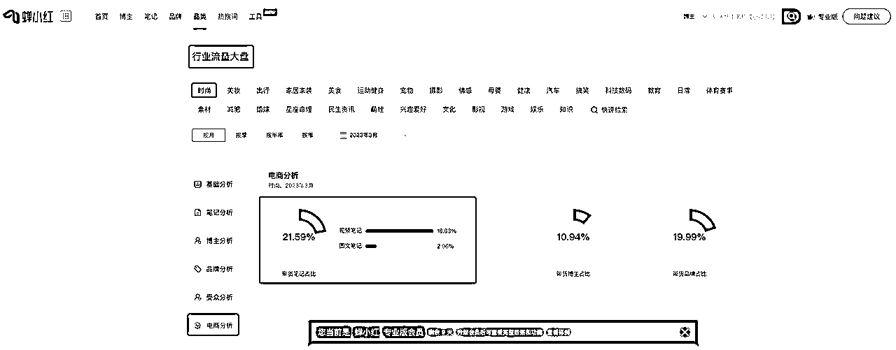

同样地，我们还是借助 RPA 来抓取并分析相关数据，之后再基于带货笔记的占比进行排序，最终得到如下结果：

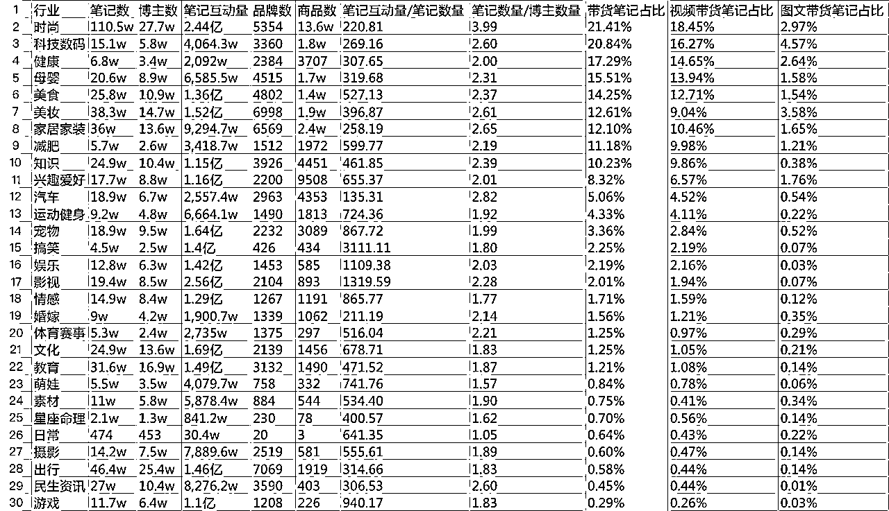

这样，我们就可以得到不同行业的电商价值，当然，我们也不能仅仅依赖带货笔记占比这个指标，虽然带货笔记占比和商品数高虽然可以说明这个行业中可以商业化的产品比较多，但同时也说明这个行业竞争比较激烈，因此，我们需要关注第三个指标：

## 竞争度

针对竞争度这个指标，我们需要重点关注的是：

行业笔记占比

也就是说，一个行业的笔记在所有行业笔记中的占比越高，就说明该行业竞争度也越高，因为这意味着我们的笔记要从更多的笔记中脱颖而出才能获取更高的流量（这里仅指推荐流量），从这个角度来讲，我们可以考虑选择那些竞争度相对较低的行业。

同样地，我们这里还是利用 RPA 自动计算出每个行业的笔记占比，并将结果导入到数据 Excel 表格中，之后，在根据行业比笔记占比对所有数据进行排序，从而得到以下结果：

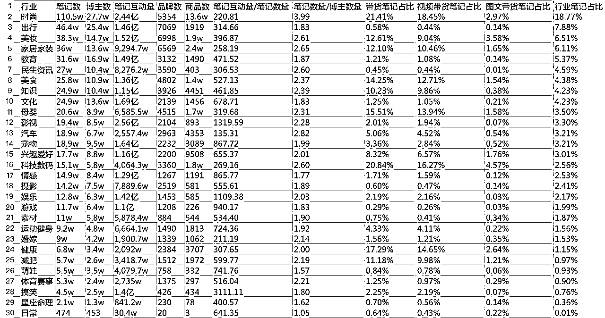

这样，我们就得到了不同行业的竞争度。

## 综合评分

那么，现在有了以上三个参考指标之后，我们就可以基于这三个指标的排名来对一个行业进行综合评分，具体评分规则如下：

由于这里一共 29 个行业，由于我们是从电商带货的角度去做数据分析，因此，电商价值得分的权重系数我设置为了 2，需求度（需求侧）和竞争度（供给侧）的权重系数我设置为了 1，最终的综合评分规则如下：

综合得分 = (30 - 需求度排名) + (30 - 电商价值排名)*2 + 竞争度排名

另外，我在计算某个行业综合得分的时候，对于那些商品数低于1000或者带货笔记占比小于1%的行业类目，我直接将其综合得分为 0 了，这里我主要考虑的是要确保行业类目本身具备比较大的电商价值，否则对于电商带货来讲，意义不是特别大。最终，应用运行结束之后，我们会得到如下结果：

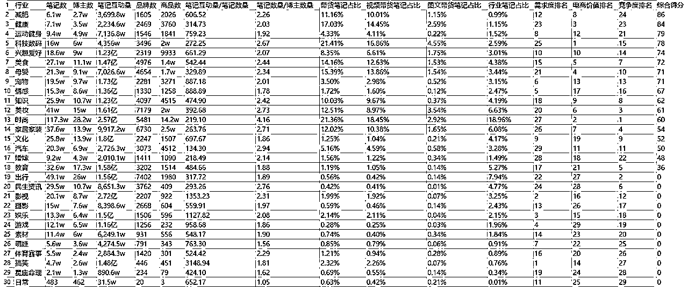

这样，我们就可以利用一个行业的综合得分来辅助我们选择行业类目了。同时，除了大类行业流量之外，我们还可以使用同样地方式去分析每一个行业细分类目：

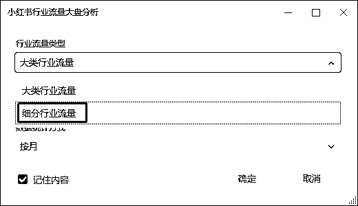

最终我们会得到如下数据，以下是部分数据的截图：

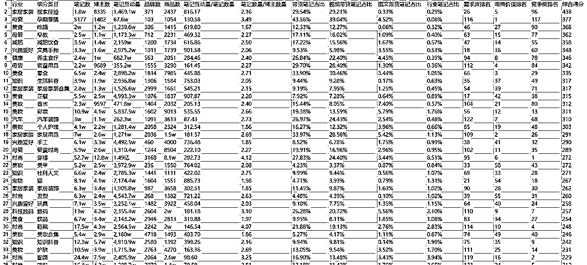

有了这些数据之后，接下来我们就可以利用这些数据来辅助我们选择行业类目了。不过，这里我想提醒大家的是：

# 品类

确定完行业类目之后，接下来，我们可以利用同样地思路去分析该行业类目下的品类，此时，我们可以打开蝉小红，然后点击进入【品类】-【品类库】，如下图所示：

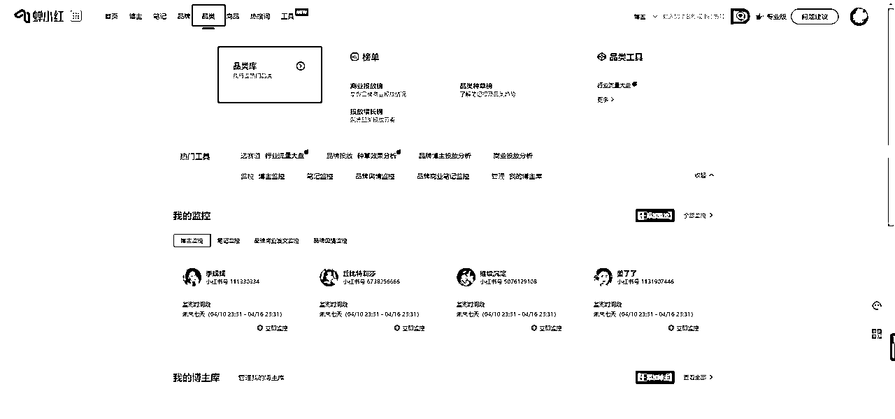

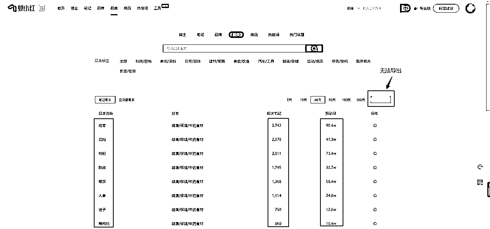

这里我们会看到，蝉小红会将每一个品类的相关笔记数和互动量展示给我们，所以，我们这里重点关注：

互动量/相关笔记数量

这个比值越高，就侧面反应出用户对这个品类的需求度越高。因此，我们可以先把所有的数据导出来，然后计算一下不同品类的互动量/相关笔记数量，这样就能够对所有所有品类的需求度做一个横向对比，进而筛选出一些供需不平衡的品类。

下面是我开发好的 RPA 应用，运行效果如下：

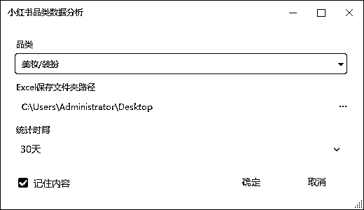

这里我们只需要选择一下我们要分析的品类，Excel保存的文件夹路径以及统计时间就可以了，之后点击确定，它就会自动帮我们把分析好的数据整理到 Excel 中，以下是部分数据截图：

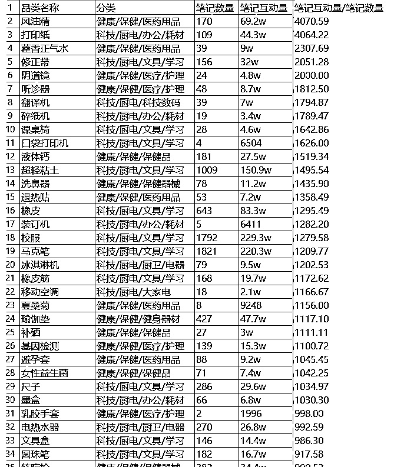

这样，我们就可以通过笔记互动量/笔记数量、笔记互动量绝对数量以及笔记的绝对数量来筛选出一些电商价值比较高的品类，之后可以再结合小红书的搜索，大概看一下这个品类在小红书中笔记的质量和商品的销量，最终决定是否选择这个品类。

# 总结

最后，我想提醒大家的是：数据分析只能辅助我们进行决策，我们在选品的时候还要结合我们自身已有资源、个人优势以及主观意愿来综合考虑。

好的，以上就是我利用数据分析进行选品的一些简单思考和探索，如有纰漏，欢迎大家批评指正，同时，如果大家有更多的想法或者对RPA感兴趣的话，也欢迎跟我一起多多交流。