# 抖音直播卖盲盒，单日利润800，合规生意

> 来源：[https://rmfax7bkq9.feishu.cn/docx/JVmzdNfAMo8oe9xaW55cnHTun3c](https://rmfax7bkq9.feishu.cn/docx/JVmzdNfAMo8oe9xaW55cnHTun3c)

大家好，我是大威，大学在读第6年，目前大三

最近跑通了一个项目，抖音直播间卖泡泡玛特的盲盒，一晚上播个2-4个小时，单日利润800-3200之间不等。

来钱确实来钱，直播也确实辛苦，有一定的门槛，至少你要懂一点盲盒市场。

这文章给大家分享下生意逻辑，以及：我怎么发现这个生意的。

# 1、怎么赚钱——利润从哪来？

一切的利润都来自于「低买高卖」

泡泡玛特单个盲盒官方售价69元，长这样：

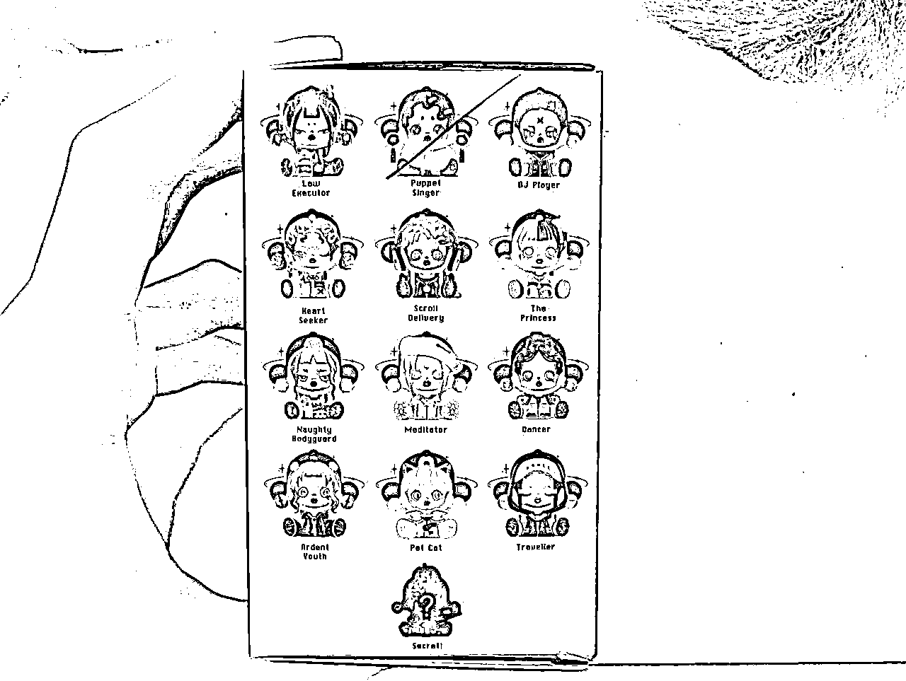

买盲盒的人基本都奔着「隐藏款」去

基础款和隐藏款的生产比例是144：1，每144个基础款里才会投放一个隐藏款

而且在现有的官方购买途径概没有保底，买几百个盲盒不中隐藏也是很常见的事，这种低概率的盲盒

，官方售价69元。

官方渠道的低概率，给了我们发挥空间。

我们找到了特殊渠道，正品，确保一端（12个）必出一个隐藏款，价格略贵，成本大概100元一个。

拿到抖音直播间卖139，或者169。

说穿了就是这么回事

特殊渠道，是我们「低买」的来源

中奖率更高，承诺隐藏款，是我们「高卖」的理由

可以理解为这是一个信息差的生意，如果我直播间的小弟弟小妹妹都知道了这个「特殊渠道」的话，那我直播间就玩不下去了。

因为确保12出1，价格贵一点也还是会有很多小弟弟小妹妹过来购买，这帮人「瘾」实在太大了

而且对我们有信任感，我承诺12必出1啊，现场买，现场开，真的会出隐藏，大家现场见证。

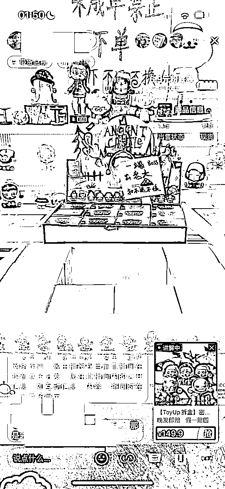

进货100，卖169，单个利润69，一端12个的利润在800左右

普通一点的节奏，一晚上努努力可以出2端，也就是利润1600

拼一点，播久一点，我们做多一晚上出了4端，利润超过3000+

如果自己购买隐藏款，还能进一步提升利润空间（我们可以知道哪一个是隐藏）

一般不这么做就是了，诚信经营，不作假。

这是我的后台截图

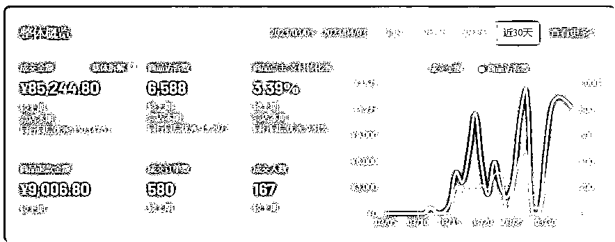

这是我直播12天的GMV，我是从3月19号正式开播的，目前到手的利润有2万多一些。

（含摸索期，模式没完全建立的时候单量少。）

另外，看过盲盒直播的朋友们都知道，这类直播间一般3~40人在线就可以快速开车了

而我做的直播间可以算整个行业里面流量最好、粉丝粘性最强的，自信ho。

补充一个概念：端

这个样子的大盒子，12个，端起来的，行话叫做「一端」

泡泡玛特官方的渠道也可以买端娃，保证12个每个形象不重复

但是隐藏的概率还是144：1

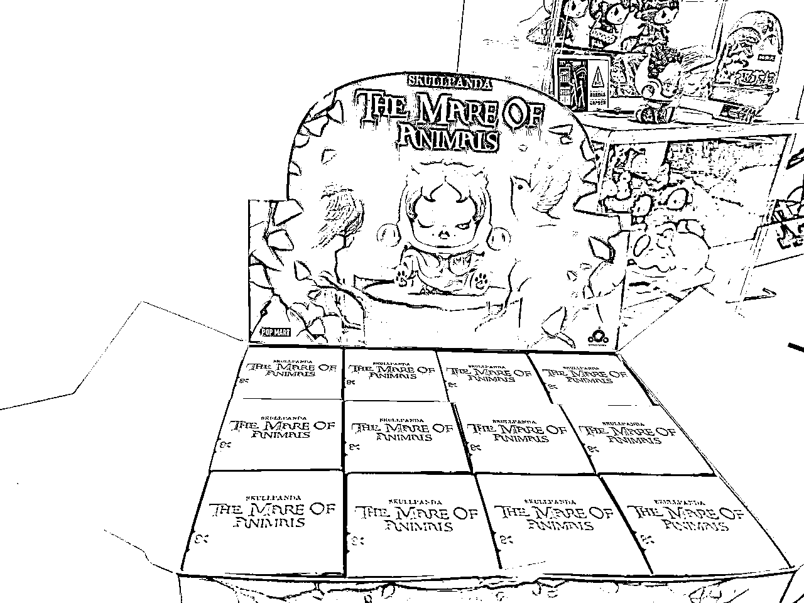

我们说直播卖盲盒，一般都说，昨晚你卖了几端

1端算入门

3端很不错

5端很牛逼

大家可以白天在抖音搜索一下：盲盒直播 这个关键词，看看做到100以上场观的有多稀少。

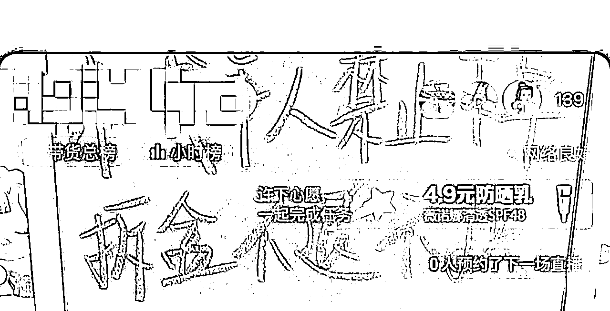

接下来给大家说下操作的细节。

# 2、具体怎么操作

介绍完了整个赚钱的逻辑，我们再来分享一下具体操作方法：

## 1）开店准备

### 化身商家号入驻抖店

这些带蓝色V的就是企业认证账户

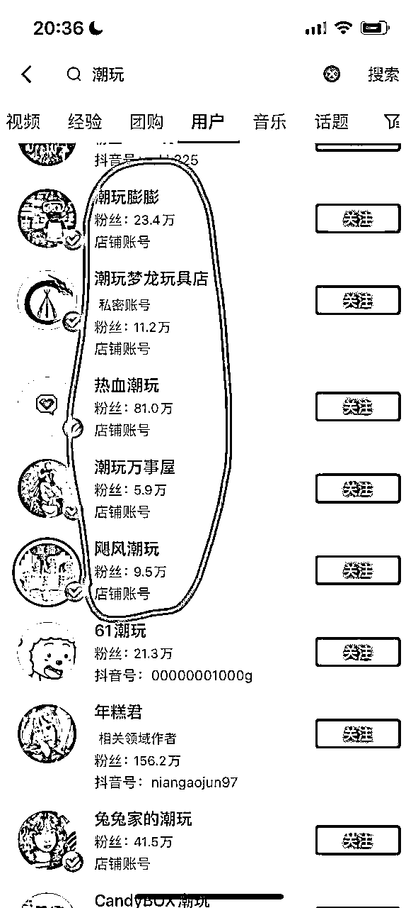

这部分我们主要是保证直播间有出售盲盒手办的销售资格，以及可以挂车卖盲盒。

首先我们需要准备一个与品类相关的营业执照，以通过抖店的商家资质审核

我的这张玩具店执照是淘宝代办的，49块钱搞定～

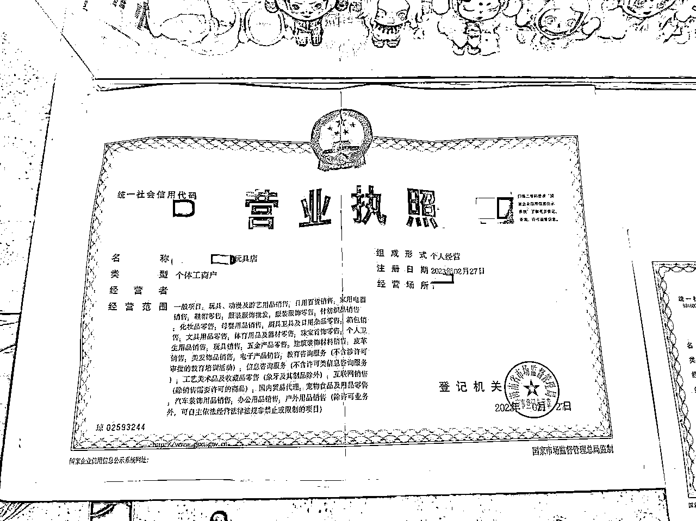

搞定执照以后成功入驻抖店，账号此时已经变成了蓝v商家号了，我们可以直接在抖店的后台开始设置直播时用来购买的SKU卡片

那句经典的：3、2、1上链接

链接就是SKU卡片，在商家后台设置的

这里不展开教学了

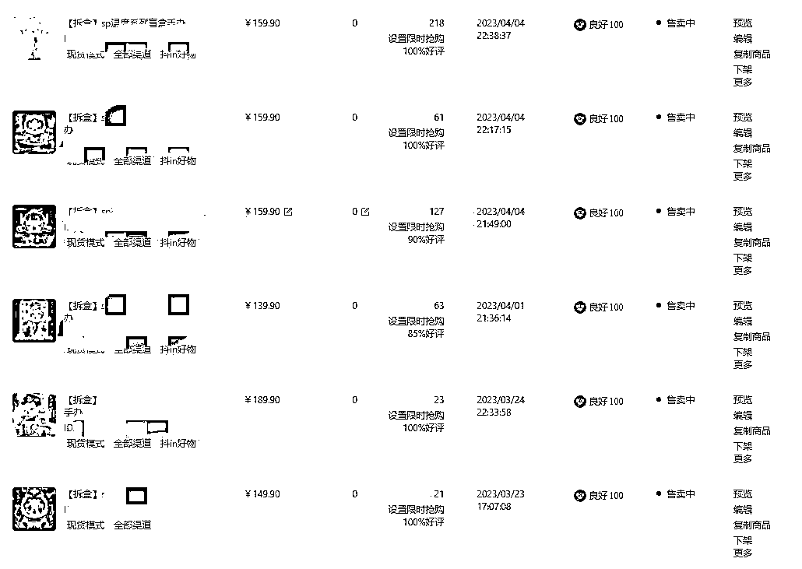

常年看生财有术的帖子，也做过不少项目，早就有了制作知乎、小红书、哔哩哔哩、甚至虎扑等各平台好物卡片的经验，这部分对我来说没有什么难度，很快就搞定了。

### 贴单工具

搞定了以上，我们还需要一个：当直播间有人下单时，自动打印收件人以及对应盒号的工具

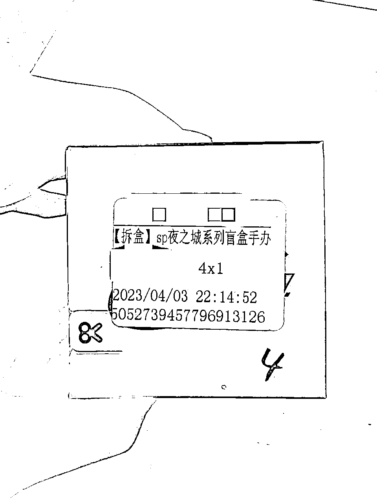

（可以看到这位朋友拍的是4号盲盒）

贴标签这个动作非常重要，贴了标签，玩家就会一直蹲在直播间，他不会离开，他要守着等开奖啊。

贴标签还可以保证真实性，有目共睹，不做手脚，给犹豫的人群增强信任感。

而且而且，在开奖的那一瞬间，会刺激其他人跟风购买，交付和拉新就同时完成了。

单下好，标一贴，那么这个盲盒就是你的了，只要贴上你的标，未经本人允许，都不能摇盒、拆盒。

这是所有盲盒界直播的规矩。

同样的，也方便你在发货的时候进行核对。

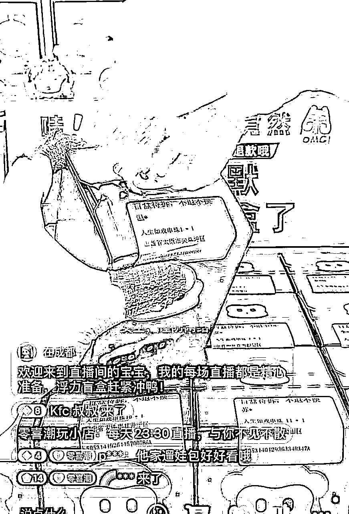

所以，在这之前，我们需要准备一个打单机

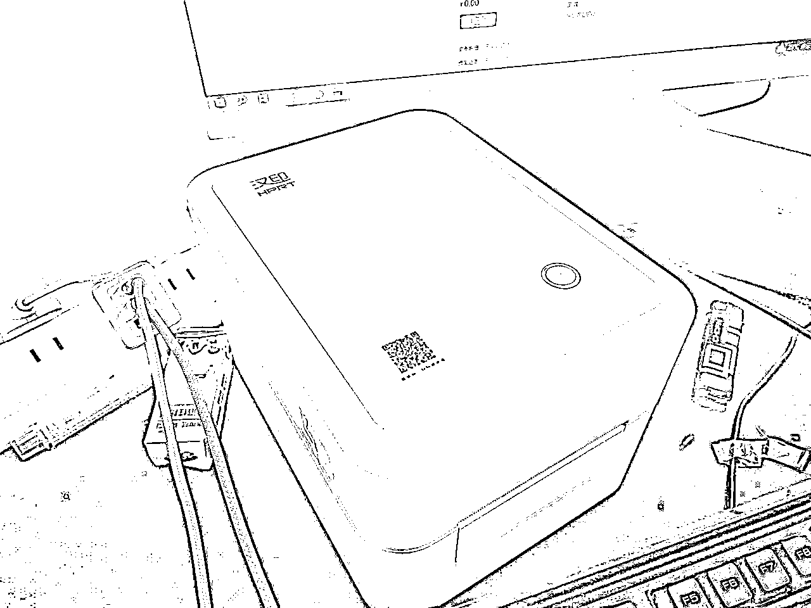

以及批量打印的软件

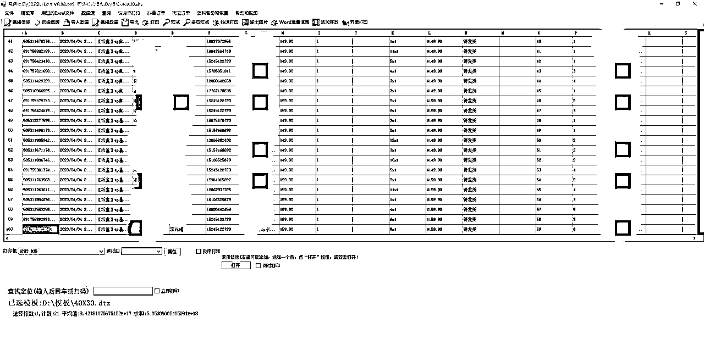

对盲盒足够了解，手上有货，有账号，接下来就可以愉快的开播了

记得要买一些质量比较好的快递纸箱，用于后续的发货哦。

## 2）运营

基础设施搭建好之后，其实就可以开播了

很多朋友可能会担心，流量从哪来呢

直播间这东西比较个性化，同极相吸，每个主播都会遇到一群习惯你节奏

能接受你处事方法的粉丝，只要不作恶，每个人后面都会发展出自己独有的一套运营习惯。

分享一下我的做法：

### 流量方面

结果=内容+付费推广+后期维护

对于我来说，我会用电商思维去对待任何一个我新接触到的平台。

我本身有100万的爆款作品的bilibili账号，有月2w利润的知乎好物账号（这部分末尾再介绍）

在我运营这些其他平台的账号时，我发现自然流量的占有率越来越少，甚至连自然爆款率都在逐渐降低。

雕琢内容、人设在前期都是没有用的，付费流量当道的时期，不该省的钱就不要省了

进入一个新平台你要做的第一件事就是：

花钱，找地方花钱

做知乎好物的朋友都应该知道，我们账号现在最花钱的地方在哪里，是知+

每个平台的官方流量推广工具都很成熟了，不但有知+、还有起飞、花火、蒲公英，而抖音直播呢，也有他的付费流量入口，叫巨量千川

这里是我在千川这个流量推广工具上的花费情况

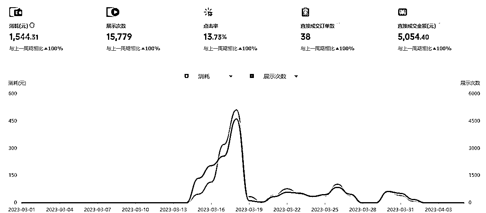

大家可以看到，我开推广的时间并不多，整体消耗费用也低

只有在3月13日到19日的起量阶段设定的出价较高（120元/下单），在这段时间之后，我已经获得了高粘性、高购买力的第一批粉丝群体

之后的直播时间，粉丝们自己去裂变就已经可以支撑起整个直播间的流量了。

前期花点小钱，将来办大事

加入生财也是，都是回报很高的投资

所以结论就是：

我花不到2000就完成了流量冷启动，获取到了复购率百分百的优质客源

而且Roi 还是正的，并且我不再需要花钱继续付费推广了。

第一批优质客户真的很重要，给大家分享一下我当时的推广模型，大家可以1：1复制。

这个不像渠道那么敏感，属于技术经验，我觉得可以大方分享出来

专业搜索广告：

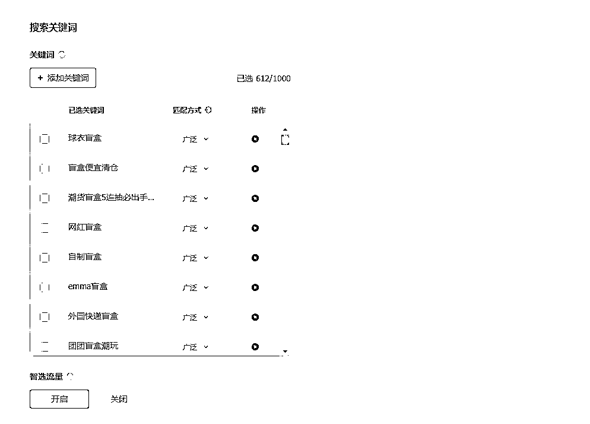

关键词的词根添加，只要是和盲盒泛相关的，例如潮玩、手办、xxx系列盲盒都可以设置广泛的匹配方式

泡泡玛特盲盒、直播开盒、直播拆盒、盲盒隐藏款、sp系列盲盒这种比较接近我们直播内容的，匹配方式需要设置成短语

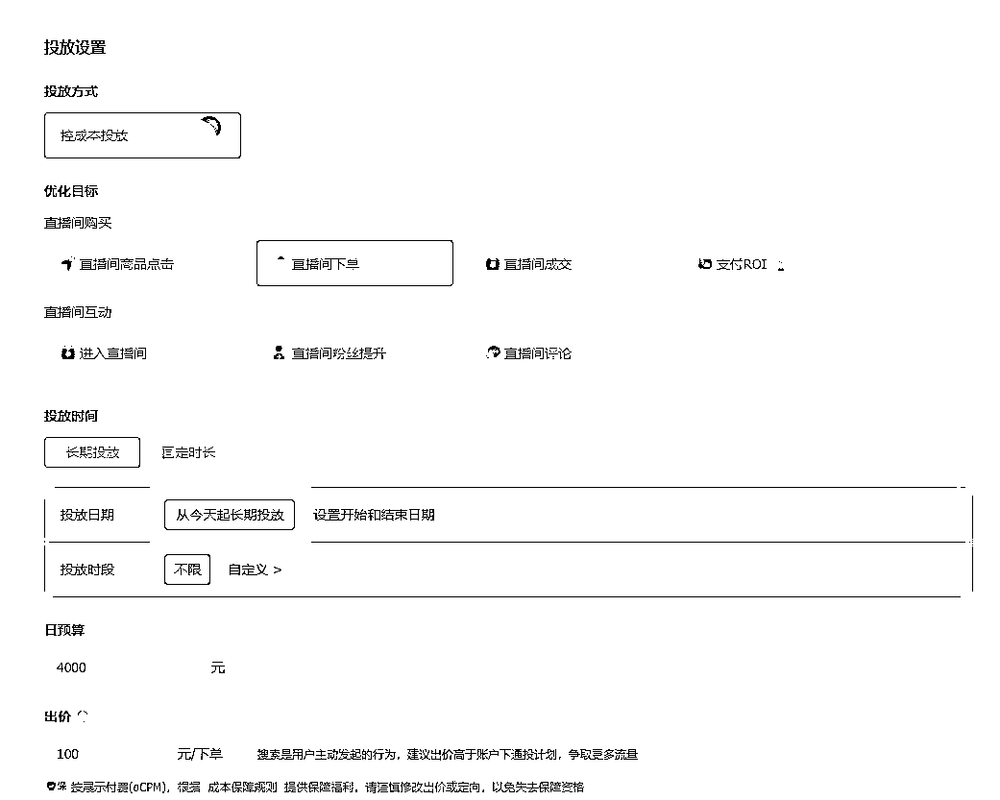

出价100/下单看起来很多，但实际跑起来花不了你多少钱

我们首先需要保证钱能花出去，不要设置一个看起来很精明的价格，到时候开半天一分钱花不出去，直播间也不进人。

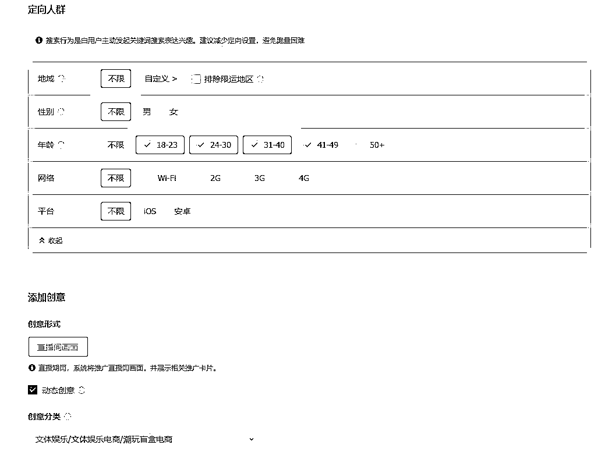

这个部分没啥好说的，作为参考。

通投广告：

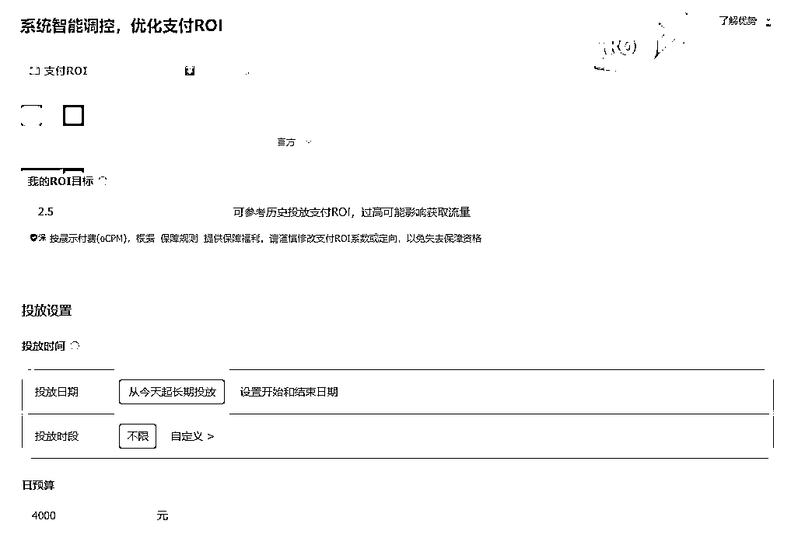

Roi目标设置2.5，日预算打高一些，我是4000

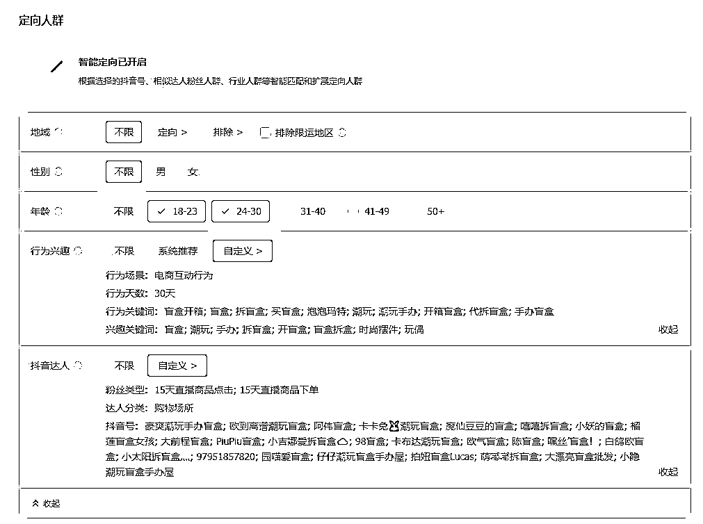

同行的场观人员还是很垂直的，定向一下年龄以后就可以开始抢人。

好了，上面就是我在两种广告投放方式上的设置，每个人的口播内容和节奏不一样，效果也会有不同的差别

前期投不动的情况下，建议大家对里面的一些选项进行一个个性化的改进，并且多创建几条广告。

如果广告出现“学”或者“保”的字样，说明模型比较优质，官方还会保0.8的最低roi 。

流量方面的总结是：花钱买，别骚。

### 内容方面

还是那句话，每个人都有自己的直播习惯和风格，这里给大家提醒几个事项：

1、

卖隐藏端的时候，不能口述“隐藏”这两个字，要叫"boss"或者“老6”，不然会被封禁。

2、

前期直播，等待12盒满开会比较困难，如果直播间有先下单的用户，在你知道他拍的不是隐藏的情况下，可以先帮他开盒

如果开的盒多了没有中隐藏，那么隐藏的概率就从12出1，变成了6、5、4出1

对于用户而言，拍到隐藏的概率提升，可以吸引一波未下单的看客进行购买，前面购买过的用户也很容易复购。

如果桌面上只剩下6个以内的盒，可以考虑改高售价10～20元。

12出1，售价139

6出1，售价就可以提高到169

中奖概率提高了嘛，贵一点，合理。

3、

要煽动观众互动，不能冷场，因为超过30秒不与观众沟通会被系统警告。

4.

如果你自己要拍隐藏，提前准备好一切，最好不要秒拍，也不要让盲盒离开观众的视线。（真不建议）

5.

前期直播尽量把隐藏多放一些给观众，比如4端里你放3端的隐藏给观众，甚至全给观众，让用户获益，自己的利润可能少了点，但是能多和观众聊天增进感情，下次开播，他们还会回来。

### 售后方面

既然作为商品在平台上售卖，那么就一定要面对各种各样令人头疼的售后问题，以下我举例几个最常碰见的情况和处理方法。

1.恶意退货

盲盒产品，只要申请退货的人就都属于恶意退货，因为一个盲盒从拆开那一刻起就失去了百分之80的价值，别人会退，那么肯定不是隐藏款，你拿回来，这属于明盒、有拆盒痕迹，不能进行二次直播销售。

很不幸，抖音店铺是很偏袒消费者的，对方提出退货，就算你拒绝退货并且申请客服介入，只要对方拒收快递，钱还是会被抖店官方强行退还。

所以我们能做的，只有在下单前不断给用户心理暗示以及“震慑”。

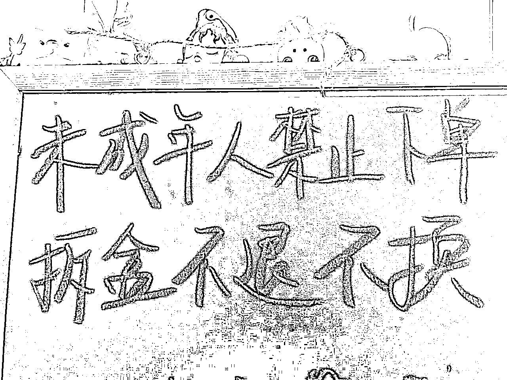

比如写一个“盲盒商品拆开不退不换”的标语，贴上“未成年人禁止下单”的纸条

并且在下单前，还要让他们在评论区扣一个：“已成年不退不换”的回应，并且告知粉丝们自己已经截图，一但开盒就是退不了的，反复的心理暗示，可以减少百分之95的退货率

剩下的百分之5，多数都是一些经验老道的“薅盒人”，碰上了也没有办法，不用和他胡搅蛮缠，直接退单就好

毕竟不论多么完美精密的仪器，在运行的过程中都会有磨损，这个成本能接受的话，随他去吧。

你看，开播的时候，我们想着尽量把隐藏款给观众，而一小部分观众却摆明要做「薅盒人」

与人为善，但社会就是这么复杂

他们这些小动作，贪图的小便宜在我们眼里，又算得上什么呢。

也再次印证了，买的没有卖的精。

2.瑕疵品

哪怕是我们售卖的正品行货，娃娃也经常有瑕疵出现，包括妆面花了、磕碰、甚至断头，对方收货以后，如果发现了比较小的瑕疵过来交涉，态度好一些，一般安抚好就没事了。

如果出现比较大的官瑕，不是隐藏款的话可以承诺对方换货，基础款在二级市场很便宜，你去千岛搜索一下他的款式，花个30-40买个换给他，不亏，心态一定要摆正。

客户至上

另外，不管会不会遇到以上问题，心理暗示法先安排上，直播间标出“不包官瑕”，先进行一遍筛选再说。

实操环节就到这吧，大家不实操，最多就当个爽文来看，还未必够爽。

有心自己去操作的，多看看竞品的直播间，看人家怎么运营的，看多了自己也有感觉。

## 3）隐藏的额外利润

### 算账

这个生意，利润可以自己把控的

100进货，139卖出，除了单个产品的差价之外，隐藏款的归属也决定了这个业务的利润高低

隐藏款的数量稀少，而泡泡玛特手办的忠诚群体基数又特别大，所以，这个品牌的盲盒有了一个非常稳固的二级市场，在这里，玩家幸运开出的隐藏款会被加价出售，原本69的盒，被加到了大几百甚至上千。

感受下隐藏款的市场价值

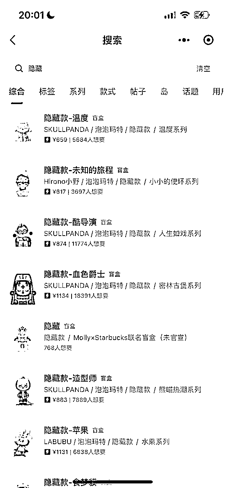

现实就是，即使是超出售价10多倍，也依然有玩家为此买单，不但有，而且销的还很快，如果二级市场短暂的缺货隐藏款，你就会看到评论区有一大片“求。。。隐藏”、“谁开出了。。。。高价收”。

你可能会认为这些盲盒的狂热爱好者很疯狂，但别质疑他们的购买力。。。

我给大家算一笔账：

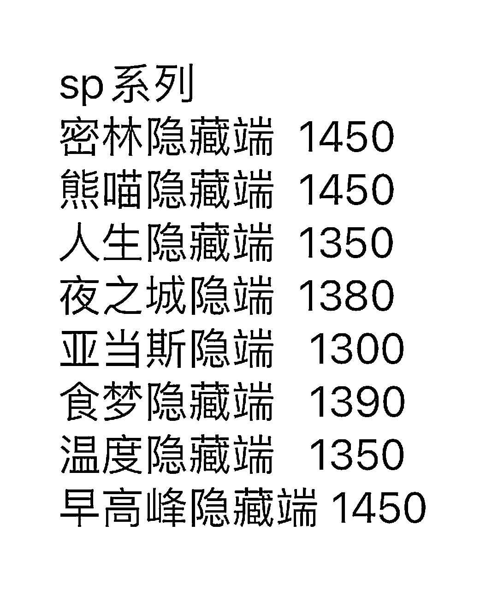

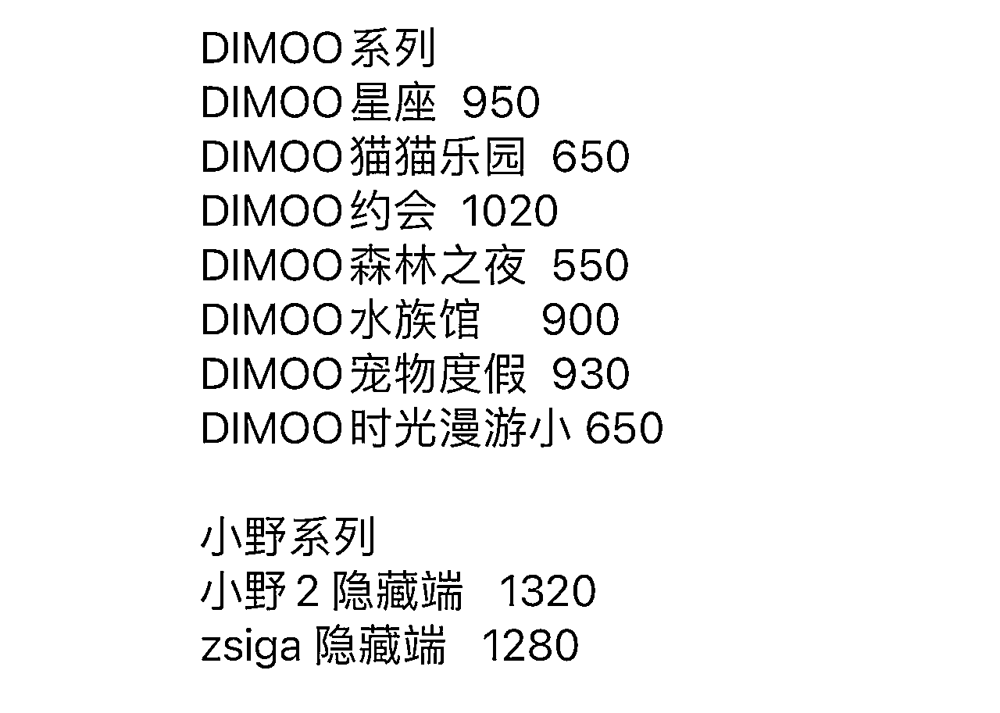

新手一般建议只开sp系列盲盒，因为这个ip 是泡泡玛特里爱好者最多、流量最足，也是直播间同行卖的最多的。

拿我们卖的sp系列的密林古堡来举例

一端带有隐藏的拿货价是1450，单个成本120，直播间的普遍售价是150/个

满开12个卖出一端，利润就是：1800-1450=350元。

如果这一端里，隐藏款被你自己拍走了（隐端供货商会帮你贴出隐藏款的位置），你可以转手出售隐藏款

根据二级市场的售价700元，还能再获取到700-150=550元 利润

差价+隐藏自留=总利润

350+550=900元

快递费的成本需要考虑进去，这个也很好解决，找离家最近的驿站，告诉他们自己未来一个月预计的发单量（这个前期吹点牛就行）

驿站有单个包裹4.5元全国送的这个指标，合作久了价格还会会更低，并且每天固定时间快递员上门取件，业务可比刚入门的你们熟练的多。

4.5×12=54元，除去这个成本，剩下的就是纯利了，最后计算得出846元

对于我的盲盒直播间来说，上面计算的利润基本在20分钟左右就能被创造出来

其他流量差一些的直播间，一小时左右也可以。

给大家看个例子：

密林的热度很高，只要能把直播间人数做到10个人以上，半小时内就能发车，有的直播间人数只有个位数，都一样出单

（爱好者们都喜欢多拍，很少就拍一单的，这样可以增大中隐藏概率）。

这车我盯了半小时，尽管直播间只有3个人，但卖的也只剩下5个车位了，基本上再来一两个活跃老玩家就能满开。

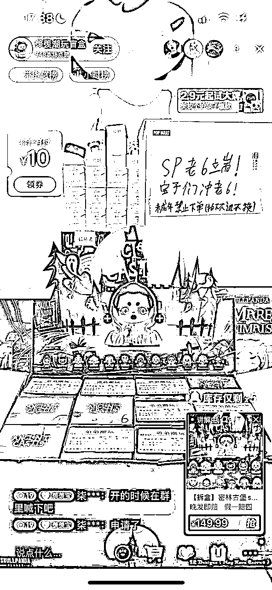

（贴单的代表已卖出）

# 3、我是怎么发现这个生意的

在我还是一个玩家的时候，为了搜罗各种泡泡玛特ip的隐藏款，我去了各种平台找寻“更容易获取隐藏款”的方法

小红书上教的摸盒技巧、哔哩哔哩里面教的抽盒机bug、线上平台买透卡透隐藏，能想到的方法我都研究过，但是这些操作没有让我买到隐藏的概率提升。

直到我在抖音直播上看到一个盲盒直播间，画风大概长这样：

平时卖69元/个的泡泡玛特盲盒，在这个直播间却需要150元才能下单，售价居然翻了两倍有余，惊讶之余，我也给正在直播的直播发去了疑问：

我：“为什么这么贵？”

对方：“因为一端保证有一个隐藏”

这样看，售价虽然翻了一翻，但是隐藏的比例从144:1 变成了12：1，并且在你付款后，主播会在一端12个单满后现场拆盒（行话叫“噶”），现场噶，现场公示隐藏款以及“幸运儿”，看了很久，真的每端必出，太神奇了。

这里都是我在直播间里拍到的娃

我在直播间拍到过4~5个隐藏，不值钱的基础款更是数不胜数，没少花钱

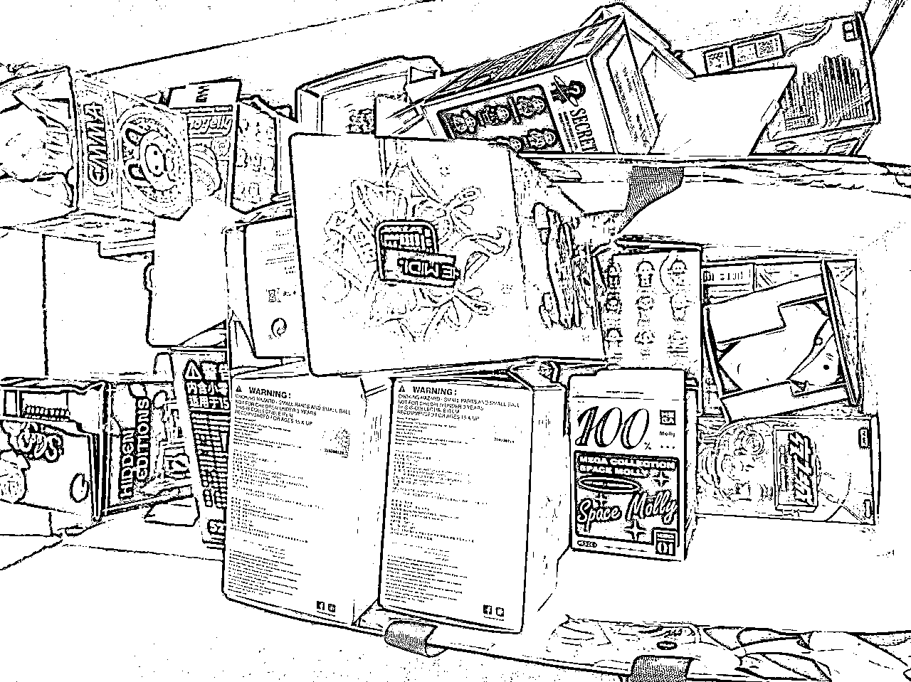

经过我的观察，这类直播间，往往只有3~40个人，即便是几十万粉的头部账号的在线观众也只有100左右

虽然人数看起来很少，但是出单速度却不是一般的快，拍盒开盒的过程叫做“上车”、“发车”，往往半个小时不到就能拍掉一整端的盲盒

按照直播间的平均价格，GMV在【1800元/30分钟】左右。

这东西真的，非常垂直，吸引力极强

商品本身具有强转化属性

我也是在直播间消费多了，加上平时在生财没少看文章，感觉这背后肯定有猫腻，有利润空间

于是我顺藤摸瓜，找到背后的「特殊渠道」，然后有样学样搭建一个类似的直播间

左手进货，右手吆喝卖货，中间还有很多细节，流量，退货，话术等等，没少坎坷

总之，说的轻松一点，在模仿的路上，生意就这么搭建起来了。

# 4、这个生意为什么可以做？不违法吗？

这种现象，我个人定义为“商品本身具有强转化属性”，从业后更是印证了我的这个观点，怎么解释，分开三点来说：

1.客户角度出发

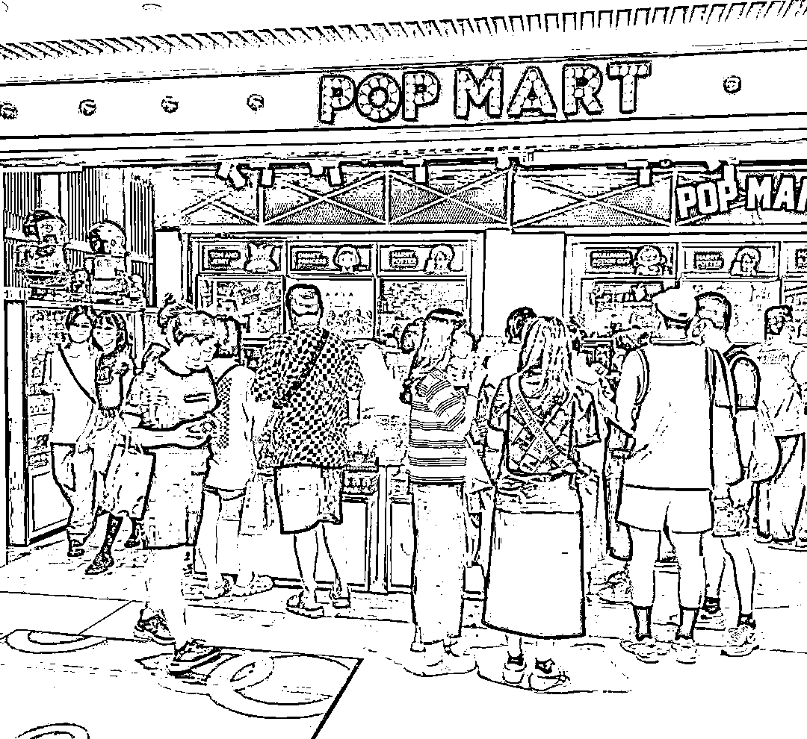

盲盒产品本身自带客户筛选机制，盲盒手办最大的标签就是潮玩，爱好潮玩的人群，往往都是“有消费能力的年轻人”，这个观点其实很好论证，我反过来说你就知道了：

没有消费能力的年轻人不会花69、79去买一堆“盲”盒以满足自己的精神需求和审美需求，吃一顿快餐都要二三十了，这些人，反而更在乎的是生存成本。

所以这个赛道的受众，我们可以理解为是：事儿少的、有经济条件的、粘性高的、下单快的。

一个大ip的艺术品，你不会考虑它是否具有实用性，是否真正符合你的审美。

这个群体是真的，钱多事少的群体。

钱少事多的生意我可不愿意做。

2.产品角度出发

我一直坚持的观点就是，做盲盒生意，我只做泡泡玛特。

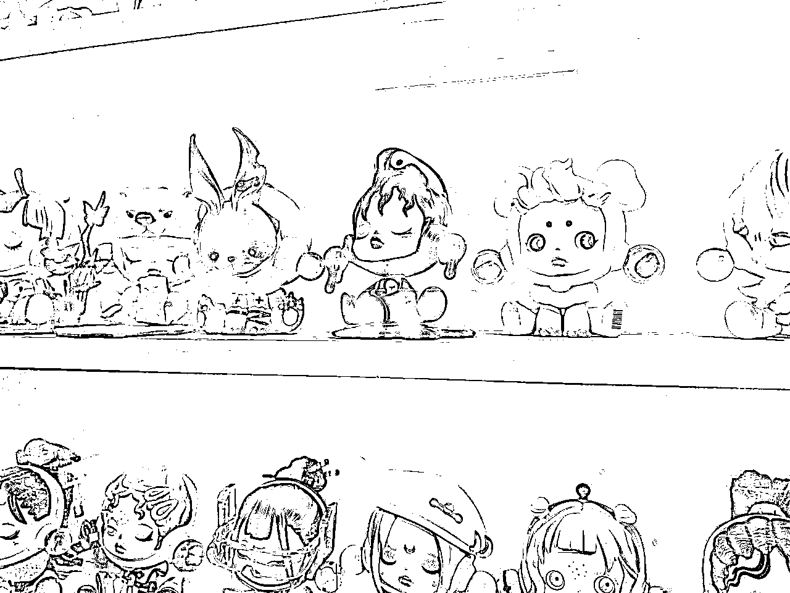

原因很简单，因为它是行业头部，且它产品本身就自带流量，不管是sp系列还是小野、molly任何一个ip，品牌认知度在年轻人群体都是够够的了，完全不亚于什么supreme潮牌、阿迪耐克联名球鞋。

差别在于，阿迪耐克在抖音没有授权不能卖，但是泡泡玛特没有官方授权也能卖！

这一点很重要，不要授权也能卖，是这个业务能持续做下去的根基，如果我分享出来之后，三天两头抖音就说咱们违规，那我肯定不能分享啊。

所以泡泡玛特本身不会有事，这个赛道真正遇到危机的时候，是抖音针对「所有盲盒」的时候，禁止直播开所有盲盒，那时候才真的要重新找路子了。

天无绝人之路，换个平台不也是这么个套路嘛，所以这事我会继续做下去的。

3.赌徒心理

盲盒这类产品在设计的时候就是很聪明的，不明确告诉你里面装的什么，在购买的时候，引导你的思想去猜测符合你喜好的最优解，本质也是一种博弈和赌博行为

加上隐藏款在二级市场可以卖10倍的大杀器以后，用户的赌性更重了，在经济条件允许的情况下，这种思想最后演变成一种偏执的、不择目的的购买行为，这也是直播间获利的核心。

能来直播间加价买盲盒的，十有八九是十足的赌徒，这类人，他们不会在乎你是谁，也不会在乎你有多少粉丝，只要确定了是泡泡玛特的正版行货、且是他们要的ip形象，确保能出隐藏，他们就会无脑的下单。

是的，哪怕直播间只有个位数的观众，他们也会下单的。

他们要的就是隐藏，恰好，我有。

”开不到喜欢的，我就全部买一遍“---来自我直播间的粉丝

嗯....总之，不违法，不侵权，目前属于抖音合规范围内，相对来说是一个比较稳妥的事了。（不需要提心吊胆）

# 5、货源去哪里找？

这个就涉及到这次分享比较干货和核心的部分了，供应链。

其实分享这部分的时候，有点不太乐意

想到一个表情包

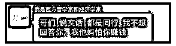

这业务，货源的稳定是整个盘子的核心

销售端，流量，话术，这些都能学，都能花钱买

但是入口端，也就是「低买」的这个资源，不是轻易能复刻的。

我自己就是资深的泡泡马特盲盒玩家

这是我十几万投入进去，满足自己爱好的花销

也算是「学习成本」了

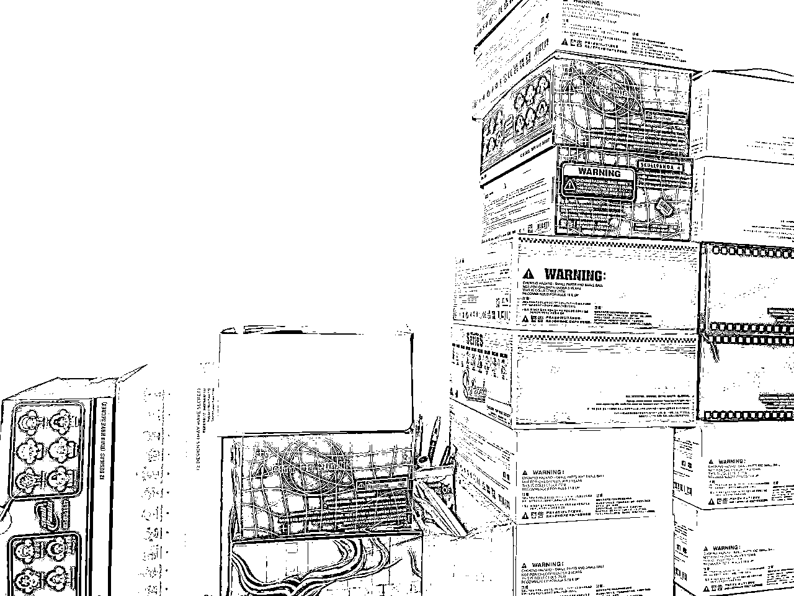

机缘巧合，我把【玩盲盒】这件事情，变成了一件日入3k+的项目。

屠龙少年，终成恶龙，我也开始卖盲盒。

这里我只能介绍个找货源的思路

找我直接来要「我正在用」的渠道，就免了，渠道不方便分享；

你直接找我进货，你心里又犯嘀咕，总觉得我加了一手，不爽，也显得我在生财有打广告的嫌疑；

两难全

渠道立身之本，该吃的亏应该是少不了，绕不过的。

关于渠道，给个思路，仅供参考

货源很好找，但找“好货源”很难。

平时我们去小红书、千岛搜索：泡泡玛特，都可以搜到批量拿娃的所谓“供货商”

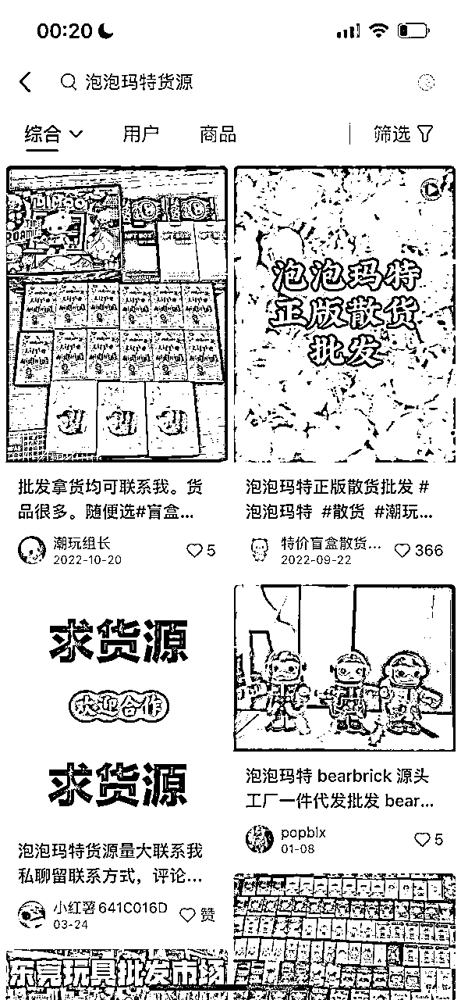

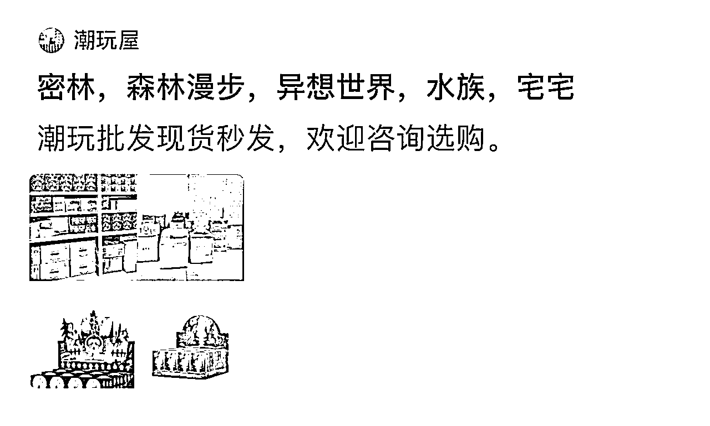

在我开启这个项目以前，只要是平台上能找到的供货方，我基本一滴不漏的加了个遍，有些现在跟我还有联系。

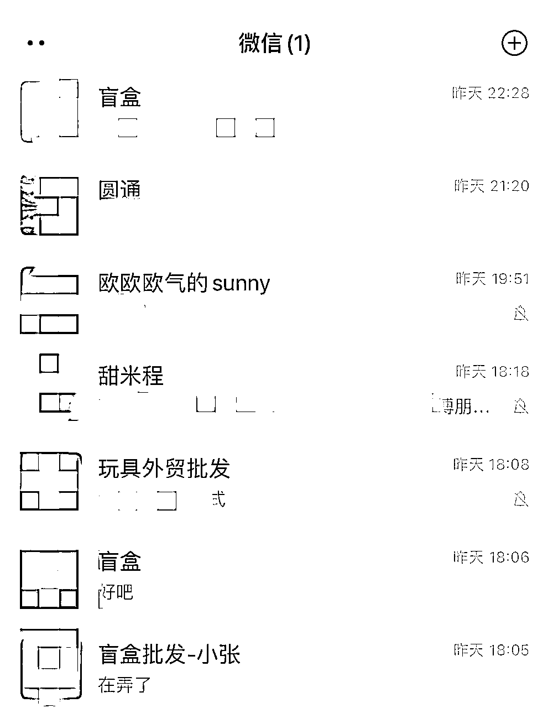

自己随机找货源的坑，我差不都踩过，会面临哪些问题，总结给大家：

1.假货。

泡泡玛特的爱好者最深恶痛绝的就是假货，俗称祖国版，如果直播间出现贩卖假货泡泡玛特玩偶的情况，不但可能被各种盲盒小圈子攻击，还有可能面临关店、甚至法律风险，这个是最恶劣的，建议买的第一端端货一定要开盒查验，避免风险。

2.缺货

上面已经说过了，有的ip 系列自带流量，好卖，拿泡泡玛特来说，夜之城、温度、密林古堡这种比较好卖的隐藏端，在平台上能找到的“供应商”，基本都是处于断货的状态，我现在主营的就是这四个系列，前期拿货的时候不少因为断货而发愁。

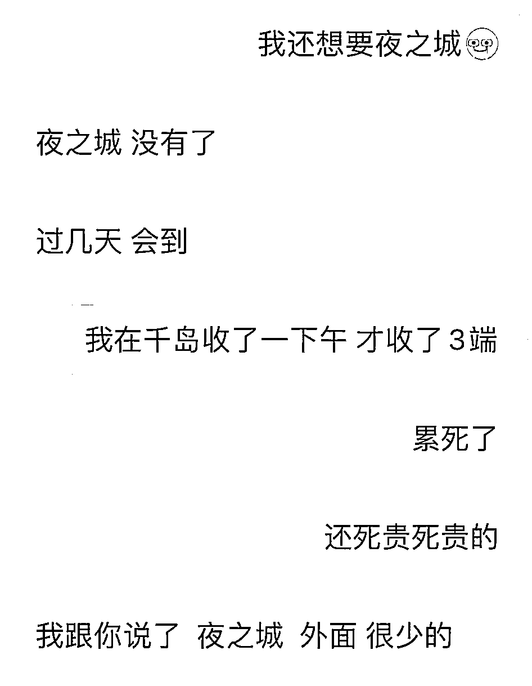

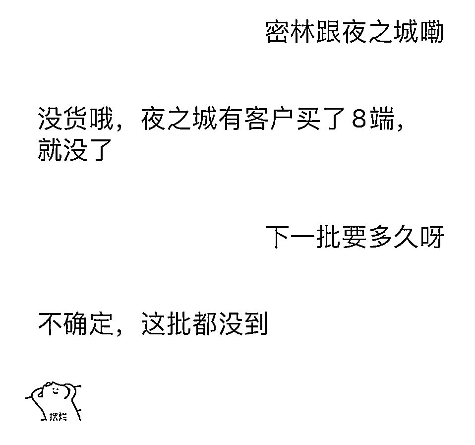

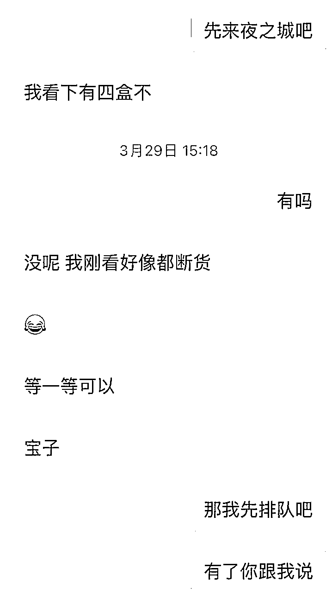

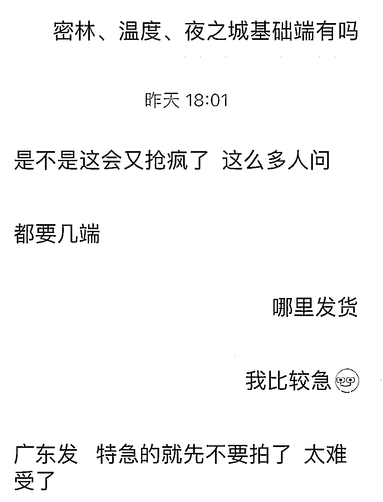

3.快递暴力压损

盲盒客户，在意的就是盒儿拿到手上的完整性以及购物体验，如果发过来的货源被压的乱七八糟，会被他们称为“烂盒”

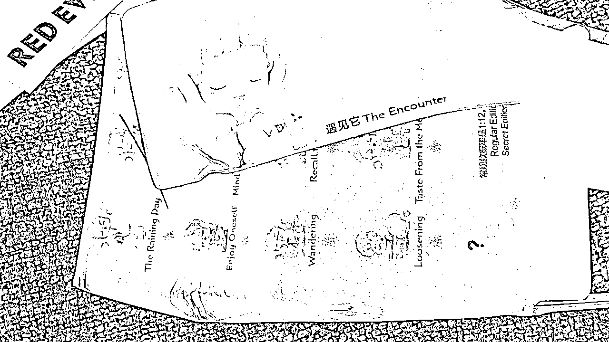

对于烂盒，玩家们都是深恶痛绝的，配件、卡片、包装盒只要有一个受损，在他们看来都是对娃娃的一种伤害，自己开出来的娃叫“亲生”（听起来很怪异，但是也算是这个圈子的一种亚文化）

如果这样的娃被送到玩家手上，可想而知要面对怎样的售后风险。

找货源这块的结论是：

多接触不同的渠道，少量尝试，验证真假，感受服务质量，直到遇见你的真命天子。

我的货源也是筛选了很多供货商才跑通的，为了避免上面说的烂盒情况，要求发货都是指定厚度的纸箱和缓震材料。

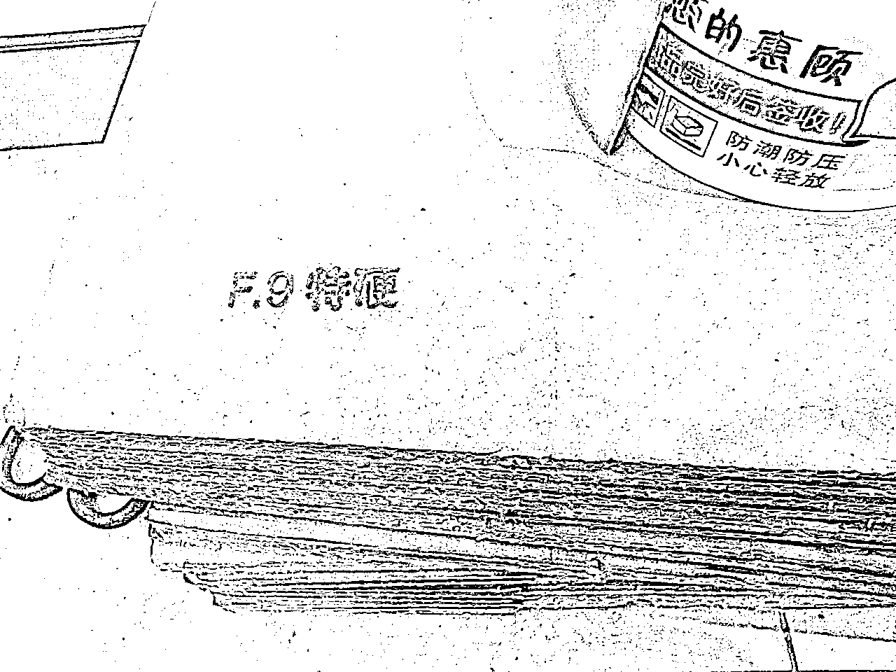

# 结尾

按照惯例，最后还是要劝退一波，这个项目不适合于以下圈友：

1.对泡泡玛特盲盒完全不了解，也没有购买过盲盒产品的朋友

2.手头上能调用的流动资金低于2w的朋友（需要拿货）

3.表达能力差，不擅长口述交流的朋友

好了，以上就是目前我能想出来关于盲盒项目的所有细节，写的时间比较长，篇幅也较多，如果有逻辑或者语句上的纰漏请圈友们谅解。

我是大威，这是第一次进入生财，但是我看生财的帖子很久了，有差不多1年了，惭愧，上学时候都是在闲鱼买着看的，也和大家没什么交流，只是偷偷看帖子。

早期流行做知乎好物的时候，我跟着生财的大哥们一起上了车，账号运营到今天，也能保证每个月收入1~2w的佣金，并且在某几个不小的类目做到了头部，至今还和几个品牌方进行着跨平台的深度合作。

借助知乎的资源，我在bilibili也运营了一个内容账号，虽然只有1000粉丝，但数据最好的视频已经积累了60万播放、2万赞，前后共计只发布了7条作品，现在整体的播放也快破百万了，商单报价是1.2w，也成交过不少单

交付上和品牌合作的都比较愉快~

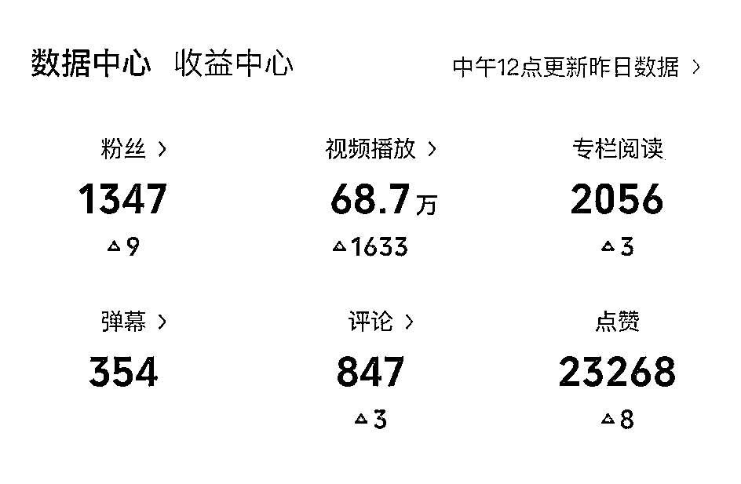

对于这些经历，我的目标一直都很明确，不管是知乎、B站、还是抖音直播，其实运营逻辑都是大差不差的，如果确定了在这个平台就精做一个类目，那就直接要冲着成为头部去，不要去有什么躺赢、喝汤这种想法，机会都是留给有准备的人！

也是出于个人的爱好嘛，在盲盒上被割了不少，自己用着生财看到的这些方法论，提升了自己的敏锐度，跟着跟着就做了个小生意的模型出来，刚做不久，目前还有点利润，赶紧就来生财补票，分享，做一点贡献了。

这是我第一次发帖，感谢生财，我曾经是个租房子都没钱的小男生，现在跟着大部队赚了些钱，我在学生圈子里也小有名气，身边有一批自己的小粉丝，一呼百应，感谢圈子给了我成就的机会。

无以为报，把自己知道的都说出来了，给生财添砖加瓦。

自己也迈出小透明的第一步，不能留微信，大家有什么要交流的，直接评论群聊就行。