# 抓住GPT封号热点事件，2天变现1万

> 来源：[https://bchje44bsl.feishu.cn/docx/KJ0CdYG18oMFStxpa17cxS0wnyt](https://bchje44bsl.feishu.cn/docx/KJ0CdYG18oMFStxpa17cxS0wnyt)

大家好，我是令狐峰，极客增长的创始人。

# 围绕热点创业

周日突然GPT针对亚洲节点的可疑账号，开始大规模封号，具体事件不在多做解释，GPT封号事件不了解的具体可以看下面二张图，整个朋友圈一片哀嚎。

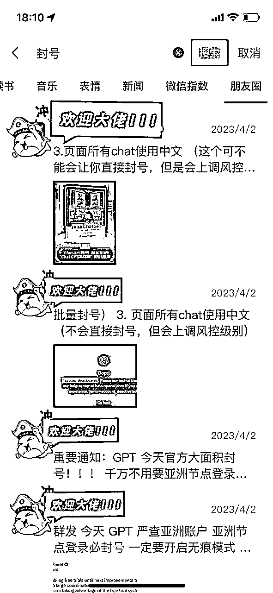

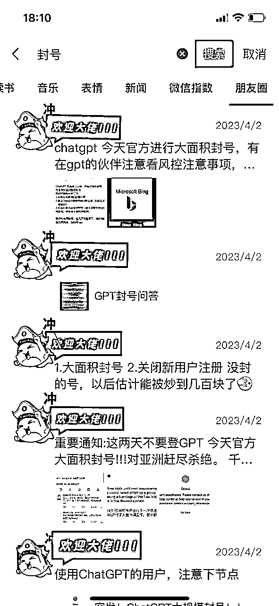

周日早上开始发生这件事情，我们意识到有机会，我和hawli赶紧行动，围绕GPT封号热点事件进行发售产品，客单价399，第一天9379，第二天变现4788，虽然变现不多，但是快速拿到正反馈的感觉还是挺好的，因此我们来做一个简单的复盘。

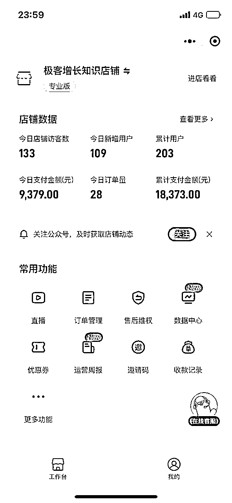

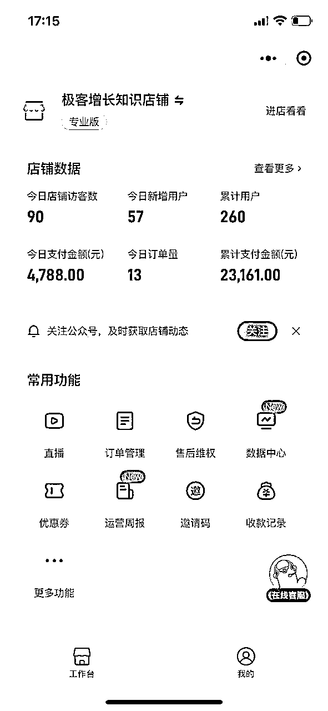

接下来我带大家一起来回顾一下我们的事件流程：

但是周日早上睡到10点醒来，刷朋友圈发现，不少人都在发ChatGPT大规模封号，亚洲节点不能登录的问题。

无论是朋友圈还是社群，还是公众号文章，都在讨论chatgpt的封号事件，这时我还没意识到要立马做这件事情。

后来11点30正好在和七小聊天，在聊Notion Ai的使用场景，七小提醒我这是个蹭热点好机会，这里感谢七小。

# 发现痛点和做出方案

因为现在很多GPT使用者面临三个问题：科学上网问题、封号问题、贵的问题。

最关键的问题是：不仅贵而且交钱了还可能会被封号。

问题我们一个个来看和拆解

科学上网问题：要花钱买科学上网账号，科学上网软件安装，政策风险，访问内部网站不稳定的问题

封号问题：官方会动不动就封号，即使是Plus会员也会被封

贵的问题：免费的回答速度很慢，但Plus一个月20美金，一年的话是1653人民币

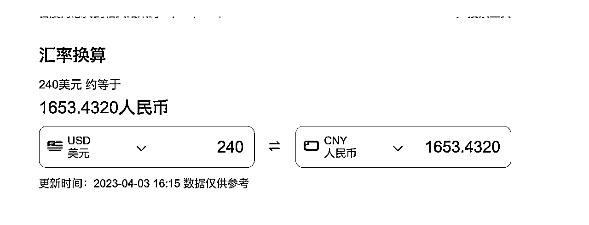

当一类群人遇到棘手问题，这就是我们的机会，并且速度一定要快，因为这时候会有巨大的供需不平衡，谁能先解决，就能吃到这波红利。围绕上面三个问题，我们的解决方案是推荐大家使用Notion Ai。

首先介绍一下Notion AI：Notion 是一款类似印象笔记的笔记软件，在全球已经有超2000万的用户，Noiton Ai其是与2022年底推出的一款产品，是基于Gpt-3.0的模型开发的写作Ai模型，无需科学上网，支持中文，没有任何封号问题，非常适合写作和办公人选，是一部分人替代chatgpt的不二选择。一句话理解就是：写作方向的Ai软件，且拥有chatgpt3.5绝大部分功能。

我们在回顾头来看看一下上面三个问题和对应解决方案

科学上网问题：Notion Ai无需科学上网，国内可以直接访问

封号问题：不恶意使用，不存在封号问题

贵的问题：可以用量大来压低价格，可以低成本弄到价值1300年费会员，原价要192刀

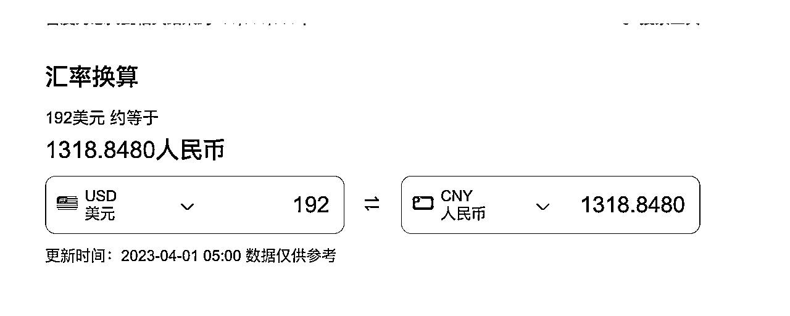

另外我们自己已经使用了Notion Ai接近一个月，很多内容都是通过Notion Ai来完成的，使用的无比畅快，有时候1小时能干我们原本一天的活。比如围绕这个热点写一篇：愉快的吐槽chatgpt封号问题，并且推荐Noiton ai写作功能 抖音/小红书风格，见下图。同时还支持围绕内容继续加长，自动修改内容等等。非常方便，1分钟干原来2个小时的活，爽歪歪！

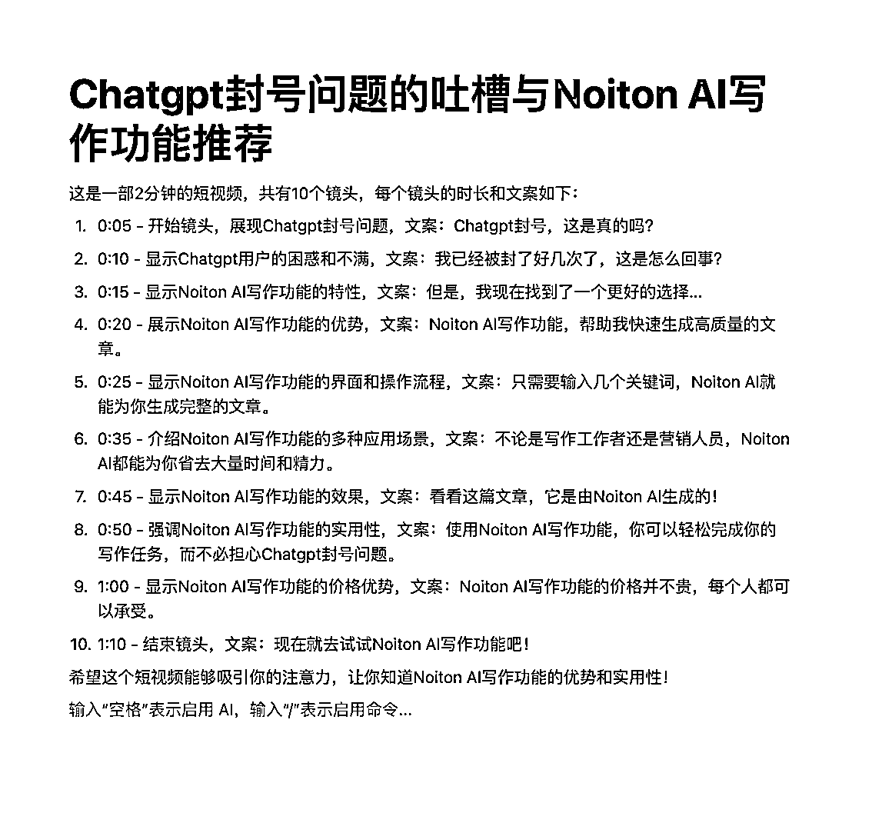

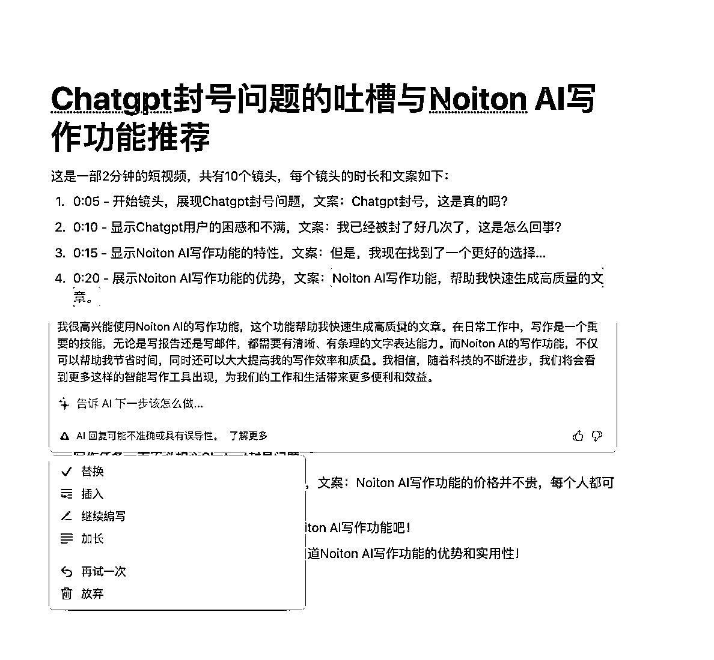

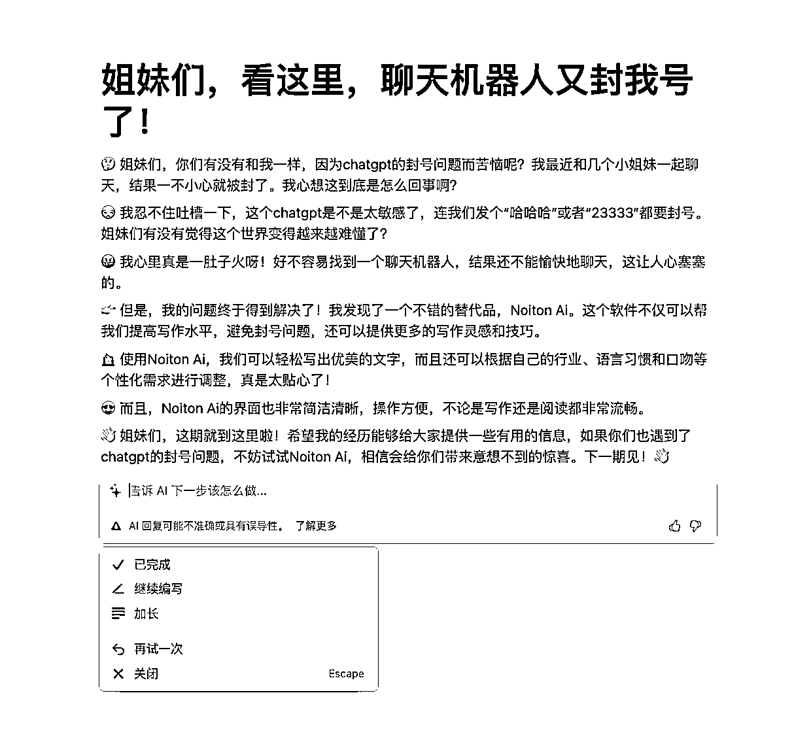

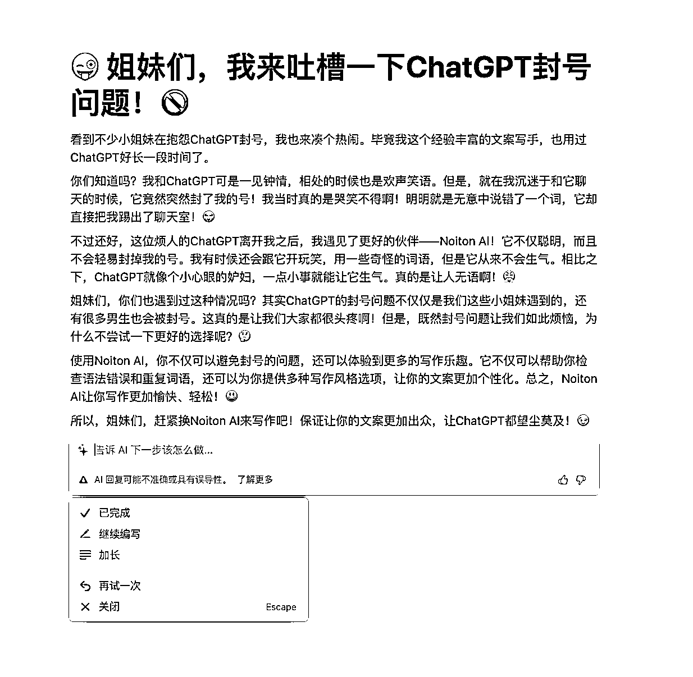

如何1分钟干原来2个小时的活？你还可以看看下面这个视频

极客增长本身是专注于抖音搜索流量解决方案的，要做能够获取搜索流量的提前是得有生产内容的能力，所以在我们课程中交付的一环是，如何大量生产的短视频脚本？我们的解决方案是通过Notion Ai来解决。用过的学员都反馈好。所以对我们来说解决方案其实是现成的。

从人群痛点足够疼到产品交付方案足够好，我们认为是可以跑通闭环的，开始拆解和分配任务

# 任务分工和拆解

决定了要做这件事情，我们就立刻开始分工，此时是下午1:30，分工如下：

于是整个下午我们都在做各自的任务，并且紧张的忙碌着，最终在下午7.30完成所有工作，紧张而又忙碌的6个小时。下面是我们过程中的一些心得：

### 写公众号文案心得

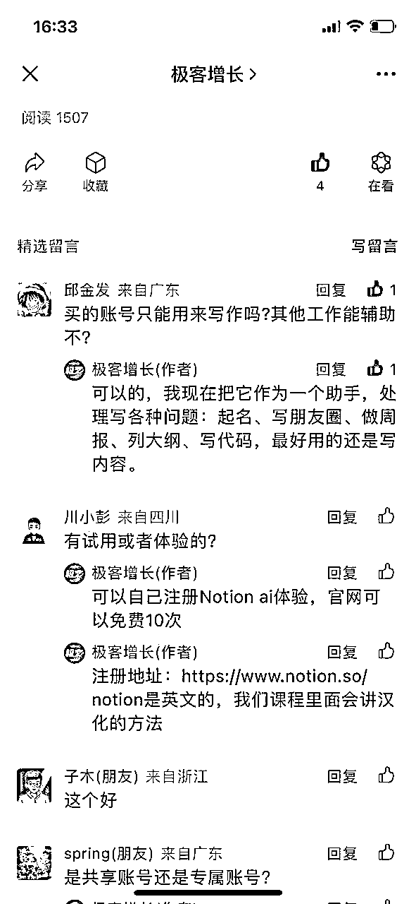

### 优化课目录心得

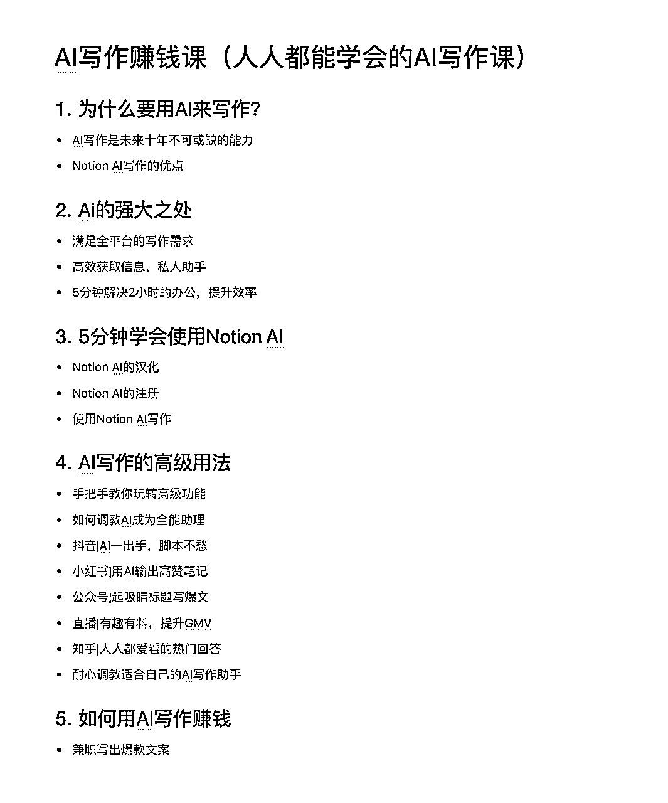

### 课程上架心得

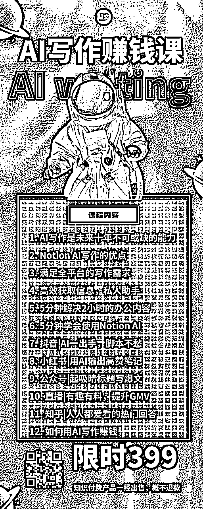

### 提高用户体验和减少客服压力

考虑到很多人注册Notion Ai需要挺多步骤：为了提高用户体验，和减少我们客服的压力，我们采用技术自动注册的方式，直接给到用户独享的已经是会员的Notion Ai账号，无需用户注册。

技术支持：Notion Ai的账号自动注册的脚本，批量注册Notion Ai账号。

下面代码逻辑的核心大纲框架，不代表全部代码：

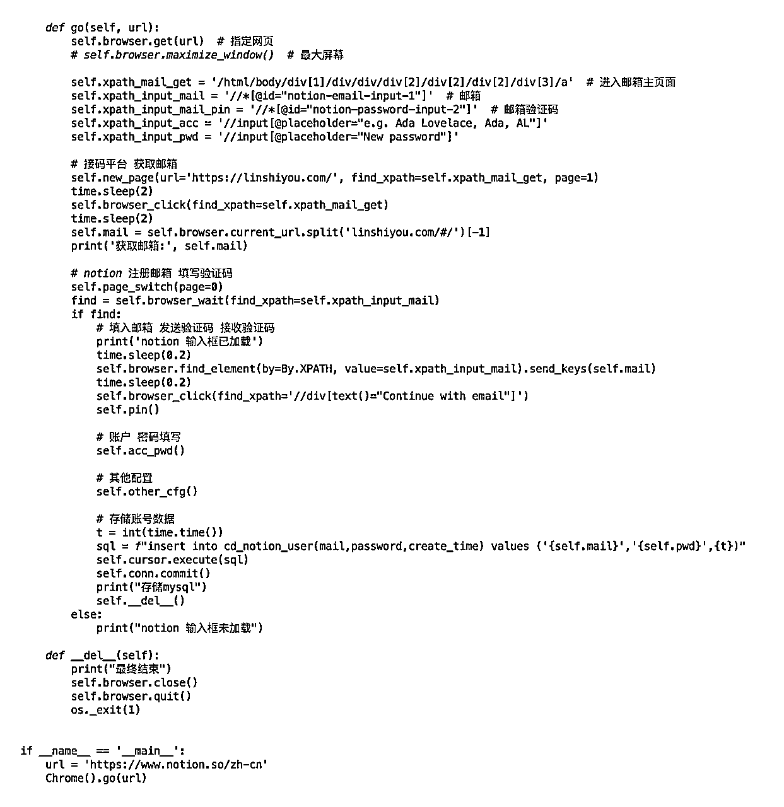

# 数据复盘和体会

### 

所有工作于当天晚上7:30结束，并且发布了一条公众号推文和一条朋友圈转发。

截止到昨天下午5点钟为止，一共文章有1783人次阅读，142次分享，转化了34个人购买，客单399，销售额：13566。

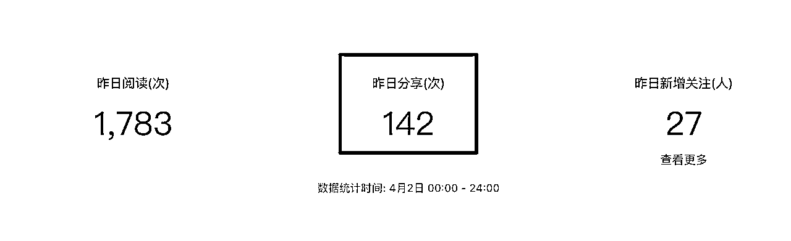

虽然没有赚很多钱，但是6小时快速从零到上线卖出，快速拿到正反馈的感觉还是挺好的。这应该也算生财速度吧。

因为时间紧张，也出了一些问题：

也是快乐并痛着。

最后大家如果感兴趣可以看一下我们的公众号原文：https://mp.weixin.qq.com/s/1VcTUSmoSI2PtpLZL9v9_g

目前我们在邀请一批分销课程达人，如果对Ai写作领域感兴趣，可以联系我们vx：jkzz008，暗号：分销

购买产品后，在小鹅通我的界面，申请成为分销员，你会拥有40%的分销金额

1、付费加入后，进入小鹅通中，我的界面，生成自己的专属邀请码，你的朋友通过你分享的二维码付费加入，你可以得到分销奖金，约40%；

2、分销说明：分销金额为实时价格的40%（会扣除0.6%的手续费），三天后可以提现，欢迎转发分销；

3、退款说明：因为是作为课程等虚拟类，并且以及会开通对应的账号的内容，一旦售出暂不支持退款；

4、分销共识：请勿为了卖出产品，做夸大承诺式营销，请勿卖给不需要他的人。

5、风控问题：因为是虚拟物品，量大会触发微信的风控，如果遇到无法付款的问题，可以联系我们

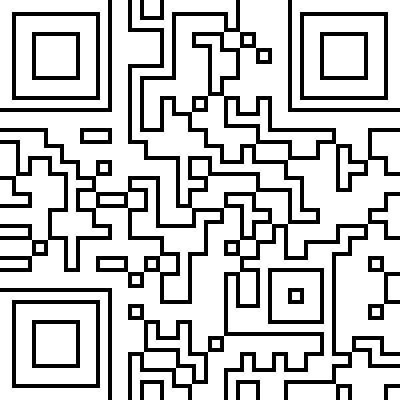