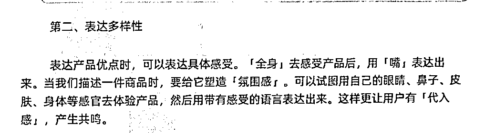
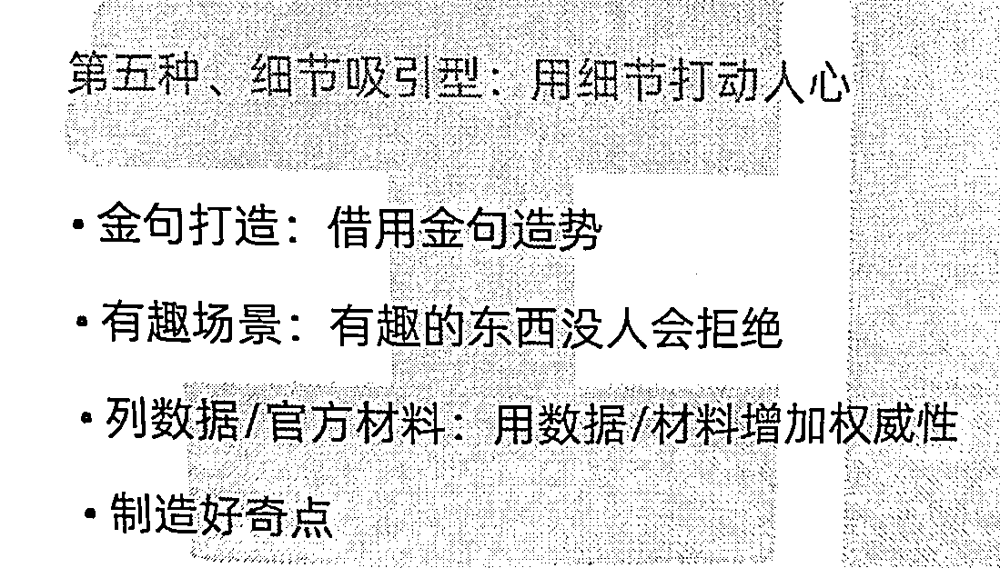
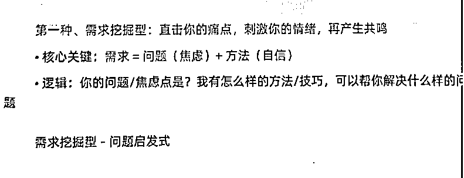
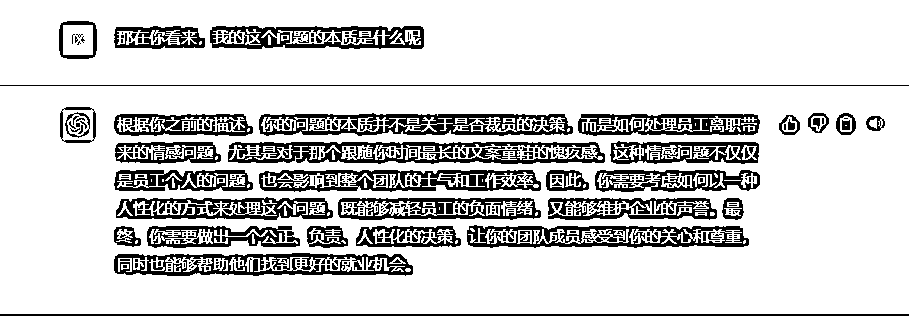
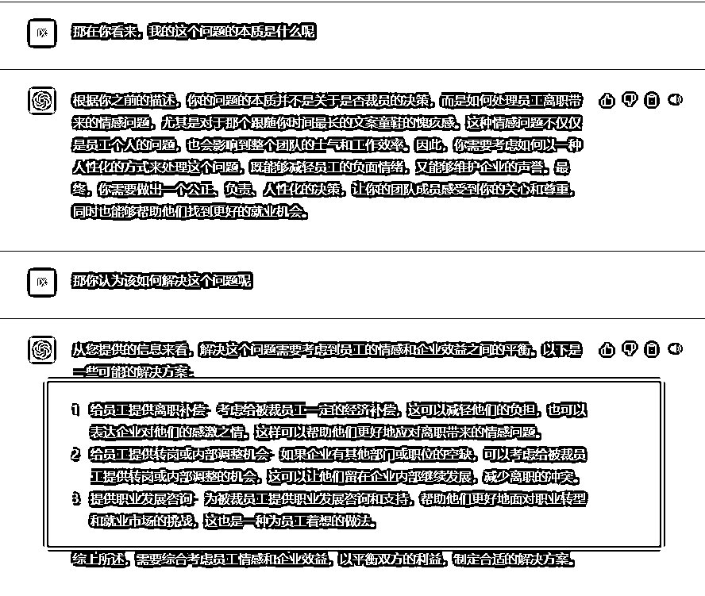

# 如何利用GPT赋能员工提效，帮我每月多挣10万元？

> 来源：[https://c8xa9g10gh.feishu.cn/docx/PbGkdX4YVoO02mxYlYKcbgASnSg](https://c8xa9g10gh.feishu.cn/docx/PbGkdX4YVoO02mxYlYKcbgASnSg)

大家好，我是云飞，盈腾科技创始人&CEO，斗学科技联合创始人&CEO，AI老板圈联合发起人，有一个15个人的带货团队。

从去年12月初使用GPT到成立新团队做GPT相关的业务，已经5个多月了，团队10个人，专职技术6人，算是国内最早一批应用和开发GPT的吧。

前两天，因为我司新奇地调教和使用对GPT的方式，受到了一些媒体的关注。后来接受了其中一家国内知名媒体的采访，在对方记者的犀利追问和挖掘下我梳理清楚了一些东西，借此机会也分享给圈友们。

在这也附一下媒体采访稿：

极客公园：

https://mp.weixin.qq.com/s/XkqpR3apm-79w8GBVHy1kg

人人都是产品经理：

https://mp.weixin.qq.com/s/VkLIJt4tkvxDjlUVyZxvNw

本文要点：

1.短期内AI不一定会淘汰人，但会使用AI 的人一定会淘汰不会使用AI 的人。

2.目前职场中，很多白领的工作本质是披着“创造性工作”的外衣在做着“机械性工作”的事情。

3.从来都不应该把GPT当做一个文本处理工具 ，更应该把它作为你的思考辅助工具，也许有一天“辅助”这个修饰词也应该被去掉。

4.在GPT这类的人工智能工具日益普及的时代，人们应该尝试从执行简单、低思考含量的工作向更加复杂、高思考含量的工作方向发展。

5.遇事不决 GPT

## 一、裁员的背景

本文我先从GPT帮我裁员这个话题说起，也是之前很多圈友比较感兴趣的一个话题。后面再逐步升华分享一下我自己的思考。

我们盈腾科技其中一项业务是图文带货，即通过在社交媒体平台上发布图片、视频、文字等内容来推广商品。这种模式通过内容互动来提高商品的曝光度和销售量，让消费者更容易产生购买欲望和信任感。

咱们也有不少圈友在做这个事情，我们团队已经负责这项业务近3年，由7个文案和4个运营共同协作完成项目。

每天文案负责按照《盈腾科技带货文案标准化写作》这个册子里的结构写精品带货文案，然后运营负责对文案进行调整和发布到对应平台，同时进行数据分析和复盘。这是我们业务的基本逻辑。

## 二、ChatGPT的出现带来裁员契机

不过，去年11月底GPT-3的出现打破了我们这个项目的稳定协作结构。

从事情的本质来讲，我们的这项业务是高度依赖文本处理的，而GPT恰好擅长这个事情。所以，去年12月初在一个朋友的推荐下我们迅速去体验。

说实话，刚体验的时候感觉效果比较一般，没法一步到位写出一篇可以直接使用的稿子。但是，它能够减少文案编写的工作量，从而提高了一部分的业务效率。

后来，我看了很多国外调教的案例后才发现我们“误解”它了。并不是它不够强大，而是我们的使用方法不对。看了别人五花八门的调教案例后，就特别想去找个课程学习一下。

奈何当时市面上并没有成型的培训课程能教这个东西 ，于是，我们只能自己疯狂研究。一周多的时间我沉迷其中无法自拔，终于进入了心流状态。

## 三、利用ChatGPT调教文案模型

我当时看了很多国外的案例，研究每一个模型能够解决的需求，思考了实现的路径，然后逐步实现并与别人的效果进行比对。在调教了200多个模型后，我抽象出了三条底层规律，具体内容看之前写的这篇精华帖：

在那段时间我深刻地感受了ChatGPT的强大能力，通过对其充分的了解和调教，终于让我热泪盈眶，真的感激它进入我的世界，深深地触动了我的内心。

现在，我的工作和生活高度依赖它，我已经连续买了三个月的Plus会员以深度使用它的能力。当时，我深度掌握调教它的方法后，把我们总结出来的大量专业的文案结构都喂给它，结果发现它竟然真的能够生产出和我们的文案同学水平媲美的文章，90+的水平甚至比他们还高。

从册子中拍了几张当时喂的结构：

喂完这些结构以后，输出的内容完全达到了我们的使用标准。不过，考虑到使用的便利性，我们索性直接把它做成了一个工具，我们内部使用2个多月了。

放其中一个产品的演示效果给大家：

## 四、ChatGPT给出的裁员建议

不夸张地讲，这比以往我们使用过的任何提高文案创作效率的工具都要强，起码要强几十倍吧。于是，我天然地想到了裁员（老板当然要降本增效）。

不过，这个决策过程中却是犹豫、痛苦的。因为“裁员”这个事情本身就意味着我要承担因削减自己熟悉的伙伴们而带来的情绪上的影响。其次，有一个跟随我一年半的文案同事，直接裁了会让我心里感到愧疚和不安。不裁的话现在又用不上。

所以，我当时思考的焦点在裁员与不裁员之间徘徊。后来灵机一动，我把这个问题和当前内心的纠结全都输入了ChatGPT。

说实话，给出的答案确实差强人意。后来，我又尝试着把我们原先做咨询时常用的几个决策模型喂给它。

结果，出乎意料……

它给出的答案非常惊艳，它没有选我给它的两个选择中的任何一个，而是自己创造性地给出了第三个选择。

在它看来，我纠结的这个问题的本质并不是裁员或者不裁员这个问题，而是“如何降低对跟随我时间最长的那个文案童鞋的愧疚感”。

以此作为问题的突破口，我又找它问了解决方案。

## 五、最优的解决方案

在它的建议下，想起3月份在本地招电商文案的那个朋友，打电话问了一下，他还缺人。

最后，我采纳了GPT给出的建议，将跟随我时间最长的那个文案同事安排到一家朋友的公司，以N+2的方式结束合同。其他六个同事则以N+2的方式直接结束合同，这样成功地解决了裁员问题。

虽然情绪上我仍有些愧疚，但从解决问题的层面来看，我认为我们找到了一个不错的解决方案。裁员后，我们每月节省了将近4万元的成本。

与此同时，我给这个项目的剩下的那4个运营人员购买了Plus账号，让他们可以使用GPT来编写文案。相比之前，可用的文案数量一下子增加了3倍，这意味着在我们的几个平台的矩阵账户中，原先每个账号每天只能发两篇文章，现在可以发5篇了。

在同等转化率的情况下，我们的阅读数据增加了两倍，单日平均达到了13w的阅读，月收益也增长了9万元多。

原先需要11个人协作干的事情，现在4个人能搞定了，而且人效还翻了两番。可以说，GPT成为了我们真正受益的技术之一。

## 六、常用的决策机器人调教模型总结

现在，我们把注意力拉回到我们的主角——GPT。复盘这个GPT帮我裁员的过程，当时我把之前在企业咨询方面积累的许多决策模型，如决策树、贝叶斯、神经网络和线性回归等，都喂给了我们的决策机器人。

而后，它凭借自身强大的语言处理能力变得更加强大，现在专门帮我进行数据分析和决策，当我面对不确定性选择、情绪性的纠结、信息不足等选择时，都可以直接向它寻求帮助。我把它称作“小飞AI决策机器人🤖”。

那在没有开发基础的情况下，大家如何在网页端拥有一个简单的决策机器人，实现和小飞类似的功能呢？

调教是关键！

不过 这个我在前文已经详细分享过ChatGPT的调教方法，可以再去温习一下。

在这些调教方法基础上，需要加上下面几个决策模型，就可以构建专属于自己的一个决策机器人。

在这里也分享一下我喂的几个模型：

列举一些常用的模型：

1.决策树：决策树是一种基于树形结构的分类模型，可以将一个决策问题分解成多个小问题，并依据不同的情况进行不同的决策，从而达到决策的目的。

2.朴素贝叶斯分类器：朴素贝叶斯分类器是一种基于概率统计的分类模型，可以通过先验概率和条件概率计算出给定特征的情况下，某个类别出现的概率，从而进行分类决策。

3.支持向量机：支持向量机是一种基于结构风险最小化原则的分类模型，可以通过寻找最优的超平面将不同类别的数据分开，从而进行分类决策。

4.神经网络：神经网络是一种模拟人类神经系统的模型，可以通过学习输入数据与输出数据之间的关系，进行分类、回归等任务。

5.逻辑回归：逻辑回归是一种基于概率的分类模型，可以通过将输入数据映射到一个概率空间中，从而进行分类决策。

6.线性回归：线性回归是一种基于线性模型的回归模型，可以通过对输入数据进行线性拟合，预测输出值。

7.随机森林：随机森林是一种基于决策树的集成学习模型，可以通过集成多个决策树的结果，从而提高模型的泛化能力和准确率。

需要注意的是，不一定要一下子把这几个模型全喂进去。根据自己的实际需要去选择就可以。

对这个案例有兴趣的朋友，不妨尝试利用类似的方法训练自己的决策机器人、问题解决机器人等等。利用AI的强大能力去解决问题，相信你会找到全新的增长机会。

再发散一下，你熟悉这个过程以后，建议你迁移到其他场景中使用，比如仿照这个过程去喂几个模型搭建一个帮你做数据分析的机器人，或者喂一些结构搭建一个帮你产出具有自己风格的文案的机器人。

相比于简单的写个小红书笔记、朋友圈文案，构建相对复杂的模型带来的价值是更大的 ，也能把GPT的能力进一步为你所用。

## 七、AI给予的解决方案可靠吗

说完， 上面这个具体的案例后， 我想升华一下主题。

先分享一个昨天记者还问到一个有趣的问题：

AI和人类相比，到底哪些方面会比人类强？AI 给出的问题解决方案是否可靠？

1.没有情感干扰：AI 没有人类情感的干扰，不会受到情绪、心情、偏见、个人喜好等方面的影响，它只会根据事实和逻辑进行分析和判断。这使得 AI 的决策更加客观和合理。

2.持久性和精度：AI 不会像人类一样疲劳或分心，它可以连续地执行任务，不断地处理大量的数据，并且不会因为长时间的工作而出现错误。相比之下，人类常常会因为疲劳、分心或者压力而出现失误。

3.速度和效率：AI 可以以惊人的速度进行计算、处理和分析数据，远远快于人类。此外，AI 还可以处理大量的数据和信息，而人类通常会因为信息过载而感到压力和困惑。

4.知识共享和增量学习：与人类的学习相比，AI 的学习过程更加快速和高效。AI 可以通过机器学习算法来不断地学习、进化和自我优化，可以在短时间内通过分析数据集，从中发现模式并进行预测和推理。此外，通过知识共享，不同的 AI 可以互相学习和交流，进一步提升整体智能水平。

5.自主决策能力：AI 可以基于大数据、算法和模型，自主决策并作出反应，能尽最大努力找到问题的最优解，同时AI 可以自动适应环境的变化，并对新的情况作出调整，从而保持高效性。相比而言，人类是基于过去的经验在做决策。

基于以上这些特点，我认为在解决问题的层面上，AI给出方案一般会更加符合逻辑，更趋向于最优解。然而，最终是否采用AI的建议还取决于你的主观判断，因为AI不考虑复杂的人情世故，而人在一些问题上需要考虑这一点。

因此，AI和人类的优势互补，通过结合AI的能力和人类的智慧，我们可以更好地解决问题并获得更大的收益。

## 八、升华思考

简单复盘了一下：

人类思考成果的首要载体是语言，也就是当大脑中一个模糊的想法产生后，需要通过语言去梳理成清晰的想法。

而GPT最擅长的就是做语言处理。所以，从这个角度来讲，从来都不应该把GPT只当做一个文本处理工具。

它还可以是思考辅助工具，或者说它更应该作为你的思考辅助工具。展望一下，也许有一天“辅助”这个修饰词也应该被去掉！

展开来讲，语言是人类思考的基础和核心。从某种程度上来说，语言甚至可以被视为人类文明的基石。而GPT等语言处理技术的出现，则使得人类能够更加高效地利用和处理语言信息，进一步推动了人类文明的发展。

所以这个角度来讲，除了用作文本处理工具外，GPT还可以作为一种思考辅助工具，来协助人类更加深入和清晰地思考问题，以及更好地表达自己的想法。

通过与GPT交互，人们可以得到更加全面、深入的信息，从而更好地进行分析和决策。

此外，GPT还可以帮助人类拓展思维的边界。通过不断输入各种文本信息，GPT可以产生出许多人类想象不到的想法和结论，为人们的创新和发明提供了新的思路和灵感。

因此，我斗胆升华一下：

GPT作为一种语言处理技术，不仅仅是一种工具，更可以被视为人类思考的重要支撑，也是人类智慧和文明发展的重要推动力。

基于这个前提条件，那在职场的很多白领圈友都需要反思一个问题：

自己的工作本质上是否是披着“创造性工作”的外衣在做着“机械性工作”的事情？

更大范围地，正在了解和使用ChatGPT的圈友应该反思一个问题：

你对GPT 的定位到底是什么？

事实上，你从来都不应该把GPT只当做一个文本处理工具 ，更应该把它作为你的思考辅助工具，也许有一天“辅助”这个修饰词也应该被去掉。

在GPT这类的人工智能工具日益普及的时代，我们应该尝试从执行简单、低思考含量的工作向更加复杂、高思考含量的工作方向发展，这是未来必然的趋势。

因此，我们需要重新审视GPT所扮演的角色，将其视为一种思考和创新的工具，而非仅仅是一个文本处理工具。

本文结束，感谢大家的点赞支持。

也欢迎更多思路的碰撞 w1764186151