# 情感粉引流

> 来源：[https://p9z0j9usen.feishu.cn/docx/QRqzdIpMfoxvgfxDXO7cMOLunzg](https://p9z0j9usen.feishu.cn/docx/QRqzdIpMfoxvgfxDXO7cMOLunzg)

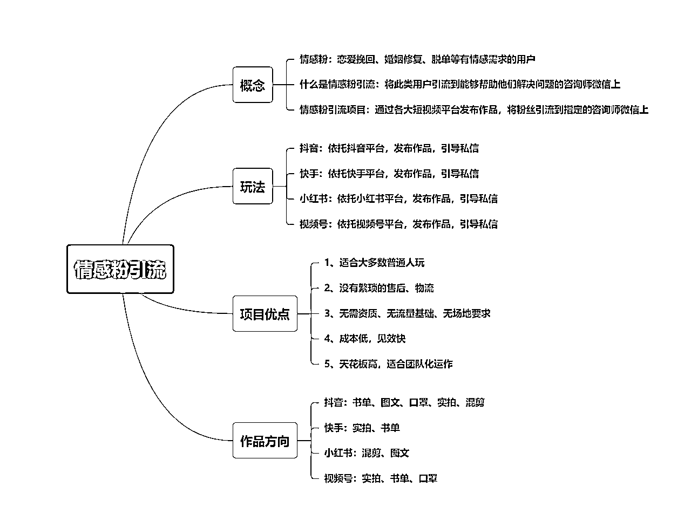

# 1、情感粉引流概念

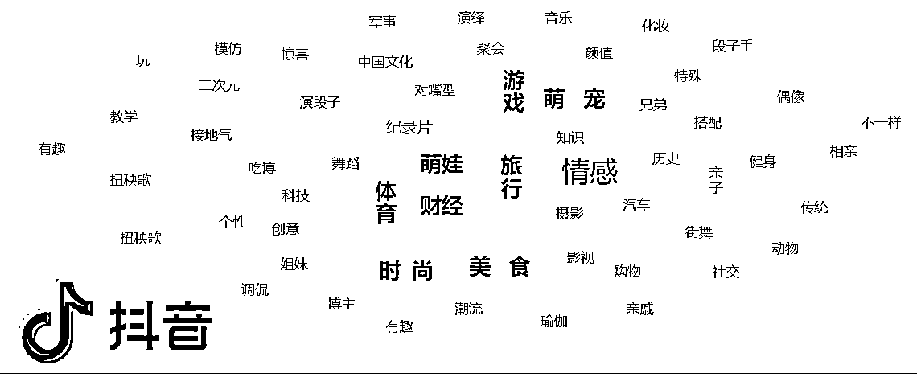

## 1）概念

在各大短视频平台发布情感类的作品，吸引需求用户添加咨询师微信。

## 2）需求用户

恋爱挽回：指恋爱关系当中的双方因某些原因导致了关系破裂分手以后，一方想要挽回另一方的情况。

婚姻修复：指婚姻关系中的双方出现了关系破裂出现冷战、分居、离家出走、离婚等状况以后，一方想要修复婚姻情况。

婚姻挽回：指婚姻关系中的一方有了小三状况以后，另一方想要击退第三者的情况。

脱单追求：指两个人没有明确恋爱关系，目前关系处于暧昧期或者单相思阶段，用户想要追求另一方的情况。

# 2、作品类型

## 1）作品发布类型：

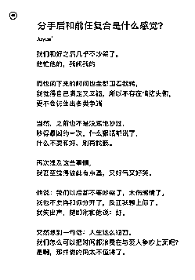

### 鸡汤作品

内容多为表现个人分手后内心情感，引起粉丝共鸣增加账号基础粉丝与账号活跃度，但几乎不能引流

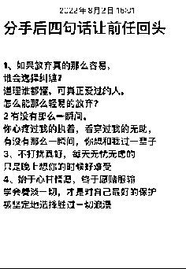

### 半精准作品

一般内容为分手后的一些表现，但作品内容适用范围较广，所以吸引的粉丝群体跨度大类型多，可用于引流。

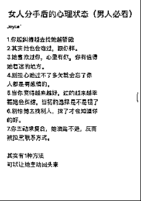

### 精准作品

多为精细到某一个事项或者情况的讲解，反映的情况与内容定位准确，吸引的粉丝群体类型统一，可用于引流

## 2、作品制作类型

### 书单号

用一个适合的图片做为背景然后在里面排版情感文案，输出成7秒左右的视频。

### 口罩号

口罩号其实就是搬运和伪原创，简单理解就是把A号的口播视频下载下来，截取合适的人物形象，再把B号的口播视频下载下来，只要里面的声音，再用A号的人物和B号的声音合成在一起，再给这个人物带上一个口罩特效，最终形成一个视频去输出。

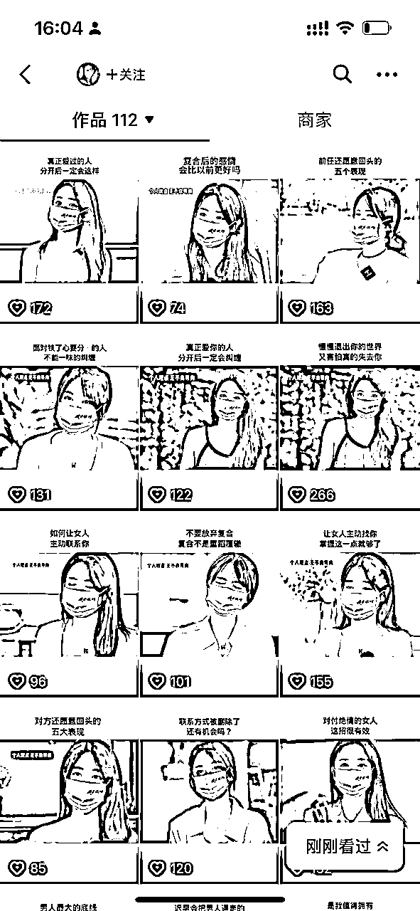

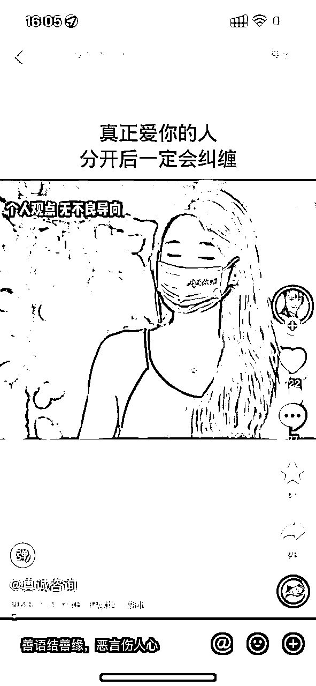

### 混剪号

混剪号其实就是伪原创，简单理解就是把A号的口播音频下载下来，再去混剪一段视频长度和音频时长一致的视频，最终形成一个视频去输出。

### IP号

主要就是口播类型的帐号，就是一个人对着镜头或者侧对着镜头去分享一些情感相关的知识，从而吸引粉丝产生兴趣，达到引流的目的。门槛要求较高，一般不做考虑。

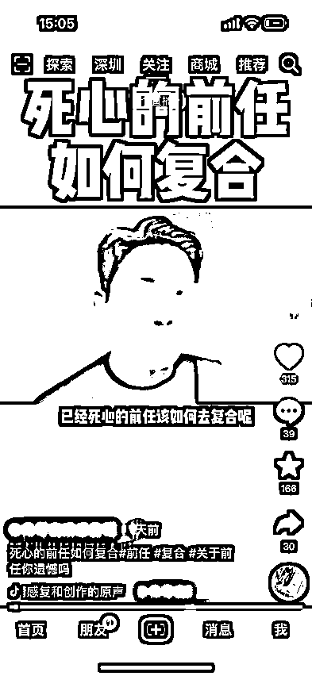

### 实拍号

实拍其实主要也是为了保证原创的一种方式，通过实拍的视频，加上文案的标题，把文案的正文内容打在简介里面。一般快手和视频号用来发布。

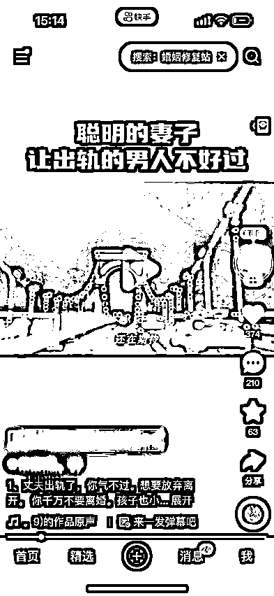

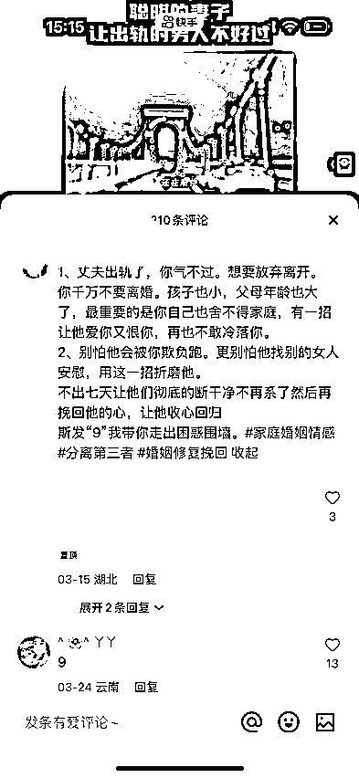

制作难易程度：IP号>混剪号>口罩号>实拍号>书单号

投产比（投入产出比）：书单号>口罩号>实拍号>混剪号>IP号 (仅供参考)

抖音常用：IP号、混剪号、口罩号、实拍号、书单号

快手常用：实拍号、书单号

视频号常用：口罩号、实拍号、书单号

小红书常用：混剪号、图文

# 3、获利逻辑

简单来说：就是制作作品，在短视频平台上发布，将精准用户引流到能够帮助他们解决问题的咨询师微信上。你就会产生收益。一般是次日结算，长期合作也可周结月结。

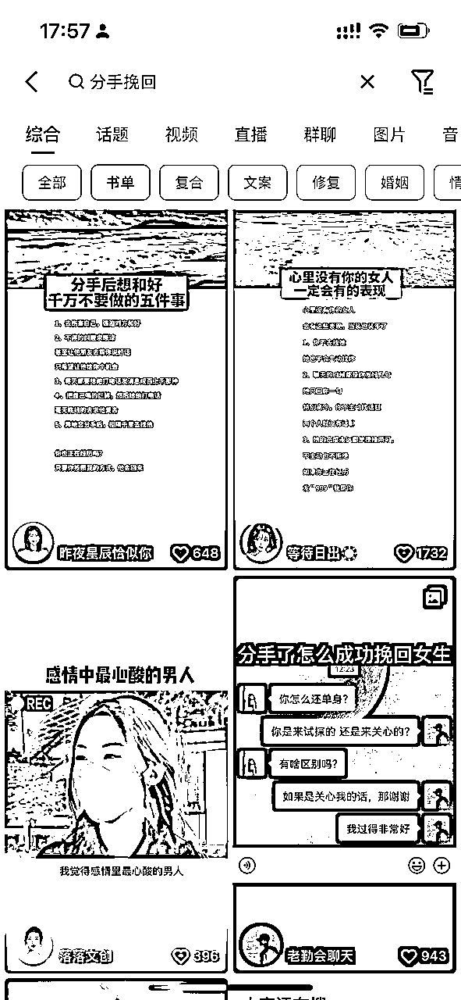

# 4、相对比其他项目的优势。

## 1）无需粉丝基础

无需营业执照，无需拍摄视频，无需直播带货。

不需要依靠自己的流量或者基础粉丝去宣传，0基础就可以开始。

## 2）无需繁琐的售后服务

传统电商发货后还需要对接物流，售后处理各种问题，退换货的琐碎事情。

虚拟电商还需要自己整理课程，整理资料，自己销售转化。

引流根本不需要这些工作，更不需要拿货压货，没有资金链问题，不需要自己花时间去转化，几乎就是0成本创业。

仅仅就是做好作品上传，回复私信的工作即可。

## 3）适合多群体下场

无论你是学生、教师、上班族、宝妈、副业党.....都可以做情感粉引流项目。

<情感粉引流>操作难度不大，时间自由，上手快，每个人都可以抽出时间做，哪怕你已经有其他项目。

做好主业，解决温饱；做好副业，锦上添花；主业副业结合，飞龙在天。

# 5、行业前景

有需求即有市场，很明显这个情感需要是每个人一辈子都会遇到的，它是不会断了，也就是可以是一辈子的生意，而且很明显当社会发展得越来越好，人的物质水平越来越高，会有更多的人去追求精神上的满足，这其中情感是不可或缺的一部分。