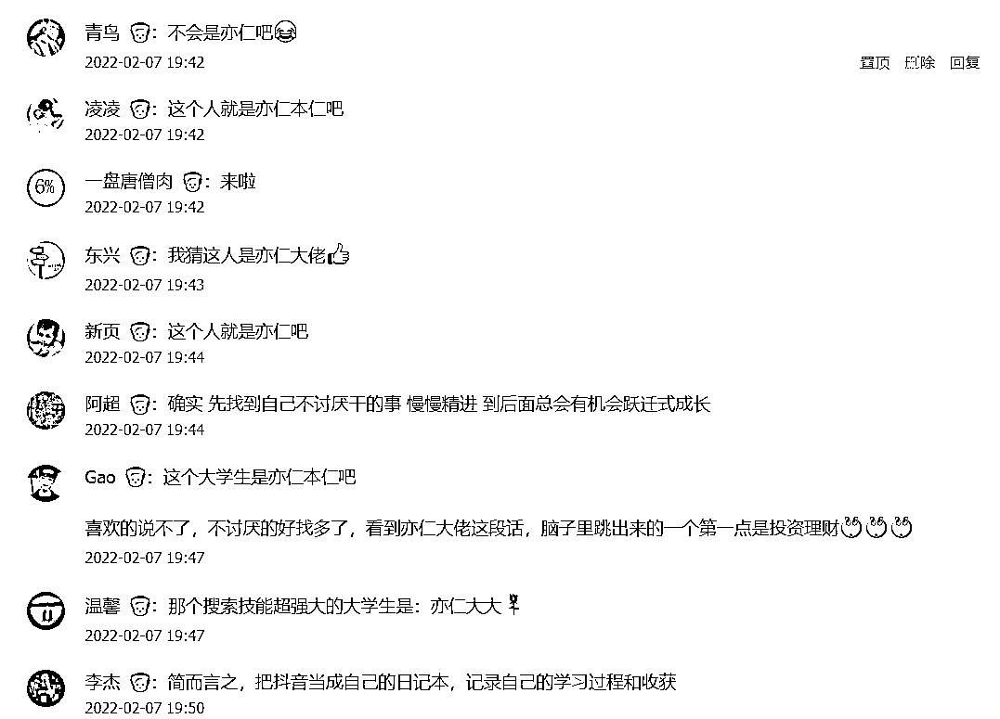

# 《普通人不知道如何做什么的小故事思考》@亦仁

> 来源：[https://shengcaiyoushu01.feishu.cn/docx/QhJudGRcgoQlxGxYU67cndJenjh](https://shengcaiyoushu01.feishu.cn/docx/QhJudGRcgoQlxGxYU67cndJenjh)

### 亦仁分享

我有一个很重要的观点想分享给所有人。

开工后，很多圈友要跟着大航海去做抖音，但不出意外，很多人会遇到一个问题，我到底要在抖音讲啥啊？？？

我啥啥都不是。

跟抖音上那些做的好的人比，我是要颜值没颜值，要口才没口才，要专业没专业，要认知没认知，要情绪没情绪，甚至要槽点没槽点，比丑都比不过那些真正丑的，简直可以说，平平无奇到极致，普通人本普。

别怕，其实几乎所有人都是这样。

但，这仍然不妨碍我们去抖音，并从抖音赚到钱。

想听我的思路吗？

* * *

「跟抖音上那些做的好的人比，我是要颜值没颜值，要口才没口才，要专业没专业，要认知没认知，要情绪没情绪，甚至要槽点没槽点，比丑都比不过那些真正丑的，简直可以说，平平无奇到极致，普通人本普。」

什么叫普通人？

就是不知道自己擅长什么，自己会的，身边人也会；别人不会的，自己也不会。

也没什么很喜欢干的事情，就普普通通，平淡无奇。

这应该是多数人的现状，很正常。

但是仔细想想，一定有一个点，你比身边的人，更不讨厌去干吧？

仔细想想，一定有的。

比如，比很多人更不讨厌成为一个普通人，嗯，也算，可以分享：如何长期拥有一个甘为普通人的好心态？

热爱的找不到，不讨厌的还找不到吗？

注意，这个点，对于普通人来说，不讨厌去干的事情，可能就是你的天分小火花。

找到这个点，呵护这个点，放大这个点，就能找到你的天分与赚钱的结合点。

星星之火，可以燎原。

我来举几个例子：

你是程序员，但你更不厌其烦的和产品沟通需求；

你是大学生，但你更不厌其烦的学英语；

你是宝妈，但你更不厌其烦的给宝宝读绘本；

你是老板，但你更不厌其烦的思考薪酬体系；

你是打工人，但你更不厌其烦的寻找可以兼职做的副业；

你是互联网运营，但你更不厌烦的和用户沟通；

你是开实体店的，但你更不厌其烦的考虑店铺在哪里选址；

你是做餐饮的，但你更不厌其烦的让来吃饭的用户加个微信；

。。。

别小看这个「不讨厌」、这个「不厌其烦」，这些事对有些人来说，真的是讨厌死了，给多少钱都不愿意干。

找到这个「不讨厌去干」的天分后，剩下的事情就容易了。

反正不讨厌，那不如找来相关的书和课，每天学一点并在抖音拍视频和直播分享出去。

边学边教，每天学每天教。

越学越会，越会越喜欢，越喜欢越擅长，越擅长越在抖音受欢迎，越受欢迎越赚钱，越赚钱越愿意去学。

这就进入到一个正向循环，找到天分和赚钱的结合，做着自己喜欢干的事情，还顺带赚了钱。

总结为一句话：

找不到自己喜欢和擅长的事情，那就找自己不讨厌去干的事情，持续边学边干边在抖音分享，剩下的交给时间。

最后，分享一个小故事：

有一个大学生，苦恼于自己没有任何优势和擅长，也不知道自己未来要干嘛，直到有一天，他发现自己好像更不讨厌去搜索引擎「搜东西」。

别人「搜东西」搜了一会找不到就没耐心放弃了，他不一样，掘地三尺也要搜到，因为他不讨厌干这事，反正也没其他事干，那想要什么，就慢慢搜吧。

慢慢的，他的搜索技能越来越强，直到有一天，他发现搜索技能和赚钱还能有一些结合点，就搜索到了一些赚钱机会，嗨，试了一下，真的赚到钱了。

后来的故事，就很顺利了。

越学越会，越会越喜欢，越喜欢越擅长，越擅长越赚钱，越赚钱越愿意去学。

你猜这人是谁？

### 该贴评论区的圈友互动

