# 飞书能帮助MCN行业解决什么业务上的问题？

> 来源：[https://d24gxr9obe.feishu.cn/docx/VQuGd5TikoAEaAxqMSJc4gslnye](https://d24gxr9obe.feishu.cn/docx/VQuGd5TikoAEaAxqMSJc4gslnye)

# MCN行业背景

## 什么是MCN

MCN（Multi-Channel Network）是一种多频道网络的产品形态，将PGC内容联合起来，在资本的有力支持下，保障内容的持续输出，从而最终实现商业的稳定变现。随着直播、短视频、电商等网红经济产业渠道不断扩展，国内的MCN机构在各大平台的助力下迅速扩张版图，并衍生出了头部IP型MCN、电商型MCN等不同类型的MCN机构。

MCN行业的业务内容可以总结为三大板块

* * *

## 行业产业链

（摘自华经产业研究院）MCN是整个产业链的中流砥柱。MCN处于整个产业的中游，上游对接各种内容方，下游延伸至社交、电商等各类平台方，由平台方分发至用户端，是连接产业链各方的中心枢纽。

MCN存在的必要性在于其平台的发言权。一方面，其向上游延展自建品牌、背靠平台升级为直播代运营公司、掌握品牌主资源向新媒体营销公司转型；另一方面，其借助平台力量，并通过设定规则对产业链准入门槛和利益分配两个核心问题施加影响。因此，MCN实际上加速了短视频内容等形态的自媒体产业的发展，它令内容方、平台方和品牌方的沟通更加高效，使得多方可以达成共赢。同时，MCN机构在内容创作、流量曝光、商业变现上的支撑也十分关键。作为规模化的运营机构，MCN自身拥有的成熟创作经验、海量广告及电商资源、头部MCN巨大的影响力以及更高的议价能力，可以为新网红带来更舒适便利的创作环境、更优质的商业变现机会、更频繁的曝光机会和更高的毛利率，最终提高内容变现的速度和效率。

## 市场规模分析

根据艾媒咨询调研数据显示，2021年MCN机构数量的增长率保持稳定，预计2022年MCN机构数量将超40000家，市场规模将超400亿；2025年机构数量预计将超60000家，市场规模接近750亿元。2018年至2025年(E)，MCN行业市场规模CAGR高达31.04%。MCN行业的发展形势在很大程度上受到中国经济态势的影响，可以说中国经济是中国MCN行业发展最主要的驱动力，自2018年至2021年，中国居民人均消费支持及教育文化娱乐支出总体保持稳定增长态势，随着中国疫情管控政策的逐渐调整，未来国民在文化娱乐方面的消费欲望将得到进一步释放，为MCN行业市场的发展提供动力。

## 组织架构参考

从组织架构来看，MCN机构一级架构根据业务内容进行拆分：短视频、直播电商、渠道投放部等，同时根据规模大小会对具体的职能部门进行细化，各司其职。

## 行业痛点

## 

* * *

# 飞书在MCN行业的最佳实践

## 飞书解决方案One Page

## 短视频制作

### 短视频题材创意如何沉淀

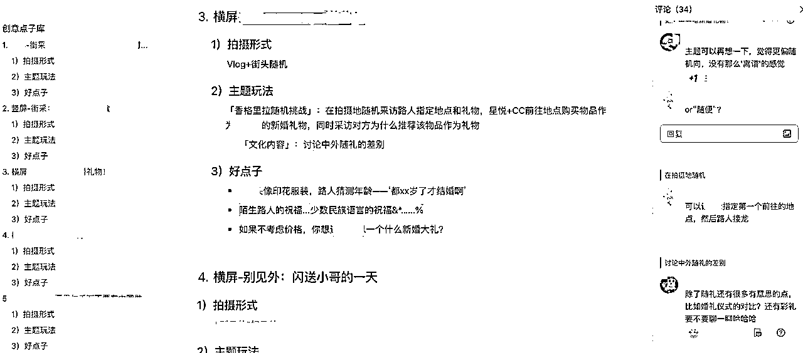

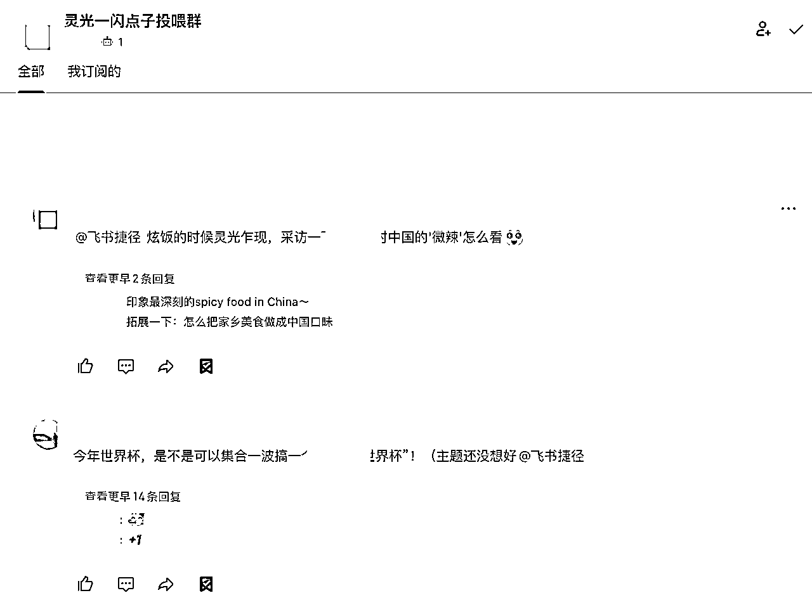

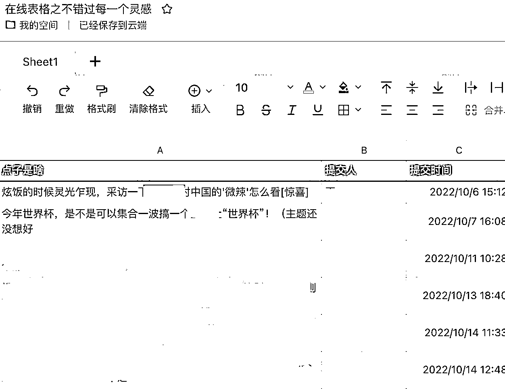

Before

这些创意有的被记录在白板上，有的被记录在电脑中，会后再通过拍照保存下来，创意被散落在各处，有些同事'灵光一闪'的点子又不知道如何同步给大家，团队成员之间存在'创意'信息差

After

在创意会时，使用飞书云文档记录下每一个'灵光一闪'，大家可以通过划词评论的方式留下自己的问题、建议或所有有趣的想法，把好创意沉淀下来

在话题群中@飞书捷径机器人，将创意自动收录

### 把控视频排期，问题早发现

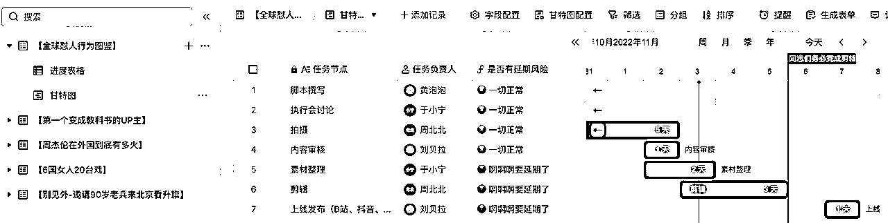

Before

Excel管理视频排期，临时改期时不方便把新排期快速同步给团队成员；排期过程中的节点进度像'黑盒子'，等到视频需要上线时才知道出现了延期

After

节点改期自动同步团队成员，一键生成甘特图，人手一份最新排期计划；出现节点延期时自动提醒预警，过程管理透明化，提前干预，将延期风险最小化

### 飞书 x 剪映，视频剪辑一体化方案

### 飞书 x 抖音 联合方案

自动获取抖音互动数并定期自动通知，减少人工统计数据的工作，视频动态即时通知

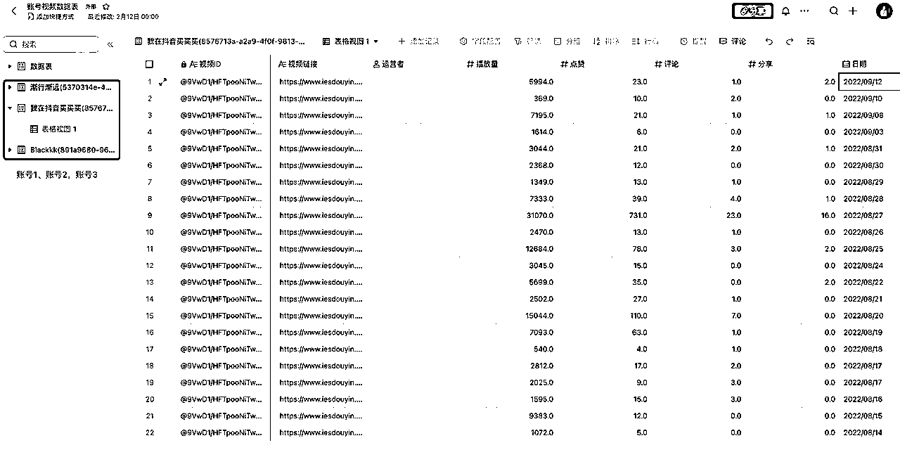

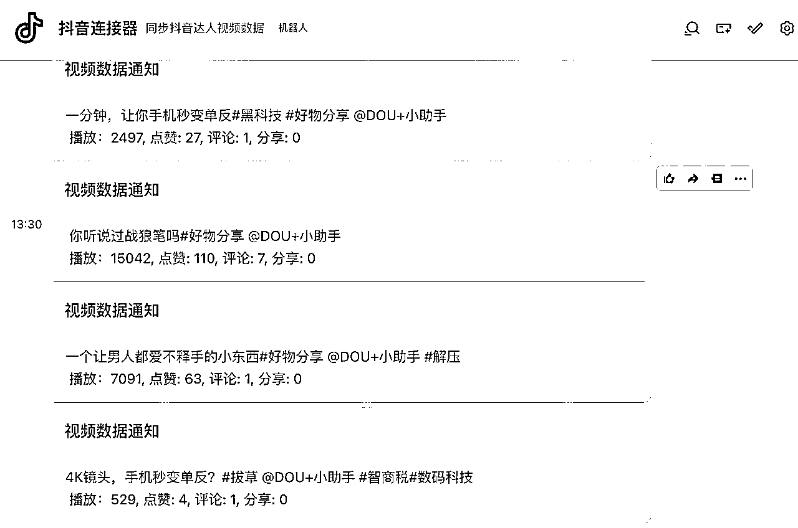

### 飞书知识库，填平过去踩过的"坑"

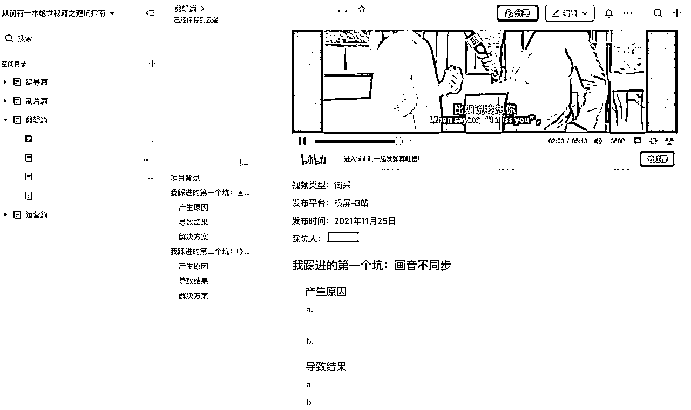

Before

过往工作中遇到大大小小的问题，遇到一次解决一次，却没有将问题和经验沉淀下来，之后遇到相同的问题难免再次'踩坑'

After

使用飞书知识库，将每次遇到的问题和对应的解决方案记录、沉淀下来，定期分享'避坑指南'；新人入职后可以快速了解前车之鉴，降低试错成本

### 视频标签化，帮助打造爆款视频

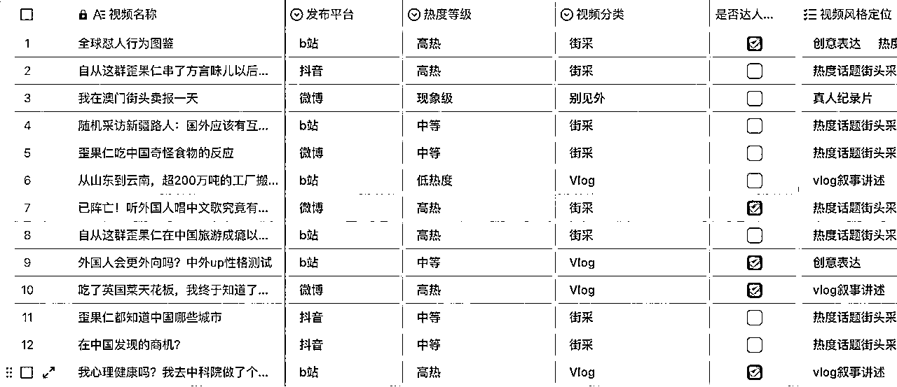

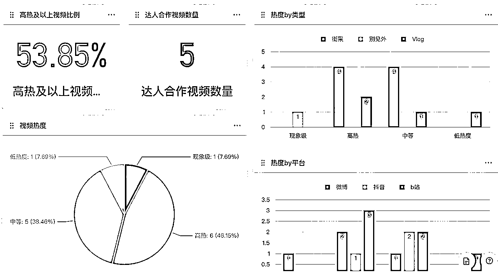

Before

没有对上线的视频做有效的跟踪，不知道为什么这个视频火了，而另一个视频却没有达到预期，拍一个试一个，花了大量时间精力的作品却反响平平

After

使用多维表格管理将每一个视频标签化，方便进行归因、总结和分析，轻松了解视频特征与热度之间的关系，哪类视频更容易火从此一目了然，更容易打造现象级视频内容

## 渠道投放

### 一张表管理所有投放项目，自动获取投放数据

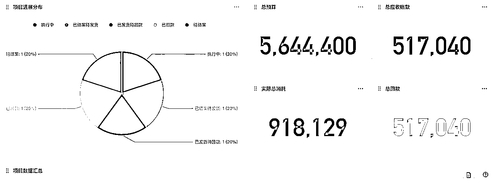

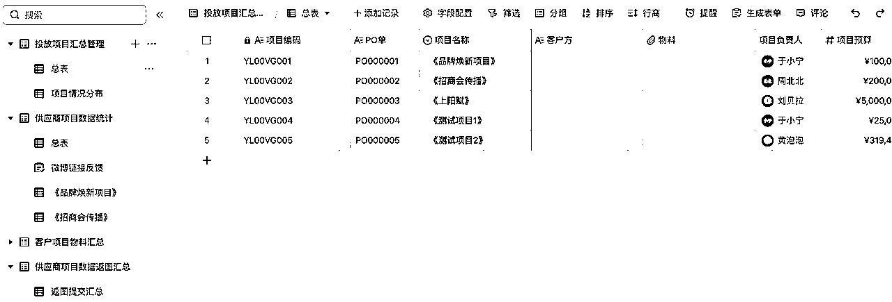

Before

一个投放项目，需要跟多方对接，在多个工具之间跳转；几千条博主投放，手动汇总互动数据，费时费力还易出错；每次周例会都需要花费大量时间汇总统计分析数据

After

一张表管理所有投放项目全生命周期；RPA自动统计投放的互动数据，省时省力保证数据准确性；仪表盘数据联动表格数据，每周自动推送

## 电商直播

### 让选品高效、及时、准确

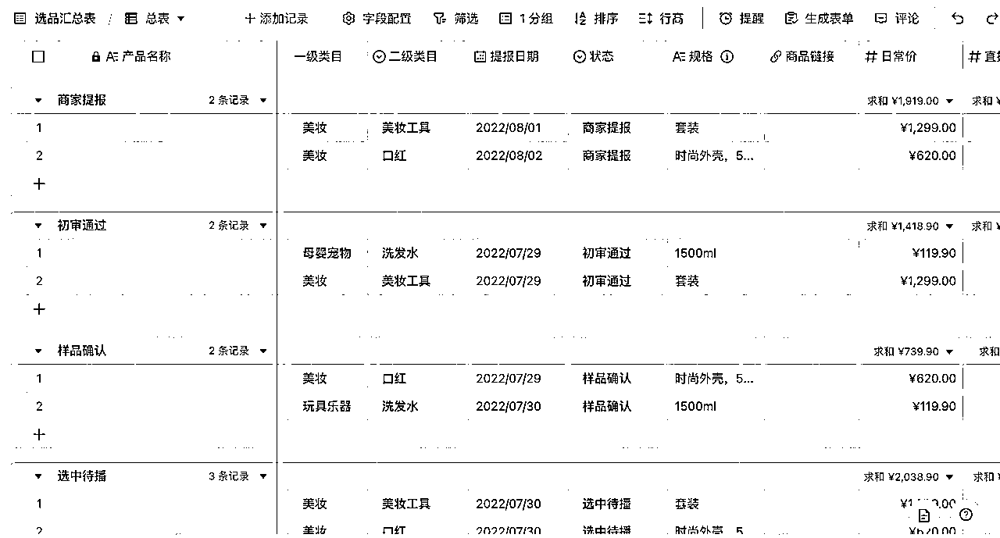

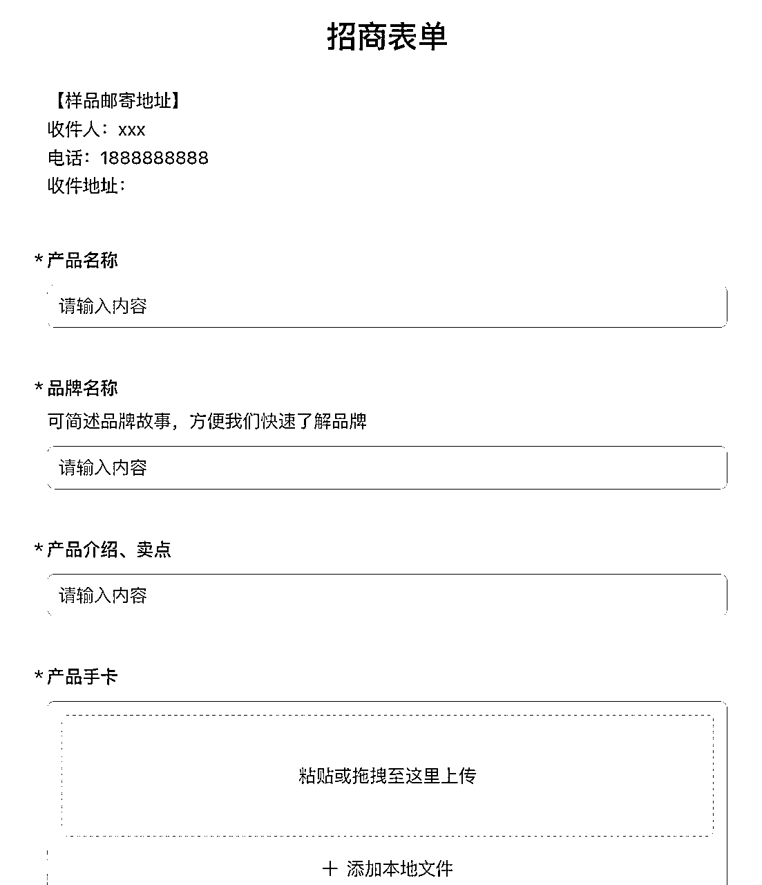

Before

商务部门对接品牌方后，需要通过Excel手动汇总多品牌方、多行业的商品信息，费时费力且容易出错，一旦有修改难及时更新

选品直到开播前仍有改动，负责人及中控无法实时准确掌握选品数据，影响决策效率和线上直播

After

一张多维表格管理所有直播选品，从品牌方提报到试用评审最后到上播，轻松把控各个产品的全生命周期

品牌方通过表单提报产品信息，自动同步汇总到表格中，数据实时更新，无需人工复制粘贴，选品状态有变自动提醒相关人

### 各环节责任落实到人，为直播保驾护航

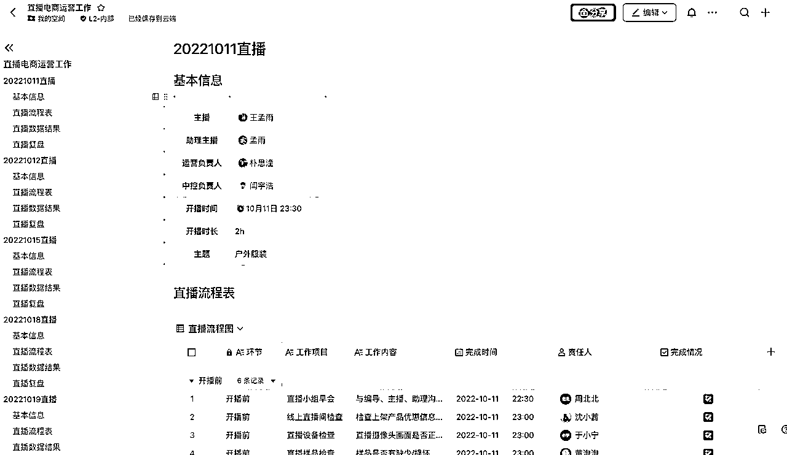

Before

直播从前期准备策划到开播最后到下播复盘，整个流程涉及到大量的工作和角色，使用线下沟通确认的方式了解责任人的任务完成情况，整个过程繁琐且容易遗漏，一个疏忽就会影响整个场次的效果

After

使用云文档列明每次直播的逐项任务信息，@对应负责人，设置提醒时间，总负责人可以看到各个环节的完成情况，保证直播全过程万无一失

### 当多维表格成为直播统筹调度中心

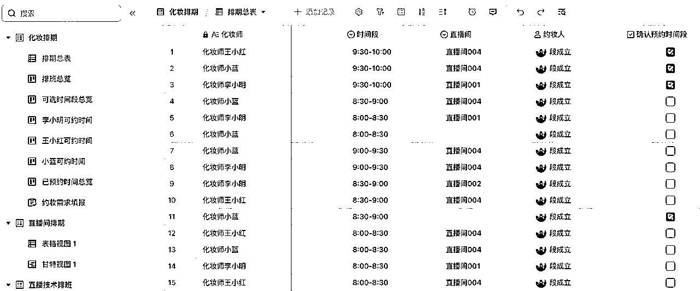

Before

主播、直播间、化妆师、化妆间...，一场直播从前到后需要协调多方资源，一方排期出错就会打乱整个直播的节奏，协调过程中还需要大量的人工沟通

After

一张表清晰管理各方时间安排，同时在多维表格上预定的时间可以同步到飞书日历，日程开始前自动提醒，一张表完成查看空闲时段、预订、签到全过程，成为公司直播的统筹调度中心

### 飞书妙记助力话术复盘

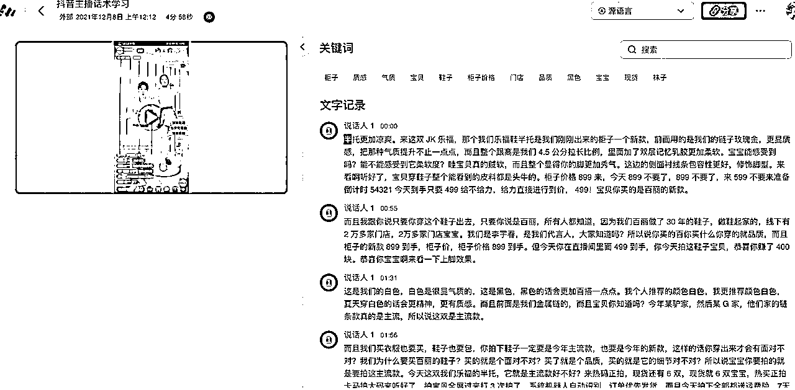

Before

主播、助播、运营每天都需要花一定时间观看小时榜，从其他直播间学习、收集直播话术；公司做完一场直播，也需要对整个直播过程进行复盘，反复打磨话术，以为之后的直播做好准备。但这个过程往往是需要人工分角色扒取，费时费力，人效不高

After

将直播视频一键上传飞书秒记，自动生成话术文字记录，根据不同的角色，对说话人进行区分，对觉得可以优化的地方，划词评论留下意见建议，并可生成飞书云文档进行知识库存档

### 飞书知识库，帮助知识收集、沉淀、传播

Before

直播电商有许多“知识”，优秀话术脚本、互动技巧、违禁词、客户话术等等，每块“知识”都放在一个文档里，散落在一个一个文件夹中，需要时不知道去哪去找

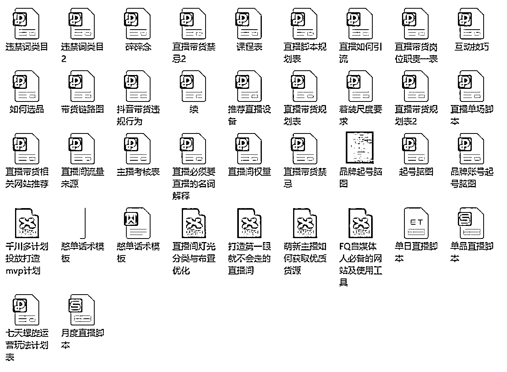

After

将宝贵知识资产进行收集、分类，沉淀到飞书知识库中，将知识结构化，随用随取，一个知识库，让知识就在手边；也可根据角色权限设置知识库可见范围

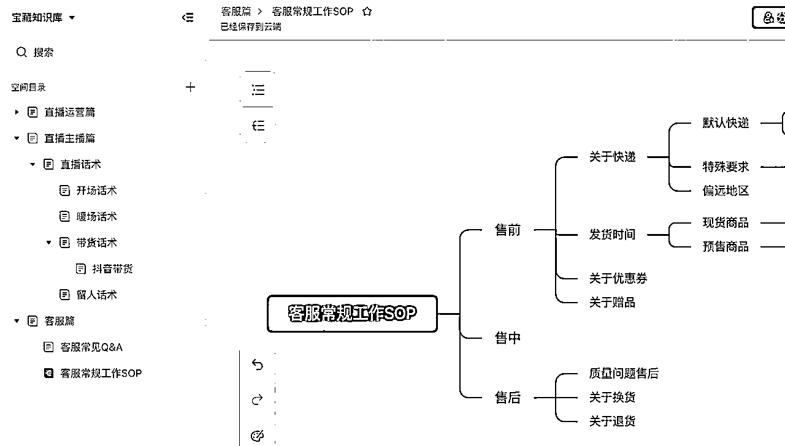

### 主播业绩考核不再繁琐

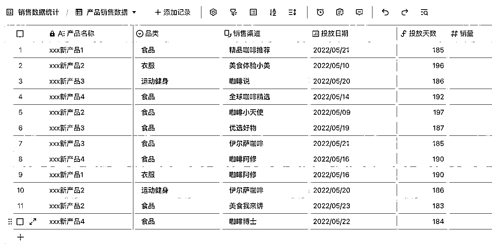

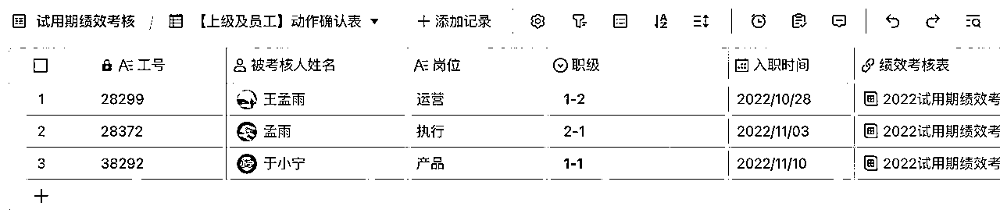

Before

线下考核主播业绩，每个主播一张Excel绩效考核表，每次更新内容都需要专门发送给相关同事；把所有主播的绩效考核表都保存在文件夹中，多且杂乱

After

使用多维表格结构化汇总所有主播的绩效考核内容，使用高级权限进行权限隔离，使用一张表管理的同时，保证了数据安全，同时满足管理的双重需求

# MCN行业客户飞书市场活动

## 官网案例

### 多维表格达人管理一年能节省多少钱？（客户案例）

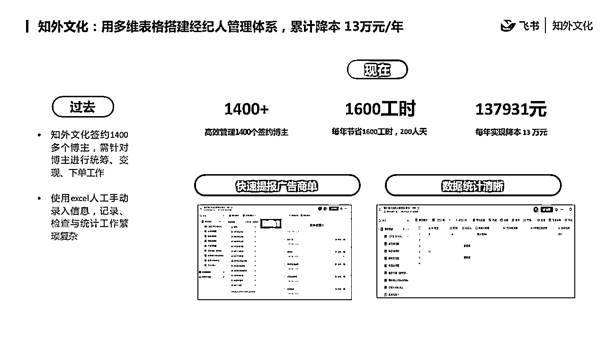

## 客户故事

大家有问题可以多交流