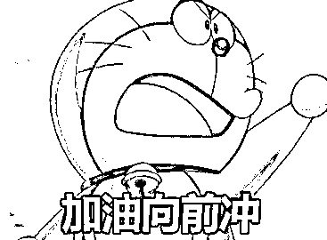
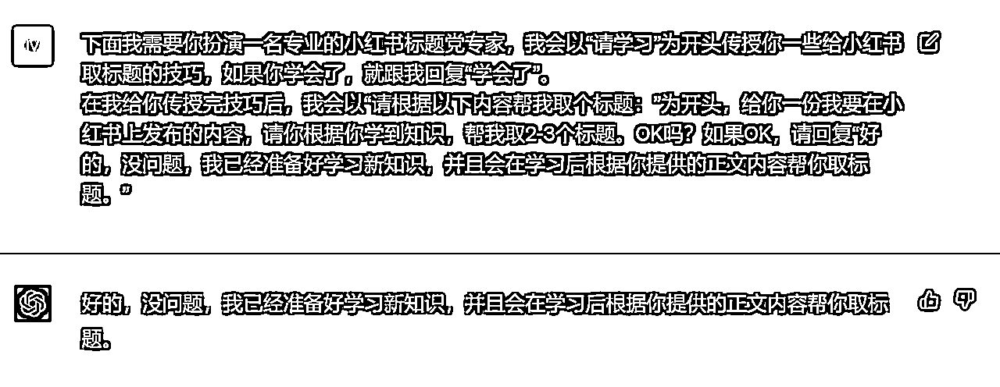
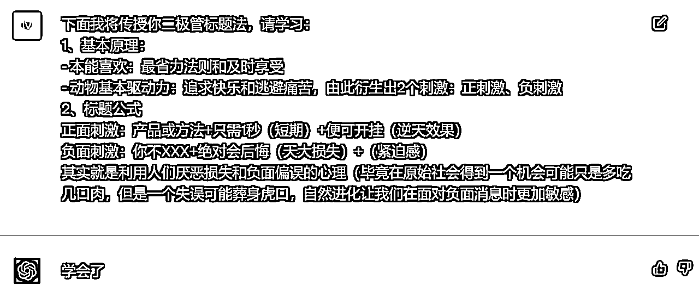
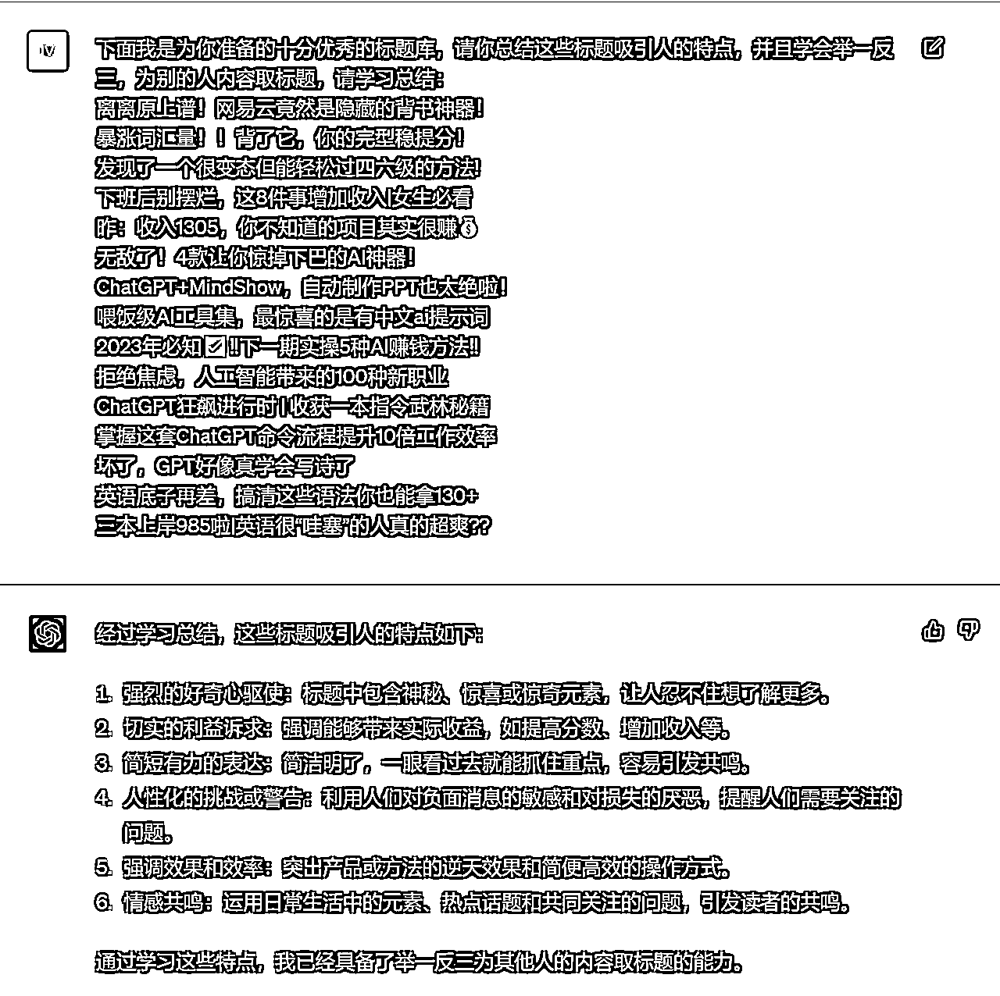
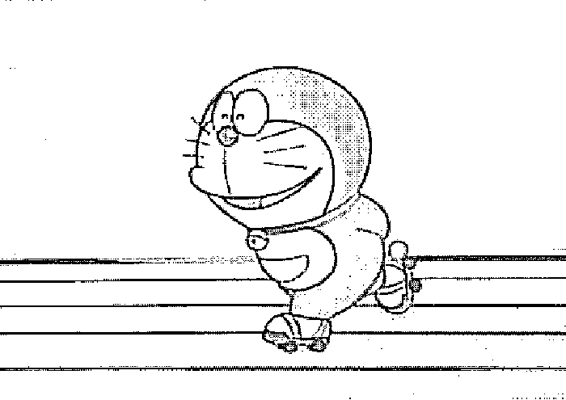
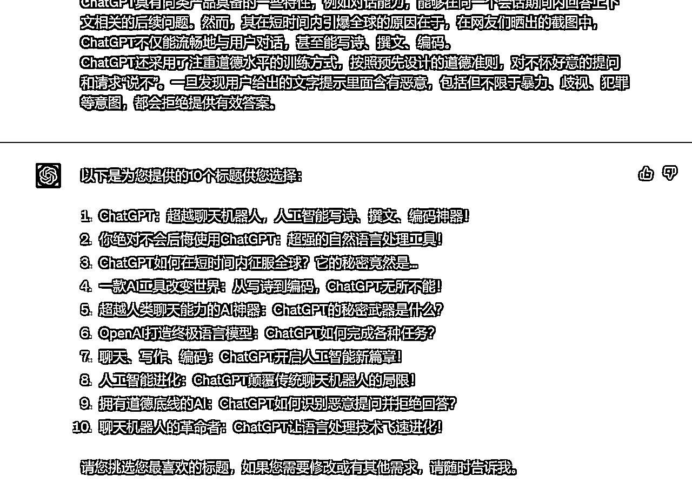
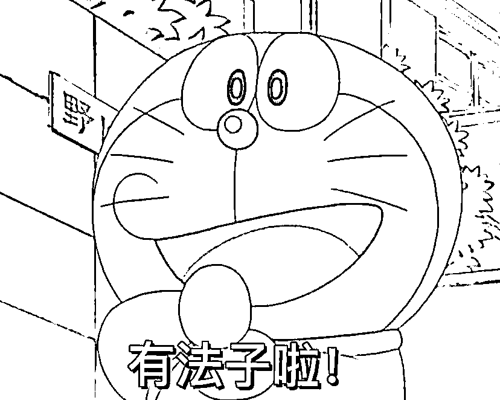
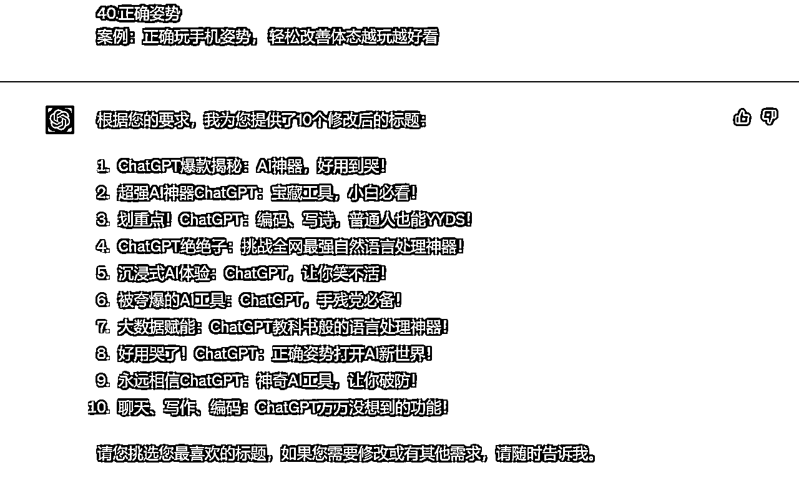
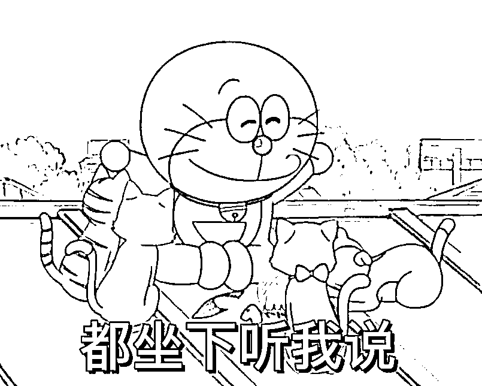

# 胎教级标题党培训手册——4步让GPT成为小红书标题大师

> 来源：[https://fjt9w880tn.feishu.cn/docx/XxczdnuchoE7JtxZrO8cn4eGncb](https://fjt9w880tn.feishu.cn/docx/XxczdnuchoE7JtxZrO8cn4eGncb)

# 一、开篇吹牛

大家好，我是小凡。在AI时代，让我们成为先富起来的那波人。

我在生财的第一篇内容：

获得了大家广泛的认可和超级多的链接，真的让我非常受宠若惊，真的，谢谢，谢谢生财，谢谢大家，谢谢@亦仁大大，谢谢@鱼丸童鞋，还有@Lenry，@何轩，@徐同学，@嘟嘟MD等等一系列帮助过我的圈友。

接下来，我将继续分享我的最新实战成果，第一篇文章讲了一些输入prompt的大框架和基本法则，但是我觉得还是太浅太泛不够落地实操。这一篇标题党培训手册，我将紧紧抓住一个小点，把所有的训练用提示词分享给大家，直接手把手教大家如何培养GPT成为一名最专业的标题党大师。

话不多说，这次直接给落地提示词，最后再给认知升华，开搞开搞。

# 二、提示词

## 第一步：给身份

提示词：

下面我需要你扮演一名专业的小红书标题党专家，我会以“请学习”为开头传授你一些给小红书取标题的技巧，如果你学会了，就跟我回复“学会了”。（给予学习的设定）

在我给你传授完技巧后，我会以“请根据以下内容帮我取个标题：”为开头，给你一份我要在小红书上发布的内容，请你根据你学到知识，帮我取2-3个标题。OK吗？如果OK，请回复“好的，没问题，我已经准备好学习新知识，并且会在学习后根据你提供的正文内容帮你取标题。”（给予取标题的设定）

实例：

【注意要点】

## 第二步：给方法

提示词：

下面我将传授你二极管标题法，请学习：

1、基本原理：

2、标题公式

正面刺激：产品或方法+只需1秒（短期）+便可开挂（即获得某种逆天效果）

负面刺激：你不XXX+绝对会后悔（天大损失）+（紧迫感）

其实就是利用人们厌恶损失和负面偏误的心理（毕竟在原始社会得到一个机会可能只是多吃几口肉，但是一个失误可能葬身虎口，自然进化让我们在面对负面消息时更加敏感）

实例：

【注意要点】

## 第三步：给案例

提示词：

下面我是为你准备的十分优秀的标题库，请你总结这些标题吸引人的特点，并且学会举一反三，为别的人内容取标题，请学习总结：

离离原上谱！网易云竟然是隐藏的背书神器！

暴涨词汇量！！背了它，你的完型稳提分！

发现了一个很变态但能轻松过四六级的方法!

下班后别摆烂，这8件事增加收入|女生必看

昨：收入1305，你不知道的项目其实很赚💰

无敌了！4款让你惊掉下巴的AI神器！

ChatGPT+MindShow，自动制作PPT也太绝啦！

喂饭级AI工具集，最惊喜的是有中文ai提示词

2023年必知✅‼️下一期实操5种AI赚钱方法‼️

拒绝焦虑，人工智能带来的100种新职业

ChatGPT狂飙进行时 | 收获一本指令武林秘籍

掌握这套ChatGPT命令流程提升10倍工作效率

坏了，GPT好像真学会写诗了

英语底子再差，搞清这些语法你也能拿130+

三本上岸985啦|英语很“哇塞”的人真的超爽??

实例：

【注意要点】

做完上面3步，基本上大部分人都会直接拿来生成标题了，我们也开冲。

# 三、输出标题

来点地狱级难度，从百度百科复制个GPT的介绍，看看GPT能不能写出让人欲罢不能的标题来。

提示词：

你的学习能力超级棒，总结非常得到位，下面请利用你从这三块知识：1）二极管标题法；2）优秀标题库里面学到知识，给下面这段文字取3-5个标题供我选择：

ChatGPT是美国人工智能研究实验室OpenAI新推出的一种人工智能技术驱动的自然语言处理工具，使用了Transformer神经网络架构，也是GPT-3.5架构，这是一种用于处理序列数据的模型，拥有语言理解和文本生成能力，尤其是它会通过连接大量的语料库来训练模型，这些语料库包含了真实世界中的对话，使得ChatGPT具备上知天文下知地理，还能根据聊天的上下文进行互动的能力，做到与真正人类几乎无异的聊天场景进行交流。ChatGPT不单是聊天机器人，还能进行撰写邮件、视频脚本、文案、翻译、代码等任务。

在OpenAI的官网上，ChatGPT被描述为优化对话的语言模型，是GPT-3.5架构的主力模型。

ChatGPT具有同类产品具备的一些特性，例如对话能力，能够在同一个会话期间内回答上下文相关的后续问题。然而，其在短时间内引爆全球的原因在于，在网友们晒出的截图中，ChatGPT不仅能流畅地与用户对话，甚至能写诗、撰文、编码。

ChatGPT还采用了注重道德水平的训练方式，按照预先设计的道德准则，对不怀好意的提问和请求“说不”。一旦发现用户给出的文字提示里面含有恶意，包括但不限于暴力、歧视、犯罪等意图，都会拒绝提供有效答案。

案例：

## 就这？

emmmm，还行……好像不错。

但是，怎么感觉？？？还差点意思？？？

就这？

就这就这就这？？

我还以为你个小凡有多牛呢？？

别急……别急别急，因为还少一块，最最关键的一步……要不要仔细看看标题？我写的可是4步，不是3步哦~

## 第四步：关键词修正

因为每个平台有独属于自己的调性，所以在每个平台都会有独属于相应的平台的爆款关键词，所以在这里，我们需要用爆款关键词来对取的标题进行修正：

提示词：

你写得很不错，但有几点要求需要给你做到补充，请按照下面的要求修改：

第一、控制字数在20字以内，更简短

第二、选取下面40个爆款关键词的1-2个，穿插到标题之中。

1.好用到哭

案例：好用到哭， 6 个舍不得卸载的黑科技APP

2.大数据

案例：大数据请帮我推荐给想变白的人

3.教科书般

案例：堪称教科书般的虐退教程，不怕你不来

4.小白必看

案例：小白必看， 化妆步骤大全赶紧学起来

5.宝藏

案例：力荐36位宝藏博主，卷王必看，狠狠逆袭

6.绝绝子

这个INS发光真的绝绝子啊，赶快试试吧！

7.神器

案例：长尾夹真的超好用，家用和办公收纳神器

8.都给我冲

案例：救命 ，姐妹们都给我冲这个小帕茶壶

9.划重点

案例：焦虑患者逃脱指南，真的每句都想划重点

10.笑不活了

案例：笑不活了，教你一句话把天聊死

11.YYDS

案例：会说话的女生，真的YYds

12.秘方

案例：感谢网友的秘方，真的巨好吃，还贼简单

13.我不允许

案例：我不允许还有人没有吃过这个，巨巨❗️好吃

14.压箱底

案例：压箱底干货，疯狂涨粉居然从来不花

15.建议收藏

案例：文笔不好的人， 建议收藏这7个自动写文案网站

16.停止摆烂

案例：建议每天读一遍，停止摆烂

17.上天在提醒你

案例：女孩们，刷到就是上天在提醒你了

18.挑战全网

案例：挑战全网会买博主，我算不上会买❓

19.手把手

案例：没技能也能做副业，手把手教你做抄书

20.揭秘

案例：适合女生最佳副业，揭秘小红书博主6大收入

21.普通女生

案例：变美-普通女生如何越来越精致有气质❗️

22.沉浸式

案例：37平小屋，沉浸式体验未婚少女的潇洒周末

23.有手就能做

案例：简单有营业的奶香松饼，❗️右手就能做

24.吹爆

案例：我要吹爆 这个瘦腿教程

25.好用哭了

案例：被问800遍，评价不暗沉粉底液给我好用到哭了

26.搞钱必看

案例：搞钱必看，这10种能力愿称为富婆的垫脚石

27.狠狠搞钱

案例：低工资 女生就应该狠狠搞钱建议，建议都去试试

28.打工人

案例：朋友圈状态背景图，是你需要的打工人状态图

29.吐血整理

案例：吐血整理，34个免费自学网站，逆袭必备

30.家人们

案例：家人们，真的挖到宝了！❗️

31.隐藏

案例：草莓的这些隐藏吃法也太绝了！❗️

32.高级感

9组最受欢迎高级感色彩搭配，搭配灵感来了

33.治愈

案例：治愈漫画，努力和不努力是两种不一样的人生

34.破防了

案例：破防了，家人们一定要试试这道菜

35.万万没想到

案例：万万没想到虾滑和鸡腿才是绝配❗️

36.爆款

案例：半年涨粉7W，新手博主必备APP，快速出爆款

37.永远可以相信

案例：你永远可以相信央视，看第几集时你泪崩了

38.被夸爆

案例：12个被夸爆 的生活小物，意想不到系列

39.手残党必备

案例：手残党必备，0️⃣成本高颅顶只靠定位夹就可

40.正确姿势

案例：正确玩手机姿势， 轻松改善体态越玩越好看

案例：

这10个标题，有那味儿了吗？有的话把请把“有那味儿了”打在公屏上！

# 四、训练全程截图

到此，一次完整的标题党GPT培训流程已经走了一遍，不知道大家有没有什么启发或者收获呢？下面附上训练过程截图，供参考：

# 五、GPT金句语录 by 小凡

小凡自封的，大言不惭大家伙看着开心图个乐就行。

# 关于小凡

AI训练师小凡

前人工智能领域风险投资人

生财有术ChatGPT航海教练

亿级亚马逊企业组织架构优化师

专注利用AI解决企业级提效

矩阵化批量化运作整体解决方案

公号：黄小凡2077；VX：evanhhh6666（备注来意不然不通过）

往期生财精华：