# 看了100+精华帖后，我梳理了一套赚钱的知识体系（超全新人指南！）

> 来源：[https://mkfwp3u79v.feishu.cn/docx/doxcnk4mqgBMJTv0mklq0eR48fg](https://mkfwp3u79v.feishu.cn/docx/doxcnk4mqgBMJTv0mklq0eR48fg)

自我介绍：

我是七小，99年的深圳靓仔，知识管理专家。

精通搜索、采集、内容整理、关键词挖掘，擅长把碎片化信息整合成体系化的知识产品来变现。

江湖人称生财课代表，专业解决生财新人圈友的各种问题，致力于帮助圈友发挥好生财有术的价值。

微信：rickea150，添加请备注：生财圈友 。欢迎交流。

公众号：七小的人生游戏攻略

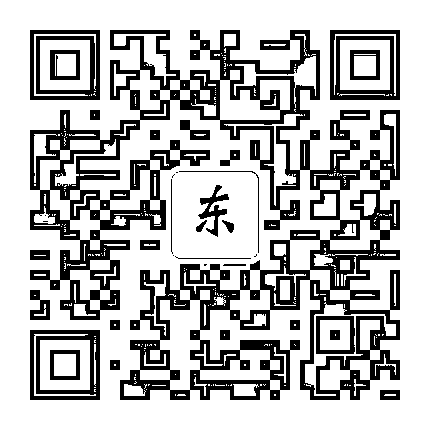

* * *

# 一、前言

各位生财圈友好呀，我是七小。

作为刚加入星球不到一个月的新人，第一次露面，按照社群的惯例，我先来和大家做个自我介绍吧~（有一丢丢长，请耐心看，和后面要讲的正文内容相关）

* * *

我是七小，99年深圳小伙，自由职业者，2021年毕业后是教人高效学习的学习博主，2022年逐步向互联网创业博主转型。

我对搞钱这事一直都很感兴趣。

从2017年大一开始就在尝试各种兼职和项目。做过英语口语推销、驾校代理、旅游代理...在毕业季卖过鲜花、回收过洗衣机，在开学季卖过洗衣机、电话卡，平时闲来无事还给其他同学代课 ...

在大学期间有两个项目取得过还算不错的小成绩。

1）2019年3月第一次做驾校代理，单月开了20单，赚了个1W ；

2）2019.06~2019.09，和三位合伙人在珠三角各大高校卖洗衣机，做了320W的营业额，团队盈利20W，我分了个5W。

在经历了许多小项目实践之后，我感觉自己的实战经验还算充足了（以当时的眼界来说），但是理论基础薄弱了。于是在2020年开始就没做项目，去研究【学习底层方法论】和看【商业知识】去了。

后来取得了两个成绩：

1）我成为了教人高效学习的学习博主，在学习成长上帮助过200+学员。

2）成为了百万粉新商业笔记社区【笔记侠】的2021年度达人。

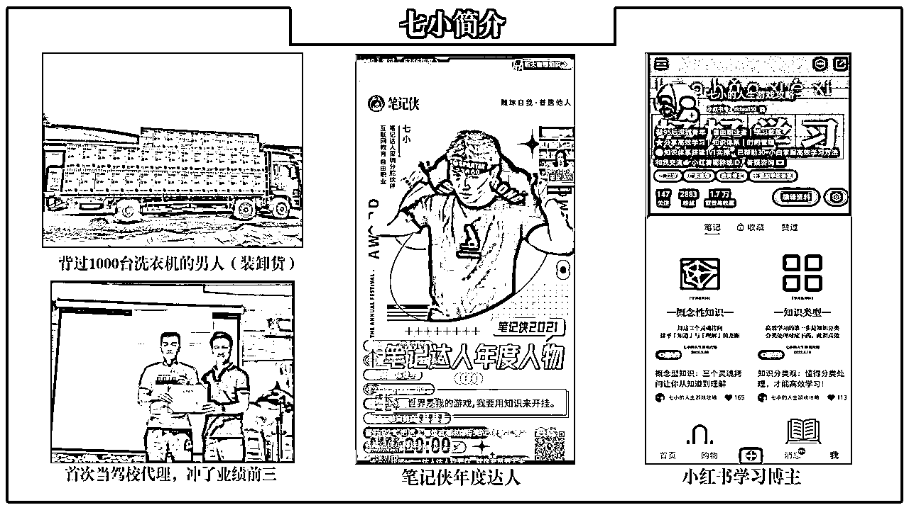

* * *

我的经历讲到这里，可以提炼出两个关键句：

1）非常擅长学习，精通知识整理。（在笔记侠里整理过数十万字的商业稿件）

2）爱好搞钱，既有搞钱的实战经历，也有搞钱的理论研究

来到生财之后，我就在想：在生财有术这个圈子里，我要从中收获什么？我又要给大家贡献些什么呢？

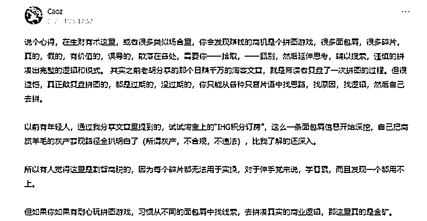

偶然看到曹大的帖子，【拼图游戏】这个词启发到我了，结合我自身的特长，我想到了：

既然我这么擅长知识整理，并且也非常想弄明白【赚钱到底是怎么一回事】，那我要不，先看100+生财的精华帖，然后结合自己过往的经历，对知识提炼整合，拼出一套赚钱的知识体系出来？

这样既满足了自己的求知欲，给自己的搞钱能力打下了坚实的基础；同时也能降低其他新人圈友的学习成本，帮助其他圈友更高效的吸收生财里的精华。一举两得呀~

主意不错，那就开搞！于是有了这篇文章。

# 二、赚钱的本质是什么？

## 1）赚钱这件事到底是什么？

赚钱到底是一件什么样的事情？我们先来看看各位大佬的理解。

Caoz：

我们谈到所谓赚钱，其实核心思想是，交易，只有交易才能给你带来金钱。

那么什么是交易，不是只有你出去做销售，卖货是交易；你在职场获取一份offer，也是一种交易；你创业，创建一种商业模式，所谓商业模式，就是交易模式。

首先，建立一个认知基础，理解一切皆交易。

来源：https://wx.zsxq.com/dweb2/index/topic_detail/582511151218254

刘小排：

不管是做什么企业，最终都绕不开三个字——卖东西。

🪡 最高雅的说法是：「创业」「商学」

🪡 普通高雅的说法是：「商业」「做企业」

🪡 普通的说法是：「做生意」「赚钱」

🪡 最俗的说法是：「卖东西」「搞钱」

然而，以上词语，全是同义词。

听上去怪怪的？

但商业世界的真相就是这样。我是30岁以后才看透这一点的。

来源：https://articles.zsxq.com/id_59tz5lf5aadw.html

明白：

赚钱，是结果，是做某件事情的结果。

只想着结果，而不考虑达成结果需要什么过程的人，是肯定赚不到钱的。

就好像，一个人想要长寿，但他并不做长寿的事情，比如饮食、锻炼、睡眠等。这个人怎么可能长寿。

所以，如果你想赚钱，应该想的是：我要做什么「事情」，才能让我赚钱。

来源：https://wx.zsxq.com/dweb2/index/topic_detail/118818854252482

做自己擅长的事，把技能树打通，然后再去赚钱

来源：https://wx.zsxq.com/dweb2/index/topic_detail/844145541882282

拱卒：

回到问题本身我粗浅的认为，“钱”的底层逻辑是价值的交换或者说是“交易”、“买卖”那么回归找挣到一百万我们去考虑的是

怎么为他人创造“远超一百万的价值”利他才是最大的利己用这个思维模型去思考

来源：https://wx.zsxq.com/dweb2/index/topic_detail/582855588185544

花爷：

对普通人而言，没钱没权，第一桶金大多是靠信息差获利来积累的。

生产力提升之后，我们的生活质量都上升了，生活质量一上来，整个社会就开始分层了。

不同地域、收入、兴趣的人，解构成一个一个小圈子。不仅富人跟穷人玩不到一起去，甚至富人和富人之间、穷人和穷人之间，互相也看不对眼。

社会圈层被解构成无数个小圈子，触达所有圈层的难度增大了，流通的价值也就增大了。

信息差里的“差”，就“差”在这里。社会越发达，圈层越多，差值越多，信息差获利就越容易。

来源：https://wx.zsxq.com/dweb2/index/topic_detail/548814145851214

纵横：

一切生意的本质是流量；一切交易的本质是信任。

来源：https://wx.zsxq.com/dweb2/index/topic_detail/182848115558552

提炼一下以上大佬讲的关键词：

Caoz：交易、资源、买家、稀缺、影响力、信用

刘小排：卖东西

拱卒：利他、创造价值

花爷：圈层信息差

明白：做事、结果、擅长、优势

纵横：生意、流量、交易、信任

上面这些解释里，我个人最喜欢的解释是曹大和刘小排老师的，结合起来讲就是：

赚钱=交易=卖东西=买卖

我以这个简单的解释为基础，下面来讲赚钱和其他关键词之间的关系。

## 2）赚钱就是卖东西，那么能卖什么？

赚钱=卖东西，听到这段话，对于那些从没卖过东西的小白来说，就有些头疼了。

他们的内心独白是“卖东西？我该卖些什么呀？我不知道我有啥能卖的 。TAT”

星主亦仁是这么说的：

亦仁：

2\. 基于用户需求设计话术/产品

什么叫产品？

万物皆产品，只要能满足需求。

一套话术，一段文案，一个眼神，一个电话，一篇文章，一个课程，一个商品，一个咨询，一个关心，一套方法论，一本书，一次交谈，一个回答，一个社群，一本日历，一套方案等等。

以上皆是产品，只要能解决对方的问题。

从这个角度，我们说创业要有自己的产品，是不是感觉创业容易多了？

来源：https://wx.zsxq.com/dweb2/index/topic_detail/818221142114152

对于这个问题，我的理解是：目光所及之处，皆是商品。只是看你卖给谁，怎么卖而已。

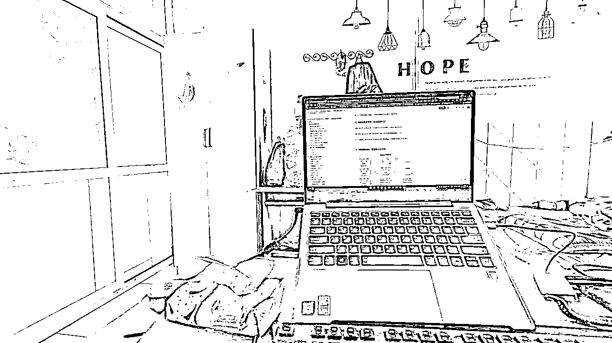

以我在房间里随手拍的这张照片为例。

商品有：门、口罩、纸巾、电脑、键盘、水桶、书包、床单、一拖四转换器接口、网页中的这篇文章、以及生财星球里其他大佬的文章。

这些东西可以怎么卖？

比如说，我可以去拼多多或1688买10箱纸巾，20小包口罩，囤在房间里。然后给房东送一箱纸巾一包口罩，让允许我在本栋楼入口处打个广告。贴个广告纸，需要的住户来403找我买。 口罩加价1包加价5块，纸巾1箱加价10块。（线下实体生意）

或者，卖无线鼠标键盘和转接口，去拼多多上复制产品介绍的图片文案，挂到闲鱼上，做无货源发货。（互联网无货源玩法）

或者，我看了生财大佬的文章，觉得特别有启发，大佬说的话纠正了我许多错误的思维，我觉得我陷入的思维误区肯定也有很多人也踩过坑，这些知识我教给其他人也一定对他们很有帮助。那么我可以发条朋友圈广告：周日开一场专题分享，讲讲赚钱路上常见的10种思维陷阱。收费9.9元/人。（互联网虚拟资源玩法）

目光所及之处，皆是可以卖的产品。此时此刻你所看到的任何一项物品，一定有人靠它年入30W以上。

先抛开个人实际情况，单从赚钱的角度出发，其实任何东西都可以卖，都可以赚到不小的钱的。

（该部分的内容，主要是让大家打开视野，下部分我们来讲考虑实际情况的话又怎么思考。）

## 3）赚钱和筛选项目有什么关系？

对于市场来说，卖什么都有人年赚30W以上。但卖同样的商品，我们未必能赚30W！

比如说上面我随手拍的照片，左侧的滑动门，一般人哪干的了卖门的生意嘛。家里囤点纸巾口罩还ok，卖不掉自用或送朋友都行，但是家里囤几扇门...这就太奇怪了。

所以呢，虽然什么都能卖，什么商品都能赚到钱。但不是什么商品，都能作为我们的长期业务去做。想要长期的、赚到满意的钱，我们必须挑选项目。

那么问题来了，如何挑选一个适合自己的商品去卖呢？

这里我参考了这几位大佬的文章，结合我的个人理解，制作出了这张图：

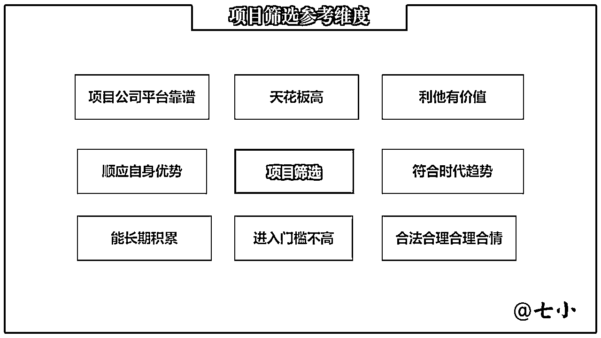

这张图里有8个维度，我挑2个对普通人最重要的维度来重点讲讲：

关于优势：

V先生：

001\. 兜兜转转，你会发现，一个人很难摆脱自己的天赋、爱好、行业积累去做事。

- 没有天赋，做不强；

- 没有爱好，做不久；

- 没有行业积累，很难赚钱。

不是什么风口都可以抓，不是什么机会都是自己的机会。风口和机会都是立足于天赋、爱好、行业积累之上的。

012\. 不同人的特质不同：

- 有人适合做内容型产品人（如做付费专栏、做课程）

- 有人适合做工具型产品人（比如开发一个小程序、一款App）

- 有人适合做媒体人（比起单纯写作，媒体人更要有网感，懂传播）

- 有人适合做运营人（比如社群运营、搞线上活动、搞线下活动）

- 有人适合做商务人（铺渠道、搞客户关系、拉生意、或者一对一销售）

- 有人适合做品牌人（如做品牌策划、设计VI手册、设计活动海报、做包装）

- 有人适合做管理人（如定战略战术、盯目标、做复盘、开会、培训团队、组织活动）。

如果一件事没做好，不用自我攻击，也不用被别人的批评干扰，陷入低谷，你可以停下来想想，自己最适合做什么。你让郎朗去打篮球，让姚明去弹钢琴，既对他们俩都带来苦恼，也浪费了社会资源。

国产教父：

杜国楹说过一句话“短期看优势，长期看趋势”。

很多时候我们看懂了，不代表能把事情落地，不代表能把事情做好，更不代表能够把想法变现。

所以，我们要清楚自己的优势到底在哪里，当我们看明白趋势后，如何在趋势内用自己最擅长的点去找到属于自己的机会。

进入门槛不高：

明白：

毕竟，巧妇难为无米之炊，有成功案例，我们才能吸取他们的精华，为自己所用。

而且，选案例不能盲目，要找和自己行业、能力、资源相匹配的案例，这样更容易总结出适合自己的方法。

这个公众号的读者，应该大部分是偏向自由职业，或者在工作同时做副业，属于「小微创业者」，那就不能参考大企业的案例，例如：「淘宝/微信/百度/抖音」，即便分析出结果，也无法给自己带来帮助。

因为大公司资源强大：金钱、渠道、流量、品牌、合作伙伴等等，动辄几千万、几个亿的预算，他们的成功，是在这些资源的基础上建立的，所以他们的经验，对普通人的参考价值不大。

我们要找「精益创业」的成功案例，因为「精益创业」接地气，并不依靠太多的金钱，而是靠人的知识、能力、以及各种方法，获得收益，这类案例的方法/思路 更适合我们。

七小思考：

世界上什么事情都有人去做，都有人做成功，赚到大钱，但是我们去做不一定能成功。

所以，我们去挑选项目，必须要结合自己的兴趣、优势、能力、资源来考虑。

项目有前途很重要，但这个有前途的项目是我能做的，我承接得住，更重要！

七小补充：

有的朋友可能会想问，以我当前的兴趣、优势、能力、资源，我觉得我挑不到好项目怎么办？

我的回答是：你现在能做什么，你就先做着，为你下一份项目打好基础做铺垫，时机合适了，你再切换到下个项目。当你的能力、资源越来越好了，你自然有资本挑选好的项目了。

做项目，是个打怪升级的游戏，你的项目给你带来财富的速度呢，是渐进的：

步行→跑步→骑单车→电动车→摩托车→私家车→跑车→飞机→火箭→ ...

最开始能做的项目一般，没关系，只要它能够锻炼你的能力，给你积累资金，让你有资本切换到下一个更好的项目就够了。

有些项目的作用就是「桥」，而非「终点」，你做它一时就行，不用做它一世。

其他维度的内容，大家可以在这些文章里找到出处：

参考资料：

#轻享# 赚钱是一辈子的事——国产教父 （优势、趋势）

https://wx.zsxq.com/dweb2/index/topic_detail/548824112588444

如何用清单思维，打造自己的赚钱兵器库？——明白

https://mp.weixin.qq.com/s/krRi6eY0_j5Dcs8f2nVNlw

「已经跑通了一项业务，怎么做才能提高天花板，赚更多钱？」

https://wx.zsxq.com/dweb2/index/topic_detail/841184522141482

如何分析一个互联网项目的可行性？能否值得去做？——战劲

https://wx.zsxq.com/dweb2/index/topic_detail/241158845554181

内容创业锦囊：001~030——V先生

https://wx.zsxq.com/dweb2/index/topic_detail/182542155825542

内容创业锦囊：031~060 ——V先生

https://wx.zsxq.com/dweb2/index/topic_detail/182544812158512

## 4）别人为什么要从你这里买东西，让你赚钱？

这块内容，徐蒙老师的这篇小品文写的特别棒，我就不画蛇添足了，直接摘抄给大家看看：

徐蒙：

赚钱的本质是啥？？？是不是你卖了一个东西出去？

那为什么别人要从你这里买呢？

是不是只有三种可能？

第一，他不知道别的地方可以买；【信息不对称】

第二，他不方便从别的地方买；【交付不便利】

第三，他不相信其他人；【信用不传递】

我一边觉得被肿安娜羞辱了，一边说对；

她接住我的白眼继续说：

“为啥不知道别的地方可以买呢？因为你以为人人皆知的事情至少有一亿人不知道，而一般来说是【十亿人】不知道，比如你知道竟然有人在网上卖google earth安装包吗？那个难道不是直接可以在网上下载吗？对~但是他们就是不知道~”

“为啥不方便从其他地方买呢？你出去鬼混的时候在便利店买过套套吗？你不知道京东可以送货上门吗？那好，你让妹子等着呗”

我的白眼已经飞天上去了。

“为啥不相信其他人？因为信任这玩意就是一种莫名其妙的东西，你待会喝完这杯美式去上厕所总不会觉得我要把你iphone11promax给偷了跑掉吧？为啥？因为你信任我。但是凭啥呢？你也说不清对吧，okay，所以我就可以卖东西给你，但是隔壁这位正在相亲的大姐就不行”

我瞟了一眼旁边那位喝焦糖玛奇朵看上去有50岁的阿姨，表示赞同；

“好了，明白了上面三件事， 你可以干嘛？

你要找到把什么卖给谁这件事，换而言之，你要找到【信息不对称】，【交付不便利】，【信用不传递】之类的事情，你就能做能赚钱”

比如呢？你打游戏吗？你知道打游戏也能利用【信息不对称】赚钱吗？https://t.zsxq.com/A233baa

你们在银行还是经常用企查查吧？那个包年也不贵吧？想过一条一条卖给想和中国人做生意的老外吗？就因为他们不懂中文 【交付不便利】 https://t.zsxq.com/zzn6Q3V

至于【信用不传递】这个就拿你自己举例子吧，你不是之前在日本当讲师吗？你那群死忠留学生学生，你卖点啥给他们他们不哭着喊着买的？

“。。。你说的有点道理”我无言以对；

来源：https://wx.zsxq.com/dweb2/index/topic_detail/215128812554251

## 5）赚钱和圈层有什么关系？

综上前4部分的内容，加上花爷、低调、刘小排三位大佬的文章，我做了下图。

先介绍一下上半部分的内容灵感来源：

低调：

大家特别喜欢说的一个话：你赚不到你认知以外的钱。

那我们就统称为认知差决定了我们赚钱的高与低。

我把认知差分为三要素：资源差，技术差，信息差。

来源：https://wx.zsxq.com/dweb2/index/topic_detail/585244142288214

刘小排：

赚钱的真相只有一个——卖东西。

很俗，但你没有看错。

进一步拆解。

一般而言，“卖东西”分为两种情况：

所谓“东西”，又分为两种情况：

世界上只有两种商业模式：卖自己的东西、帮别人卖东西。

来源：https://articles.zsxq.com/id_0l9wqp7m2fj9.html

根据两位大佬的话，我梳理出了图的上半部分。

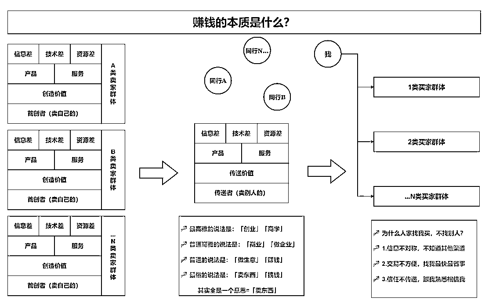

简单来讲，就是：

1）把信息差、资源差、技术差，打造成产品和服务。

2）自己有本事，就自己创造价值，直接卖给消费者。（即是创造者、也是传递者）

3）要是自己不擅长创造，那就做中间商传递价值，从卖家那边获取价值，再去买家群体中释放价值。

4）价值是多样的，我们微信好友干的业务是多样的，他们的需求也是多样的。所以左右两侧是多类买家/卖家群体。

如何在日常生活中发现商机，利用信息差获利有哪些道与术？——花爷

https://wx.zsxq.com/dweb2/index/topic_detail/548814145851214

在存量的世界里赚到钱——花爷

https://mp.weixin.qq.com/s/DE_H3PK2bEaKTMVB8rxUxg

然后看了花爷的两篇讲圈层的文章后，我拼出了图的下半部分。

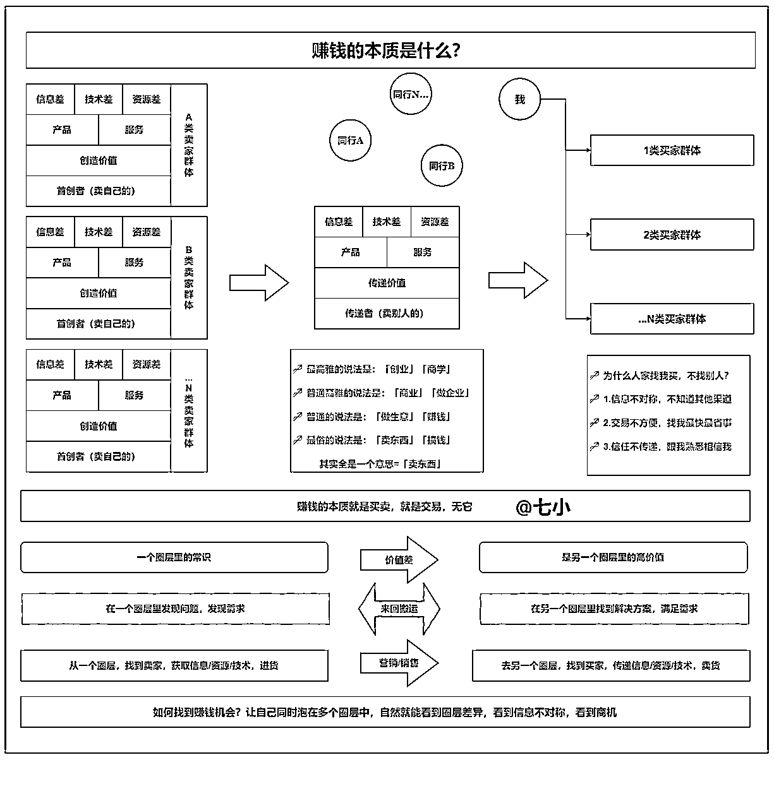

看完了花爷的文章后，再结合自己的经历，我领悟到：

1、一个圈层里的常识，可能是另一个圈层里的高价值。

比如：会薅羊毛的人，懂得从各个平台白嫖/低价蹭会员。百度网盘年度会员官方渠道298/年，pdd上148~198/年。羊毛党去pdd下单，238卖出去，还有一堆不懂互联网的人，感谢他送优惠呢！

2、一个圈层里“难顶！”（难解的问题），可能到了另一个圈层就变成了“就这？”（超级容易解决）

比如：某人要从知乎/公众号获取上百条文章的内容，只会复制粘贴，要重复上百次，心态都崩了。但是对于懂点爬虫的人来说，开个后羿采集器就完事了。或是对于懂搜索的人来说，去找个公众号/知乎采集器就完事了。

所以，赚钱和圈层的关系是什么？

花爷：

你看，生产力提升之后，我们的生活质量都上升了，生活质量一上来，整个社会就开始分层了。

不同地域、收入、兴趣的人，解构成一个一个小圈子。不仅富人跟穷人玩不到一起去，甚至富人和富人之间、穷人和穷人之间，互相也看不对眼。

社会圈层被解构成无数个小圈子，触达所有圈层的难度增大了，流通的价值也就增大了。

信息差里的“差”，就“差”在这里。社会越发达，圈层越多，差值越多，信息差获利就越容易。

所以：

不要觉得信息差获利是在投机倒把，让价值流通起来，本身就是一种价值。

所谓信息差，本质上是圈层之差，如果你不能理解圈层，你就理解不了信息差。

来源：https://wx.zsxq.com/dweb2/index/topic_detail/548814145851214

七小思考：

1）因为：生产力提升→社会分层加剧，大圈层被解构成N个小圈子→信息差扩大→流通价值扩大

2）因为：赚钱=交易=价值流通

3）所以：让自己泡在更多的圈层中→自己能发现和流通的价值越大→越容易赚钱

4）所以：想赚钱，就让自己泡在更多的圈层里，在A圈层里发现需求，然后从其他圈层里找到解决方案，将其打造成一个产品/服务，然后回到A圈层里去满足需求。这样就能赚到钱。

5）因为差值越大，流通价值越大。所以我们一定要学会去向上学习，向下收钱。

向上学习，进入更高端的圈子，大家都很很乐意。但是进入低端的圈子呢？大家往往会觉得有点自降身价，而不愿意去。但其实，能有超额收益的地方，往往就是在哪些不如你的“低端圈子”。因为你的常识会成为他们的高价值，你的轻而易举是他们的难以置信。你觉得他们是菜，他们觉得你是神呀。

## 6）赚钱和信用有什么关系？

Caoz：

5、信用是一种稀缺资源。

中国很多代工厂，生产很多知名品牌产品，但厂家只能赚个辛苦钱，而品牌方可以赚大头，那为什么品牌方可以赚大头，品牌是什么，品牌的涵盖外延肯定不止信用，但是基于信用支撑的。代工厂为什么赚不到这个钱，因为没有足够的信用支撑。

很多职场人士会遇到一种问题，一些关键岗位，关键任务，老板选择了水平不如自己的人，百思不得其解，我告诉你一个非常重要的规则，老板无法判定水平能力的时候，会优先考虑信用。甚至在能够判定水平能力的时候，也会把信用放在水平的前面，当然，我不是说你信用不好，而是在老板眼里，你的信用不如对方。

为什么“人靠谱”是一个特别重要的评价，甚至超过“能力强”，所有职场人士都应该认真思考这个问题。比如以前常说的，职场靠谱的表现，“凡事有交代，件件有着落，事事有回应。”无论是职场晋升，还是商业合作，或者创业公司争取客户订单，很多事情不是靠技术和产品能力，而是靠信用争取的。

比如我买新房装修，我可能有很多选择，那么谁的水平高，谁的技术好，坦白说，我判断不了，那怎么办，我选一个信用口碑好的，答复积极，沟通坦诚的。做不了的老老实实说做不了，有风险的老老实实说有风险，这种我反而放心。那种什么都承诺，什么都没问题的，看上去好像很好，但是反而是不太敢信任的。

还有就是，比如买东西，很多时候你明知道同一款产品，淘宝和拼多多差价很大，但很多人还是只敢在淘宝天猫店下单，依然是信用成本的考量。

6、信用获取和信用转嫁。

信用是不是只能通过长期的履约积累获得，当然这是最可靠的途径，但其实也有其他方式，比如信用转嫁。

明星代言就是一种信用转嫁，但明星代言翻车的事情也很多了，所以信用转嫁也是有风险的。所谓信用背书也是一种转嫁。

比如说，冯大辉老师如果说你人特别靠谱，能力强，产品观很正。那么子柳老师多半会追着你签投资的TS，你说子柳老师不认识你，但他会认可冯老师的背书。比如说，TK教主说你技术过硬，一个打十个，黄一孟老板马上就会过来跟你谈offer，一切皆可商量。你说黄老板不认识你，但他会认可TK教主的背书。

来源：https://wx.zsxq.com/dweb2/index/topic_detail/582511151218254

七小思考：

赚钱=交易。

信任够了，找你交易，让你赚钱。

信任不够，对方就找别人交易，让别人赚钱去了。

## 7）如何赚更多的钱？

### ①卖的多

V先生：可复购+分销制/代理制

034\. 靠产品赚大钱的三要素：可复购产品×高客单价×分销制/代理制。

三者只要抓住一者，威力就出来了，如果三者都有，那更不得了。

- 刷屏的网络课：低客单×分销制

- 朋友圈的微商：高客单×代理制

- 顾小北优联荟：可复购×高客单

- 生财有术星球：可复购×中客单×分销制

- 樊登读书会员：可复购×低客单×代理制

- 保险公司业务：可复购×高客单×代理制

来源：https://wx.zsxq.com/dweb2/index/topic_detail/182544812158512

### ②卖的贵

Caoz：稀缺方掌控定价权

互惠交易的稀缺方优势，或者说，稀缺方掌握定价权。

资源与买家的博弈中，稀缺方具有定价谈判的优势地位，其实这个也是很容易理解的。

比如汽车，或苹果新款手机从加价到降价，就是一个很典型的案例。

当某些新奇高端产品刚上市的时候，一些富豪买家认为，率先使用是一件超级有面子的事情，富豪对面子的价值判定是高于产品本身的，但由于新品上市，供给非常有限，那么掌握资源的就是优势方，加价成为必然。当供给充分的时候，资源不再是优势方，手握现金的买家才是优势方，那么降价就成必然。

去年疫情的口罩，口罩机，熔喷无纺布的暴涨，都是稀缺方优势的体现。当供给充分后，市场就会发生逆转。

比如前面提到的案例，大佬通过信息获得的价值远高于为信息提供的酬劳，但为什么这个交易可以成立，因为认为这个信息值钱的大佬是稀缺的，而能提供这个信息的人是不稀缺的，所以，这个酬劳其实就很合理。如果你所提供的资源不稀缺，即便对某些人来说价值巨大，但由于潜在的提供者很多，你的资源就不值钱。只有在特定场所，具有稀缺性的时候，它才变得特别值钱，比如你有两瓶矿泉水，在任何城市，这都不值钱，但如果恰好你跟马云在沙漠中心，他水壶漏光了，你就成稀缺方了，定价权就掌握在你手里了。

在人力资源市场也是，一方面，职场底层越来越痛苦，另一方面，顶尖人才越来越贵。顶尖人才永远稀缺，为什么，因为如果不稀缺了，就不是顶尖人才了，这就是我旧文提过的，所谓顶尖人才的标准，其实水涨船高，15年前的技术高手标准，放现在过不了很多巨头甚至中型互联网公司的入门面试。

现代社会采购的常识，尽量选择多方采购，不要让一方通吃，也是尽量不要建立产品的深度依赖关系，不要让供给方变成稀缺方，否则定价权就拱手让出了。

来源：https://wx.zsxq.com/dweb2/index/topic_detail/582511151218254

吴大白：用包装和借力来提高溢价

钥匙扣本身是一个非常普通常见的产品，但上图这个产品卖了17万份，我们来做下简单的拆解。

产品本身：分为两面，一面是年份，一面是二维码，二维码扫进去可以做信息定制。

视频引导中的宣发文案都是比较感性的文字，如：

一生中让你最刻骨铭心的那一年你还记得吗？

你还记得你跟你的另一半是哪一年相识的吗？

人生那么短暂，你还记得你最有意义的那一年吗？

......

可能看到这里，大家应该明白我所表达的意思了，这个钥匙扣本身是一个非常普通的产品，但是因为有了年份和二维码的加入，立马把用户的潜在需求（情感宣泄）给挖掘出来了，此时对于钥匙扣本身的价值已经可以忽略不计，更多的是用户买了这个钥匙扣，能让其情绪传递的潜在需求给挖掘出来。

在评论区还可以看到给老人买一个防丢失，给另一半买一个做表白礼物，给父母买一个然后说出平时不好意思说的话等等。

通过这种挖掘目标用户的潜在需求然后让整个产品瞬间升华了，此时溢价空间已经得到非常大的提升，因为用户买的已经不再是钥匙扣，而是一份情感传递的礼物。

再延伸一下：

卖花的小伙伴是不是可以帮忙代写一封手写信来提高溢价空间？

卖手机的如果目标用户是做tiktok的，那么是不是可以提前把软件和环境都装好，打包一起卖？

卖培训的是不是可以把相关的工具一起谈好折扣给客户提供便利？

......

总之，每一个需求背后都会有着不易发觉的潜在需求，当我们站在用户角度去挖掘这类潜在需求的时候，我们已经比同行领先很多了，并且我们会发觉用户买我们的产品不再局限于产品本身，或许会更看重我们背后所提供的潜在价值。

来源：https://wx.zsxq.com/dweb2/index/topic_detail/212582114822281

### ③卖的多元

纵横：粉丝的变现多样化(商业)

每一个粉丝，都具有多重变现属性。

比如小米公司，卖的小米手机，把用户称之为米粉。

小米手机，只是公司为了获取用户的一级火箭，并且硬件的利润不超过百分之5。

因此名声非常好，受到了屌丝们的拥戴，所有用户都知道，小米手机基本不赚钱，高性比价口碑，把智能手机的价格给压下来了。

通过使用最低的价格，打击同行，让普通人都能买得起手机，获取了大量用户，也就是米粉。

我自己也是手持一台小米9手机，成为了一个米粉，毕竟我喜欢支持国产。

品牌打造成功，拥有了很多用户以后，小米开始卖别的产品，商业多样化变现。

小米的产品有：手机、手机卡、电视、盒子、蓝牙手柄、路由器、平衡车、空气净化器、体重秤、血压计、水质检测笔、移动电源、插线板、耳机、音响、电池、存储卡、保护套、后盖、贴膜和一些小配件、服装、箱包等。

通过卖手机，获取了用户，开发出更多产品，充实自己的品牌。

手机同行赚利润的产品，小米只是为了圈用户，把利润放在了后端的智能家电上，这样的模式下，同行怎么竞争的过？

小米的营销做的非常好，知道把用户多重变现，让用户购买更多的产品。

韩国的三星就是这样的，在整个韩国，从出生到死亡，都得用三星的产品，把人一辈子的钱都赚了，几乎垄断了所有行业。

三星不只是做手机，甚至开了奶茶店，面包房等，只要是能赚钱的行业，三星都干了，垄断的很彻底。

来源：https://wx.zsxq.com/dweb2/index/topic_detail/182848115558552

## 8）看了很多精华帖，为什么还是赚不到钱？

先来看一段明白老师的话：

明白：想赚钱该怎么做？

赚钱，是结果，是做某件事情的结果。

只想着结果，而不考虑达成结果需要什么过程的人，是肯定赚不到钱的。

就好像，一个人想要长寿，但他并不做长寿的事情，比如饮食、锻炼、睡眠等。这个人怎么可能长寿。

所以，如果你想赚钱，应该想的是：我要做什么「事情」，才能让我赚钱。

来源：https://wx.zsxq.com/dweb2/index/topic_detail/118818854252482

### ①赚钱的关键动作不到位

明白老师的话，给了我很大的启发！

我想明白了：“为什么有很多人学了很多，但一直赚不到钱，他们的思维误区到底在哪里”？

做不同的事情，要执行的关键动作是不一样的。

比如：减肥、游泳、赚钱

说到减肥，大家马上想到的是：管住嘴、迈开腿。即控制饮食+坚持运动这两大动作。

说到游泳，大家马上想到的是：在岸上学习划水的正确姿势，下水学习换气、以及亲身在水里扑腾扑腾。

减肥和游泳这两个运动类的事情上，是没有人会认为，单纯通过【看书看视频课】的方式，就能做好的。常识是以实践为主，理论为辅的。

但是一说到【赚钱】，许多人就陷入认知误区了，觉得单纯通过【看精华帖/看各种赚钱教程】，就能提升自己的赚钱能力了。

赚钱的关键动作，不是阅读！不是学习！

而是（以互联网创业为例）：

①产品：自己打造一个产品/ 获得别人产品的代理资格 / 自己进货

②引流：通过在各大平台发布优质内容来获得用户认可，留下钩子来引流加微信

③广告：在朋友圈打广告

④销售：私聊去成交用户，谈复购，谈低转高

赚不到钱，就问问自己：文章/视频创作了多少个？ 朋友圈广告发了几条？私聊了几个用户？

没赚到钱，就问问自己，这些赚钱的关键动作，做到位了吗？

这些关键动作都没做好，那看再多精华帖，整理再多教程，也是没用的。

### ②改进到位，重复不够

普通人总是试图用战术上的勤奋，来掩饰战略上的懒惰。

而聪明人总是试图用战略上的勤奋，来掩饰战术上的懒惰。简单来说：改进到位，重复不够。

不断看精华帖，提升认知，提升了自己每个商业环节的动作质量。

但是呢？重复次数不够呀。

就像是，你健身，你俯卧撑的质量再完美，也不是练个1次、10次就能长肌肉的。

同样的，你赚钱，你写的文章再完美，也不是1次就能引来100个流量的。你写的朋友圈广告再完美，也不是只发1次就能100%有成交的。

对于那些能力和认知都不错，已经得到过圈内同水平的朋友、一些大佬认可的聪明人，如果在赚钱上还没取得满意的成果，我建议好好反思一下：是不是总是想着提升质量，忽略了最起码的数量？试图用战略上的勤奋，来掩饰战术上的懒惰了？

聪明有才，但赚钱上没成果的朋友，希望你们记住：有的时候，你们需要的可能不是精进，不是变得更好，需要的只是极其普通的——重复、重复、再重复。堆量，就完事了。

### ③越级学习，学也没用

刘大喵：认清楚自己人生阶段，财富阶段

其实我有很多的话，经验，和很多事情的操作方法想和大家分享。比如如何做流量，如何做长销的产品，如何变现，我的一些操作方法。

但其实想象，这么长时间，包括我在我自己的社群也分享过很多很多次了，想想其实每个人的阶段，包括他的人生阶段， 财富阶段都是完全不一样的。

每个不同的阶段，其实操作各种事情，有完全不一样的操作方法。

你是一个 60 后，70 后，有家有室，有自己成熟传统企业， 我每天跟你说教你如何去做引流，如何去设计一个引流 landing page，如何去通过 facebook，抖音抓流量。这根本不现实，你可能只会觉得挺新颖，根本不会去做。

但你还在大学，我跟你分享现阶段管理团队的经验，我们做项目的资本结构，我们投资的某个产业，roi,roe 那本质也是没什么具体效果。

所以有很多时候，我们在研究赚钱的时候，我们还是得认清楚自己所处的现实阶段，你处在什么样的年龄阶段，财富阶段，人生阶段。

鸡汤上会告诉你 80 岁都不算晚，10 岁不算早，但我认为在不同的人生阶段，财富阶段，各种跨越现有阶层，突破现有 财富量级的方法真的都是截然不同的。

来源：https://wx.zsxq.com/dweb2/index/topic_detail/844145528214122

七小思考：

每个阶段（年龄、人生、财富）都有这个阶段的任务，要做当下该做的，而不是活在过去或是活在未来。

就像练健身，能做双手普通俯卧撑的时候，做跪姿俯卧撑就是偷懒了，练完也难有明显的进步；硬是去练倒立俯卧撑、单手俯卧撑，那就逞能了，也不容易有进步，还容易受伤。

同样的，你是个还没独立做过买卖，赚过第一桶金的小白，你去看人家带团队、搞矩阵号年入百万的精华帖，那就是越级学习了。越级学习，要么你根本看不懂，要么看懂了就没法实施，学了也成了屠龙之术，都没有意义。

看精华帖，要看，就一定要以符合自己当下所处阶段的内容为主。

不要越级学习，修为不够的时候(经历阅历），强行突破境界（看高阶内容），容易走火入魔呀。（把自己看傻了）

# 三、赚钱，是一场打怪升级的游戏

上面说了，每个阶段有每个阶段的任务，如何判断自己处于哪个阶段，该做什么事情呢？

可以先看下面三篇文章。

「亦仁你是怎么从0-1，然后从1-10的，中间有谁给了你什么关键想法？」

https://wx.zsxq.com/dweb2/index/topic_detail/418828888188118

一个云南农村少年的翻身之路，从一万到一千万的致富路径是一样的吗？——余闲

https://articles.zsxq.com/id_wd3fmmz1sapi.html

#思路分享# 小白创业指南（从0到月入10万）——低调

https://wx.zsxq.com/dweb2/index/topic_detail/182885821258422

如果你想详细的研究大佬的成长路径，看看各位前辈赚到100W都经历了什么，那你可以翻翻这些：

「亦仁你是怎么从0-1，然后从1-10的，中间有谁给了你什么关键想法？」

https://wx.zsxq.com/dweb2/index/topic_detail/418828888188118

普通人如何快速赚到第一桶金?——余闲

https://articles.zsxq.com/id_w8k7lsf3ww4z.html

一个云南农村少年的翻身之路，从一万到一千万的致富路径是一样的吗？——余闲

https://articles.zsxq.com/id_wd3fmmz1sapi.html

《复盘2021年的第一个一百万经验与感悟》——拱卒

https://wx.zsxq.com/dweb2/index/topic_detail/582855588185544

#我是如何赚到第一个一百万# ——战劲

https://wx.zsxq.com/dweb2/index/topic_detail/548821282218254

副业掘金百万复盘——梁靠谱

https://wx.zsxq.com/dweb2/index/topic_detail/818818244224822

我看到的那些在30岁之前能赚到五百万的互联网人的特性。——狗哥

https://wx.zsxq.com/dweb2/index/topic_detail/215542254442221

像素级模仿+微创新案例拆解：我是如何通过公开金融资讯中赚到数百万——胭脂王

https://wx.zsxq.com/dweb2/index/topic_detail/215122221812121

»如何从0到1实现年赚百万——黎叔

https://wx.zsxq.com/dweb2/index/topic_detail/841182422818142

#一个月十万粉丝变现一百万的心得——云蔓

https://wx.zsxq.com/dweb2/index/topic_detail/815881521544122

#思路分享# 小白创业指南（从0到月入10万）——低调

https://wx.zsxq.com/dweb2/index/topic_detail/182885821258422

如何真正用好别人的经验和认知？——刘小排

https://wx.zsxq.com/dweb2/index/topic_detail/582855552858284

上面放了一些大佬们的赚钱成长经历，下面再放一些大佬的赚钱成长理论：

花爷：人生增值四段论

1.开眼:

大多数的中产、白领、中小生意人，在自己的领域钻了太久，已经形成思维定式了。

偶尔抬起头，想做点事情的时候，懵圈了，不知道该干嘛。

我们缺的不是大道理，而是眼界、实例推演、和细节。

2.复制：

将别人案例中的技巧，移植到你自己的领域里。

虽然前几次移植尝试，大概率会失败。

3.贯通：

失败的经历，会转化成经验，成为你的虚拟资产。

你开始更深入的理解了商业、社会和人性的本质，理解社会运转的元规则。贯通后的你，不一定能马上变现，但在能力、分析、情商上都会有巨大的提升。

4.跨越：

贯通的人，最终会找到一个合适的领域，将自己的思维、方法变现。

这个阶段有早有晚，甚至可能需要一点运气。

有意思的是，大多数人从贯通到跨越，都不再完全从事自己原先专注的领域。

来源：http://www.zsxq100.com/yu-gong-jue-jin/

刘小排：

先说结论。用好别人的认知和经验，我的心法口诀是——「守 破 离」。

「守 破 离」源自于日本剑道学习方法，后发展到其他武术与行业。

「守」指最初阶段须遵从老师教诲达到熟练的境界。

「破」指试着突破原有规范。

「离」指自创新招数另辟出新境界。

来源：https://wx.zsxq.com/dweb2/index/topic_detail/582855552858284

看懂赚钱本质之后，应该做什么？

第一，找到一个你想卖的东西。

第二，看到赚钱的本质是「卖东西」。能卖出去东西，就能为世界提供价值。私下伪装，理直气壮。

第三，从模仿开始，尽快建立自己的小闭环，开启“反馈反馈再反馈”模式。

第四，寻求破局，把“普通”变得“不普通”。

来源：https://wx.zsxq.com/dweb2/index/topic_detail/581255248588214

沐文：生财小地图

1、 项目开启的初始：标签、信息

2、 搜索

3、拆解

4、整合

5、执行

6、复盘

7、输出

来源：https://articles.zsxq.com/id_oislwjlljwcb.html

明白：做事循环

模仿他们，改进自己，继续尝试。

失败，分析、总结，改进；

重来；

失败、分析、总结，改进；

重来；

失败、分析、总结，改进；

成功；

来源：https://wx.zsxq.com/dweb2/index/topic_detail/544484848241154

低调：小白创业指南

从0到1进阶方法论。

1、少碰技术类的项目，一方面学习技术需要很久，另一方面技术会更新换代，你的资源和能力，终究跟不上这个节奏。建议去做推广型的项目，让你可以看到反馈的，可以实现一份耕耘，一份收获。

2、项目简单的循环，一手交钱，一手交货的这种，而不是说搞的特别复杂，就是简单循环，加上好友，就进行实现转化，然后促进成交。

3、项目不要找随时归零的，可以实现阶段性的积累，慢慢的进行发育。

4、坚持，勤奋，执行，这是月入过万不变的秘籍。

来源：https://wx.zsxq.com/dweb2/index/topic_detail/182885821258422

用一张图来展示的话，理论部分就是这样：

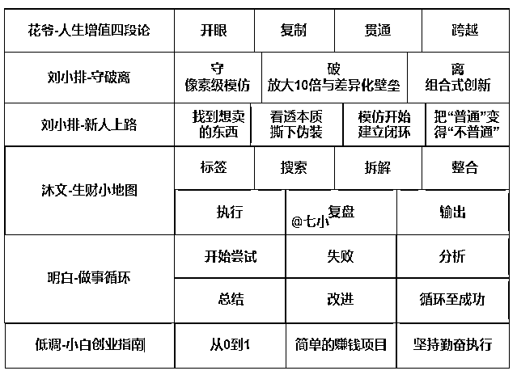

结合上面的理论和实践复盘，再加上我的个人理解，我总结出了一套普通人常规的赚钱成长路线。通过这个成长路线，大家可以了解到，在每个阶段，我们要经历什么，要面对什么？

心中有地图，对未来要发生的事情有了解，到时候实际经历时，就没那么慌了。

（本文的内容仅做概括性的描述，不做过多的展开，以后会写）

## 1）第一阶段：摸索

对上面的赚钱成长理论的图进行处理，筛选出适用于第一阶段的内容，初步处理结果如下：

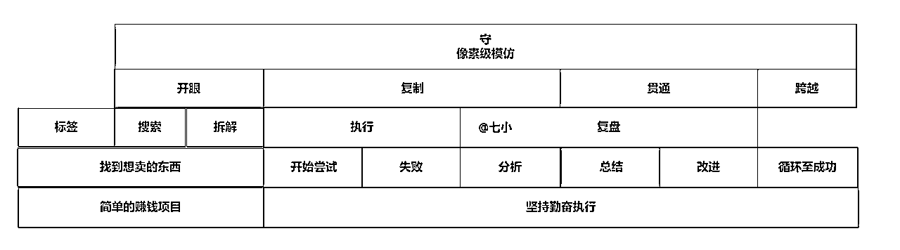

对这张图进行再次处理，然后就变成了这张通俗易懂的图了：

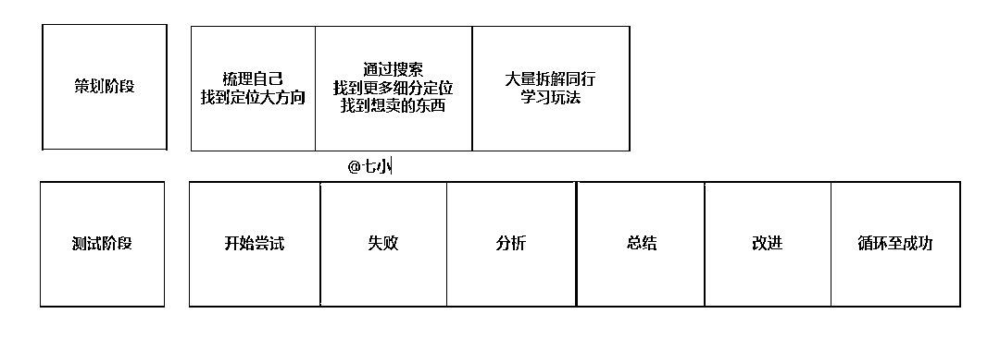

## 2）第二阶段：放大、差异、壁垒

刘小排：

但如何能够做到更多呢？ 此时，就不再有任何“保姆级教程”可以帮到你了。你需要「破」。

「破」有两种方式。

方式一： 比别人做得好十倍。

方式二： 有壁垒的差异化。

方式一：比别人做得好十倍。常规做法。横向扩展。用创业的黑话来说，类似于“渐进式创新”、“横向复制”或者“从1到N”。

如何差异化？ 你找到了一个引流方式，这个方式，在整个社群内没有任何人提及过，效果却不亚于社群内提及过的任何一个方式。—— 恭喜你，这就是一个「有效的差异化」。

别轻易告诉人，这是你的秘密。商业的增长，就靠秘密。

如何做壁垒？在找差异化的过程中，有意识去找一些门槛高的差异化点。

如何通过提高门槛的方式做差异化？找到一件事，它与你特有的技能组合有关。你能轻易做到，别人想做却没那么容易。

来源：https://articles.zsxq.com/id_lk2269jzghom.html

低调：从1-5方法论

①不要亲力亲为：招募助理，把重复且简单的工作交给别人。

②项目拆解：拆解项目，把项目拆解成流水线，安排流水线工人，比如引流和转化分开，或者是形成小组制度，然后实现小组分裂。

③学习管理能力：项目公司化，员工化，把管理能力提升，让项目得以放大。

加速进阶方法论

①去结交那些和你做相同业务，但是公司做的井井有条的人，和人家虚心请教如何做管理，项目如何拆解，如何放大。（学习管理最快的方法就是去别人的公司学习，然后拿回来立马用。）

来源：https://wx.zsxq.com/dweb2/index/topic_detail/182885821258422

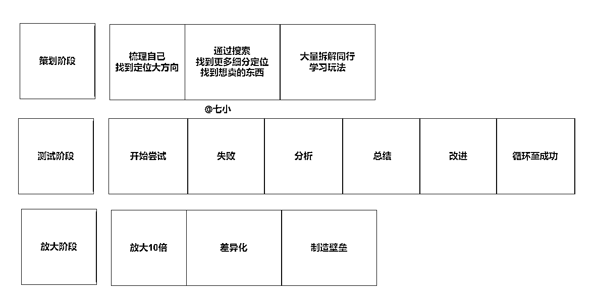

## 3）第三阶段：稳定、转型

拱卒：

如果我的一个项目在稳定期，我要把项目分享出去

让别人赚到钱通过这个方式，来结交高手，认识富人毕竟钱自己是赚不完的，在这个时候我让你赚到了钱在未来说不定那个机会，你就能拉我一把于此同时

稳定期我就要开始探索挖掘新的项目会有试错成本，会有时间成本，会有机会成本但那又能怎样，你不去淘汰别人，就被别人淘汰必须逼自己去做开创性的东西。

来源：https://wx.zsxq.com/dweb2/index/topic_detail/582855588185544

低调：从5到10方法论

如果是目前的项目已经制约了发展，已经难于突破，那么维持住现在项目的同时，抓紧找到新项目的赛道，然后小规模试错，进行测试。

不要之前做A类项目，现在就去改做B类项目，建议找到和自己之前业务类型相似，但是市场还没有那么红海期的项目进行突破。

①项目不行的时候，就抓紧推进B项目。有些项目你做不到起死回生，不如从新找个项目推进。

②不要闭门造车，多出去交流交流，组成自己的行业小圈子，筛选有用的信息，得以推进公司的业务。

来源：https://wx.zsxq.com/dweb2/index/topic_detail/182885821258422

将上面三个阶段的内容拼起来，最终得到完整版的地图：

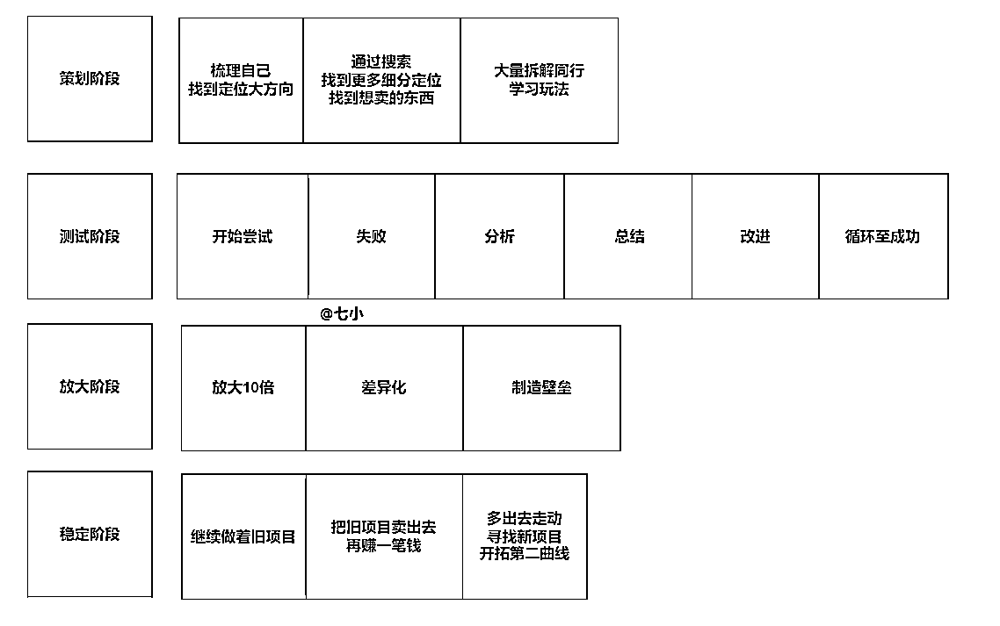

## 4）贯穿全程：

不同阶段有不同阶段的任务，但也有些事情是贯穿全程，什么阶段都可以去做，都应该去做的。

比如这五条积累事项：

### ①坚持

#### 1.持续结交高手

拱卒：

任何一件事都没有你看到的这么简单，想要从一件事上获利特别是互联网生意那么最基础的

就是一定要了解这件事的规则，想要快速入门一个行业，只有两种方法。

一是去找这个行业里的专业人士来带你入门，二就是自己花时间琢磨研究，那么可能当你研究出来了皮毛，这个红利就已经过去了。

我很庆幸自己每个项目都有贵人指路。方向错了，多么努力都是白费。贵人也就意味着机会。

来源：https://wx.zsxq.com/dweb2/index/topic_detail/582855588185544

战劲：

学会付费，学会与高人为伍，我一直觉得付费跟接触高人是分不开的，我花钱就是为了进入高端的圈 子结实段位比我高的人脉，所以我觉得这两个方面是不能分开的，不过这个原则我们要清楚，在互联网 最快的捷径就是让高手带你做事，你能少走非常多的弯路避免很多坑，当然反过来，认识高手的唯一方 法就是付费，除非你本来就很牛逼。

来源：https://wx.zsxq.com/dweb2/index/topic_detail/548821282218254

#### 2.持续留意机会

余闲：

我最近一直感慨。对于普通人来说，除懒惰的人外，大部分人其实最缺的也最重要的就是机会。

机会来自于两个途径，一种是主动寻找。

比如我在工作的时候，取得进步我会马上反馈给姜哥，让姜哥知道我的能力提升，这样一旦有更好的机会，他会优先考虑我。

还有就是报纸，各种信息渠道，比如很多人的第一桶金故事。

我也是是通过报纸新闻信息在第二阶段跌倒后完成原始资本的积累。

生财有术的线下见面会也是一种主动寻找机会的方式，光合老师上海线下见面会开幕词说的主题，普通人如何破圈成长。

我直接把它用过来变成我自己所能理解的东西：破圈等于机会。

这次参加线下见面会，我又接触到很多生财之“术”，也加入了很多不错的群。

如果你知道更多优质的圈子，也请推荐给我，我定当红包感谢！

另一种是给自己留一扇窗，让风吹进来。

比如我波兰军队的单子，大部分业务员下班后就下线旺旺，我保持登陆，并及时回复信息。永远保持礼貌的态度，多给别人一分尊重，也就给自己多一分机会。

你是否发现，任何事最终都是通过人来完成，而人具有主观能动性，具有喜好偏重。

人好啥都好说，人不好那一切按规矩来办。

大多时候，接到很多人厌恶的推销电话，我都会简短跟对方说一声，谢谢你，暂时不需要，周末愉快。首先，我能理解每个底层人的不容易，其次给别人礼貌，也是为自己留个机会之窗。

来源：https://articles.zsxq.com/id_w8k7lsf3ww4z.html

#### 3.持续锻炼身体

战劲：

身体健康永远是第一位，之前搞互联网整天没日没夜的，我的体重从170斤上升到了240斤，导致我 这个人直接废掉了，什么事都干不下去，喘气都困难。有一种随时猝死的感觉，后来实在没办法就减肥 ，经过一年的努力，体重终于从240斤瘦到了160斤，图7是我230斤的时候，图8是减肥成功的照片，减肥 成功以后我终于又找到了工作状态，身体感觉非常轻盈，精力也很充沛，所以在这里奉劝大家一定要注 意作息少熬夜，更不要暴饮暴食，要随时关心自己的体重。

来源：https://wx.zsxq.com/dweb2/index/topic_detail/548821282218254

#### 4.持续提升能力

余闲：

能力是最基本的东西，它指的是我们做某方面工作的技能。可以是当前职业的核心技能，也可以是自己喜欢职业的相关技能。我经常给年轻朋友说，如果你本职工作的能力还不行，那你要花大部分时间去学习提升自己的技能，而不是整天寻找机会。

第一桶金阶段，能力占很大一部分，因为再好的机会，你无能力也驾驭不住。

能力这种东西具有伪装性，你需要真正知道这门能力关键的隐形东西。比如外贸销售，它的重要技能不是英语，而是所有销售都遵从的东西，心理学与谈判学。开车的能力是预判思维，即防御性驾驶。

只要掌握这些隐藏的核心东西，你就能马上破冰，快速成长。

能力提升的快速途径是，学习行业内的顶尖高手，尽量是那些实战专家，比如我在外贸论坛找到毅冰老师的分享，有实战的第三远胜过只会纸上谈兵的第一。

来源：https://articles.zsxq.com/id_w8k7lsf3ww4z.html

拱卒：

-4-能力最厉害的能力，是获得能力的能力

我一路走到现在，付出的汗水，吃过的苦只有我自己知道但是就是这些汗水

吃苦塑造了我的能力获得能力的能力现在的我

在商业领域起码有SEO、操盘、自媒体全平台运营推广、电商、社群运营、设计、管理、分析策划、教学、课程设计、投资、演讲、销售、私域流量运营.....

等等一系列的能力也正是这些技能，让我能够抓住一些风口我认为世界上，从来不缺少机会稀缺的永远是发现机会的能力和把握住机会的能力这些赚钱的能力大学有教吗？

没有，大学甚至学生以来，学校灌输的理念总是让一个人怎么成为好的打工人却没有人，教你怎么赚钱，怎么做生意

来源：https://wx.zsxq.com/dweb2/index/topic_detail/582855588185544

#### 5.持续让人受益

狗哥：

找到你认可的人，或者认可的渠道，与他们产生链接，或者合作，多多分享帮助他们，你也会得到更多的帮助。

学会分享跟合作，分享可以链接你的人脉，得到别人的认可与肯定，更容易被介绍给更厉害的人认识，也容易找到更多同频道的人交流，从而得到更多的机会。

同时可以第二次对自己进行复盘，重新梳理，找出漏洞，再一次的给自己加深印象，归纳分类，反而更容易突破。

而且更有利于个人IP的塑造，更容易在圈子里，行业里找到共鸣，更容易在资源上获得优势。

凡事是相互的，每个人心里都有一杆秤，在帮他衡量着是是非非。

你帮别人一次，别人就有可能帮你一次，对于能聊得来的人，相互输出才能相互成长，人无完人，多结合才能产生更多的共鸣。

-----------------

我坚信一点，你让别人不舒服，别人一定也会想办法让你不舒服。

让人不舒服的原因有很多，有的因为争吵，有的因为嫉妒，有的是有意的，有的是无意的。

但是跳出这个圈子你才会发现原来你很一般，比你强的人太多，哪有人会嫉妒你？

优秀的你不能阻止别人嫉妒你，因为他们不如你。

但是有些方面是可控的，平时为人处世和气点，不要和人发生争吵，不要没事找事，不要主动得罪人，不要咋咋呼呼，每个人心中都有一颗种子。

就像有的网络键盘侠，除了像个怨妇一样，其实很可悲，我经历过，所以也了解。

总之，对别人好一点，就是对自己好一点。

来源：https://wx.zsxq.com/dweb2/index/topic_detail/215542254442221

余闲：

你是否发现，任何事最终都是通过人来完成，而人具有主观能动性，具有喜好偏重。

人好啥都好说，人不好那一切按规矩来办。

大多时候，接到很多人厌恶的推销电话，我都会简短跟对方说一声，谢谢你，暂时不需要，周末愉快。首先，我能理解每个底层人的不容易，其次给别人礼貌，也是为自己留个机会之窗。

很多时候，往往能为你提供关键信息的，是那些大部分人所看不上眼的所谓的“小人物”。因为你跟他们没有直接的利益冲突，他们往往对你说实话，但前提你得平易近人。比如扫地阿姨、门卫保安。你要了解供应商情况，那在问老板之前直接问门卫就得到真实情况。《三十而已》里江疏影给保安带早餐，于是她的奢侈品客户停车就比其他销售的客户更便利。

很多业主会跟保安吵架，其实我很不理解，我会跟保安熟络，生活中送他们一些水果等等。于是偶尔有朋友开车来看望我，打个招呼朋友的车直接入业主地下库，而不用停到两百多米外的商场车库，朋友会感觉贴心和方便，特别提着很多东西或下雨天气不好。甚至一次，家里突然需要梯子安装灯，这些我们平常基本用不到的东西，可真到了需要的时候又让人抓头。我跟保安队长说一声，他马上就安排值班的保安去寻找梯子，并帮我送到家里来，还说，你用完放门外就行，他们会上来取。

万维钢老师提到，要富而好礼，我觉得这句话很棒。

来源：https://articles.zsxq.com/id_w8k7lsf3ww4z.html

梁靠谱：

新认识任何人的时候，都不说有机会跟你学习，而是说，你遇到以下问题的时候可以找到我，我可以也愿意效劳。

如果链接就能产生价值，那最有价值的应该是中国电网，提供价值，乐于分享。不管你想成为什么中心，先要成为价值中心。

来源：https://wx.zsxq.com/dweb2/index/topic_detail/818818244224822

除了上面五条积累事项外，还有一些负面的事项，也是贯穿全程的。比如这3项。

### ②煎熬

#### 1.孤独

拱卒：孤独

稳定期我就要开始探索挖掘新的项目会有试错成本，会有时间成本，会有机会成本但那又能怎样，你不去淘汰别人，就被别人淘汰必须逼自己去做开创性的东西

员工是不可能做这种事情的，他如果能做也不会成为你的员工。衰退期，顶住压力，转型这个时候，你能依靠的只有你自己。

这个时候也是最孤独的时候，压力最大的时候如果失败后一蹶不振，那势必满盘皆输，吃老本的日子过不长失败是必不可免的，

但不能因为身处黑暗，就相信光明永远不会到来

这种危机感，让我丝毫不敢放松纸醉金迷、歌舞升平，真的不是创业者去享受的陪伴我们的

最多的其实是孤独

这种孤独又形容不出来

你说物质方面吧我现在买基本的东西，大部分啥都买的起，购物也不用看价格

你说精神层面吧，身边有人爱有所爱也有所期待

但就是内心深处有孤独和危机感始终陪伴着我，但也好

这一直激励着我让我不敢松懈，不管挑战，不管逾越新的高峰

来源：https://wx.zsxq.com/dweb2/index/topic_detail/582855588185544

#### 2.迷茫怀疑

余闲： 强大信念

我觉得对想赚第一桶金的人来说，信念也是不能缺少的，甚至是在整个致富路上都不可或缺的。特别是第一桶金阶段，你需要赌性重，强忍耐。

因为你从没自己赚钱过，这期间会有迷茫，会有怀疑，会有旁人的不理解不支持，还有长期的孤独忍耐，持续不断的学习，这些都需要你强大的信念去支撑你。

信念可以通过几方面获取，第一方面就是生活中的励志人物，比如很多老板王石等都以云南烟草大王褚时健为自己的偶像，甚至也可以是小说里面的励志人物，或者某首能激励你的歌曲，甚至运动与爱好。这些信念会支持你达成第一桶金这个目的。

在上班最难熬的那段时间，我经常一个人去跑步，去坐在黑夜里遥望远方，这些都是一种自我激励的方式，我现在还是以健身和歌曲给自己支撑。

#### 3.失败

云蔓的四次失败——一个月十万粉丝变现一百万的心得

来源：https://articles.zsxq.com/id_bw36cwt0im5w.html

做事四阶段，正向坚持，负向煎熬都看遍之后，你会发现，完整版的地图长这样：

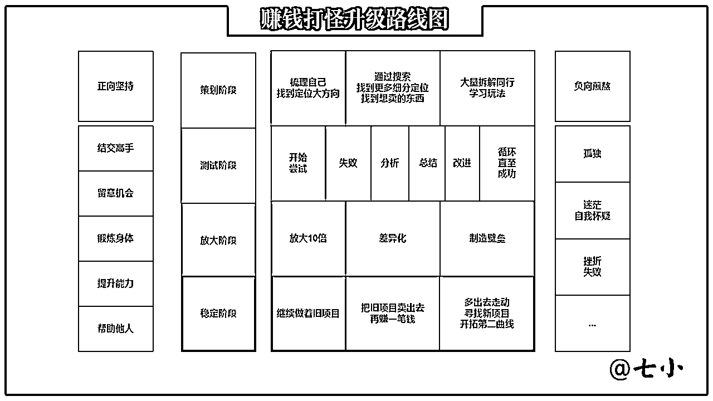

* * *

# 四、赚钱，是一场拼图游戏

赚钱，除了是一场打怪升级的游戏，它还是一场拼图游戏。

什么拼图呢？

知识拼图、能力拼图。

就像《龙珠》里的规则，得凑齐7颗龙珠才能召唤神龙一样，赚钱也得是凑齐一定数量的拼图才能变现，拼图碎片的数量不够，单块拼图的质量再高也没用呀。

为了让大家早日集齐赚钱知识能力碎片，顺利变现，下面我给大家整理一部分我从目前看完的100+精华帖里找到的拼图碎片。

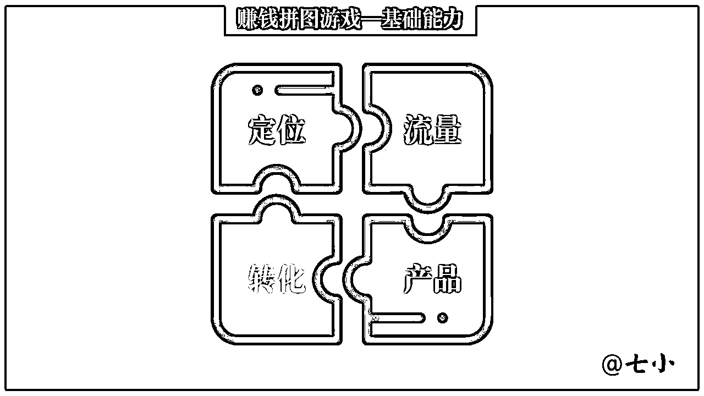

## 1）定位

### ①自身特点——V先生、沐文

V先生：

不同人的特质不同：

- 有人适合做内容型产品人（如做付费专栏、做课程）

- 有人适合做工具型产品人（比如开发一个小程序、一款App）

- 有人适合做媒体人（比起单纯写作，媒体人更要有网感，懂传播）

- 有人适合做运营人（比如社群运营、搞线上活动、搞线下活动）

- 有人适合做商务人（铺渠道、搞客户关系、拉生意、或者一对一销售）

- 有人适合做品牌人（如做品牌策划、设计VI手册、设计活动海报、做包装）

- 有人适合做管理人（如定战略战术、盯目标、做复盘、开会、培训团队、组织活动）。

如果一件事没做好，不用自我攻击，也不用被别人的批评干扰，陷入低谷，你可以停下来想想，自己最适合做什么。你让郎朗去打篮球，让姚明去弹钢琴，既对他们俩都带来苦恼，也浪费了社会资源。

来源：https://wx.zsxq.com/dweb2/index/topic_detail/182542155825542

沐文：

思路匹配认知，然后加上信息，就会产生赚钱的那一个启蒙点，那如果我们没有在生财有术，拥有这么多的精华帖，没有看到那么多有赚钱的帖子，我们的思路和信息到底怎么来？这个认知和信息匹配的产生，我们可以结合这几个点进行自我标签化：（我们每一个人都可以按照我们自己的实际情况来想一想）例如你的身份，你的资源，你的经验、你的经历、你身边的人、社会身份、职业·······，形成最高频、最匹配的几个标签。

举例：

···

按照以上的方式大体列出至少5个标签出来，为什么要列出5个标签？因为你有了想赚钱的时候，你是不知道怎么赚钱的，甚至没有方向，那么我们需要从自我属性去挖掘方向，切入更准确的赛道。

当基本的标签和属性词出来后，我们可以进行开展思考，例如：在这些词前后加上这样的造句：XX怎么做\XX有什么用\什么对XX有用\XX需要什么····

举例：

····

当形成了这样的标签（属性）和造句式之后，我们大概率会产生很多的赚钱思路和方向，至少不会无头苍蝇又或者永远追逐“热点”，有了自己的判断！

### ②趋势——V先生

猪肉过手，手上沾油。

没有猪肉的地方，你就蹭不到油；进到猪肉市场，转个身都能抹一手油。猪肉流往哪里，你就去哪里蹭油；同样，钱流往哪里，你就去哪里赚钱。

怎么知道钱流往哪里呢？有一些信息可以捕捉：

01\. 国家的五年规划

02\. 中央每年年底的经济工作会议

03\. 国务院每月印发的文件

04\. 进出口商品的结构和贸易额

05\. 银行信贷流向

06\. 物价变动

07\. 各地新增负债和财政投入流向

08\. 各地新增的GDP

09\. 各地流入的人口数

10\. 各地拍卖的土地

11\. 各地新增的用电量

12\. 各地快递包裹数量

13\. 各大投资公司投的项目

14\. 互联网巨头投的项目

15\. IT桔子新创公司名录

16\. 一些公司的股价变动

17\. App月活排行榜

18\. 百度指数/谷歌趋势

19\. 淘宝商品销量

20\. 有钱人和中产流行的生活方式

21\. 内容平台的最新融资

22\. 高手开始去做的模式/产品/内容平台

23\. 新崛起的千人或万人社群

24\. 新建的大学城/商业街/小区

...

总的来说，就是锚定政府、锚定银行、锚定巨头、锚定红利平台、锚定有钱人。

为什么要锚定他们？因为他们手里有钱，有钱才可以决定钱流往哪里；钱流往哪里，哪里就有增量；哪里有增量，我们普通人和小公司才好去蹭一手猪油。

在红海搏杀，不如到蓝海开荒，有增量的地方才有机会。找增量就是去寻找哪个城市、哪个行业、哪种身份的群体、哪种商品需求、哪个平台、哪个社群、哪家公司、哪个人，可以在未来增长三倍、十倍。

有一位长者说过：一个人的成功，既要靠个人奋斗，更要靠历史进程。最大的增量、持续的增量、过去四十年和未来三十年里十倍百倍的增量，就藏在历史进程中。历史进程的发动机一响，黄金万两。

在我们国家，历史的进程就在三个地方：始终代表中国先进生产力的发展要求，始终代表中国先进文化的前进方向，始终代表中国最广大人民的根本利益。

来源：https://wx.zsxq.com/dweb2/index/topic_detail/815851284111822

### ③项目类型——低调

这里给大家讲解下项目的分类，以及建议新人去做哪一类项目。

①平台类：跟着平台做事，不需要引流，但是需要和平台的规则斗智斗勇。

项目包含：短视频类（Tiktiok，直播带货，短视频带货，知乎好物等），电商类，（淘宝，拼多多，京东，1688，也包含店群等等）

②推广类：推广才能产生收益，注重引流吸粉。

项目包含：淘宝客，CPA，CPS，等等

③羊毛类：短时间一波，有的是可以直接撸，有的是需要拉人

项目包含：橙心优选，花小猪等

④代理类：拉人头，实现代理团队化

项目包含：社交电商，淘客APP等

⑤自营类：依靠微信，吸粉转化

项目包含：比如服务类（起名等传统文化，塔罗牌），直营卖货，软件销售等

⑥IP类：打造个人品牌，实现粉丝转化。

项目包含：社群，培训，带货等。

这些都是一些简单的列举，当然还有很多低调没有列举。

但是你会发现，平台类，推广类是小白接触最多的项目方向。

平台类的靠技术，推广类的靠流量，这就是很多小白突破不了的原因。

来源：https://wx.zsxq.com/dweb2/index/topic_detail/182885821258422

### ④变现方式——白一喵

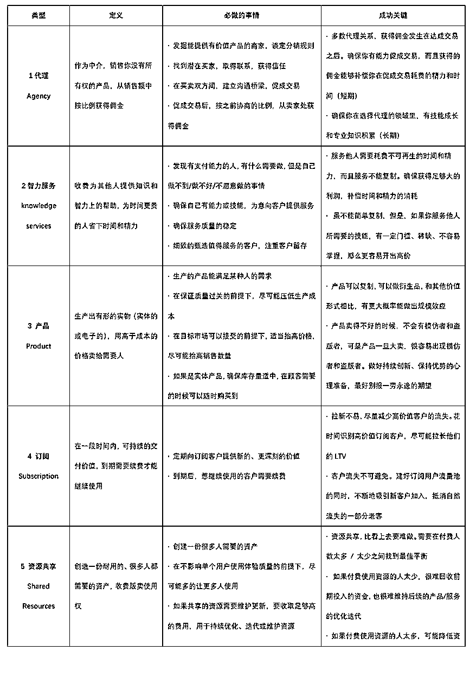

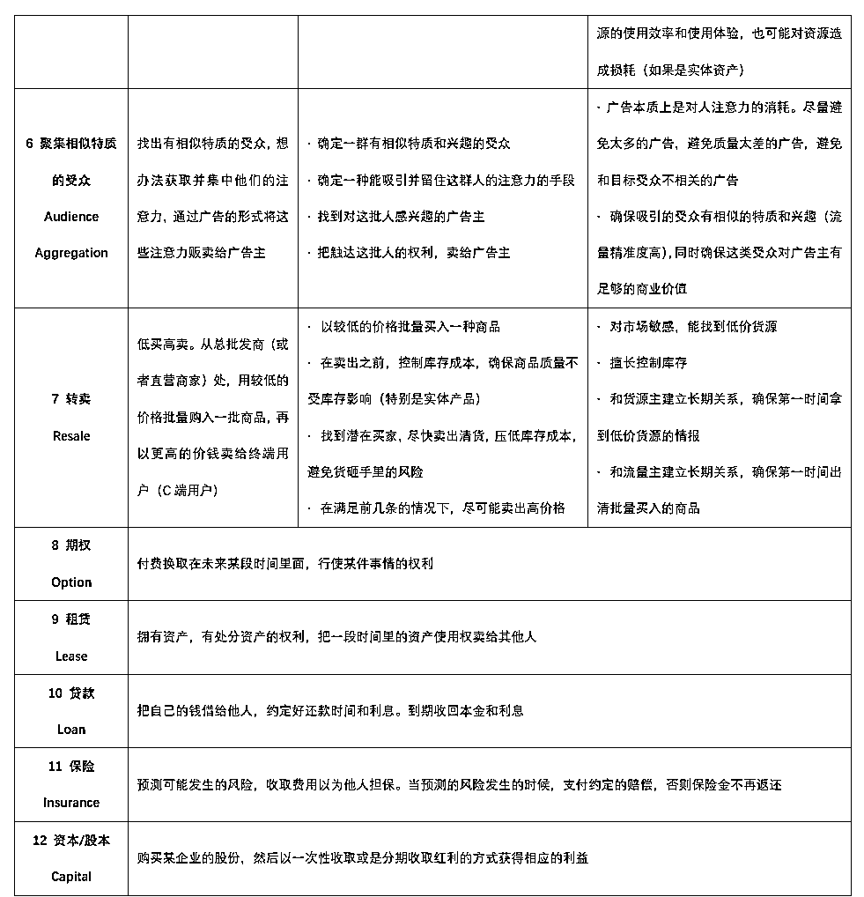

来源：https://wx.zsxq.com/dweb2/index/topic_detail/841142881252222

## 2）流量

### ①流量渠道——网络

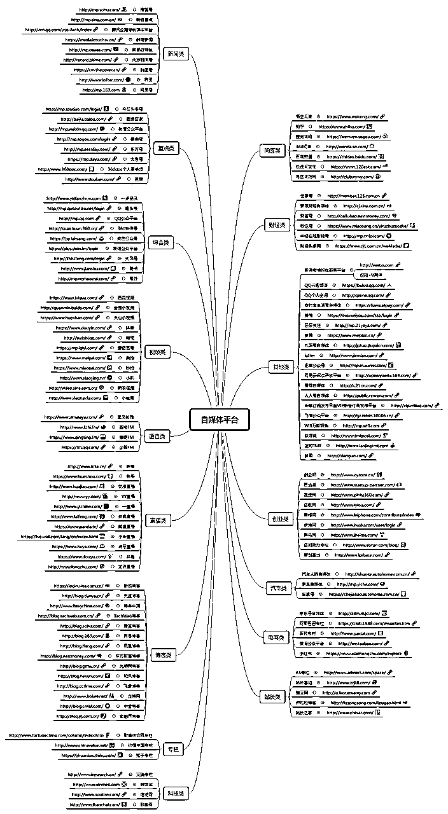

来源：百度

### ②互联网创作思路——徐蒙

“说几个你今天下午吃完饭就可以干的思路：

【搬运思路】啥叫搬运，抖音上那些把别人电视剧截成一段一段的，是不是就是在搬？别人已经做好了测试完毕的，你ctrlc ctrlv总会吧？https://t.zsxq.com/yJimmEI

还有：

【整合思路】是不是经常在网上看到各种内容合集啥的，我看你IG上也关注了几个专门美女合集账号的你别以为我不知道；这照样是ctrlc ctrlv，https://t.zsxq.com/MZ37eia

这都不会？

【照抄思路】再不济，照抄你总会吧？依葫芦画瓢，很难吗？？https://t.zsxq.com/AM7qNNJ 别人吃肉你喝汤嘛，喝汤有利身心健康，何况多喝几次就吃上肉了”肿安娜还不忘开涮。

“但是这些都不是最厉害的，最厉害的是【组合思路】https://t.zsxq.com/JyFmYvZ 比如你抖音刷的那些语录玩意，其实就是以前校内网上大家玩过一次的，换成人来讲段子读鸡汤，段子还是那个段子、鸡汤还是那个鸡汤，你看别人有多少粉丝？”

来源：https://wx.zsxq.com/dweb2/index/topic_detail/215128812554251

### ③输出——沐文

输出，我们可以怎么做？

载体可以是什么？

音频、视频、文字、图文

可以在哪些平台进行输出呢？

自媒体：百家号、企鹅号、公众号、网易号、头条号····短视频领域：抖音、快手视频、知乎小红书....这样的平台比比皆是，做到分发就可以了。

来源：https://articles.zsxq.com/id_oislwjlljwcb.html

## 3）产品

### ①产品——沐文

1、产品

产品极致打磨价格，极致打磨外观，极致打磨服务，极致打磨交付。例如生财有术就是典型的极致打磨交付。

以上都可以在执行中极致打磨，甚至可以成为我们的对外生财点（例如：设计产品外观，设计师；线上交付：社群运营师····）

来源：https://articles.zsxq.com/id_oislwjlljwcb.html

## 4）转化

### ①销售额放大法——V先生

在互联网上有一个“赚钱公式”：

销售额=流量×转化率×客单价×复购

这个公式主要适用于电商行业，网课、社群、微商有些不同，不过大体也可以参考。在这个公式里，销售额是最终输出的一个果，其他是多个因。

因太多了，抓住一个因去提升，销售额就会提升，而不同生意、不同公司、不同个人，擅长的因可能不同。那么多因，怎么抓？我们不如抓住一个果。在这些指标里，我们可以抓住一个北极星指标，那就是：销售额。

那么又怎么放大销售额呢？

01\. 自有大流量池

02\. 原创爆文

03\. 事件炒作

04\. KOL推荐

05\. 大平台合作

06\. 红利期的内容平台中批量投放

07\. 扩大销售团队

08\. 社群裂变

09\. 微商代理制

10\. 个人品牌

11\. 高客单价

12\. 可复购会员

13\. 刚需产品

14\. 垂直领域深度服务

15\. 小众稀缺产品或亚文化潮玩

上面所列，有的是解决流量问题，有的是解决转化率问题，有的是解决客单价问题，有的是解决复购问题，还有的是突破流量模式，走社群模式、微商模式、超级用户模式。

这十五点至少要占一个。

来源：https://wx.zsxq.com/dweb2/index/topic_detail/815851284111822

### ②转化率——沐文

3、转化率

流量到手，我们需要考虑的就是转化率这个关口。【陈勇大佬已经用案例告诉大家：转化率也是一个生财点，一个超级转化率成为了一个代名词！】

转化率又有什么方式？转化率有各种各样的

像陈勇大佬的分享说过：一定要把SOP变成尽可能的颗粒化的细度，转化率就是在颗粒化细节上进行打磨，我们在自己项目的转化率执行上不断打磨，也会形成我们的转化率思考，以上举例的转化率方式，每一个点都会成为你新的生财点，例如：文案转化率导师、小红书文案导师、设计转化率导师····因为存在极致的深，就会存在极致的生财点。

来源：https://articles.zsxq.com/id_oislwjlljwcb.html

## 5）其他

### ①赚钱兵器库——明白

每个赚钱高手，脑子里都有这么一个「赚钱兵器库」。

在我们普通人看来，赚钱案例太多，而且各不相同，没有规律。

但其实，如果你认真分析，就会发现，所有案例都包含 4 点 ——

需求：什么类型事情能赚钱？为什么？怎么做？

流量：获取流量的方式有哪些？为什么？怎么做？

营销：如何营销产品，能更容易卖出去？为什么？怎么做？

变现：不同类型的产品，该如何赚钱？为什么？怎么做？

所以，当你在生财有术看精华帖时，也可以从这 4 个角度分析，然后总结成一个「清单」，形成自己的「赚钱兵器库」。

积累多了，当再遇到新东西，你就能知道 ——

“这个事情有用户需求，之前 XX 做过，可以在 XX 平台，做成 XX 形式”

“这个事情可以用 XX 方式引流，套用 XX 的思路”

“这个事情可以从 XX 角度做营销，模仿 XX 的文案”

“这个事情可以通过 XX 变现，可以联系他合作”

当你有了「赚钱兵器库」，你就不是孤军奋战，遇到问题，找到相应的「兵器」，改进模仿，马上实践。如果不行，换另一个「兵器」，快速迭代。借用前人智慧，提高成功概率。

来源：https://wx.zsxq.com/dweb2/index/topic_detail/421185525121258

### ②赚钱能力树——七小整理

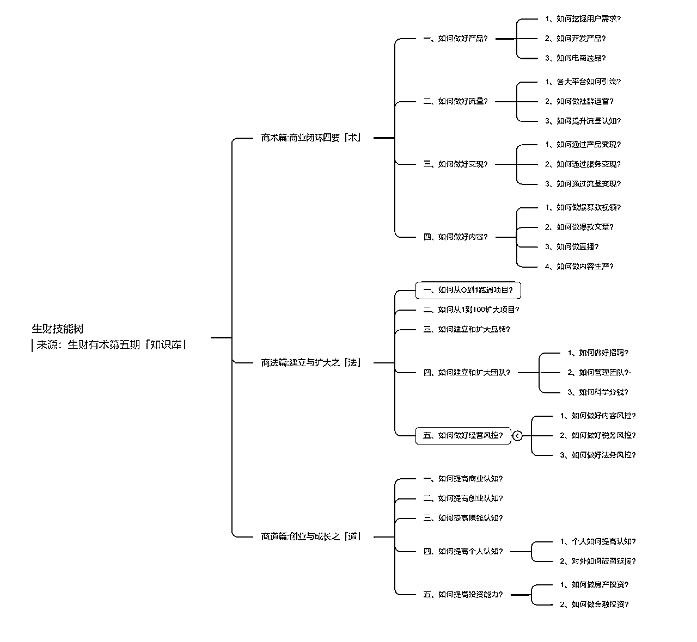

沐文老师，在https://articles.zsxq.com/id_oislwjlljwcb.html这篇帖子中总结的7点：

1、 项目开启的初始：标签、信息

2、 搜索

3、拆解

4、整合

5、执行

6、复盘

7、输出

来源：https://articles.zsxq.com/id_oislwjlljwcb.html

包小滚老师总结微创业的几个核心点：

-学习满足对应能力

-做适合自己/感兴趣的方向

-定制计划

-调研（多利用搜索）

-降本提效（尽量低成本，尽量快速落地）

-跟跑（像素及模仿）

-复盘（总结经验，得出结论）

-高执行力、务实

-诚信

来源：https://articles.zsxq.com/id_vk1ksaao8wkc.html

明白老师：

我在生财有术锻炼了下面几个能力：

1、挖掘一个能赚钱的用户需求（需求）

2、根据需求，创建一个产品（产品）

3、找到目标用户，让他们知道这个产品（引流）

4、让用户知道产品的价值，并且愿意付费（营销）

5、根据产品发展，做用户增长，产品优化，业务拓展（运营）

虽然现在还没有什么拿得出手的成绩，但我心里有数，从 0 到 1 的经验，我已经摸透了，现在要做的是，是如何从 1 到 10，而且我也有清晰的计划，目前正在实施，希望尽快实现吧。

来源：https://wx.zsxq.com/dweb2/index/topic_detail/544484848241154

拱卒：

吃苦塑造了我的能力获得能力的能力现在的我

在商业领域起码有SEO、操盘、自媒体全平台运营推广、电商、社群运营、设计、管理、分析策划、教学、课程设计、投资、演讲、销售、私域流量运营.....

等等一系列的能力也正是这些技能，让我能够抓住一些风口我认为世界上，从来不缺少机会稀缺的永远是发现机会的能力和把握住机会的能力这些赚钱的能力大学有教吗？

来源：https://wx.zsxq.com/dweb2/index/topic_detail/582855588185544

闫寒：

超视距价值的钻探能力

群体需求的抽象能力

清空自己的迁移能力

勘定边界的战略能力

对不确定性的利用能力

来源：https://shimo.im/docs/XxpPjPqYDWKJkywr/read

白一喵：

主题大纲：

（1）CEO的三大重点：造梦、打牌、盖楼

（2）年轻CEO的常见问题：务虚不够具象化，管事带人的能力不够扎实

（3）行动指南：重点说如何正确务虚、带人和建立沟通系统

来源：https://wx.zsxq.com/dweb2/index/topic_detail/241125414442221

海程+Caoz：

算账能力/数据分析能力

来源：https://wx.zsxq.com/dweb2/index/topic_detail/111185885812522

https://wx.zsxq.com/dweb2/index/topic_detail/548841828224414

# 五、其他内容主题合集

还有一些内容，生财知识库里好像没收录，但我觉得可以合并成一个合集，方便大家主题阅读的，就在此汇总了。

## 1）生财新人指南

使用指南——官方

走心版生财有术新人使用手册——杨涛

https://wx.zsxq.com/dweb2/index/topic_detail/182455545444112

《这样学习“生财有术”,效果事半功倍》——老黄牛

https://wx.zsxq.com/dweb2/index/topic_detail/815528444181812

新手如何正确使用生财有术——杨涛

https://wx.zsxq.com/dweb2/index/topic_detail/585255112851154

这才是「生财有术」真正正确的打开方式——张世磊

https://wx.zsxq.com/dweb2/index/topic_detail/582885148824514

新加入生财有术，如何从职场切入互联网赚钱领域，高效成长？——明白

https://wx.zsxq.com/dweb2/index/topic_detail/421185525121258

新人生财挖宝指南精华帖梳理学习总结——包小滚

https://wx.zsxq.com/dweb2/index/topic_detail/414128848528848

【新人共读】生财有术进阶攻略——蓝说

https://wx.zsxq.com/dweb2/index/topic_detail/582855551158424

《在生财有术，普通人如何从 0 到 1，培养赚钱思维》——明白

https://wx.zsxq.com/dweb2/index/topic_detail/544484848241154

## 2）龙珠规则

生财有术货币体系详解--龙珠、龙珠碎片、术值、V值

https://wx.zsxq.com/dweb2/index/topic_detail/815254211248552

如何获得龙珠？

https://wx.zsxq.com/dweb2/index/topic_detail/582512214418244

【如何写出精华贴，龙珠源源不断？】

https://wx.zsxq.com/dweb2/index/topic_detail/548848144218414

## 3）利他价值观

生财之道，只有两个字，利他。——Caoz

https://wx.zsxq.com/dweb2/index/topic_detail/818285584242222

利他主义，让我从年入百万到月入百万——盗坤

https://wx.zsxq.com/dweb2/index/topic_detail/241144255481841

为什么大家愿意去分享自己如何从0到1做成一门生意的？闷声发大财不好吗？——亦仁

https://wx.zsxq.com/dweb2/index/topic_detail/182228558128882

万字长文记录我跟亦仁的神龙咨询——西琳君

https://articles.zsxq.com/id_2ahqoqzrmkw1.html

做生意，利他即利己——刘小排

https://articles.zsxq.com/id_p0z4waugeoi7.html

## 4）消除赚钱焦虑

《粥左罗 l 在有钱人扎堆的社群学习，如何减少焦虑？》

https://wx.zsxq.com/dweb2/index/topic_detail/418825824555858

我是如何成功摆脱焦虑的——老爷爷的呼啸成长

https://wx.zsxq.com/dweb2/index/topic_detail/218548221842111

最近在群里看到很多人很焦虑。——亦仁

https://wx.zsxq.com/dweb2/index/topic_detail/215828444445481

请问第一次来本星球。如果我想从第一篇精华文看，是不是只有一直刷到底的方法？——亦仁

https://wx.zsxq.com/dweb2/index/topic_detail/421144424485888

《30天成功消除在生财的焦虑和选择综合症，并赚回门票钱，我做对了哪些事》——松果

https://wx.zsxq.com/dweb2/index/topic_detail/581228455285514

普通人和创业者如何缓解焦虑？——狗哥

https://wx.zsxq.com/dweb2/index/topic_detail/218548242251121`

《赚钱心态转变的小感悟》——阿思

https://wx.zsxq.com/dweb2/index/topic_detail/118551125422852

《在生财有术，普通人如何从 0 到 1，培养赚钱思维》——明白

https://wx.zsxq.com/dweb2/index/topic_detail/544484848241154

【资深创业老司机，帮你把焦虑治好】——低调

https://wx.zsxq.com/dweb2/index/topic_detail/414414815281818

## 5）长短期、快慢钱、赚钱值钱

关于主业与副业——杨涛

https://wx.zsxq.com/dweb2/index/topic_detail/182241425284482

「主业与副业」——黎叔

https://wx.zsxq.com/dweb2/index/topic_detail/815548121182852

私董会分享：关于长期赚钱、短期赚钱的讨论——光合

https://wx.zsxq.com/dweb2/index/topic_detail/818848125412582

「赚快钱还是慢钱」——条形马

https://wx.zsxq.com/dweb2/index/topic_detail/581128814828814

「赚快钱还是慢钱」——鱼丸

https://wx.zsxq.com/dweb2/index/topic_detail/581128548818584

万字长文记录我跟亦仁的神龙咨询（长期主义）——西琳君

https://articles.zsxq.com/id_2ahqoqzrmkw1.html

赚钱的事与值钱的事——梁宁

https://mp.weixin.qq.com/s/ciIsGqS0cvSrPo57ypwELA

* * *

# 六、尾言碎碎念

1）看完上百篇精华帖，又从早到晚写了4天，肝了整整10天。终于写到尾言部分了，此时真的百感交集，又是满满的成就感，又是感觉太不容易了，总的来说，就很开心激动，哈哈哈~

2）以前我做学习博主的时候，我说世界是我的游戏，我要用知识开挂。

今年我开始转型互联网创业博主，我说我会用自己的方式来赚到钱，用学习博主的方式来搞钱。先搭建一套赚钱的知识体系，来理解赚钱到底是怎么一回事。然后再用理论指导实践，高效做事。

这篇文章对我而言是一座里程碑，它标志着我赚钱的知识体系初步成型了。当初我给自己定下的目标，理论部分已经实现大半了。

接下来的实践部分，我与各位圈友一同努力~

3）整理了这么多精华帖之后，我最大的感悟是什么？

一句话总结：视野打开了，思路清晰了，信心坚定了。

真的非常深刻体会到了亦仁所说的，榜样的力量。看了那么多人成功之后，会让自己意识到：这个事情其实没有那么难，我也可以做得到！

4）这篇文章，以认知整合为主。以后我也会多分享一些原创的，操作性的强的，讲术的层面的内容~

5）希望大家喜欢这篇文章呀。以后我也会继续发挥我的整合能力，争取成为生财的首席内容整理官，帮助大家降低赚钱知识的学习成本~

七小

2022年7月28日