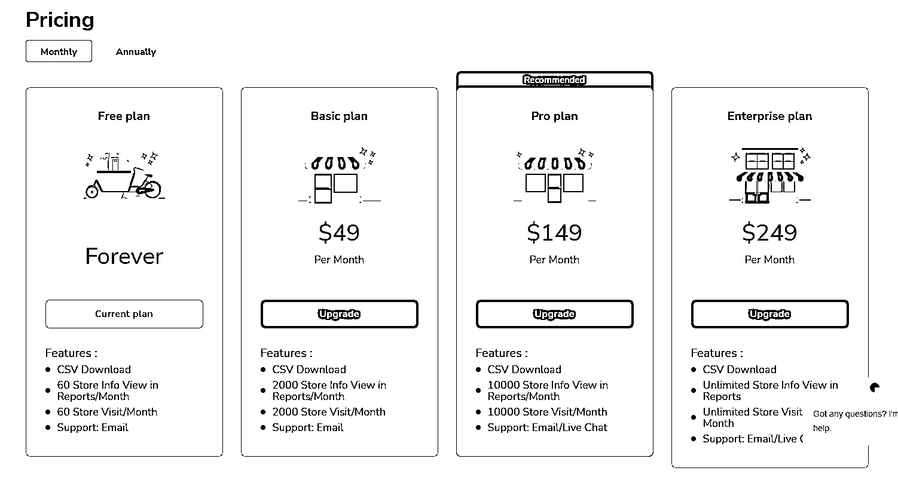

# 《独立开发者如何快速找到并实现属于自己的“躺赚”小工具 MVP 》

> 原文：[`www.yuque.com/for_lazy/thfiu8/gyw0tta94ztt3ngk`](https://www.yuque.com/for_lazy/thfiu8/gyw0tta94ztt3ngk)

## (73 赞)《独立开发者如何快速找到并实现属于自己的“躺赚”小工具 MVP 》 

作者： 吴大白 

日期：2023-04-14 

大家好，我是吴大白，曾经是一名程序员，后面成为了一名带有程序员标签的创业者。目前从事跨境电商，公司主营亚马逊和独立站业务。 

很荣幸被生财邀请担任此次英文工具站小航海的教练之一，这是我在小航海中的一次分享，这篇内容比较适合想通过工具产品赚钱的圈友，希望能给到大家一些新的启发，接下来主要从以下几个方面来给大家分享。 

1、需求是如何被发现的？ 

2、为什么我会觉得它是一个可以让人付费的需求？ 

3、如何快速基于需求找到自身最适合的开发模型？ 

4、如何用最小 MVP 模型找到第一个用户？ 

5、如何让工具类产品自发运转，从而让我们实现“躺赚”？ 

1、需求是如何被发现的？ 

我们先来说一说第一个点，我是如何发现这两个小需求的。 

需求 1（快递状态查询）：去年有一次公司开月度会议的时候我发现一个有趣的事情，我们公司每个月都要发出很多快递，但是这些国际物流快递时间都很长。 

所以难免会出现妥投失败或者其他情况（如果妥投失败物流商是需要赔付的），基于这个需求，就需要有一个工具去批量查询监控这些快递状态（这个情况几乎所有做独立站的公司都会有）。 

目前我们行业有两个比较知名的查快递的公司（类似于国内的快递 100），其中一家叫 17track，大家可以去查下，他们的明面上的盈利模式非常简单（背后的模式就多了，比如数据...），就是查一个快递几厘钱到几分钱，之前我们每个月都要花大几千在这上面（高峰期上万），以前我没注意这块，直到那天会议跟仓储物流在复盘的时候关注到了这个（以前是习惯性忽略了，觉得这是正常开支）。 

其实他的原理很简单，就是整合了市面上所有比较知名的快递公司的接口，然后统一对外查询并做一些基础的数据分析，比如统计半个月未签收的，比如所有妥投失败的快递（运营可以追踪到相应产品和销售渠道）等，而这些开发超级容易的功能却成为了我们这行业事半功倍的利器。 

  

需求 2（shopify 站点分析）：这个需求非常具有代表性的就是 Commerce Inspector 这个工具了，我相信只要做过 shopify 的对这个插件都不陌生，至于其需求的来源很简单，每个只要做独立站的都需要分析竞争对手的网站，而能快速收录和监控非常多的独立站对于这类用户来说就是刚需产品，类似现在抖音的抖查查一样。 

大家可以去看一下这个站（[shopgram.io](http://shopgram.io)），他最开始是一个免费站点，收集了上百万 shopify 的站点和商品，然后分文别类让用户查询，从去年开始就已经收费了，并且收费还不低。 

  

2、为什么我会觉得它是一个可以让人付费的需求？ 

大家有没有发现一个细节，上述两个需求的产生都是在独立站这个细分领域里面能助人提效的，并且站在客户角度上面还是不能被忽略的两个需求。 

就像第一个快递查询的，当公司每天几百几千订单发出去的时候能快速监控和分析到快递状态是必备的，如果仅靠人工去和快递公司核对，那可能头都会大，况且有时候发的还不止一个快递公司，我们公司在这上面每个月大几千的费用是真金白银花了的，直到后面我发现这个之后才让公司技术整合了我们常用的几个快递公司接口，做了一个内部版本来使用，现在还打算开放给身边几个关系比较好的同行使用，一起分担点技术维护和服务器费用。但站在很多跨境公司来说是不存在这种技术思维和开发能力的，所以只能找外面成熟的方案，这也就延伸出了上面类似公司的存在。 

还有类似第二个需求，作为选品和竞品分析这是必不可少的，就像做抖音如果不用西瓜数据和抖查查类似工具就有点瞎子摸象的感觉，当然可能大家会问了，这类数据工具开发和维护成本太高了，不适合个人玩家搞，那下面在第三点我给大家一个解决方案再下决定。 

3、如何快速基于需求找到自身最适合的开发模型？ 

需求可能大家已经发现了，并且也知道这个需求能赚钱了，但是大多人就毁在这一步了。 

比如我应该买什么样的服务器，用什么样的域名，甚至于用什么样的技术栈，如果更加“极端”一点的都会纠结在起什么名字上面，人一旦开始纠结，接下来就不用想事了，相信我，时间会磨灭你所有的激情。 

出来混，先出来才能继续混，就像上面的快递状态查询，那就开始列一份大纲，比如找几个常用快递（最好身边有做跨境的推荐），然后再其官网注册账号申请 API（一般都是开放的），然后先整合两三个 API 做一个基础的 MVP 出来跑跑，或者更简单一点的话就直接用 17track 这种工具的 API 重新封装一下对外（只是在数据分析功能上面比它做得稍微好一点点就行），然后再想办法去找到一个客户就行。 

还有 shopify 站点分析这个工具，无非就是数据的来源，因为 shopify 站点只要有一个网址就可以获取到里面所有信息，比如商品 SKU、所有页面、所有分类等，至于如何获取网址我给大家提供两个方式: 

一个就是在现有工具上直接爬取就行（效率最高）。 

二个就是在 Google 上面直接用【site：[shopify.com](http://shopify.com)】可以获取到 N 个 shopify 的网站。 

这里我顺便再提供一下几个常见的 shopify 站内容获取的接口吧： 

获取产品接口：{自己的域名}/products.json?limit={数量}&page={页数} 

获取页面接口：{自己的域名}/pages.json?limit={数量}&page={页数} 

获取分类接口：{自己的域名}/collections.json?limit={数量}&page={页数} 

通过下面代码就可以检测网站是否为 shopify，同样原理（获取页面源码，然后通过正则匹配相应字符）也可以检测出 shopify 相应模板。 

 

还有更多的大家自己去组合应用吧，有了这几个上面那个工具开发出来几乎没啥技术难度了。 

 

至于技术栈的话，大家熟悉什么就用什么，不用太纠结，不管白猫黑猫能抓到老鼠的都是好猫，还有其它域名服务器的就更不用纠结了，把注意力放在最值钱最快达到目的的事上是绝对没错的。 

4、如何用最小 MVP 模型找到第一个用户？ 

如何找到第一个用户可能是很多朋友觉得最难的事情，但是在我看来这是整个过程中最容易的事情。 

下面告诉你几个小技巧，如果你还找不到第一个客户，那你来找我吧，我来当你第一个客户也行，哈哈。 

a、熟人介绍，每个人身边总有那么几个朋友是跟你产品目标人群相关的，就像上述两个产品，难道你朋友圈找不到几个跟跨境圈重合的人吗，实在不行你先免费让别人用呗，好用别人自然会付费（主要是你会有真正的用户反馈了），这世界真正能做到心甘情愿白嫖的人已经不多了（如果真被你碰到了那只能算你很幸运了），只要你能勇敢的站出来推销自己的作品，我相信你的朋友都会为你“指路”。 

b、基于工具功能写一封很好的销售信，然后在朋友圈发布，如果可以的话让朋友帮忙转发一下，还有一个很好的渠道就是行业社群和网站（如生财有术、行业 QQ 群等），只要产品和销售信足够真诚，总会遇到很多对的人（我之前很多工具的启动用户就是这么来的）。 

c、为工具录一个好的宣发演示视频，然后在抖音类似渠道发布，如果有条件的话可以投点小广告，你的曝光量足够了，再加上产品确实能解决需求，还怕找不到第一个用户吗？ 

5、如何让工具类产品自发运转，从而让我们实现“躺赚”？ 

作为个人开发者最希望的就是能让自己的作品能自发运转帮我们实现躺赚，但这个确实还是有些难度的，除了工具上面的运维迭代之外，营销是需要贯穿始终的，但今天还是跟大家分享一下我所认为能做到的基于这种垂直于行业细分人群的小工具如何帮我们实现最大程度上面的“躺赚”。 

a、学会分销（最好利用卡密或者工具内部邀请链接实现自动化），我觉得有个最牛叉的模式就是微商模式，层层分销，每个人都是利益体，但我们不需要做到层层分销，但可以设置一下推荐奖励，不仅仅只是钱，也可以是别的（如垂直行业资源，如工具使用权等）。 

b、学会建立“护城河”，这个在商业领域是一个常用词，但在工具营销里面为什么会用到这个呢，比如给做 shopify 分析的定期开一个建站训练公开课，比如给快递查询的提供价格更低的物流渠道等，这些“护城河”不仅能增加盈利方式，更能拉进与客户之间的黏性，从而提高转介绍。 

c、基于工具目标人群的利基市场开发出更多符合其需求的延伸工具，也就是大家常见的“工具矩阵”，这样也可以实现一种另类形式的“躺赚”，因为流量是共享的。 

d、还有最最重要的一点就是，工具一定要保持质量（可以通过不同方式引导用户提出新的建议和需求然后再优化迭代），营销可以交给客户，但工具是根本，我们一定要做好维护迭代，这是所有“躺赚”实现的基础。 

好吧，今天就分享到这里，上述两个工具我们这边都已经有了内部使用版本，因为一直没有对外，但这两个需求的开发实现成本和收益回报之间相差都很大，所以跟大家分享一下，有兴趣的可以去研究一下，中途有啥问题也可以找我一起唠唠，如能帮得上，也很荣幸。 

评论区： 

郑鹏鑫 : 今年的教教嘛，  我一直在等航海，大佬航海前，我需要准备 哪些工作呢？ 准备一个域名，一台服务器 配一个 wordpress  请大佬指教一下[呲牙] 吴大白 : 看你的需求是啥，做 web 类产品的话域名和服务器是刚需，至于 WordPress 或者其它开源程序就看你具体想做什么了。 郑鹏鑫 : 因为刚出海，今年就整一个想搞一个博客  配合 adsense 增加收益，博客的领悟 内容 还没确定好[偷笑] 张静伟@生财有术 : 可以先看看英文工具站航海的手册 郑鹏鑫 : 好的感谢老大[呲牙] 风轻云淡 : 现在的程序员向曾经的程序员[握手] 希声。 : 学习了 财女小马达 : 谢谢分享