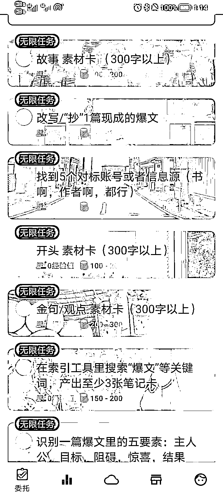

# 《无项目、无资源、无人脉的生财小白如何克服迷茫、尽快下场？》

> 原文：[`www.yuque.com/for_lazy/thfiu8/tdnfqm24sucnc01m`](https://www.yuque.com/for_lazy/thfiu8/tdnfqm24sucnc01m)

## (124 赞)《无项目、无资源、无人脉的生财小白如何克服迷茫、尽快下场？》 

作者： 简冬阳 

日期：2023-04-13 

今天看到 @敏渝 发的帖子 https://t.zsxq.com/0dJ2Kqud6 ， 

感觉可能有很多无项目、无资源、无人脉、实战经验和知识储备较少的纯小白和我一样处于比较迷茫的阶段， 

所以把我目前摸索的小小心得总结如下： 

1\. 尽量不看生财的信息流。 

为什么呢？漫无目的地看生财的帖子，很容易焦虑。 

而且小白嘛，本来就不自信了，看得多但行动没有跟上来，只会越来越不自信。 

久而久之，可能连生财都不想打开了。 

这个问题如何解决呢？ 

在生财里摸索了几天后，我认为可以从“赚钱周报”栏目下手。 

 

这是亦仁对每周优质帖子的汇总。 

我们可以直接在里面筛选自己感兴趣的帖子。 

筛选的标准是什么？ 

嗯，我估摸着我也能这样做，或者，其中某一点是当下的我也能做到的。 

如果你阅读的时候，心里产生了这样的想法，那么这就是你的心动之帖了，可以收藏起来、认真品读。 

记住，没必要囤自己目前不会去做的帖子。囤的内容越杂，越容易浮躁。 

生财的检索系统做的还是不错的，等到需要的时候再去找就好了。 

2\. 越是小白，越要尽快地参与到实战中去、积累经验。 

不能像以前读书时一样只阅读、只做笔记，那样就会变成纸上谈兵之人了。 

如何快速找到适合自己的实战项目呢？ 

在生财的索引站里找到“航海实战”。 

其中“公众号爆文写作”、“抖音小说推文”、“小红书资料引流”、“抖音图文引流”四个项目， 

应该是相对而言对已有资源和能力要求最低的。 

（并没有说这些项目容易的意思，只是相对而言没有太多的前置条件或太高的门槛） 

 

建议从中选择一个项目入手并专注于此，在拿到第一个正反馈、即赚到第一块钱之前，不考虑别的项目。 

同时，针对自己正在实战的主题，在索引站里搜索相关的帖子， 

比如你要做“公众号爆文写作”这个项目，就可以搜“爆文”、“写作”等等关键词，进行查漏补缺。 

 

当然，关键词是需要你有意识地发散和收集的。 

关键词越多，你能找到的内容越多。 

3\. 找到了适合的学习资料，怎么做笔记？ 

（1）尽量不要只是复制粘贴原文，最好每读到对自己有启发的内容，都记录一下想法，读一段记录一下。 

让自己的大脑和帖子互动起来。 

（2）特别关注帖子里和实操有关的内容，可以改成问答卡片的方式。 

例如这是我读完这个帖子 https://gt2wd7d4rc.feishu.cn/docs/doccncrbY31kQcHXautpQz8DFwf#RCeptr 后总结的 1 个问答卡片： 

如何找对标账号？ 

1.发散关键词（要找规律） 2.在头条搜关键词，找到微头条栏目下优质内容的作者 3.顺着作者的关注列表顺藤摸瓜 

（3）做完笔记之后，总结一下自己下一步要做什么，越具体越好。 

比如下面是我在读完“公众号爆文写作”后总结的微习惯，之后还会随着实践情况调整和补充。 

 

4\. 心态调整 

最关键的是找到你自己的节奏。 

我是通过靠谱和醒醒进的生财， 

陪伴群里的小伙伴有的已经写出精华帖了， 

有的已经参考生财里的内容精进业务、每天变现四位数了。 

然后我就意识到，表面上我们都是第七期进生财的“同学”， 

但实际上，很多人已经在“罗马”了。 

意识到这样的差距后，我反而觉得，真的不必焦虑了。 

（1）这证明，你真的进入了一个很不错的圈子。 

如果愿意投入，你真的可以在这里学到很多 

（2）这证明，你需要更加专注自己的成长。 

请每天为自己写成功日记吧，就以“我成功……”作为每句话的开头。 

比如我成功读完了 1 篇精华帖…… 

比如我成功剪出了第一条带货视频…… 

比如我成功写了 1 篇 2000 字的文章…… 

还可以是更小的成功： 

比如我成功摘录了一段对我很有启发的话…… 

比如我成功找到了一个特别适合我的对标账号…… 

比如我成功写了 300 字的笔记…… 

珍视你克服卡点的每一个瞬间，为你的每一个小进步庆祝，让一点一滴的小成功为你带来更大的成功。 

我是简冬阳，希望这个帖子能为你带来一点小小的帮助。 

评论区： 

刘逍遥 : 你一定像你的名字一样，冬日暖阳，很温暖，谢谢你的分享[太阳] 醒娃 : 请问你们的陪伴群是什么，还加人吗？ 在路上 : 就是老圈友和他的小伙伴 佛香 : 加入生财快一个月了，由于工地上太忙，一直没来得及认真研读，再一个，宝藏群的信息量确实大，不仔细筛选容易越看越焦虑。另外正反馈很重要，能让我们坚持下去，祝圈友们生财有术！！ 方言 : 太有用了，感谢分享[抱拳]，为同样迷茫不知所措的圈友们指明了一条简单可行的路径。我也加入快一个月了，要赶快行动[奋斗] 丑八怪 : 感谢分享，确实对新手很有用 醒娃 : 好的，我看到了，这两天最新的文章分享里有说这个 王嘟嘟 : 感谢分享