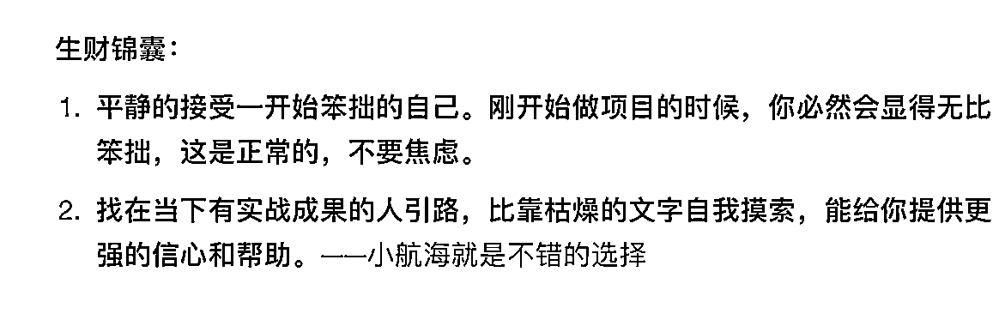

# 《生财实用案例锦囊：从搞钱新手到最懂新手的男人，我在生财有术的三年》

> 原文：[`www.yuque.com/for_lazy/thfiu8/gvroocxpycp8fdc5`](https://www.yuque.com/for_lazy/thfiu8/gvroocxpycp8fdc5)

## (138 赞)《生财实用案例锦囊：从搞钱新手到最懂新手的男人，我在生财有术的三年》 

作者： 郭晓文 

日期：2023-04-12 

## 【生财使用实例&锦囊】从搞钱新手到最懂新手的男人，我在生财有术的三年 

大家好呀，我是最懂新手的男人——郭晓文。 今天的内容，即是和大家聊聊我这三年和生财有术的故事，也给大家留下了一些正确使用生财有术的锦囊。 当你焦虑的时候，当你不知道怎么使用生财有术的时候，不妨拿出这篇文章看看，相信会对你有所帮助。 

三年前，我作为一个搞钱新手加入生财有术。 三年后，我不仅自己搞成了好多项目，也通过做社群、训练营、做分享的形式，带许多人成功跨出了搞钱第一步，也在生财留下了 10 篇精华帖。 

可以说，我这三年的成长和发展，都和生财有术密切相关。 源于生财，就应该回馈给生财。 今天，我就把自己这三年和生财的故事，分享给大家。 希望，有更多的人，可以通过正确使用生财有术，发展起来。 我很期待。 

长文请移步飞书 [https://ro14u4yq4i.feishu.cn/docx/LE3Ad03QAoTJWWxZ8jBcFBKXnEy](https://ro14u4yq4i.feishu.cn/docx/LE3Ad03QAoTJWWxZ8jBcFBKXnEy) 

 

 

评论区： 

郑鹏鑫 : 大佬好[呲牙] 简冬阳 : 看完之后，嗯，不愧是最懂新手的男人 鹿野 : 大佬带我一起[愉快] 徐子然｜子然随笔 : 经营好自己的现在，等着未来飞奔而来 书情小跟班 : 感谢分享 Kerwin : 最懂新手的男人 玩转 ChatGPT : 感恩无私分享 金可 : 晓文哥 棒棒棒