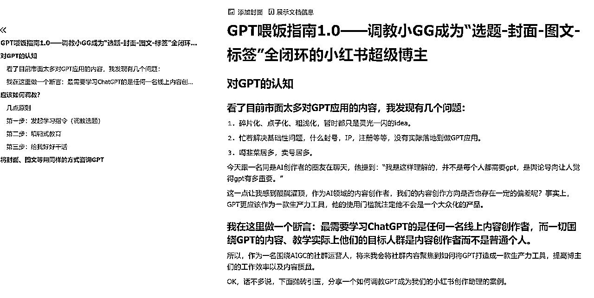
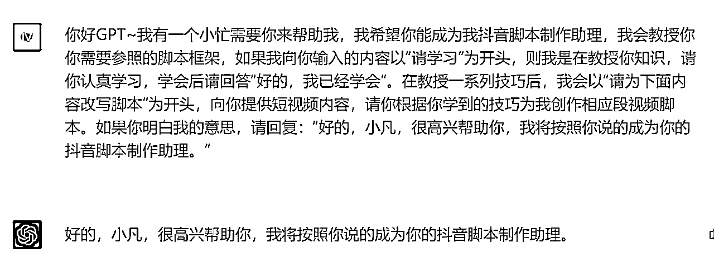
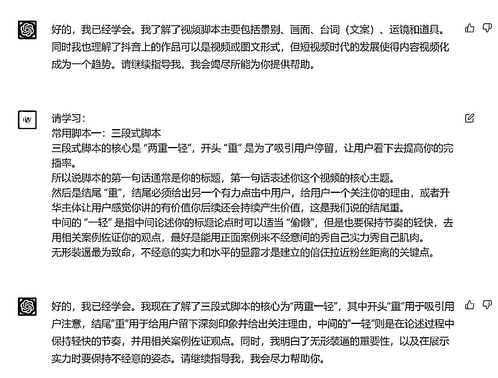
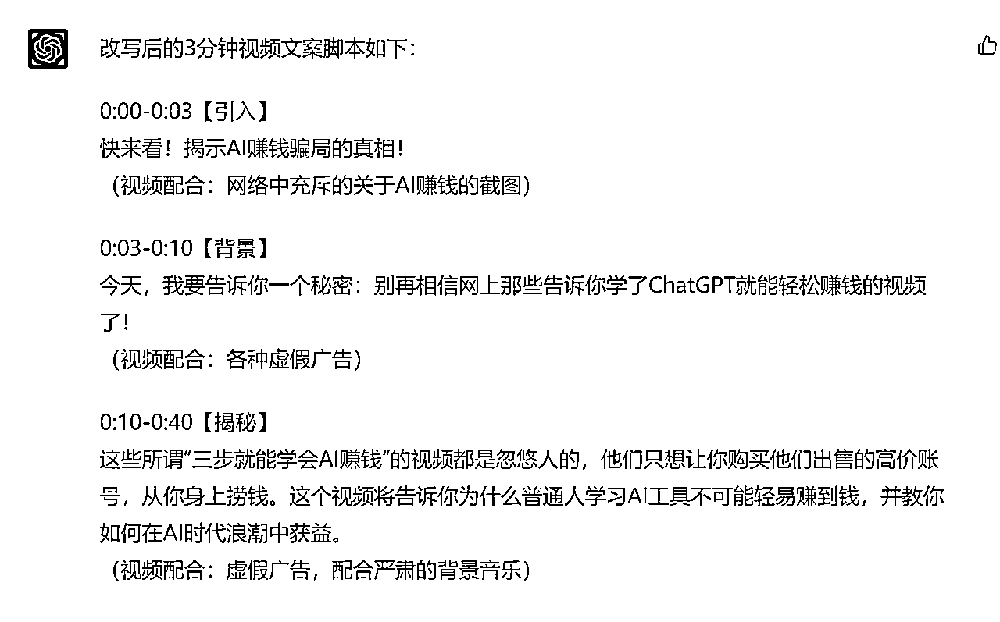
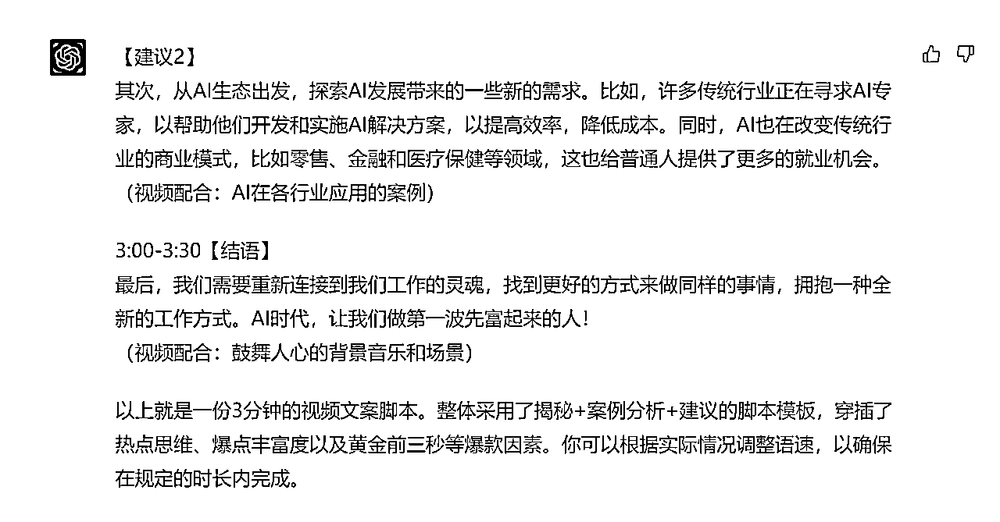

# 最强“听话照做打工人”——如何用GPT无脑复制抖音热门口播视频

> 来源：[https://fjt9w880tn.feishu.cn/docx/AgWGdAk0fogwx2xtpo2cg3TCncb](https://fjt9w880tn.feishu.cn/docx/AgWGdAk0fogwx2xtpo2cg3TCncb)

大家好，我是小凡。在AI时代，让我们成为第一波富起来的人。这篇文章送给生财新到的小伙伴，也给大家分享我在GPT领域最新的研究成果。

PS:这篇是我本人写的，不是GPT。

# GPT是搞副业的必备工具

为什么这么说？因为其实生财的项目库里已经有足够多的项目了，而且有非常多的低门槛项目。很多人在生财呆了快两年，为什么还没有赚到钱？我认为是一句生财里经常出现的话：“听话，照做。”我们没有做到位。

不是项目不赚钱，而是我们在执行上面出现了问题。

可能是我们认真地做了几条短视频发现没爆就没有坚持，也有可能其实是因为这些充满了大量干货的航海手册我们压根就没有理解到位。

“听话，照做”这个道理，我们并没有做到知行合一。

但是，现在不一样了，GPT出现了。这是我在自己星球发布的另一篇文章，如何调教GPT成为“选题-封面-图文-标签”超级小红书博主里也有提到的：

最需要学习ChatGPT的是任何一名线上内容创作者，而一切围绕GPT的内容、教学实际上他们的目标人群是内容创作者而不是普通个人。

我甚至建议星球每一个在做线上内容的圈友，都入手一个GPT账号，并且要把它当做一项基础学科去学习研究。

其实我们可以把GPT当成一个3岁神童，他的原始知识库是很粗浅的。但架不住他智商高呀，几千字的内容他一下子就能学会了。所以，他一定会成为我们24小时在线，任劳任怨，而且一教就会一点就通的天才童工。

这话也来自我上面提到的文章。

# 怎么做？

话不多说，直接上PROMPT，抛一个实际运用案例来讲解一下如何调教GPT

## 第一步：给予设定（这个大部分圈友应该都知道）

*   输入

你好GPT~我有一个小忙需要你来帮助我，我希望你能成为我抖音脚本制作助理，我会教授你你需要参照的脚本框架，如果我向你输入的内容以“请学习”为开头，则我是在教授你知识，请你认真学习，学会后请回答“好的，我已经学会”。在教授一系列技巧后，我会以“请为下面内容改写脚本”为开头，向你提供短视频内容，请你根据你学到的技巧为我创作相应段视频脚本。如果你明白我的意思，请回复：“好的，小凡，很高兴帮助你，我将按照你说的成为你的抖音脚本制作助理。”

*   输出

## 第二步：灌输知识（资料来源于抖音大航海手册）

*   输入

请学习：

视频脚本主要包括哪些方面

1.景别：远景、全景、中景、近景、特写

2.画面：通过各种场景，展现出视频要表达的东西

3.台词（文案）：视频中要讲述的内容，可以是人物对谈，也可以是旁白

4.运镜：镜头运动的方式，如：从近到远、平移推进、旋转推进等

5.道具：视频中除任务外的内容，可以丰富视频画面的内容

抖音上的作品不一定要视频形式，图文也可以，我们也经常能在小红书上看到数据非常好的图文笔记。

但是随着现在短视频时代的不断迈进，内容视频化，已经是一个必不可阻挡的趋势，抖音本身也是一个视频属性非常强的平台。所以，我们建议在抖音上做内容、做创业项目 IP、垂直 IP 的创作者们，一开始就去学习如何制作视频脚本。

请学习：

常用脚本一：三段式脚本

三段式脚本的核心是 “两重一轻”，开头 “重” 是为了吸引用户停留，让用户看下去提高你的完播率。

所以说脚本的第一句话通常是你的标题，第一句话表述你这个视频的核心主题。

然后是结尾 “重”，结尾必须给出另一个有力点击中用户，给用户一个关注你的理由，或者升华主体让用户感觉你讲的有价值你后续还会持续产生价值，这是我们说的结尾重。

中间的 “一轻” 是指中间论述你的标题论点时可以适当 “偷懒”，但是也要保持节奏的轻快，去用相关案例佐证你的观点，最好是能用正面案例来不经意间的秀自己实力秀自己肌肉。

无形装逼最为致命，不经意的实力和水平的显露才是建立的信任拉近粉丝距离的关键点。

…………………………………………（还有很多，不做赘述）

*   输出

TIP：注意，可以看到，在我们输入之后，GPT不仅仅会说他学会了。他甚至还会自己总结这段内容里面他学到了什么，确实是真的学到。相比较我以前看航海手册的那种“一目十行法”，我真的感到羞愧了……

另外，当我看到“……同时，我明白了无形装逼的重要性……”时，我是真的笑喷了。

## 第三步：输入从别的热门视频里扒下的文案

*   输入：

你的学习能力太棒了！请根据你学到的常用脚本模板和爆款因素，选择你认为合适的脚本模板，并由选择性地穿插爆款因素，将下面这段内容改写，形成一份3分钟的视频文案脚本，需要包含时长、并建议配合怎么样的视频素材。不必担心文字太长超时，我可以加快我的语速：

不要再相信网上那些告诉你学了 ChatGPT 就能赚钱的视频了，那些所谓三步就能学会 AI 赚钱的视频都是忽悠人的，他们只是希望你去购买他们售卖的高价账号，然后从你身上赚钱。

…………………………………………

*   输出：

甚至他还会说明，这个脚本他是用了哪些模板，用了什么爆款因素。你仔细想想你写的短视频脚本，有这家伙几秒钟学完之后写得好吗？

## 第四步：无脑制作

GPT都给我们把饭喂到嘴边了，还愣着干嘛？？？？？

*   选题：来自热门视频，参照“爆过的选题往往都会再爆一遍。”

*   文案脚本：直接扒了同行，但是我们用了爆款脚本，甚至可能结构做得还比他们好。

*   录制：直接用剪映提词器录个口播就行，甚至现在还可以用数字人来做

*   剪辑：都告诉你配啥素材了，直接找素材就行了

你就说牛不牛吧？什么？还要让AI帮你剪视频？？你怎么不说让AI直接给你打钱？？

（开个玩笑）

目前GPT最大的一个问题还是没办法观看视频内容，暂时只能有URL的方式上传图片或者让其阅读视频的字幕来总结内容。没法去学习，就很难做出超越人类的模型来。所以我认为未来一段时间，短视频大体对于AI来说还是有一定门槛的。

当然，我仅仅说了短视频还有门槛，但是图片和文字，我可以明确看到GPT有击败普通博主的潜力了。

未来真正优秀的博主，一定是一边拥有超级优秀的内容制作法则，另一边能够得心应手调教GPT的双料人才。

不过这也是我个人片面的认知，欢迎大家多给我拍拍砖，或许也有技术大牛已经搞定了GPT观看视频这个问题。生财里卧虎藏龙，我等小虫不敢班门弄斧。

# 注意事项

## 多夸夸这小子

这人还挺傲娇的，我发现多说他做得好，他会帮我干活干得更卖力。甚至你说：“求求你了，神通广大的GPT。”这逼还会把“神通广大的GPT”放到文案里，真是不要脸！

## 记得分块发知识

你发一长串，这小子其实也会说：“好的，我已经学会了”。而且他是一下子就回复你的，接着他会急不可耐地说：“请告诉我你要我帮你改什么内容，我已经准备好帮助你了”之类的云云。然后你给了改写的内容，但是他写出来的内容就会很垃圾，也没有参照你投喂的内容写。

是不是有一股熟悉感？？？说的就是你呢！囫囵吞枣式地学了航海手册，然后就觉得老子天下无敌，我要年入百万了。我发现GPT也是这个尿性，你一旦投喂得多了，其实他事实上可能是因为算力还是什么的原因压根就没学会。所以他也不会跟我上面案例里一样，会自己做总结，做联想。

好好想想，这是不是上学时，学渣和学霸之间的差别？学渣看了一遍就说自己会了，结果一做就废。学霸一步一步脚踏实地，每节课都做笔记，还会自己总结心得体会。这人与人之间的差距就这么来的，调教出来的GPT之间的差距也是这么来的。

## 制作要求写得越具体越好

你把要求写得越具体，指令越清晰，他就会越清楚你要的是什么。上述的案例我没有特别夸张，或许我之后还可以在联网以后尝试一下，不但让他给我提供建议的素材画面，还让他帮忙想想这些素材可以在哪里找到。

## 要时常记得积累独属于你自己的prompt

上面提到过，

未来真正优秀的博主，一定是一边拥有超级优秀的内容制作法则，另一边能够得心应手调教GPT的双料人才。

一定要学会建立自己的prompt库，可以涵盖几个方面：

*   怎么发起学习指令让GPT更好地学会

*   怎么样的知识结构能让GPT更好地领悟

*   上文没有投喂范文，其实投喂范文也是可以的，所以我们也要建立范文库。在训练另外一个类型的GPT时我已经测试过，核心点是要让他去自己总结，会总结就说明他真的学会了。甚至你还能从他总结的知识点学到新东西。亏贼！

*   还有一点案例里没有提到，那便是要不断修正，这个我相信大部分圈友都尝试过，就是说：你这个东西哪里哪里可以往哪个方向改云云

## 把自己当成一名老师，而不是老板

虽然我的标题写的是把GPT培养成打工人，但是大家如果仔细体会的话，会发现我们一直在教GPT怎么做得更好，我们是在传授。我们这样的调教方式，其实更像是让我们成为一名老师，把GPT当成一个智商250的天才神童去培养。

我发现，太多人用GPT后就吐槽：

这个AI不行，又是噶韭菜的。出来的内容没法用，还是没办法替代我这样的高质量人类捏~

真的是AI不行？还是你不行？这些人使用GPT时往往代入的是老板思维：

“小G，有个财务报告帮我做一下；小G，帮写个短视频文案，关于健身的；”

而GPT就像是一个初入职场懵懵懂懂的小白，他不善于拒绝，所以满口答应下来。但是他的老板又没有讲清楚他真正想要的是什么，也没有给他任何材料，什么入职培训都没有就让他冲上工作岗位干活。你觉得GPT能做好吗？而当GPT绞尽了自己脑汁，掏空自己在大学（OPENAI训练的数据集）积累的有限的知识库，给老板上交了一份工作报告，结果得来的却是：

“就这？就这就这？”

“我还以为你们什么OpenAI大学出来的员工还真是那么一回事呢！”

“整体还行，但是距离真正能用还差得很远呢。还得再修炼修炼。”

“这样吧，你先给我干干什么翻译，帮我查查天气预报之类的杂活吧！”、

你觉得，从你以前刚毕业初入职场的亲身经历来看，是员工小G的问题，还是老板的问题？

# 关于小凡

AI训练师小凡

前人工智能领域风险投资人

生财有术ChatGPT航海教练

亿级亚马逊企业组织架构优化师

专注利用AI解决企业级提效

矩阵化批量化运作整体解决方案

公号：黄小凡2077；VX：evanhhh6666（备注来意不然不通过）

往期生财精华：