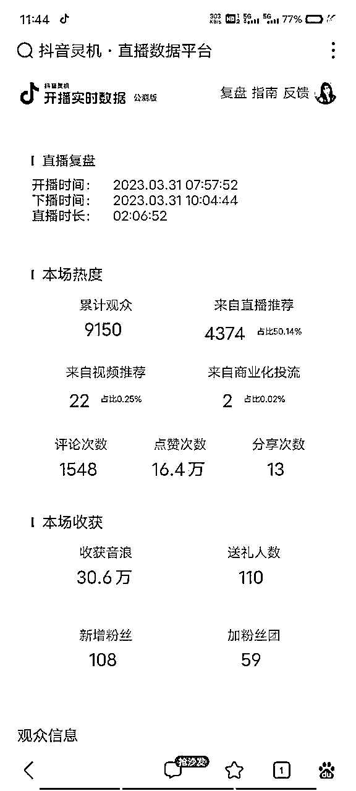

# 抖音弹幕游戏直播，风口已经形成，未来2年最吸金的直播形式（龙珠文）

> 来源：[https://xn5qnsyzkj.feishu.cn/docx/CQXRd5Lc5ozWjFxwgpgcqmk5nAe](https://xn5qnsyzkj.feishu.cn/docx/CQXRd5Lc5ozWjFxwgpgcqmk5nAe)

大家好我是羚羊先生，生财5期圈友，上期在生财还在做美妆项目，写过一篇做从0开始做美妆的文章：

《如何从0到1运营一个品牌，1年盈利500万》

22年我开始转型做抖音直播公会，做了大半年的娱乐直播公会，不算成功，直到年底才赶上了风口，弹幕游戏直播，今天就来深入剖析一下这个抖音直播项目。

# 一、抖音弹幕游戏直播概述

弹幕游戏定义与特点

弹幕游戏是一种诞生于直播平台的新型游戏玩法，通过技术实现游戏和直播间的互动。观众可以通过弹幕或礼物影响游戏的进程，使得游戏成为直播间的一个重要内容。以下是弹幕游戏的一些特点：

1.互动性强：弹幕游戏让观众参与度特别高，大家可以发弹幕或送礼物来改变游戏进程，实时互动。从下图可以看出互动比例大约在8-10%左右

2.游戏类型丰富：弹幕游戏有很多种类型，比如阵营对抗、搞笑休闲、生存塔防等等。这样的多样性满足了不同观众的兴趣和需求。

3.提供丰富的直播内容和直播间价值：主播只需要作为引导者，在弹幕游戏直播里，主播就像是游戏主持人。他们负责解释游戏规则、讲解游戏进程，营造氛围。

4.赚钱能力强：因为观众要送礼物才能最大程度的影响游戏胜负，能够满足观众的胜负欲和表现欲，所以直播间的礼物收入很高。而且不需要有很多的流量，弹幕游戏主播由于做的是精准流量，1小时场观普遍在300-2000之间。

所以，弹幕游戏作为一种娱乐直播形式拥有：上手容易，数据好做，直播收益高等特点，是目前吸金能力最强，可持续（得到抖音官方的认可，开启了弹幕玩法专区）的风口项目。

口说无凭，直接上数据

我是去年12月份开始做弹幕游戏直播公会的（去年12月中旬官方弹幕游戏上线），从零开始，4个月的时间把一个公会从0做到3星，这是这几个月的公会收入。

目前公会有弹幕游戏直播权限的主播100多位，平均收入5000+ ，主播最高月入10万+，而且主播95%都是新手小白，包括前三的头部主播，都是完全没接触过直播的人，男性主播占比80%以上。最近才开始有有直播经验的女主播开始进入公会，成绩都很亮眼，平均每天3-8万音浪，较高的时候接近30万音浪左右，这已经是接近头部娱乐主播的成绩了。

目前市场在刚刚开启，优秀的主播开始陆续入场，市场份额将会逐步放大，抖音对弹幕游戏的发展一直持谨慎态度，并没有完全放开流量，对游戏玩法的审核也比较严格，很多好玩的玩法都暂时无法过审。但是抖音对游戏行业一直有很大的野心，这次游戏和直播的结合是一条不错的道理，未来发展空间很大。

# 二、抖音弹幕游戏直播市场机遇

1.  抖音平台的庞大用户群与广泛影响力

抖音日活7亿，拥有大量高净值人群，和非理性消费群体，足以养活大量的主播

1.  新型直播形式带来新的市场空间

全新的直播形式带来了新的增长，之前游戏直播一直是有观众，没刷量，游戏主播很痛苦，现在很多游戏主播转型做弹幕游戏直播，一天的收入就顶过去一个月的。

1.  相对较低的市场竞争

由于是新市场，还没有传统娱乐直播那么内卷，现在娱播赛道，没颜值，没才艺的主播很难有收益，而弹幕游戏直播，不需要颜值和才艺也能播出来高音浪，有颜值有才艺的来做这个赛道更吃香。

# 三、适合抖音弹幕游戏直播的主播类型

1.  游戏类主播：熟悉游戏机制，善于挖掘游戏亮点，解说更专业

1.  带货类主播：语言有号召力和感染力

1.  娱乐直播领域的主播：利用颜值与声音特点抢占市场份额

1.  当然目前如果你是一个纯小白，只要你有足够的学习力，表达无障碍，愿意在这个赛道学习实践3个月也能拿到一个不错的成绩

# 四、抖音弹幕游戏直播的挑战与应对策略

1.  起号技巧如何打造稳定的账号

1.  技术支持与游戏更新和维护

1.  最新的游戏资讯，主播经验数据分析，经验总结和分享

1.  主播个人能力的提升

前3点公会都会帮你解决，主播能力提升更多的要靠主播自身的努力。

# 五、抖音弹幕游戏直播的前景与展望（个人和公会层面）

个人层面：

首先作为一个创业项目，弹幕游戏直播目前正处于风口阶段，具备低投入低风险的特点（硬件方面只需要准备一台性能不错的电脑，没有可以租，声卡麦克风，摄像头没有也可以用手机代替），适合绝大多数人来尝试，目前就我手里的数据来看18-45岁的主播都有，而且都能取得不错的成绩，可以说是目前上手难度最低，收益天花板最高的直播项目。

公会层面：

如果也想做一家抖音直播公会也是可以的，只要你有主播资源，有招募主播和培训主播的能力，也可以进入这个赛道，因为目前做弹幕游戏，主播基本都要加入公会，入会报白才能拿到所有的游戏权限，任何一款游戏都可以播，个人主播只能自己对接游戏厂商，且只能播游戏商的一款游戏，可选范围小，局限性大，对于公会招募主播非常利好。不像娱乐直播，不加公会也能播。所以弹幕游戏公会招募主播相对容易的多，发展迅猛。

当然了，如果你觉得培训主播管理主播太麻烦，也可以选择做一个甩手掌柜，只要你有主播资源或者招募能力，都可以找我合作，由公会来培训和服务主播，公会可以给你开一个独立的经纪人后台，你可以看到主播的所有数据和任务完成情况，每月根据抖音的账单分红即可。

https://union.bytedance.com/open/portal/?appId=3000 公会注册和经纪人注册地址

希望这篇文章能为你选择抖音直播项目带来一定的参考价值和帮助

微信：jlwh91，欢迎圈友交流