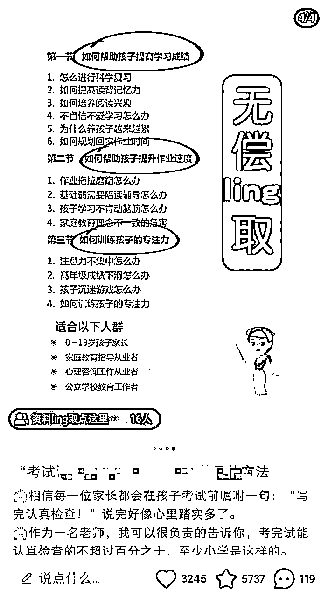

# 全行业通用：小红书引流逻辑和套路拆解

> 来源：[https://p03a4vs9s2.feishu.cn/docx/Efm3dQsmpoUyHxxDPaAcoqXvnVe](https://p03a4vs9s2.feishu.cn/docx/Efm3dQsmpoUyHxxDPaAcoqXvnVe)

# 自我介绍

哈喽，我是叁斤

从2020年开始第一次接触小红书，做好物分享矩阵号，一个人运营10个账号，接广告号收入一个月1w+，引流号一天一个号稳定引流100+精准用户

这套引流逻辑是我运营几十个号验证过的，所有行业通用。去其他平台引流，底层逻辑也是一样的

# 以下正文：

小红书对引流的监管力度又加大了不少，简介不能挂邮箱、群聊也出了《社群公约》，明确写了不允许发布导流至第三方平台的相关内容

不管以前多好用的引流方法，只要平台规则更新，都有可能失效。今天叁斤分享一些压箱底的引流底层逻辑给你们

目录

1.  强化用户私信的动机

1.  降低用户私信的难度

1.  提示用户私信

# 一、强化用户私信的动机

一切引流的前提，都是让用户对你产生兴趣，让用户有“我想与这个作者建立联系”的想法，只有产生想法，才能产生对应行为的动机（私信）

那要如何让用户对你产生兴趣？

## 1 选题&内容

不是所有的选题和内容都适合引流，有些笔记很爆，评论互动也很多，但就是没有人联系你，更没有人对你的资料、服务感兴趣。

所以在选题和内容上，参考以下几点：

用户想要的

我们的选题和内容，得吸引”想要买产品/服务“的人

比如我们要卖副业项目，目标人群是宝妈，笔记就应该直接分享宝妈副业和女性成长类。

这才是目标用户想看的内容，吸引的人群才是对产品感兴趣的

如果发育儿知识、宠物之类的，笔记可能会火，吸引来的也有宝妈，但人对这个产品是不会感兴趣的

所以，选题和内容的第一个重点，就是要给目标人群想要的东西，内容也得是他们想看的

用户有需求的

内容和选题的第二个重点，是要戳中用户的需求点。

还是拿上面案例来说，目标人群的需求点是“一份全职宝妈就能做的副业”，围绕这个做选题，吸引到人群是最精准的

而发育儿类知识，笔记容易火，但引流效果反而不如前者，万赞的效果也不如前者百赞的效果好

戳用户的痛点

其实很多用户在刷笔记的时候，是不知道自己需求的，所以我们还需要戳一下用户的痛点来刺激需求

继续案例，对“宝妈副业项目”感兴趣的人群，她们的痛点有很多

有时间但没收入、日子枯燥、想补贴家用……

选题戳这些痛点的话，会更容易刺激他们对副业需求，让他们产生“联系这个作者学习副业”的想法

## 2、封面图

前期封面图直接找到对标账号和对标的近期爆款笔记，1:1去模仿就可以了

这里分享3种常见的爆款封面类型：

对比型封面

左中右对比，上中下对比，前后对比

常见于： 穿搭前后对比，减肥前后对比，风景季节对比等

要点： 一般强调产品的过程前后效果，健身前后、改造前后、风景不同季节对比，一个前后对比制造极大反差吸引人注意

制作： 使用前拍摄1张图，有变化之后再拍摄一张，用美图秀秀、醒图等工具拼接起来，再加上图片标题和before、after的字眼

纯文字封面

若干关键词，标题+关键词，提取主题

常见于： 读书笔记，干货笔记，硬核教程等

要点： 修饰词要足够有噱头，封面只写一个开头，吸引人点开看内容是什么。也可以强调时间、方法论等，让粉丝对内容有所期待

制作： 明确笔记主题，确定一个小标题，然后使用搞定设计、创客贴、PS等工具制作，搞定设计和创客贴有现成模板

大合集封面

把所有涉及的干货、内容、产品都拼到一张图

常见于： 干货分享、食谱分享、影视资源等

要点： 这类型流量比较有保障，用户一眼就知道是不是自己需要的内容。只要选题合适，排版主次分明，大小有序，基本问题不大

制作： 在制作内容图片的时候，考虑自己拼多少张，怎么把重点突出。拼图最重要的是排版要简洁、舒适，不能杂乱。

## 3、内容图

内容图片最重要的是要告诉用户，你有产品，而且可以购买/领取。

这里推荐4个常用的方法：

分享打印资料

把资料打印出来，告诉用户你有电子版，可以打印领取。

不完整资料

在自己的内容图片中，告诉用户你笔记分享的资料是不完整的，完整版有多少，这样用户一看就知道，需要找你领取

晒收益图

适合做ip类型和副业类型的账号，直接把相关的收益截图放到图片内容中，金额大一些，给用户的视觉冲击会更强。

交付截图&用户反馈

把用户购买产品的界面、发产品给用户的界面以及用户对你产品的评价界面截图，稍微遮挡一下用户头像和信息等，放到笔记中

4个方法都不会违规，而且都很好用。前面两个适合有资料的账号类型，最后这个几乎适合所有需要引流的账号类型。

# 二、降低用户私信的难度

不管在哪个平台，我们都要降低用户联系我们的难度。用户必须很容易就能找到你（私域），否则这里会流失大量潜在客户

如果你的用户年龄比较大的话，难度要低到“只要不傻，一看就懂”的程度

因为大部分平台都不能直接放微信号，所以我们要制作一份能联系上我们的sop教程发给用户，且不能被平台检测

## 1、私信sop

私信sop有两个比较好用的方法：手写纸条和sop流程图

手写纸条

手写纸条告诉用户，需要用什么软件，留下什么信息？

或者需要搜索什么信息才能联系到我们？

用手写的方式，能更好避开平台的检测，而且可以随时拍新图，图片重复率会低一些，判定你群发同一张图的概率也会低

sop流程图

用流程图的方式告诉用户，需要怎么找到你？第一步干嘛？第二步干嘛？

流程图会比手写更加直观，但一张图不能重复使用太多次，要注意更换排版

流程图的方式也不会太容易违规，只要把敏感字打码处理，都没问题

## 2、sop包含信息

sop和手写纸条都要包含这些信息，让用户更快速的找到我们

*   去哪里找我们？怎么找？

*   搜什么关键词能找到？

*   哪一个是我们？

*   我们里面有什么？

*   ……

把这些信息整理成步骤图，再用作者号或小助理号发给用户，流失率会更低

# 三、提示用户私信

在笔记的多个位置设置提示，告诉用户：要联系作者了

## 1、图片内容

在图片内容中，植入一些能提示用户联系我们的图片，让用户在看到图片的一瞬间，想到要联系你

前面提到的交付图也是一种提示，以图片形式告诉用户：我这有产品，而且真的有用，真的在分享！

## 2、评论区

在评论区置顶一些让用户联系的话术，可以小号评论，大号回复来带节奏

后续有用户评论，要及时进行回复

## 3、私信

评论会有很多屏蔽词，所以可以直接私信用户，引导用户回复

或者引导用户进群

回复之后，再把引流的sop图片发过去

## 4、群聊

新用户进群超过10个，就编辑一次群公告，否则用户多了会把消息盖下去

小红书群聊打开率很低，最好每次放人进群就编辑一下

在群里引流的时候，多用小助理号，发一些资料图片和引流sop图，如果是副业类型，可以多放些收益截图

# 总结

以上，就是小红书引流的逻辑，方法会根据平台更新而变化，但逻辑不变

用户私信行为=私信动力 * 私信能力 * 私信提示

眼熟吗？就是《福格行为模型》。当第一次看这本书，知道这个行为公式后，马上用于小红书引流，没想到效果真的不错

掌握这个逻辑，不管平台怎么变化，只要在具体方法上，不要触及平台红线，引流都没什么问题