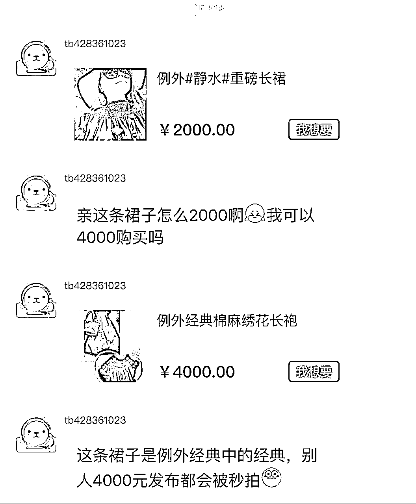

# 在闲鱼随手卖了10W+自己的旧衣，有几点经验总结

> 来源：[https://y2w73sabxw.feishu.cn/docx/EkZTdONM7oPzFvxbfbtcuQ2Unwd](https://y2w73sabxw.feishu.cn/docx/EkZTdONM7oPzFvxbfbtcuQ2Unwd)

大家好，我是阿黛。刚刚加入生财的萌新。

比起大佬们动辄百万级千万级的资金体量，我的项目弱的不值一提。

但因为发现有很多比我还互联网小白的伙伴，

没有什么储备，从未下过场，非常迷茫，

所以就拿出我的这些例子，看能不能给到一些借鉴和参考。

以前一直做的实体生意，有过黄金时代，行业没落之后转型非常吃力，

卖家乡特产腊肉算是一个路径，分享被加了精华，也得到很多朋友的鼓励，

在这个过程中我其实还学会了重要的一点：

人啊，得有随手赚小钱的能力，能赚的钱都去赚一下试试，

万一中间有机会赚到大钱呢？

做职业经理人的时候销售额以亿计，本来跟我毫无关系，

但人在某种光环下容易迷失，

后来我花了很长时间来适应年薪百万和卖一斤腊肉只赚几块钱的落差，

也逐渐养成了随手赚小钱的习惯，

相信假以时日，总会遇见大生意。

千里之行，始于足下。

光想不行，起心动念就要马上去做，

所以我个人非常期待生财的航海实战。

在闲鱼卖旧衣服很偶然，就是换季时在家整理衣柜，

发现很多衣服不怎么穿，尤其是郑州这种春秋超级短暂的地方，

有的一年能穿一次都不错了，

于是拍照挂闲鱼，没想到直接变现了十万+，

后来也发现，有很多姑娘专门做这类生意，也能获得不错收益。

我可能不是可以普遍参照的样本，

卖自己的旧衣服，个人风格强烈的人可能比较容易，

总结了几条，算不上经验吧，或许能有一些启发，

也可以从现在开始留意，慎重买进，

几年后还可以让金钱尽可能重新流动起来。

稳定的风格利于储备潜在的精准客户

物以类聚，人以群分，早早找准自己的风格，近二十年来我穿的品牌非常固定，基本都是例外和楼上的拉姆，部分Uma Wang，极少数小众设计师的个别作品，他们有一个共同的特质，就是设计超然在流行之外，永不过时。

马可还是例外主设计师时，喜用重磅棉麻，宽宽大大，太瘦小的人反而不好驾驭，深受气（fei）质（pang）文艺女青年的追捧，很多衣服到今天还被奉为经典，更不用说那些限量款了。

年轻时候每一季上新我总能买到好多件，还专门打飞的去买只在直营店售卖的款，消费金额高到品牌订机票酒店邀请我去看秀，还有人给我取了个绰号“X例外”。现在的设计就很一言难尽了。

楼上的拉姆是一个特立独行的存在，创始人是将古董绣片元素引入服饰的创导者， 2004年品牌创建以来秉持“创作惟一”的理念，尊重每一块绣品的不同，十九年来所有的作品没有一件重复，都是孤品，吸引了许多同样特立独行的拥趸。

这也算某种意义的长期主义吧，穿它们的时间足够久，手里自然拥有很多他人也喜欢但没有买到的作品，好多人都是在博客微博时期因为这些持续关注的我，发现我挂闲鱼转手就会去秒拍掉。

小众设计师作品也许是潜力股

有些设计师或许不太知名，但作品可圈可点，能挑出来几件穿一穿，16年前我就在某宝买过几条获奖的裤子，价格也不高，现在这个店已经没有了，设计师也不知道去了哪里，但裤子还是好裤子，还有人接着喜欢和欣赏，别说我卖的价格还可以，其实不管卖多少钱都觉得开心，毕竟质地好也没穿过几次，当废品丢弃或论斤卖掉就太可惜了。

另外，作为不可再生资源的古董绣片，在固定的圈儿里自然是保值升值的，所以部分老绣衣服的售价甚至可以高过买入价，都还有人愿意买单，应该也有设计师买下再进行重新创作，有些小姐姐加了我微信，会直接发我的照片问穿的衣服卖不卖，也转手了一些，除了特别喜欢的或穿过很多次旧了的不卖。

反而一些奢侈大牌出手困难，价格也不好，18年收到别人送的GUCCI托特包，专柜1万8千多，全新没拆，问二手店，收购只给2000块，就留着自己背吧。

固定一个平台别分散

没有必要多个平台都挂，精力本来都不够用，也不利于客户找寻积累，二手平台也是需要好好运营的，我是完全佛系，来讲价我根本不理，也不拍摄视频，想起来就点进去按平台要求将货品擦亮，若是我配合度高一些，肯定能卖更多。

我们并不需要这么多衣服和包包

囤积真是一种病，我虽然卖了不少，但家里堆的更多，但常穿的往往就那么几件，包包也是，我现在出街拎的多是环保袋，放电脑装健身的衣服都很方便。

年纪渐长，对物欲的渴望变的很低，很少对什么东西势在必得，内心足够丰盛，也就不需要用外物来武装证明自己了。

然而在明白这些之前，我实在太能买了，不止衣服，半夜醒了还遥控在巴黎的闺蜜帮我在拍行买古董酒具和皮箱，买太多家里放不下特意在乡下我的员工宿舍旁租了个仓库存放，后来项目结案我置业顾问撤场搬离，为了继续照看其中一个女孩儿把它们带走放在自己婚房的客房，后来她小孩儿都一岁多了我才拉走，想想我这样的老板也是够了。

终于下决心来开始卖卖卖的时候我就开了一间店（啊关于这个，我又有分享的素材了），那会儿郑州很多自媒体来采访。可惜的是7月20日郑州特大暴雨我在负二层的仓库被淹，17天之后我才得以进入查看整理，很多东西都已经无法抢救，以这样决绝的方式永远告别了我。

我现在看中了什么都会先放在购物车或者把照片存进相册，过一段时间翻出来，看看是不是还很想要，多数东西都会被删除，这是抑制冲动消费的很好方法，希望对你也有用。

重点来了，处处都是生意

现在的主流就是搞钱搞钱，斜杠青年中年到处都是，处处皆学问，只要用心并没有我们想的那么难。

对于我们来说也许单纯的出闲置，对于有心的小姐姐可就是生意了，毕竟会不了解行情稀里糊涂就低价挂出去好些经典，人家加个外挂2000块秒拍再换个号6000块挂出去被别人秒拍，转手一件就是好几千的进账，比得上一个普通小白领一个月的薪水了。

我听到的时候目瞪口呆，原来还可以这么玩啊，学到了学到了，虽然可能并不会学以致用，在别的方面多多思考多多留意总不是坏事。

之前例外做一些品牌特卖的时候不会大范围宣传，就是一些老客，不同的城市，一折两折能淘以前的款，就有在淘宝开店的姑娘，拖着箱子跟着跑。

以上，就是我全部的分享，希望能给大家多一些思路。不过写着写着，我怎么感觉这篇好适合在花钱有术交作业噢。

谢谢。我们下一个赚小钱分享见。