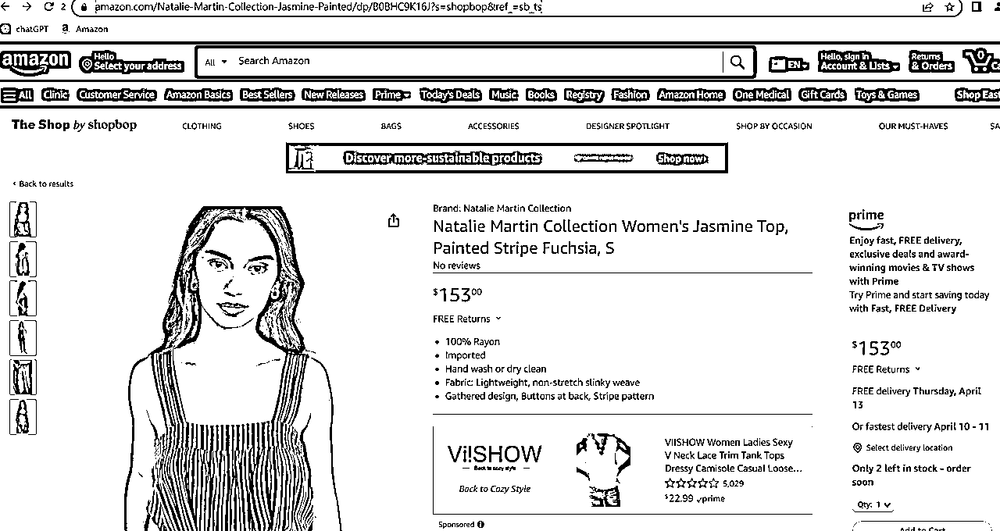
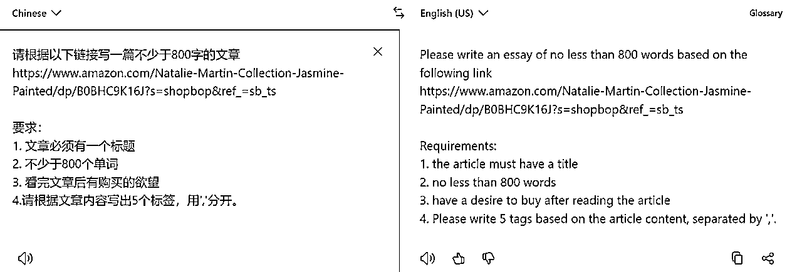
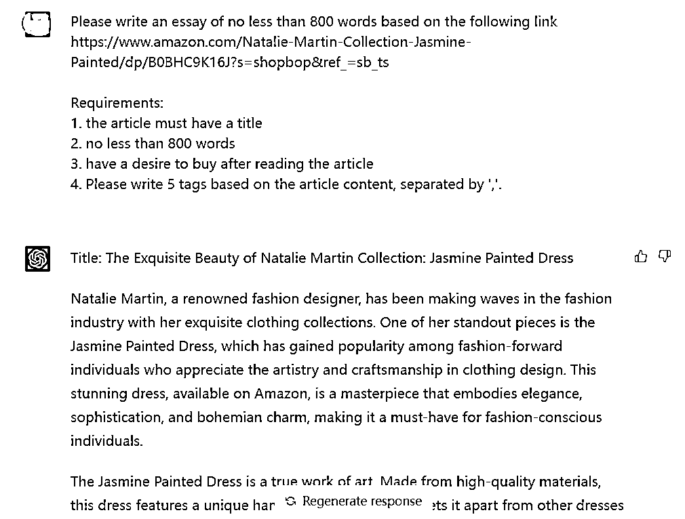
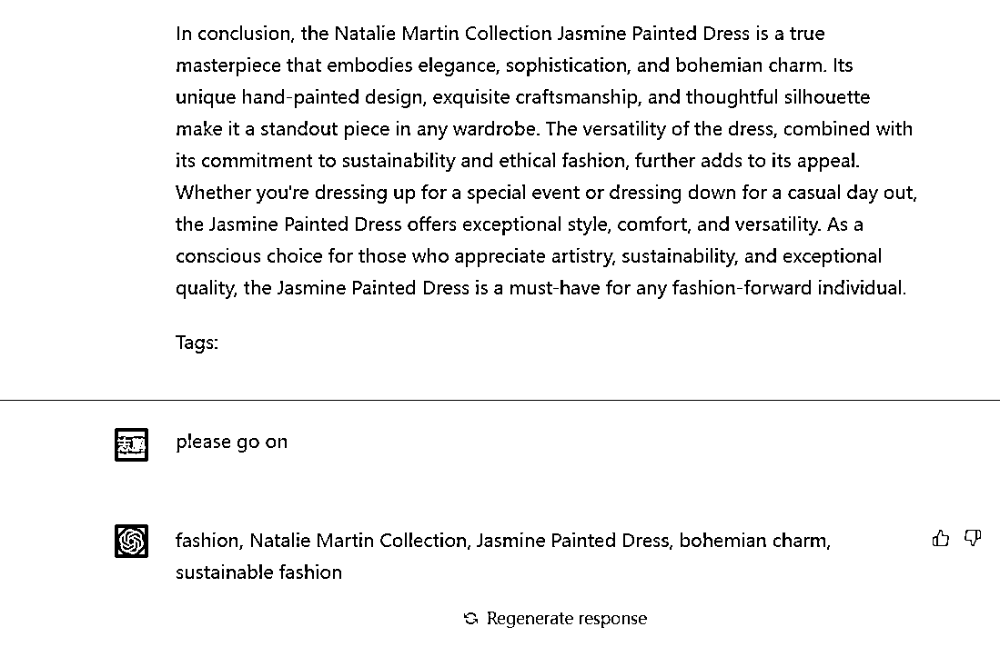
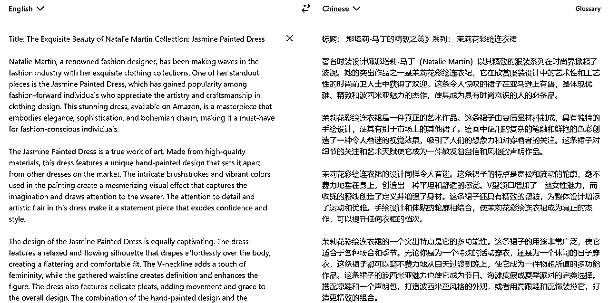
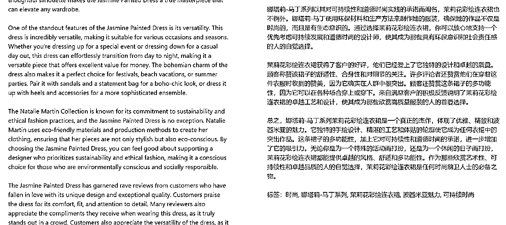

# 如何用chatGPT，撰写一篇关于产品的博客文章？

> 来源：[https://viuejh8h99y.feishu.cn/docx/GpUodUFZHoULIGxKxtYckwI9ncg](https://viuejh8h99y.feishu.cn/docx/GpUodUFZHoULIGxKxtYckwI9ncg)

随着chatGPT的“问世”，有不少朋友都在惊讶“人工智能”的强大，当然也有不少朋友投入了对于chatGPT的研究中。作为优秀的海外广告优化师，当然也要懂得利用好chatGPT去进行博客的撰写。

## 一、我们先来了解一下，博客对于申请网盟（affiliate marketing）offer的重要性：

在当今数字化时代，博客作为一种互联网内容形式，对于申请网盟（affiliate marketing）offer的重要性不可忽视。网盟是一种通过推广他人产品或服务来赚取佣金的营销模式，博客作为一个有效的营销工具，可以对网盟申请产生积极影响。以下将探讨博客对于申请网盟offer的重要性。

首先，博客可以提供丰富的内容，吸引潜在消费者。作为一个拥有独立域名和自主品牌的平台，博客可以为网盟产品或服务提供专业、有深度的内容。通过发布高质量的文章、评测、教程、指南等，博客可以吸引目标受众的关注，并建立起与读者之间的信任关系。这种信任关系有助于激发读者的购买兴趣，提高网盟产品或服务的点击率和转化率。

其次，博客可以为网盟产品或服务提供有针对性的推广。博客可以根据其内容定位和受众特点，选择与之匹配的网盟产品或服务进行推广。例如，如果博客的主题是健康和健身，那么可以选择与健康食品、运动器材等相关的网盟产品或服务进行推广。这样，博客的读者就更有可能对这些产品或服务产生兴趣，从而提高点击率和转化率。博客还可以通过多种形式的推广，如文字推文、图片、视频、广告位等，灵活地将网盟产品或服务呈现给读者，提升其吸引力。

第三，博客可以增加网盟申请的可信度和可靠性。当网盟商家审查申请者时，博客作为一个有价值的在线平台，可以为申请者增加可信度和可靠性。博客可以通过其独立性、专业性和影响力，向网盟商家展示申请者的实力和潜力，从而增加获得网盟offer的机会。此外，博客还可以通过提供与网盟产品或服务相关的实际案例、使用经验、用户评价等，进一步加强申请者对网盟产品或服务的了解和信任。

最后，博客可以提供长期的推广价值。与社交媒体等短期推广方式不同，博客的内容可以在网上长期存在，并通过搜索引擎等渠道不断引流。这意味着，一篇优质的博客文章可以在很长一段时间内持续地吸引潜在消费者，并为网盟产品或服务提供持久的推广价值。这种长期的推广效果有助于提高网盟产品或服务的曝光度和知名度，从而增加潜在消费者的认知和购买兴趣。此外，随着博客的不断发展和壮大，其读者群体也可能逐渐扩大，为网盟产品或服务的推广提供更广泛的受众基础。

综上所述，博客对于申请网盟offer的重要性不可低估。博客可以通过提供丰富的内容、有针对性的推广、增加申请者的可信度和可靠性以及提供长期的推广价值，对网盟申请产生积极影响。博客作为一个独立的在线平台，具有自主品牌和影响力，可以为网盟产品或服务提供有效的推广渠道，并吸引潜在消费者的关注和购买兴趣。

在这里，我们以Natalie Martin Collection的Jasmine Painted Dress为例，来展示博客在申请网盟offer方面的重要性。Natalie Martin Collection是一家以可持续时尚为主题的品牌，其Jasmine Painted Dress是一款充满波西米亚风情的时尚单品。博客可以通过发布关于时尚、可持续时尚、波西米亚风格等主题的文章，吸引潜在消费者的关注，并建立起与读者之间的信任关系。通过对Jasmine Painted Dress的详细评测、穿搭指南、搭配建议等内容，博客可以激发读者对该单品的购买兴趣，并提高其点击率和转化率。

此外，博客可以通过针对性的推广方式，将Jasmine Painted Dress呈现给与该单品兴趣相符的读者。例如，博客可以通过在文章中插入关于Jasmine Painted Dress的图片，或者在文章末尾添加购买链接，引导读者前往购买页面。博客还可以在社交媒体平台上进行推广，例如通过Instagram、Pinterest等发布有关Jasmine Painted Dress的图片和信息，吸引更多潜在消费者的关注。这种有针对性的推广方式有助于提高Jasmine Painted Dress的曝光度，增加潜在消费者的认知和购买兴趣。

同时，博客作为一个独立的在线平台，可以为Natalie Martin Collection提供增加品牌和影响力的机会。博客可以通过持续地发布有关Natalie Martin Collection的内容，如品牌故事、设计理念、产品特点等，建立品牌形象和品牌认知。博客可以通过与读者的互动，回答他们的问题、提供专业的建议和意见，增加读者对Natalie Martin Collection的信任和好感。这种品牌建设可以为Natalie Martin Collection在网盟申请时提供更多的可信度和可靠性，从而增加网盟提供方对申请者的认可和接受。

此外，博客还可以为Natalie Martin Collection提供长期的推广价值。一旦博客建立了稳定的读者群体和持续的流量，其对Jasmine Painted Dress的推广效果将会持久存在。即使某篇文章发布后一段时间过去了，仍然可以通过搜索引擎、社交媒体等渠道被潜在消费者找到并产生点击和转化。这种长期的推广效果有助于提高Jasmine Painted Dress的曝光度，增加潜在消费者的认知和购买兴趣，从而促进网盟产品或服务的销售和推广。

总的来说，博客在申请网盟offer方面具有重要性。博客可以通过提供丰富的内容、有针对性的推广、增加申请者的可信度和可靠性以及提供长期的推广价值，对网盟申请产生积极影响。对于网盟提供方来说，与有影响力和受欢迎的博客合作，可以为其产品或服务提供有效的推广渠道，并吸引更多潜在消费者的关注和购买兴趣。因此，在申请网盟offer时，博客应被视为一种重要的推广工具和资源。

## 二、利用chatGPT撰写博客文章的分享：

chatGPT能做很多工作，这其中就包括撰写博客文章。

步骤1：找到对应的商品链接

步骤2：编辑你想要让chatGPT生成的内容

步骤3：chatGPT根据需求，撰写对应的博客文章

步骤4：进行人工查验

①这里需要重点讲一下的，chatGPT是可以根据不同国家，回复不同语言的；

②最好进行查验，我曾经遇到过chatGPT回复的内容“答非所问”的，所以我们是需要进行人工复核的；

③当然，这里省略了博客中添加商品对应图片的步骤，也省略了添加商品真实链接的步骤，一切都需要真实！

## 写在最后：

科技会让我们的生活变得不一样，尤其是像chatGPT这样的工具“问世”之后，如果能够利用好，那么将会省下非常多的人力开支与时间成本。我们在做海外广告项目的同时，也在不断地进行项目深耕研究，用更多工具帮助我们，投入尽可能少，产出尽可能多！