# 普通人如何打造自己的创业类付费社群，2个月引流200+付费用户，变现9900+

> 来源：[https://pbw5yhoa0k.feishu.cn/docx/K3oEdbAo1o5fq4xlSf3cOhkMnrg](https://pbw5yhoa0k.feishu.cn/docx/K3oEdbAo1o5fq4xlSf3cOhkMnrg)

大家好，我是新侠，主职是苹果供应链中某上市公司中层，管理20+人的工程师团队和50+人的普工团队，善于数据分析和团队管理（企业），副业是在互联网上捣鼓一点小项目。

我在今年突发奇想，想做一个创业社群，经过一路抄袭、模仿、创造，最终创建了一个互联网项目付费社群。

2个月的时间社群从19.9一路涨价至199，最终吸纳200+会员，总共变现9900+ （这里没有统计一些直接微信或支付宝的收款，加上的话也有一个一两千吧）

第一个系统店铺，后转用小鹅通系统

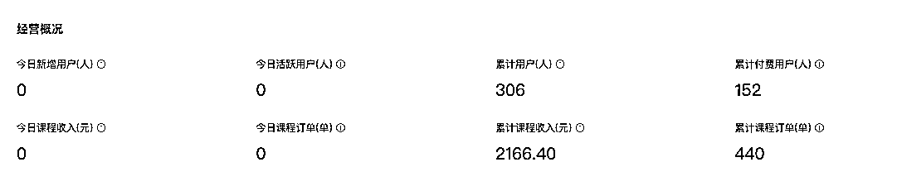

小鹅通系统截图

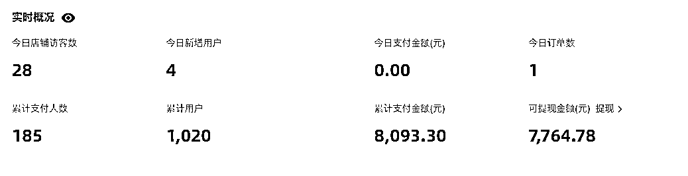

同时，在4/2把我的项目思路和方法教给一个完全没有接触过互联网的小白（我的小舅子）。

4/6 他成功开单，跑通闭环，共4天时间。

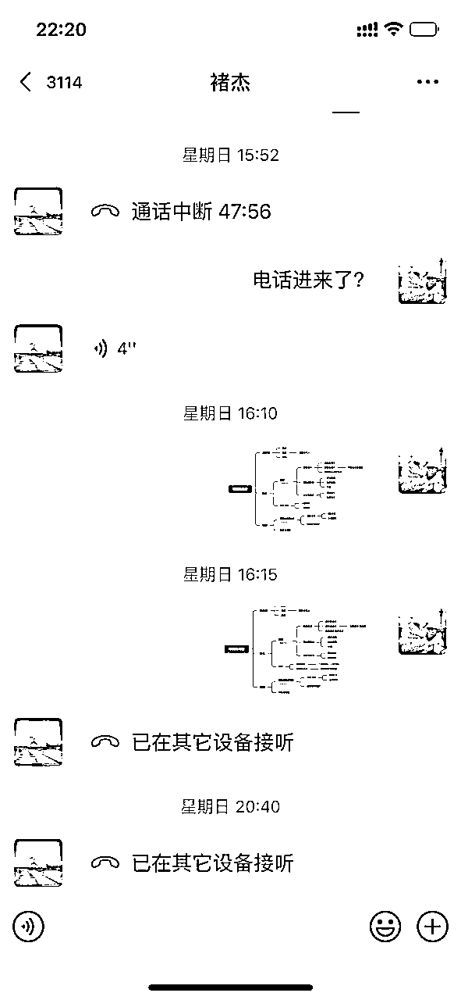

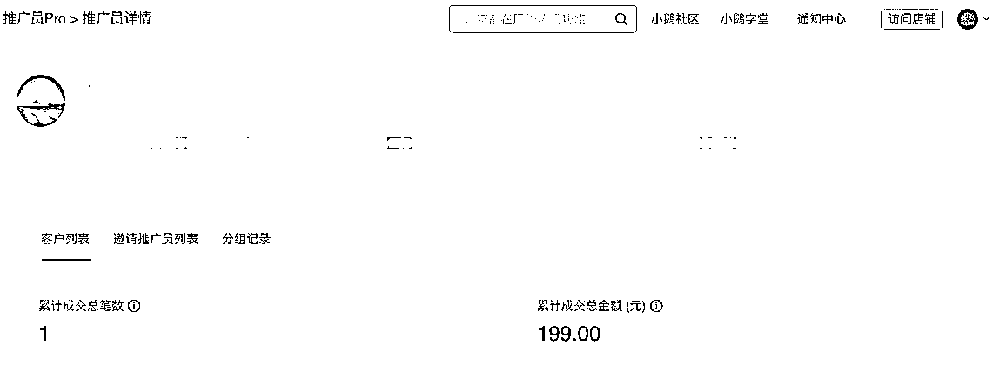

虽然经过几个月的跌跌撞撞，好在总算趟出来一条可行的互联网道路，并且经过验证这套方法同样适用于其他和我们一样的普通人操作。

本文我尝试着把我整个项目中遇到的问题，我的解决方式以及我的一些思考记录下来，当作是一个复盘，也希望能对你有所启发。

# 一、初步探索

去年下半年，我开始尝试PPT拆项目的来做一个抖音的创业IP。

说实话，毕竟单论从做PPT的角度，我确实比目前市面上95%做PPT拆解的要厉害（毕竟在上市公司混到中层，天天应对国内外客户的各种会议，PPT做不好真的说不过去）。

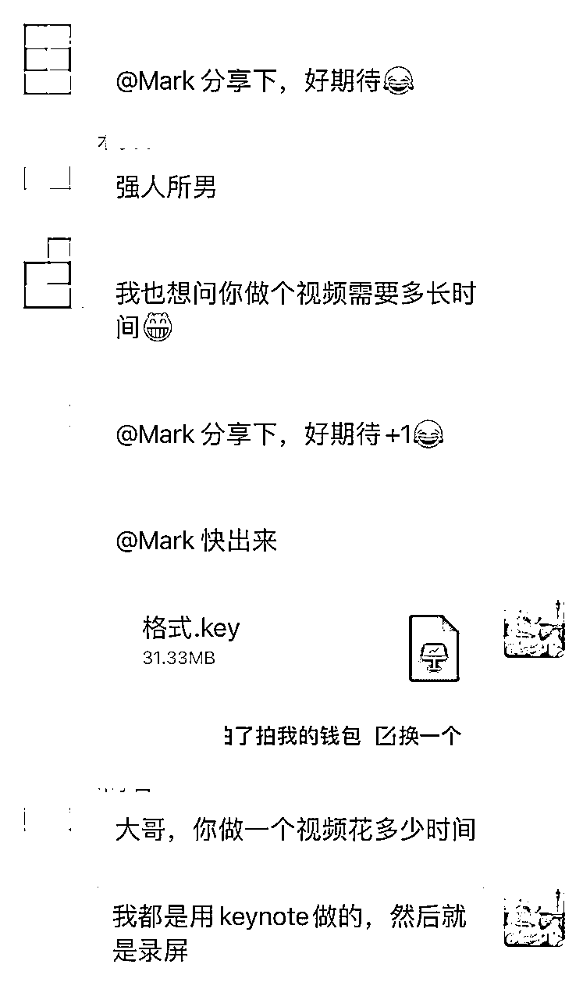

关于这个项目，我的成绩是第一个作品破了3000播放，第13个作品迎来了6.1w的播放（纯自然流），然后第20个作品喜提封号30天。

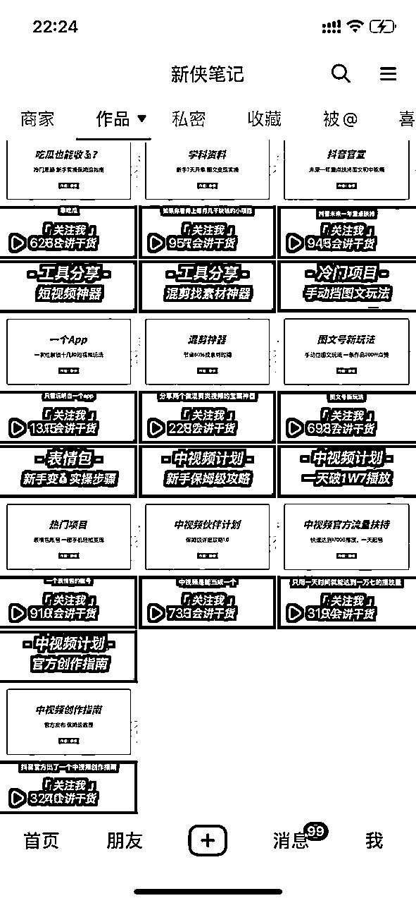

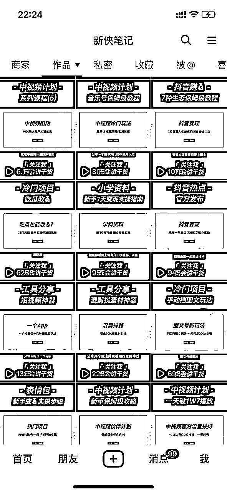

我的工作比较忙，基本每天晚上8点多下班，然后花费2个小时坐在电脑前写PPT、配音、剪辑视频。

并且在此之前我已经被封了2个号，且没有从这个项目上获得任何收益，后面心态就有点崩了，又恰好工作上出了很多狗屁倒灶的事情，于是就把这个项目丢到一边去了。

但总体来说，我还是从这个项目上获益良多的：

1、系统性地对抖音IP进行学习，并对互联网项目操盘的前端、后端形成了自己的思考。

2、坚定了要做一个创业类的IP，或者说赛道，要吸引的目标人群是创业类、网创类的粉丝。

3、做一个创业类的社群，并作为产品进行交付。

# 二、第一次尝试，免费创业群

2023年1月

引流方式：

这个阶段我采取的方法是简单粗暴的微信爆粉、群发广告的方式，最终引流100人进群。

社群交付：

微信群交付，辅助免费的知识星球作为知识载体，分享一些创业感悟，以及一些项目教程。

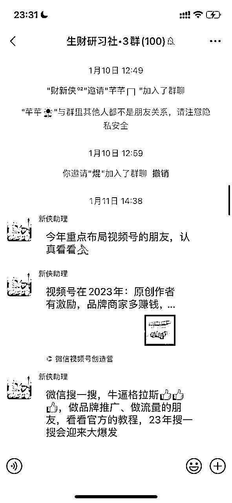

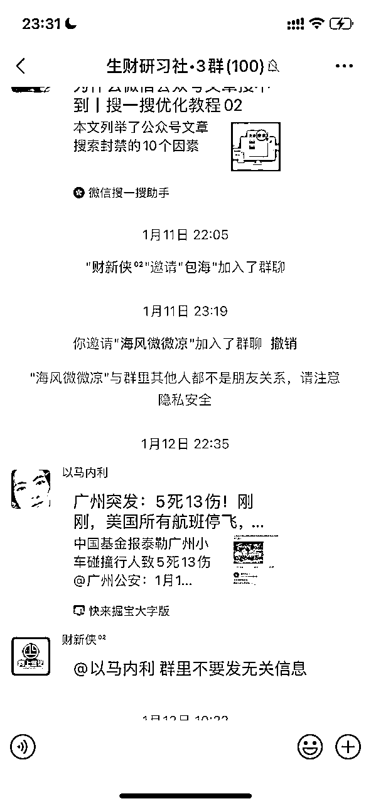

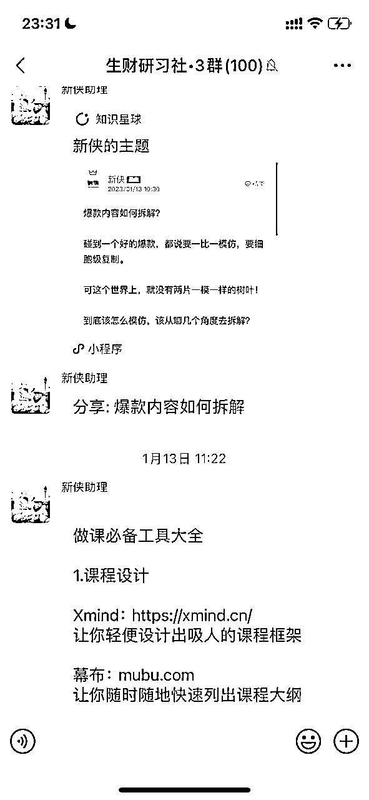

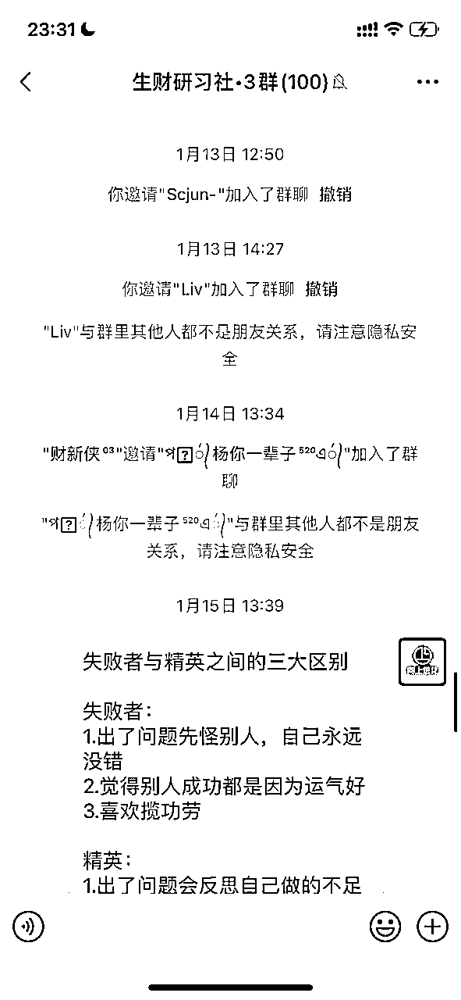

遇到的问题：

1、社群完全没有反馈或要么就是发广告，只有自己在默默输出，做起来非常心累。

2、还没来得及测试用户的付费意识，但我觉得没必要测试了，应该非常差。

我的思考：

1、停止交付，并思考采用付费群的方式。

因为免费，所以停止交付的时候没有什么负担。

2、如果一个项目一开始就没办法变现，那就不要开始。

# 三、探索付费社群，19.9创业群

2023年2月

引流方式：

知+

偶然从知乎上看到有人在分享创业群的文章，并且文章中插入了知+卡片，最终引导用户到微信私域并通过付费进群进行转化，社群定价为9.9～19.9。

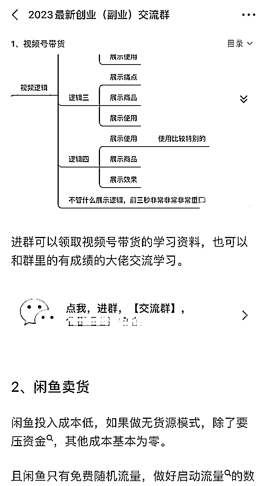

我就想既然产品都是一样的，那我可以研究一下他们的前端和后端。

我就把这么做的几个人的群都进了，并拆解了一下他们的路径。

1、大多数都是采用跳转到公众号，然后自动跳出付费进群的系统页面，引导用户付费。

2、有一个是引导直接加微信，然后发话术进行转化。

直接引导加微信的是家蒙老师，话术也非常真诚，我认为他的转化应该是比第一种方法要高的。

当然我没有数据，我不能瞎说。但这几个人到现在还在用这种方式引流的，应该就只剩下家蒙老师了。

家蒙老师的话术，非常真诚。这里分享话术已获得家蒙老师的授权。

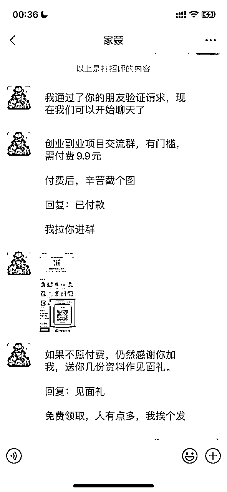

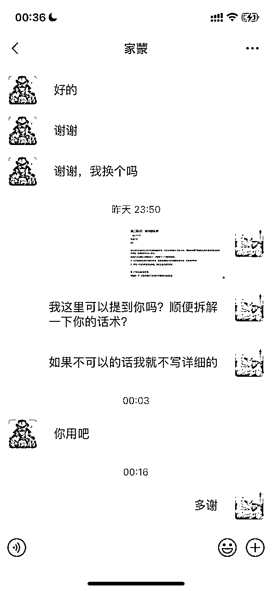

社群交付：

微信群交付，辅助网课系统作为知识载体。

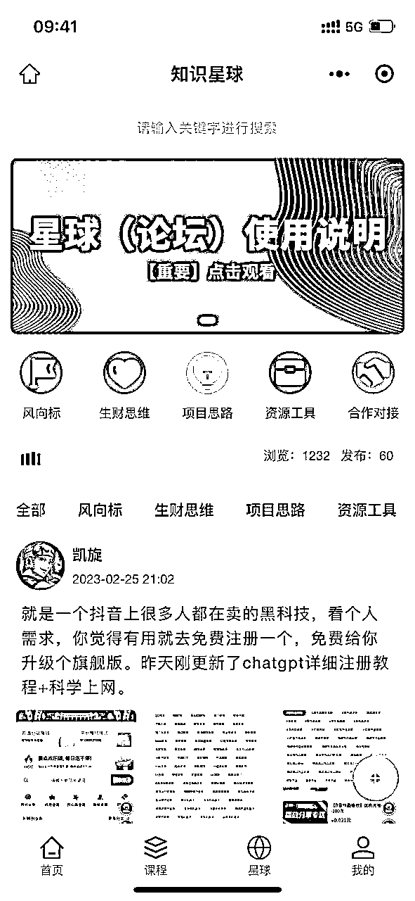

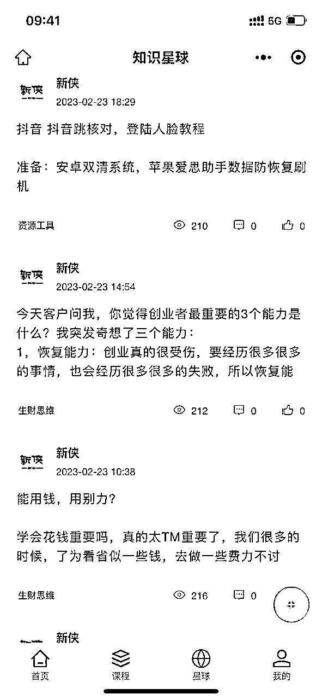

用网课系统的原因是我可以把它用来当作付费进群的付款和说明页面，同时又有类似论坛的功能可以记录社群干货。

当然主要原因还是知识星球最低门票是50元，我的社群才收19.9...

遇到的问题：

1、首先是知乎的投流素材，遇到了很多困难。

后来解决了，借鉴了家蒙老师的文案，减少付费群的描述占比，增加社群内分享的具体项目说明的占比。修改完后每篇都能通过审核。

2、投产比完全是亏损的。

不考虑创业粉的私域价值，单从这个项目来看，最终跑通模型的投产比依旧是入不敷出。

每天投流300+，付费进群收入100左右。

当然，微信公众号留存30+，这里其实也是有隐藏价值的。

如果单从引流效果看，10元的创业粉单价，还是可以接受的。

我的思考：

1、19.9的单价我个人做还能接受，但如果后期想扩大，增加合伙人，这种低价格如何吸引合伙人或者代理？

2、没有找到一种可复制的免费或者投产比是正的引流方式，很难扩大规模和裂变。

3、用户的付费意识是有的，过程中我发售过一期199的项目打卡，付费11人。

# 四、小幅涨价，39元创业群

2023年3月

引流方式：

创业图集号，分发抖音、小红书、快手、视频号平台。

我在3/18加入生财，一进入我就迫不及待的搜寻创业粉引流方式，并在航海实战找到了“创业项目IP”的航海手册，和之前比高老师的课配合使用，受益颇多。

考量到PPT拆项目的方式需耗费我大部分精力，我在这个阶段选择了图集号的方式。

图集号在现阶段更适合我的原因是：制作一篇仅需要15分钟，我可以腾出更多时间来处理其他的事。

其中抖音和快手的流量还不错，平均每天可以帮我引流10～20人进公众号（目前只做了单号）。

视频号前期有流量扶持，但2个星期后开始提示作品文字太多，开始限流。

小红书我的流量完全起不来，还需要花心思研究研究。

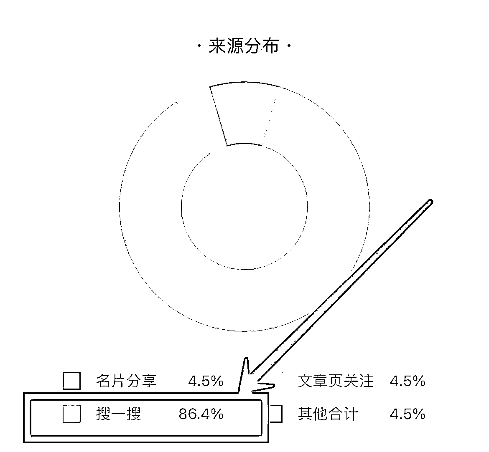

社群交付：

转用小鹅通系统进行交付，之前用的网课系统论坛功能用起来实在鸡肋，免费用户也可查看。

小鹅通旗舰版还带有独立版圈子的功能，和知识星球类似。

没有选用知识星球的原因主要还是不支持50元以下的门票费用。

当然，鹅圈子的缺点也同样显著，就是他没办法直接跳转网页链接，需要复制到浏览器再进行阅读，相比而言使用体验上还是知识星球App更顺滑。

从长远考虑，后期社群费用不再走低价格战略的话还是应该切换回知识星球，毕竟用户体验非常重要。

遇到的问题：

1、这个阶段其实没有太多的问题，我把社群当成口碑产品，提供了超预期的服务，几乎所有人都是好评。

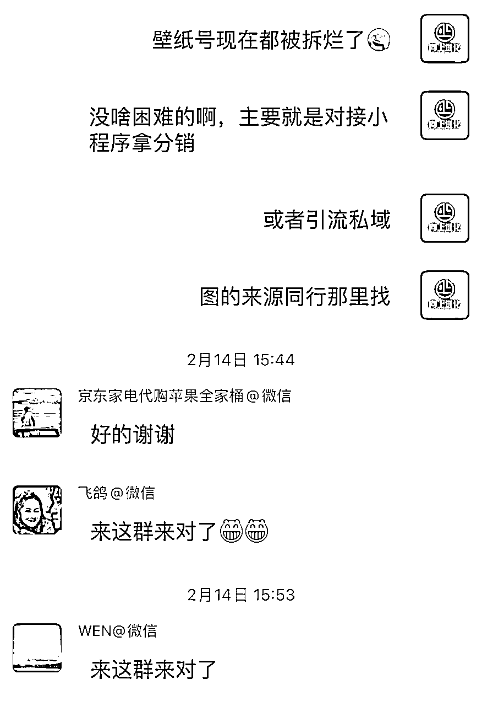

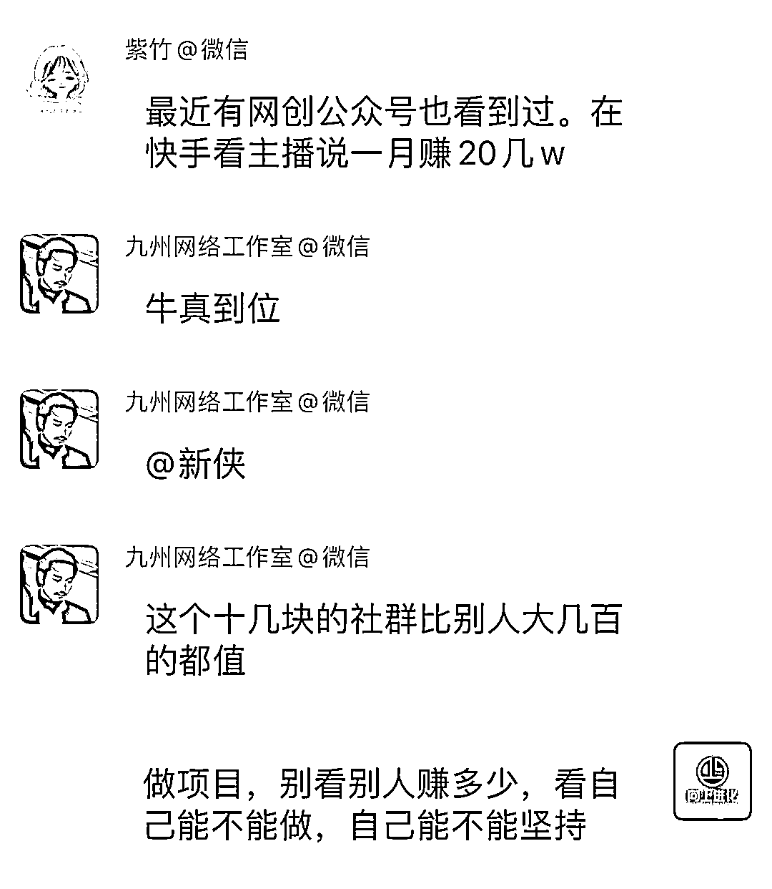

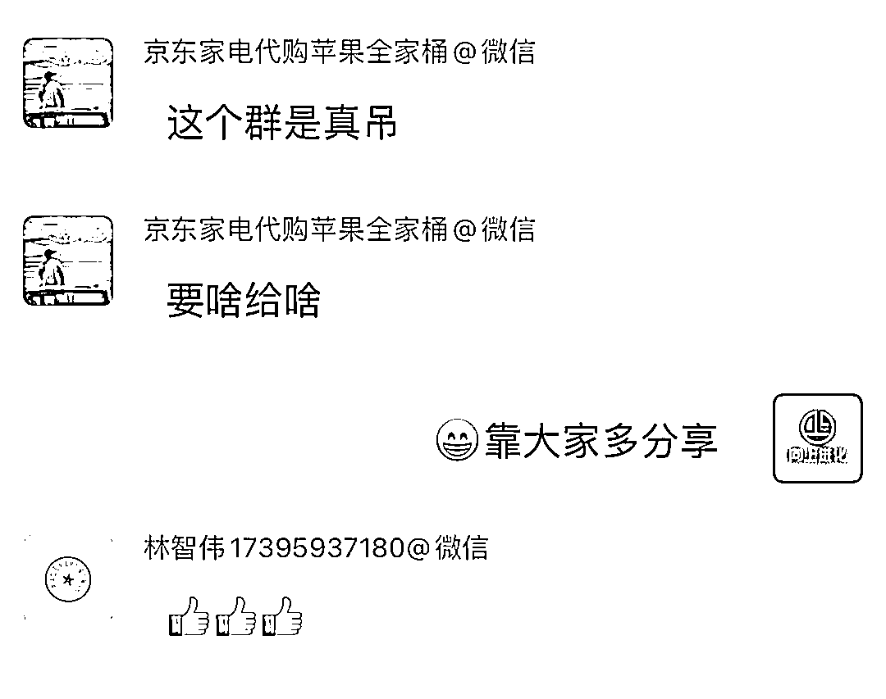

2、期间推出了一期598的项目发售（打卡形式），卖出9份。

3、开始构思前端和后端体系以及合伙人机制，想把盘子做大。

# 五、再涨价，199实战营

2023年4月

项目梳理：

3月底，我花了2天时间重新捋了一下整个项目的前端+后端，并把社群涨价至199。

先看一下思维导图：

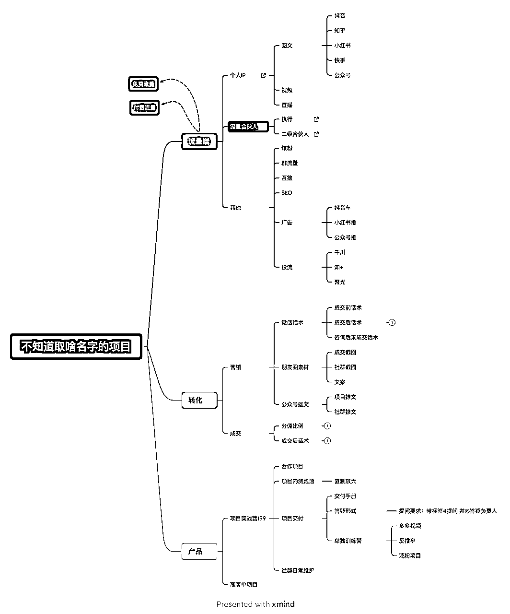

1、 流量端

*   个人IP

抖音图文和PPT拆项目，没啥好讲的，我认为这是基本盘，不可动摇。

*   创业粉快速引流法

忘了在哪里看到的教程，说穿了，其实就是去项目直播间连麦，然后通过话术吸引创业粉加到私域。

这个方法经过实操，只要话术可以，引流效果非常好。

当然过程中这个话术需要不断调整，我优化了很多版本和不同的项目话术，最终结论是：少点套路、尽量真诚。

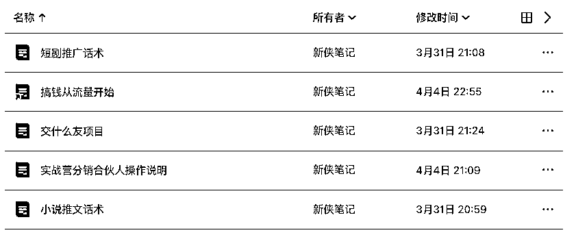

粉丝从直播间加到你的微信之后，你的话术、朋友圈营销也非常重要，整个是一套的流程。

这个后面会提到，这里就不详细展开。

除了自己去直播间连麦获取流量之外，后期还可以衍生出流量合伙人的玩法。

也就是招募一些兼职去直播间读项目文案，引流给你，按引流的效果付费。

这个我还没开始操作，但已经观察到有团队在这么操作了，结合我自己实操的结果来看可行性非常高。

兼职的人每天引流50人就能获得不错的收益，而我们可以用非常低的单价获取创业、赚钱类的粉丝。

*   其他流量玩法 包括付费的和免费的，我觉得后期还是都需要去尝试，筛选出最适合自己的方式。 知+的方式我近期还是不死心，想再测试一下，有成绩了再更新在这里。

2、转化

*   营销

话术、朋友圈、公众号

话术包括微信进人后的话术，成交后的话术和未成交的话术。

经过反复测试，我选择了目前效果比较好的话术并整理成SOP。

目前的话术：

直接发送直播间分享的项目介绍，同时额外送一些项目教程。

只字不提付费社群的事情，在免费送的福利里留下钩子，引导他查看社群介绍。

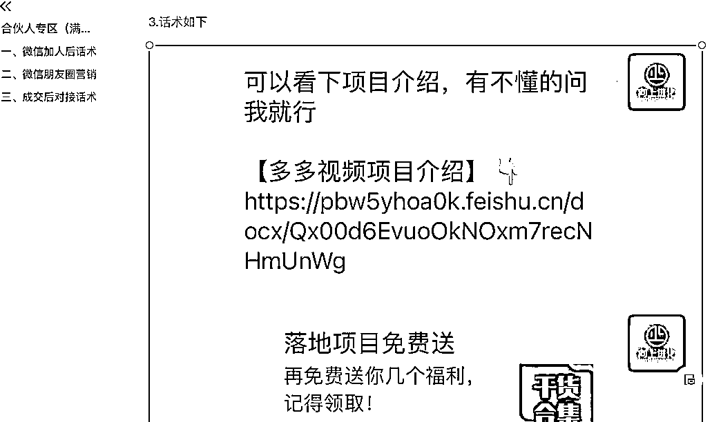

同时朋友圈营销要跟上，我之前非常不喜欢发朋友圈，现在发现这是非常错误的。

朋友圈的人设营销对于转化帮助非常大，几乎70%的成员都是通过朋友圈转化来的。

*   成交

分佣比例，我目前规划了二级。

从我的角度而言，我是很喜欢渠道收益的，将心比心，我也希望以后如果我真的有合作伙伴，他也能有获得渠道收益的机会。

另外，我的设想是不直接开放。

合伙人需要把社群售卖当成主要盈利渠道，当达到一定GMV后才能升级享有收合伙人以及渠道收益的权益。

毕竟如果单纯靠拉人头赚钱，而不是实操项目赚钱，就有点割韭菜那味了。

成交后的话术，也没啥说的，就是给交付手册，发放配套权益，讲解社群群规，收集信息并拉群欢迎等等。

应该都大同小异。

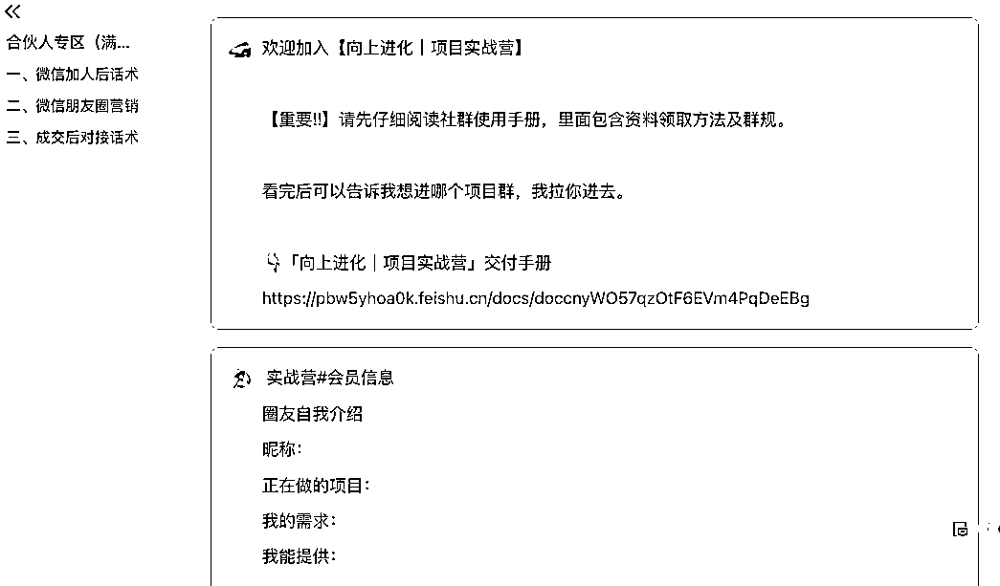

3、产品

*   199社群

这里我刻意规避社群带有太浓厚的个人IP属性。

如果是我作为别人的合伙人，售卖一个带有非常浓厚个人IP属性的社群或者产品，我心里还是有点疙瘩的，除非他的维度特别高。

将心比心，我希望合伙人可以做自己的IP，但是可以一同发力把社群销售和维护好。

因此，社群和个人IP就势必要区分开，而且要区分的很开。

包括配套的社群微信服务号、小鹅通系统，我把所有个人微信、公众号、联系方式全都删除。

只留下这么一句话：联系你获取资料的微信对接。

这样也许引流效果会大打折扣，但是我想尝试一下。

另外就是社群定价在39的时候，我基本是轻交付。

平常就是分享一些资料，然后出打卡课程。

当价格涨到199的时候，我考虑到是否之前的交付价值对比收费，已经没办法让成员感觉到“超预期”的价值。

要超预期交付，要么就是持续的出高质量打卡，要么就是持续的邀请嘉宾分享。

很显然，我目前都没有这个能力。

因此我的选择是，挑选了2～3个比较落地的搬砖类项目给社群成员免费对接。确保他只要付出行动和执行，就能获取一定的收益。

同时坚持分享每日的干货，和信息差。

*   高客单项目

我也还没有，不过大饼先给自己画上。

我认为社群提供超值服务，建立人设，会对后续高客单成交非常有帮助，所以我对高客单的成绩非常期待。

项目手册：

同时参考生财的航海手册形式，有意识的开始制作自己的项目手册，为后续招募合伙人进行布局。

创业项目IP部分借鉴航海手册的思路和框架颇多，但内容都是结合自己实操制作。

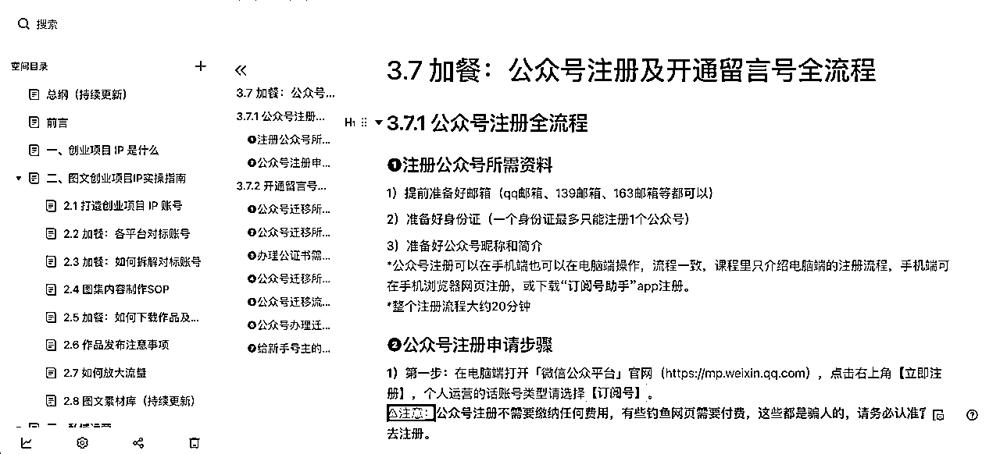

操作步骤、连麦话术、微信加人后话术、成交话术等等进行标准化

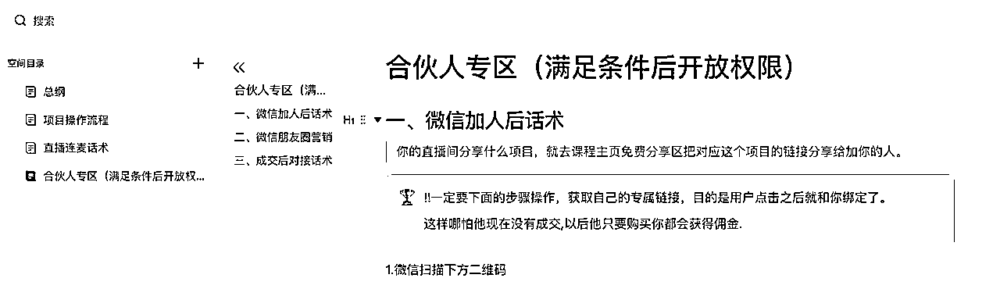

第一个合伙人：

我先拉了我的小舅子入场，测试这个项目，在此之前，他完全没接触过互联网项目。

第一天（4/2）和他做了网创行业的认知普及&项目操盘的几个层次介绍，并把我整理的项目手册给他做了讲解。

和他通话我没有提前准备什么课件教材之类的，都是讲到哪算哪，正好趁这次写文章顺便做个梳理和记录。

网创行业的认知

*   互联网是能赚到钱的

对于从没接触过互联网的他来说，我首先给他讲的观点就是：要相信互联网可以赚到钱。

如果他对这个结论是不信任的，那也就没有必要继续往下推进了。

*   要走正道，不碰颜色

这里的颜色包括黑色、灰色和黄色。

人是要有敬畏心的，敬畏什么？首先就是敬畏法律。

作为他在互联网上的领路人，我有必要先告诉他这一点。

*   向有结果的人学习

抄，研究，创造，发明。

这句话在制造行业非常流行，在互联网上也非常适用。

由此可见，任何商业成功的底层逻辑都是相通的。

具体到做项目，那就是别人怎么做你就怎么做；具体到做抖音，那就是别人怎么拍你就怎么拍...

*   赚钱就是复制

你能赚到1块钱，那你就应该能赚到100块钱。

要么把自己赚钱的动作重复做一百次，要么就雇100个人来复制你的动作。

*   学会为知识付费

你也许足够聪明，自己研究也能成功，但是会踩许多坑，绕许多弯路，浪费很多时间。

有时候用钱开路，未必就不是最优解。

项目操盘的层次

*   自己做项目

当然，项目也分好坏。

对自己完全没有积累的，比如问卷调查、帮人点赞啥的，我认为都不是什么好项目（针对自己做这个角度，不针对操盘的角度）。

这些统称为搬砖项目，出卖自己的劳动力，没有积累也很难学到什么。

对自己有积累的项目，比如做一个自媒体账号，做电商等等，哪怕你赚不到钱，但是能学到经验和知识。

*   卖项目

项目你跑通了，赚到钱了，完全可以整理出一个操作sop出来，然后把他卖出去，获得更高的收益。

只要你能提供超值的服务，并确保教程是真实有效的，那我认为就不算割韭菜。

*   做渠道

我不光要卖项目，我还要辅导你赚到钱，因为我要从中分一杯羹。

你赚10块钱我就得3块钱，岂不是皆大欢喜？

*   做体系

我不想自己卖项目了，我找人来帮我卖；

我不想自己铺渠道了，我找人来帮我铺。

*   投资

我觉得你靠谱，认知也够，执行也够，你去操盘项目吧，我就负责提供资源（人脉、流量、资金）。

结果就是在第四天，也就是4/6，他和我报喜，成功开单，卖出了第一个199。

# 六、现阶段的问题和思考

1、首先是分销的问题。

因为后面需要有分销体系，因此我已经在刻意的用小鹅通进行收款，哪怕是我自己收款。

但经常遇到很多人上来直接就微信转账给我，然后我得给他把红包退回去并发小鹅通收款二维码，和他说：不好意思微信不收款。

这种情况我认为是大大影响了消费者体验的，我就此咨询了刘驴老师。

他的回复是：自己弄，怎么收款都行，但是一旦开代理，必须要体系化。

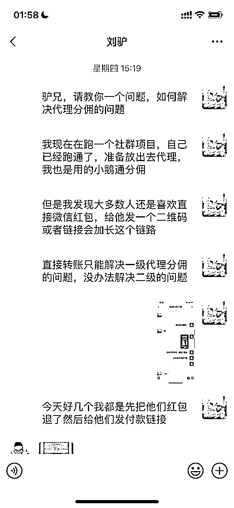

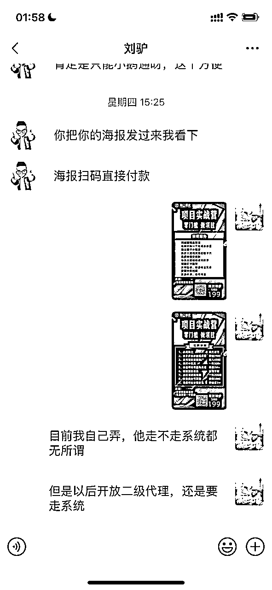

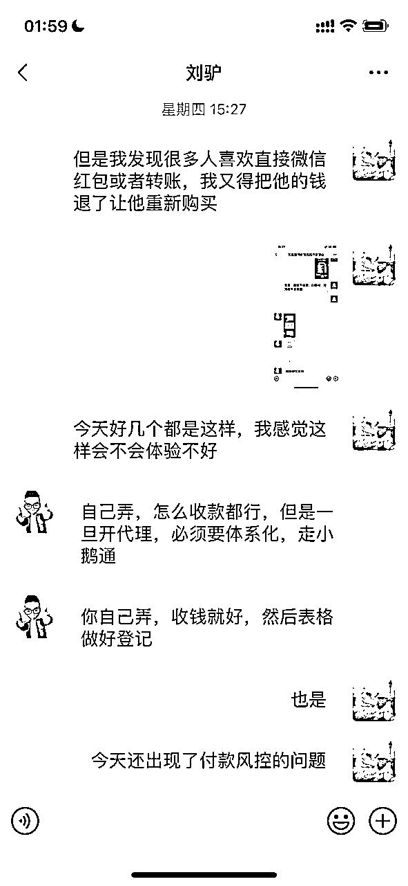

2、社群对接的项目从我之前的打卡形式变成免费对接，后续的社群收益会变少。

这点其实我还没想明白，从打卡形式变成免费对接，主要是我认为打卡不能给交付带来超预期的体验，会降低成交率。

仍是一个需要持续探索并权衡的问题，先mark一下，找到答案后回来填坑。

3、资源问题，没办法对接到足够优质的项目。

这里项目优质其实我是有几个想法的：

第一，项目方需要免门槛。光这一条就打死一大片了。

第二，项目需要给我带来管道收益。这一条大多数项目都能解决。

第三，最好是有二级的管道收益，后续合伙人也能享受。但其实没有也可以，大不了我不要这个管道，谁成交的谁拿管道。

4、基本盘不能落下。

这两天忙这忙那的，导致都没做视频和图文，流量立马断崖式下降。

要时刻提醒自己，基本盘不能丢，其他都是辅助。

另外就是PPT拆解类的账号其实是比单纯图集类的账号IP属性要更强的。

PPT拆解类，我的赞粉比几乎达到了1.5:1，而图集号的赞粉比只有5:1。

后续到底是做哪种类型的账号，坦白讲我还在举棋不定。

另外关于公众号的输出，我也没有做到日更，其实公众号也是一个很好的私域IP工具。

写到这里，发现问题还不少，但创业不就是这样，先行动起来，发现一个问题就去解决一个问题，最终结果一定不会让人失望。

“必成”！

加油！