# 我用生财教我的方法做短剧

> 来源：[https://yf4niapxuw.feishu.cn/docx/NlqtdIqRboDI0nx8PeccsB8gneh](https://yf4niapxuw.feishu.cn/docx/NlqtdIqRboDI0nx8PeccsB8gneh)

最近在尝试做短剧，第一天晚上发视频，没想到第二天早上就出单了，这个正反馈来的也太快了，

所以，我感觉短剧很适合新手小白入场，比我之前做的小说推文见效快多了，

我做短剧之所以能成功，也离不开我在生财里学习到的方法。

正所谓饮水思源，我想在这毫无保留的分享我做短剧的经验。

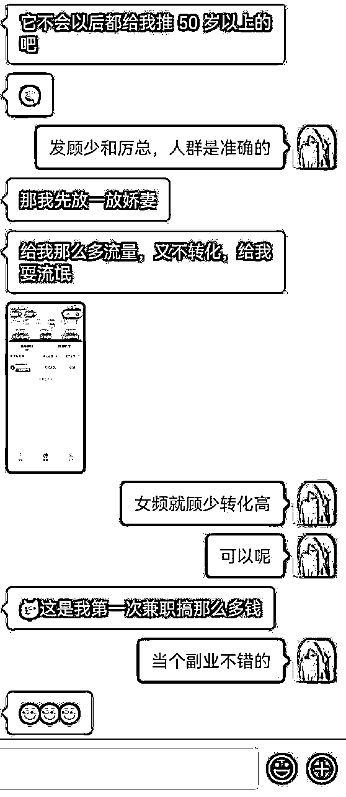

# 一、短剧是什么

类似小说影视化。和电视剧电影差不多。区别在于，拍短剧的导演不是名导，主演不是家喻户晓的大明星。投资没有那么大手笔。说不定以后短剧的主演可能成为大明星。

换言之，有专门的团队买了小说和剧本版权，把他们拍成视频，每集1—2分钟，一部剧一般1—2小时。

然后，团队会把这些短剧版权派给各大平台分销，以此利益最大化。我们找官方渠道拿到授权，就可以剪辑短剧推广视频了。授权是免费的。

我们通过在抖音发视频挂短剧的链接，用户看了视频，想看后续，就会点击链接进去看，如果有充值，我们就有收益。

平台分给我们的佣金在50%。

和小说推文开会员、看电视剧充值开会员类似。

我们剪辑一般在高潮处、有悬念的地方截止，引发他们的好奇心，让他们想继续看。

# 二、变现逻辑

不知道你们有没有在抖音刷到过这种视频，你们可能刷到过，但没有在意。

视频内容是多个短剧片段组合。

短剧的核心是去重。

做好去重，就有播放量，就有收益，哪怕一个评论也没有。

没有冲突的片段要剪掉，结尾留下悬念。

比如，女频短剧看男主知道女主受伤后是不是会后悔，但不把男主后悔剪辑出来。

又比如，男频短剧是炮灰挑衅男主，用户都知道男主要装逼打脸了，但不把男主装逼打脸剪辑出来，引导用户去看正版短剧，自己去看男主如何花式装逼打脸，向用户提供愉悦感。

变现逻辑很简单，引导用户点击左下角观看短剧的小程序。

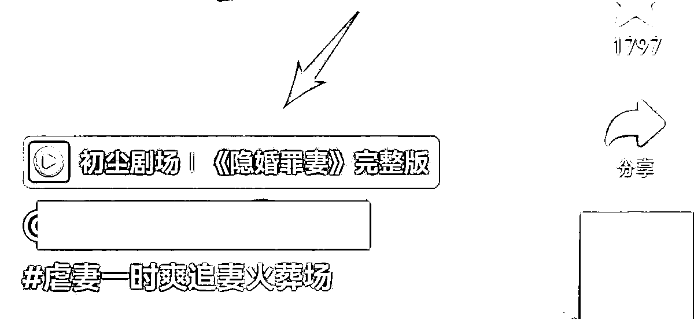

用户看了十几集后，想要看付费剧集，需要开通会员才能看后续。

我们的分销比例是50%。

假如用户充值100块，我们的分销比例是50%，我们的收入是50块。

短剧结算是按月结算，每月15日。你做得好，获得了正反馈，还可以邀请你的朋友和你一起做短剧。

# 三、短剧SOP（重点看）

## 1、获得短剧授权（微信扫码小程序即可获取官方授权）

# 2、注册成功后，抖音用新注册的账号、需要养号后再发

# 3、注册新的抖音、快手、视频号账号

抖音：

关掉wifi：在手机设置里，设置流量可用，关掉wifi。

顺序为：点击设置—点击应用管理—搜索抖音—禁止WLAN。个别手机位置不一样，但大体是一样的。

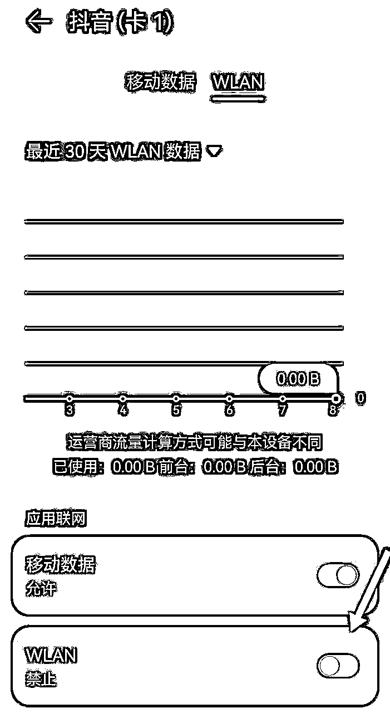

账号注册：用新账号注册，如果没有新账号，在某宝搜索换绑，10块钱可以搞定，节省7天的时间。一机一号。

注册时，不要一键登录，用验证码登录，跳过头像等设置，不发视频。三天里刷视频，像正常人一样点赞关注评论，每天2小时，如果没有时间，可以挂直播间，偶尔评论一句。

三天后，完成头像、简介、背景图等100%设置，学校不想暴露可以隐藏。

头像在小红书搜索好看的女生头像，图片要高清。

背景图也是在小红书搜索好看的背景图或风景图。

简介一句话正能量，不知道写什么，直接搜索句子迷或者励志句子大全。

昵称取自己喜欢的，3-4个字为佳，你想带XX短剧、追剧，也可以带上，最好不带。如果你实在想不出昵称，在浏览器搜索姓名生成器、网名生成器，自动生成姓名，你选一个喜欢的。

发布视频，依旧每天要刷2小时抖音，发布前刷10分钟+，发布后刷10分钟+。

快手：快手没有抖音这样讲究，可以用wifi，可以当天注销后重新注册。

视频号：也没有养号的要求。新号开始几天流量比较大，要珍惜这个时间段。

为什么要养号呢？

有的老师说抖音不养号，连wifi也没关系。到底听谁的呢？

如果你的账号要实名，要挂橱窗卖东西，那你不养号、连wifi没关系。

但我们做短剧，不实名，后期有精力可以做2-3个号，还是相信玄学为好。

## 4、下载短剧原素材

账号注册并授权好，并懂得剪辑思路后，就可以开始下载视频进行剪辑。

直接用平台提供的链接下载短剧。

链接用的是百度网盘，如果你没有百度网盘会员，可以在拼夕夕上搜索短期的网盘会员。约5毛或1块1天，能提升下载速度，节约下载时间。

## 5、剪辑思路（精细化运作）（重点看）

### 1）选剧

新手选顾少的隐婚罪妻。

或者看平台提供的素材下载链接，里面提到了产出较高，重点剪的剧.

或者问问在做的小伙伴，哪部剧比较火，转化比较高。

或者选你喜欢的、好看的短剧。

如果有时间，可以用一个号专门刷女频短剧，每天刷3小时，看到点赞上万，发布日期在今天或昨天，小程序链接又是抢先看，就可以选。

刷剧时，可以遮挡住点赞收藏评论什么的，自己猜猜点赞大概会多少，一方面提高判断力，一方面想想为什么会爆，提高学习力，一方面防止变成玩抖音了。

为什么新手建议做女频，因为女生相比于男生，舍得花钱。男频也有大爆的，但你是新手的话，做女频更容易上手。

### 2）调研市场

当你选了一部剧时，你去抖音搜索一下，看看高赞视频是怎么做的。

至少看10个视频。

你怕错过细节，就用正常速度看。

假如你连续刷几个视频，剧情都差不多，可以快进 2 倍数看。

然后参考爆款，做一个一样的（细节可能不一样、一二句台词可能不一样），一个开头结尾一样中间不一样的，一个自己思考的。

以顾少的隐婚罪妻的为例。

有3个看高赞视频的方法。

第一个：看话题。

搜索顾少的隐婚罪妻，点击话题，点击立即参与旁边的空白处，不要点立即参与，点击最热，看高赞。

最新里的高赞视频也可以看看。

第二个：看视频。

搜索顾少的隐婚罪妻，点击视频，选最多点赞，一周内。当然，一天内、半年内也可以看看。

甚至可以不选时间，看看。

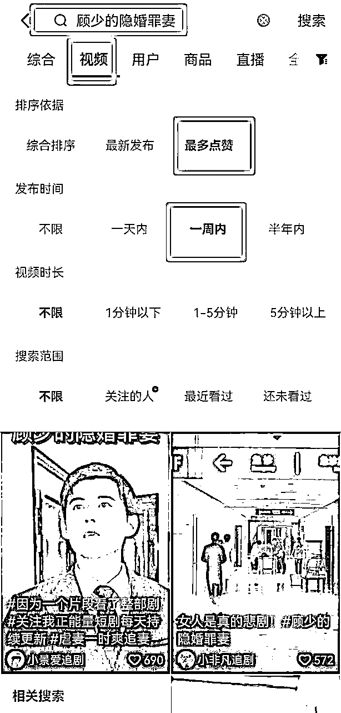

第三个：看综合。

看综合和看视频方法都一样，为什么要看综合呢？

因为综合有短剧的广告，正因为是广告，别人花了钱投流的，当然要学习。

### 3）处理素材（重点看）

这一步最花时间，但做好了，后面剪辑非常简单。

下载短剧原素材后，步骤如下：

第一步，按照5集分，把1-5集合成一集。

如果电脑配置够，把所有素材放进剪映。

然后按键盘i键和按键盘o键，选择自己需要的集数，把全集素材整理为1-5集一集。如图所示。

如果配置不够，麻烦一点，按照5集放入-导出。

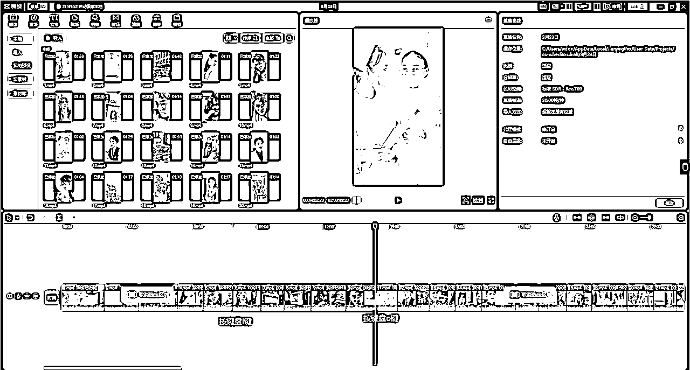

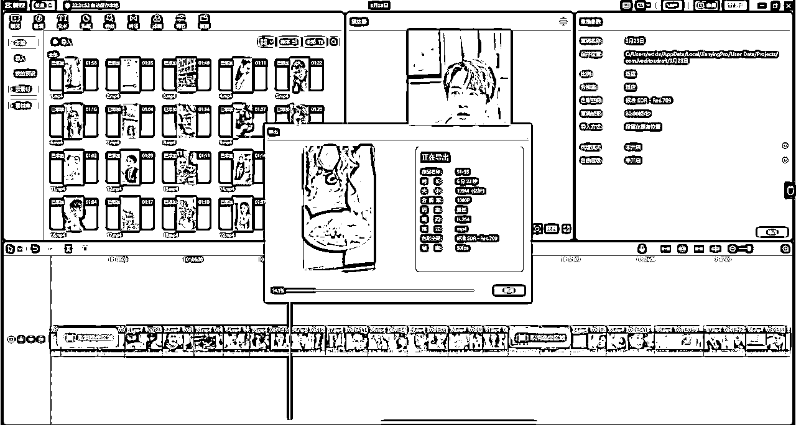

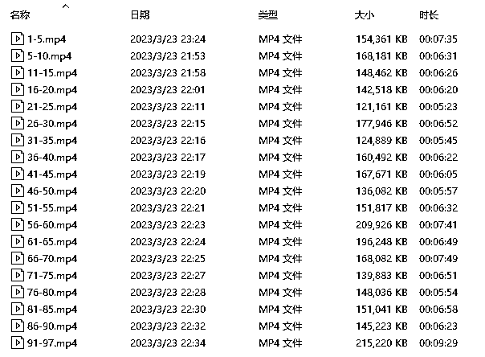

换言之，你把97集的视频，整理为19个视频（如上图）。

为什么是5集，不是2集、10集呢？在做【开头中间结尾解说】这一步时，我会告诉你。

第二步，硬字幕提取。

工具好用排序：Videosrt>录音啦>剪映。

剪映是语音识别，如果音乐过大，人声过小，识别不了。

Videosrt、录音啦是图片识别，准确率相对高，但依旧有错别字，漏字，需要人工修改。

但没关系，修改时，正好把整部剧看完了。

做短剧，一定要看完全集，才知道如何做好短剧推广。

如果不看完全集，只能追别人的爆款，永远无法做出自己的爆款。

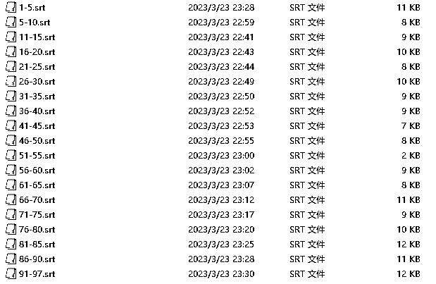

第三步，修改字幕。

你把视频和字幕文件导入抖音，复制一份视频在主轨道上，设置镜像，添加蒙版，点击特效，使用模糊——画面——蒙版——把台词遮挡住，然后自己做的字幕放到遮挡住的蒙版上，时间线滑动，看有没有穿帮。

看完文字，你还是不知道如何做，直接在抖音搜索：如何在电脑版剪映上添加蒙版修改字幕。别人讲解的视频很多，更直观。

第四步，按台词分割视频（修改字幕后的）。

按台词分割视频必须有视频和字幕文件。

用大拍档或CR分割。

我建议用大拍档。

分割出来是这样。

第五步，整理开头中间结尾文件。

比如，你在抖音看了别人的爆款素材，你知道哪些情节在开头结尾，你就把哪些情节放到开头结尾。

如果你自己总结的能力很好，在修改错别字、漏字时，你就自己整理一份。如图所示。

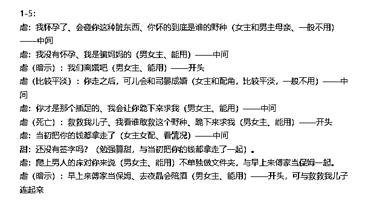

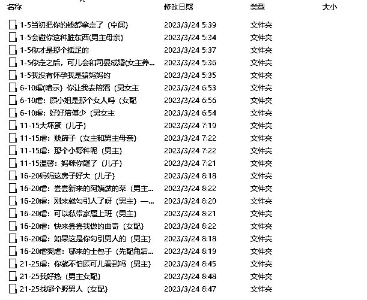

我用台词命名文件名，因为我看了剧情，知道哪句台词属于哪部分情节。

用台词命名更有记忆点。

为什么用1-5这种方式命名呢？

因为你在选择剧情时，尽量选1个1-5、16-20的。而不是中间剧情全是1-5的。这样更容易过查重。

假设有爆点的剧情就在1-5集，那你可以选择1-5集。不要死板。

但在有选择的情况下，尽量选 1 个 1-5、16-20 的。

### 4）建立去重模板。

去重的方式有很多。比如，画中画透明度2%；转场用0.1秒闪黑闪白；特效透明度调小不影响观看的15%；添加贴字左下角或右下角缩小；添加水印；添加音效；变速去重。

去重用5种方法就好了。每次使用时，复制一份草稿，然后修改一些小细节，保证与之前的去重素材不一样。

比如，今天你剪辑视频用星星贴纸，明天用月亮贴纸。

或者今天你特效的素材透明度是2%，明天改成3%。

音乐、字体等等都可以换。

当然，你复制草稿，在使用时，会遇到一个问题，你把视频放入主轨道时，去重素材会移动，你不想移动，怎么办呢？

点击锁定，就可以了。如图所示。

所有素材都需要锁定。

等主轨道的视频做好了，再解除锁定。

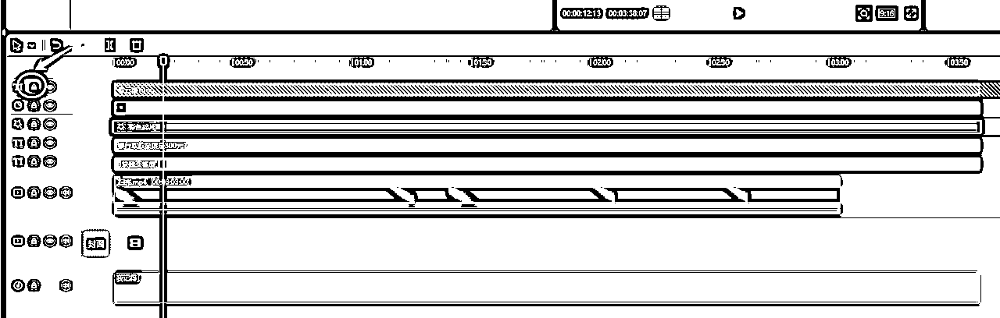

### 5）如何剪辑视频（重点看）

简单来说，就是根据你对素材的理解，把开头中间结尾的素材放入剪映中。

那怎么分辨哪些素材属于开头中间结尾呢？

新手：调研市场，看10个高赞视频，把别人的开头结尾放入开头结尾，把其他情节放入中间。

老手：按照半糖老师的开幕雷击（异常，金钱，暴力，死亡，民族主义，性暗示，捷径），把开幕雷击的情节放入开头。

当然，你必须了解抖音发布规范，可能违规、你把握不准的情节不要放。

结尾：你把有悬念的情节放入结尾，就像我前面说的那样，比如，女频短剧看男主知道女主受伤后是不是会后悔，但不把男主后悔剪辑出来。

又比如，男频短剧是炮灰挑衅男主，用户都知道男主要装逼打脸了，但不把男主装逼打脸剪辑出来，引导用户去看正版短剧，自己去看男主如何花式装逼打脸，向用户提供愉悦感。

或者你看剧情时，很想知道后续是什么，你就把那情节放入结尾，不要把后续放出来。

中间就放有爆点的情节，非常平淡的、与男女主无关的剧情，不用放。

有了开头中间结尾，选哪些素材呢？

从角色来选：比如女频，今天你剪辑的情节围绕男女主和恶毒女配，那就选与男女主恶毒女配有关的剧情。

但若你今天剪辑的情节围绕男女主和婆婆，那就选男女主婆婆有关的剧情，恶毒女配不要出现，或者少出现。

一集5-10分钟为佳。实在是没有灵感，也可以剪辑3分钟的视频。

从剧情来选：剧情按照开幕雷击+虐+小逆袭+虐+小逆袭+虐+悬念来排序。

开幕雷击和悬念在前面介绍了。

虐是指什么呢？就是男主虐女主、女配虐女主、炮灰虐女主，主角处于不利的境地。

小逆袭是指女主反击伤害她的人，不管是语言反击，还是肢体反击，还是男主或其他人帮女主说话，都是小逆袭。很多时候虐与小逆袭的剧情是连在一起的。

剪辑细节：

比如，A情节、B情节.

在原剧情中，A在前，B在后，你剪辑时，B剧情放到A剧情前面，也不影响观看，那就用BA剧情。

具体到一句话时，也是这样。

比如，A这句话在前，B在后，如果不影响意思，你就把B放在A前面。

除此之外，你还可以删除多余的话、无用的话。

比如，某个情节，男主夸奖女配，贬低女主，原话是：我从高中就喜欢你，那时候的你，天真善良，像天使一样，反倒那个顾安然娇蛮任性，让人吵闹。

你做第一版保留原话。

第二版：我从高中就喜欢你，那时候的你，天真善良，反倒那个顾安然娇蛮任性。

第三版：我从高中就喜欢你，那时候的你，天真善良。

第四版：我从高中就喜欢你。

换言之，只要不影响剧情，影响观看，你可以按照自己的想法修改，这就是按照台词分割的意义所在。

### 6）发布视频

在抖音发布，用手机流量。发布前刷10分钟+视频，发布后刷10分钟+视频，看完自己的视频后，给自己的视频点赞收藏评论。

播放量一千后，在评论区发图片引导。

类似这种图片。

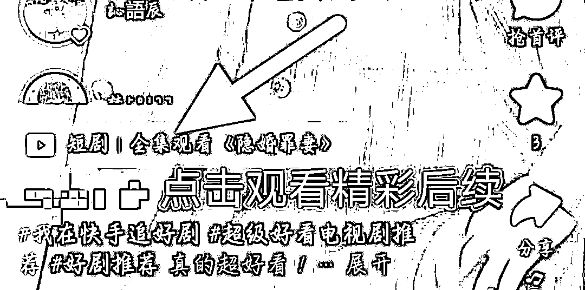

发完用另外一个号看，或者隔几天看看，有时候，你看得到图片，别人看不到。

在快手和视频号发布没有这么多讲究，可以用wifi发布，也不用在发布前后刷10分钟视频。

# 四、如何快速试错（新手重点看）

上面的方法虽然详细，但若精心剪辑十几个视频不出单，非常打击信心的。沉没成本也大。

有什么方法提高速度吗？

有的。

步骤如下：

1、下载40集视频，拖入剪映，使用剪映智能字幕自动识别，文字拖到视频外，导出视频和字幕。

2、用大拍档字幕分割功能，按照台词分割。（之所以有第一步，是因为台词分割功能必须有视频和字幕文件）

3、视频分割为一句话台词后，通过看台词的方式了解剧情。或者用3倍速度看完视频。

4、老手根据自己的思路剪辑一个3分钟视频，新手参考爆款视频剪辑一个3分钟视频，然后通过市场反馈，看是否继续剪辑这部剧。

爆款剧和刚刚出的新剧，都可以用这种方式尝试。

哪怕你没时间看完整部剧。

# 五、注意事项

1）你做短剧推广，不用引导别人关注，不要引导用户看下一集。

一部剧可以更新十几个视频，但内容不要上下关联，不然用户会期待你更新下一集，不会充值看。

每次付费充值的用户也是看到你视频的用户，不是关注你的粉丝用户。

2）短剧推广不用投豆荚，都是自然流量。

如果你精通投豆荚，投入产出比划算，可以试试。

比如，你发1个视频，几小时破万播放量，投24小时、粉丝量、24-30岁女，全国。

3）短剧女频的目标人群一般是24-30岁女性，如果你播放量高，出单少， 看看用户画像是不是50岁+。

如果是，就隐藏作品，重新发。

抖音同一个视频在同一个账号可以发三次，但别超过三次，也别发到你别的抖音号上。

快手隐藏了，不要发第二次，容易违规。

但这种你会遇到有一种情况，你舍不得隐藏。

比如你发了一个视频，没有留意，它跑着跑着，有几百赞了。

虽然用户是50+，出单几十块，但数据看着漂亮，你抱着以后可能会出单的侥幸，没有隐藏。

那么，你后面发视频，可能数据好，但用户是50+，就是不出单，或者出单很少，让你备受折磨。

4）过了千播记得发图片引导，表情包有时候会掉，你看得到，别人看不到。

5）重点做抖音。快手和视频号作为分发渠道。

6）要不要加解说？如果你文笔比较好，或者你是影视解说转行的，可以加解说。

比如，你可以做轻解说，用原剧情+解说+原剧情的模式，不用全部解说。

等能力提高了，整个视频全程解说。

新人成长路径是混剪、轻解说、全程解说，如果你以前没有做过短视频，千万别抱着我做全程解说原创高、我一定能更赚钱的想法跳过混剪，直接做解说。

你做消费者，看别人解说当然简单，自己上手挺花时间、挺难的。

# 六、短剧适合什么人做

如果你有一颗想改变的心，想要做这个项目。

你需要：

1、一台可以使用剪映的电脑。

2、每天2小时的时间投入。

3、一颗日更的心

这个项目最大的亮点是不用你写文案，1千多播放量也可能出单，且目前项目属于蓝海期，只需要你会剪辑、去重就行了。

# 七、感谢

在这里我要感谢张珂老师，他引导我做了小说推文和短剧。

我要感谢奇杰老师，他的混剪厨坊方法让我想到了开头中间结尾的方法。

我要感谢半糖老师，虽然当初报了她的课程，学完就没有后续了，但现在做短剧，她的开幕雷击让我明白了如何做开头。

我要感谢无苔，她在群里提到了CR软件，我才想到了台词分割的玩法。后面在群友侣、牛顿273等人的分享下，我改成大拍档了，用上了Videosrt。非常感谢你们。

最后，感谢生财有术，感谢阅读的小伙伴，欢迎共同交流，一起进步。