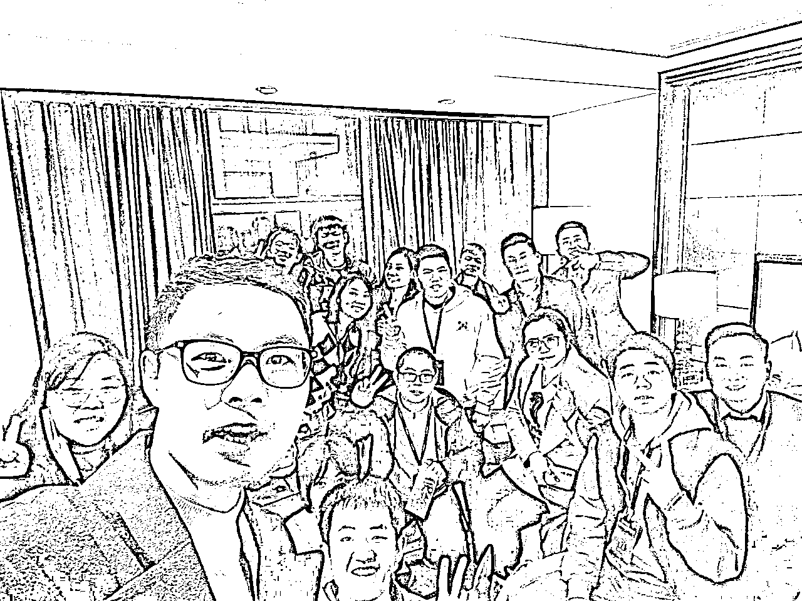
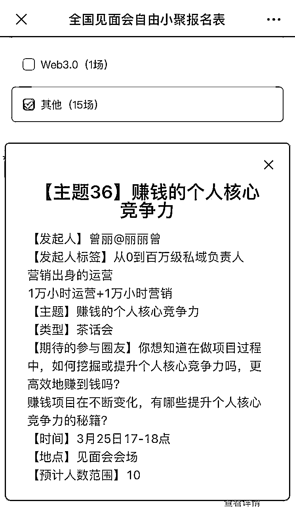

# 线下小聚复盘：赚钱的个人核心竞争力3.25

> 来源：[https://q0hc3k7yqz.feishu.cn/docx/QMAddgzWDoln2jx40DBcDNCRnmh](https://q0hc3k7yqz.feishu.cn/docx/QMAddgzWDoln2jx40DBcDNCRnmh)

### 组局背景

分享我定这个主题背后的思考：项目、红利等都是不断变化的，我们要更好地赚钱，要去重点关注不变的（比如核心竞争力就是不变的中很重要的点），这样才能以不变应万变。

有核心竞争力后，可以迁移换项目、可以在一定程度上穿越周期、可以在大环境不好时有自己的小天地。

（被@中哥 夸这个主题非常好。我也好开心）

中哥：就比如我们做广告的，接触太多的项目，实体的，线上的，自动成交，私域，电商，直播，每个板块都有崛起暴富的人。 还是看要自己本身，咱们圈子里，最不缺的就是项目。

为了深度交流，我只计划组一个10人小局，但临时有些人想蹭场，实际到场是30+人。

### 精华分享

#### 曾丽：营销/运营的8大核心竞争力

在核心竞争力这个主题下，常见的2个问题：

一个是不知道核心竞争力有哪些方向？

另一个是不知道在某个方向下，更高效提升自己核心竞争力的路径是什么？

我是一个营销出身的大厂运营，在我眼中：虽然很多人做的工作不叫营销、也不叫运营，但实际上做的就是营销或运营的事，大家可以看看这8大方向，是不是很熟悉？

8大方向核心竞争力：流量获客、销售、营销转化、内容、数据策略、用户互动、活动、产品交付。

对普通人来说，能拥有8个分享中的任意一个方向核心竞争力，都能赚到钱、过上理想的生活。

以流量获客方向的核心竞争力举例子，来和大家分享发展目标、实现路径。

##### 发展目标：

知名流量操盘手，比如专精于付费投放、裂变、置换等玩法；

企业内的流量负责人，常见有投流、增长等部门的管理者；

流量增长顾问，主要面向B端做交付。

##### 实现路径

初级阶段：了解常见流量渠道、合作方式，知道流量合作流程和关键点，具备一定执行力，能根据核心指标，梳理、制作推广物料等。

中级阶段：重点关注特定领域的典型流量打法，深度研究流量格局、分发、引流玩法等。可以结合业务现状、目标、资源，制定方案，在满足增长需求的同时，获客成本低于同行。

高级阶段：商业视角和分析能力强，清晰地理解流量全景图、趋势，拿过多次成果、有自己可复用的方法论。

#### 大麦：做个人商业IP实现好口碑、高复购和转介绍

好口碑的三大因素：解决难题；系统化专业化；事事有回响。

高复购的三个秘诀：商品本身值得复购；有复购理由和售后保障；高频出现在目标用户面前。

转介绍的三个法门：主动告知转介绍需求；利益捆绑；打消客户转介绍的担心。

用心做事做人，真诚、分享、利他，商业IP就会越做越好。

#### 余政：如何挖掘出客户的深层需求？

打电话：给已付费低客单产品的用户，一个见你的理由。

见面流程：寒暄，只针对客户的实际情况挖掘需求、满足需求。

和客户交朋友：真诚、不要太功利心、邀约客户参加活动。

### 组局策划

#### 小聚主题

赚钱的个人核心竞争力

#### 时间场地

3月25日17-18点，会场

#### 期待参与者

赚钱项目在不断变化，想一起交流提升个人核心竞争力。

想知道在做项目过程中，如何挖掘或提升个人核心竞争力，更高效地赚到钱的人。

### 组局流程

#### 活动前筹备

##### 群内自我介绍

在进行群内自我介绍的同时，我整理了群内重点，放在这链接中，便于每一位参与者查看。

群精华-赚钱的个人核心竞争力

https://q0hc3k7yqz.feishu.cn/sheets/shtcnsrvcPdUBEIQjPdjxgo7MGd

##### 群内预热挖宝活动

小组的挖宝预热活动，参与方式：在群接龙中填写。

#接龙

挖宝藏：你赚钱的核心竞争力，是什么？

快来接龙吧～

*   曾丽：一个营销出身的运营，内容输出+用户运营

*   王大诗：需求挖掘＋批量自动化

*   中国人寿-余政：挖掘出客户的深层需求，给客户配置合理且必要的保障和理财

*   吴波-大麦-手机自动赚钱：靠谱、做事认真、乐于助人，善于学习并解决问题，在自己的社群里口啤好，合作过的客户转介绍和复购很高。

*   陈羽中: 10年专注推广行业，上下游资源全部打通。积累了大量的行业相关信息。

*   美妙人生：人力专业知识和落地方案，项目拆解，高像素模仿+快速执行力

##### 群内小提问

问：明天见面会就要开始啦，大家想知道怎么获得更大的收获吗？

这个答案，很超乎我意料，但又是我很熟悉的一个词

当时我听到时，被触动了

很简单，只有几个字

做贡献

换个说法，是：利他

不知道大家看到这里，有没有回忆起以往线下线上中，那些做贡献、利他的人？

有没有什么让你印象深刻的例子，欢迎分享~分享也是一种利他啊哈哈

这次线下活动中，大家自己有什么利他的计划

##### 筹备道具

用于装核心竞争力的红包、便签、笔。

##### 寻找场地

我提前看了酒店现场，发现有一个茶馆，但是茶馆一个桌子坐不下、拼桌体验不太好，所以放弃了茶馆。

随后我又看了酒店附近，适合的地方都有一定距离，且杭州当时外面较冷，所以基本放弃去外面。

最后我依次询问了参与的人，终于发现@中哥 可以提供他的房间供我们交流。

#### 活动中流程

##### 寻找计时官

因为计划讨论时间是1个多小时，结合过往经验，为避免自我介绍时间过长、聊天内容过于发散、主持人更集中精力地把注意力放在整体节奏把控而不是看时间上，所以在活动开始时，我就在现场招募了计时官。

计时官：@Yoni

计时规则：

自我介绍1分钟。

核心竞争力10分钟。

非常感谢我们的计时官@Yoni，一直在为大家服务。

##### 1分钟自我介绍：20分钟左右

大家主要是围绕在群内的自我介绍，展开交流，具体可以看这里。

https://q0hc3k7yqz.feishu.cn/sheets/shtcnsrvcPdUBEIQjPdjxgo7MGd

##### 营销/运营的8大核心竞争力分享：10分钟

作为一个营销出身的运营，一方面是因为结合最近自己的学习和实践，忍不住想和大家分享所在领域的核心竞争力；另一方面是营销/运营的核心竞争力，对绝大部分做赚钱项目的人有帮助。

##### 个人核心竞争力分钟：30分钟

将所有在群接龙中填写自己核心竞争力的人名字，放在不同的红包中，我随机抽取第一位后，第一位抽取第二位，第二位抽取第三位。

##### 给发言少的人送福利

小规模的线下活动不仅要重视内容，还要关注每一位人的体验，在任何一场活动中，都更外向、更积极的人，也有相对来说较内倾的人。

所以我将未被抽中的红包，一一送给发言相对较少的人，送给他们一个进一步链接积极人的机会。

##### 收尾感谢&鼓励

###### 感谢

我在现场再次感谢了提供场地的@中哥、为我们计时的@Yoni。

事后回想，还要感谢：带来海南特产的@芋晴（丹莹）、为大家拍照和拍视频的@罗本、分享人性洞察纪录片的@戴懿菡 Amy、带来深圳特产的@曾丽。

###### 鼓励

鼓励大家多去主动和更多人链接；

鼓励大家晚上把自己在参加的活动，分享到咱们组小群中、信息共享；

鼓励大家写复盘分享。

##### 留影纪念

拍照片、视频。

##### 其他记录

人：周六一个小时感觉会意犹未尽，建议周日可以继续再来一局

丽丽：咱们人不多，聊重点如果意犹未尽可以稍微延长点时间，或者届时再约。另外除了咱们这的小局，大家晚上或其他时间，也可以去找更多人面积，好不容易有机会和全国的小伙伴们见面，一定要至少去见几个你一直想见的人哈哈哈。

#### 附：

##### 小聚主题信息

##### 自我介绍详情

###### 曾丽：一个营销出身的大厂运营

很高兴遇见你，这是我的自我介绍~

【昵称】曾丽@丽丽曾

【所在地区】深圳

【公司/Title】私域负责人

【自我介绍】

营销出身一运营

进阿里蓝标百度

路杭州长沙北京

如今在深圳奋斗

【目前资源】

作为一个工作10000+小时的社群社区运营&学习实践营销10000+小时的人，可为营销或运营人提供个人核心竞争力测评和咨询，一起更高效地赚钱

【目前需求】

希望链接更多想进一步做好营销或运营的小伙伴，我接下来计划每周进行2次及以上咨询

【小小成果复盘】

1⃣才391个小红书粉丝，但引流私域432人成交308单的复盘

https://q0hc3k7yqz.feishu.cn/docx/doxcnHoZbBZR4dpCRq21tZ6fuDk

2⃣社群运营从0到1复盘

https://q0hc3k7yqz.feishu.cn/docx/doxcn5qVkiGcxh3DKL3NbqwvyuH

###### 王大诗：十年产品经理的自由职业者

【微信昵称】王大诗 / 王大诗

【所在地区】上海青浦区

【公司/Title】自由职业

【自我介绍】十年产品经理，通背拳/拳击/八卦掌/鞭杆大玩家，业余运动康复师。

数赞光杆CEO一枚，互联网超级潜水艇一个，横跨PGC、UGC、AIGC的老司机。

潜水了10年，想要出来冒泡了。

【目前资源】有实体店私域经验，有带0基础小白转产品经验，有带0基础小白独立赚钱的经验

【目前需求】暂无

【可分享的主题】关于肌张力平衡、骨骼序列正确、动作次序完整三个维度的体态健康

【其他想说的】感谢奇杰、感谢封伟、对我的远程助力，感谢生财汇聚了这么多优质的信息。

丽丽：

大诗是一位产品经验丰富、赚钱&花钱有术的人

大家有相关需要或想进一步了解他的，快快主动去链接哟

###### 中哥：广告投放公司创始人

【昵称】中哥

【所在地区】武汉市武昌区

【公司/Title】广告投放公司创始人

【自我介绍】10年互联网推广行业经验，公司代理了百度，头条抖音，巨量千川，快手，腾讯等媒体，开户，代运营一条龙整合服务，日消耗过百万。

【目前资源】百度，抖音，巨量千川等代理，有代运营团队，帮助商家实现线上营销，获客，招商。

【目前需求  了解更多的网络项目

【可分享的主题】付费推广

丽丽：

你有10年互联网推广行业经验啊还拿了那么多结果。

请问你可以分享一下：做投放的核心竞争力是什么吗

大家想不想听从业10年，还创立了投放公司的创始人分享：做投放的核心竞争力？

中国人寿-余政：想

戴懿菡 Amy：想

###### Yoni：培训师

【昵称】 Yoni

【所在地区】 北京

【公司/Title】 培训师

【自我介绍】 拥有三年的培训经验，可直播，也可制作录播课程。目前全职工作，负责新教师的入职培训以及教师的运营管理工作，共计100+，团队年留存top1。

个人也对于web3，ChatGPT等其他创业机会也非常感兴趣。

【拥有资源&需求】

个人提升部分：职业规划／数据分析转岗资源对接，均有成功案例

其他部分：幼儿思维训练资源可交流

需求：寻找志同道合的伙伴（全职+副业），如何兼顾或过渡

【可分享的主题】

幼小思维培养

web3浅析，普通人如何入局下一代互联网

###### 戴懿菡 Amy：京东

【昵称】 戴懿菡 Amy

【所在地区】 上海静安

【公司/Title】 京东

【自我介绍】

医学生️记者️运营汪，跨了好几次界，公众号/小红书/站内内容/达播店播运营/CPS渠道拓展分销/品牌私域都做过，踩过无数坑

【资源】

数字化转型咨询服务（通信领域Top3咨询机构）

天猫京东电商运营

公众号/知乎/小红书/抖音内容运营

百度/360/搜狗，抖音/头条搜索

品牌宣传视频制作

【需求】

除了以上需求的老板，还想认识一些做小红书和快团团的朋友，也期待和不同领域人碰撞出火花

【可分享的主题】

《把新品牌做死的xx个小技巧》

《如何让你的品牌私域成为死鱼》

《小红书ip起号必跪指南》

《资深失败打工人，如何在内卷时代放下焦虑立地成龙》

###### 乔帮主：杭州点金帮科技有限公司/创始人

【昵称】乔帮主

【区域】杭州钱塘区下沙

【公司/Title】杭州点金帮科技有限公司/创始人

【自我介绍】

一直在互联网技术行业深耕，同时也是个典型的斜杠青年，黑客、阿里架构师、技术总监、老师、作家、创业者等什么都会点，江湖人称乔帮主。

之前在阿里云担任技术总监，然后出来干社交APP创业，无奈技术成本太高干黄了。现在做些个人IP&知识付费轻资产创业，擅长技术引流、技术变现，曾用逆向技术引流2000万用户，曾用爬虫搜集了4T的搞钱软件工具箱。

【目前资源】

1、能帮助创业者更好利用技术创造商业价值，任何技术及团队问题，也许我都能帮大家解决。

2、之前也一直在阿里云，云计算这方面的技术、资源等丰富。

3、熟悉灰产、黑产领域，擅长"开挂式"的引流技术。这块的经验和思路，也许对你会有所启发和帮助。

【需求资源】

现在在搭建一个技术搞钱的圈子，为创业者进行技术赋能，寻找擅长IP操盘手及志同道合的小伙伴一起搞事情！

【可分享的主题】

擅长技术引流和技术搞钱，擅长利用技术帮忙大家提升赚钱的速度和效率，以及技术的成长和赋能！

【希望在组局中收获什么】

知识付费、IP及私域方面经验分享及交流。认识大家，多个朋友，多条出路，找到志同道合的同行者！

【精华帖】

《每天稳定新增150+好友，用技术让私域流量实现主动引流》

《黑科技竟然垫底！互联网5大最火赚钱技术揭秘》

###### 大麦：互联网从业20年

【昵称】大麦

【地区】杭州上城

【星球】赚点小钱：分享交流一些跟手机相关的赚钱小副业

【简介】互联网从业20年，出过几本计算机软硬件的书，21年加入生财，去年参加了见面会。已赚回20倍以上门票钱。

【擅长】华为二手手机维修、硬改、ROS软路由、社群运营、工作室网络搭建及风控

【其他】能帮到朋友是件让人很开心的事。

###### 村村：京东运营

【昵称】村村

【所在地区】宁波海曙

【公司/Title】京东运营

【自我介绍】

目前个人搭建团队在做淘宝中高端内衣品类

小红书知识类博主(日语、App推广、大学竞赛、毕业论文)粉丝1200

【目前资源】中高端情趣内衣货源

日语资料，靠谱的日语课程机构

丽丽：

@村村 村村 你是从宁波过去呀？

不远～

羡慕

###### 小夏同学：剪辑师+自媒体

【昵称】小夏同学（同星球昵称）

【所在地区】上海普陀

【Title】剪辑师+自媒体

【自我介绍】B站某21w粉丝财经账号的视频制作者，我做的单个视频最高播放50w，同时在公司负责给甲方（几个头部基金公司）拍摄一些口播类视频，并且制作后发到抖音与视频号，最好成绩单条抖音播放破百万

在目前公司主要负责剪辑与拍摄事务

过去也做过电视剧的后期合成，也做过信息流短视频和TVC广告

【目前资源】1、关于剪辑的问题都可以问我，市面上90%的问题都能解决

2、关于拍摄，出镜，账号运营，内容如何吸引B站用户可以提供指导意见（目前帮助一个朋友从B站100粉做到1w粉，该账号是做历史内容的）

【目前需求】1、目前业余在做抖音游戏发行人，如果有同时在做的欢迎加我，向你们请教

2、有剪辑摄影的朋友也欢迎加我，向你们请教

3、目标是成为数字游民，如果有已经是这种生活的人，欢迎加我，向你们请教

【可分享的主题】B站或者说所有平台想发内容的朋友，如何跨过心里的坎，开始行动，以及账号如何定位，怎么与粉丝互动运营，上镜要点，拍摄剪辑等相关内容

【其他想说的】前段时间星球里的花钱有术，启发了我，最近也在开始学习如何更好的花钱

###### 美妙人生：人力一号位+孵化项目

【昵称】 美妙人生

【所在地区】 广州

【公司/Title】 人力一号位+孵化项目

【自我介绍】主业：外企人力后转民企开始参与项目孵化，副业：闲鱼小红书视频号都在尝试

【拥有资源&需求】 需求优质产品供应链资源

【可分享的主题】 战略落地，能力提升，孵化项目踩过的坑以及中医太极玄学等

###### 余政：保险代理人

【昵称】中国人寿-余政

【所在地区】杭州拱墅

【公司/Title】中国人寿杭州市公司/一位保险代理人

【自我介绍】之前在杭州一家拍卖公司从事了三年多的事故车拍卖工作，现在是中国人寿的一位保险代理人

【目前资源】对事故车和保险相关有需求的，可以提供帮助

【目前需求】希望可以和银行以及保险相关从事人员多多交流

【可分享的主题】一些事故车相关的知识，比如说如何去辨认事故车、水泡车等等，以及保险业务相关的知识

【其他想说的】希望可以和大家成为朋友，一起生财有术

丽丽：

原来你就在拱墅，离会场远么。

你是不是咱们组里，最熟悉那边的人啊哈哈哈。

余政：

不远不远，就七八公里的样子

我能说不是吗

我去年下半年才来杭州，以前在福建、湖北呆着

丽丽：

那过去比较方便呢

原来如此呀

@余政 你觉得咱们小群里，谁最熟悉那边

余政 ：

那还用说吗，肯定是鱼丸同学

丽丽：

啊哈哈哈

大麦：

我以前在那附近大关小区住过几年，还算熟悉。

丽丽：

哇

那过程中，大家如果有什么不了解的，可以像你请教啦

大麦：

可以的

丽丽：

大家都看到了么，我们的宝藏大麦人，在会场附近住过几年哟，他也很热心帮大家

大麦：

我在杭州呆了17年，东南西北都跑过，还是能帮上点忙的。

丽丽：

那你不仅是了解酒店附近

还很了解杭州咯

哇塞，挖到大宝藏了

大麦：

嗯，刚来杭州的前几年玩了个遍，现在有点宅了。

丽丽：

想到一个词：杭州百事通哈哈哈

想在杭州吃喝玩乐的人们，多多去链接大麦呀

大麦：

抱拳

丽丽：

非常感谢你的热心帮忙呀