# 已故老人“照片变视频”

> 来源：[https://p6lpsorg7k.feishu.cn/docx/QnHidA4fvoDNL9x9hSHcPJGqnjc](https://p6lpsorg7k.feishu.cn/docx/QnHidA4fvoDNL9x9hSHcPJGqnjc)

# 整体流程：照片-语音合成—DID生成原生视频

项目背景与目标：通过AI技术将已故人的照片和声音合成为一个有声视频，旨在让亲友们更加真实地回忆和怀念他们。

核心概念：利用AI图像处理技术、语音合成技术和视频合成技术，将已故人的照片与语音合成为一个有声视频。

特点：使用先进的AI技术，使得生成的视频逼真且符合用户的情感需求。

用户画像与细分市场：家庭成员、亲朋好友以及有怀念已故亲人需求的人群。

用户需求：怀念已故亲人，希望通过有声视频来感受他们曾经存在的痕迹。

市场调研：了解类似服务的市场现状，分析竞争对手、市场规模及潜在客户。

商机：满足用户对怀念已故亲人的情感需求，提供有声视频制作服务。

实施步骤、流程、方法：

a. 收集已故人的照片和声音样本；

b. 使用AI图像处理工具对照片进行处理；

c. 利用语音合成工具生成已故人的语音；

d. 将处理后的照片和生成的语音进行同步；

e. 使用视频合成工具将照片和语音合成为有声视频；

f. 对生成的视频进行优化和调整。

营销与推广策略：通过社交媒体、广告宣传、口碑传播等方式，将服务推广给目标用户。

持续优化与迭代：根据用户反馈，持续优化产品服务，提高视频质量和用户体验。

变现方式：通过提供有声视频制作服务收取费用，或者推出定制化服务和增值服务来实现盈利。

变现空间：随着人们对怀念已故亲人需求的增长，该项目有很大的市场潜力和变现空间。

其他可能的机会、创新点、改进空间：可以探索将虚拟现实技术与该项目相结合，进一步提高用户体验。

还可以制作特别的

## 一、照片：

由客户提供清晰照片（如果不清晰需用到老照片修复可额外收费）

## 二、音频合成

客户需要提供至少一分钟的原声视频

百度飞浆：https://aistudio.baidu.com/

### 1、注册用百度账号登录使用

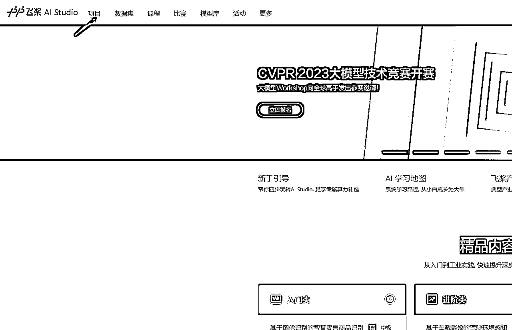

### 2、搜索框搜索 ： 有手就行

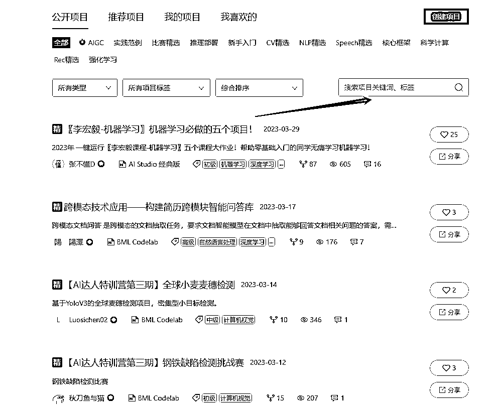

### 3、这就是语音合成：点进去

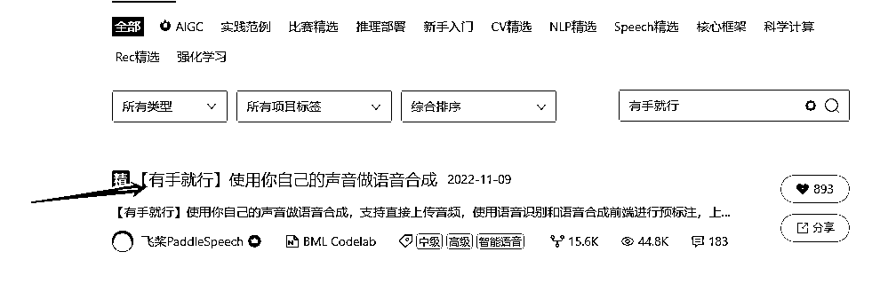

### 4、点击运行

### 5、选择32GB运行

### 6、点击运行

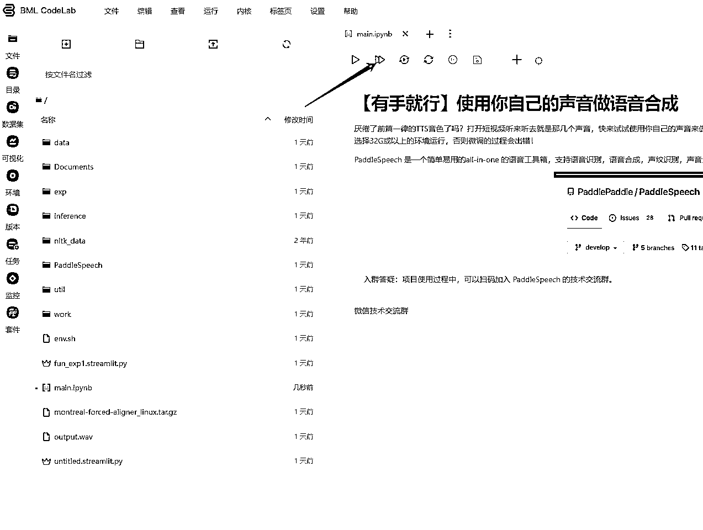

运行后自动安装稍微等候等待下方出现运行时长，结束时间如图：

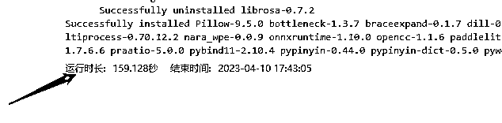

### 7、找到左侧任务栏最有一个选项双击

### 8、点击在浏览器打开

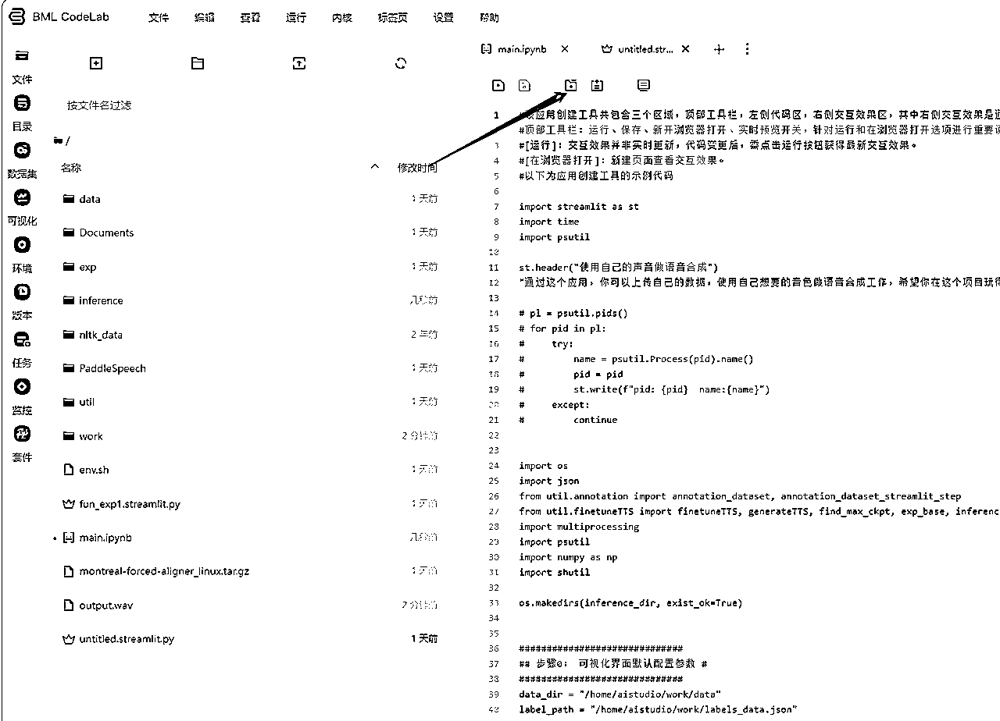

## 三、进入语音合成页面运行合成

### 1、注意事项：

### 此音频格式最好wav，mp3格式也可以，需要单独下载音频软件进行降噪处理（音频处理软件搜就可以）

2、音频文件上传

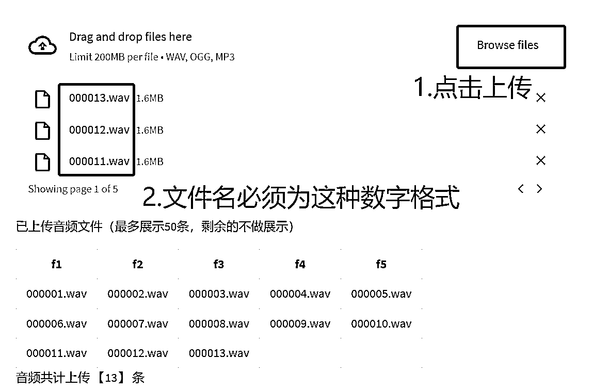

### 3、点击检验

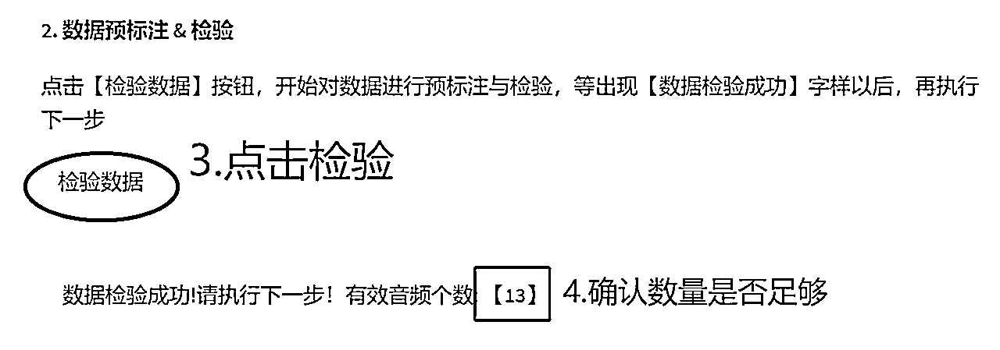

### 4、训练模型导出模型（训练模型不是越多越好详情https://www.bilibili.com/read/cv19722919?spm_id_from=333.999.0.0）

### 5、音频合成

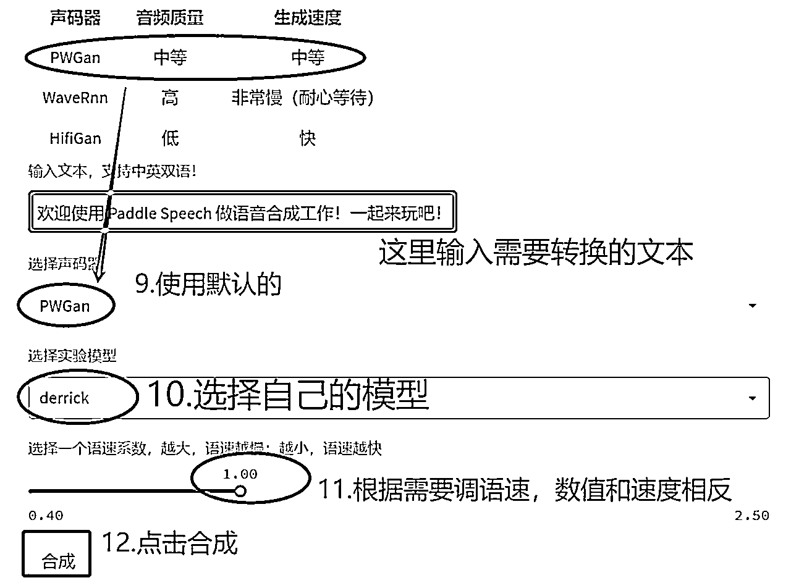

### 6、下载合成的语音

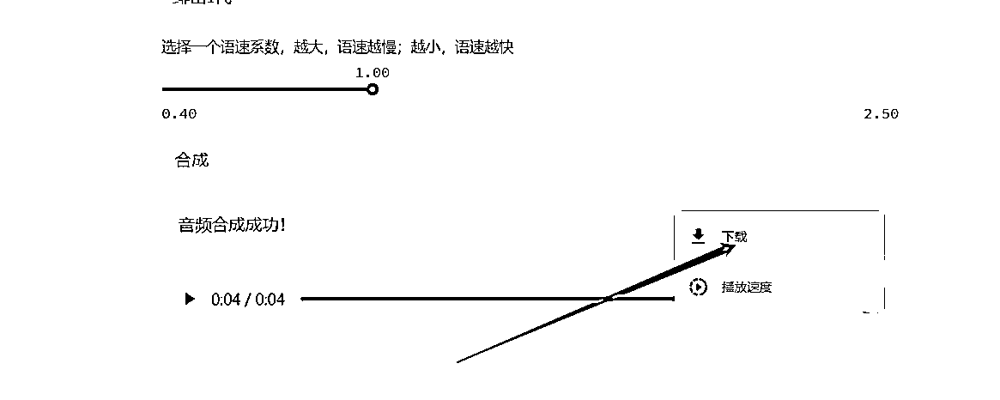

## 7、注意：合成完了如果不继续合成一定要退出

# 四、DID

每个DID账号只能生成5分钟的视频，后期需多注册

注册网站： https://studio.d-id.com/

## 1、创建视频

## 2、上传你需要做的客户的照片并点击

## 3、把合成的语音上传

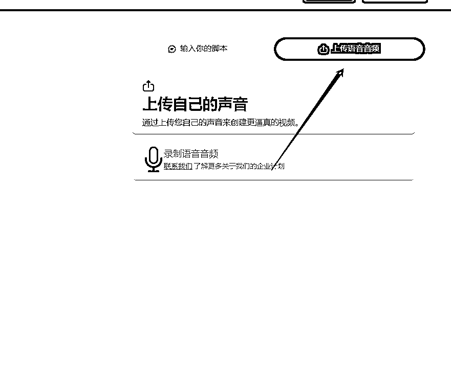

## 4、生成视频然后下载

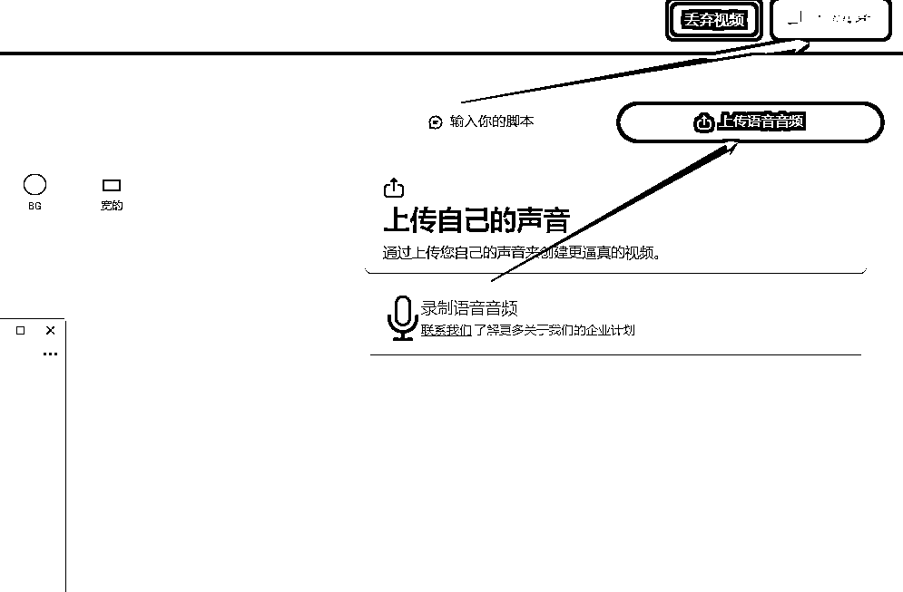