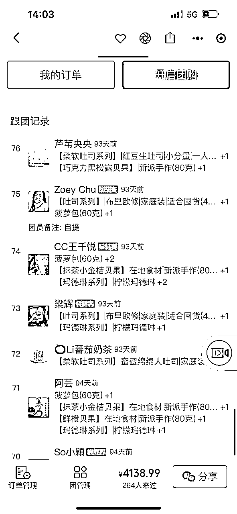

# 3月8日《如何2个月时间快团团帮卖佣金8万》贾璐luca

> 来源：[https://r7weuqivm5.feishu.cn/docx/SYkqdYJ4FoEXOlxQpitcWY8Rnqg](https://r7weuqivm5.feishu.cn/docx/SYkqdYJ4FoEXOlxQpitcWY8Rnqg)

谢谢生财静伟的邀请，既荣幸又激动地分享快团团的一些小经验，在群里这么多大佬面前，是班门弄斧。

先来个自我介绍，很想交更多生财的朋友。

【我叫】贾璐Luca

【坐标】广州

【职业标签】多行业连续创业者，爆红品牌幕后推手，资源达人

【个人成就】曾是两家香港上市餐饮公司品牌总监，23岁开始在广州买房，现有4套房在收租。25岁嫁给了暗恋3年的男人，有一娃，现又怀有一娃，每天都好幸福好开心，

陆续有十几个创业项目，涵盖 建筑设计，旅游，月子中心，民宿，餐饮，酒吧，快团团，无人直播……

【我能帮到大家的】好吃好玩的产品供应链，一线城市媒体资源，品牌营销，最新的电商玩法。

我现在的主要线上营收是无人直播电商，大家都知道抖音、快手的直播规则瞬息万变，且用户群体没有复购。钱是赚了不少，但压力很大，且对未来迷茫。

但快团团不一样，它是基于社群运营，有着超强的黏性的复购。所以我从去年12月慢慢测试，权当是“一个人的副业”快团团实验成绩吧。

# 成就

“一个人的副业”快团团实验成绩

1、一个月时间，达到全国排名1797

2、单月帮卖佣金达到8万

3、疫情期间，小区开团卖面包，净利润2万

# 卖的什么

## 帮卖类

### （一）帮卖的类目

快团团帮卖，我主打的三种类目：

1、时令水果类：草莓、橙子、枇杷、芒果……

2、卖生活方式：鲜花、香薰蜡烛……

3、预制菜：凉皮、鸭掌煲、螺蛳粉……

至于为什么主打这三个类目，我理解的在快团团的“人货场”，货和人的需求，对人的理解是匹配和一致的，卖货先要理解人，基于人的需求，选择对应的货，才能大卖，具体的后面会再讲到。

### （二）重点打爆款单品

重点讲一下帮卖爆款单品—草莓，一个月赚了3万多，一单平均佣金是11元，卖了2800多单，复购率40%以上。

为什么选择草莓作为爆款原因：

1、应季水果，一年只有3个月当季，大家期待已久，

2、口味酸甜，小朋友们尤其喜欢，家长会为小朋友持续买单

3、草莓客单价高，利润高。线下水果店价格普遍偏高，电商价格有一定优势

### （三）卖得好且复购高秘诀：

1、 饥饿营销:每天10点定时秒杀，限量200份，卖完即止。挺多用户设闹钟抢草莓。

2、刺激购买：抓住从众心理，让群里每天好评不断，刺激其他用户购买，注意：小部分用户是托儿。一定要有托儿，要不然很容易变死群。

3、同类对比：选品前提一定是性价比高，且品质有保障，在群里发一些知名的超市、水果店该水果的价格与品质照片。这样让用户觉得捡便宜了。

## 小区团购

### （一）开小区面包团的原因

有个朋友开厂创业，给广深知名餐饮品牌做蛋糕甜品的代加工。疫情期间，实体店大受打击。于是我们联合起来，决定toC端。快团团有个模式-小区团购。我在周边几个小区的现有的美食群、妈妈群发起开团，每周一次，每次都近百个邻居接龙。

具体小区团购操作，大家都可以自己尝试下，运作起来也是类似的，群里发起团购，大家下单后，固定时间、地点提货。

### （二）其他产品小区团

这是相同的小区团购模式，还帮邻居们团咖啡、热饮。团购价和门店价格一样，但商家另外给15%提成，我等于是美团外卖这样的平台。

以上是我的快团团副业经历，更多是测试，因为还是在孕期，孕吐很严重，所以现阶段没经历和时间建立和打磨团队，但接下来会发展团队的，毕竟还是看好快团团。

# 人货场逻辑在社区团购里的应用

### （一）大家应该会迷茫，快团团帮卖，卖什么呢？那要先解决卖给谁的问题

我现有的微信群体的人群画像很集中：

1、中产阶级的家庭主妇需求：家庭主妇没太多事，每天有大把时间，在群里比较活跃，个人没有收入，个体的价值也不高，主要是依附家庭存在，他们的开支主要是家庭相关开支，因此主妇给自己很难花大钱，但是以孩子、家庭的名义，可以满足自己的消费欲望，也来带来社交价值；收入高的家庭，在日常饮食、刚需消费、家庭教育等高频消费品，往往会选择高品质，高价值，生活方式角度上能带来高势能的东西，

2、大城市女白领 ：女白领工作繁忙的多，情感生活有限，个体的价值很强，且非常依赖消费来实现，个体的消费能力也比较强，对于这个群体比更爱自己，在晒单和表现社交价值时，也更在乎对自身价值的烘托，爱生活会生活懂生活的人设是必须的，但是时间又很有限，所以需要一些能快速帮助其提高爱生活这个设定的商品。

### （二）根据他们的具体需求，再深挖具体卖什么产品。

首先有个词要理解，生活方式，很多朋友对这个概念理解很浅，绝对无非是装逼，但是没有这么简单，生活方式来源于英文life style，就是生活的格调和风格，结合现在的社交媒体经济，生活方式的意义和价值得到充分的放大，简单的说，生活方式消费，就是能给消费的人带来格调的感知，有格调的生活的消费，人通过生活方式，成为更有格调的人，成为自己更欣赏，更喜欢，更希望成为的人。

也就因为如此，有格调的消费才有人愿意付出额外的价格，否则大家只想给低价；在今天，社交媒体使得个人的生活方式的价值可以快速折现成社交价值，让发布者站在高地，所以，选品如果在生活方式的角度是成功的，一定能自然激发消费者的分享欲望而不是靠晒单换打折。

当然，这个说来容易，人愿意为生活方式付出的钱是有限的，光有格调不够，所以在选品和定价的时候，追求给买家提升格调的同事，如果价值的感知更突出，让买家觉得占了便宜，才会爆，比如直播间里的大牌主播，需要先把自己定位成懂的生活懂得美学懂的格调的人，大家接受这个设定后，再看到折扣价，才会把持不住，但是如果对主播不够信任，同样的商品，与主播不匹配，效果也不会太好。

当然不同人定义的生活方式不同，格调也不同，人货场人货场，永远人是第一位的，倾听人的需求，关注人的需求，再来做选品。

因为我周边几个小区属于中高端小区，以及小红书的引流来的粉丝也是高质量粉丝，通过长期在群里的交流，我就对于两类目标人群的消费能力和社交价值评估有所评估和理解，进行了针对性的选品和定价。结合这两个人群的特点，水果成了我的首选，首先，对于女性，水果这个品类，经过多年的教育，已经具备了天然的亲近；其次，水果整体颜值高，具备一定的社交价值；再次，水果是高频消费，三不五时要买；最后，水果店的水果定价很高，有低价击穿的空间和可能。

当然，水果也有一定的不足，首先，水果容易坏，品相和质量问题带来的赔付少不了；另外，水果比较非标，很难保证稳定性，所以这两点也限制了水果团的天花板。

不过，我们先看机会的部分，总结下来，基于对“人”的理解，我作为人货场的“场”，结合我的"吃货属性”，定位了“货”-性价比高的水果生鲜。具体的选品是颜值高，品质高，消费欲望强的水果：葡萄，草莓，蓝莓，高端柑橘等。而快团团只是我的工具。

人群定位、产品定位有了，更重要的是如何获客，有流量才有生意。

# 成功的技巧

这个套路其实不难理解，这些品类也并不稀奇，但是为什么我能做到呢，我就说几个特别的点

### （一）个人IP打造-让顾客产生假想且信任

由于本人市场广告人出身，10年期间在不同领域创业，个人号原本有7000多好友，平日会发生活方式的图文，经常组织各类活动。同时在周边几个小区有一定影响力。所以在朋友圈、微信群卖货有一定的信任背书，

IP人设打造重点：

1、打造朋友圈的图文美好且正能量，从而让他们羡慕以及产生假想：“买了luca的东西，就可以享受到像luca这样的生活方式”。现在生财的大航海的有朋友圈运营航海，可以学学朋友圈运营的手册，实用的很。

2、多参加以及组织线上赚钱分享、阅读等活动，或者线下的生财聚会，塑造成思想丰盈，情感丰富的独立女性形象，也是购买群体（家庭主妇、年轻白领）所期待的假想体。

3、卖自己擅长且喜欢的物品，这样顾客更加信任，我做了5年餐饮，对饮料、水果、糕点等吃喝美食是真的了解。也经常旅游，去探访水果原产地。但对化妆品、母婴物品的大类真的不了解。

### （二）拉新

1.私域拉新

老顾客邀请她的朋友进到luca买买群，老顾客将获得快团团2元减免红包，这样起到老顾客留存，还能拉新的作用。平均能做到1个老朋友拉2个新朋友进群。

2.小红书拉新

通过发布一系列的笔记，引流到微信个人号。再加入到购买群。现在已有13个买买群。

怎么引导小红书用户在首页浏览时点进来，并私聊引流到微信群，发布的笔记文案很关键。和朋友圈、微信群的文案有异曲同工之处，我就综合在一起来讲。

### （三）文案能力

如果只是简单发图，发购买链接，不好意思，转化率会很差。所以我总结了下发布生鲜水果团小笔记文案或者朋友圈的吸睛点。

1、原产地直发，现摘现发，这样顾客就认为没有中间商赚差价。

2、价格要有优势，52元只能在超市买一斤草莓，但通过我可以买3斤

3、图片要足够博眼球，产品摆放丰富、颜色饱和度高。

4、写好售后服务，线上产品属于无实物展示，为减少线上购买商品的犹豫，一定要写包邮、不好吃退货或者破损包赔付。

5、发各种他人好评截图，诱导购买

6、一定要有托儿，氛围组。

7、秒杀限定，比如限制200份或者限制1天，卖完即止，这样让顾客有买东西紧迫感。

# 结语感想

快团团的运营逻辑很简单，无入驻费用,一键开团,传播迅速,超低提现服务费。不需要像抖音一样花钱投流，不需要像淘宝一样买钻展直通车，而是免费的平台。

你是“人货场”的场，只要你有"人”，快团团提供“货”，你就能卖货赚钱。作为副业真的很轻松！3个月测试下来，快团团真的大有可为，各位生财朋友们，我们一起在快团团搞钱吧！