# chatgpt plus 最新保姆级开通教程

> 来源：[https://be2m999k9z.feishu.cn/docx/YE1FdsTuxoaBbNx4f5dcnSNenxb](https://be2m999k9z.feishu.cn/docx/YE1FdsTuxoaBbNx4f5dcnSNenxb)

从夜里10点半到凌晨1点，花了两个半小时一次成功开通chatgpt，共充值248.05元，最后还剩12.4美金，总花费163元左右，预计之后再续费充值的话大概每次成本花费应该在144到152人民币之间，上下浮动1美金左右。

接下来说一说，我这两个半小时充值plus的各种详细操作以及遇到的问题，和怎么解决的方法。

# 开通说明：

最近因为depay平台的系统维护，进行不了KYC认证，所以我一直没办法通过注册depay 开通虚拟信用卡进行充值，于是就选择了nobepay平台进行开卡。

这两个平台相比，

nobepay的成本是【开卡费1U+充值3%手续费+0月费】

depay的成本是【开卡费0U+充值1.35%手续费+1U月费】

如果每个月只是用来开通chatgpt plus的话，nobepay相对来说会更划算，如果每个月消费超过60U的话，用depay会更划算。

nobepay开通地址：https://nobepay.com/app/login?type=azmzep&code=D3BFA23

邀请码：D3BFA23

# 第一步，打开官方地址，切换成中文

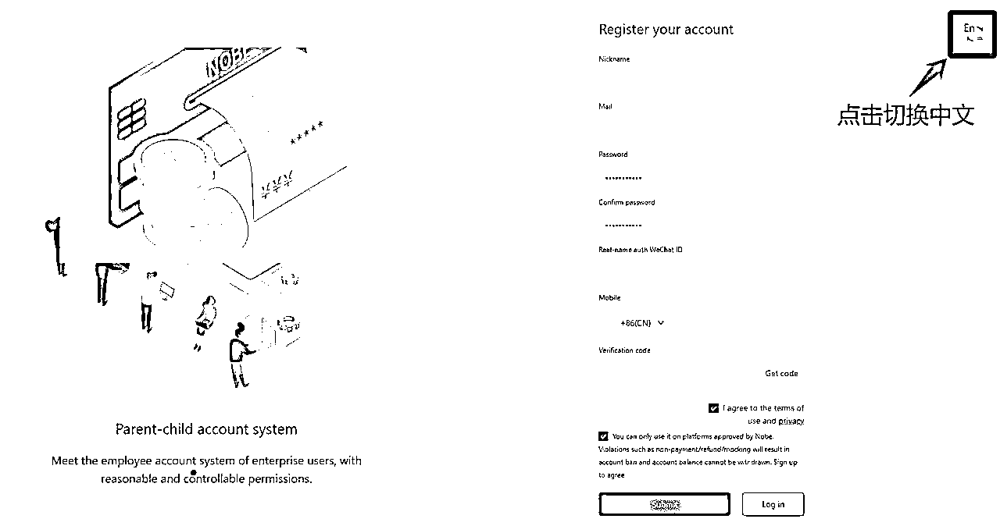

# 第二步，注册

注册填写已实名的微信号和手机号，邀请码：D3BFA23

# 第三步，登录

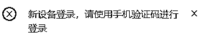

第一次登录会提示使用手机验证码进行登录，切换成验证码登录就可以了

# 第四步，认证

登录进去之后，需要关注公众号，填写问卷，KYC认证

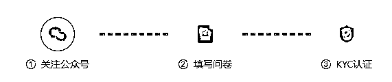

## 1、关注公众号

需要用刚才注册页面填写的公众号关注

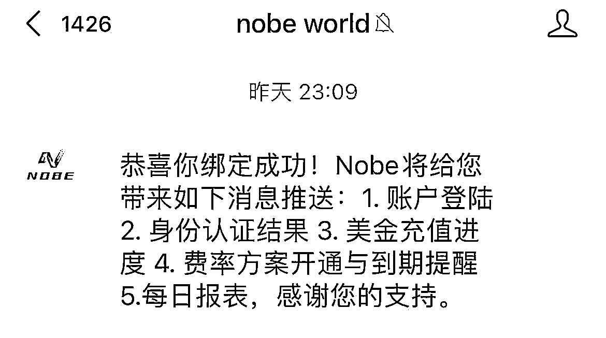

## 2、填写问卷

问卷基本上没有太需要注意的地方，随便选就可以了

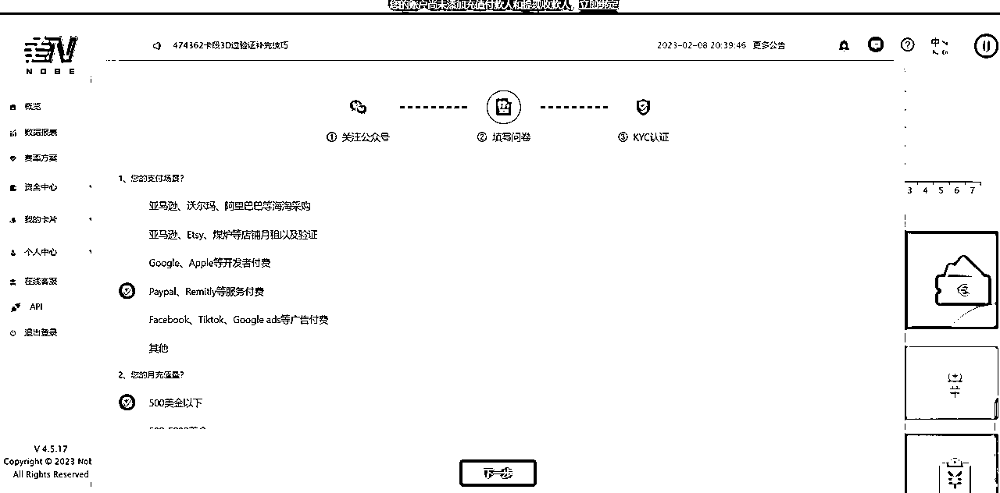

## 3、微信扫码完成KYC认证

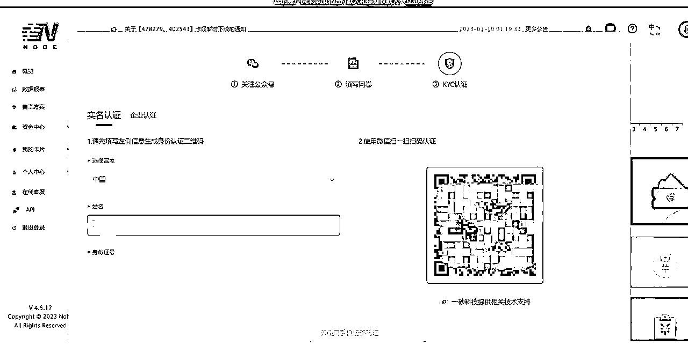

# 第五步，充值

点“用户头像”——快速充值

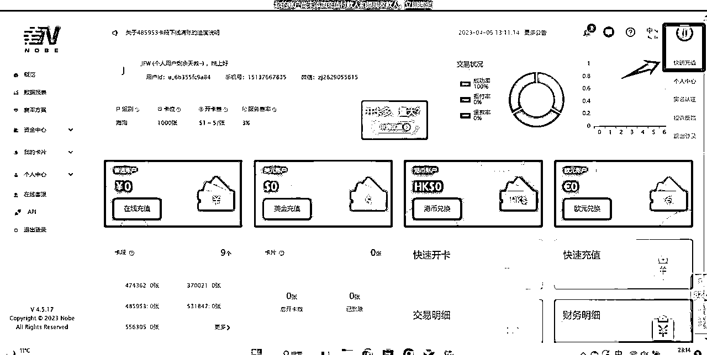

充值方式有3种：

人民币充值

USDT

美金

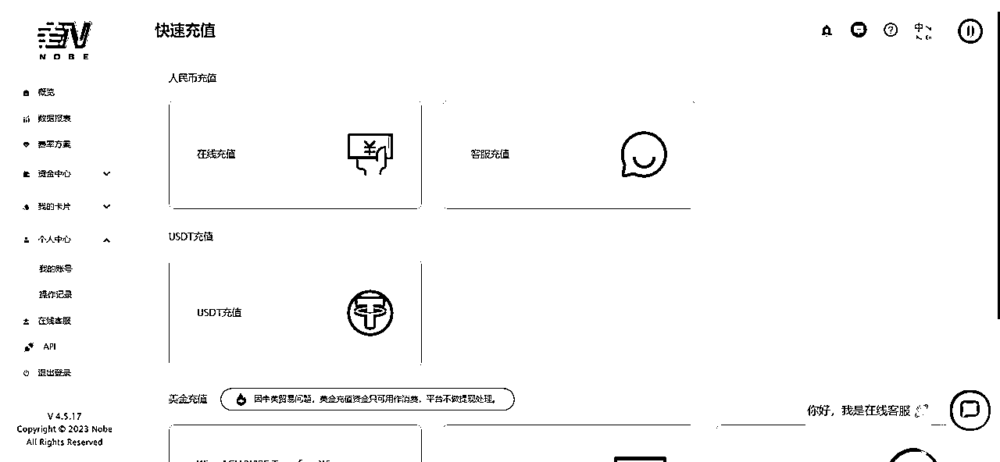

因为人民币充值最低要500元起充，并且不能提现，所以推荐采用USDT充值。

USDT（泰达币）是一种和美元挂钩的虚拟货币，1USDT就相当于1美元。

点击USDT充值，进入充值页面：

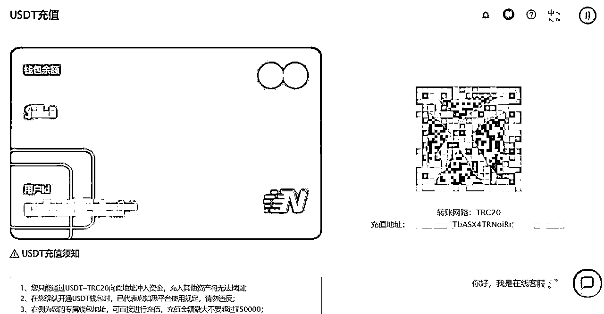

进来之后会得到一个充值的二维码和充值地址，这个二维码只能通过USDT进行交易，支付宝和微信无法直接交易，所以我们需要先在欧易平台进行注册，然后购买USDT。

# 第六步，注册欧易平台

## 1、注册

点击 https://cnouyi.cards/join/87152404 跳转欧易平台官网，输入手机号，点击领取盲盒，然后按照页面提示进行注册。

（这一步建议使用手机操作，方便直接下载欧易APP，打开链接时可能会被浏览器标注风险提示，点击继续访问就可以了，如果浏览器不允许打开链接，就换一个浏览器，我用的是UC浏览器）

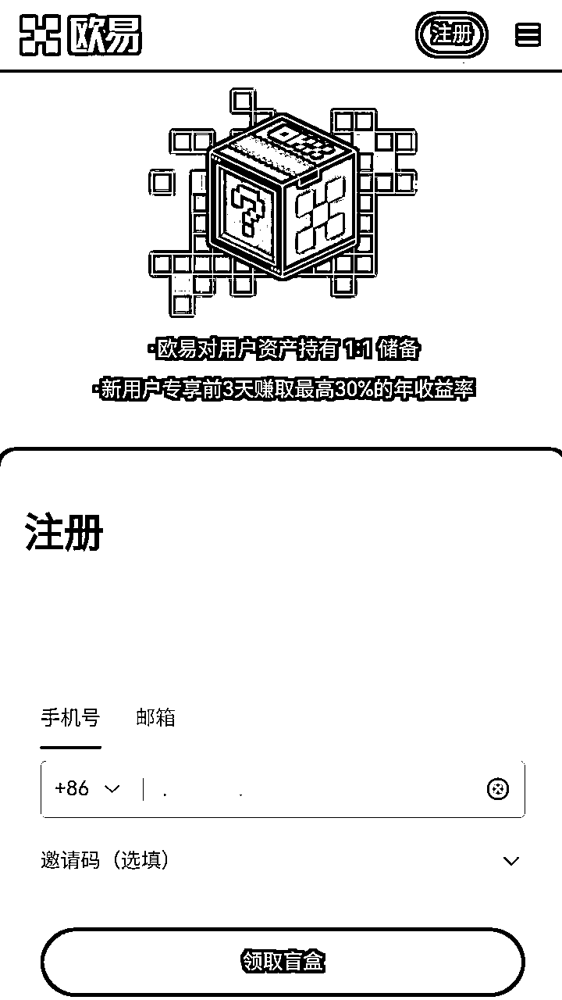

## 2、下载

注册完成后会弹出下载页面，点击本地下载安装包并安装。

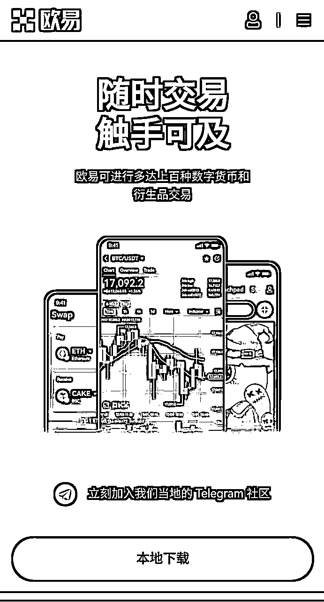

## 3、买币

打开APP，在欧易首页，点击“购买或充值数字货币”

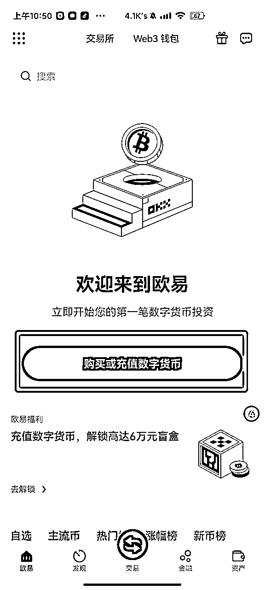

点击“我想要买币”

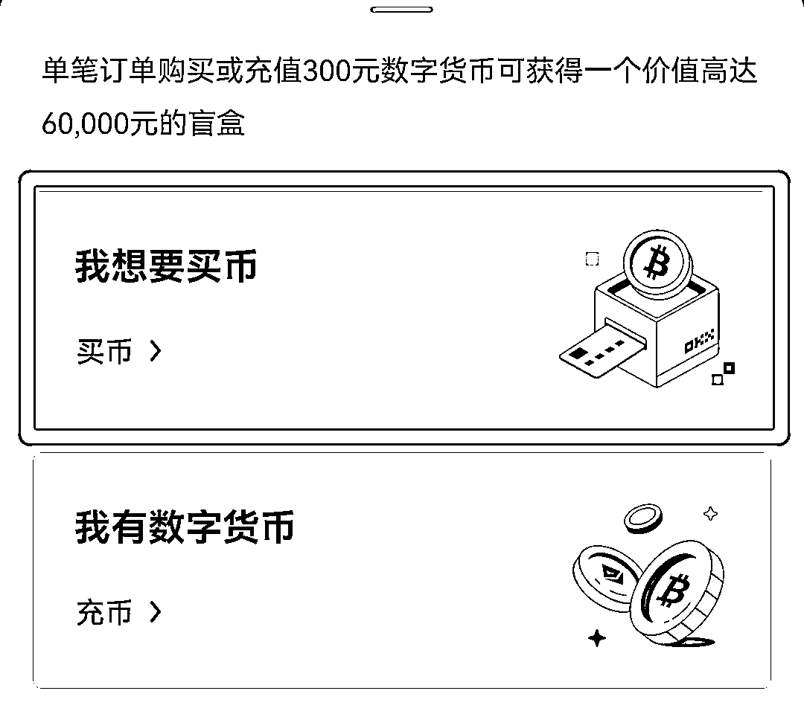

选择USDT

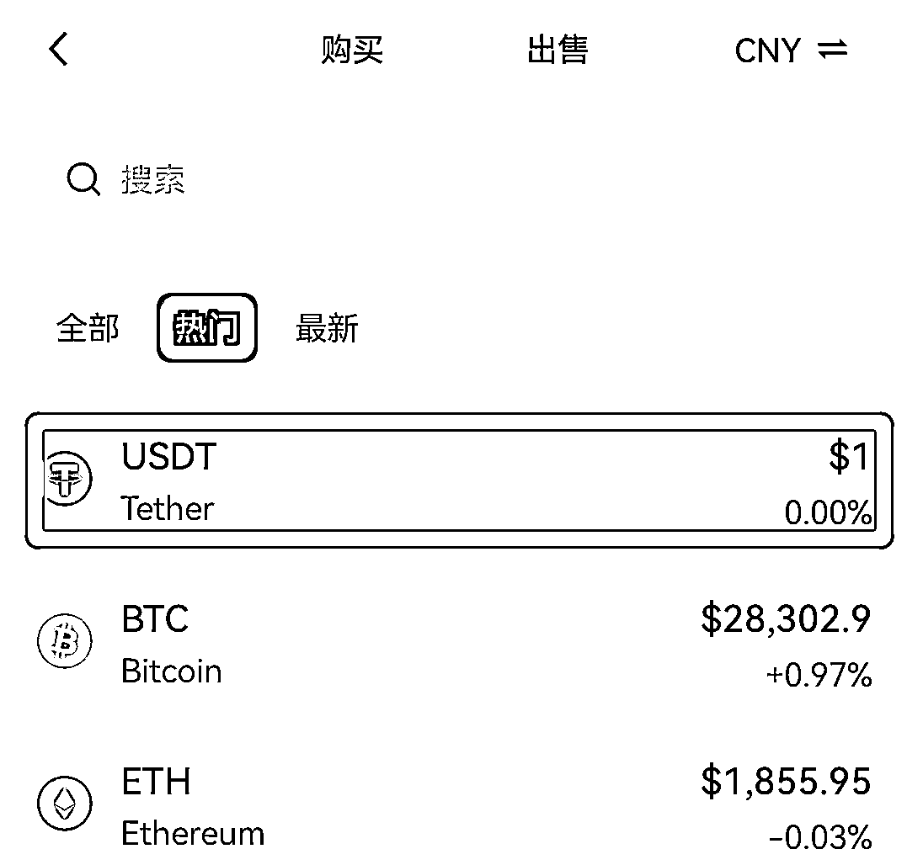

买的时候记得切换成USDT单位，考虑到后续手续费和开卡最低充值，所以最低需要充34USDT，如果担心意外情况，可以多充一点，我当时是充了36USDT，最后总共还剩下12.4U的余额。

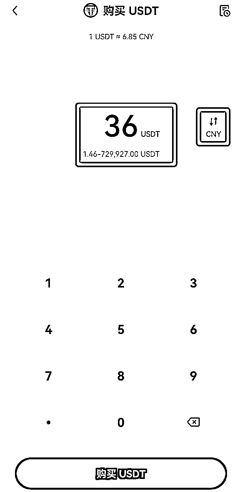

充值过程中，需要进行个人信息的验证，按照提示进行验证就可以了，最好是把3个等级的个人认证全部做完。

（我当时买币的时候只做了前两个等级的认证，充完币后直接被锁定了，需要等7天后才能操作，于是就提起申诉，但是提起申诉需要进行第三等级的个人认证，于是就把第三等级的个人认证也给做了，申诉后大概3分钟就通过了，账户就可以正常操作了。）

## 4、充值

到了这一步我们已经拥有了USDT，可以使用USDT充值nobepay了，具体方法：

点击“资产”→“提币”→“USDT”→“链上提币”

在提币地址栏输入刚才第五步充值页面的充值地址和提币网络，也可以直接扫描充值页面的二维码，自动录入信息。

输入提币数量，由于nobepay是第一次开卡，加上手续费，所以提币数量不能少于34USDT，否则一会儿可能无法开卡。

点击提交，大概一两分钟，资金就会到账。

（我是直接提了全部36USDT，提币手续费扣了1USDT，充值手续费2%，最终到账34.3＄）

如果页面一直不刷新余额，点击个人中心就可以看到充值的资金了。

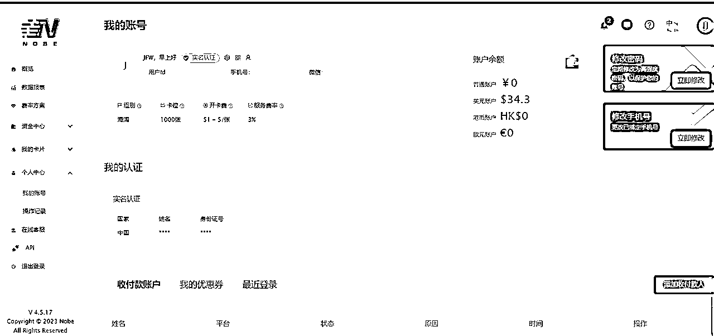

特别注意：

USDT只能充进去消费，不能提现，所以根据需要来充值

# 第七步，开卡

## 开卡步骤：

点左边菜单栏——我的卡片——快速开卡——选择556766——填写完信息——开卡

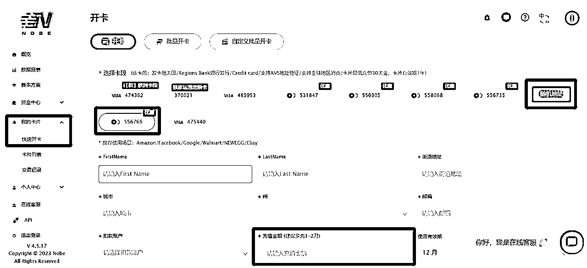

## 注意事项：

### 1、填写信息

如果你不知道怎么填写，可以用旁边的“随机地址”，会自动生成随机个人信息，不过生成随机信息后，最好把姓名栏换成自己的姓名。

### 2、选择卡段

不同的卡段有不同的开卡起充金额，556766卡段开卡最低起充30＄，像531847卡段就是开卡最低10$起充，不过有可能会出现用的人太多，开通plus的时候不成功，需要重新开卡的情况，不过这个我也只是听说，并没有证据能证实。

因为每开一次新卡，都会扣1$的开卡费，保险起见，为了避免开的卡段无法使用，就直接开了556766卡段，至于其他卡段还没有做过尝试。

完成上面的步骤，一张美国的虚拟信用卡就开通了。

### 3、查看卡片信息

在左边菜单，我的卡片——卡片列表——管理——查看卡片，就可以看到的自己卡片信息了

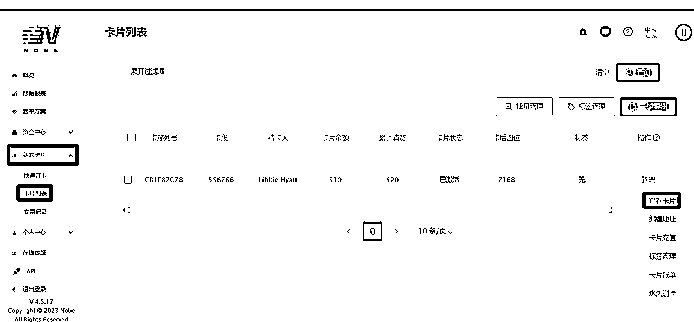

卡片信息：

# 第八步，充值chatgpt plus

## 1、选择漂亮国节点登录chatgpt，点击“Upgrade to Plus”→“Upgrade plan”

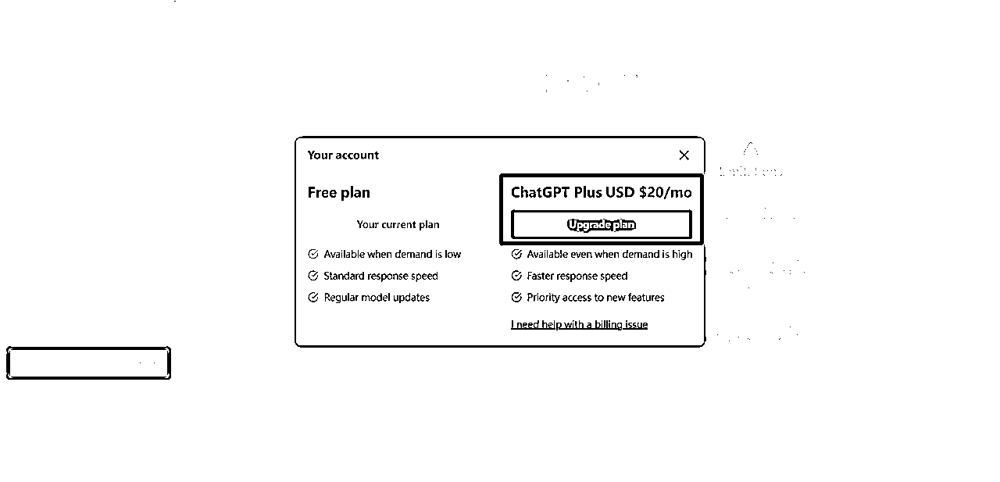

## 2、填写卡片信息

填写刚才在nobepay申请的虚拟信用卡账号信息

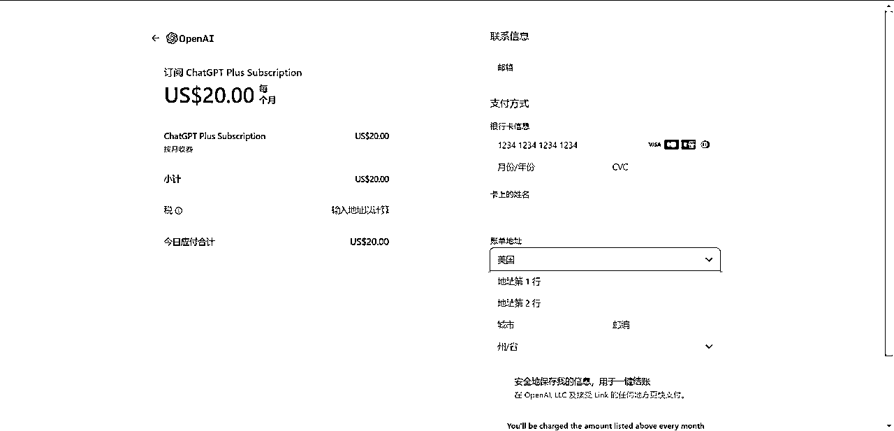

## 3、填写账单信息

使用美国虚拟地址生成器（https://www.dizhishengcheng.com/Index/custom_result），选择一个免税州，点击搜索，生成虚拟地址，把生成的虚拟地址信息填进去

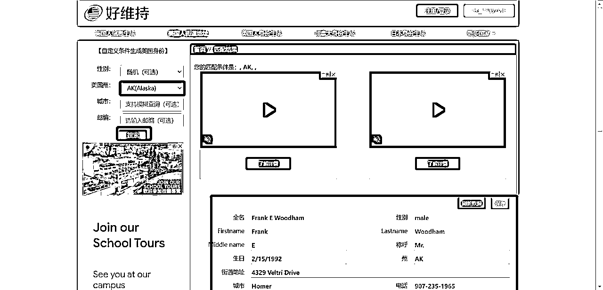

美国免税州：

1、俄勒冈州（Oregon）

2、阿拉斯加州（Alaska）

3、特拉华州（Delaware）

4、蒙大拿州（Montana）

5、新罕布什尔州（New Hampshire）

## 4、点击订阅

信息填写完成后，点击订阅，chatgpt plus就开通成功了

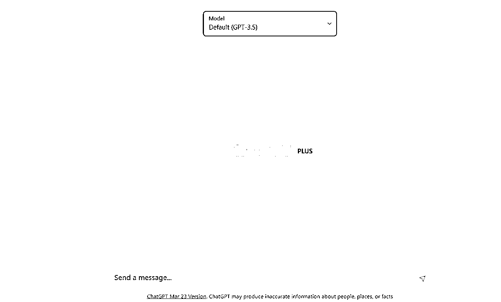

## 5、注意事项

1、如果点击订阅后，显示卡片被拒，大概率是节点的问题，更换高质量节点；

2、账单地址最好和节点位置保持一致，漂亮国的地址就用漂亮国的节点，其他国家的节点就用其他国家的账单地址；

3、如果卡片一直被拒，暂停操作，等第二天再尝试

# 费用明细：

为了方便计算，所以接下来我就都以USDT为单位进行计算。

这套流程下来我购买36USDT总共花了248.05元，

充值到nobepay的时候，欧易平台手续费扣了1USDT（据说这个手续费最低是一次0.1USDT起，不过目前我还没有尝试），

nobepay扣了2%（0.7USDT），

开卡费1USDT，

充卡费30USDT扣了3%（0.9USDT），

开通chatgpt plus花了20USDT，

总共花了23.6USDT，

相当于163元人民币左右

不过剩余12.4USDT目前只能消费，不能提现，可以用在下次plus续费或者开通其他平台会员

下次续费的话，由于省了1U的开卡费，加上欧易平台的手续费不固定（按次结算）

所以如果下次续费的成本大概在21USDT到22USDT之间，换算成人民币大概在144到152元左右。