# 第七期还没开始，我已经通过白嫖生财赚到第一张门票了

> 来源：[https://gq2psr73l6v.feishu.cn/docx/Yjt0dfSN8ob6Xgxl9z6ct7Kfnqf](https://gq2psr73l6v.feishu.cn/docx/Yjt0dfSN8ob6Xgxl9z6ct7Kfnqf)

# 一、【自我介绍】

生财有术的圈友大家好，简单先介绍一下个人情况。我是Ray，第七期新人。目前是在广州的一家电商代运营公司工作，15-17年大学期间遇上微信公众号风口，纯自然流做到了几万公众号粉，可惜认知不行没赚到钱。另外碰上了目前还一直在合作的副业外包公司，每个月能拿到小几千，日子非常平淡。

但是这两年我明显感觉到老老实实，兢兢业业打工的生活并不能满足我，一个月拿那八千块，一年也就十万不到，还没扣除衣食住行，房租月供。再这样下去可能一辈子就这样一事无成，领一份薪水混吃等死，尤其是每天挤在三号线的人潮中更是让我厌恶这样麻木，毫无目的的生活。

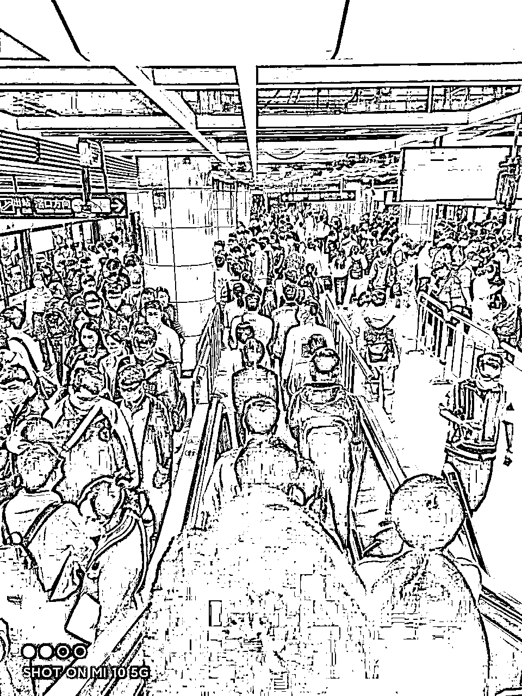

所以去年我一直在想是不是要跳出这个舒适圈，去多认识一些朋友，开阔眼界，当然，我也知道并不像打工那样轻松。风险，成本，精力都是需要去衡量的，所以在考虑以什么方式去做，期间尝试过小红书，抖音项目，均无所获。直到今年初碰到了生财，入坑视频号短视频带货。

## 目前成绩

先汇报一下目前的成绩，做了四个号，一个号春节期间至今赚了四百多，两个号废了，另一个号成功在4.3号进生财前赚到第一张门票钱。

刚刚入门这点收入实在上不了台面，但也希望我这平凡的普通人经历，能给到同样是新进来的圈友一些启发与感悟。

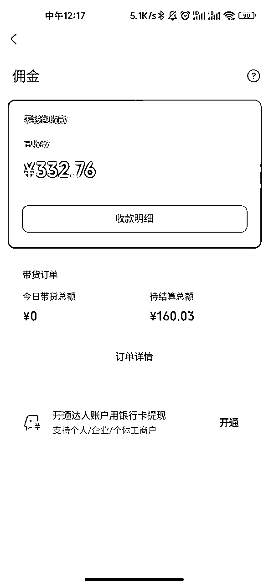

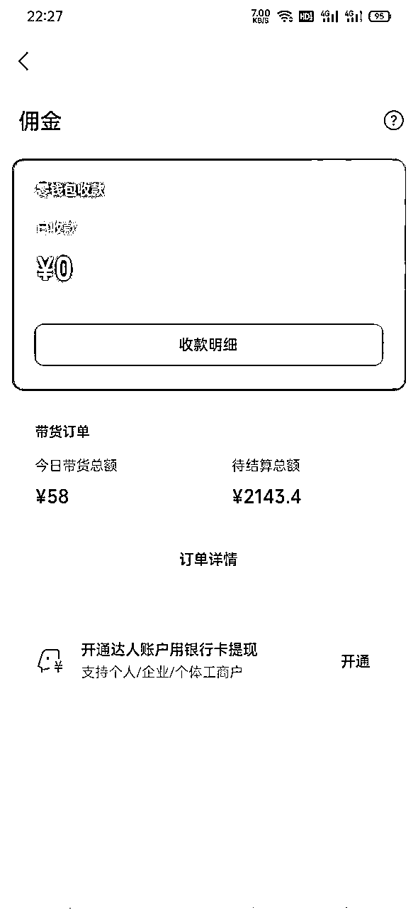

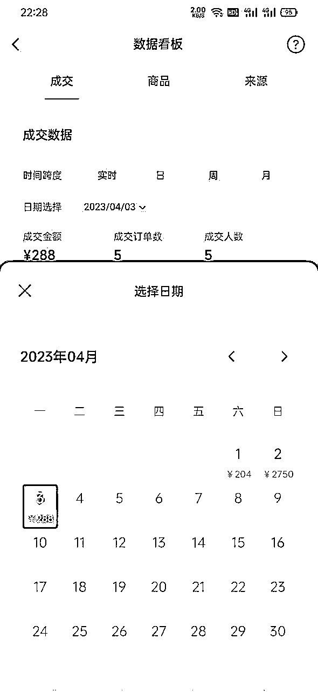

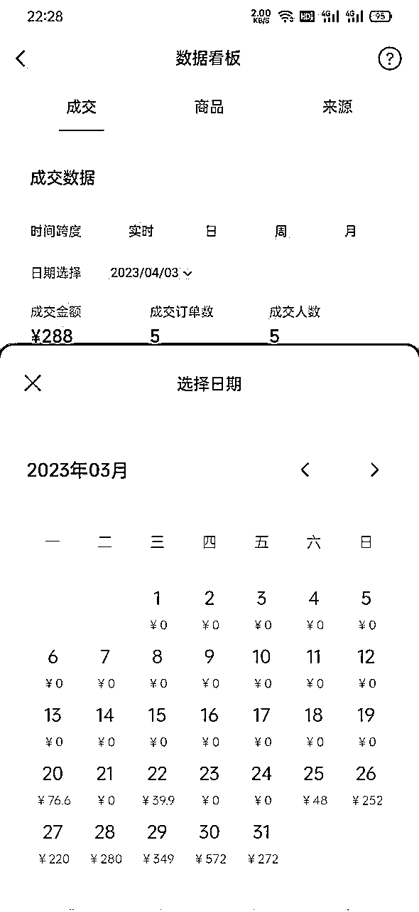

# 二、【初识生财】

从去年有萌芽阶段开始，我陆续尝试了实体摆摊，小红书低粉爆文项目，闲鱼引流卖货等，毫无疑问，连基础知识体系都没有的我都以失败告终。随后每天都在网上搜关于副业，创业，赚钱等关键词。

直到有一天看到郭晓文老师在公众号分享的视频号一文，然后去深读分享出来的养生号，书单号操作手册，才知道短视频带货玩法原来这么猛，平时拿来娱乐的等软件居然这么赚钱，真是后知后觉呀！

随后通过继续搜索短视频带货等关键词关注了一批圈友的公众号，发现他们文章或多或少都提到了一个星球名字：生财有术，于是也顺便关注了，每天看看公众号发的文章，是挺干的，一看加入知识星球居然要两三千，立马劝退，网上白嫖的内容他不香吗。

后来加了鱼丸，看朋友圈会发风向标这个东西，虽然只能看一部分内容，但是这种形式非常吸引我。一个是能紧跟当下最新的热点，里头是大量最新最快的资讯，普遍领先传统互联网；另一个是能够对自己思考有启发，可以学到一些骚操作。

至此开始对生财重视起来了，我会每周蹲守公众号发的星球周报，每天阅读公众号以往发的圈友文章。这些都是免费且非常精华的内容。

# 三、【白嫖生财】

三月，生财开始拉新。可以添加鱼丸微信参与3天体验活动，领取一张生财有术【三天免费体验卡】。这种白嫖机会岂能错过。果断报名加入。

一进星球眼花缭乱，脑容量完全不够了。就像刘姥姥进大观园，看这个人赚钱，看那个项目赚钱。每天都是信息爆炸的一天，企图把生财这六年的积累沉淀都吸收完。

转眼就到第三天了，看不完怎么办？没事，我研究出了一个bug，很多大佬因为星球文章不太方便展现原因，一般会独立开个飞书链接，这种链接就算你不是会员其实也可以看的，于是我疯狂大量的保存飞书链接，三天结束以后心满意足了，这些干货足够我看很长一段时间。

第四天，没打开生财，因为知道肯定过期了。第五天，无意中打开之前收藏的生财有术索引站2.0

https://search01.shengcaiyoushu.com/

直接被震惊到，我居然还可以免费看里面绝大多数内容！！！（PS：我当时也不知道这是bug，还是亦仁有意让我们白嫖）

尤其是里面的航海手册，就算你不是生财会员，就算你一次都没有参加航海，每一条船，每一个项目，每篇手册万字长文，全部可以免费查看，连往期的航海内容也一并可以看到！

亦仁：每次航海 3-6 月后，一些资料在市面上会变成大几千元的培训

即使你现在是学生，即使你现在经济不足以支持几千块一年的费用，这些公开的宝藏内容不是妥妥的白嫖机会吗？随便掌握其中一个项目，你已经是无敌了！

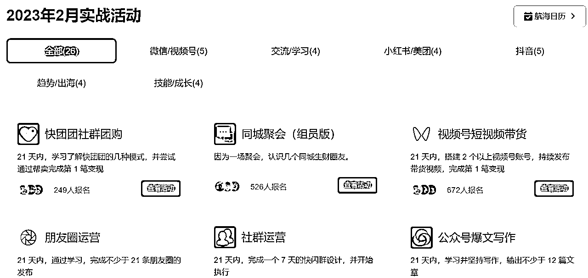

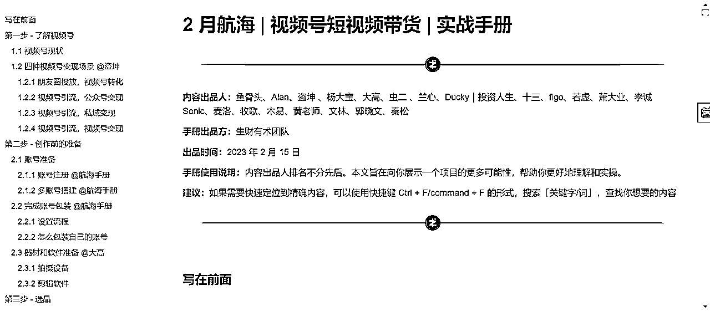

## 我是如何不花一分钱白嫖生财的

### 白嫖航海资料库

第一步：通过生财有术索引站2.0进入实战活动

第二步：随意打开一个你感兴趣的航海

第三步：打开航海手册

第四步：学习航海手册（看十遍以上）

航海资料库分为航海手册，高手分享，百问百答，实用工具，精选日志，航海好事几个板块。

重点推荐精读航海手册，每一本航海手册都是一个项目的百科全书，在这万字长文手册里面又隐藏了无数个星球链接，里面集聚了无数生财大佬的精华和踩坑经验。

最适合小白从0到1照着做。（白嫖外面卖几千块钱的培训他不香吗？）

七小：如果说一个跟着操作就能100%赚到钱的手册，颗粒度是1亿像素级别的。那么生财的航海手册，就是1080p高清的。已经很高清细致。 但是无法做到1亿像素那么精细。想要更多的细节，仍然得你自己去实践中获取。

### 白嫖风向标

风向标主要是给圈友收集和分享“最新的”赚钱相关的情报和玩法。重在「短」和「快」。

140 个字内的赚钱信息，只说重点，言简意赅。这里代表着生财有术社群几万双眼睛，共同在整个互联网世界观察正在发生的那些赚钱的项目、案例、机会、风险。每天可以当做朋友圈来看，比刷微博，知乎爽多了。

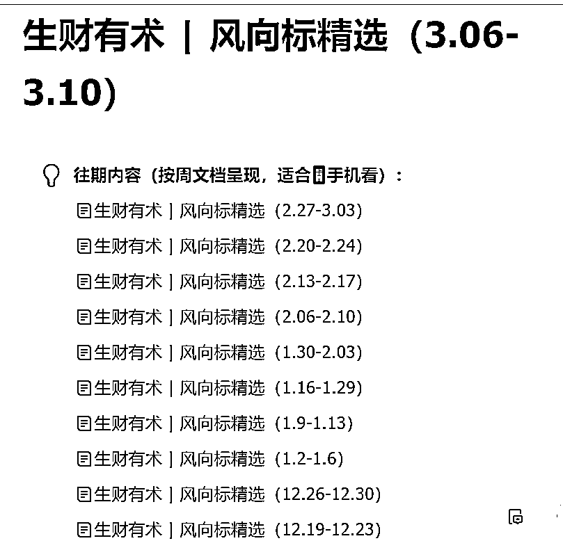

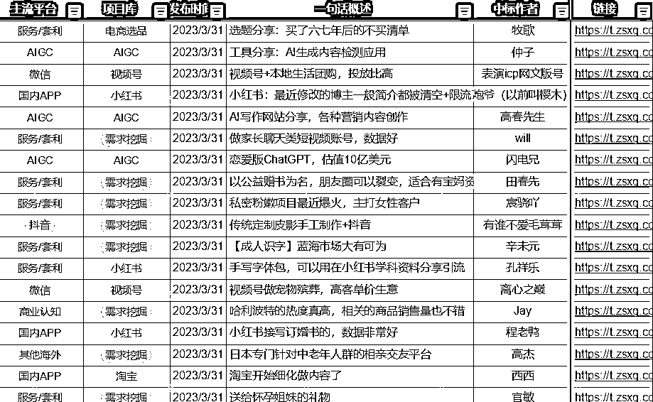

公众号每周会更新生财周报，其中就有中标风向标，里面每一条都是经过亦仁筛选过的，有手机版和电脑版，推荐电脑版，体验感极佳！几千条不同行业，不同项目，不同平台的最新玩法，一句话给你概述了。

如果觉得还不过瘾，还想了解更详细的内容，可以点开星球链接，查看部分内容。比如下面这个讲养生图文带货，点开链接发现里面的内容看不全，图片也被打码了，你也没办法评论问大佬这个账号名字是什么，怎么办？

我是这么做的，如果是手机就截图放大，如果是电脑版那么可以调整网页缩放，这样就能得到第二张图，这张图片里面虽然账号被打码了，但是没关系，我们有关键词啊，里面有这么多文字，完全可以复制到抖音去搜索，从而得到我们想要的答案。

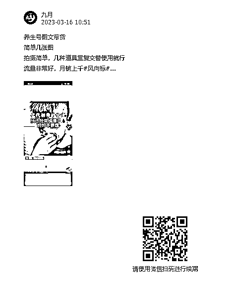

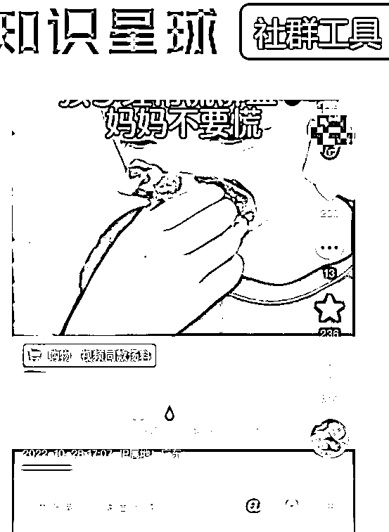

### 白嫖生财索引站

善用生财有术搜索引擎。遇到问题搜一搜，贼好用！这里借用涛哥的分享：因为沉淀了6年的干货，68700+篇赚钱内容，4440+篇精华案例分享，数亿字，输入相应的标签或关键词，即可搜索你想要的资源。

而这些内容，每个人，无论有没有加入生财有术，都可以通过生财有术的内容索引网站搜索。（没有加入的好像会提示非会员，但是你可以申请三天免费试用，三天后过期了你照样可以用这个搜索引擎。）

因为我现在是做短视频带货项目的，所以我会经常搜索视频，带货，养生等关键词，然后设置帖子内容为最新发布，这样又能看到圈友最新发布的玩法和风向。

这个索引站就是生财人的兵器库，对于那些希望通过搜索来挖掘有价值信息的，会很喜欢，挖掘效率提升了。但是不看帖、不主动，给啥都没用，搜索引擎也没用。

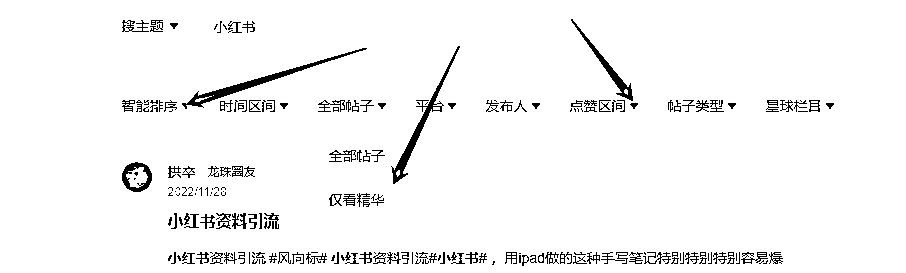

当然身为白嫖玩家，我们只能略窥一二里面的内容，不过我认为这些足矣。另外，异常值这个词也可以搜一搜，偶尔会有小惊喜！

以上分享的三个方法全部可以白嫖

你一分钱都不用花！

别说你不够看！！！光是里面一个项目的航海手册，都需要花费一个星期以上去反复学习了，切忌贪多嚼不烂，学会一个项目，一招鲜，已经够你吃遍天了。

# 四、【选定项目】

聊完白嫖操作，说一下自己一路走来的坑。春节期间开始摸索自己第一个视频号，之所以不从抖音开始，一个是先前做过基本都是几十播放量没有出成绩，有阴影了；另一个原因是我个人习惯不喜欢往人多的地方钻，总觉得想要参与一些蓝海的平台。

起步阶段完全没有做什么调研，也没有对标账号。发的是蔡徐坤ikun的内容，因为当时发现很多视频擦蔡徐坤鸡你太美的梗都能火，那我是不是也可以在视频号试试卖蔡徐坤周边。

可能是春节期间大家都比较闲，或者是ikun实在是太多了，那段时间发的视频居然基本播放量都能过万，有一个视频还爆了50万播放，出了几十单，但是客单价太低，佣金也不高，一共也就赚了四百多。

至少是从0到1跑通了。现在想想也是头铁，在中老年为主的视频号做年轻人的内容。

随着播放量的激增，开始有投广告的找我了。发一个产品合集营销视频，价格不高而且很low，最后我拿了50块，也算是额外收入了。

感觉这种来钱太慢了，看他们做小红书赚钱，做咸鱼赚钱，我开始小猫钓鱼了，看到圈友张柯发朋友圈说短剧CPS好像很好做喔，普通人无门槛风口，而且还不收钱建了一个群，这种白嫖机会岂能错过。

果断私聊，加入到群里，一步步看手册，如何注册，如何挂链，如何混剪，如何挂链。结果一顿操作猛如虎，一看播放99。

刚开始剪辑短视频的时候，感觉非常吃力，总想剪出不一样的视频，一条三分钟的视频往往需要几个小时才能弄好，而且发出来以后播放量还非常差。可能是我去重能力不行，或者是用了老号去发，玄学问题。

那时要兼顾抖音和视频号，白天还要上班，非常非常累。是不是这个项目不行啊，但是群里看到别人三天两头就出单晒收入啊，那豪横的截图，闪瞎了我的眼睛，颠覆了我的认知。

## 没有不赚钱的项目，只有不赚钱的人

这样下去可不行啊，我一定要跑通一个项目。既然我现在精力有限，那我就只专注一个项目。鉴于视频号我已经跑通了，而且我对他的兴趣比抖音大，那我就砍掉短剧CPS，尽管他对新手真的很友好，尽管他看上去真的真香。

既然已经选择了视频号，那就开干吧，先前ikun号已经有一万多粉丝了，我不舍得注销，而且这是我第一个开单号，对我来说意义重大。另一个玩具号已经废了，开了一单以后基本0播放。

我重新找到航海手册，一遍遍地去看，照着上面说的，又去开了2张手机卡，开启账号注册，包装，选品，测品。手册上说书单号是个不错的赛道，变现稳定，利润高，是一个值得长期持有的低成本创业项目。

对新手友好，那我就做这个。好了，问题又来了：光是书单一个项目，里面可以延伸的领域又非常多。比如国学，育儿、职场、励志。

手册说要去看对标账号，那我就去抖音，视频号搜热门的视频，看了以后发现有几个好像都不错：学习类，玄学类，诗词类，育儿类。到底该选择哪个呢？我又迷茫了。

期间也有通过公众号加到生财的圈友，跟他聊了一下自己想法。发现还是基本功功不扎实，连最基础的对标调研都没做。

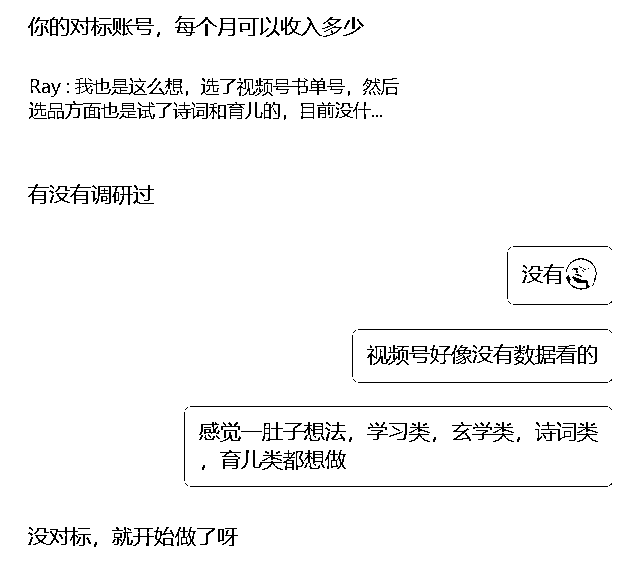

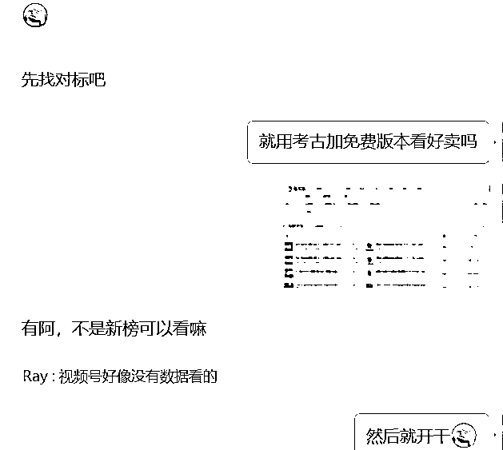

又去翻手册，发现我漏掉了这个视频！！！这个最懂新手的男人我居然遗漏掉了！！！

强烈建议生财给郭总这个直播视频多点露出的位置hhh，几万字的手册这两行实在是太容易被忽略了。

听了郭晓文老师的选品思路和答疑直播后简直是醍醐灌顶，一个多小时视频反复听了两三遍，讲的非常深入浅出，浅显易懂，新手也能完全听懂，看懂，并且实操性非常强，把每个步骤都说清楚了，听话照做就行！

其中一个很认同的点就是六脉神剑：很多大佬都对视频号有着不同的玩法，不要把每个老师的玩法都拿过来东拼西凑，只需要跟着一位老师把每一步的操作都做细致！

接下来操作没什么好说的了，跟着教的方法操作就完事了。

### 选品

*   客单价不能太低

比如那种几块钱的种子，不是说不好做，有人几块钱的东西照样赚到大钱了。只是是我先前做蔡徐坤手办的时候感觉太累了，小白刚刚开始成交一单本来就不容易，十几块钱的东西，30%佣金，最后到手才几块钱，所以我不想客单价太低。同样，一百块钱以上的我也不看，高了我也难成交。

*   不选退货率高的

*   不选佣金低于30%的

*   不选要实景真人展示的

### 找爆款&达人

*   刷视频号

把视频号刷成全是购物的视频。每天空闲时间，不断的刷视频，重点关注评论很多人问怎么买的，选出近三天火爆的视频或产品。

*   第三方平台

我用的是考古加免费版，查找近期比较火的视频达人和产品。比如达人账号要求粉丝在20万内，不能露脸，不能靠大多数是靠直播销售，每天保持更新，30天内销售额几万以上，一直围绕几个品反复带，且可以稳定带爆几个品。

*   看风向标

关注风向标异常值，关注短视频带货相关的帖子。

### 对标账号

通过达人找爆款，通过爆款找达人。找到对标账号以后进行像素级模仿。他发什么我发什么，带货视频我选择的是6小时内销量或点赞数高的视频（别问我为什么？因为免费版只能选6小时！）

### 批量下载

航海工具里面有很多，我用的是CR TubeGet和闪豆。

### 批量去重

去年还可以直接批量下载然后不剪辑，今年视频号严格很多，我用的是剪映，按照奇杰等大佬分享的剪法，效率还是蛮高的。

### 批量上传

手册里面有生财圈友开发的工具，可以实现多账号批量上传，我目前还不需要，所以还是手动的。

# 五、【尝试直播】

我这个人其实还蛮社恐的，平时不擅与人交流，每次上台讲PPT也是紧张到发抖，所以你让我去露脸直播我肯定是拒绝的呀！

先前ikun号尝试过实物直播，不露脸，只有几个人观看，虽然没有人认识我，没有人看到我脸，我还是面红耳赤，紧张到没有说什么，播了二十分钟就草草下播。

前几天有个视频不知道为什么突然过了十万播放，后面还是一直稳定增长到50万，他们说过了十万就要开播了，我隐隐约约感觉到是不是可能后面要直播啊，虽然不知道后面是不是要直播，我联系到了视频号供应商，问他有没有样品，结果他很爽快地给我寄了几大包过来。

果然，4.2当天突然有个视频直接起爆。速度比上一个视频还猛，很快啊，啪一下，就破十万了。这个时候要做什么？开播呀！！！我当下的第一反应是：我不会啊！我连基本的话术都没有练过！

但是另一个声音告诉我：不！你不会别人会！恰好前一天我录了对标账号直播的视频打算学习，这个时候派上用场了。我简简单单架好直播间，非常简陋，就是下面这样。

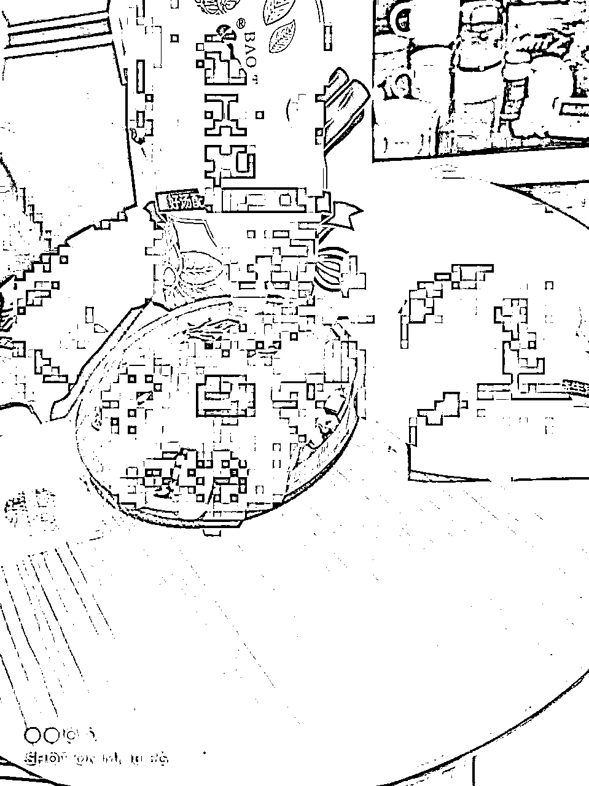

开播以后直接拿录好视频的语音对着播。时不时展示一下产品。是的，这是录播！我想挑战一下视频号的软肋！全程最高只有33人在线，不算多，我看到有人去点购买，想着应该出个两三单也不错。

由于录了只有18分钟，我不敢再播下去了，不然就被判录播了，勉强撑到了19分57秒，为什么这么准确呢，因为我想拿首播20分钟流量券啊，结果手滑提前结束了！

## 直播真的是流量放大器

下面是当天直播前和直播后对比。

单场直播20分钟，多了300人关注，出了快20单，相当于一分钟一单，这场直播的佣金大概是700块

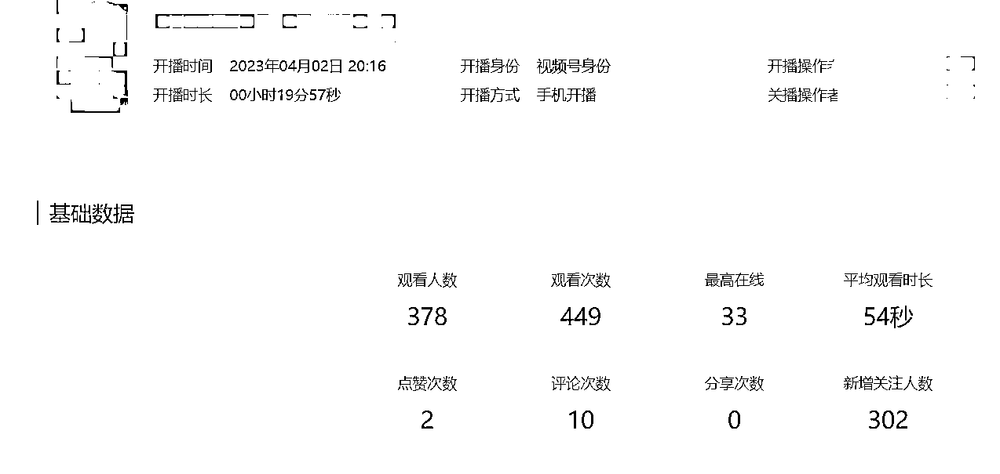

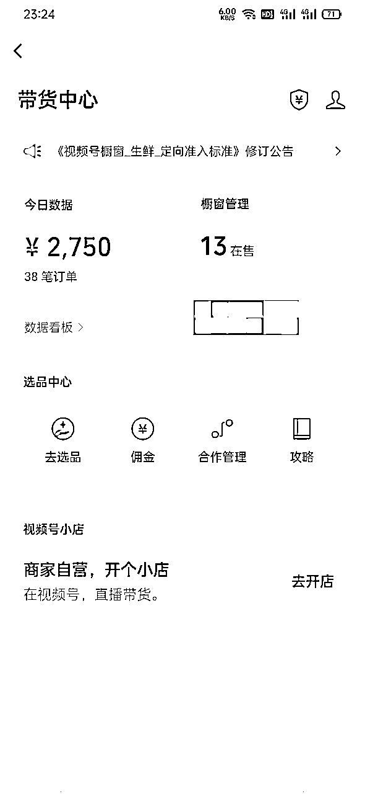

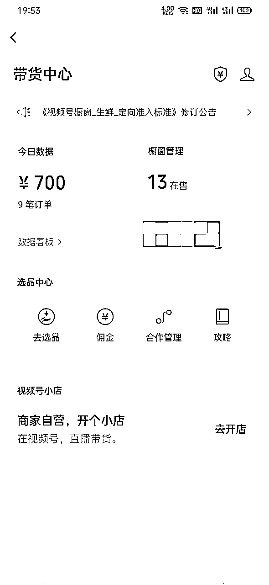

直播前：这个东西我才不想做呢。

直播后：真香，太香了。

40+%的佣金了，20分钟赚了我两天工资，而且贼轻松，属实给我这村里人香透了。

## 踩坑经验

*   老老实实学直播

直播过程中遇到好几个人问产品相关的问题，由于是录播，我没办法出声，只能坐视不管，后面不能再讨巧了，一定要自己开始学。

不露脸没关系，你可以产品出镜。不会话术没关系，你可以戴着耳机跟着对标账号话术口播，或者是视频上传到飞书转成字幕打印出来一字一句对着说

*   不要同一个产品放不同商家

这个产品有几个商家都有卖，只是价格和用量有点不一样。然后我选了几个不同商家，想着买家可以各取所需自己选购，事实证明大错特错。

直播本来就是快速成交的过程，没人会慢慢去看，去选，尤其是最后逼单的时候，你只需要告诉她拍哪个链接就行了，主打的就是快速成交。

# 六、【我的感悟】

## 多账号批量测试

多号怼量，尤其是做养生号经常会被封。所有如果想要快速见到效果，多账号是占据一定的优势，不确定哪一个能起来只能是通过不断测试进行实验！这里是真的别妄想别人会告诉你这个产品会不会爆，如果我知道这个产品会爆，我就自己做了。

## 一定要抄对标账号

不要“自嗨”，不要闭门造车，一定要找对标账号。新手一开始不要想着改别人视频，先抄后超。哪怕你的目标是原创，进行1:1像素级别模仿也可以，人家能爆肯定是有理由的。

我爆的这两个视频，说实在的，真的是平平无奇，在我看来又low又没啥爆点，但是奇怪的是，它就是能跑100万的播放量，就是能够一直出单，所以还是相信数据吧，单凭直觉是没有用的！

## 当出现爆款的时候，专注这个爆款

一个视频可以发多几遍，对粉丝没有影响，就怼这个爆款视频，我见过最夸张的是连续三个月每天只发单个场景，几乎一模一样的视频。

有的人会胆小每次都发一样的视频，粉丝会不会看腻了，没有人会去把你主页的视频全部看一遍，你发10遍都不一定会有同一个人都看过，所以一个视频可以不断的改不断地发，只要你的粉丝流量足够精准，这是单品打爆的逻辑。

## 运气也是实力的一部分

我做的号运气都比较好，四个号开通当天或次日都有出单，但是运气也是实力的一部分。为什么别人视频一发就能爆？你只看到了别人运气好的部分，没看到别人做了其他号都死掉了。

我一天发10条视频，只爆了那么1条，甚至一条都没有爆，你就说我这个号运气好。我改了视频的中间，你却只看到了开头和你的一样。

运气是需要号来堆的，如果你做了一个号不成功，那么你做2个，3个，总会有成功的。

当然这里不是鼓吹大力出奇迹，可以尝试先玩废一个号，把所有的规则和玩法都摸清楚再去批量操作。

## 不要患得患失，不要对号产生感情

不要被扣分就觉得心态炸了，分数就是拿来扣的啊，如果你做养生号没被扣分说明还是没挑战到官方的软肋啊（大佬除外）

我的号就时不时就被举报，被官方判定违规，甚至禁言扣分。不能玻璃心，有几次真的违规麻了，视频号真的比抖音严格好多啊。

心态不好的时候又去翻手册，又去看视频，不要忘记做视频的初心是赚钱！账户只是我们的工具或者消耗品，打不了重新注销，或者申请多几个，成本也不高。

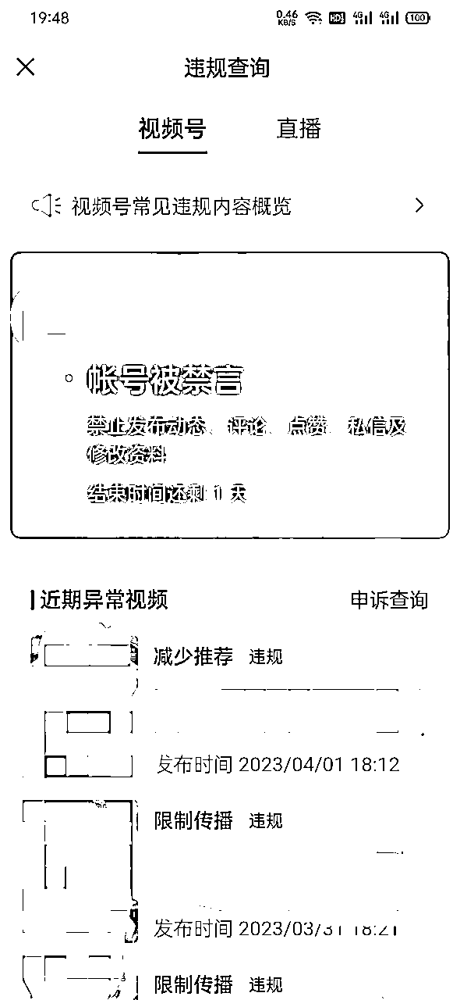

## 新手尽量找链路短，变现快项目

比如小红书好做吗，当然好做啊，这么多人赚钱是吧。好那你也做，新手一上来，发了一篇低粉爆文。

别人对商品感兴趣回复你，私信你，然后再轮到你回他，让他加微信，他看到以后再去加你微信，你再当客服去引导成交。整个链路过程非常长，这中间还夹杂着客户对你信任度不高，引流被小红书官方封号等风险。那你说我可以小红书开店啊，可以啊，但是你忘记你是小白了吗？（手动狗头）

不是不能做，而是我个人认为相对于视频号，抖音等直接引导橱窗下单，小红书这个链路实在是太长了，新手本来就是一个急需变现反馈的群体，这个时候如果但凡有一些挫折，就有可能立马放弃。所以我会推荐先从链路短的项目开始。（个人观点，求小红书大佬轻喷）

## 抬头望天，低头赶路

相信很多生财人都听过这句话，多去看看外面的世界挺好的。但是大多数事情，与你无关……

别人过的再好，赚的再多，那也是别人的事情，跟你一毛钱关系都没有。人家赚10000与你无关，你赚100,1000，那是踏踏实实，真真切切进入你口袋的。

郭晓文：大多数人看到新的项目，看到别人新的晒单，看到新的玩法，都会争先恐后的往前挤……

但，知道，离做出成果，还有很远的距离。

你经历的瓶颈期越痛苦，新项目、新信息的诱惑，就越大。你保持专注的难度，也就越大。

要主动屏蔽任何其他项目的信息，不看别人的晒单，不了解别人的玩法，要把所有精力，集中在把当前这个项目的这个玩法，学清楚、做清楚，做出成果。

# 一路走来，真的每一步都没有白走！

我春节买了直播架，买了二手手机，从张柯那学了视频剪辑，这些看似没有用的东西全在后面派上了用场，假如你全部都要等流量爆了以后才来准备，你确定有能力有机会去承接这波流量吗？

那条爆款视频直播以后又涨了二十万播放量，最终停留在百万播放，而我却只直播了20分钟，眼睁睁看着流量溜走，等我第二天再去尝试直播的时候，效果已经大不如前。

所以你这次学了短视频，你学会了剪辑，学会了抖音视频带货，学会了直播，虽然你可能这次没赚到多少钱，但是万一之后能用上呢？

你经历的所有的挫折和失败，甚至那些看似毫无意义消磨时间的事情，都将成为你最重要的、最宝贵的财富。

这是雷军在2022年度演讲的总结语，与君共勉。

# 出来白嫖，迟早要还的

发现生财以后，太后悔了，后悔为什么没有早点知道。生财17年成立，但我为什么这6年来一直都不知道这个社群！真的打开了我的认知大门，我不停翻看以前的精华帖，拍案叫绝，原来赚钱还可以这么赚，原来对事物的理解还能从这样的维度来思考等等。

白嫖了生财这么多内容，真实地感受到了这是一个利他而又真诚的圈子，恰逢生财纳新，同时也是近几年新低价格，此时不加，更待何时！说来惭愧，这是我第一次知识付费，也是第一次交这么多钱去进一个星球。

这一次，我给自己立下两个目标：

*   何以生财，唯有实战：2023积极参加航海。是的，我进生财的一大目的就是奔着航海来的。

*   古人云：众行者远：一个人可以走很快，一群人可以走很远。拒绝一个人自己瞎摸索，今年积极主动寻找更多同频/同城的人/组织交流。

* * *

以上，全文完……

部分感悟来源于圈友精华文章，如有冒犯，请联系我删除。这里要特别特别感谢郭晓文老师，尽管我一次都没有跟他聊过天，但是他的视频和文章给了我很多启发和感悟，真的特别感谢。

另外还要感谢能坚持看到这里的你，毕竟你的点赞是对新人的最大鼓励！

最后，希望关注养生号或者关注短视频带货的圈友多交流多链接，2023年，一起生财有术，谈钱不伤感情！

# 后记

这两天整理资料的时候发现我17年大学时候就收藏了caoz的这篇生财文章，感慨万千。一晃6年过去了，只能说自己认知不足。但是没关系，当下开始永远都是最好的时候。

https://mp.weixin.qq.com/s/Byf5_cqRNOyMff2FfW6Byw

我是Ray，base广州，希望能在这个大神云起的时代，和你见证一个人平凡人的努力……