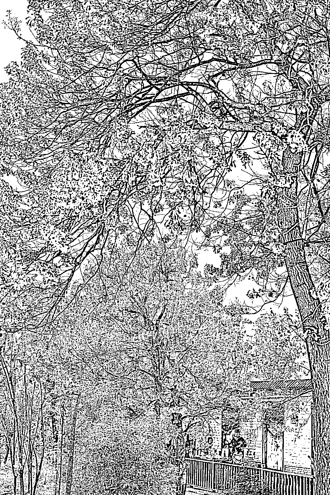
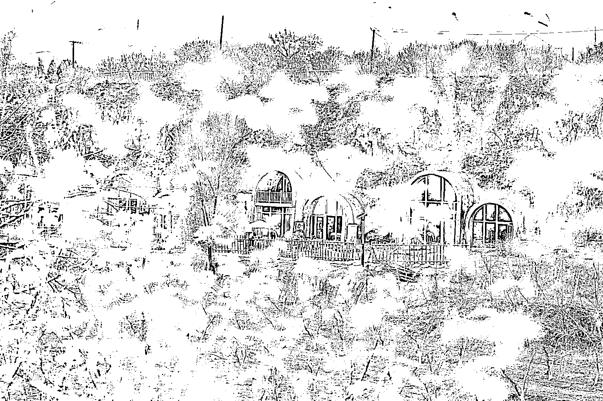
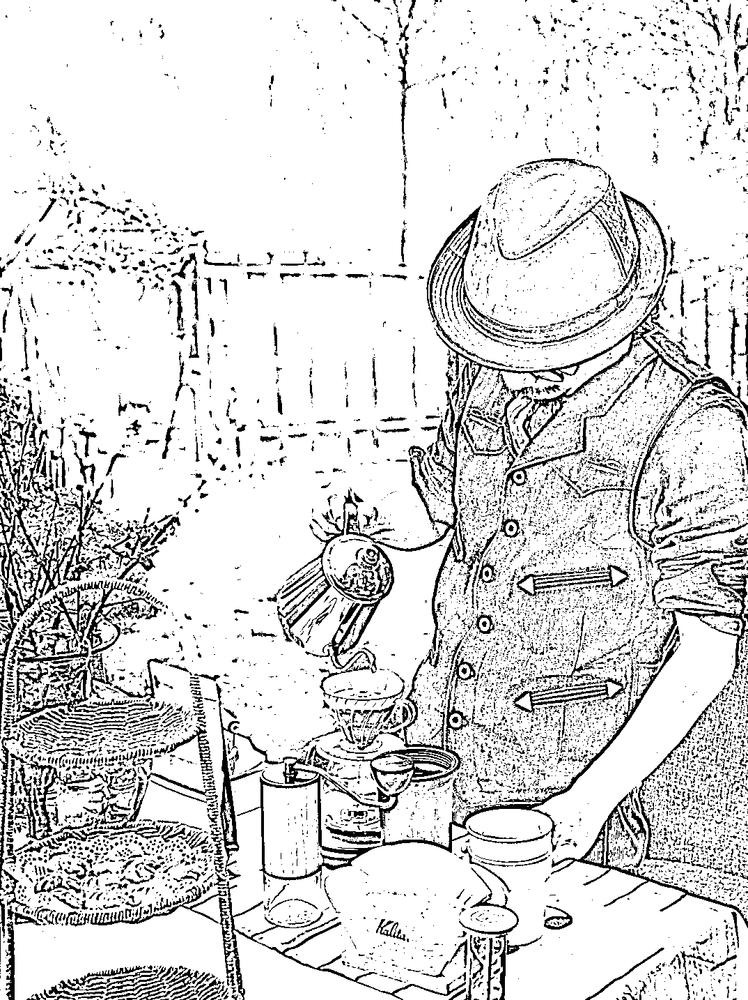

# 《无论线上还是线下生意，成功都要讲个天时地利人和》

> 原文：[`www.yuque.com/for_lazy/thfiu8/vv6gfcsgua8bmk50`](https://www.yuque.com/for_lazy/thfiu8/vv6gfcsgua8bmk50)

<ne-h2 id="489b68ce" data-lake-id="489b68ce"><ne-heading-ext><ne-heading-anchor></ne-heading-anchor><ne-heading-fold></ne-heading-fold></ne-heading-ext><ne-heading-content><ne-text id="u40cac0b0">(64 赞)《无论线上还是线下生意，成功都要讲个天时地利人和》</ne-text></ne-heading-content></ne-h2> <ne-p id="u24ea9e82" data-lake-id="u24ea9e82"><ne-text id="u7e24afbf">作者： 阿黛</ne-text></ne-p> <ne-p id="u9e2f7f74" data-lake-id="u9e2f7f74"><ne-text id="u62a9c71c">日期：2023-04-12</ne-text></ne-p> <ne-p id="u2574319d" data-lake-id="u2574319d"><ne-text id="u4208b528">线下实体</ne-text></ne-p> <ne-p id="u3420c5c5" data-lake-id="u3420c5c5"><ne-text id="u17c10ee3">大家都在分享成功经验，那么由我来聊聊失败。</ne-text> <ne-text id="u79aee979">妈呀感觉这个我可以写一个系列怎么回事[尴尬][流泪]</ne-text> <ne-text id="u4e676dcf">我是不是生财的泥石流呀，</ne-text> <ne-text id="u21be7531">貌似绝大多数人都做的线上，</ne-text> <ne-text id="u9fc817cd">我们这样的线下寥寥无几。</ne-text> <ne-text id="u61eb7bcc">严格来讲，我这个还应该算是线上延伸出来的线下。</ne-text></ne-p> <ne-p id="u01b6e795" data-lake-id="u01b6e795"><ne-text id="u25a57510">失败的这个项目是今年春天我发起的荒野餐桌，</ne-text> <ne-text id="uf994bd10">疫情被困三年，大家空前喜欢“野”，</ne-text> <ne-text id="u637c0eea">想着结合我们土家族腊排骨腊蹄子，</ne-text> <ne-text id="ud75805e0">和一些农场主合作，做快闪店。</ne-text> <ne-text id="u6d3ac676">当时我还付费找人用 chatGPT 给我画了海报，</ne-text> <ne-text id="u836e040a">意象美的很。</ne-text></ne-p> <ne-p id="u8bcf413c" data-lake-id="u8bcf413c"><ne-text id="u09309b06">花开营业，花谢结束，</ne-text> <ne-text id="u2f8e4b93">桃花开的时候，咱就在桃花树下吃腊排骨火锅，</ne-text> <ne-text id="ud9e71527">油菜花开的时候就在油菜花地里煮，</ne-text> <ne-text id="uffd0e6ab">加上咖啡甜点下午茶什么的，按位收费。</ne-text></ne-p> <ne-p id="u63e50607" data-lake-id="u63e50607"><ne-text id="u8a4c4058">细节敲定完成打样开始宣传接受预订，</ne-text> <ne-text id="ucf4f8951">个人团体订单陆陆续续进来，</ne-text> <ne-text id="uffc523d5">看起来是个小生意，</ne-text> <ne-text id="u3b7db005">我其实有点小野心：</ne-text> <ne-text id="u68ae7085">除了产品本身需要创造营销记忆点外，</ne-text> <ne-text id="u19826425">我还想形成个小小品牌，</ne-text> <ne-text id="uebeb8b78">承接我其他客户的高端定制，</ne-text> <ne-text id="uf5ab1128">好看有趣顺手再赚点钱。</ne-text></ne-p> <ne-p id="ucccba538" data-lake-id="ucccba538"><ne-text id="ufb488e4b">然而，我很快就知道了什么叫做：</ne-text> <ne-text id="u53ad1859">人算不如天算。</ne-text> <ne-text id="u2694446c">桃花开的时候三月飞雪，气温陡降；</ne-text> <ne-text id="u72a343bb">二月兰泡桐开时黄沙漫天，一吃一嘴土。</ne-text> <ne-text id="uf386cf0b">在北方，完全不配拥有春天。</ne-text></ne-p> <ne-p id="ud014a14b" data-lake-id="ud014a14b"><ne-text id="u970f4958">本来荷花开的时候、桃子成熟的时候</ne-text> <ne-text id="u07ad335e">还可以继续，</ne-text> <ne-text id="u8bb035ed">但也不能让客户一直保留预订啊，</ne-text> <ne-text id="u34723521">所以到手的钱钱全部如数退了回去。</ne-text></ne-p> <ne-p id="u9c6ebede" data-lake-id="u9c6ebede"><ne-text id="u87df1e34">好就好在前期并没什么了不起的投入，</ne-text> <ne-text id="u41e248fb">亏的只有一些时间精力没有什么真金白银，</ne-text> <ne-text id="u5fdb55fe">就当自己玩乐了。确实还蛮高兴的。</ne-text></ne-p> <ne-p id="ued301643" data-lake-id="ued301643"><ne-text id="u0ede394e">可能无论线上还是线下生意，</ne-text> <ne-text id="u5cc3b95d">成功都要讲个天时地利人和，</ne-text> <ne-text id="ufa15a19e">但明显线上比线下抗打多了，</ne-text> <ne-text id="ud36f0c91">所以接下来要向各位多多学习。</ne-text><ne-card data-card-name="image" data-card-type="inline" id="cG6f1" data-event-boundary="card"></ne-card></ne-p> <ne-p id="u8dabcb7b" data-lake-id="u8dabcb7b"><ne-card data-card-name="image" data-card-type="inline" id="U212X" data-event-boundary="card"></ne-card></ne-p> <ne-p id="u6ceb4b03" data-lake-id="u6ceb4b03"><ne-card data-card-name="image" data-card-type="inline" id="Z0Yph" data-event-boundary="card"></ne-card></ne-p> <ne-p id="u00b70b74" data-lake-id="u00b70b74"><ne-card data-card-name="image" data-card-type="inline" id="Yxp9y" data-event-boundary="card"></ne-card></ne-p> <ne-p id="ue0d24e7f" data-lake-id="ue0d24e7f"><ne-card data-card-name="image" data-card-type="inline" id="Mi7du" data-event-boundary="card"></ne-card></ne-p> <ne-p id="u12d06c40" data-lake-id="u12d06c40"><ne-card data-card-name="image" data-card-type="inline" id="GpFTl" data-event-boundary="card"></ne-card></ne-p> <ne-hole id="u86dcc735" data-lake-id="u86dcc735"><ne-card data-card-name="hr" data-card-type="block" id="wnScC" data-event-boundary="card"><ne-p id="ue17a8335" data-lake-id="ue17a8335"><ne-text id="u327fdbeb">评论区：</ne-text></ne-p> <ne-p id="u1cdefb20" data-lake-id="u1cdefb20"><ne-text id="ub4bfb838">感遇 : 亏了多少钱？</ne-text> <ne-text id="u5b5a9b74">阿黛 : 不是说了嚒，没亏钱，只是一些⌚️和精力</ne-text> <ne-text id="ua8906c22">X. : 哈哈，阿黛姐，想继续看你的人生亏欠指南[偷笑]</ne-text> <ne-text id="ueea54854">阿黛 : 盼我点好吧哈[呲牙]</ne-text> <ne-text id="u3020bb27">亦仁 : 太好玩了[呲牙]</ne-text> <ne-text id="uf4d60854">阿黛 : 是不是泥石流本流[尴尬]</ne-text> <ne-text id="uc5e95492">段冬 : 北方不配拥有春天</ne-text> <ne-text id="u36387b5b">阿黛 : 只有黄土餐桌</ne-text></ne-p></ne-card></ne-hole>