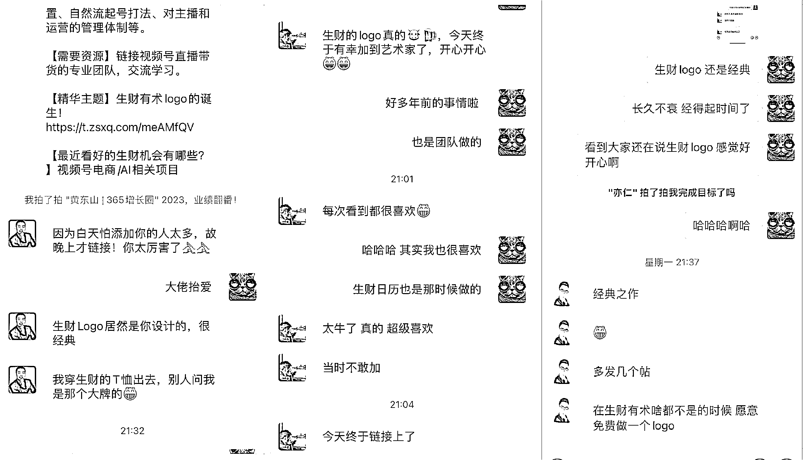

# 《通过沟通一些小故事去感知这个圈子的意义》

> 原文：[`www.yuque.com/for_lazy/thfiu8/nrfgh3m6gick526z`](https://www.yuque.com/for_lazy/thfiu8/nrfgh3m6gick526z)

<ne-h2 id="0c87c773" data-lake-id="0c87c773"><ne-heading-ext><ne-heading-anchor></ne-heading-anchor><ne-heading-fold></ne-heading-fold></ne-heading-ext><ne-heading-content><ne-text id="u0c0f9bc6">(88 赞)《通过沟通一些小故事去感知这个圈子的意义》</ne-text></ne-heading-content></ne-h2> <ne-p id="u2b2e2e75" data-lake-id="u2b2e2e75"><ne-text id="u06a18bc2">作者： 大树🌳🌳</ne-text></ne-p> <ne-p id="ufd58ac9b" data-lake-id="ufd58ac9b"><ne-text id="udb0a4b4e">日期：2023-04-13</ne-text></ne-p> <ne-p id="u89a05d56" data-lake-id="u89a05d56"><ne-text id="ud86aa5f1" style="color: rgb(166, 166, 166);">通过沟通一些小故事去感知这个圈子的意义。</ne-text></ne-p> <ne-p id="u387a8257" data-lake-id="u387a8257"><ne-text id="u99f0e744" style="color: rgb(166, 166, 166);">不允许发一些“旁门左道”的赚钱方法（三观要正）有人通过这个社群学习到了一些技能，现在已经在月收入过万。（这是对术的感知）有人在这个圈子里找到了合伙人（资源链接）有人通过一些案例少踩了坑（信息及时）分享嘉宾的故事（真诚的分享）等等。都是通过沟通聊天所获得的信息。</ne-text></ne-p> <ne-p id="ua34136d1" data-lake-id="ua34136d1"><ne-text id="u87efc085" style="color: rgb(166, 166, 166);">包括生财有术的背景图为什么是一个卡通的图片，因为亦仁不希望这个圈子充满“铜臭味”这些都是关键信息，这些故事说出来，也就是想要传达出去的信息，是做标志的推理依据，是标志要承载的信息。设计即沟通，标志不仅仅是一个符号，更是一种提炼和精简的过程，把最核心的东西通过符号视觉化，并且传达出去。</ne-text></ne-p> <ne-p id="u68d0eed6" data-lake-id="u68d0eed6"><ne-text id="u0b33625d" style="color: rgb(166, 166, 166);">大致总结了亦仁对生财有术这个社群的理解：</ne-text></ne-p> <ne-p id="u153d6a94" data-lake-id="u153d6a94"><ne-text id="u98d3b998" style="color: rgb(166, 166, 166);">1-生财有术的“术”是正道，合法合理并且是三观要正。</ne-text></ne-p> <ne-p id="u2fe556dc" data-lake-id="u2fe556dc"><ne-text id="u91886e59" style="color: rgb(166, 166, 166);">2-方法多、覆盖面广、信息新鲜及时、资源深度链接的一个互联网圈子。</ne-text></ne-p> <ne-p id="u9a69358f" data-lake-id="u9a69358f"><ne-text id="u5076976a" style="color: rgb(166, 166, 166);">3-真诚的分享赚钱思维，是一个谈钱不伤感情的社群。</ne-text></ne-p> <ne-p id="udef2175a" data-lake-id="udef2175a"><ne-text id="u37672fdb" style="color: rgb(166, 166, 166);">4-同时也希望通过这个圈子可以触达更多的人，让更多的人都具有赚钱的思维，让大家生活过的更好一点。</ne-text></ne-p> <ne-p id="uf77c4652" data-lake-id="uf77c4652"><ne-text id="u631f81e2" style="color: rgb(166, 166, 166);">（这个社群是和赚钱有关，但是亦仁老板不希望这个圈子充满“铜臭味”更希望是一个有温度有情怀的群体，真实的分享、真诚的链接、真心的交流。）</ne-text></ne-p> <ne-p id="u7ab7c2fd" data-lake-id="u7ab7c2fd"><ne-text id="ue27cc2cd">这是在 19 年帮生财做 logo 的时候，和亦仁沟通的记录，具体在 logo 那篇文章里有写。</ne-text></ne-p> <ne-p id="u6f9b432e" data-lake-id="u6f9b432e"><ne-text id="u9ecd8f31">生财 logo 的故事链接 https://wx.zsxq.com/dweb2/index/topic_detail/421444218218418</ne-text></ne-p> <ne-h2 id="c98362e3" data-lake-id="c98362e3"><ne-heading-ext><ne-heading-anchor></ne-heading-anchor><ne-heading-fold></ne-heading-fold></ne-heading-ext><ne-heading-content><ne-text id="ua151a6ac" ne-bold="true">为什么要写这段文字？</ne-text></ne-heading-content></ne-h2> <ne-p id="u1ce85d6e" data-lake-id="u1ce85d6e"><ne-text id="uda6d8cd5">这次生财航海家发介绍中，有一些圈友链接，提起了生财 logo。都表示很喜欢，很经典。我也很开心，我就对亦仁说，logo 经得起时间了。聊到已经好久没有在社群里写过东西了，于是出现了这篇文字。很开心可以以这样的方式认识大家。</ne-text></ne-p> <ne-p id="u96c06caf" data-lake-id="u96c06caf"><ne-card data-card-name="image" data-card-type="inline" id="ybVFM" data-event-boundary="card">  <ne-p id="uc4e6ebe9" data-lake-id="uc4e6ebe9"><ne-text id="u5158426a" ne-bold="true">介绍一下自己：</ne-text></ne-p> <ne-p id="uaf9c1075" data-lake-id="uaf9c1075"><ne-text id="u315c2ef1">大家好，我是大树🌳🌳，18 年加入的老圈友。19 年和团队一起做了生财 logo 和生财日历。现在杭州和义乌两地游荡。曾经是一枚设计师，现在是一个抖音里卖货的。圈里的干货太多，我就随便聊一些轻松的，让大家休息一下脑子。从另一个视角去看一下生财有术。</ne-text></ne-p> <ne-p id="ua5644d58" data-lake-id="ua5644d58"><ne-text id="u6195e9da">19 年因为要做生财日历，才有的生财 logo 等现在大家看到的一系列的生财调性。每次线下见面会或者线上活动，看到生财绿和一系列物料延伸都是充满亲切，想到当年一个圈友说：“</ne-text><ne-text id="uae29757a" ne-bold="true">我们一起爱护他，陪着他一起长大</ne-text><ne-text id="u01e3eca7">”。果然生财给予他生命让他长得更大更好。大家确实一直在爱着他维护着他。他还是原来的样子，只不过长大了。相信一些老圈友能体会到那种感觉。</ne-text></ne-p> <ne-p id="uf47daaa6" data-lake-id="uf47daaa6"><ne-text id="ub13a97f4">19 年和亦仁沟通他对生财有术的看法和期待：</ne-text><ne-text id="u4799e927" ne-bold="true">做一个真诚的、有温度的、聊赚钱的社群。不要充满铜臭味、三观要正、方法多、覆盖广</ne-text><ne-text id="u12fc4e58">等特点。5 年后看，他都做到了。而且越做越好。一直践行者他自己的价值观和理念。</ne-text></ne-p> <ne-p id="u443b76e0" data-lake-id="u443b76e0"><ne-text id="u8d2169dd">当时 6000 人不到，现在 46000 人，当时提出来的一些价值观，现在已经深入到整个社群，坚持长期主义，一点点的改变、一点点的做到每个生财人心里面。这个是一件很牛逼的事情。陪伴了生财 6 年，也见证了生财的成长。当时说的一些画面都变成了现实。</ne-text></ne-p> <ne-p id="u88c32db7" data-lake-id="u88c32db7"><ne-text id="u79960394">当时的全国线下见面会，城市见面会，各种活动认识的一些圈友现在很多小有成，看着大家一步步发展起来。真心觉得庆幸路上有他们陪伴。当然也有渐行渐远的离开的朋友，彼此祝福。</ne-text></ne-p> <ne-p id="ucdda10fc" data-lake-id="ucdda10fc"><ne-text id="ucc48bf52" ne-bold="true">为什么要免费给生财做一个 logo？</ne-text></ne-p> <ne-p id="u7b8274a8" data-lake-id="u7b8274a8"><ne-text id="uf99c53e3">亦仁说那是我有格局，有前瞻性。首先是亦仁的个人魅力以及他所践行的价值观我很认可，对商业的一些观点对我影响很大，有时候一段谈话能解决我很多商业上的困惑，我认为能够和大佬多交流，本身就是学习，这个交流过程本身就很值钱。我也认为是我赚到了。</ne-text></ne-p> <ne-p id="u02c34b28" data-lake-id="u02c34b28"><ne-text id="u82235272">后来发现，我确实是赚到了，毕竟亦仁的下午茶时间被拍卖了 7 万多。这几年每次去 EFC 都是亦仁请我吃饭，大大小小加起来几十次要有了。是不是赚大了。一直持续到现在，还依然是我创业路上的导师，给我泼冷水、指方向、一起想解决方案，应该都是因为 19 年的那一次合作结下的果。</ne-text></ne-p> <ne-p id="u965c8052" data-lake-id="u965c8052"><ne-text id="ub639e060" ne-bold="true">投资生财之后，我得到了什么？</ne-text></ne-p> <ne-p id="u45cab82d" data-lake-id="u45cab82d"><ne-text id="u80dc019c">帮生财做的一次品牌设计，现在看是一次最值的投资了，因为后面给了很多惊喜。</ne-text></ne-p> <ne-p id="uddf77117" data-lake-id="uddf77117"><ne-text id="u5bfc1c91">比如：</ne-text></ne-p> <ne-p id="u1356e5c0" data-lake-id="u1356e5c0"><ne-text id="u109141e3" style="color: rgb(38, 38, 38);">1-亦仁私人饭局蹭饭，应该是最多的其中之一</ne-text></ne-p> <ne-p id="u45bd5c38" data-lake-id="u45bd5c38"><ne-text id="uc82a8bfa" style="color: rgb(38, 38, 38);">2-亦仁带着夫人专门去义乌上门指导两天</ne-text></ne-p> <ne-p id="uacbaf93a" data-lake-id="uacbaf93a"><ne-text id="uca2460d3" style="color: rgb(38, 38, 38);">3-参加曹大分享会并分享</ne-text></ne-p> <ne-p id="u66adb71f" data-lake-id="u66adb71f"><ne-text id="ud4ac5799" style="color: rgb(38, 38, 38);">4-参加小马宋老师私人饭局</ne-text></ne-p> <ne-p id="uc9a5c6f3" data-lake-id="uc9a5c6f3"><ne-text id="u8b525574" style="color: rgb(38, 38, 38);">5-生财多次推荐、亦仁给我做信任背书、促成了五十万以上的成交</ne-text></ne-p> <ne-p id="u7f537d7a" data-lake-id="u7f537d7a"><ne-text id="u1b6f960b" style="color: rgb(38, 38, 38);">6-认识了众多优秀的创业者，生财好友 1000 人占微信好友比例 25%，从业务走进生活</ne-text></ne-p> <ne-p id="ue73804a0" data-lake-id="ue73804a0"><ne-text id="ud2a7a5b8" style="color: rgb(38, 38, 38);">7-找到了第二创业的项目并且圈友给予了很大的支持、拥有了一帮高度信任的兄弟</ne-text></ne-p> <ne-p id="u14428274" data-lake-id="u14428274"><ne-text id="u121f5ef7">在生财里合作了不低于十个合作伙伴，都是很快达成了合作，有几个第一次见面就签约打钱。在我第二次创业的路上，从选项目到和圈友合作，圈友都给予了很大的支持和帮助，因为在一个圈子有信任度，还有亦仁的背书，让我们提高了效率。因为同频和共识，人对了，所以事就成了。</ne-text></ne-p> <ne-p id="u830f6c1f" data-lake-id="u830f6c1f"><ne-text id="uba61ca66">真诚是最有力的武器，抱着利他的视角去做事情，往往会带来惊喜。有时候不求回报的付出，带来的是想象不到的回报。</ne-text></ne-p> <ne-p id="udccffbf4" data-lake-id="udccffbf4"><ne-text id="u8b7c3fb2" ne-bold="true">从长期来看，生财对我的影响</ne-text></ne-p> <ne-p id="u9dd63835" data-lake-id="u9dd63835"><ne-text id="u46a6f476">因为一些原因，21 年我从杭州来到义乌，也从设计行业转到电商行业。第二职业也是在生财项目库找出来的项目，每天耳濡目染，对一些业务方向有了判断和感知，也很幸运找到了当时做抖音培训的高欣，不仅没有收我 29800，还跟着他蹭了几天饭。也是因为生财的背书和信任，很快成为了好兄弟，尽管他有点内向。</ne-text></ne-p> <ne-p id="ub98782ae" data-lake-id="ub98782ae"><ne-text id="uf28b6adb">也跟着 SKY 老思做了一段时间 TIKTOK，当然也拿出了一些成绩，一个月做到了全国第五的成绩。</ne-text></ne-p> <ne-p id="udffec1bc" data-lake-id="udffec1bc"><ne-text id="ub6fb578f">亦仁去年初，带着夫人来义乌，2 天一夜指导工作。帮我做战略规划和梳理思路，甚至教我如何带团队，应该如何思考问题，总之收获很大，也让我在这条陌生的路上有了信心。</ne-text></ne-p> <ne-p id="u4764d264" data-lake-id="u4764d264"><ne-text id="ud45879c8">商家岛时明、高欣、帅张、黑小喵、直浪、玛丽阿姨、SKY 老思，他们不止一次的来义乌看我，有时候也会带着团队来帮忙，用他们擅长的技能帮我的团队成长，他们都是我创业路上的智囊团，帮我梳理思路、解决盲区、对接资源等。可谓是创业路上最亲密的伙伴，也践行了生财的互帮互助、真诚利他，创业路上不再孤单。</ne-text></ne-p> <ne-p id="ue1c521f5" data-lake-id="ue1c521f5"><ne-text id="ucfaaced6">还有 HEXIN、茄子、靠谱等等，太多好朋友支持和帮助，一切都是源于生财这个圈子，我们只是一个很小的生财圈友缩影，我相信还有很多很多这样的小圈子，大家互相支持、相互鼓励帮助、真诚对待彼此。</ne-text></ne-p> <ne-p id="u5163347a" data-lake-id="u5163347a"><ne-text id="u14c9657f">看到朋友圈里，一些圈友在一个城市办的活动，很感慨，大家不仅仅是工作交集，也走进了生活。我现在的圈子大部分都是生财里的人，相处这四五年，友谊日益增长，创业的路上不孤单，有了后援团的感觉很好，做事情、稳！</ne-text></ne-p> <ne-p id="uae479138" data-lake-id="uae479138"><ne-text id="u10c75b71" ne-bold="true">现在我在做什么？</ne-text></ne-p> <ne-p id="uf89e2c76" data-lake-id="uf89e2c76"><ne-text id="u9f738700">现在义乌的直播团队，深耕丝巾和围巾类目，主要针对人群 50+，主要是抖音平台销售，同步视频号。单直播间 GMV300 万，日销量近万单。也在布局天猫渠道和产品的品牌化，圈友私域专家黑小喵帮我搭建私域板块，也初见成效。遇到的问题也是大部分初创公司都会遇到的问题，缺少优秀的适合的主播。还有我们在做的香云纱、丝巾需要丰富品类，如果有香云纱的服装或者配饰也可以合作一下，在这感谢了。</ne-text></ne-p> <ne-p id="ub7744a4d" data-lake-id="ub7744a4d"><ne-text id="u84941d74">这两年一直摸索抖音直播带货板块，对跨行创业以及直播有关的事都有一些心得，一步步走过来，也经历了不少，做直播有很多诱惑，我记得亦仁给我说过，在中国把一个事情做好，一年最低有一千万的利润，团队还小，先把一件事做好就很不容易了。现在我一直深耕一个品类，争取早日做出点成绩。</ne-text></ne-p> <ne-p id="u6935a1c4" data-lake-id="u6935a1c4"><ne-text id="u3d46dba7">最近在思考做的事情，做赚钱的事情还是做值钱的事情？ 看自己想要什么，也分阶段。每个阶段的动作和节奏都会根据自己的团队能力和实际情况进行调整，是一个综合作战的能力。这一年应该还是考虑怎么通过深耕一个类目赚钱。</ne-text></ne-p> <ne-p id="ua43f4939" data-lake-id="ua43f4939"><ne-text id="uddf75eb2">这两年踩坑和拿结果都有，走的路子很接地气，如果我的一些经验对有些圈友能提供帮助，也乐意交个朋友，交流一下。对义乌的供应链资源也有了一些积累，如果有需要货源的我也可以力所能及的对接一下。</ne-text></ne-p> <ne-p id="u990261ae" data-lake-id="u990261ae"><ne-text id="ub3c9e42c">具体干货也没什么好分享的，圈里很多厉害的实战高手，找到他们，虚心学习。</ne-text><ne-text id="u128b2e44" ne-bold="true">多看、多听、多干</ne-text><ne-text id="u8b62c920">，不要浮躁和焦虑，常在生财里浸泡，总有很大收获。我是一个挺拙的人，进步有点慢。但我待的时间长啊，看得多了、见的多了，也会有惊喜。</ne-text></ne-p> <ne-p id="ufae1b0c6" data-lake-id="ufae1b0c6"><ne-text id="u537ca7d4">记得有一次找亦仁吃饭，我问他为什么会对一个项目有这么多思路和判断力？他说：“</ne-text><ne-text id="u7add8498" ne-bold="true">看的多了、就有感觉了。很多时候都是本能反应了。”</ne-text></ne-p> <ne-p id="u6bd63f11" data-lake-id="u6bd63f11"><ne-text id="u5256b692">对呀，多看看，会有惊喜！那么多精华和风向标、项目库足够兄弟们看了，如果你像我一样拙，就沉下心来慢慢的浸泡吧。</ne-text></ne-p> <ne-hole id="uf93d4ad7" data-lake-id="uf93d4ad7"><ne-card data-card-name="hr" data-card-type="block" id="WqQnU" data-event-boundary="card"><ne-p id="u45923ba2" data-lake-id="u45923ba2"><ne-text id="uc707a137">评论区：</ne-text></ne-p> <ne-p id="u9b1d7a3a" data-lake-id="u9b1d7a3a"><ne-text id="u76310c7b">白一喵 : 真好，看看旧故事，回想一下初心。</ne-text> <ne-text id="u76c306c5">亦仁 : 生财的 logo 是圈友做的，slogan 是圈友想的，现在看还都是经典。</ne-text> <ne-text id="ua1be03f8">大树🌳🌳 : 转眼 5 年过去了，现在想想，都是美好的回忆和感动。生财人是有温度的。生财这个圈子真的不止项目和业务，生财里的人才是最大的资源。</ne-text> <ne-text id="u3692c556">宋词 : 真好呀，21 年知道这个平台，22 年加入，23 年加入了航海家。在这里有人出主意，有人帮链接，有人给指点，有人共享信息，我太爱生财了。</ne-text> <ne-text id="uf7dae25f">Sky 老思 : 不忘初心，方得始终</ne-text> <ne-text id="u7104e048">中年阿姨 : 你竟然没有关注我。。。艹</ne-text> <ne-text id="ucd59d76e">大赚顺 : 给我大佬点个赞</ne-text> <ne-text id="u846fe896">直浪 : 树哥</ne-text></ne-p></ne-card></ne-hole></ne-card></ne-p>