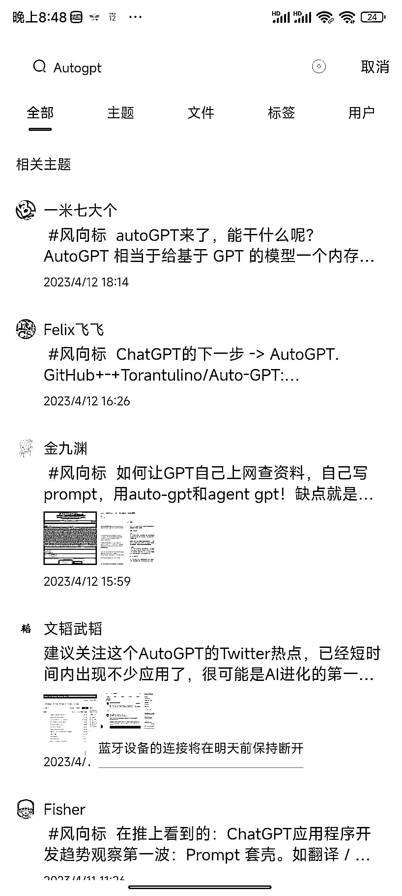

# 《从刷屏的风向标，我看到了信息共创》

> 原文：[`www.yuque.com/for_lazy/thfiu8/lkgp5y7gssz05qls`](https://www.yuque.com/for_lazy/thfiu8/lkgp5y7gssz05qls)

## (32 赞)《从刷屏的风向标，我看到了信息共创》 

作者： 蓝弈 

日期：2023-04-12 

经常刷风向标的小伙伴一定会遇到这种情况，每当 gpt、抖音、微信官方有什么动态新闻的时候，风向标都会一如既往的刷屏！圈友苦风向标刷屏已经很久了，但是如何解决呢？全靠大家的努力！ 

今天我将从下面几个方面聊一聊我的看法： 

一、刷屏的风向标 

二、风向标增质 

三、如何对风向标信息进行共创？ 

四、风向标信息共创后的官方优化 

下面进入正题！！！ 

## 刷屏的风向标 

比如说：AutoGPT 风向标！ 

 

比如说：视频号创作者分成计划！ 

 

比如说：抖音和腾讯视频合作 

 

造成刷屏的有三个现象： 

1、看到消息不管三七二十一先发出去再说，我先发就有机会中标；（过去的我） 

2、别人先发我后发但是后发的中标了，于是就不管时间先后发完再说，撞大运万一中标了呢？（现在的圈友状态） 

3、别人发了，我换一个角度去发，试试能不能中标；（现在的我） 

不论是什么心态，这其中发帖的目的是为了什么？中标！中标！中标！ 

为了中标，大家开始了内卷！卷时间！卷数量！卷篇幅！卷角度！ 

但是有多少人在卷风向标的质量？卷其中的机会！卷落地的难易度！卷变现空间！ 

（题外话：精华帖也是如此，发帖就是为了龙珠，没有龙珠就绝不发帖） 

## 风向标增质 

引用：《增量价值》中的一句话：创造更多的价值不等于创造增量价值！ 

举例： 

一辆车加满油可以跑 300 公里==〉加两趟油 600 公里===》600 公里！ 

这里看似汽车创作的价值增加了，但是油本身的价值并没有改变！如果想要跑的远就要，加更多的油。 

可是如果我们进行创新，更换省油的发动机，那么一桶油就可以跑 500 公里，增加了汽车的增量价值。 

所谓的增量价值，指的是可以改变变量的变量！！！ 

风向标里可以解释为： 

1 条未中标的风向标有 1%的价值； 

1 条中标风向标有 5%的价值； 

发 100 条重复/不完整的风向标，不过是在补充 1%的价值， 

哪怕最后中标了不过是在瓜分 5%的价值，这条中标帖子还仅仅有 1%的信息展现。 

当然我们不能说换一角度去写风向标这个方法不对，不如在一条风向标下尽可能全的进行信息共创，让大家都可以看懂风向标，更加全面的了解风向标。（但是，风向标信息重发一定不对，不要做撞大运的事！） 

大家都知道生财最受欢迎的栏目就是风向标栏目，风向标质量的高低全凭圈友的努力，发布者的信息质量越高，那么风向标栏目价值才会越来越大，否则一个人水风向标，那么风向标的价值就会降低。风向标不是越多越好，而是平台越多、信息越全面、方法越多，那么价值就越多。 

## 如何对风向标信息进行共创？ 

### 1、信息补充； 

描述补充、图片演示、涉及网址； 

### 2、案例补充 

将其中你看到的案例补充到评论区； 

### 3、玩法补充； 

### 4、信息拆解； 

商机、变现空间、异常点、如何操作； 

### 5、信息变化； 

### 6、对信息的看法和评价； 

经过上面信息的共创，一条风向标远远不是一个信息共享，其价值远远不止 1%，而是能看到的 50%，后人在实操落地，其价值可以达到 80%，落地后变现跑通其价值才能达到 100%。 

信息共创可能会引发新的项目库，实战航海，甚至是新的星球栏目！ 

既然有了风向标信息共创，那么同样缺不了官方的数据和奖励！！！ 

## 风向标信息共创后的官方优化 

圈友有了积极的风向标共创，官方也应该对风向标运营策略有所优化！ 

1、数据测 

对于风向标帖子进行周期性数据监控，比如说：1 个月、1 个季度甚至是 1 年的周期监控，对于讨论多、价值大的风向标可以进行周期性汇总文档，在生财周报中进行推送； 

2、共创奖励 

对于帖子中高价值风向标进行精华，提出奖励对帖子信息共创者和整理者进行术值、碎片、龙珠奖励等奖励。 

## 最后期许 

说到这里在浅浅的提一下亦仁大大在第七期对风向标的期望： 

希望大家从真诚、利他的心态去写风向标，进行分享！分享的目的不是中标和龙珠，而是价值传递！！！ 

### 拒绝内卷！拒绝内卷！拒绝内卷！ 

评论区： 

高杰 : 拒绝内卷，合理发标 蓝弈 : 拒绝内卷，合理发标[奋斗] 敏渝 : 同意，这几天大量刷帖的时候看到好几个说风向标一周刷一次，个人感觉大概率是重复信息每天看有点浪费时间，稍微有点失去了风向标本来的用意，还要亦仁老大花大量的时间去筛选，如果刷屏没有那么严重，也许更多的人愿意直接去刷风向标，而不是等待亦仁老大辛苦的筛选了，获取信息可能可以更快速一些吧 书情小跟班 : 我觉得还是靠自觉吧，前面看到有人发了，自己就不发了，避免同质化的内容。 MC : 风向标内卷和风向标群的运营多少有点相关性 蓝弈 : 从自己做起，从认知改变[呲牙][呲牙] 蓝弈 : 那是一定的[偷笑]