# 《加入星球不到 1 个月，受到生财风向标和公众号一篇文章启发变现 6135》

> 原文：[`www.yuque.com/for_lazy/thfiu8/czb5bqi49dmrmmql`](https://www.yuque.com/for_lazy/thfiu8/czb5bqi49dmrmmql)

<ne-h2 id="632b333e" data-lake-id="632b333e"><ne-heading-ext><ne-heading-anchor></ne-heading-anchor><ne-heading-fold></ne-heading-fold></ne-heading-ext><ne-heading-content><ne-text id="u2f508428">(96 赞)《加入星球不到 1 个月，受到生财风向标和公众号一篇文章启发变现 6135》</ne-text></ne-heading-content></ne-h2> <ne-p id="uff635da8" data-lake-id="uff635da8"><ne-text id="u9b2d89d5">作者： 李思维 Pro</ne-text></ne-p> <ne-p id="u81a966dc" data-lake-id="u81a966dc"><ne-text id="u3de320a1">日期：2023-04-12</ne-text></ne-p> <ne-h2 id="4443a1fd" data-lake-id="4443a1fd"><ne-heading-ext><ne-heading-anchor></ne-heading-anchor><ne-heading-fold></ne-heading-fold></ne-heading-ext><ne-heading-content><ne-text id="u663c3a10">1、从生财的 GPT 风向标，看到时代红利</ne-text></ne-heading-content></ne-h2> <ne-p id="u3507434f" data-lake-id="u3507434f"><ne-text id="uecc330c6">最近 ChatGPT 很火，地球人都知道，本来我没怎么关注的，但看到周围人都在研究，讨论得热火朝天，又刷到不少短视频，都是讲 ChatGPT，于是，我就研究了一番，先是加入了一个知识星球，但折腾好几天，都不懂得怎么使用。</ne-text></ne-p> <ne-p id="u873be804" data-lake-id="u873be804"><ne-text id="u62c20470">最后，花钱去请教了几个业内人士，才学会如何登陆，但还是不懂怎么使用。刚好，我想到最近加入的生财有术，我就去搜索相关内容查看，看到风向标，关于 ChatGPT 的内容非常多：ChatGPT 是什么，如何使用、怎么用它来提高工作效率等等，琳琅满目。</ne-text></ne-p> <ne-p id="u2ca46ff7" data-lake-id="u2ca46ff7"><ne-card data-card-name="image" data-card-type="inline" id="LTxQE" data-event-boundary="card">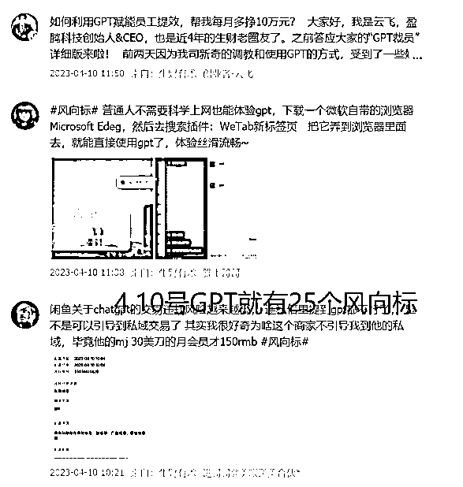</ne-card></ne-p> <ne-p id="u76fa3422" data-lake-id="u76fa3422"><ne-text id="u0324d82d">单单 4 月 10 号，我数了一下，就有 25 个关于 ChatGPT 的风向标。</ne-text></ne-p> <ne-p id="u218a6667" data-lake-id="u218a6667"><ne-text id="u54a1abe5">我通过风向标的学习，亲身去试用了几天，发现 ChatGPT 真的特别好用，问它很多问题，它都能对答如流，有些答案，如果不是它回答，我根本想不到。譬如，我替一个朋友问：如何进行网恋啊？</ne-text></ne-p> <ne-p id="u54d879eb" data-lake-id="u54d879eb"><ne-card data-card-name="image" data-card-type="inline" id="YFVpA" data-event-boundary="card">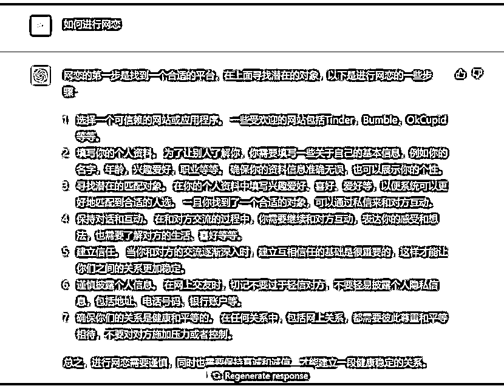</ne-card></ne-p> <ne-p id="u80fc8316" data-lake-id="u80fc8316"><ne-text id="ufb921163">它说，先找到一个合适平台，填写个人资料，寻找匹配对象，保持对话互动，建立信任，还叮嘱我们要尊重对方，最后还提醒我们：网恋有风险，奔现需谨慎。特别的贴心。</ne-text></ne-p> <ne-p id="u0b7f8d70" data-lake-id="u0b7f8d70"><ne-text id="uc574d4a7">我又替朋友问：网恋多久能见面啊？</ne-text></ne-p> <ne-p id="uad131904" data-lake-id="uad131904"><ne-card data-card-name="image" data-card-type="inline" id="X1rWK" data-event-boundary="card"></ne-card></ne-p> <ne-p id="u98221295" data-lake-id="u98221295"><ne-text id="ueafbbe35">它说，没有固定时间，最好是数周或者数月，双方了解之后，再去找个公众场合见面，以确保安全，它还叮嘱我们，网恋虽然很美好，但也不要抱有太高期待，太智能了。</ne-text></ne-p> <ne-p id="u2e33d8da" data-lake-id="u2e33d8da"><ne-text id="ue8fb450e">的确如此，很多新闻都报道，大部分网恋都是见光死的，期望越大，失望越大。</ne-text></ne-p> <ne-p id="u795a0389" data-lake-id="u795a0389"><ne-text id="u77d05e86">看到这些高能回答，我不禁惊呼：ChatGPT 肯定是一个妥妥的神器。</ne-text></ne-p> <ne-p id="u345a44f0" data-lake-id="u345a44f0"><ne-text id="ub93e8d79">对于写作来说，更是如此，我问了它上百个问题，它都有问必答，大大开阔了我的思路，它很多回答都出乎我意料，大大启发了我的思想，它还能给我的文章润色，大大提升我的写作效率。</ne-text></ne-p> <ne-p id="uc4e15877" data-lake-id="uc4e15877"><ne-text id="udcab8262">我发现 ChatGPT 这个好处后，我赶紧安利给身边的写作朋友，但有部分人不理解，有个朋友说：ChatGPT 出来的文章，要么是 123，要么是首先然后其次，这么程式化，根本上不了台面。</ne-text></ne-p> <ne-p id="u353787de" data-lake-id="u353787de"><ne-text id="ua4f1918c">我说，你肯定不能直接复制粘贴了，得润色一番。另外，写作最重要的是思路，不是什么修辞手法，而 ChatGPT 恰好能给到我们很多思路，你只要好好运用起来，写一篇信息量满满的文章，不是什么难事。</ne-text></ne-p> <ne-p id="ue17ab1ec" data-lake-id="ue17ab1ec"><ne-text id="u193385e1">所以，我坚定地认为，ChatGPT 绝对是一个对写作者利好的神器。于是，我就想着搞个 GPT 社群，带领一群喜欢写作搞钱的朋友一起飞。</ne-text></ne-p> <ne-p id="ud55ac0d4" data-lake-id="ud55ac0d4"><ne-text id="ua7b1a1fa">我先是找圈友书豪对接了一个朋友，拿了 100 个账号，参考了一下市面上的 GPT 社群，我发现普遍定价在 100~200 之间，我就想，我定 199 吧，因为我之前卖写作培训都卖过 799，199 应该不算贵，社群是 199，账号是送的，赠送安装指导和长期交流群。产品搞定了，那流量从哪里来呢？</ne-text></ne-p> <ne-p id="ucfdd4fd6" data-lake-id="ucfdd4fd6"><ne-text id="u2aa230c4">有两个途径：一个是我公众号过来的粉丝，一个是我之前写头条专栏引流的粉丝。</ne-text></ne-p> <ne-h2 id="79997dc7" data-lake-id="79997dc7"><ne-heading-ext><ne-heading-anchor></ne-heading-anchor><ne-heading-fold></ne-heading-fold></ne-heading-ext><ne-heading-content><ne-text id="uc0078954">2、写 101 篇公众号搞钱文章，无心插柳却引流 700 粉丝</ne-text></ne-heading-content></ne-h2> <ne-p id="ub352e907" data-lake-id="ub352e907"><ne-text id="uf05ba180">今年 1 月 26 号，我突发奇想，定了一个小目标：写 101 篇搞钱文章，当时也不知道受了什么刺激，就这么糊里糊涂地写了，刚开始不知道写什么，就找了几个同类公众号，去看看他们写的选题，收集下来，对照着写。</ne-text></ne-p> <ne-p id="u79f0b4d1" data-lake-id="u79f0b4d1"><ne-text id="u2cb2686b">选题虽然是参考别人，但里面的内容却是自己的所见所闻，所以写起来也没有什么难度，一连日更了 18 天，写了 18 篇。</ne-text></ne-p> <ne-p id="u1f5e4988" data-lake-id="u1f5e4988"><ne-text id="u316f9872">但我复盘发现，这样效率有点低，因为每天都要想选题，想完再写，花费时间很多，效率很低。</ne-text></ne-p> <ne-p id="u57ad537f" data-lake-id="u57ad537f"><ne-text id="u9d08a418">我想：不如把后面的 83 篇选题都想好，提前构思，做思维导图，效率会更高，于是，我就花了 2~3 天时间，把 83 个选题都提前想好，放到印象笔记。</ne-text></ne-p> <ne-p id="u2a477801" data-lake-id="u2a477801"><ne-card data-card-name="image" data-card-type="inline" id="D6dJn" data-event-boundary="card"></ne-card></ne-p> <ne-p id="u57e65707" data-lake-id="u57e65707"><ne-text id="u62ab1c9e">然后每天一早起来，看到哪个选题比较顺眼，就写哪个。因为有了 83 个选题库，内心就不那么慌张了，虽然，后面有不少文章都没有按照选题库的选题来写，但是，有一个选题库在那里，内心就稳妥很多。</ne-text></ne-p> <ne-p id="ube73edb1" data-lake-id="ube73edb1"><ne-text id="ub82759f5">就跟做填空题一样，题目已经列好，你只需在空白处填下你的答案就行。</ne-text></ne-p> <ne-p id="u67519eac" data-lake-id="u67519eac"><ne-text id="u305bcdee">定了 101 篇文章小目标后，我就开始执行了，无意中发现了公众号文章的流量密码：钱、日入 5 万、月入 10 万、年赚 100 万等等，只要你的文章标题加入了这些关键词，都很容易得到系统推荐，譬如我下面这篇：</ne-text></ne-p> <ne-p id="uc3141611" data-lake-id="uc3141611"><ne-card data-card-name="image" data-card-type="inline" id="iDnYv" data-event-boundary="card"></ne-card></ne-p> <ne-p id="ub0f09bcf" data-lake-id="ub0f09bcf"><ne-text id="u7290dff3">穷人翻身赚到 100 万后，不要买车，也不要买房</ne-text></ne-p> <ne-p id="u474ee71d" data-lake-id="u474ee71d"><ne-text id="uba749aae">2.6 万阅读</ne-text></ne-p> <ne-p id="ue051d443" data-lake-id="ue051d443"><ne-card data-card-name="image" data-card-type="inline" id="pSpkS" data-event-boundary="card"></ne-card></ne-p> <ne-p id="ub0f94ec6" data-lake-id="ub0f94ec6"><ne-text id="ube3661a5">月入 10 万+的年轻人，其实多入牛毛</ne-text></ne-p> <ne-p id="u3407e344" data-lake-id="u3407e344"><ne-text id="u28b5c603">2.2 万阅读</ne-text></ne-p> <ne-p id="uf16980e1" data-lake-id="uf16980e1"><ne-card data-card-name="image" data-card-type="inline" id="pJnFy" data-event-boundary="card">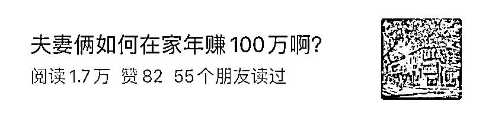</ne-card></ne-p> <ne-p id="u56c09a34" data-lake-id="u56c09a34"><ne-text id="u06d4d78d">夫妻俩如何在家年赚 100 万啊？</ne-text></ne-p> <ne-p id="u07408650" data-lake-id="u07408650"><ne-text id="u451e143f">1.7 万阅读</ne-text></ne-p> <ne-p id="uf72d318e" data-lake-id="uf72d318e"><ne-card data-card-name="image" data-card-type="inline" id="kM4WC" data-event-boundary="card"></ne-card></ne-p> <ne-p id="uaef923f1" data-lake-id="uaef923f1"><ne-text id="ub5b09e5d">普通人想要年赚 100 万，做个小而美的超级个体吧</ne-text></ne-p> <ne-p id="u08e2c7e7" data-lake-id="u08e2c7e7"><ne-text id="u7617f095">1.1 万阅读</ne-text></ne-p> <ne-p id="u9944c0b8" data-lake-id="u9944c0b8"><ne-text id="uca13a051">大家发现了么？都是月入 10 万，年赚 100 万，然后反常识：年赚 100 万，不要买房也不要买车，夫妻俩如何在家年赚 100 万……都是反常识的标题，就容易被系统推荐，获得比较高的阅读。</ne-text></ne-p> <ne-p id="ufeb068de" data-lake-id="ufeb068de"><ne-text id="u8d9a7f0e">本来我没打算引流的，只是想着写些东西，找回写作手感，因为我之前一直都是写东西的，因为搞其他项目停了比较长一段时间。</ne-text></ne-p> <ne-p id="uec14ad2d" data-lake-id="uec14ad2d"><ne-text id="u75876bd8">没想到，我稍微一写，阅读量就那么高，我想不能浪费流量啊，于是，我就学着同行去放资料引流，直接给微信引流了 700 多人，为了引流效果更好，我关闭了文中广告，最近，还关闭了底部广告。</ne-text></ne-p> <ne-p id="uc141ef7f" data-lake-id="uc141ef7f"><ne-card data-card-name="image" data-card-type="inline" id="gvpJY" data-event-boundary="card">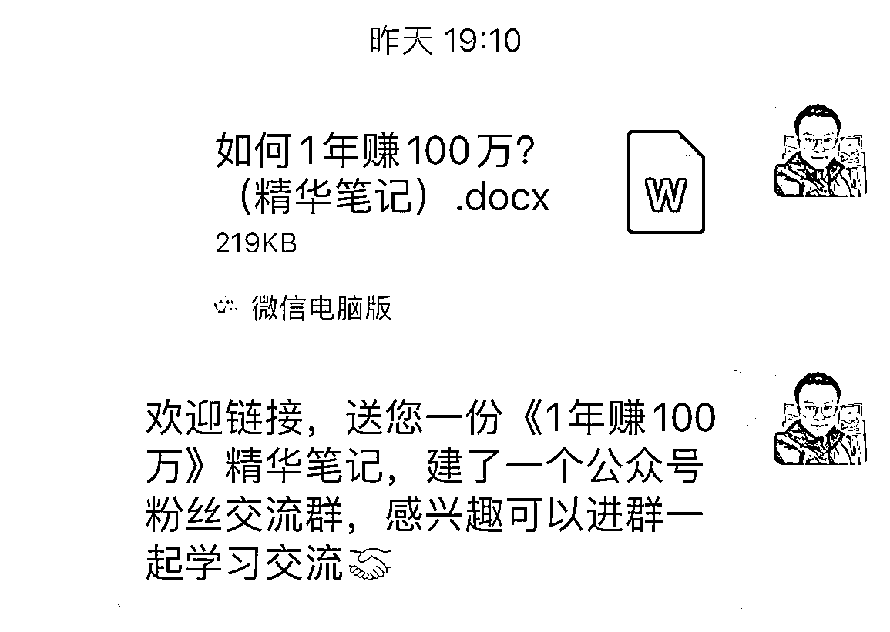</ne-card></ne-p> <ne-p id="ud15569ad" data-lake-id="ud15569ad"><ne-text id="u80929b39">引流方法也很简单，送资料，我送的资料是跟我这些文章内容相匹配的：《如何 1 年赚 100 万？》的精华笔记。</ne-text></ne-p> <ne-p id="ud3ff63a3" data-lake-id="ud3ff63a3"><ne-card data-card-name="image" data-card-type="inline" id="iLzCW" data-event-boundary="card"></ne-card></ne-p> <ne-p id="uf8071617" data-lake-id="uf8071617"><ne-text id="ua43d182f">引流过来，然后引导加微信群，我建了 4 个免费群：思维成长社 1234，平时就分享一下文章和自媒体干货，周六晚上 8 点，就分享一节思维系列公开课。</ne-text></ne-p> <ne-p id="u7f12cd04" data-lake-id="u7f12cd04"><ne-card data-card-name="image" data-card-type="inline" id="uFODw" data-event-boundary="card"></ne-card></ne-p> <ne-p id="u668bff65" data-lake-id="u668bff65"><ne-text id="u8df2bcbc">目前分享了 9 节，还有 4 节，最近我发现，这个思维系列公开课也可以写到 101 堂，目前想到了 84 个思维，还差 17 个，我回去再想想。</ne-text></ne-p> <ne-p id="u8f26bc3c" data-lake-id="u8f26bc3c"><ne-text id="u394f0df2">通过公众号搞钱文章，和社群分享思维系列公开课，迅速拉近跟新加来的好友关系，这为我之后做的群发售打下了基础，在此先放一边，咱们先来说说头条往事。</ne-text></ne-p> <ne-h2 id="24efcda0" data-lake-id="24efcda0"><ne-heading-ext><ne-heading-anchor></ne-heading-anchor><ne-heading-fold></ne-heading-fold></ne-heading-ext><ne-heading-content><ne-text id="u7149d035">3、头条往事：跟风做专栏却引流 1000+粉丝</ne-text></ne-heading-content></ne-h2> <ne-p id="u22b3325f" data-lake-id="u22b3325f"><ne-text id="ua94804f5">这次售卖的 GPT 社群，有一半成员是我之前头条专栏的读者。我之前是做图文自媒体的，以头条平台为主，其他平台为辅。</ne-text></ne-p> <ne-p id="u96b37b54" data-lake-id="u96b37b54"><ne-text id="u146658ad">当时在头条写作呢，比较小白，什么火就写什么，写过征文、流量文、带货文。</ne-text></ne-p> <ne-p id="u7216fe57" data-lake-id="u7216fe57"><ne-card data-card-name="image" data-card-type="inline" id="eH89e" data-event-boundary="card"></ne-card></ne-p> <ne-p id="ua3c58f2b" data-lake-id="ua3c58f2b"><ne-text id="udbd3d787">征文最高一篇变现 10024，题目是《5G 时代已来，我们还要不要去考驾照》，写的是我裸辞回家考驾照的坎坷经历，没想到竟然获得了一等奖 10000 元，还有流量收益 24 块。</ne-text></ne-p> <ne-p id="u6cb26a2d" data-lake-id="u6cb26a2d"><ne-card data-card-name="image" data-card-type="inline" id="bdYAa" data-event-boundary="card"></ne-card></ne-p> <ne-p id="u1e8dd9df" data-lake-id="u1e8dd9df"><ne-text id="u2907efa0">还有一篇 5000 的，写的是综艺节目，当时听了几首歌，觉得挺有感觉，就随手写了一篇，没想到居然获得了一等奖 5000 元，我记得阅读量很低，只有 100 多阅读，流量收益几分钱，忽略不计。</ne-text></ne-p> <ne-p id="u5c2be702" data-lake-id="u5c2be702"><ne-card data-card-name="image" data-card-type="inline" id="To6Qc" data-event-boundary="card"></ne-card></ne-p> <ne-p id="ufb59ccac" data-lake-id="ufb59ccac"><ne-text id="u352259f8">还有一篇 2000 的：《月薪三千，消费一万三，双十一过后，我去快递公司当小哥》</ne-text></ne-p> <ne-p id="uf7d31b9c" data-lake-id="uf7d31b9c"><ne-text id="u01f4baec">写的是我双十一超前消费，负债五位数，双十一过后，去快递公司当小哥的故事，当时通宵做了 7 天，只挣了 520（这个数字我至今记忆犹新），但后面我把这个经历写成文章，没想到获得了双十一小说家，2000 元现金大红包，还有 4000 的、1000 的、500 的，就不一一列举了。</ne-text></ne-p> <ne-p id="u8391c672" data-lake-id="u8391c672"><ne-card data-card-name="image" data-card-type="inline" id="u32WV" data-event-boundary="card">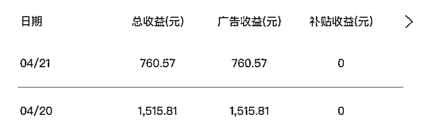</ne-card></ne-p> <ne-p id="ud3284eed" data-lake-id="ud3284eed"><ne-text id="ub517ac16">接着是流量文，最高阅读是 166 万，百家号，收益 2200+。</ne-text></ne-p> <ne-p id="u855e82b1" data-lake-id="u855e82b1"><ne-card data-card-name="image" data-card-type="inline" id="tkoHv" data-event-boundary="card">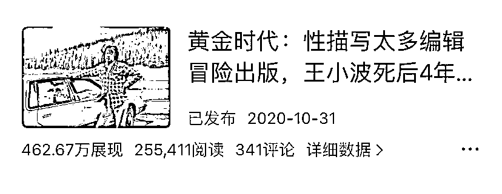</ne-card></ne-p> <ne-p id="u24f192d3" data-lake-id="u24f192d3"><ne-card data-card-name="image" data-card-type="inline" id="j6CwH" data-event-boundary="card">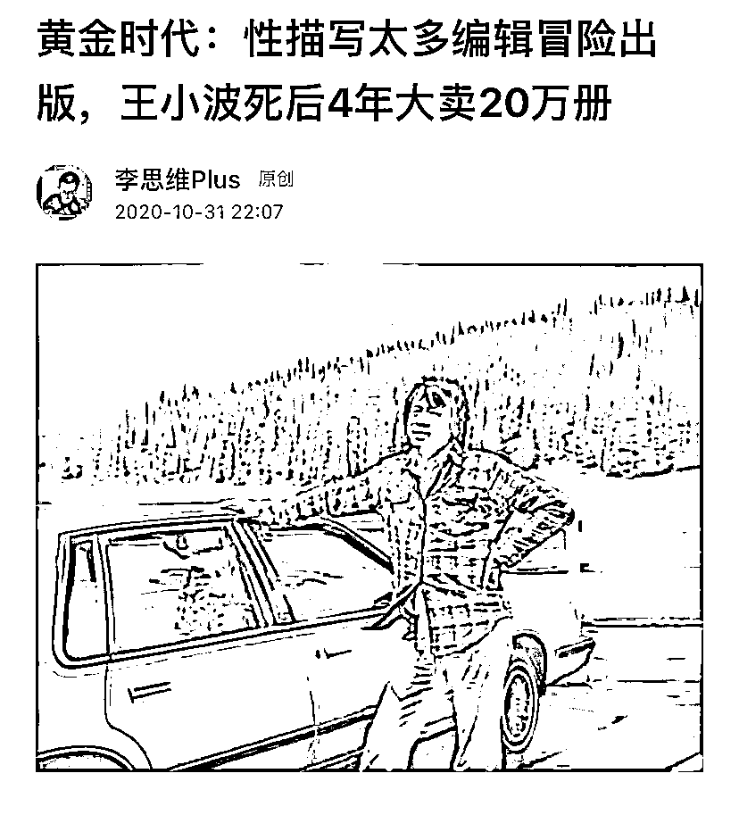</ne-card></ne-p> <ne-p id="uda19cab4" data-lake-id="uda19cab4"><ne-text id="uf92ce430">然后是带货文，最高变现的一篇是 25.5 万阅读的带货文，带了 1000 套王小波的书，佣金+流量收益累计变现 5w+，因为当时大意了，收益截图没保存好，没法发出来，但在我当时写作社群的伙伴，应该都看过。</ne-text></ne-p> <ne-p id="uf11fe06b" data-lake-id="uf11fe06b"><ne-card data-card-name="image" data-card-type="inline" id="jTJmn" data-event-boundary="card">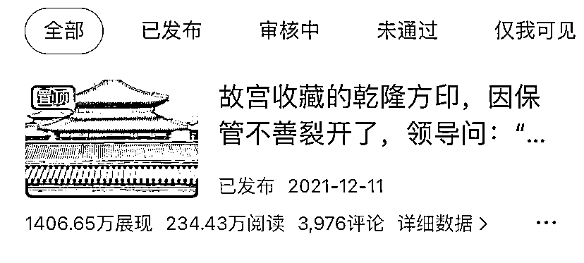</ne-card></ne-p> <ne-p id="ue369304b" data-lake-id="ue369304b"><ne-card data-card-name="image" data-card-type="inline" id="Kp22x" data-event-boundary="card">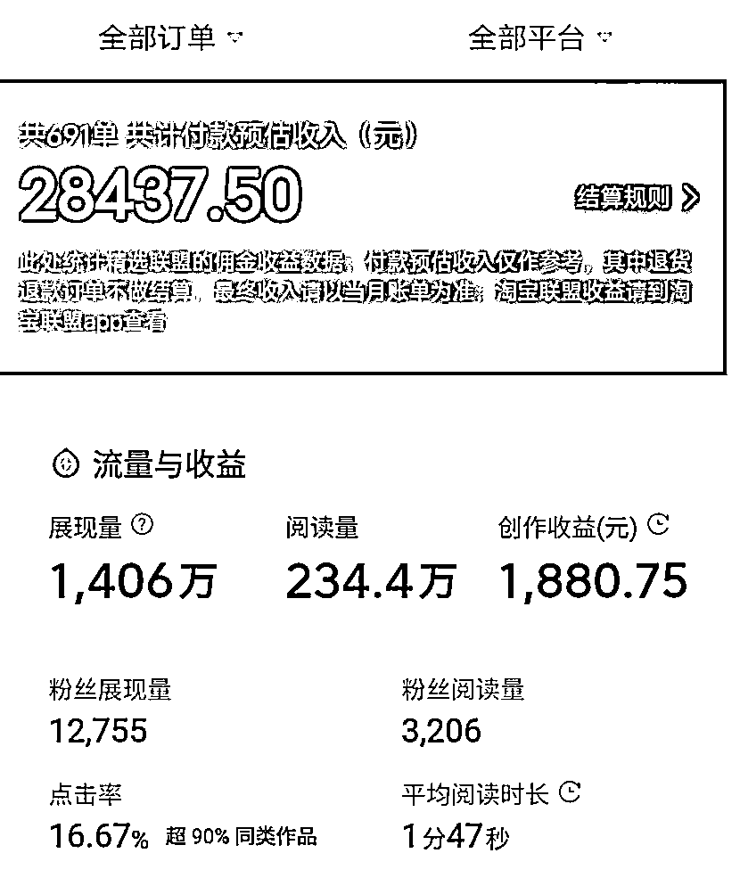</ne-card></ne-p> <ne-p id="u25a42029" data-lake-id="u25a42029"><ne-text id="u31677f79">还有就是一个 1400 万展现的带货微头条，佣金+流量收益变现 3w+，还有大大小小的微头条带货爆款，累计变现不算多，也就 30w 左右吧。</ne-text></ne-p> <ne-p id="u223b19db" data-lake-id="u223b19db"><ne-card data-card-name="image" data-card-type="inline" id="RIxRv" data-event-boundary="card">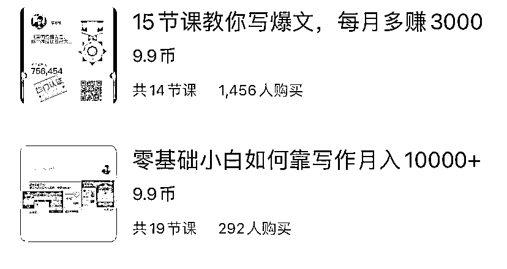</ne-card></ne-p> <ne-p id="ude37aed4" data-lake-id="ude37aed4"><ne-text id="ue7f23277">然后是我的写作专栏，主要是讲如何通过写作变现的，我以上这些征文、流量文和带货文的成绩，就是组成了我专栏的内容，同时也能为我卖专栏做背书。</ne-text></ne-p> <ne-p id="udbed2566" data-lake-id="udbed2566"><ne-text id="u4b3d04b9">其实，当时做专栏也是无心插柳，跟风做的，没想到却卖了 1500 多份，引流到微信 1000 多人，拉了 2 个写作群，几乎都满 500 人。</ne-text></ne-p> <ne-p id="u73534a46" data-lake-id="u73534a46"><ne-text id="u2e0234fe">当时还没有什么私域流量的概念，但后面做头条的各种项目，如写作培训、西瓜商单、头条带货、买卖万粉号等等，我才发现，私域流量是那么香，既可以做培训赚钱，又可以带队写作赚钱，还可以对接资源赚钱，其基础，都是专栏引流过来的 1000+粉丝。</ne-text></ne-p> <ne-p id="u3fbc2d3b" data-lake-id="u3fbc2d3b"><ne-text id="u46772341">但当时微头条带货太火了，我后面把手上 5 个号，全都用来带货，恨不得一天写 10 篇，我记得，好像还真有一天试过写 10 篇，都是一个字一个字敲，敲了 15000 字，从早上写到晚上，第二天直接头晕脑胀。</ne-text></ne-p> <ne-p id="ua5deaba5" data-lake-id="ua5deaba5"><ne-text id="u99747e24">但幸运的是，那 10 篇发出去，全都爆了，给我赚了好几万。</ne-text></ne-p> <ne-p id="u42660654" data-lake-id="u42660654"><ne-text id="u254e5e08">后来，头条带货熄火了，我们大多数作者收益直接腰斩，要么去上班，要么另寻出路。</ne-text></ne-p> <ne-p id="u9c33924c" data-lake-id="u9c33924c"><ne-text id="u8e17a289">事后我复盘，当时没能多花点时间去搞专栏引流，要是能引流几千上万人，可能今天会是另一番结局，因为当时流量真的特别好搞。</ne-text></ne-p> <ne-p id="u2510246c" data-lake-id="u2510246c"><ne-text id="ue8efa131">不过，当时我们都沉浸在带货日入过万的快感当中，没有这个意识，所以就错过了好时机，如果让我回到过去，我肯定会狠狠地搞专栏引流。</ne-text></ne-p> <ne-p id="uee6b5b61" data-lake-id="uee6b5b61"><ne-text id="ue86c4a96">但时光是不能倒流的，我们也无法回到过去，只能把握好当下和展望未来。所以，我目前还是以引流为主，现在是公众号，之后应该会加上视频号和小红书，都在准备学习和操作，听说今年生财会开很多小红书航海，刚好可以跟上。</ne-text></ne-p> <ne-h2 id="9062bd12" data-lake-id="9062bd12"><ne-heading-ext><ne-heading-anchor></ne-heading-anchor><ne-heading-fold></ne-heading-fold></ne-heading-ext><ne-heading-content><ne-text id="u9d206697">4、第一次做群发售，变现 6000+</ne-text></ne-heading-content></ne-h2> <ne-p id="ud49b2b4e" data-lake-id="ud49b2b4e"><ne-text id="ub3975a70">说完产品：ChatGPT 社群，还有流量：公众号读者+头条专栏读者，下面再来说说我的转化方法。其实也很常见，就是发朋友圈、公众号，然后拉群分享，分享结束就开始销售。</ne-text></ne-p> <ne-p id="u57e6a492" data-lake-id="u57e6a492"><ne-text id="ud31150ef">关于群发售，我之前参加过不少，但自己真正开始做，也就是这个月的事情，之前参加过很多次别人的群发售，听说一下变现几万几十万，非常厉害，但作为参与者而不是组织者，并不知道其中有什么细节需要注意。</ne-text></ne-p> <ne-p id="uf1213882" data-lake-id="uf1213882"><ne-text id="ua06b466b">所以，我第一次拉群分享然后发售，比较匆忙，没有准备太好，只卖了 20 个社群，第二次也是，因为之前卖了一波，第二次也只卖了 20 个左右，两次累计变现了 6135。</ne-text></ne-p> <ne-p id="u3f83c9cf" data-lake-id="u3f83c9cf"><ne-text id="ubb92d516">虽然不多，但是从中收获了不少群发售经验，还有一些需要注意的细节，譬如，发售前要预热，要提前发圈和公众号预告，要找人做助攻等等，还有成交的时候，得提前准备好话术和一些收益截图。</ne-text></ne-p> <ne-p id="ud9f8018e" data-lake-id="ud9f8018e"><ne-text id="ud46ff213">在发售后，得设置截止时间，最后 1 小时，最后 30 分钟，最后 15 分钟，最后 3 分钟，最后 1 分钟，都要提醒一下。因为有些小伙伴，就是要拖到最后一分钟，踩点来的。</ne-text></ne-p> <ne-p id="ud53a84cc" data-lake-id="ud53a84cc"><ne-card data-card-name="image" data-card-type="inline" id="BPzpi" data-event-boundary="card"></ne-card></ne-p> <ne-p id="uf0f891c7" data-lake-id="uf0f891c7"><ne-card data-card-name="image" data-card-type="inline" id="JU0PG" data-event-boundary="card"></ne-card></ne-p> <ne-p id="u0c7c4bce" data-lake-id="u0c7c4bce"><ne-text id="u9aaaa2d3">譬如我第二次发售 ChatGPT 创富研习社社群，有个姐姐，就是在 23 点 59 分 59 秒的时候，突然给我转了一个 179 的红包，我当时既惊喜又觉得特别神奇。</ne-text></ne-p> <ne-p id="u8512bb4e" data-lake-id="u8512bb4e"><ne-text id="uc44841f7">总之，就是要设置截止时间，一到时间，立马恢复原价。然后平时，就照原价发圈去卖，到了某个特定时间点，就降价促销。</ne-text></ne-p> <ne-p id="u0274c3fd" data-lake-id="u0274c3fd"><ne-text id="u54a5a05f">除了社群分享和发售，我当天还会发朋友圈刷屏，给大家制造一种畅销的景象，为什么要刷屏？</ne-text></ne-p> <ne-p id="u62fb27fe" data-lake-id="u62fb27fe"><ne-text id="u3f4161e9">原因也很简单，就跟开店卖东西一样，排队的人越多，这家店就越旺，你就越喜欢去，羊群效应嘛。</ne-text></ne-p> <ne-p id="u178ee821" data-lake-id="u178ee821"><ne-text id="ud2901ace">社群发售也是如此，当你在短时间出大量的转账截图，目标人群就会觉得，非常多人加入你的社群，然后就会心生“我”也想加入的念头。</ne-text></ne-p> <ne-p id="ucf1a9829" data-lake-id="ucf1a9829"><ne-text id="u9ecfa8f3">给大家看看我发圈的文案：主要还是针对公众号来的粉丝朋友，还有专栏的读者朋友。</ne-text></ne-p> <ne-p id="uba0d7029" data-lake-id="uba0d7029"><ne-card data-card-name="image" data-card-type="inline" id="c42tB" data-event-boundary="card">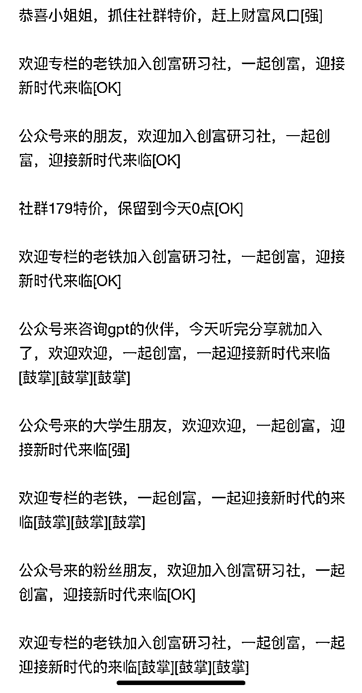</ne-card></ne-p> <ne-p id="u5427afa5" data-lake-id="u5427afa5"><ne-text id="u0c1d7d76">截图当天全部发完，第二天恢复原价后，我一般会把之前的特价全都删除，再按正常价售卖，让加入的小伙伴们，有种捡到便宜的感觉。</ne-text></ne-p> <ne-p id="uc06e4174" data-lake-id="uc06e4174"><ne-text id="u18dc20a5">以上，就是我加入生财不到 1 个月，通过风向标和一篇文章启发，变现 6000+的全过程。</ne-text></ne-p> <ne-p id="uc8fa6d23" data-lake-id="uc8fa6d23"><ne-card data-card-name="image" data-card-type="inline" id="mA8aa" data-event-boundary="card"></ne-card></ne-p> <ne-p id="u5782a165" data-lake-id="u5782a165"><ne-text id="u37c92d63">对了，那篇文章是生财有术公众号的文章：《参加 2 场航海，我成功用 ChatGPT 写出 10W+公众号爆款的复盘》。我用了里面的例子来做分享。感恩，谢谢，祝福，谢谢。</ne-text></ne-p> <ne-h2 id="bd28404f" data-lake-id="bd28404f"><ne-heading-ext><ne-heading-anchor></ne-heading-anchor><ne-heading-fold></ne-heading-fold></ne-heading-ext><ne-heading-content><ne-text id="ufc0d77d3">5、随意分享，没想到安利了一个小姐姐加入生财有术</ne-text></ne-heading-content></ne-h2> <ne-p id="u2a69c8be" data-lake-id="u2a69c8be"><ne-text id="u09d8d197">最后，来说说安利一个小姐姐加入生财有术的故事，她是我社群的一个小伙伴，之前通过写作营认识的，很年轻，很漂亮，搞钱也很积极，但最近项目遇到一些瓶颈，我就安利她说，去生财看看世界吧。</ne-text></ne-p> <ne-p id="uace4a92a" data-lake-id="uace4a92a"><ne-text id="u8ee5bc5c">她刚开始是不想加入的，因为 1965 价格，对于一个刚毕业的大学生来说，价格还是有点高，所以，她犹豫了几天。</ne-text></ne-p> <ne-p id="ua12d3d29" data-lake-id="ua12d3d29"><ne-text id="udcfa75af">但后来，她看到周围朋友都在发圈或者拉群宣传生财有术，她好奇去了解了一下。</ne-text></ne-p> <ne-p id="u317cf30d" data-lake-id="u317cf30d"><ne-text id="ua74b30c4">很快，她就觉得生财有术非常适合她，因为，里面内容包罗万象，精华帖子漫天飞舞，各路高手层出不穷，不仅氛围好，人才多，各种活动也是丰富多彩。</ne-text></ne-p> <ne-p id="u4bfa9b47" data-lake-id="u4bfa9b47"><ne-text id="u574a3268">她了解完了之后，当即就跟我说要加入了，而且想当天就加入，非常的迫切。</ne-text></ne-p> <ne-p id="u61cbe46f" data-lake-id="u61cbe46f"><ne-card data-card-name="image" data-card-type="inline" id="XTVfu" data-event-boundary="card">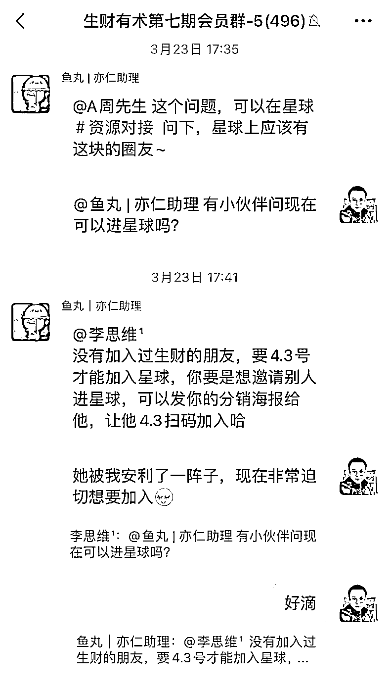</ne-card></ne-p> <ne-p id="u0febb798" data-lake-id="u0febb798"><ne-text id="u0c1e8a5f">当时是 3 月 23 日，我就在会员群问鱼丸：有小伙伴问现在可以进星球吗？</ne-text></ne-p> <ne-p id="u4f8f2492" data-lake-id="u4f8f2492"><ne-text id="ucd4da29f">鱼丸说：要 4.3 号才能加入星球。</ne-text></ne-p> <ne-p id="ued5f5c8a" data-lake-id="ued5f5c8a"><ne-text id="uf12d3470">我说：她被我安利了一阵子，现在非常迫切想要加入。</ne-text></ne-p> <ne-p id="u9a135bfd" data-lake-id="u9a135bfd"><ne-text id="u71a9488a">为什么那么迫切？原因也很简单，3.23 加入能比 4.3 多 13 天时间，能更快看到精彩内容，能更容易抓住时代红利，能更早见识到更大的世界。</ne-text></ne-p> <ne-p id="u012b504c" data-lake-id="u012b504c"><ne-card data-card-name="image" data-card-type="inline" id="PHw8F" data-event-boundary="card">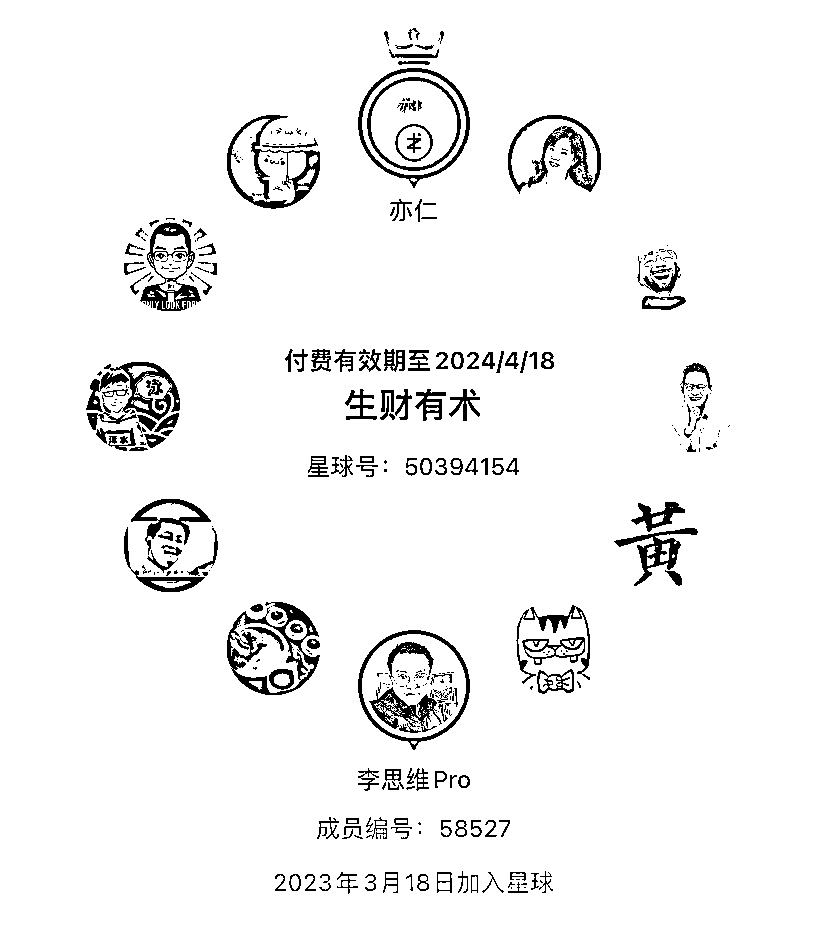</ne-card></ne-p> <ne-p id="uc90d8b6d" data-lake-id="uc90d8b6d"><ne-text id="ua9f25940">我当时是 3.18 进入星球的，比 418 加入的伙伴多了 1 个月，然后，我在这 1 个月不到的时间，受到星球的 ChatGPT 风向标和生财有术公众号一篇文章的启发，去实操，直接变现 6135，赚回 3 张门票钱。</ne-text></ne-p> <ne-p id="uf4c373a6" data-lake-id="uf4c373a6"><ne-card data-card-name="image" data-card-type="inline" id="ckBdU" data-event-boundary="card"></ne-card></ne-p> <ne-p id="u355ab2ba" data-lake-id="u355ab2ba"><ne-text id="u5b2f7894">还安利了社群的一个小姐姐加入生财有术，既有佣金，又有纪念 T-恤，现在想想，都感觉特别幸运。</ne-text></ne-p> <ne-p id="u4a6b86ae" data-lake-id="u4a6b86ae"><ne-text id="u12250425">最后，愿我们生财有术的新老朋友们，都能生财有术。</ne-text></ne-p> <ne-hole id="u40ca49e7" data-lake-id="u40ca49e7"><ne-card data-card-name="hr" data-card-type="block" id="RyCQQ" data-event-boundary="card"><ne-p id="uccb11542" data-lake-id="uccb11542"><ne-text id="u5aefec82">评论区：</ne-text></ne-p> <ne-p id="u92561cbd" data-lake-id="u92561cbd"><ne-text id="u8304695f">希声。 : 厉害了！</ne-text> <ne-text id="u157810a4">罗本 : 行动力真强</ne-text> <ne-text id="ub9d90030">财女小马达 : 行动力杠杠！对你的写作变现很感兴趣，可以＋微交流一下吗</ne-text> <ne-text id="u7505f167">山丘 : 厉害</ne-text> <ne-text id="u028e5d2d">李思维 Pro : 新人不能留 v 哦[害羞]</ne-text> <ne-text id="u7ee4f002">李思维 Pro : 一起加油[握手][握手]</ne-text> <ne-text id="ud313adf8">李思维 Pro : 一起努力[握手]</ne-text> <ne-text id="u22a18f20">李思维 Pro : 嗯嗯，搞钱，执行力要拉满[握手]</ne-text></ne-p></ne-card></ne-hole>