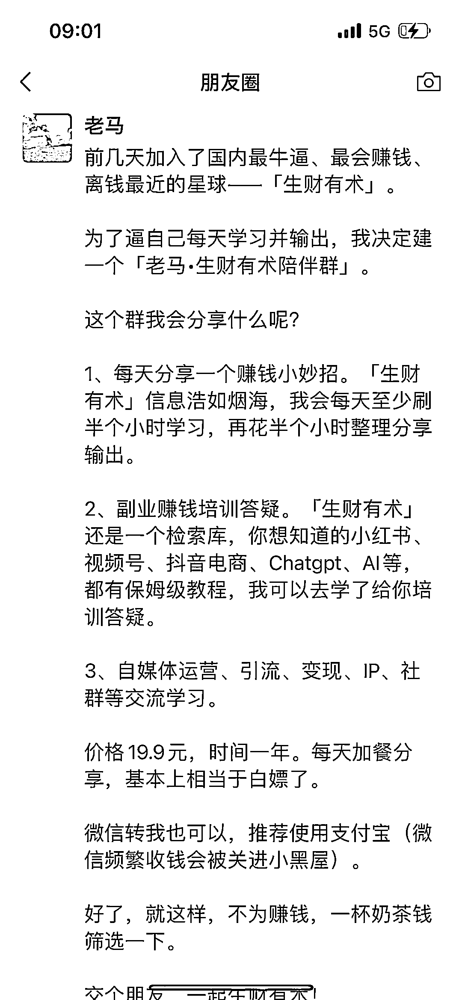
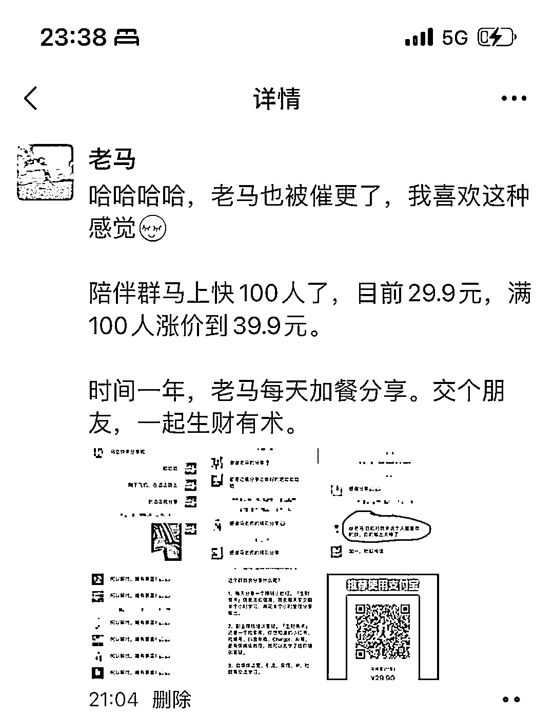
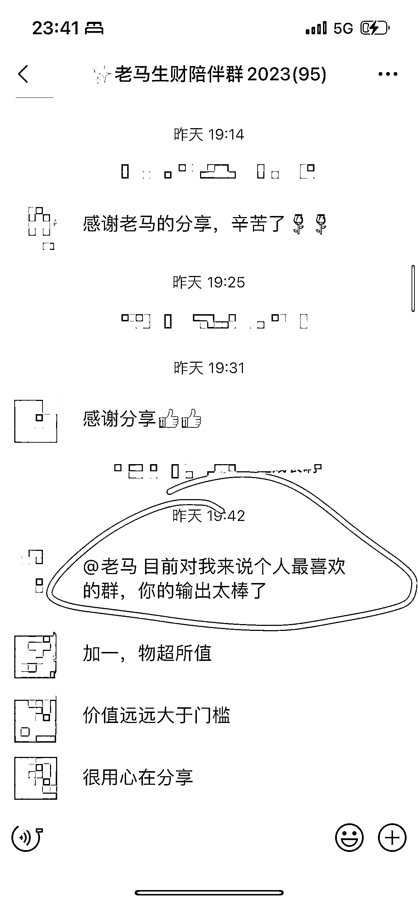

# 《新人做生财陪伴群，3 天赚回门票钱》

> 原文：[`www.yuque.com/for_lazy/thfiu8/tydvdq7zifhxbml1`](https://www.yuque.com/for_lazy/thfiu8/tydvdq7zifhxbml1)

<ne-h2 id="b4fe09ea" data-lake-id="b4fe09ea"><ne-heading-ext><ne-heading-anchor></ne-heading-anchor><ne-heading-fold></ne-heading-fold></ne-heading-ext><ne-heading-content><ne-text id="u7baa9af6">(187 赞)《新人做生财陪伴群，3 天赚回门票钱》</ne-text></ne-heading-content></ne-h2> <ne-p id="uc48d4e79" data-lake-id="uc48d4e79"><ne-text id="ueeb34909">作者： 老马</ne-text></ne-p> <ne-p id="u01fb2816" data-lake-id="u01fb2816"><ne-text id="ufe9d6dca">日期：2023-04-12</ne-text></ne-p> <ne-p id="uf1e7ac4b" data-lake-id="uf1e7ac4b"><ne-text id="u6a3d3c4f">《新人做生财陪伴群，3 天赚回门票钱》</ne-text></ne-p> <ne-p id="u3817901f" data-lake-id="u3817901f"><ne-text id="uf1d26e4a">大家好，我今年新加入生财大家庭的老马，为了逼自己更好地学习生财的知识，我专门建了个年度陪伴群。</ne-text></ne-p> <ne-p id="ua396ec4f" data-lake-id="ua396ec4f"><ne-text id="u3d7c7086">群里每天输出分享在星球学到的知识，不纯粹搬运，而是结合自己的例子讲出来——费曼学习法。</ne-text></ne-p> <ne-p id="ua04f0685" data-lake-id="ua04f0685"><ne-text id="u126af76f">这周一拉的群，目前社群 95 人，赚了 2300+，门票钱收回来了。</ne-text></ne-p> <ne-p id="u5d4b60d5" data-lake-id="u5d4b60d5"><ne-text id="u78b93cbc">分享几点，希望对大家有所启发：</ne-text></ne-p> <ne-p id="u8e4f25b5" data-lake-id="u8e4f25b5"><ne-text id="u471bd555">1、我是今年才开始搞自媒体，目前私域好友 750 人，给我付费的有 94 人，转化率 12%，我很满意了。</ne-text></ne-p> <ne-p id="ueeb0e2bc" data-lake-id="ueeb0e2bc"><ne-text id="ub9270620">2、为什么要建年度陪伴群：主要是逼自己每天学习输出，顺便赚回门票钱。</ne-text></ne-p> <ne-p id="u33f2c44c" data-lake-id="u33f2c44c"><ne-text id="ub9d365f3">3、价格设置：0-50 人，19.9 元；51-100 人，29.9 元；超 100 人，39.9 元。后面大概维持 39.9 元不动。因为我还是新人，没有影响力，价格太高的话不好推。</ne-text></ne-p> <ne-p id="ua1fc30fb" data-lake-id="ua1fc30fb"><ne-text id="u4a971c0d">4、阶梯涨价效果很好。我快 40 人的时候，发个 50 人后涨价的文案，基本上 1 个小时就能到 50 人；今天 90 人了，我又发了个涨价了，大概率明天就能到 100 人。</ne-text></ne-p> <ne-p id="uaeef2144" data-lake-id="uaeef2144"><ne-text id="u046013bf">5、几种群玩法不一样：（1）10 天/21 天的见证群，优势是来快钱，轻交付，但粘性和口碑要打折扣（2）年度每天陪伴群，重交付，但粉丝粘性高。</ne-text></ne-p> <ne-p id="u28f0024a" data-lake-id="u28f0024a"><ne-text id="uae2a1e72">6、不仅仅要建陪伴群，还要有高阶课程的承接。如果单纯只有 19.9 元的陪伴群，你会觉得每天加餐交付很不划算，但如果在此基础上，开拓出中端和高端的产品，形成产品体系，不断把陪伴群的粉丝往中端和高端上转，你的动力又不一样。老马后面会推出中端的星球，以及高端的合伙人，形成高中低档的产品体系。</ne-text></ne-p> <ne-p id="u3331a2a2" data-lake-id="u3331a2a2"><ne-text id="ua9aaf503">7、分佣。我设置了分佣，进四出六是我一直在执行的原则，也就是说分佣 60%。一般来说，对半分的比较多。反正是在一个群交付，设置分佣对群主和群员都有好处。学会分钱才能做大。</ne-text></ne-p> <ne-p id="u5f1d8143" data-lake-id="u5f1d8143"><ne-text id="u6b798e88">8、还有其他好处，比如：在生财陪伴群熏陶一年，那明年 418 招募的时候，群里就不用再介绍啦，福利给够铁粉直接从我这儿入，我提前就锁定了。如果我今年能做到 500 人，转销率还能有 10%，那推荐 50 人入生财，也能上推荐排行榜了。</ne-text></ne-p> <ne-p id="ubc5581a0" data-lake-id="ubc5581a0"><ne-text id="u49ea1ff9">9、这事关键还在于你是否能每天坚持，以及你每天的分享质量，目前我的社群已经在开始催更了，很喜欢这种感觉。</ne-text></ne-p> <ne-p id="u1b4c9c0a" data-lake-id="u1b4c9c0a"><ne-text id="ua3226570">10、分享几张我朋友圈的文案、涨价文案以及群里截图。</ne-text><ne-card data-card-name="image" data-card-type="inline" id="ywWnw" data-event-boundary="card"></ne-card></ne-p> <ne-p id="u1f48a936" data-lake-id="u1f48a936"><ne-card data-card-name="image" data-card-type="inline" id="qQoOP" data-event-boundary="card"></ne-card></ne-p> <ne-p id="uc850e205" data-lake-id="uc850e205"><ne-card data-card-name="image" data-card-type="inline" id="k2QRZ" data-event-boundary="card"></ne-card></ne-p> <ne-p id="uf9f0a880" data-lake-id="uf9f0a880"><ne-card data-card-name="image" data-card-type="inline" id="npA8o" data-event-boundary="card"></ne-card></ne-p> <ne-p id="u7c20f1bd" data-lake-id="u7c20f1bd"><ne-card data-card-name="image" data-card-type="inline" id="uKO2e" data-event-boundary="card"></ne-card></ne-p> <ne-p id="u5f1db488" data-lake-id="u5f1db488"><ne-card data-card-name="image" data-card-type="inline" id="PDbAs" data-event-boundary="card"></ne-card></ne-p> <ne-hole id="ucdfd6f1d" data-lake-id="ucdfd6f1d"><ne-card data-card-name="hr" data-card-type="block" id="ID9EH" data-event-boundary="card"><ne-p id="ue2ecfd97" data-lake-id="ue2ecfd97"><ne-text id="u69bfc1d2">评论区：</ne-text></ne-p> <ne-p id="uc922291b" data-lake-id="uc922291b"><ne-text id="u24f194f4">平凡小吴 : 这个方法真的牛啊，一方面现阶段赚钱，还能不断增加群成员对自身信任感和生财信任感的建立，等到生财拉新的时候，群转化率那得多恐怖！牛掰[机智]</ne-text> <ne-text id="ud84088ff">老马 : 谢谢大佬[抱拳][抱拳]</ne-text> <ne-text id="u738fcc7d">平凡小吴 : 害，配不上大佬，麻烦看一下私信</ne-text> <ne-text id="uce8ca372">荷包蛋糕哦哦 : 哈哈又是我们群的大佬</ne-text> <ne-text id="u1b294aa6">沛虫 : 请问可以借用图片里的话术吗[玫瑰]</ne-text> <ne-text id="uc7aafd57">老马 : 可以，您随便用</ne-text> <ne-text id="u82689f2c">林海盐 : 我也要搞起来</ne-text> <ne-text id="u4b9da922">老马 : 加油，搞起来</ne-text></ne-p></ne-card></ne-hole>