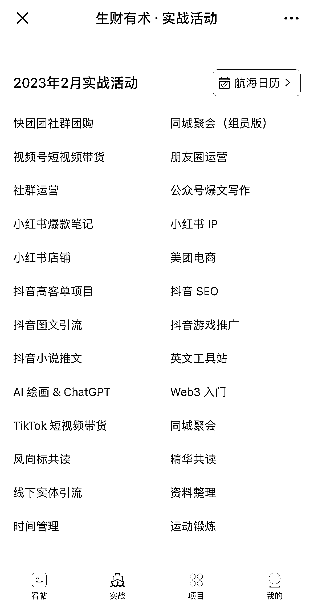
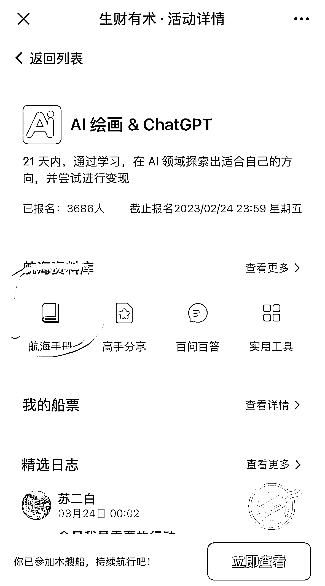

# 《推荐一款生财官方的“隐藏款 GPT-3.5”》

> 原文：[`www.yuque.com/for_lazy/thfiu8/orfofh6mly35n248`](https://www.yuque.com/for_lazy/thfiu8/orfofh6mly35n248)

<ne-h2 id="9886e0d6" data-lake-id="9886e0d6"><ne-heading-ext><ne-heading-anchor></ne-heading-anchor><ne-heading-fold></ne-heading-fold></ne-heading-ext><ne-heading-content><ne-text id="ua8fad282">(174 赞)《推荐一款生财官方的“隐藏款 GPT-3.5”》</ne-text></ne-heading-content></ne-h2> <ne-p id="u9f988624" data-lake-id="u9f988624"><ne-text id="u21ddee17">作者： 杨昌</ne-text></ne-p> <ne-p id="u009c0a2b" data-lake-id="u009c0a2b"><ne-text id="u81f9579a">日期：2023-04-11</ne-text></ne-p> <ne-p id="u7d2e46b0" data-lake-id="u7d2e46b0"><ne-text id="ufc2941e6">精华中的精华，风向标中的风向标，推荐一款生财官方的“隐藏款 GPT-3.5”</ne-text></ne-p> <ne-p id="uc2efd6b8" data-lake-id="uc2efd6b8"><ne-text id="u65a1bd9f">生财有术的新老朋友们好，我是内向打工人杨昌。上周，有位刚进生财的高中校友告诉我：“进来干货太多，有点眼花缭乱，不知道从何看起的感觉。”</ne-text></ne-p> <ne-p id="u459d374d" data-lake-id="u459d374d"><ne-text id="ucdaca745">当时我还在沉迷 ChatGPT 中，就先把生财官方的搜索引擎推荐给她了。</ne-text></ne-p> <ne-p id="ud571d986" data-lake-id="ud571d986"><ne-text id="ua6c654b1">但我其实知道，生财官方还有一款更牛的神器，我愿称之为“精华中的精华，风向标中的风向标，新圈友的弯道超车神器”。</ne-text></ne-p> <ne-p id="ube078fa0" data-lake-id="ube078fa0"><ne-text id="uaa2fd23c">一、神器</ne-text></ne-p> <ne-p id="ud7380180" data-lake-id="ud7380180"><ne-text id="u1cd080c3">这款神器的特点，是使用者极其友好（尤其对内向者），但推荐者介绍起来有点麻烦。于是，我就拖延了好久，想看看有没有人介绍，再偷个懒直接转发给校友。</ne-text></ne-p> <ne-p id="u3526f9c2" data-lake-id="u3526f9c2"><ne-text id="uea9655b6">没想到，等了好久，还是没看到有人介绍。我就开始想，会不会有一种可能，这是生财 90%以上圈友都没很好用起来秘密武器，用好就能弯道超车？</ne-text></ne-p> <ne-p id="u4bb12ec6" data-lake-id="u4bb12ec6"><ne-text id="u4e23fafd">就像很多武侠小说里那样，主角跌落悬崖，意外进入某个山洞，发现了绝世宝典，弯道超车练成了神功？</ne-text></ne-p> <ne-p id="u44d58d2f" data-lake-id="u44d58d2f"><ne-text id="u3a0a45de">虽然不确定有没有这样的效果，但如果真的有某一款神器，能让人快速找到精华中的精华，收获风向标中的风向标，那么对像我校友这样新加入生财的圈友，肯定是无比友好的。</ne-text></ne-p> <ne-p id="u3d008f85" data-lake-id="u3d008f85"><ne-text id="ufd2ee865">生财官方，其实真的是有这么一款神器的。</ne-text></ne-p> <ne-p id="uc817c9ca" data-lake-id="uc817c9ca"><ne-text id="u2845a8a0">二、堪称“GPT-3.5”</ne-text></ne-p> <ne-p id="u51f3bf06" data-lake-id="u51f3bf06"><ne-text id="u237de0c5">说到这里，我想到了个我沉迷的 ChatGPT，也有个类似的案例，万维刚老师甚至在他得到上的《精英日课》专栏中指出：</ne-text></ne-p> <ne-p id="u9f3b2143" data-lake-id="u9f3b2143"><ne-text id="u89265e32">“我们正处在一个 AI 急剧发展的时刻，现在大学教育面临的一个问题就是你教的很可能都是过时的。</ne-text></ne-p> <ne-p id="u04713812" data-lake-id="u04713812"><ne-text id="uc83e0bde">标准的 AI 学科一定包括「自然语言处理（NLP）」这样的课程，而我们之前刚刚说过，那些知识根本用不上。以前有多少经验套路，现在都被神经网络碾压了。</ne-text></ne-p> <ne-p id="uda31f0b6" data-lake-id="uda31f0b6"><ne-text id="u27eddb43">有些人是把 AI 当事业做，有些人是把 AI 当学科做，后者更在意自己评职称的问题。如果你按照寻常路线本科、硕士、博士一路读下来，你恐怕刚出炉就是落伍的。”</ne-text></ne-p> <ne-p id="u013b1efe" data-lake-id="u013b1efe"><ne-text id="u41f967de">你看，随着 ChatGPT 横空出世，连一些 ai 科班出身的人，似乎在一定程度上，也被拉到了同一起跑线上。这款神器，在一定程度上，也有异曲同工之妙。</ne-text></ne-p> <ne-p id="u894e7c4b" data-lake-id="u894e7c4b"><ne-text id="u5a826e18">如果新圈友真的用好了，大概率也会跟很多胡乱看帖子、无章法“混圈子”的老圈友，重新站在同一起跑线上。</ne-text></ne-p> <ne-p id="ue0e9a0ff" data-lake-id="ue0e9a0ff"><ne-text id="ud0637e42">对啦，之所以不说是“ChatGPT”，而是说成“GPT-3.5”，是因为生财已经研发出了独家的“AI 助教”。</ne-text></ne-p> <ne-p id="ub8dc1aa9" data-lake-id="ub8dc1aa9"><ne-text id="u75331ac0">那个是“GPT-4”级别的真正的 AI 神器，但也像 ChatGPT PLUS 一样，是需要一定成本的，不建议新圈友马上就入手。</ne-text></ne-p> <ne-p id="u942405f3" data-lake-id="u942405f3"><ne-text id="u55d0125a">而今天介绍的这款生财官方“GPT-3.5”，相对没有那么智能，但也足够优秀。</ne-text></ne-p> <ne-p id="uaa2e263b" data-lake-id="uaa2e263b"><ne-text id="u0b22c960">三、服务号</ne-text></ne-p> <ne-p id="u0376ffe2" data-lake-id="u0376ffe2"><ne-text id="u14715a41">不卖关子了，我今天推荐的，是我唯一一个置顶的服务号——“生财有术服务号”官方服务号。</ne-text></ne-p> <ne-p id="u7fb50a40" data-lake-id="u7fb50a40"><ne-text id="uef9e2ad1">接下来，我展开说一下，为什么我要把它强烈推荐给新圈友，以及新圈友可以如何快速上手。</ne-text></ne-p> <ne-p id="u9f438f7c" data-lake-id="u9f438f7c"><ne-text id="u9a6182bc">1、推荐原因</ne-text></ne-p> <ne-p id="uaef9789c" data-lake-id="uaef9789c"><ne-text id="uc9a144e6">年初我写过一篇 330 多人点赞《》，之所以能引起那么圈友共鸣，相信是因为很多人看到了自己刚进入生财时候的某些感受：</ne-text></ne-p> <ne-p id="u08d2e062" data-lake-id="u08d2e062"><ne-text id="u5101c44c">“经常会被一些具体的问题卡住，也不好意思去问别人”、“不敢添加大佬，感觉不知道怎么说话，担心说错话，也无法提供价值”、“不敢发帖，我的东西很浅，还是别发了吧，免得被人笑话”……</ne-text></ne-p> <ne-p id="uf8bcc3f6" data-lake-id="uf8bcc3f6"><ne-text id="u0844ca62">关于这些问题，我在那篇帖子里给了些“不算解法”的解法。2 个月之后的今天，结合高中校友的反馈，我开始觉得，这些问题可能都没那么关键。</ne-text></ne-p> <ne-p id="uca7ce944" data-lake-id="uca7ce944"><ne-text id="u400dda8e">真正关键的，或许是「如何让更多新圈友更快拿到正反馈」。这个正反馈，可能是增长见识方面，可能是发现机会方面，可能是链接高手方面。想要加速这个长见识、找机会和加高手的进程，就必须要求：</ne-text></ne-p> <ne-p id="ub5356949" data-lake-id="ub5356949"><ne-text id="u6ecf0a05">①内容的质量够高，少而精，新人友好，没太长的引入（比如这篇），没有太多“黑话”；</ne-text></ne-p> <ne-p id="u01ca9fdc" data-lake-id="u01ca9fdc"><ne-text id="u9afada48">②机会够新，不是过时的明日黄花，同时又是普通人就可以上手的，能根据教程快速拿到正反馈；</ne-text></ne-p> <ne-p id="u737c1fc9" data-lake-id="u737c1fc9"><ne-text id="u72db8f53">③高手有一定耐心，既是真行家，也是好老师。对新人不会过于高冷，也有足够经验对付 taker 和大笨蛋。</ne-text></ne-p> <ne-p id="u68ea91cb" data-lake-id="u68ea91cb"><ne-text id="ue7e232bb">环顾整个生财，能完美满足这 3 个条件的，只有每次的航海活动。</ne-text></ne-p> <ne-p id="u8ec58e58" data-lake-id="u8ec58e58"><ne-text id="u90346a18">①「航海手册」内容质量足够高</ne-text></ne-p> <ne-p id="u94c8016b" data-lake-id="u94c8016b"><ne-text id="u322e6d89">新人不用刷十几条帖子，从别人的各种故事的缝隙里找到些干货。</ne-text></ne-p> <ne-p id="u87c9b685" data-lake-id="u87c9b685"><ne-text id="u8cb0bfd8">不管你有没有报名这个课程，只要你是生财有术圈友，都可以点开任何一门课。</ne-text></ne-p> <ne-p id="uc29a5e1a" data-lake-id="uc29a5e1a"><ne-text id="u01658c47">进入航海手册后，马上拿到这个领域最有成绩和最有诚意的高手总结出来的重点干货。</ne-text></ne-p> <ne-p id="u2e4d6abe" data-lake-id="u2e4d6abe"><ne-text id="ufbd3f4be">内容不会太长，而且内容组织得非常得到，既能保证结构化呈现，又能保证可读性。</ne-text></ne-p> <ne-p id="ub56cb9ca" data-lake-id="ub56cb9ca"><ne-text id="u27f96736">拿我最熟悉的社群运营领域举例，我在市面上见过最好的文章，是条形马老师的《2 月航海｜社群运营｜实战手册》。</ne-text></ne-p> <ne-p id="ud31b3967" data-lake-id="ud31b3967"><ne-text id="u45c0c789">这篇教程，我真正相信“在五百年后（可能是 2523 年），依旧可以帮到一个真诚地想创建社群的入行者”。</ne-text></ne-p> <ne-p id="u746d10b4" data-lake-id="u746d10b4"><ne-text id="u7fe2ed36">加入生财三年多，我仍然会被条形马老师这段话所鼓舞，所激励：</ne-text></ne-p> <ne-p id="u35cac2a3" data-lake-id="u35cac2a3"><ne-text id="u7cb2c871">“社群的关系沉淀还能体现在，一个群内有足够多的人知道你是一个靠谱的人。</ne-text></ne-p> <ne-p id="u91210f5b" data-lake-id="u91210f5b"><ne-text id="u27802ec9">甚至你不是社群的群主、管理员，但是多年在同一个社群里长期活跃。当你在需要的时候，（以及群管理的允许下），勇敢的发出自己的需求信号，通过这样的一个弱关系的社群，你会获得超出自己意料的链接能力的。</ne-text></ne-p> <ne-p id="u3a3284ff" data-lake-id="u3a3284ff"><ne-text id="uefe344c7">而别人慷慨的帮助，并不仅仅是因为对陌生人超级善良。而是因为一个简单的、潜在的逻辑：</ne-text></ne-p> <ne-p id="uafa5f92d" data-lake-id="uafa5f92d"><ne-text id="ueefb1173">「看你活跃这么多年了，知道你一直都是做这个的。谁也不会为了这样的一件小事，伪装这么多年。相信你，顺手帮一把。」</ne-text></ne-p> <ne-p id="u02eea0e2" data-lake-id="u02eea0e2"><ne-text id="u3361cc81">一个长年人畜无害、在多个行业社群里活跃的人，开发客户的难度相比一个仅仅是通过朋友圈和一对一单聊来拓展客户的人， 不知道容易多少。</ne-text></ne-p> <ne-p id="ubf3fbe15" data-lake-id="ubf3fbe15"><ne-text id="ub706ccb8">我一位多年的朋友，在介绍她为何总是拿到某知名集团业绩 Top1 并拿到数百万级年薪时，用到的也是在社群中发展自己的方法。”</ne-text></ne-p> <ne-p id="uf4bba834" data-lake-id="uf4bba834"><ne-text id="u243d7950">条形马老师，请出书吧，哈哈哈。</ne-text></ne-p> <ne-p id="ufdb99b2e" data-lake-id="ufdb99b2e"><ne-text id="ua15d298a">②机会足够新&教程足够靠谱</ne-text></ne-p> <ne-p id="ua15972df" data-lake-id="ua15972df"><ne-text id="u6a219e38">生财航海中绝大多数的项目，都是市面上最新或者机会最大的。</ne-text></ne-p> <ne-p id="ubc99d495" data-lake-id="ubc99d495"><ne-text id="u0af03aec">过年期间，我曾在《》中写过，我是在 2020 年 TikTok 有红利的时候，跟着航海做出 8 万粉 TikTok 账号，然后才顺利拿到日本市场 top1 出海 SaaS 独角兽 offer，成为他们雇主品牌的负责人的。</ne-text></ne-p> <ne-p id="ud3dd4413" data-lake-id="ud3dd4413"><ne-text id="uc8464d56">今年，我也是跟着生财有术的 AI 绘画和 ChatGPT 大航海，逐渐成为号称全 BOSS 直聘最懂 ChatGPT 和业务相结合的非技术人员（求别太较真，单纯用得多和内部分享得多，哈哈哈，我也怕被同事们打）。</ne-text></ne-p> <ne-p id="u9423bf4d" data-lake-id="u9423bf4d"><ne-text id="u6542d578">我最近还跟人嘚瑟，朋友圈为证，ChatGPT11 月 30 号推出，我 12 月 5 号就用它生成孙悟空的 ai 绘画提示词了。</ne-text></ne-p> <ne-p id="u88074944" data-lake-id="u88074944"><ne-text id="u62e72e61">因为确实沉迷，也经常发相关的朋友圈，导致跟在欧洲 AI 公司的哈佛前同事也高频联系起来了。刀姐《人人都能玩赚 ChatGPT》背后的出版人还跟我说，觉得我特别适合“ChatGPT+未来职业”选题的作者……</ne-text></ne-p> <ne-p id="u689ab4bc" data-lake-id="u689ab4bc"><ne-text id="uea2682c0">我英语不咋地，语言学也没好好学过，既然我都能跟着航海在这些对外语、技术有要求的项目里拿到些正反馈，相信看到这的你也一定可以。</ne-text></ne-p> <ne-p id="ufdfede6d" data-lake-id="ufdfede6d"><ne-text id="ub306746a">③航海教练相对有足够耐心和经验</ne-text></ne-p> <ne-p id="ucbbf6138" data-lake-id="ucbbf6138"><ne-text id="ue82642ae">进生财三年，我昨天终于加上了生财 logo 背后的设计师。每次看到这个 logo 都觉得很喜欢，你说得多有品味和想法，才能设计出这么棒的 logo。</ne-text></ne-p> <ne-p id="u19859967" data-lake-id="u19859967"><ne-text id="u60ed6ebd">可惜，这些年，我一直不敢加他（其实人家特别特别 nice）。想到前几天有位龙珠圈友问大家，你们觉得什么人是“大佬”。我当时想了想，刚进生财的时候，觉得能写出精华帖拿到龙珠的都是大佬，我都仰望。</ne-text></ne-p> <ne-p id="u71d7f095" data-lake-id="u71d7f095"><ne-text id="u6e68ec46">但我现在知道，这里面有高冷的大佬，加他也不会鸟你，加上了也不会给你好脸。同时，还有更多的有干货也亲和的高手，他们在航海教练和分享高手中“浓度”最高。</ne-text></ne-p> <ne-p id="ucb0218f6" data-lake-id="ucb0218f6"><ne-text id="ubc8123b4">与此同时，他们在航海过程中，见识过形形色色的圈友，进化出了足够经验，去对付大笨蛋和伸手党（请不要成为这种人，可能会被高手们乃至生财拉黑的）。</ne-text></ne-p> <ne-p id="u11a59331" data-lake-id="u11a59331"><ne-text id="ue8a421d1">如果你参加过航海项目，听过他们的分享，你会更有感觉。</ne-text></ne-p> <ne-p id="u9a3e7739" data-lake-id="u9a3e7739"><ne-text id="ud99d0b01">当然，现在航海还没有开始，你也不妨从《航海手册》、《高手分享》等栏目按图索骥，想办法链接上你真正喜欢的高手。</ne-text></ne-p> <ne-p id="u93f7c5ee" data-lake-id="u93f7c5ee"><ne-text id="u54ad1196">2、新圈友可以如何快速上手</ne-text></ne-p> <ne-p id="u1ff7a5bc" data-lake-id="u1ff7a5bc"><ne-text id="u66fb597d">新的航海虽然没有开始，但往期的航海的内容都可以看的。新圈友上手也非常简单，跟把大象关进冰箱一样，只有 3 步：</ne-text></ne-p> <ne-p id="u465167aa" data-lake-id="u465167aa"><ne-text id="u9deb84e6">①打开微信，点击搜索框，输入“生财有术服务号”，然后找到服务号关注。</ne-text></ne-p> <ne-p id="u54c62ac2" data-lake-id="u54c62ac2"><ne-text id="u212548b6">②关注后，点击底部菜单栏的“生财实战”，进入“生财有术·实战活动”页面。如果不是这个页面，点击该页面底部菜单栏“实战”，即可进入。</ne-text></ne-p> <ne-p id="ue70bf7b3" data-lake-id="ue70bf7b3"><ne-text id="ub5803bfb">③进入实战页面后，你就可以看到往期实战活动，比如我参加过的 2 月实战。</ne-text></ne-p> <ne-p id="ua44fcf1a" data-lake-id="ua44fcf1a"><ne-text id="ud55168d4">如图一所示，里面有 ChatGPT 的，有最火的小红书、快团团的，也有出海的 TikTok 和英文工具站，还有运动锻炼、时间管理等常规项目。</ne-text></ne-p> <ne-p id="udfb49c3f" data-lake-id="udfb49c3f"><ne-text id="uabec7be0">相信，总一款会让你快速拿到正反馈。</ne-text></ne-p> <ne-p id="uf6127602" data-lake-id="uf6127602"><ne-text id="u7f54a1d6">强烈建议，每一位新圈友，一会儿中午就把这个服务号给关注了。然后去找一个自己可能感兴趣的实战项目，点进去直接看他的航海手册。</ne-text></ne-p> <ne-p id="u657dd596" data-lake-id="u657dd596"><ne-text id="u502e7144">比如我参加的 ai 绘画&ChatGPT（如图二所示），里面的很多东西，现在仍然不过时，不比外面几千块的课程质量差。</ne-text></ne-p> <ne-p id="u575c10dd" data-lake-id="u575c10dd"><ne-text id="u70d39a00">如果你更喜欢在电脑上用，也可以打开“实战”的这个链接，我也把它加入浏览器收藏夹了的：</ne-text></ne-p> <ne-p id="u3ef0cc43" data-lake-id="u3ef0cc43"><ne-text id="u2fbf352d">—————————</ne-text></ne-p> <ne-p id="uce35653e" data-lake-id="uce35653e"><ne-text id="ud802dc63">四、小请求</ne-text></ne-p> <ne-p id="u65592941" data-lake-id="u65592941"><ne-text id="ucade10a0">最后的最后，有个小请求。</ne-text></ne-p> <ne-p id="u9c087861" data-lake-id="u9c087861"><ne-text id="ud227ce19">非常感谢你，能够看到这里。如果你在今天之内找到个感兴趣的项目，看到些还蛮有启发的内容。</ne-text></ne-p> <ne-p id="u6bae42d8" data-lake-id="u6bae42d8"><ne-text id="u50df0ef7">同时，也没有陷入内容太多不知道怎么选的困扰，没有感觉到被打了鸡血的圈友“卷”到。</ne-text></ne-p> <ne-p id="uc495664e" data-lake-id="uc495664e"><ne-text id="uef800dcc">那么，请小小评论一句，或者点个赞，告诉我。请相信，你的反馈，对我来说，也很重要。</ne-text></ne-p> <ne-p id="u95033e08" data-lake-id="u95033e08"><ne-text id="u20d1d8d2">哪怕是不好的反馈，也欢迎和谐讨论，多多益善，感恩～</ne-text>[<ne-text id="u095bb0e3">https://t.zsxq.com/0dDvwka4I</ne-text>](https://t.zsxq.com/0dDvwka4I)[<ne-text id="ucd39d2a5">https://t.zsxq.com/0d37VTJCq</ne-text>](https://t.zsxq.com/0d37VTJCq)[<ne-text id="u2ee645f3">https://search01.shengcaiyoushu.com/activity</ne-text>](https://search01.shengcaiyoushu.com/activity)<ne-card data-card-name="image" data-card-type="inline" id="Uw5ZA" data-event-boundary="card"></ne-card></ne-p> <ne-p id="u3bb52fa5" data-lake-id="u3bb52fa5"><ne-card data-card-name="image" data-card-type="inline" id="qb9NM" data-event-boundary="card"></ne-card></ne-p> <ne-hole id="u6839fc4a" data-lake-id="u6839fc4a"><ne-card data-card-name="hr" data-card-type="block" id="TQa4e" data-event-boundary="card"><ne-p id="ucfdfd89a" data-lake-id="ucfdfd89a"><ne-text id="u7b842902">评论区：</ne-text></ne-p> <ne-p id="u7c8d3f20" data-lake-id="u7c8d3f20"><ne-text id="u0e3bfe86">大象饲养员 : 非常有帮助，航海手册都是高手总结、离实战最近的精华内容，以前只知道读精华帖，还没想过从这个入口进呢</ne-text> <ne-text id="uc6f3aed5">Rosia 吴熳 : 这个写得太友好了！绝对的新手必看！</ne-text> <ne-text id="u8c7f990d">而且对于那种“社恐”的心情也拿捏得很准</ne-text> <ne-text id="uc9c0aefc">杨昌 : 谢谢财神爷小姐姐，可能是因为我自己就是社恐，是生活中真正的内向者[呲牙][呲牙][呲牙]</ne-text> <ne-text id="u1a8b6993">杨昌 : 感谢肯定，这个入口真的超级棒，尤其是打开微信就可以直接进，简直爽歪歪[憨笑][憨笑]</ne-text> <ne-text id="uee1fa4ff">金多多 : 昌哥 YYDS</ne-text> <ne-text id="ua432e289">杨昌 : [憨笑][憨笑][憨笑]希望对新圈友有帮助</ne-text> <ne-text id="u090e2c3c">Rosia 吴熳 : 但是你真的是有洞察力的内向者！</ne-text> <ne-text id="u48cd7dbd">怪兽宇 : 感谢，很实用</ne-text></ne-p></ne-card></ne-hole>