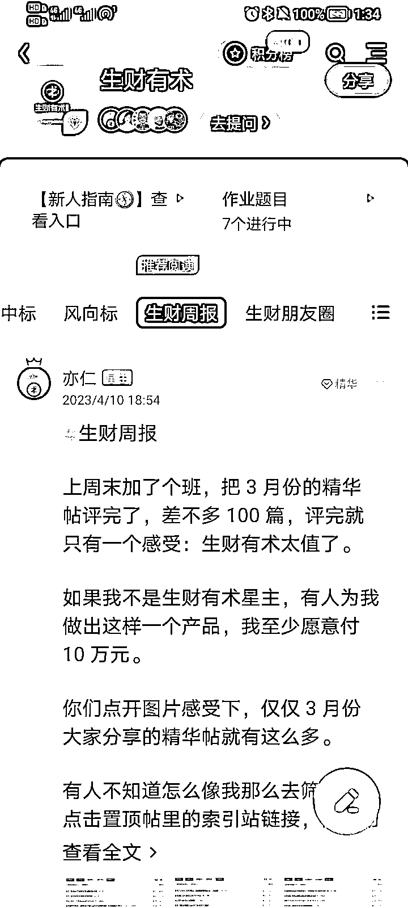
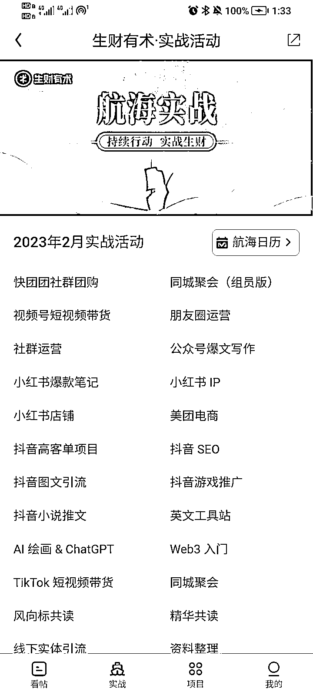
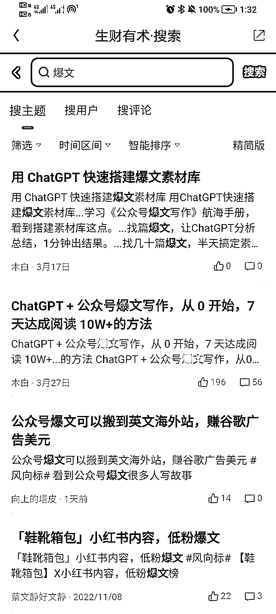

# 《无项目、无资源、无人脉的生财小白如何克服迷茫、尽快下场？》

> 原文：[`www.yuque.com/for_lazy/thfiu8/tdnfqm24sucnc01m`](https://www.yuque.com/for_lazy/thfiu8/tdnfqm24sucnc01m)

<ne-h2 id="84eaded1" data-lake-id="84eaded1"><ne-heading-ext><ne-heading-anchor></ne-heading-anchor><ne-heading-fold></ne-heading-fold></ne-heading-ext><ne-heading-content><ne-text id="ud96f464c">(124 赞)《无项目、无资源、无人脉的生财小白如何克服迷茫、尽快下场？》</ne-text></ne-heading-content></ne-h2> <ne-p id="u5c974e8c" data-lake-id="u5c974e8c"><ne-text id="u71449245">作者： 简冬阳</ne-text></ne-p> <ne-p id="uc33f5136" data-lake-id="uc33f5136"><ne-text id="u0c2bfe84">日期：2023-04-13</ne-text></ne-p> <ne-p id="ufbb11c47" data-lake-id="ufbb11c47"><ne-text id="u82dba81a">今天看到 @敏渝 发的帖子 https://t.zsxq.com/0dJ2Kqud6 ，</ne-text></ne-p> <ne-p id="u432a95c1" data-lake-id="u432a95c1"><ne-text id="u8f8ecd7c">感觉可能有很多无项目、无资源、无人脉、实战经验和知识储备较少的纯小白和我一样处于比较迷茫的阶段，</ne-text></ne-p> <ne-p id="uf648e243" data-lake-id="uf648e243"><ne-text id="u334c1291">所以把我目前摸索的小小心得总结如下：</ne-text></ne-p> <ne-p id="u2130b213" data-lake-id="u2130b213"><ne-text id="u7a9c3cf1">1\. 尽量不看生财的信息流。</ne-text></ne-p> <ne-p id="ue29da393" data-lake-id="ue29da393"><ne-text id="ube7de05c">为什么呢？漫无目的地看生财的帖子，很容易焦虑。</ne-text></ne-p> <ne-p id="u599ef435" data-lake-id="u599ef435"><ne-text id="u2f760cb3">而且小白嘛，本来就不自信了，看得多但行动没有跟上来，只会越来越不自信。</ne-text></ne-p> <ne-p id="u888b4922" data-lake-id="u888b4922"><ne-text id="u163ddc1d">久而久之，可能连生财都不想打开了。</ne-text></ne-p> <ne-p id="ucca51172" data-lake-id="ucca51172"><ne-text id="u47f0f7cb">这个问题如何解决呢？</ne-text></ne-p> <ne-p id="ub0c81231" data-lake-id="ub0c81231"><ne-text id="u3f0e6880">在生财里摸索了几天后，我认为可以从“生财周报”栏目下手。</ne-text></ne-p> <ne-p id="u412070bb" data-lake-id="u412070bb"><ne-card data-card-name="image" data-card-type="inline" id="omzeO" data-event-boundary="card"></ne-card></ne-p> <ne-p id="u40e73f15" data-lake-id="u40e73f15"><ne-text id="ue34a0fd3">这是亦仁对每周优质帖子的汇总。</ne-text></ne-p> <ne-p id="u2073642c" data-lake-id="u2073642c"><ne-text id="u044c4ac7">我们可以直接在里面筛选自己感兴趣的帖子。</ne-text></ne-p> <ne-p id="u7094392e" data-lake-id="u7094392e"><ne-text id="uda1bc8f8">筛选的标准是什么？</ne-text></ne-p> <ne-p id="u9d45ee3e" data-lake-id="u9d45ee3e"><ne-text id="uf3c123e7" ne-bold="true">嗯，我估摸着我也能这样做，或者，其中某一点是当下的我也能做到的。</ne-text></ne-p> <ne-p id="u9aaf8779" data-lake-id="u9aaf8779"><ne-text id="u64925ed2">如果你阅读的时候，心里产生了这样的想法，那么这就是你的心动之帖了，可以收藏起来、认真品读。</ne-text></ne-p> <ne-p id="u82ec490a" data-lake-id="u82ec490a"><ne-text id="ue4699203">记住，没必要囤自己目前不会去做的帖子。囤的内容越杂，越容易浮躁。</ne-text></ne-p> <ne-p id="udfb74735" data-lake-id="udfb74735"><ne-text id="u4dd7ecf3">生财的检索系统做的还是不错的，等到需要的时候再去找就好了。</ne-text></ne-p> <ne-p id="u092530c0" data-lake-id="u092530c0"><ne-text id="u4405dd94">2\.</ne-text> <ne-text id="u99a32226" ne-bold="true">越是小白，越要尽快地参与到实战中去、积累经验。</ne-text></ne-p> <ne-p id="ue22e680b" data-lake-id="ue22e680b"><ne-text id="u370d3b50">不能像以前读书时一样只阅读、只做笔记，那样就会变成纸上谈兵之人了。</ne-text></ne-p> <ne-p id="u49050b8c" data-lake-id="u49050b8c"><ne-text id="u79f19124">如何快速找到适合自己的实战项目呢？</ne-text></ne-p> <ne-p id="u5098e38f" data-lake-id="u5098e38f"><ne-text id="ue0607b34">在生财的索引站里找到“航海实战”。</ne-text></ne-p> <ne-p id="u280de781" data-lake-id="u280de781"><ne-text id="u68a87cf8">其中“公众号爆文写作”、“抖音小说推文”、“小红书资料引流”、“抖音图文引流”四个项目，</ne-text></ne-p> <ne-p id="u17becd75" data-lake-id="u17becd75"><ne-text id="u44fba1f4">应该是相对而言对已有资源和能力要求最低的。</ne-text></ne-p> <ne-p id="u27feec6c" data-lake-id="u27feec6c"><ne-text id="ua97cf9ec">（并没有说这些项目容易的意思，只是相对而言没有太多的前置条件或太高的门槛）</ne-text></ne-p> <ne-p id="u4b3a58ec" data-lake-id="u4b3a58ec"><ne-card data-card-name="image" data-card-type="inline" id="LWJTb" data-event-boundary="card"></ne-card></ne-p> <ne-p id="udec3428c" data-lake-id="udec3428c"><ne-text id="u61048e86">建议从中选择一个项目入手并专注于此，</ne-text><ne-text id="u89a529e6" ne-bold="true">在拿到第一个正反馈、即赚到第一块钱之前，不考虑别的项目</ne-text><ne-text id="u3b7172f1">。</ne-text></ne-p> <ne-p id="u97141b81" data-lake-id="u97141b81"><ne-text id="u2de7dde4">同时，针对自己正在实战的主题，在索引站里搜索相关的帖子，</ne-text></ne-p> <ne-p id="uc9ced0e5" data-lake-id="uc9ced0e5"><ne-text id="ub1d28871">比如你要做“公众号爆文写作”这个项目，就可以搜“爆文”、“写作”等等关键词，进行查漏补缺。</ne-text></ne-p> <ne-p id="u8a415602" data-lake-id="u8a415602"><ne-card data-card-name="image" data-card-type="inline" id="GCwLA" data-event-boundary="card"></ne-card></ne-p> <ne-p id="u7f76ca9a" data-lake-id="u7f76ca9a"><ne-text id="ud6049185">当然，关键词是需要你有意识地发散和收集的。</ne-text></ne-p> <ne-p id="u719d3db6" data-lake-id="u719d3db6"><ne-text id="uc0489624">关键词越多，你能找到的内容越多。</ne-text></ne-p> <ne-p id="ua38febf6" data-lake-id="ua38febf6"><ne-text id="uc421461f">3\. 找到了适合的学习资料，怎么做笔记？</ne-text></ne-p> <ne-p id="u733418e9" data-lake-id="u733418e9"><ne-text id="u3dccdd97">（1）尽量不要只是复制粘贴原文，最好每读到对自己有启发的内容，都记录一下想法，读一段记录一下。</ne-text></ne-p> <ne-p id="u1345d509" data-lake-id="u1345d509"><ne-text id="u272b2aec">让自己的大脑和帖子互动起来。</ne-text></ne-p> <ne-p id="uc5b82c07" data-lake-id="uc5b82c07"><ne-text id="u32a85a0b">（2）特别关注帖子里和实操有关的内容，可以改成问答卡片的方式。</ne-text></ne-p> <ne-p id="u8275e4bd" data-lake-id="u8275e4bd"><ne-text id="ue413f075">例如这是我读完这个帖子 https://gt2wd7d4rc.feishu.cn/docs/doccncrbY31kQcHXautpQz8DFwf#RCeptr 后总结的 1 个问答卡片：</ne-text></ne-p> <ne-p id="u754563b7" data-lake-id="u754563b7"><ne-text id="u35225714">如何找对标账号？</ne-text></ne-p> <ne-p id="u5b9b3543" data-lake-id="u5b9b3543"><ne-text id="uf5f8005b">1.发散关键词（要找规律） 2.在头条搜关键词，找到微头条栏目下优质内容的作者 3.顺着作者的关注列表顺藤摸瓜</ne-text></ne-p> <ne-p id="u0a7237b3" data-lake-id="u0a7237b3"><ne-text id="uf6caa75f">（3）做完笔记之后，总结一下自己下一步要做什么，越具体越好。</ne-text></ne-p> <ne-p id="ud59821e8" data-lake-id="ud59821e8"><ne-text id="u94d3be54">比如下面是我在读完“公众号爆文写作”后总结的微习惯，之后还会随着实践情况调整和补充。</ne-text></ne-p> <ne-p id="uc643c249" data-lake-id="uc643c249"><ne-card data-card-name="image" data-card-type="inline" id="viRtT" data-event-boundary="card"></ne-card></ne-p> <ne-p id="u370437c2" data-lake-id="u370437c2"><ne-text id="uaf0304a6">4\. 心态调整</ne-text></ne-p> <ne-p id="udd72e278" data-lake-id="udd72e278"><ne-text id="ufc4af856">最关键的是找到你自己的节奏。</ne-text></ne-p> <ne-p id="u71f57419" data-lake-id="u71f57419"><ne-text id="u140abda9">我是通过靠谱和醒醒进的生财，</ne-text></ne-p> <ne-p id="ua52904c7" data-lake-id="ua52904c7"><ne-text id="u1c5e32ac">陪伴群里的小伙伴有的已经写出精华帖了，</ne-text></ne-p> <ne-p id="u644af66f" data-lake-id="u644af66f"><ne-text id="u240587be">有的已经参考生财里的内容精进业务、每天变现四位数了。</ne-text></ne-p> <ne-p id="u7bb6d7cb" data-lake-id="u7bb6d7cb"><ne-text id="u3c354a1f">然后我就意识到，表面上我们都是第七期进生财的“同学”，</ne-text></ne-p> <ne-p id="u2bae6219" data-lake-id="u2bae6219"><ne-text id="u74ff5d69">但实际上，很多人已经在“罗马”了。</ne-text></ne-p> <ne-p id="uc3d08ab2" data-lake-id="uc3d08ab2"><ne-text id="u3bac538d">意识到这样的差距后，我反而觉得，真的不必焦虑了。</ne-text></ne-p> <ne-p id="u05b8eae1" data-lake-id="u05b8eae1"><ne-text id="u7430669e">（1）这证明，你真的进入了一个很不错的圈子。</ne-text></ne-p> <ne-p id="u42549871" data-lake-id="u42549871"><ne-text id="uc2bcccd8">如果愿意投入，你真的可以在这里学到很多</ne-text></ne-p> <ne-p id="ufa3404e5" data-lake-id="ufa3404e5"><ne-text id="u5c6d43a1">（2）这证明，你需要更加专注自己的成长。</ne-text></ne-p> <ne-p id="u4c4c5b26" data-lake-id="u4c4c5b26"><ne-text id="u7766fb2e" ne-bold="true">请每天为自己写成功日记吧，就以“我成功……”作为每句话的开头。</ne-text></ne-p> <ne-p id="u4de9b110" data-lake-id="u4de9b110"><ne-text id="ucd863ad6">比如我成功读完了 1 篇精华帖……</ne-text></ne-p> <ne-p id="u56ae13e4" data-lake-id="u56ae13e4"><ne-text id="u39fc6762">比如我成功剪出了第一条带货视频……</ne-text></ne-p> <ne-p id="u8ea3bf61" data-lake-id="u8ea3bf61"><ne-text id="uc0da51e9">比如我成功写了 1 篇 2000 字的文章……</ne-text></ne-p> <ne-p id="u5ad0b65e" data-lake-id="u5ad0b65e"><ne-text id="u1555785d">还可以是更小的成功：</ne-text></ne-p> <ne-p id="u55fed795" data-lake-id="u55fed795"><ne-text id="u5c979f4c">比如我成功摘录了一段对我很有启发的话……</ne-text></ne-p> <ne-p id="u5919c9c9" data-lake-id="u5919c9c9"><ne-text id="u553567e4">比如我成功找到了一个特别适合我的对标账号……</ne-text></ne-p> <ne-p id="u88f6d0eb" data-lake-id="u88f6d0eb"><ne-text id="u3a9ee09f">比如我成功写了 300 字的笔记……</ne-text></ne-p> <ne-p id="u6649b712" data-lake-id="u6649b712"><ne-text id="u8ba33e27" ne-bold="true">珍视你克服卡点的每一个瞬间，为你的每一个小进步庆祝，让一点一滴的小成功为你带来更大的成功。</ne-text></ne-p> <ne-p id="u3f498a69" data-lake-id="u3f498a69"><ne-text id="ub2f19ef0">我是简冬阳，希望这个帖子能为你带来一点小小的帮助。</ne-text></ne-p> <ne-hole id="uef70ab2c" data-lake-id="uef70ab2c"><ne-card data-card-name="hr" data-card-type="block" id="JSVKZ" data-event-boundary="card"><ne-p id="uc28afcaa" data-lake-id="uc28afcaa"><ne-text id="u3847e939">评论区：</ne-text></ne-p> <ne-p id="uad9c7d9e" data-lake-id="uad9c7d9e"><ne-text id="u9c8fb84b">刘逍遥 : 你一定像你的名字一样，冬日暖阳，很温暖，谢谢你的分享[太阳]</ne-text> <ne-text id="ud690fa23">醒娃 : 请问你们的陪伴群是什么，还加人吗？</ne-text> <ne-text id="u8cd83e71">在路上 : 就是老圈友和他的小伙伴</ne-text> <ne-text id="ud66fda4e">佛香 : 加入生财快一个月了，由于工地上太忙，一直没来得及认真研读，再一个，宝藏群的信息量确实大，不仔细筛选容易越看越焦虑。另外正反馈很重要，能让我们坚持下去，祝圈友们生财有术！！</ne-text> <ne-text id="ue0ecc981">方言 : 太有用了，感谢分享[抱拳]，为同样迷茫不知所措的圈友们指明了一条简单可行的路径。我也加入快一个月了，要赶快行动[奋斗]</ne-text> <ne-text id="u559eb6bf">丑八怪 : 感谢分享，确实对新手很有用</ne-text> <ne-text id="u8c4f538e">醒娃 : 好的，我看到了，这两天最新的文章分享里有说这个</ne-text> <ne-text id="u0ae226d6">王嘟嘟 : 感谢分享</ne-text></ne-p></ne-card></ne-hole>