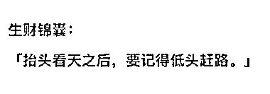
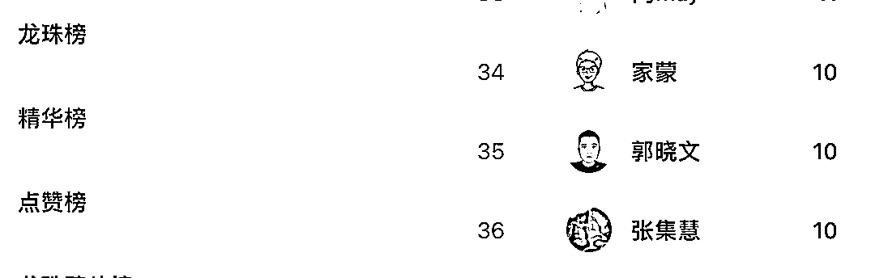

# 《生财实用案例锦囊：从搞钱新手到最懂新手的男人，我在生财有术的三年》

> 原文：[`www.yuque.com/for_lazy/thfiu8/gvroocxpycp8fdc5`](https://www.yuque.com/for_lazy/thfiu8/gvroocxpycp8fdc5)

<ne-h2 id="35467feb" data-lake-id="35467feb"><ne-heading-ext><ne-heading-anchor></ne-heading-anchor><ne-heading-fold></ne-heading-fold></ne-heading-ext><ne-heading-content><ne-text id="u178a9042">(138 赞)《生财实用案例锦囊：从搞钱新手到最懂新手的男人，我在生财有术的三年》</ne-text></ne-heading-content></ne-h2> <ne-p id="u0c2ce7e7" data-lake-id="u0c2ce7e7"><ne-text id="u3d2983f1">作者： 郭晓文</ne-text></ne-p> <ne-p id="ub722feb6" data-lake-id="ub722feb6"><ne-text id="u8d40fdc9">日期：2023-04-12</ne-text></ne-p> <ne-h2 id="f2e7d8b6" data-lake-id="f2e7d8b6"><ne-heading-ext><ne-heading-anchor></ne-heading-anchor><ne-heading-fold></ne-heading-fold></ne-heading-ext><ne-heading-content><ne-text id="u29424566">【生财使用实例&锦囊】从搞钱新手到最懂新手的男人，我在生财有术的三年</ne-text></ne-heading-content></ne-h2> <ne-p id="u60ea6aaf" data-lake-id="u60ea6aaf"><ne-text id="u0f131f13">大家好呀，我是最懂新手的男人——郭晓文。</ne-text> <ne-text id="u4dd5baf4">今天的内容，即是和大家聊聊我这三年和生财有术的故事，也给大家留下了一些正确使用生财有术的锦囊。</ne-text> <ne-text id="ud8ce795b">当你焦虑的时候，当你不知道怎么使用生财有术的时候，不妨拿出这篇文章看看，相信会对你有所帮助。</ne-text></ne-p> <ne-p id="u63df5676" data-lake-id="u63df5676"><ne-text id="u950f7898">三年前，我作为一个搞钱新手加入生财有术。</ne-text> <ne-text id="u30cb60ea">三年后，我不仅自己搞成了好多项目，也通过做社群、训练营、做分享的形式，带许多人成功跨出了搞钱第一步，也在生财留下了 10 篇精华帖。</ne-text></ne-p> <ne-p id="u8b7f5ad4" data-lake-id="u8b7f5ad4"><ne-text id="ud0551731">可以说，我这三年的成长和发展，都和生财有术密切相关。</ne-text> <ne-text id="ucfabba83">源于生财，就应该回馈给生财。</ne-text> <ne-text id="u9e3c9c03">今天，我就把自己这三年和生财的故事，分享给大家。</ne-text> <ne-text id="u05085a13">希望，有更多的人，可以通过正确使用生财有术，发展起来。</ne-text> <ne-text id="uc5d14dbc">我很期待。</ne-text></ne-p> <ne-p id="uc9c91ee6" data-lake-id="uc9c91ee6"><ne-text id="u8e6e3686">长文请移步飞书</ne-text> [<ne-text id="ub2dc6a91">https://ro14u4yq4i.feishu.cn/docx/LE3Ad03QAoTJWWxZ8jBcFBKXnEy</ne-text>](https://ro14u4yq4i.feishu.cn/docx/LE3Ad03QAoTJWWxZ8jBcFBKXnEy)<ne-card data-card-name="image" data-card-type="inline" id="AqONo" data-event-boundary="card"></ne-card></ne-p> <ne-p id="ub5280e73" data-lake-id="ub5280e73"><ne-card data-card-name="image" data-card-type="inline" id="w4u35" data-event-boundary="card"></ne-card></ne-p> <ne-p id="ua0914ebf" data-lake-id="ua0914ebf"><ne-card data-card-name="image" data-card-type="inline" id="tVnSG" data-event-boundary="card"></ne-card></ne-p> <ne-hole id="ud90c50f1" data-lake-id="ud90c50f1"><ne-card data-card-name="hr" data-card-type="block" id="xlsZW" data-event-boundary="card"><ne-p id="uba7cc329" data-lake-id="uba7cc329"><ne-text id="uc551b785">评论区：</ne-text></ne-p> <ne-p id="uaa0533a5" data-lake-id="uaa0533a5"><ne-text id="u9cb4a9bb">郑鹏鑫 : 大佬好[呲牙]</ne-text> <ne-text id="u4e82ffdb">简冬阳 : 看完之后，嗯，不愧是最懂新手的男人</ne-text> <ne-text id="u0f35b434">鹿野 : 大佬带我一起[愉快]</ne-text> <ne-text id="u4a5705b9">徐子然｜子然随笔 : 经营好自己的现在，等着未来飞奔而来</ne-text> <ne-text id="uabc48d3d">书情小跟班 : 感谢分享</ne-text> <ne-text id="u4102cced">Kerwin : 最懂新手的男人</ne-text> <ne-text id="ud0d54051">玩转 ChatGPT : 感恩无私分享</ne-text> <ne-text id="ubd3b2f27">金可 : 晓文哥 棒棒棒</ne-text></ne-p></ne-card></ne-hole>