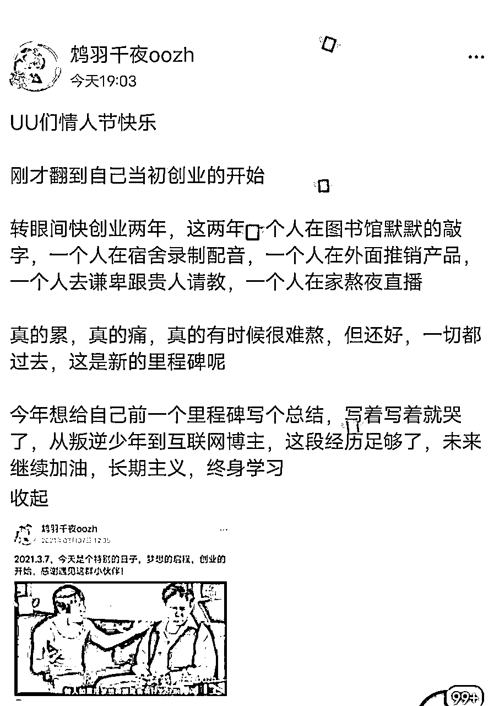
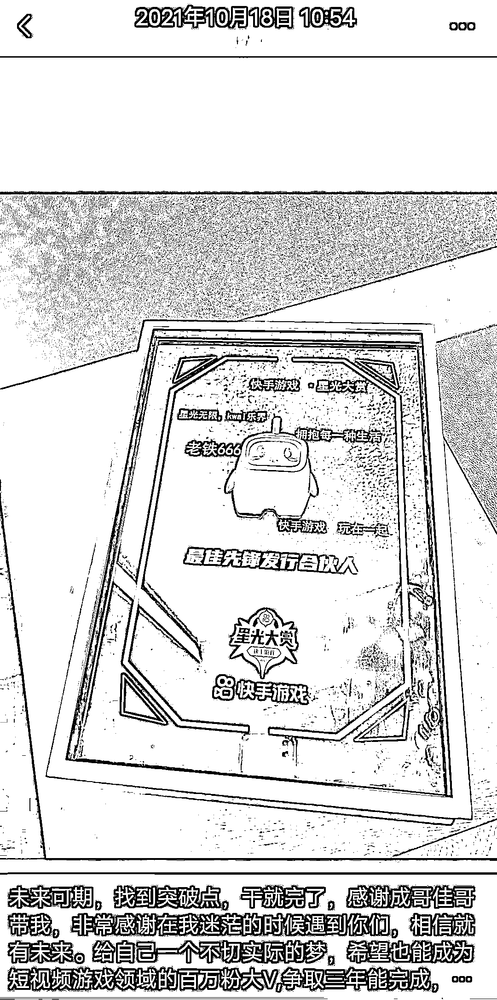
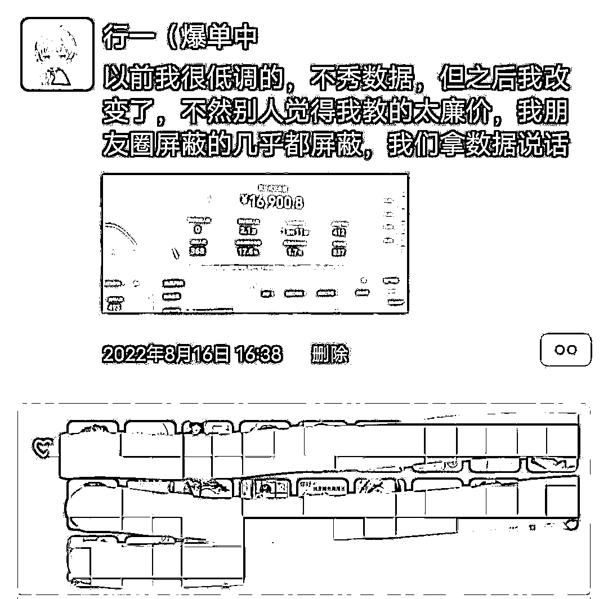
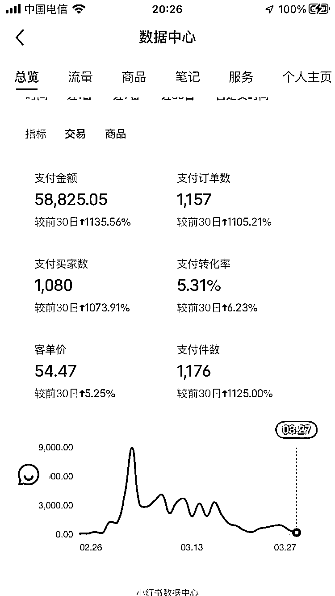

# 《大学生两年变现 30w，我是怎么做到的》

> 原文：[`www.yuque.com/for_lazy/thfiu8/gsnue6g8u7rgglcp`](https://www.yuque.com/for_lazy/thfiu8/gsnue6g8u7rgglcp)

## (154 赞)《大学生两年变现 30w，我是怎么做到的》 

作者： 行一 

日期：2023-04-11 

# 前言 

生财有术的圈友，大家好，我叫行一，02 年终身学习者，大三学生，一位 00 后副业博主，一位 00 后创业者。 

接触互联网刚过两年，变现超过六位数，向着七位数努力。 

现在的结果，我非常感谢生财的贵人前辈们，一路上有他们的帮助，才有我行一的今天。 

我从大一创业到大三，但只破了六位数，没什么拿出手的成绩，但我自己的一些经历肯定可以给生财的新手家人们提供参考 

 

上图是写这篇文章写着写着就动心了，看着这个 QQ 空间，就慢慢泪水流下来了。 

首先，我想来讲一下为什么写这篇文章： 

1.  一肯定是感谢帮助我的一些贵人前辈们。 

2.  二是希望帮助许多跟我当初一样的新手家人们，还在寻找项目中，还在想实现自己的事业，提供一些方向。 

1.  但我想说的是，在现在的大环境下，一定要重视自身的积累，当你积累到一定程度，就可能会碰上某个风口爆发，我就是其中一个。 

接下来都是我自己的实战经验加上一些认知的思考，本文从以下几个方面进行叙述： 

1.  进入到互联网创业的背景 

2.  开始的契机 

3.  做项目过程中思路和感悟 

4.  跑通的项目带来的收获 

5.  目前取得的成就 

6.  目前的方向及后续发展 

7.  感谢生财的贵人前辈们 

8.  新手做项目的一点建议 

# 进入到互联网创业的背景 

傲气受挫 

其实在没进入互联网创业之前，我是个躺平网游少年，因为高中三年太累了，累到最后付出跟收获不成正比。 

高中在实验班的三年，根本不知道自己追求是什么，也是这种迷茫使我心态奔溃，经常会感觉学习没用，最终还是失败了。 

本来我还是班上前几，高考完全班倒数，我记得填志愿时，但大家都在说我考的好，我那时真的很难受，也是一个傲气的人第一次尝试心态失败的滋味。 

摆烂躺平 

所以进入大学就是躺平，平时几乎都是打游戏，记得刚好有款游戏发行是原神，我是真的肝，肝到了前列玩家。 

然后就是上课，坐后排直接打游戏，有时候还逃课去翻墙出去玩，校园里的墙被我翻烂了，有一次还被保安追，幸好跑的比较快，一学期就这么过去了。 

激起赚钱欲 

假期回到家就很焦虑，特别是亲戚说我十八岁了，还在家打游戏，那时候内心搞钱的想法很强烈，想证明自己是可以的。 

可能也跟年少时跟父母说，十八岁后就能养活自己有关，这种搞钱的想法很强烈，就这样上网搜索一些搞钱，创业，关注了不少创业的公众号。 

其实说真的，创业真的太广泛了，信息越多越焦虑。 

进入圈子 

也就这样搜索公众号文章认识到一位博主@狗哥了，狗哥的那篇 2021 年 1 月 3 日一个普通人赚到一千万的独白恰好被我看见了，就这样看那位博主文章。 

狗哥真的很接地气，一想又跟我老乡，我看他公众号开始慢慢有了创业的萌芽。 

通过狗哥的推荐认识到生财有术，还有帅张，那时候看狗哥刚开始做社群，我就没加入，进我第一个大偶像帅张的星球，张哥也是我老乡，一种莫名的亲切感。 

第一次付费社群，也不怕圈友笑话，那一晚我真的很心疼，可能我第一次知识付费，没有明白知识付费的好处。 

现在只要你的社群有价值，我会毫不忧虑付费，心疼干啥，投资自己是最大的投资，这就是认知的改变。 

# 开始的契机 

遇到贵人 

当初刚进入星球跟一些小白一样，疯狂看，给大脑输入许多知识，进入一个几乎是程序员的星球，都是大佬，许多都是名校毕业的，但我看到眼花缭乱的信息后真的感觉越来越焦虑。 

然后在这里认识人生第一个对我有很大帮助的贵人@拱卒，就这样开始自己真正的互联网实干经验，之前也付费了一些项目，但可能是自己问题没做起来。 

在贵人的社群里找到许多同频的朋友，一位同龄大学生@张梦才就是其中我要学习的重要一位，我在快手小游戏主要就是跟大佬抄，请教朋友问题。 

你们能想象我第一次做抖音才发第一个就给我封号了，那晚真的感谢游戏师傅@金成给我心理疏导，跟我说他做了三个月抖音一分钱没赚到还亏了 200 的豆荚，就这种坚持必将带来成功。 

我也在小游戏搞了自己的第一笔互联网赚的钱，我没赶上七月的风口，进晚了靠骚操作搞了几个搬运号赚了小一万左右。 

老实来说真的对不起原创作者，不过搬运是真香，我给结尾加点诱导直接起飞，内容都是别人辛苦做的，我直接二创剪辑。 

在九月我听了贵人一些建议，好好做原创，我看到群友拿押金在贵人那坚持打卡，我九月初就在师傅那要求自己每天必须发视频内容。 

坚持一个月了，终于自己的第一个快手原创游戏素材破了百万播放，无意中的惊喜，期间也搞了许多骚操作但都没啥结果，哈哈哈，所以搞正反馈最快的就是抄同行。 

贵人朋友不仅教会我做事，还教会我成长，我的成长贵人是看着我变化的，教人底层逻辑真的很难得。 

其实最重要就是认知，要给我早点看穷爸爸富爸爸，我可能就找到自己的目标，不至于迷茫了整整十八年。当时虽然学习还好，但根本不知道自己追求的是什么，这点只有我自己内心清楚。 

然后可能也是家里做生意耳濡目染了，经常觉得不读书也可以搞钱，现在突然醒悟了过来，人生最重要的就是活得有意义，赚钱只是顺带的，学习就是终身学习。 

我明白自己会的还是太少了，到现在才掌握一点谋生的本领。钱会一直流向不缺钱的人，这其中的因素太多。 

# 做项目过程中思路和感悟 

#### 校园跑腿小程序 

这是我在朋友圈看到一个学长做的项目，跟他联系后，想加入他的团队。 

那是我第一次被信任，他邀我讲讲我的想法，我给大家讲了一些我的想法，包括后面的一系列计划，那是我第一次讲自己的创业想法。 

我感觉计划的好全，各个部门都搞好，寻找创业伙伴，我负责新媒体部，负责公众号的部分，那是我第一次尝试。 

我那晚写自己的媒体运营策划书，后来干了一个月，由于跟表白墙的小程序冲突，被恶意竞争了，最终宣布团队的解散。 

后来看了一些运营管理的书后，总结了一些经验： 

1.  首先部门不能搞太多，要有一条稳定收益的主部门 

2.  后面再开始其他的部门，在尝试中慢慢改正 

1.  再跑项目时，我都以最低成本，最低时间，去跑通然后再放大，一定要明白自己的成本，时间成本。 

不要什么都没有搞通然后就大干，结果 90%注定是失败。 

#### 知乎好物及个人 ip 打造 

写知乎大约写了四个月，也通过去年 618 赚了几千。 

知乎确实是个好的内容平台，我玩的时候知乎好物已经趋于稳定，只能从支流汇主流玩，就是农村包围城市的玩法。 

知乎好物第一个月是我最难熬的日子，写着没结果，心态一次次崩，执行力也不足，就是韭菜小白。 

也怀疑过自己，也想过坚持，最终找老师，被老师骂了一顿我开始醒悟，好好反思，最终一个月后开始有成果了，后来就每周坚持。 

我其实啥都不会，就照着别人的洗稿，然后自己慢慢就会写了。先抄后超，适合所有项目，别人怎么干你就抄，抄完有成果再创新，不要刚开始就创新，那叫往坑跳。 

这个项目让我明白了，执行力和心态对于一个项目的重要性，这可不是单单两个名词，是对这两个词的践行。 

你没有这些没关系，这些都可以慢慢练习，我需要你有一个愿意改变的心。 

#### 快手小游戏、棋牌及手游 

从不会剪辑到剪辑，差不多十分钟一条，批量化模板可以做到十分钟一条，这都是我的经历。 

第一次做游戏视频，我假期一天才搞一条，实在什么都不会，一步一步问老师和群友，坚持十几天。 

看到群里一位朋友的收益我开始反思，开始琢磨，最后通过自己的复盘，和老师的建议找到了模板开始疯狂套。 

那位朋友让我明白要放大，批量化操作，我买了其他手机开始批量化制作，疯狂做视频，那段时间真的很拼搏，带来的收益也很高。 

 

小游戏随着国家对游戏实名的要求，收益明显降低，那段时间很痛苦，这路子走不了。就要寻找新的项目，刚好遇到了棋牌，就好好做棋牌。 

刚开始做棋牌我就是抄别人的，同行是最好的老师，然后后来我开始放大时活动没了，那个活动太值了，我又错过了放大。 

手游我找了许多对标，最终看到了中国玩家那种，刚开始配音自己配找不到感觉，最让我难忘的是在寝室配音，只要我不尴尬，尴尬的就是别人。 

玩抖音的第一次作品号就被封了，心里也挺难过的，找老师交流，老师给我调节心态，反正我没事就找老师，跟老师交流我的想法，得到反馈，不断进步。 

之后摸索了一个月抖音团购，本来想到了东北做团购，做探店，奈何突然的疫情让我放弃了团购。 

团购我做到了 4000 粉丝，有商家来找我探店，不过这真的不适合现在的我，去了学校我就封寝，实在不得不放弃。 

项目的开始就是要有一个自己的时间规划： 

1.  测试期，红利期，稳定期，下坡期； 

2.  要建立自己的护城河，建立门槛 

3.  要有一个践行过程：行动，反馈，优化，积累，爆发。 

这就是一个好的过程，过程是能给你更多锻炼自己的能力。 

按现在我的测试周期，一个项目起码要给自己一个月的行动时间，后面没什么意外就可以很稳定，像小游戏就除外，政策一来就变了。 

#### 蓝海书单 

刚开始我就给自己列了一个计划表，时间设置在 21 天内出一单，结果我 17 天时快手爆了，之后掌握了方法不断放大。 

做视频，我收获到的就是： 

1.  先找到同行，拆解他的账号，然后先模仿他一周，有成果继续，没成果换个同行，继续抄； 

2.  号多可以模仿好几个同行，别人可以我也可以，别人能赚我也可以赚。 

3.  之后放大要搞自己的视频模板，搞自己的文案模板，不断放大。 

执行力是可以靠刻意练习提高的。 

比如你某段时间把所有其他事物全抛了，特别是大量信息输入的环境，就专注一件事，慢慢你执行力就提高了。 

我刚开始练专注把自己分心的事物全写出来，现在基本能专注一小时后才可能会分心，干就完了，专注就完了。 

#### 电商的探索 

我自己做任何选择，会把它列出来，看了一些社群的互联网项目，我开始明白电商是稳定的项目，视频就靠爆发，所以自己小小测试了一下电商。 

我尝试了闲鱼，闲鱼开通了 Pro，电商还是要动销率，就是你出单高，链接转化高，平台就给你更多流量，你就能稳定出单。 

未来可能会搞无货源，或者有货源的蓝海电商领域。 

这是我认为以后的稳定项目，也是我未来的工作室必干的，红海打到蓝海，蓝海领域可以出现高收益。 

不知道为什么，高中就有做电商的想法，但看到蓝海产品的收益，绿植还有宠物用品的销量，心里肯定不舍。 

#### 视频号搬运无人直播带货 

风口的项目，根本不需要你干啥，只要做了就有收益，真就如此。 

第一次直播过万 GMV，这对我的成长路上是很有意义的 

 

我搬运别人的视频，撸别人的直播素材，就重复以下方式： 

1.  视频爆了直播 

2.  无人直播，靠一些新奇特素材把号起来，然后开播，场场开播人数破万，随便干干啥，就能搞钱。 

不说了，风口过去了，平台的打压，同行的妒忌，让我有很多焦虑，再继续下去只会越来越痛苦，把直播舍弃了，自己好好钻研这个私域流量，学习搞流量，并将流量转化。 

#### 小红书引流和小红书电商 

现在知道我的人都知道我是做小红书的，前面的实干经历可能都早已忘记，但这些都是我人生中宝贵的财富。 

的确如此，我视频号吃了风口就在考虑长期主义，最终确定了真正的长期主义就是私域，我花半年时间一直学习各种引流，关自己做的引流策划文档和同行拆解不少于 5w 字。 

我主要是引流教育私域，做高中提分和学习方法类这块，之后也想跑考研这块，我比较热爱教育。现在做的项目都是积累自己的资本。 

在跑流量的前提下，我团队跑了一下小红书电商，目前应该我属于前列玩家，这个风口得感谢我的朋友，他给我看了案例，我跑起来很快，马上放大。 

电商最近战绩，站在风口，猪都能上树。 

 

这不得不感谢自己之前电商的尝试。现在我带着差不多 1000 人的这个的公益项目，算帮助一些新人跑通 0 到 1，利他就是利己。 

# 跑通的项目带来的收获 

做互联网项目两年时间，真的收获很大，有贵人，有成长，有认知，有学习。 

在做这些项目中认识一批同频的小伙伴，还有一些帮助我的圈友，真的感谢他们，贵人的相遇之恩，成长的逆袭，认知的快速提高，学习的效率提升。 

我想说说自己做的项目，互联网项目太多了，我做的不算多，但本身拆解一下就知道。 

“流量-产品-转化”这个模型适合所有项目，把所有项目这样一拆解，就明白了。 

知乎 

知乎吃的就是搜索流量，还有现在的投流。 

了解平台的推荐机制，去不断搞好内容，搜索流量标题，还有内容的一个模板，内容和布局一定要好，这个抄同行就好了。 

最重要的就是坚持，不要有做三个就爆的心理，有那种想法赶快删掉。 

要有做 30 个爆一个，做 300 个爆 10 个的心理，这是最低预期，能不能熬就看这个，能不能超越别人也看这个。 

抖音快手 

抖音快手也差不多是这个原理。 

视频剪辑不会，剪辑一个肯定慢，剪辑 10 个，再到剪辑 100 个，慢慢就成了剪辑高手。 

内容也是在剪辑模仿同行学会的，自己总结复盘，想想自己为什么这个爆了，那个没爆的原因，总的这些都是搞流量的方法，只能算流量那一块。 

不能变现的流量就不要搞，我们做视频的目的就是变现，所以做什么视频很重要。 

游戏变现可以带小程序，可以接商单，小说可以给知乎推会员，总之做视频一定要变现。 

就是多做多抄，慢慢就会了，付费只是少些试错成本，有个老师带你，但还要自己行动。 

视频加上带货变现，就是很牛逼，视频号刚开始搬运就有平台推流，流量直接卖货，然后直播转化率更高，简直是风口。 

我选好品搬运，直接带货。 

这可能是我第一次感受过的风口，下一个风口也不知道是什么，风口积累的东西使我有更多机会去做接下来的事。 

短视频带货最重要是选品，爆款可以像素级复制。 

我看到有的朋友直接找人实拍卖美妆，爆款能爆的素材拆解就知道，基本都是人性的痛点。 

可以说，许多搬运号都是痛点品，痛点品真香，视频号人群的属性，贪小便宜，直接找低价低廉的品带货，然后橱窗放高价商品。 

对于直播我自己钻研了两个月，有自己的一套打法，直播流量太猛了。 

利用好人性，好奇，白嫖，场观一下就上来了，无非就是人货场的打造，先直接降维打击可以复制的直播间，同行就是最好的老师。 

大家也知道我是学生，所以直播暂时舍弃了。未来把私域做好之后，我会干直播工作室，这也算我在这里写的小梦想。 

掌握底层逻辑，任何项目都可以去做。 

不要听信别人对项目的评价，真正搞钱的都是偷偷撸，没那个时间去说这项目如何，那项目如何。 

不信你去看看视频号无人直播，现在有的说不行，人家不还是天天直播。还有现在的小红书电商，我团队的店铺数据都是很猛的。 

我相信生财的圈友也可以，我也就两年互联网创业时间，还在继续努力学习，也感谢圈内大佬的优质文章分享。当初我也是一个新人，现在勉强比新人好点。 

# 目前取得的成就 

具体来说，还谈不上什么成就，全部总结下来，就以下 3 点了： 

1.  靠视频号这个风口，破了第一个六位数，小红书电商两个月利润稳定 8w＋。 

1.  之前做过百万游戏视频的播放，还有视频号单日 GMV 破五万，这些我觉得是风口带来。 

1.  最大的成就就是掌握到做项目的底层逻辑和一套 sop。 

# 后续发展与思考 

目前靠视频号这个风口赚了一笔，现在视频号还可以玩，但我自己在校玩不了，只能舍弃这些东西我会，我就可以复制。 

对于接下来的发展，首当其冲的就是私域流量的积累，然后专注聚焦坚持于小红书，还是小红书引流做私域运营。 

做视频的大佬也在说私域，做电商的大佬也在说私域，微信永远是自己的，这是一种长期复利的收益。 

我现在非常重视私域的一些项目，学习搞流量，直播引流，视频引流，图文引流，还是回归到流量为王的时代，重视私域的积累。 

产品可以合作，可以自己让下面人搞，转化可以通过一些运营和活动进行提高，但最终还是流量。 

这里我也要感谢一些厉害的 00 后大佬，感谢分享他们的创业经验，感谢给我讲了他的一些想法，对于这些 00 后，就是我学习的对象。还有目前跟一些千万大佬的交谈，我更明白私域的重要性。 

私域符合长期，复利，还有所谓的管道收益，需要一直践行下去，一位互联网人一定要学会搞流量，而且流量要精准。 

最重要的一点就是要走出去，去线下走走，会进步很快，找到合适的人，直接跟他学习，会进步飞速，我就是，希望在生财这里能进步更多。