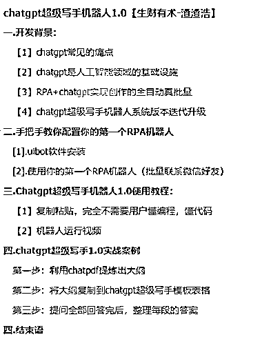

# 《全自动，真批量——ChatGPT 超级写手机器人 1.0 》

> 原文：[`www.yuque.com/for_lazy/thfiu8/emgky8xn4l202av6`](https://www.yuque.com/for_lazy/thfiu8/emgky8xn4l202av6)

<ne-h2 id="13f7fa9d" data-lake-id="13f7fa9d"><ne-heading-ext><ne-heading-anchor></ne-heading-anchor><ne-heading-fold></ne-heading-fold></ne-heading-ext><ne-heading-content><ne-text id="u04f26068">(97 赞)《全自动，真批量——ChatGPT 超级写手机器人 1.0 》</ne-text></ne-heading-content></ne-h2> <ne-p id="u6f0d0110" data-lake-id="u6f0d0110"><ne-text id="ua8ba5973">作者： 渣渣浩</ne-text></ne-p> <ne-p id="uef4c14c6" data-lake-id="uef4c14c6"><ne-text id="u189a5001">日期：2023-04-10</ne-text></ne-p> <ne-p id="u4cc39081" data-lake-id="u4cc39081"><ne-text id="ud8789245">全自动，真批量——ChatGPT 超级写手机器人 1.0</ne-text></ne-p> <ne-p id="u1527d187" data-lake-id="u1527d187"><ne-text id="u5bd70aa6">用 chatgpt 写作时常常遇到以下问题：</ne-text></ne-p> <ne-p id="ud33b05a5" data-lake-id="ud33b05a5"><ne-text id="ucb43c1ee">01.写了一段，没写完就停了</ne-text> <ne-text id="ub2ed355d">02.停了之后，你发继续写，上下文衔接不上来，甚至毫不相干</ne-text> <ne-text id="u43d0dee5">03.提问和和回答都需要手动复制粘贴</ne-text> <ne-text id="uf37e9709">04.提问次数多了，整理提问回答很麻烦</ne-text> <ne-text id="u530c9403">05.提问回答无法自动保存</ne-text> <ne-text id="ue2282c6f">06.chatgpt 的提问回答次数有限，不能太多，也不能太快，如果用多账号多浏览器解决问题，人工守着去处理停顿故障很费人力。</ne-text> <ne-text id="u0869f91a">07.所有人都说了 chatgpt 可以自动，批量，但是没人敢说，全自动，真批量。</ne-text></ne-p> <ne-p id="ufa0265e1" data-lake-id="ufa0265e1"><ne-text id="u764ed294">本文将完美解决以上问题</ne-text> [<ne-text id="ua4d92bfe">https://juejinniu.feishu.cn/docx/IOL6dRP5yo30bxx7aUKc25nWn5c</ne-text>](https://juejinniu.feishu.cn/docx/IOL6dRP5yo30bxx7aUKc25nWn5c)<ne-card data-card-name="image" data-card-type="inline" id="euRbh" data-event-boundary="card"></ne-card></ne-p> <ne-p id="u7e32ad62" data-lake-id="u7e32ad62"><ne-card data-card-name="image" data-card-type="inline" id="tMJyk" data-event-boundary="card"></ne-card></ne-p> <ne-p id="u3bc653e8" data-lake-id="u3bc653e8"><ne-card data-card-name="image" data-card-type="inline" id="EsHW0" data-event-boundary="card"></ne-card></ne-p> <ne-hole id="uef783242" data-lake-id="uef783242"><ne-card data-card-name="hr" data-card-type="block" id="bZZLf" data-event-boundary="card"><ne-p id="u17709acb" data-lake-id="u17709acb"><ne-text id="u9335476f">评论区：</ne-text></ne-p> <ne-p id="u0e80553f" data-lake-id="u0e80553f"><ne-text id="u2a423c38">陆左 : 打不开</ne-text> <ne-text id="uc261a18d">AI 训练师小凡 : 没有权限访问</ne-text> <ne-text id="uf2131007">渣渣浩 : 好了，权限忘记开了</ne-text> <ne-text id="ubb91347e">渣渣浩 : 好了</ne-text> <ne-text id="ub7e4d338">周彦充 : 空了，真的可以好好研究下，这个 PRP 要学多久，多少个小时。</ne-text> <ne-text id="u991efd19">陆左 : 里面的文档都没权限</ne-text> <ne-text id="u55b87aaa">渣渣浩 : 不用学，拿来急用，有源码</ne-text> <ne-text id="u31ed2e25">渣渣浩 : 都开好了</ne-text></ne-p></ne-card></ne-hole>