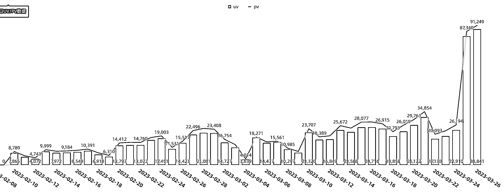
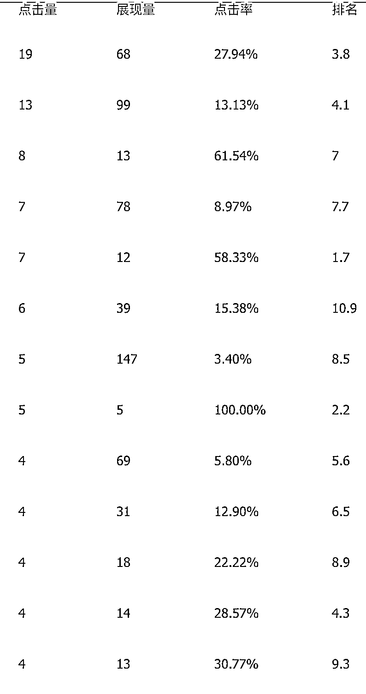

# 《普通人不得不拥抱的 AI 站群》

> 原文：[`www.yuque.com/for_lazy/thfiu8/kybhomc0a9wqav1d`](https://www.yuque.com/for_lazy/thfiu8/kybhomc0a9wqav1d)

<ne-h2 id="e2d8529c" data-lake-id="e2d8529c"><ne-heading-ext><ne-heading-anchor></ne-heading-anchor><ne-heading-fold></ne-heading-fold></ne-heading-ext><ne-heading-content><ne-text id="u5a4aa020">(66 赞)《普通人不得不拥抱的 AI 站群》</ne-text></ne-heading-content></ne-h2> <ne-p id="uc2283825" data-lake-id="uc2283825"><ne-text id="u18a350b0">作者： 陈俊强</ne-text></ne-p> <ne-p id="u50838661" data-lake-id="u50838661"><ne-text id="u3d563230">日期：2023-04-10</ne-text></ne-p> <ne-p id="ubbac3823" data-lake-id="ubbac3823"><ne-text id="uf72d27d1">各位老板，菜逼陈俊强来报道。</ne-text></ne-p> <ne-p id="u4f38f0ca" data-lake-id="u4f38f0ca"><ne-text id="u09c3a7b0">先发截图，再说做什么事情。</ne-text></ne-p> <ne-p id="u54e0f070" data-lake-id="u54e0f070"><ne-card data-card-name="image" data-card-type="inline" id="TJ6O7" data-event-boundary="card"></ne-card></ne-p> <ne-p id="u6b42ee71" data-lake-id="u6b42ee71"><ne-text id="u0eb89795">请尽早拥抱 ai 站群。</ne-text></ne-p> <ne-p id="ud32c38d6" data-lake-id="ud32c38d6"><ne-text id="u644a884b">可以翻看我往日的文章，对于 seo 这个古老事务，可能很多人已经不屑于聊这个东西了。</ne-text></ne-p> <ne-p id="u9d7d6aa8" data-lake-id="u9d7d6aa8"><ne-text id="ue84ffdad">再看看下面的数据。</ne-text></ne-p> <ne-p id="ub6a06317" data-lake-id="ub6a06317"><ne-text id="u99aa6d9e">古老的站群，带来了这么多流量。而且躺赚就可以来的流量。</ne-text></ne-p> <ne-p id="u2d2d1998" data-lake-id="u2d2d1998"><ne-text id="u9a5abdbf">有人问，大概一天能够加多少微信，我说了保底 100 个+（保证不打脸）</ne-text></ne-p> <ne-p id="u7b96f45b" data-lake-id="u7b96f45b"><ne-text id="udc77a78a">好了，下面开始说如何做到上面的结果。</ne-text></ne-p> <ne-p id="ue8533766" data-lake-id="ue8533766"><ne-text id="ub28438b6">下面叫做有依据的 SEO 公式。</ne-text></ne-p> <ne-p id="u11398f1f" data-lake-id="u11398f1f"><ne-text id="u8b00a5d6">回到最朴素的公式。</ne-text></ne-p> <ne-p id="u4f8c4be8" data-lake-id="u4f8c4be8"><ne-text id="u5a0b0ddd">流量 =   网页数 * 收录率 * 关键词日搜索数* 上首页率 * 首页点击率</ne-text></ne-p> <ne-p id="uae9a94be" data-lake-id="uae9a94be"><ne-text id="u07a73ee3">那么假设你的目标是一天 是 1 万 UV ，那么</ne-text></ne-p> <ne-p id="u4d2bd1ea" data-lake-id="u4d2bd1ea"><ne-text id="u90b384fe">最大单日流量 = 100 万 * 10% * 1 * 20% *  50% =  1 万 UV</ne-text></ne-p> <ne-p id="u1551d15e" data-lake-id="u1551d15e"><ne-text id="u46a42215">除了关键词给我隐藏掉了，其他都是真实数据。</ne-text></ne-p> <ne-p id="u1e22a44d" data-lake-id="u1e22a44d"><ne-text id="u8b6bd619">我怕你看公式痛苦，这样来说： 100 万的网页 * 百分之十的收录 * 每个页面的日搜索量为 1 * 每个页面的上首页的概率为 20%*首页给人点击到的概率是 50%</ne-text></ne-p> <ne-p id="uca9d72cd" data-lake-id="uca9d72cd"><ne-text id="uaffdf7ee">网页数：指的是是 100 万网页</ne-text></ne-p> <ne-p id="uf1d0ff24" data-lake-id="uf1d0ff24"><ne-text id="u47d985f3">收录率：1 万个网页，就收录 1000 个页面。如果是新站，可能是 3 个月都是 0 收录，或者是收录 1，期间你可能发的页面都没用</ne-text></ne-p> <ne-p id="uee5819d7" data-lake-id="uee5819d7"><ne-text id="uc4613be5">关键词日搜索：每天 1 个搜索量，在百度里面对应就是月搜 30 个。</ne-text></ne-p> <ne-p id="u782e533c" data-lake-id="u782e533c"><ne-text id="ue5ff7791">首页点击率 ：指的是这个词在百度搜索结果首页并且给点击到 20%的概率。</ne-text></ne-p> <ne-p id="u300f7c4b" data-lake-id="u300f7c4b"><ne-text id="u829421a3">上首页率：指的是这个词有 50%的上首页的概率</ne-text></ne-p> <ne-p id="u17f46563" data-lake-id="u17f46563"><ne-text id="u31461a76">表格内有具体的数字，可以对应去上传去看。</ne-text></ne-p> <ne-p id="u47623647" data-lake-id="u47623647"><ne-card data-card-name="image" data-card-type="inline" id="RHzXn" data-event-boundary="card"></ne-card></ne-p> <ne-p id="u527f1545" data-lake-id="u527f1545"><ne-text id="ufbe5315e">好了，拆解。每个细节要怎么做吧。</ne-text></ne-p> <ne-p id="ub9a2fd30" data-lake-id="ub9a2fd30"><ne-text id="u1dccd33f">一个网站表面功夫由什么构成？</ne-text></ne-p> <ne-p id="ud85db9ed" data-lake-id="ud85db9ed"><ne-text id="uc03d099d">第一个：域名，打开阿里云，随便选个域名，下单。注意点，广东地区，只准许一次性最多 3 个域名备案，杭州的时候，备案最多 5 个一起。个人备案和企业备案是不一样的，大家注意下，我备案经验有限，没有超过 1000 个，所以可能会有一些不一样的信息，希望大家多交流。我们都是合规的，任何关于老域名的问题，都不会回答。</ne-text></ne-p> <ne-p id="u05d15a5d" data-lake-id="u05d15a5d"><ne-text id="u01181294">第二个：网站模版，很多人说网站模版很重要，但是他们是说不出来挑选的准则的。我这里提供一个公式，是万能挑选模版的：选出 top20 的网站的模版，排除大站，剩下的模版就是这个行业里面相对收录比较好的模版。有点人说，我做了一个站，然后说我选了一个模版，但是没用，问我原因，我说结论就是你这个站的模版没用。做多几个站，用多个几个模版。如果这样说还不懂，那你这样搞，你直接去 wordpress 搞个付费模版，然后改 div+css 的名字。</ne-text></ne-p> <ne-p id="u778975dd" data-lake-id="u778975dd"><ne-text id="uea70d6be" ne-bold="true">模版的修改最重要的点：DIV+CSS 的名字不一样，即可。</ne-text></ne-p> <ne-p id="u4d6a5a88" data-lake-id="u4d6a5a88"><ne-text id="u00fef043">第三个：区分人与人的第一重区别，词库。</ne-text></ne-p> <ne-p id="u9e33f545" data-lake-id="u9e33f545"><ne-text id="u17e0d4fd" ne-bold="true">词库我这里希望用一个最简单粗暴的方法给你们，假设你的目标只是一天 1 万 UV 的，那么你不用那么复杂，你找出你所在的行业的站，找个 1000 个吧。然后这 1000 个站，去 5118 导这些站的排名的关键词。好了，下一步就是关键筛选条件了，你仅需要筛出来单个关键词搜索结果数不超过 500 万的就行了。</ne-text></ne-p> <ne-p id="u1f222d99" data-lake-id="u1f222d99"><ne-text id="u00b9cab6" ne-bold="true">那么如何快速的找出来 1000 个站呢？你只需要执行 100 个关键词，然后每个关键词的搜索结果，抓前 10 页，那么就有 10000 个域名了，然后清洗下，可能就剩下 1000 个了。</ne-text></ne-p> <ne-p id="ubc4647a4" data-lake-id="ubc4647a4"><ne-text id="u50e35ab4" ne-bold="true">切记，这个是做流量站的词库，这个不是做行业词库的方法，行业词库的方法请看前面的文章。筛选词库要复杂很多。</ne-text></ne-p> <ne-p id="u92d1f865" data-lake-id="u92d1f865"><ne-text id="ucdf8de75">题外话：</ne-text></ne-p> <ne-p id="uaac239f2" data-lake-id="uaac239f2"><ne-text id="ued2f91e5">这里我说一个单页流量的，就是这个网站只有一个单页，这个单页，就是这些词库里面，选一个词出来。然后做为精品站，然后做 10 个站，垄断这个单页流量。</ne-text></ne-p> <ne-p id="ub15b2b4e" data-lake-id="ub15b2b4e"><ne-text id="u951ddea3">这里不展开，有缘再讲。</ne-text></ne-p> <ne-p id="u9ad38f21" data-lake-id="u9ad38f21"><ne-text id="uc117c816">第四个：将上述的词库给分类合并到对应的分组内。进行划分网站的栏目，假设你全部词只有一个分类，那就不用分组了。如果你觉得你这一步也不会，那你就放弃我跟你说的这一步，</ne-text></ne-p> <ne-p id="u287a95d9" data-lake-id="u287a95d9"><ne-text id="u3530a1ea">一天 1 万 UV 的，你最多操作合并出来的关键词不超过 10 万个。即可。</ne-text></ne-p> <ne-p id="ubce252a0" data-lake-id="ubce252a0"><ne-text id="u07a3a48a">第五个：做到这一步，你应该有 10 万的关键词，如果你是直接从 5118 导出来的话，那你不用造标题的，那么你只需要把标题放到魔改的模型内，那么你就可以开始发了。</ne-text></ne-p> <ne-p id="u8f7f1efa" data-lake-id="u8f7f1efa"><ne-text id="ua02e0b17">如果你的词库不是用我说的方法，那么你仅需要把我提及的关键词放出去即可。那有了词后，要有标题，很多人觉得标题很难搞，要去归类，做向量这些，我觉得如果你真的没有办法这样搞的话，你去搜索引擎拿标题回来，然后你直接上就行。</ne-text></ne-p> <ne-p id="u33426c6c" data-lake-id="u33426c6c"><ne-text id="uc9ca0032">第六个：搜索量：要控制在月搜索 30 的，就够了，不要去做大词，大词你干不过别人。你就是小白，你就做 30 次月搜的，然后批量上文章即可。</ne-text></ne-p> <ne-p id="udcbcc495" data-lake-id="udcbcc495"><ne-text id="u21ffae01">第七个：文章，因为我从 19 年就用 gpt-2 开始折腾了，所以文章生成的部分，其实百度并没有那么强，但是百度也并不是那么弱，任何公开，没有经过魔改的模型都要给百度干死，那么我这边的模型，只是深度魔改过的而已，深度魔改过，是什么意思呢？就是有博士给你做矩阵运算，高数，这些我永远闭嘴无法插上话的事情。深度魔改的话，就是你理解为一个大模型下来，魔改了非常多的细节。</ne-text></ne-p> <ne-p id="u873f3f03" data-lake-id="u873f3f03"><ne-text id="u42481c02">但是我谨慎的提醒一句话：</ne-text></ne-p> <ne-p id="uf4c90409" data-lake-id="uf4c90409"><ne-text id="u307f3ddb" ne-bold="true">cpm,chatgpt, 根据我的经验，100 万篇文章，全都收录了，但是没给流量。</ne-text><ne-text id="uc819b408" ne-bold="true">哈哈。哈哈。哈哈，刺激刺激。</ne-text></ne-p> <ne-p id="u5ca6ac71" data-lake-id="u5ca6ac71"><ne-text id="ua0fe7e46">好了，这篇文章，我其实是想写短点的，让大家动手起来先，动手起来会有 N 个问题，然后你只需要翻看我的历史文章，就可以知道结论。如果还不知道找到结论的，可以后台私信我。</ne-text></ne-p> <ne-p id="uabc137fc" data-lake-id="uabc137fc"><ne-text id="uf9005f51">顺便招大客户：</ne-text></ne-p> <ne-p id="u1065b1b3" data-lake-id="u1065b1b3"><ne-text id="u0a08e437">目前的魔改的模型已经非常成熟：对于移民，留学，海外劳务，业务希望可以有大老板包养，包养的方式有很多种，按粉，或者是低服务费+cps 都行，</ne-text><ne-text id="uacc46569" ne-bold="true">纯 CPS，你上 1000 个站的话，也可以考虑。</ne-text></ne-p> <ne-p id="u7f2c46c8" data-lake-id="u7f2c46c8"><ne-text id="ua15ac75f">但是要求合作方：需要建 100 个网站起的合作，我这边供应文章。基本上一天 1 万个 uv 左右，就有 100 个粉左右轻松轻松。搜索引擎来的流量非常优质。而且很稳定，基本上躺平就可以有钱数。</ne-text></ne-p> <ne-p id="ub9744505" data-lake-id="ub9744505"><ne-text id="u4c520f29">我的日 GMV 是这样算的= 1 万（客单价） * 100 个粉 * (2-10%) 的转化率  = 2 万-10 万 一天。</ne-text></ne-p> <ne-p id="u8ee660bf" data-lake-id="u8ee660bf"><ne-text id="u96f9cda2">我仅合作 10 个国内客户，然后就出海搞美刀了。目前海外总共有 xx 个站在搞。</ne-text></ne-p> <ne-hole id="u63790703" data-lake-id="u63790703"><ne-card data-card-name="hr" data-card-type="block" id="cDdtA" data-event-boundary="card"><ne-p id="u240e7eff" data-lake-id="u240e7eff"><ne-text id="u535e58ef">评论区：</ne-text></ne-p> <ne-p id="u6a8bbb75" data-lake-id="u6a8bbb75"><ne-text id="u7ce284d6">Adrian : 给强哥点赞</ne-text> <ne-text id="u0cdc3691">大 1 : 666[强]</ne-text> <ne-text id="u8e571ad0">陈俊强 : 哈哈</ne-text> <ne-text id="ua8a760f1">雨风 : 每个关键字都得有网页，那这么多关键字得需要多少个网站。如何批量生产内容批量管理，感觉难度不小😂</ne-text> <ne-text id="uc3be67c4">维* : 您好！我是做移民业务的，请问具体是怎么合作呀？[玫瑰]</ne-text></ne-p></ne-card></ne-hole>