# 《Chatgpt Plus 最新保姆级开通教程》

> 原文：[`www.yuque.com/for_lazy/thfiu8/fqmol3ighggqbvx7`](https://www.yuque.com/for_lazy/thfiu8/fqmol3ighggqbvx7)

## (57 赞)《Chatgpt Plus 最新保姆级开通教程》 

作者： 柯南 

日期：2023-04-10 

从夜里 10 点半到凌晨 1 点，花了两个半小时一次成功开通 chatgpt，共充值 248.05 元，最后还剩 12.4 美金，总花费 163 元左右，预计之后再续费充值的话大概每次成本花费应该在 144 到 152 人民币之间，上下浮动 1 美金左右。 

接下来说一说，我这两个半小时充值 plus 的各种详细操作以及遇到的问题，和怎么解决的方法。 

# 开通说明： 

最近因为 depay 平台的系统维护，进行不了 KYC 认证，所以我一直没办法通过注册 depay 开通虚拟信用卡进行充值，于是就选择了 nobepay 平台进行开卡。 

这两个平台相比， 

nobepay 的成本是【开卡费 1U+充值 3%手续费+0 月费】 

depay 的成本是【开卡费 0U+充值 1.35%手续费+1U 月费】 

如果每个月只是用来开通 chatgpt plus 的话，nobepay 相对来说会更划算，如果每个月消费超过 60U 的话，用 depay 会更划算。 

nobepay 开通地址：[https://nobepay.com/app/login?type=azmzep&code=D3BFA23](https://nobepay.com/app/login?type=azmzep&code=29D67D) 

邀请码：D3BFA23 

# 第一步，打开官方地址，切换成中文 

 

# 第二步，注册 

注册填写已实名的微信号和手机号，邀请码：D3BFA23 

# 第三步，登录 

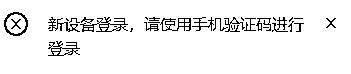 

第一次登录会提示使用手机验证码进行登录，切换成验证码登录就可以了 

# 第四步，认证 

登录进去之后，需要关注公众号，填写问卷，KYC 认证 

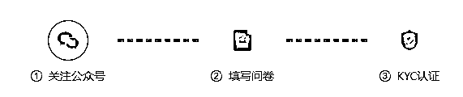 

## 1、关注公众号 

需要用刚才注册页面填写的公众号关注 

 

## 2、填写问卷 

问卷基本上没有太需要注意的地方，随便选就可以了 

 

## 3、微信扫码完成 KYC 认证 

 

# 第五步，充值 

点“用户头像”——快速充值 

 

充值方式有 3 种： 

人民币充值 

USDT 

美金 

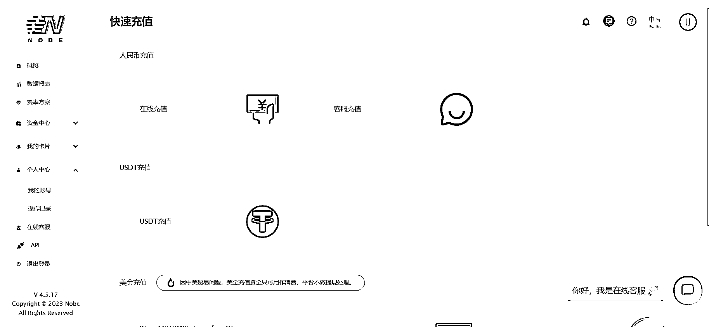 

因为人民币充值最低要 500 元起充，并且不能提现，所以推荐采用 USDT 充值。 

USDT（泰达币）是一种和美元挂钩的虚拟货币，1USDT 就相当于 1 美元。 

点击 USDT 充值，进入充值页面： 

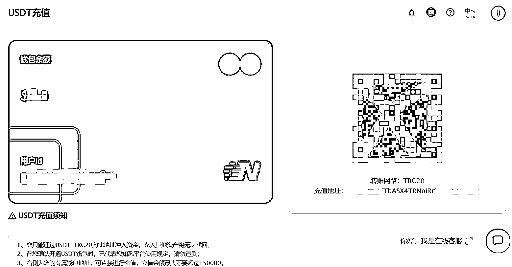 

进来之后会得到一个充值的二维码和充值地址，这个二维码只能通过 USDT 进行交易，支付宝和微信无法直接交易，所以我们需要先在欧易平台进行注册，然后购买 USDT。 

# 第六步，注册欧易平台 

##   

## 1、注册 

点击 [https://cnouyi.cards/join/87152404](https://cnouyi.cards/join/87152404) 跳转欧易平台官网，输入手机号，点击领取盲盒，然后按照页面提示进行注册。 

（这一步建议使用手机操作，方便直接下载欧易 APP，打开链接时可能会被浏览器标注风险提示，点击继续访问就可以了，如果浏览器不允许打开链接，就换一个浏览器，我用的是 UC 浏览器） 

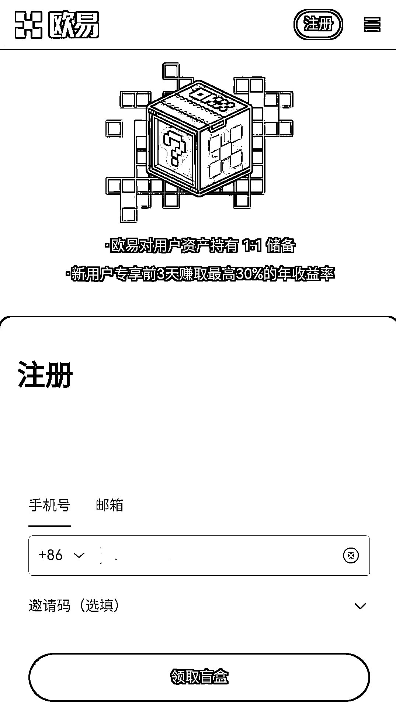 

## 2、下载 

注册完成后会弹出下载页面，点击本地下载安装包并安装。 

 

## 3、买币 

打开 APP，在欧易首页，点击“购买或充值数字货币” 

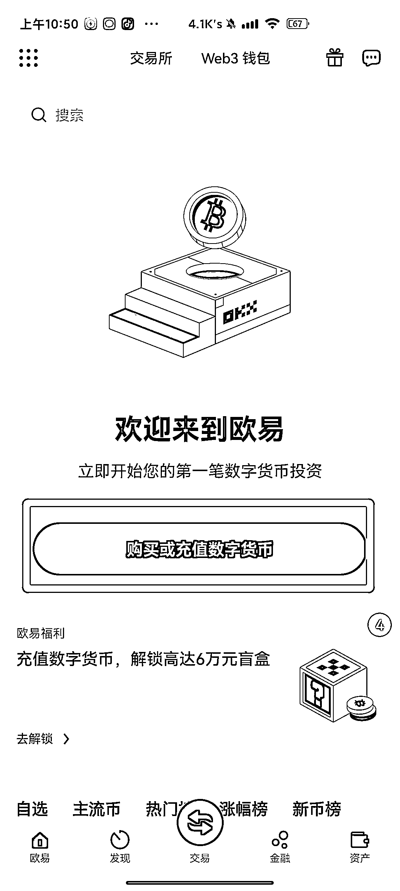 

点击“我想要买币” 

 

选择 USDT 

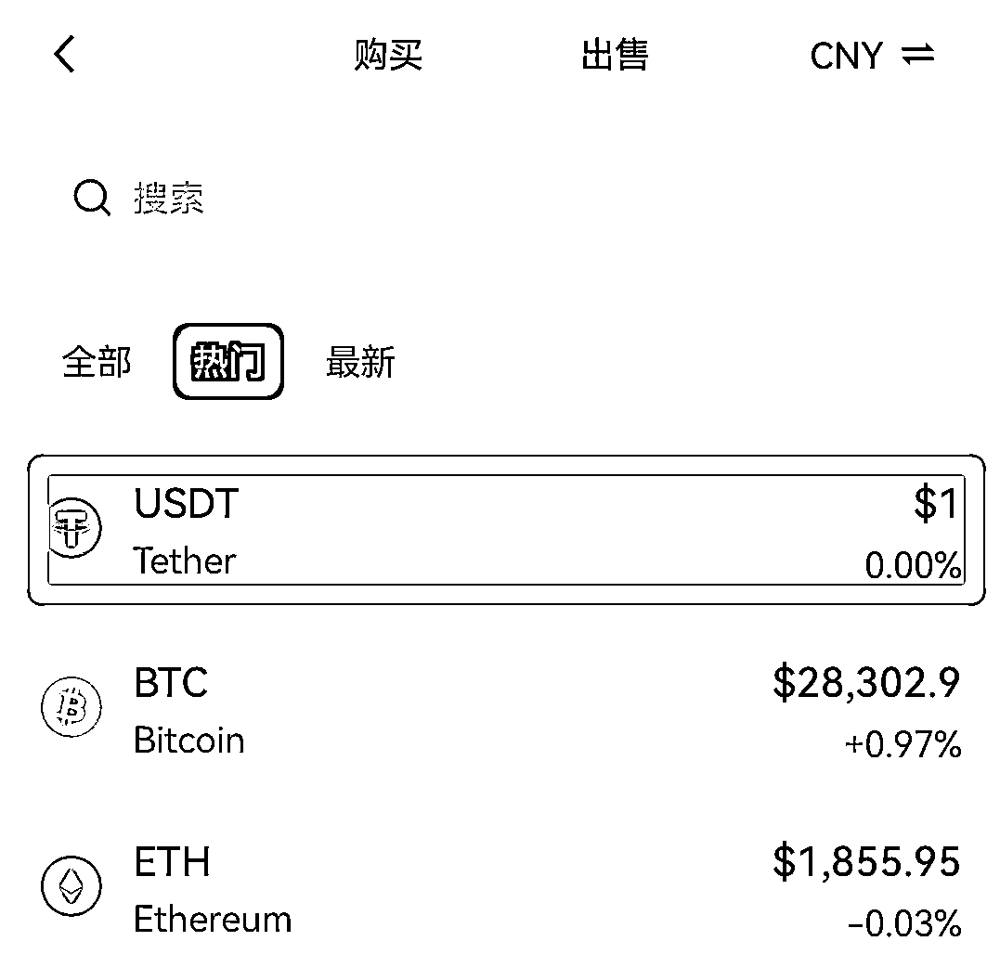 

买的时候记得切换成 USDT 单位，考虑到后续手续费和开卡最低充值，所以最低需要充 34USDT，如果担心意外情况，可以多充一点，我当时是充了 36USDT，最后总共还剩下 12.4U 的余额。 

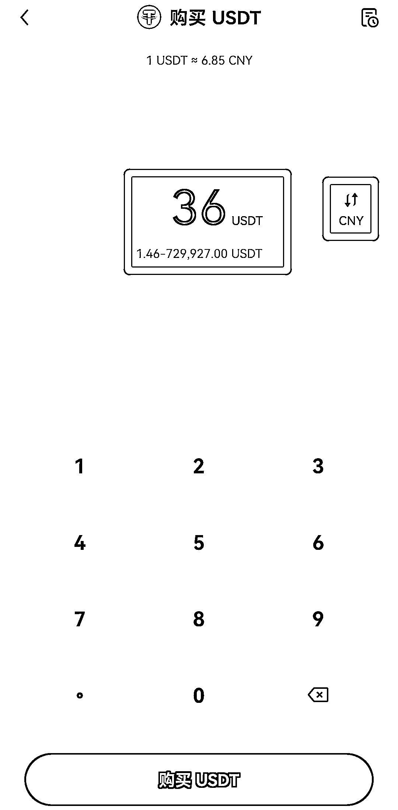 

充值过程中，需要进行个人信息的验证，按照提示进行验证就可以了，最好是把 3 个等级的个人认证全部做完。 

（我当时买币的时候只做了前两个等级的认证，充完币后直接被锁定了，需要等 7 天后才能操作，于是就提起申诉，但是提起申诉需要进行第三等级的个人认证，于是就把第三等级的个人认证也给做了，申诉后大概 3 分钟就通过了，账户就可以正常操作了。） 

## 4、充值 

到了这一步我们已经拥有了 USDT，可以使用 USDT 充值 nobepay 了，具体方法： 

点击“资产”→“提币”→“USDT”→“链上提币” 

在提币地址栏输入刚才第五步充值页面的充值地址和提币网络，也可以直接扫描充值页面的二维码，自动录入信息。 

输入提币数量，由于 nobepay 是第一次开卡，加上手续费，所以提币数量不能少于 34USDT，否则一会儿可能无法开卡。 

点击提交，大概一两分钟，资金就会到账。 

（我是直接提了全部 36USDT，提币手续费扣了 1USDT，充值手续费 2%，最终到账 34.3＄） 

如果页面一直不刷新余额，点击个人中心就可以看到充值的资金了。 

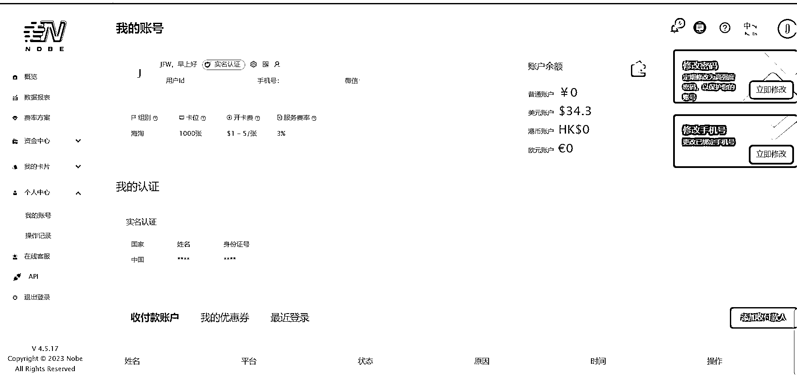 

特别注意： 

USDT 只能充进去消费，不能提现，所以根据需要来充值 

# 第七步，开卡 

##   

## 开卡步骤： 

点左边菜单栏——我的卡片——快速开卡——选择 556766——填写完信息——开卡 

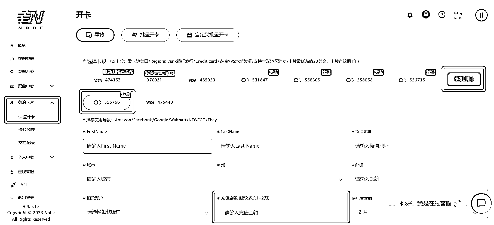 

## 注意事项： <ne-h3 id="4fe8b9dd" data-lake-id="4fe8b9dd"></ne-h3><ne-h3 id="bc9a41dd" data-lake-id="bc9a41dd">1、填写信息</ne-h3> 

如果你不知道怎么填写，可以用旁边的“随机地址”，会自动生成随机个人信息，不过生成随机信息后，最好把姓名栏换成自己的姓名。 <ne-h3 id="b45f97ac" data-lake-id="b45f97ac">2、选择卡段</ne-h3> 

不同的卡段有不同的开卡起充金额，556766 卡段开卡最低起充 30＄，像 531847 卡段就是开卡最低 10$起充，不过有可能会出现用的人太多，开通 plus 的时候不成功，需要重新开卡的情况，不过这个我也只是听说，并没有证据能证实。 

因为每开一次新卡，都会扣 1$的开卡费，保险起见，为了避免开的卡段无法使用，就直接开了 556766 卡段，至于其他卡段还没有做过尝试。 

完成上面的步骤，一张美国的虚拟信用卡就开通了。 <ne-h3 id="0e31ac71" data-lake-id="0e31ac71">3、查看卡片信息</ne-h3> 

在左边菜单，我的卡片——卡片列表——管理——查看卡片，就可以看到的自己卡片信息了 

 

卡片信息： 

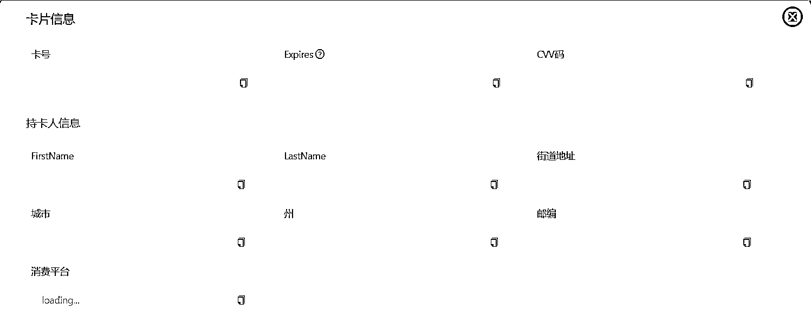 

# 第八步，充值 chatgpt plus 

##   

## 1、选择漂亮国节点登录 chatgpt，点击“Upgrade to Plus”→“Upgrade plan” 

 

## 2、填写卡片信息 

填写刚才在 nobepay 申请的虚拟信用卡账号信息 

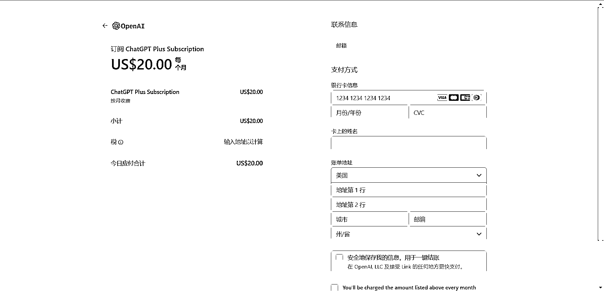 

## 3、填写账单信息 

使用美国虚拟地址生成器（[https://www.dizhishengcheng.com/Index/custom_result](https://www.dizhishengcheng.com/Index/custom_result)），选择一个免税州，点击搜索，生成虚拟地址，把生成的虚拟地址信息填进去 

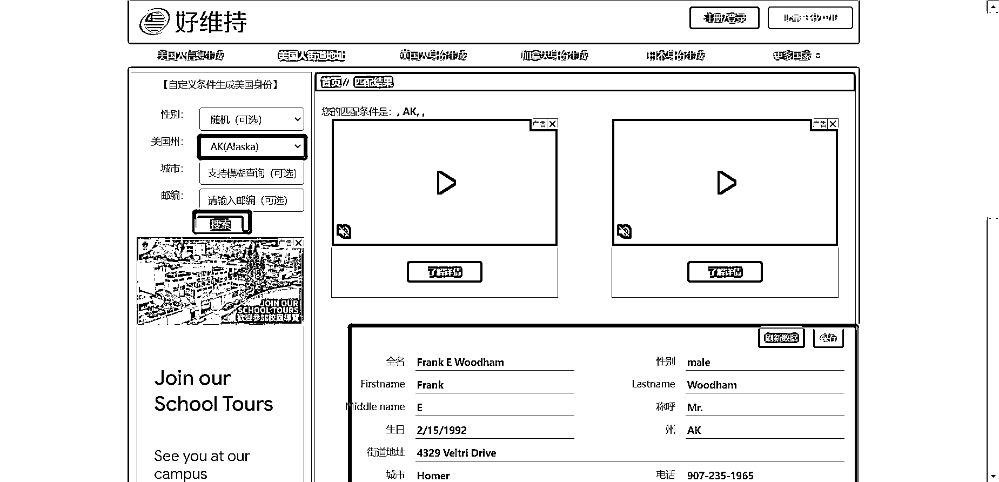 

美国免税州： 

1、俄勒冈州（Oregon） 

2、阿拉斯加州（Alaska） 

3、特拉华州（Delaware） 

4、蒙大拿州（Montana） 

5、新罕布什尔州（New Hampshire） 

## 4、点击订阅 

信息填写完成后，点击订阅，chatgpt plus 就开通成功了 

 

 

## 5、注意事项 

1、如果点击订阅后，显示卡片被拒，大概率是节点的问题，更换高质量节点； 

2、账单地址最好和节点位置保持一致，漂亮国的地址就用漂亮国的节点，其他国家的节点就用其他国家的账单地址； 

3、如果卡片一直被拒，暂停操作，等第二天再尝试 

# 费用明细： 

为了方便计算，所以接下来我就都以 USDT 为单位进行计算。 

这套流程下来我购买 36USDT 总共花了 248.05 元， 

充值到 nobepay 的时候，欧易平台手续费扣了1USDT（据说这个手续费最低是一次 0.1USDT 起，不过目前我还没有尝试）， 

nobepay 扣了 2%（0.7USDT）， 

开卡费1USDT， 

充卡费 30USDT 扣了 3%（0.9USDT）， 

开通 chatgpt plus 花了20USDT， 

总共花了23.6USDT， 

相当于 163 元人民币左右 

不过剩余 12.4USDT 目前只能消费，不能提现，可以用在下次 plus 续费或者开通其他平台会员 

下次续费的话，由于省了 1U 的开卡费，加上欧易平台的手续费不固定（按次结算） 

所以如果下次续费的成本大概在 21USDT 到 22USDT 之间，换算成人民币大概在 144 到 152 元左右。 

评论区： 

柯南 : 飞书链接：[https://be2m999k9z.feishu.cn/docx/YE1FdsTuxoaBbNx4f5dcnSNenxb](https://be2m999k9z.feishu.cn/docx/YE1FdsTuxoaBbNx4f5dcnSNenxb)周彦充 : 这个步骤应该拦住全国 90%的人口 志豪 : depay 开卡后不怎么用，月费血亏😂 一辰 : 经常出现这种情况，请问有好的解决方案么？ 柯南 : 换魔法 阿朔 : 好用 练习时长两年半 : 耗子-尾汁 回复 志豪: 转让出去[呲牙][呲牙]，应该可以吧，前面不是有人发帖说怎么改绑定的信息嘛 练习时长两年半 : 好像也不能转，因为用自己身份证搞的