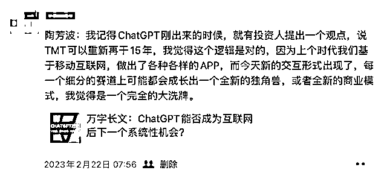
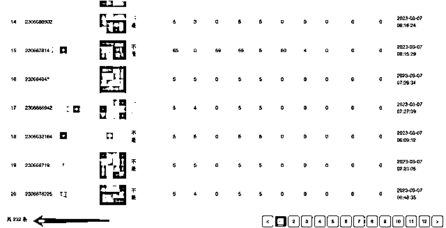
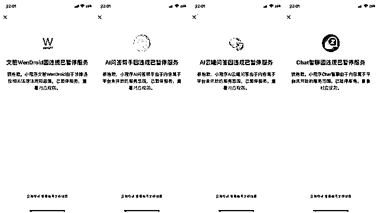

# 《送给每一个 AI 创业者的避坑指南》

> 原文：[`www.yuque.com/for_lazy/thfiu8/ey5f03yx5p30emux`](https://www.yuque.com/for_lazy/thfiu8/ey5f03yx5p30emux)

## (86 赞)《送给每一个 AI 创业者的避坑指南》 

作者： 叫我峰兄 

日期：2023-04-10 

本文共计 5016 个字，阅读大约需 18 分钟 

一眨眼，我从第一次真正接触 AI 到基于 AI 做了一些商业化的尝试已经两个多月的时间。这个过程中，有过欢笑、有过泪水、有过迷茫、有过亢奋。不管怎样，最终还是特别看好 AI 的未来，我认为把他称为第四次技术革命也不为过，AI 确实也已经影响到了我们生活的方方面面。 

我认为未来只会有两种人，一种是善用 AI 的人，他们的效率会得到极大的提升，能更高效的解决工作生活中遇到的问题；一种是抵触 AI 的人，他们会慢慢的被替代掉，只是当这一天到来的时候，他们可能都没意识到，并不是 AI 取代了他们，而是善用 AI 的人取代了他们。 

如果你也有基于 AI 创业的一些想法，不妨先看看我的经历，希望能对你有所帮助，让大家少走一些弯路。 

# 一. 误入迷途 

其实之前也一直有关注 AI 领域的一些资讯，但是总感觉这个跟我们普通人关系不大。直到今年 2 月份，openAI 发布的 chatGPT 直接引爆网络，短短两个月注册用户数就超过 1 亿人，是全世界增长速度最快的应用。于是乎在网上查了大量的资料，最终得出一个结论：一个全新的时代真的要来了，一个普通人可以参与 AI 的机遇终于到了。这种机会不是什么时候都有，而且错过去了也就错过去了，可能接下来 10 年 20 年都不会再有这么好的机会。 

真正促使我行动的时间点应该在 2023.02.22 日，那天，我看到朋友圈里一篇朋友分享的万字长文，对我触动很大。这篇文章我反复看了不下五遍，有一句话对我触动很大“上个时代我们基于移动互联网，做出了各种各样的 APP，而今天新的交互形式出现了，每一个细分的赛道上可能都会成长出一个全新的独角兽，或者全新的商业模式，我觉得是一个完全的大洗牌”。基于 AI 的底层能力，所有的 APP 的交互方式都将改变，所有的 APP 都将重做一遍，这句话一直回荡在我的耳边，我觉得属于我们普通人的机会终于来了，上一波移动互联网红利，自己当时还比较年轻，认知也不够，其实没有尝到什么红利，而 23 年这波 AI 浪潮，经过这么多年的沉淀，我觉得我这次可以入局了，就算失败也没什么，经历就是最宝贵的财富。 

 

2023.02.22 日我转发了朋友圈里看到的这篇文章 

既然要创业，肯定要有一个产品，做什么好呢？体验过 chatGPT 以后，感觉他确实可以提高人的工作学习效率，这是一件很有意义的事情，他可以提高人们的效率，鲁迅爷爷不是说过：浪费别人的时间等于谋财害命，那帮别人节约时间是不是可以理解成延长寿命，从这个角度想是不是也是一件功德无量的事情。但是大家都知道，国内是没办法直接访问 openAI 的官网的，科学上网一方面是国家不允许，另一方面对普通大众来说也有一定的门槛，那就做一个国内的镜像站吧，国内的小伙伴无需科学上网就能享受到目前世界上最先进的自然语言模型提供的服务，我们也会对用户输入的违禁内容进行过滤，确保合法合规，从此双手插兜，不知道啥叫做对手。 

想法有了，时不待我，说干就干。2.23 日，我找了几个朋友聊了一下这个想法，大家都很赞同，觉得这件事可以做。由于大家都有工作，基本上只有晚上、节假日才有时间投入到项目的开发中，好在有个信念支撑，大家都牺牲了自己的休息时间，终于在 3.6 号，我们第一版的 AI 智能小助手（大家在微信公众号里搜【斑码技术】可以搜到），跟大家见面了。 

大家可能会说，这也挺顺利的啊，你不是要写 AI 创业避坑指南吗？这哪里有坑呀，几天时间就搞出了产品，这完全是顺风顺水，风调雨顺呀。好吧，下面就让大家看看我们背后狼狈的样子（现在回想起那段经历还是忍不住的香菇、蓝瘦） 

# 二.AI 创业中我遇到的两个大坑 <ne-h3 id="06191acd" data-lake-id="06191acd">1.公众号的坑：</ne-h3> 

上面不是说到，我们要做基于微信公众号的 chatGPT 国内的镜像站嘛,那都需要准备什么呢？ 

（1).两台服务器（国内一台、海外一台） 

（2).一个域名（域名要备案） 

（3).一个企业认证的微信公众号 

下面依次说明，在准备这些过程中遇到的一些坑，下面的文字请认真阅读，如果大家也在打算从事这方面的创业，确实可以帮你真金白银的省到钱。 

先从服务器说起，服务器我选的是阿里云的，当时的想法也是怎么省钱怎么来，所以买的也是 1 核 1G 内存 1M 带宽的最低配的服务器，就这样一个月还要 76 块，感觉活不起了。分别买了一台国内华北地区的，一台海外美国硅谷地区的，国内的服务器部署我们的应用，海外的服务器其实仅仅做个转发，所以配置要求也不高，但对带宽有一定要求（目前我已经把这台服务器的带宽升级到 5Mbps 了），至于为什么一个应用要用两台服务器，相信做技术的朋友一定知道，这里也不好多说，我只能说古代的长城可以抵御外来侵略者的入侵，如今我们的网络环境也有伟大的长城防火墙保护，这里也感谢国家给了我们纯净的网络环境，手动比心。 

 

由于是最低配的服务器，我们后台一开始又是用 java 写的，由于 java 比较吃内存，第一个问题就暴露出来了，服务动不动就死掉，我们一开始是通过占用一部分硬盘充当虚拟内存来解决，但还是不太稳定，后来就升级到了 2G 内存，现在已经升级到了 4G，后期根据用户量的增加还是升级。 

服务器的第二个问题，由于当时正值两会期间，国内对网络的管控比平时要严格的多，我们海外那台服务器也就访问不了了，后来也是咨询了做网络相关的朋友，说两会期间，海外服务器的 80 端口基本都会被禁，可以换一个端口试试。换了一下端口，果然可以了，现在可能大家觉得轻描淡写，但当时确实困扰了我将近一天的时间，知道原因才恍然大悟，这块我就不多说了，毕竟国家不鼓励嘛，大家都明白，我们都是遵纪守法的好公民，另外买服务器可以买香港的，因为香港既是我国不可分割的一部分，又享受一些额外的政策，懂得同学明白就好[憨笑] 

再说说域名这块的坑，域名其实我很早之前就有一个，当时是在阿里云买的，也是在阿里云备案的，当时我自己去备的案，备案的时间周期比较长，但是没花钱。之前腾讯云搞活动，我买了一台腾讯云的服务器，到今年 11 月份到期，所以一开始我并没有想买上面文章提到的阿里云服务器，想着能省就省点，结果当我将域名绑定到我的腾讯云上时，问题就出现了，提示“未在腾讯云备案的域名，不允许接入腾讯云”。我的天，这典型的霸王条款呀，我明明已经在工信部备案了呀，就因为没在腾讯备案，就不让用腾讯云？当时也是着急，脑子有点短路的，单纯就想着怎么尽快的接入腾讯云服务器，因为如果是自己去办理备案，时间确实太长了（可能要 15 天左右的时间，我等不了这么久），于是就阴差阳错的联系了腾讯的客服，交了 600 元备案代办费用，让腾讯帮忙代办备案。 

交完钱以后我才想到，我为啥不买阿里云服务器呀，阿里云我已经备案了呀，由于腾讯代办的备案时间其实也要三四天，我最终还是购买了上面的两台阿里云服务器，白白扔掉 600 大洋，不过，最近由于腾讯云搞活动，我花了 599 购买了 1 台腾讯云 3 年服务器，所以这钱现在看也没白花，反复打脸中[捂脸] 

 

 

最后关于公众号的认证这块，按照流程，按部就班的认证就可以了。不过要说一点，我们之前申请公众号时，公众号名字中带 chat 或者 AI 关键字的通过率是非常高的，我最近又申请了一个公众号，目前腾讯对名字的审核比较严格，不能包含 chat 相关的关键字，而且提交审核时，就算没通过也要扣 300 元认证费，所以起名字还是需要谨慎一些。 

公众号开发中其实也遇到了一些问题，这里就不通篇展开写了，因为我发现不知不觉已经写了三千多字了，我真是干啥啥不行，话痨第一名。 

下面给大家展示一下我们的公众号，截图就是我们公众号的页面，你可以在输入框中输入你的问题，然后发送，小助手就可以给你返回你想要的答案，我们也把最常用的一些分类整理了出来，做了一个分类列表供大家使用，以得到更加精准的回复。 

 

可能有些朋友问，你们这个是纯公益的项目吗？其实，说来惭愧，当时我们做这个项目，也没想赚多少钱，不过想着也别亏钱，最起码把服务器的费用和大家的辛苦费赚回来，所以，我们一开始就考虑到了盈利模式，通过会员和招募代理来收费覆盖我们的成本，但其实我们会员的充值情况并不理想，一开始以为商业模式的问题，我现在才明白，其实是我们运营的问题（这几个后面我会跟大家说），我一个朋友跟我们几乎是同时做的，不过他们是公司化运营，他们有 5 个人在做，目前一天的流水在 2-3 万，我看过他们的后台数据，因为涉及到商业机密所以这里我就不截图了。 

3.7 号是我们的公众号上线第一天，我只是当天晚上简单的发了一个朋友圈，没做任何推广，第一天注册用户数是 232，第二天已经达到 500 多，用户增长的还不错，其实企业用这个来引流也是不错的选择。 

 

由于上线比较赶，我们也做了一件特别蠢的事情，相信很多做开发的同学也做过类似的事情，我们的服务器的数据库的端口对外暴露了，并且没改密码，用的是默认的密码，没有任何悬念，我们的服务器第二天就被黑了，对方要比特币才给恢复数据库，不然要删库跑路。是梁静茹给他的勇气吗？我也没惯他毛病，直接重新安装了服务器，然后给之前注册的用户每人送了一个月的会员，作为对用户的歉意。当时在没做任何推广宣传的情况下，每天都有几十个新增用户，我们也没有建群维护这些客户，现在想想真的是做的太不到位，所以当时很少有用户付费一点也不冤，还是因为没把服务做好。想想我那个朋友的公司，他们现在的一天的流水有两三万，真是羡慕呀[奸笑] 

 

网络小黑黑库，索要比特币 

但当时我并没有意识到是我们自身运营的问题，只是简单的认为会员充值这种商业模式有问题，咨询过多位有网赚经验的朋友后，他们都说目前有很多广告联盟，可以通过小程序或者 app 来接广告，广告的收益非常高，我也看了一个做抖音和快手小程序的朋友的后台数据，确实一天有个一两万的流水，这也坚定了我们转型做小程序的决心，当时想的是，做小程序后，我们盈利这块就有两条腿，一个是会员，一个是广告，就算大家不充会员，看广告也是不错的，就跟羊了个羊一样，靠广告也能盈利，所以就有了下面小程序的坑。 

这里多跟大家说两句，只要你的微信小程序的 UV 达到 1000，就可以开通流量主业务接广告，基于广告做一些小程序确实是比较好的赛道，我认识的几个做抖音、快手小程序的朋友，都是赚的盆满钵满，真的是非常的暴利。 <ne-h3 id="fdf18fdb" data-lake-id="fdf18fdb">2.小程序的坑：</ne-h3> 

小程序其实面临跟公众号差不多同样的问题 

(1).服务器 

(2).域名 

(3).小程序起名认证 

(4).版本发布提审 

小程序的服务器这块，我只买了一台腾讯云服务器（599 三年，非常划算），海外服务器与公众号共用，所以现在看那 600 块钱在腾讯云上买的备案服务还是很值的，有时候就是这样，福兮祸之所伏，祸兮福之所倚。 

由于我当时注册小程序还比较早，当时小程序名称这块管的不太严，我们很轻松就认证通过了，现在管制的越来越严了。 

最大的坑其实是在小程序发版审核这块，我们当时发第一版的时候腾讯管的还不是很严格，就给审核通过了，后来，我们又新增了语音对话、AI 绘画等功能，这次审核就没这么顺利了，被驳回了差不多小十次，官方的回复就说小程序暂不支持开展 chatGPT 服务，我问如果基于国内的文心一言或者腾讯的 AI 模型做是否支持，客服每次说的都特别含糊，也没说行也没说不行，就让你重新提审再试试。 

 

跟腾讯客服的对话，没有什么实质的帮助 

 

我们提审被驳回后，决定抗议，但发现没啥鸟用 

就这样反复驳回了几次，后来我们把所有的服务做到了后台自定义配置，最后终于通过了审核，所以有些时候，执着还是一种比较优秀的品质，当时觉得老天爷眷顾，好运会一直伴随着我们。 

 

经过多次驳回，最终审核终于通过了 

后来，腾讯开始封杀 AI 智能问答类型的小程序，我们的小程序也毫无疑问的被下架了。 

 

一首凉凉送给自己，小程序下架了 

我之前关注了差不多 100 个 AI 问答类型的小程序，基本全军覆没，本来还想垂死挣扎一下，结果看到这样的情况，觉得再申诉也没有太大的意思了，就算重新上线，以后发布新功能，提交审核还是会被驳回，人家不让你搞，你有什么办法呢，毕竟胳膊拧不过大腿，所以也就彻底放弃了小程序这块，AI 小程序的创业最终还是以失败告终。 

 

# 三.柳暗花明 

本来说实话，已经对微信生态没有信心嘞，完全放弃了，想去看看抖音、快手的机会，结果跟朋友又聊了聊发现，他们公司的 AI 智能聊天公众号现在迎来爆炸式增长，每天都有一万多的注册用户，每天的流水有个两三万，这时候我才意识到之前做公众号没做起来，并不是商业模式的问题，而且运营的问题，一来没有做任何推广，每天就靠几个自然流量；二来没有社群维系用户，给用户提供一些价值。痛定思痛，我打算这次重新回头好好搞搞公众号，也找了一帮懂运营的朋友帮忙来运营，另外，每天浏览大量资料，整理对用户有价值的内容，针对用户的不同职业，站在用户的角度去考虑，如何才能真正的提升大家的效率，相信这次的用心能换来不错的回报，给之前一直信任我的朋友一个满意的答复。 

# 四.最后的话 

新的时代真的来了，我们不应该逃避，而应该积极的面对。网上经常看到 35 岁以上程序员失业后找不到工作的新闻，我想年龄不应该成为我们的枷锁，我们的归宿并不是只有送外卖、开滴滴，只要用一个开放的心态接收新鲜的事物，不管多大年纪都可以乘风破浪，走在浪潮之巅！ 

评论区： 

书情小跟班 : 非常优秀，认识一下 大龙 dylan : 最近同样遇到阿里云和腾讯云不互认域名备案的问题[握手] 叫我峰兄 : 同命相连[捂脸] gaoly : 优秀 叫我峰兄 : 过奖啦，星球里有太多优秀的小伙伴，我这就是一个小菜鸟[捂脸] 周彦充 : 之前我推广的 gpt 小程序也被封了 沉默 : 域名转移啊 叫我峰兄 : 嗯，现在小程序被封的概率几乎百分百