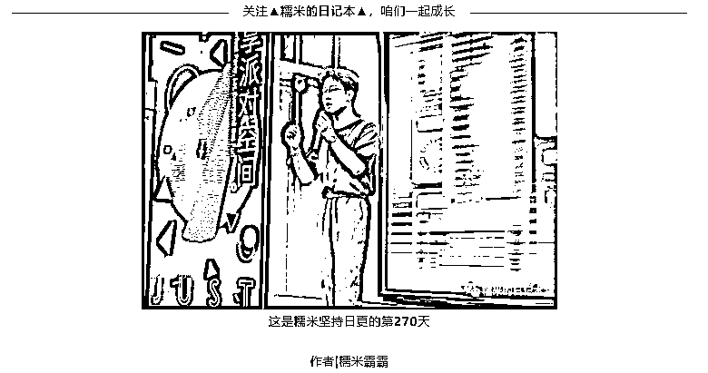
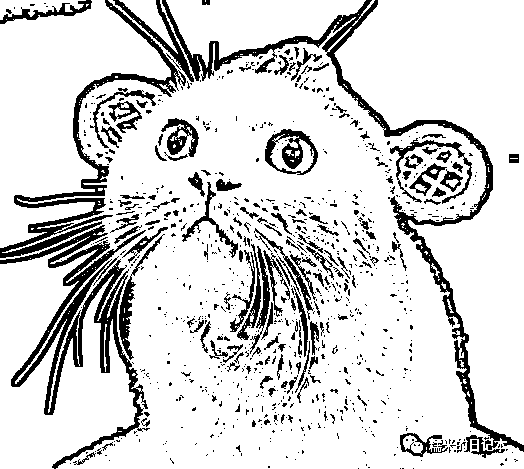

# 《 AI 写作 AI 绘画之后，我该何去何从？》

> 原文：[`www.yuque.com/for_lazy/thfiu8/dh8k0icpkh3khmut`](https://www.yuque.com/for_lazy/thfiu8/dh8k0icpkh3khmut)

## (25 赞)《 AI 写作 AI 绘画之后，我该何去何从？》 

作者： 糯米 

日期：2023-04-12 

 

“遇到问题是生活中的常态，能立马以波澜不惊的状态，去冷静地着手处理，才是优秀的做派，大家好，我是糯米。” 

chatgpt，midjourney，stable diffusion，最近很火对吧，只需要你给个指令，或者描述，就会自动给你一篇还不错的文稿，自动给你一幅还不错的原创画片，对么？ 

于是很多人开始焦虑，特别是做电子绘画的，写文案的，因为这两个工作的职能是直接对应 chatgpt 和 midjourney 这样的 ai 软件的，对么？这确实会让人感觉，我的工作好像不需要我了...... 

“我画一幅画，从有想法到作画完工，整个过程可能要好几天，这玩意儿，十几分钟出来几十张，效果还不比我差！完了完了，工作没了。” 

“我写一个稿子，可能要好几个小时，这玩意儿，一两分钟就写出来了，还有模有样！完了完了，工作没了。” 

你之所以会有这样的思绪，是因为你没有贴合实际继续思考下去。 

假如你就是个电子作画的画家！现在有这样的 ai 工具了，你觉得会产生什么变化呢？ 

短时间内，是不是掌握技术的人很少，而且相当一段时间之内，你的工作其实也不会有太大的变化，对么？因为现在 ai，能直接在实际中，运用的很好的，也不会太多。 

那就算你的老板知道，这个技术出现了，也不可能马上集体裁员，是不是也得测试? 

测试的好，是不是需要人去操作，你的老板不可能全部裁员，自己亲自动手吧？所以一定还得有人来操作，这个时候是不是谁用得越好，谁留下来的概率就越大。 

这还是保持更新一手信息的老板，如果是懒一点的老板，或者忙一点的老板，可能压根不知道这些东西。 

那你是不是可以率先掌握起来，掌握得好，你的机会也就到了， 

就算你不想借此机会大干一场，是不是也能悄悄利用这个工具来偷懒呢？因为其他人都不知道这回事儿嘛，还是以往的工作模式，工作量。 

只有你的老板，你的客户，越来越多的人都会用了，都知道了，你的工作才会恢复以往的劳动时间报酬。 

举例说明一下，以前你只需要每周作画 5 张，但是你学会了 ai 之后，你一天就能完成一周的工作，于是你可以摸鱼 4 天，但现在大家都会了，上下游也都了解行情变化了，于是你的工作量变成了一周 500 张画，你还得跟以前一样，一周工作 5 天。 

懂了吧，其实你丢不了饭碗。 

 

当然，我们也可以继续思考市场变化， 

当大家都会用 ai 了，产能大大提升了，会出现什么呢？ 

产品过剩，内容冗余， 

慢慢的，老板也不需要那么多同质化的内容了，于是，不能产出有效产品和内容的被裁员，能产生有效内容，避免同质化的留下了。 

所以归纳一下，面对新技术， 

第一是尽快了解和学习掌握，做到降本增效， 

第二步就是灵活运用新技术，继续在当下的市场竞争环境中脱颖而出。 

所以这个社会缺的是学习能力强，创新能力强，能做出有效动作的人，这样的人是稀缺资源，而稀缺代表着值钱！ 

 

聊到这里呢？我想大家都理解了一件事儿，ai 要学，而且还要活学活用，把他当成工具去利用，节省自己的时间和精力，去进一步提高自己的核心竞争力。 

何谓核心竞争力？ 

别人无法替代的能力。 

ai 目前可以根据你喂给他的内容进行模仿，做到提取，糅合，输出，但他不具备更高一级的创造， 

你是用 ai 的人，你得根据实际的需要，去架构一个产品或者内容，通过教会 ai 来，让他给你干活，从而节约人力，时间，精力。 

你永远不会被取代，人也永远不会被 ai 取代。 

那你要做的就是不断提升自己解决实际问题的能力，这包括构思，总结，灵活使用 ai，协调统筹等等的一些能力。 

好啦，今天的分享就到这了，我是糯米，每日更新，感谢关注！ 

评论区： 

书情小跟班 : 非常优秀，认识一下 果然靠谱 : 所以感觉核心还是要当老板 糯米 : 哈哈，过奖了，爱分享而已，nuomibaba89757 糯米 : 可以尽早尝试一些小雇佣 果然靠谱 : 雇佣者？ 糯米 : 我个人觉得可以先转换身份体验一下