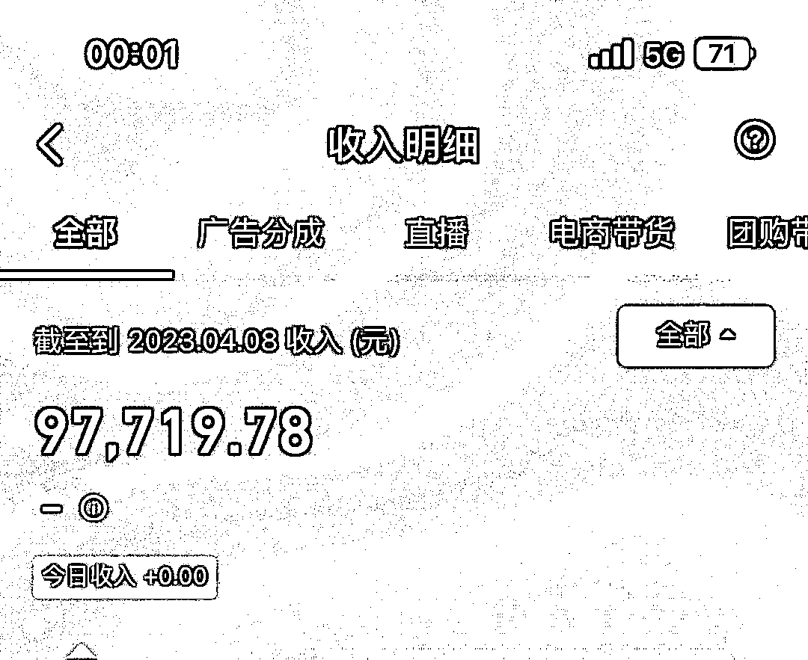
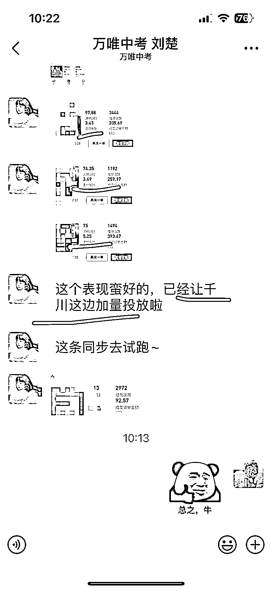

# 《图书类目短视频投流带货，我是如何月入 10W+的？》

> 原文：[`www.yuque.com/for_lazy/thfiu8/wgq9cz3kwr15cggw`](https://www.yuque.com/for_lazy/thfiu8/wgq9cz3kwr15cggw)

<ne-h2 id="93b9d585" data-lake-id="93b9d585"><ne-heading-ext><ne-heading-anchor></ne-heading-anchor><ne-heading-fold></ne-heading-fold></ne-heading-ext><ne-heading-content><ne-text id="ub49674df">(198 赞)《图书类目短视频投流带货，我是如何月入 10W+的？》</ne-text></ne-heading-content></ne-h2> <ne-p id="ub20d9b66" data-lake-id="ub20d9b66"><ne-text id="uee5abb6e">作者： 猎音狮</ne-text></ne-p> <ne-p id="u390a1890" data-lake-id="u390a1890"><ne-text id="u43210ae3">日期：2023-04-10</ne-text></ne-p> <ne-p id="u8c97a18f" data-lake-id="u8c97a18f"><ne-text id="u481f2e38">【抖音项目】图书类目短视频投流带货，我是如何月入 10W➕的？</ne-text></ne-p> <ne-p id="ua39e70c1" data-lake-id="ua39e70c1"><ne-text id="u141beadc">第一次分享，请允许我先做个自我介绍</ne-text> <ne-text id="u2415ebc7">【一 、自我介绍】：</ne-text></ne-p> <ne-p id="ufceeed7e" data-lake-id="ufceeed7e"><ne-text id="u6d314bf8">生财有术的圈友们好，我是猎音狮！</ne-text> <ne-text id="ub54f89e4">这是我的互联网履历：</ne-text></ne-p> <ne-oli index-type="0"><ne-oli-i>1</ne-oli-i> <ne-oli-c class="ne-oli-content" id="ucd8acddd" data-lake-id="ucd8acddd"><ne-text id="ubf75af57">自媒体项目：2018 年 加入互联网大军，从事图文自媒体（百家/企鹅号/大于号等）运营，产出 100w+文章数百篇，多次名列官方榜单前茅。</ne-text></ne-oli-c></ne-oli> <ne-oli index-type="0"><ne-oli-i>2</ne-oli-i></ne-oli><ne-hole id="ue347e662" data-lake-id="ue347e662"><ne-card data-card-name="codeblock" data-card-type="block" id="cc96f388" data-event-boundary="card">​<ne-oli index-type="0"><ne-oli-i>3</ne-oli-i> <ne-oli-c class="ne-oli-content" id="uf9b2d0f1" data-lake-id="uf9b2d0f1"><ne-text id="uc19101a1">视频号项目：2022 年 6 月，视频号搬运玩了两个月，平均每个月佣金 10w+</ne-text></ne-oli-c></ne-oli> <ne-oli index-type="0"><ne-oli-i>4</ne-oli-i> <ne-oli-c class="ne-oli-content" id="ufa2688f5" data-lake-id="ufa2688f5"><ne-text id="u26dddd7d">结缘生财：在 2023 年 4 月 3 日 21:12:57 很荣幸加入了这个圈子，很高兴结缘生财有术，认识各位大咖！</ne-text></ne-oli-c></ne-oli> <ne-p id="uf845b749" data-lake-id="uf845b749"><ne-text id="u8d0a5b92">（很早就想分享了，但是这久拍视频太忙了。因为就我一个人，没团队，所以文案拍摄剪辑，包括后期运营，投流，都得一个人完成，所以才拖到了现在，今天感觉不舒服，就躺下了，休息一下，所以想到了写点东西，分享分享。）</ne-text></ne-p> <ne-p id="u603179aa" data-lake-id="u603179aa"><ne-text id="u684d904e">好了，言归正传，这些都是过去时了，再说那些项目现在也不能玩了，接下来就进入这次分享的主题：抖音图书类目短视频投流带货，我是如何月入 10W➕的？（图 1、图 2）</ne-text></ne-p> <ne-p id="u417b4415" data-lake-id="u417b4415"><ne-text id="u9002f100">【二、图书短视频带货】：</ne-text></ne-p> <ne-p id="ued25917b" data-lake-id="ued25917b"><ne-text id="ud1ac5b41">1、选品</ne-text></ne-p> <ne-p id="uf06e2960" data-lake-id="uf06e2960"><ne-text id="ue3e2fbc7">思路：跟爆款</ne-text></ne-p> <ne-p id="ued5249f0" data-lake-id="ued5249f0"><ne-text id="ue9477d2f">工具：蝉妈妈、抖音创意中心（图 3）</ne-text></ne-p> <ne-p id="u6bbd9239" data-lake-id="u6bbd9239"><ne-text id="ub41399b2">操作：这两个工具，想必大家都不陌生，特别是蝉妈妈，但是它要付费，所以我从来没用。我主要用的第二个工具选品，也就是抖音官方的创意中心榜单，我选择它的原因一个是可以白嫖，不用花一分钱，第二个就是真的好用，数据基本都是实时的，可以快速跟品，趁热度喝上一口汤。</ne-text></ne-p> <ne-p id="u9ed8994e" data-lake-id="u9ed8994e"><ne-text id="u46a8017b">2、做素材</ne-text></ne-p> <ne-p id="u9109a552" data-lake-id="u9109a552"><ne-text id="uef2d1f09">也就是拍视频，选品的时候，就把每一个爆单视频点开看看，看看自己能不能模仿，跟自己不是一个水平的的略过，找那种自己可以模仿，做出来的视频，视频找好以后，复制链接，用去水印工具（我用的轻抖，因为它也是免费的）把视频下载下来。</ne-text></ne-p> <ne-p id="u9ede1151" data-lake-id="u9ede1151"><ne-text id="u27504b75">然后导入剪映，调到慢速 0.5 倍，方便观察到细节。然后把它的每一个镜头拆解分割，其实一个看着很复杂的视频，这样分割下来，一般不超过 20 个镜头，接着就拍摄了，一比一对照着把它的每一个镜头用手里的样品，自己拍好了替换下来。好了以后，导出整个视频，然后再导入自己刚导出的视频，速度调成快速 2.0 倍，这样，你的视频时长，就跟你对标的一样了，再导入和对标视频一样的背影音乐，加上字幕文案，就这样，一个带货素菜就做好了。</ne-text></ne-p> <ne-oli index-type="0"><ne-oli-i>3</ne-oli-i><ne-oli-c class="ne-oli-content" id="uc8f3f9de" data-lake-id="uc8f3f9de"><ne-text id="u347b0b85">投流</ne-text></ne-oli-c></ne-oli> <ne-p id="u12647df0" data-lake-id="u12647df0"><ne-text id="u5cc22c8b">视频发布以后，不要等，立马投 100 随心推。目的是测试能不能过审，能过审，就摆着，等第二天早上 5 到 7 点，投 10 笔看效果。如果不能过审，就复议，审核员会给你不过的原因，改好了发，再测能不能过审，改到过为之。</ne-text></ne-p> <ne-p id="ub22beffa" data-lake-id="ub22beffa"><ne-text id="ua76dd5ac">投了 10 笔随心推后，能消耗，而且 roi 是正的话，就可以考虑上千川了。如果试了几次跑不正，可以重新换个视频素材（不一样的脚本）</ne-text> <ne-text id="u747a45e5">。如果不行，可以换个抖音号再测，不行可以多换几个号，如果还不行。说明这个品已经衰竭了，直接放弃，重新选品！</ne-text></ne-p> <ne-oli index-type="0"><ne-oli-i>4</ne-oli-i><ne-oli-c class="ne-oli-content" id="uc2f9d1ba" data-lake-id="uc2f9d1ba"><ne-text id="u386ecaf9">投千川的技巧</ne-text></ne-oli-c></ne-oli> <ne-p id="u2c7df037" data-lake-id="u2c7df037"><ne-text id="ue0753b70">其实，投千川也没啥技巧，主要看品跟视频素材，品好素材好，用脚投都会爆，真的，就那么简单。</ne-text></ne-p> <ne-p id="u926af568" data-lake-id="u926af568"><ne-text id="u9092cd68">但是，有一些细节需要注意：</ne-text></ne-p> <ne-p id="ufcc74559" data-lake-id="ufcc74559"><ne-text id="ue7156fbe">①出价。</ne-text> <ne-text id="u7b4fa597">出价一般佣金的 70%起出，两个小时候看消耗，消耗不出去，出价上浮 10%、继续观察，还跑不动，再上浮 10%，如果还不动，千万注意了，这条计划不能动了，动了就失去保价资格了。得新建或者复制一条新计划，在新计划上改！原来计划摆着，有些计划启动比较慢，得一两天。</ne-text></ne-p> <ne-p id="ucf371894" data-lake-id="ucf371894"><ne-text id="u97e00a98">②正反馈＞负反馈。</ne-text> <ne-text id="ufd484c02">什么意思呢？这个是站在平台角度来说的啊，假如你是平台，你也是想赚这笔投流的钱的。所以，你的每一个操作，都要让平台有益。比如你降低了出价，那你至少要加大预算，告诉平台这个计划你想跑，虽然你压价了，但是你愿意给更多的钱。有了一个压价（负反馈），你就要有一个加大预算（正反馈），不能让负反馈比正反馈多。不然就是告诉机器，这个计划你不想跑了。</ne-text></ne-p> <ne-p id="u56d75057" data-lake-id="u56d75057"><ne-text id="u161ef01d">③ 避免素材同质化。</ne-text> <ne-text id="uc7eaa254">如果同一个脚本，跑的人多的时候，难免出现创意挤压，这个时候，你要想办法拍出更有创意的素材，不然为啥叫创意？当然，这个跟我们模仿爆款不矛盾，这个脚本不行，我换一个脚本去模仿，很大几率又爆了！</ne-text> <ne-text id="uac49a5cd">说到底，还是内容为王！想要爆单，就要多拍视频，测试出符合市场审美与要求的视频，放量投放！</ne-text></ne-p> <ne-p id="u5cc64557" data-lake-id="u5cc64557"><ne-text id="u0aad21a3">5.实操案例</ne-text></ne-p> <ne-p id="u7caf5f61" data-lake-id="u7caf5f61"><ne-text id="u24cc4416">我主页足迹发了最近爆款的实操案例，这个品给大家选好了，原创素材也给大家提供了，直接用上面的方法剪辑投流就行！</ne-text></ne-p> <ne-p id="uf124ed55" data-lake-id="uf124ed55"><ne-text id="uf8e9469e">这个品不挑号，家具百货，好物分享的账号，我已经刷到爆了好几个了！站在岸上学不会游泳，去练练手吧！</ne-text></ne-p> <ne-p id="u06c3e527" data-lake-id="u06c3e527"><ne-text id="uc6132242">还有好多圈友问我要微信，最近很忙，加了我怕回复消息慢了或者漏回了，会得罪你们[捂脸]所以不加了，有问题就这里交流。</ne-text></ne-p> <ne-p id="u13788152" data-lake-id="u13788152"><ne-text id="uf1f0375d">现在有啥问题，可以评论区留言，我知无不言，商家资源，高佣金定向，高清原创视频素材，量大线下结算（可以节约 10%服务费）……等等这些资源都可以共享[抱拳][抱拳]</ne-text></ne-p> <ne-p id="ubddfce6a" data-lake-id="ubddfce6a"><ne-text id="u478d85c0">对了，忘了还有一个，品牌商投流也可以共享，就是自己不用投，把佣金降低了，商家来投（图 4、图 5）圈内同行有一个视频被砸 100 多达不溜的案例，发发视频，躺赚一二十达不溜，不香吗[旺柴]</ne-text></ne-p> <ne-p id="u1689c295" data-lake-id="u1689c295"><ne-text id="uc0949edf">好吧，就先聊这些，评论区多交流，我是猎音狮，点关注，不迷路，带你玩转图书带货！[耶][耶]让我们一起生财有术！[耶][耶][耶]</ne-text><ne-card data-card-name="image" data-card-type="inline" id="dN6gm" data-event-boundary="card"></ne-card></ne-p> <ne-p id="u94311b80" data-lake-id="u94311b80"><ne-card data-card-name="image" data-card-type="inline" id="xyvw5" data-event-boundary="card"></ne-card></ne-p> <ne-p id="u5f9e8339" data-lake-id="u5f9e8339"><ne-card data-card-name="image" data-card-type="inline" id="GMEF3" data-event-boundary="card"></ne-card></ne-p> <ne-p id="u0e47f720" data-lake-id="u0e47f720"><ne-card data-card-name="image" data-card-type="inline" id="wTQyD" data-event-boundary="card"></ne-card></ne-p> <ne-p id="u4008573f" data-lake-id="u4008573f"><ne-card data-card-name="image" data-card-type="inline" id="RW0sv" data-event-boundary="card"></ne-card></ne-p> <ne-hole id="uc3665479" data-lake-id="uc3665479"><ne-card data-card-name="hr" data-card-type="block" id="o8GmD" data-event-boundary="card"><ne-p id="u2a76c4a2" data-lake-id="u2a76c4a2"><ne-text id="ue59c4a78">评论区：</ne-text></ne-p> <ne-p id="ucd6ee9b0" data-lake-id="ucd6ee9b0"><ne-text id="ue66164fc">郑鹏鑫 : 食品 9.9 投了好几次 一直 roi 不行，还是个爆款的零食[偷笑]</ne-text> <ne-text id="u8232a924">猎音狮 : 食品竞争太大了，而且佣金低，我也测试过，放弃了</ne-text> <ne-text id="uc1ccfd01">Mr.Mcphist : 熟人 哈哈</ne-text> <ne-text id="uc245cd00">猎音狮 : 哈哈，哪位大佬</ne-text> <ne-text id="ucefe0c6b">Yoga : 没看懂，我还是太菜了</ne-text> <ne-text id="u555d1876">猎音狮 : 其实，简单了说，就是抄[捂脸]</ne-text> <ne-text id="ue12d5f7f">轩辕 : 以这种方式去带货，音频也是剪辑使用的，但是还是提示文案抄袭，有什么解决办法吗</ne-text> <ne-text id="u5ead0a7e">猎音狮 : 用 chatGpt  洗一遍 换个说法[捂脸]</ne-text></ne-p></ne-card></ne-hole></ne-card></ne-hole>