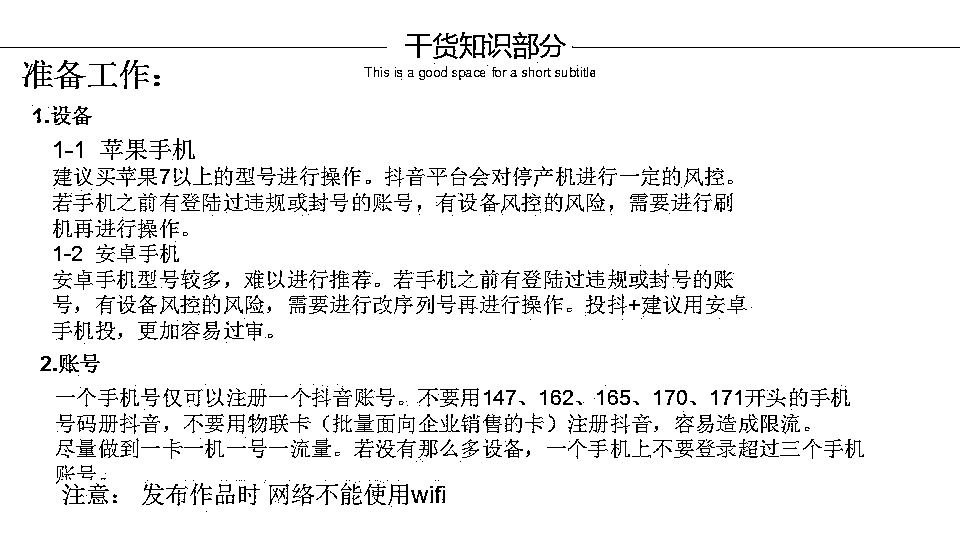
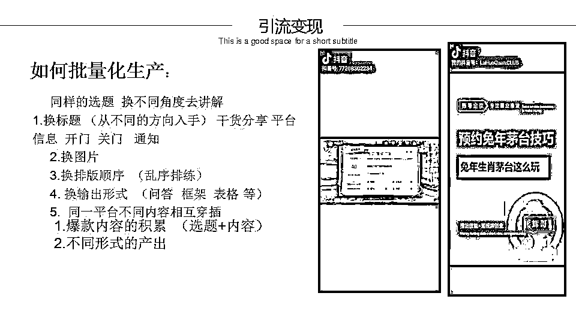
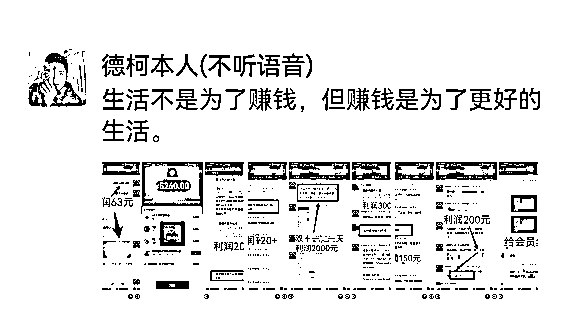
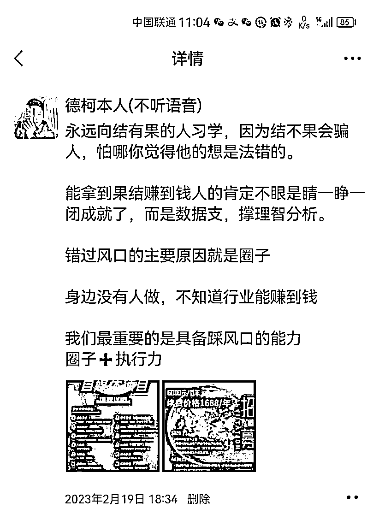

# 《抢购业务玩法升级，普通人抓住流量也能下场赚到钱》

> 原文：[`www.yuque.com/for_lazy/thfiu8/al4xm8qgp0gmg6gd`](https://www.yuque.com/for_lazy/thfiu8/al4xm8qgp0gmg6gd)

<ne-h2 id="06d315d5" data-lake-id="06d315d5"><ne-heading-ext><ne-heading-anchor></ne-heading-anchor><ne-heading-fold></ne-heading-fold></ne-heading-ext><ne-heading-content><ne-text id="u23700e6b">(42 赞)《抢购业务玩法升级，普通人抓住流量也能下场赚到钱》</ne-text></ne-heading-content></ne-h2> <ne-p id="u4d3ce98f" data-lake-id="u4d3ce98f"><ne-text id="u9aed7275">作者： Hello·德柯</ne-text></ne-p> <ne-p id="u3cd148c9" data-lake-id="u3cd148c9"><ne-text id="uf1e19fea">日期：2023-04-12</ne-text></ne-p> <ne-p id="u34fcaaac" data-lake-id="u34fcaaac"><ne-text id="ua242a654">"抢购”，是通过获取各种市场渠道的信息差实现变现，比如在京东、淘宝等平台用高价、高返利的折扣券买下茅台、跑鞋、盲盒等商品，再加一点钱卖出去就能赚取差价了，大家肯定很熟悉这个变现逻辑。</ne-text></ne-p> <ne-p id="u051a2552" data-lake-id="u051a2552"><ne-text id="u2c4c4054">从理解这个逻辑到下场去做，大家会觉得很卷，但我要说只要抓住流量获取和变现的方法，无论你是普通上班族、学生党，还是家庭主妇，都能通过这些项目赚到钱。</ne-text></ne-p> <ne-p id="u32909412" data-lake-id="u32909412"><ne-text id="u2d019ed9">比如我们正在做的抖音图文，就是抓住流量引流到微信变现，单</ne-text><ne-text id="u9db6c853" style="color: rgb(31, 35, 41);">条图文可以做到 1000 左右的精准粉丝 ，</ne-text><ne-text id="ud562efa7">接下来我将以我们做抖音图文引流的案例，详细的分享传统抢购业务的商业模式和底层逻辑；</ne-text></ne-p> <ne-p id="ub3ea19f2" data-lake-id="ub3ea19f2"><ne-text id="u09732bd2">主要分为两大块，一是带抢购小白深入了解抢购行业；二是向有兴趣操盘抢购项目在抖音等自媒体渠道变现的朋友分享实操经验。</ne-text></ne-p> <ne-p id="u5b4b4d5a" data-lake-id="u5b4b4d5a"><ne-text id="u33e19ccb">具体目录如下：</ne-text></ne-p> <ne-p id="u2341936a" data-lake-id="u2341936a"><ne-text id="uedad0f04" ne-bold="true">第一部分：</ne-text></ne-p> <ne-p id="u4be1baba" data-lake-id="u4be1baba"><ne-text id="u0b22bf64">一、什么是抢购</ne-text></ne-p> <ne-p id="ufd7a7c0e" data-lake-id="ufd7a7c0e"><ne-text id="u7db331a1">二、掌握抢购的信息差渠道的优势</ne-text></ne-p> <ne-p id="u7174eaeb" data-lake-id="u7174eaeb"><ne-text id="u6a08f0ff">三、抢购业务流程</ne-text></ne-p> <ne-p id="ud11a5b9e" data-lake-id="ud11a5b9e"><ne-text id="ud3eb3bc5">四、什么人适合把抢购作为副业搞点零花钱</ne-text></ne-p> <ne-p id="uf875a8f1" data-lake-id="uf875a8f1"><ne-text id="u02991209" ne-bold="true">第二部分：</ne-text></ne-p> <ne-p id="u827b0cc7" data-lake-id="u827b0cc7"><ne-text id="uf1fe9e5e">一、抢购一直存在红利期</ne-text></ne-p> <ne-p id="u7b508980" data-lake-id="u7b508980"><ne-text id="ucb9edadc">二、什么样的人入局抢购行业更容易赚到钱</ne-text></ne-p> <ne-p id="u74e8f49c" data-lake-id="u74e8f49c"><ne-text id="uc2c10c1f">三、探鹿人项目盘抖音引流，微信变现实操</ne-text></ne-p> <ne-p id="uc22a2639" data-lake-id="uc22a2639"><ne-text id="u6f7fe558">四、我们的产品</ne-text></ne-p> <ne-p id="uc8089f5f" data-lake-id="uc8089f5f"><ne-card data-card-name="image" data-card-type="inline" id="HsN3g" data-event-boundary="card"></ne-card></ne-p> <ne-p id="u8a517c9c" data-lake-id="u8a517c9c"><ne-text id="udf7d90df" style="color: rgb(31, 35, 41);">众所周知，个体都会面临着裁员、降薪风险，副业应运而生。而抢购作为副业中的王中王，行业也已经进入内卷的互撕模式。</ne-text></ne-p> <ne-p id="uce1f1a65" data-lake-id="uce1f1a65"><ne-text id="ucdc7a750" style="color: rgb(31, 35, 41);">但在抖音上，抢购这个行业的人都是一些“粗老汉”，不会搞抖音，更不会搞变现搞圈子，只有真正懂流量、懂变现的圈友可以抓住这最后一波细分赛道的红利机会，而我们正是那一波人。</ne-text></ne-p> <ne-p id="u9ad4eae4" data-lake-id="u9ad4eae4"><ne-card data-card-name="image" data-card-type="inline" id="Tgalo" data-event-boundary="card"></ne-card></ne-p> <ne-p id="ub15e3978" data-lake-id="ub15e3978"><ne-text id="u17986fb5" style="color: rgb(31, 35, 41);">大家好，我是德柯。02 年，山西人。我高三开始创业一直到现在，从事抢购行业六年，目前在上海开了家 20 人的公司，年纯利 200w+，遵循简单真诚利他的处事原则，仅此而已。</ne-text></ne-p> <ne-p id="u4c358669" data-lake-id="u4c358669"><ne-card data-card-name="image" data-card-type="inline" id="ymw2V" data-event-boundary="card"></ne-card></ne-p> <ne-p id="u993671dd" data-lake-id="u993671dd"><ne-card data-card-name="image" data-card-type="inline" id="TO4CR" data-event-boundary="card"></ne-card></ne-p> <ne-p id="ubff5c050" data-lake-id="ubff5c050"><ne-text id="u3da61ef7" style="color: rgb(31, 35, 41);">抢购是一种利用互联网信息差来进行低买高卖赚取差价利润的项目。在京东、淘宝、苏宁等电商平台使用高价的抵扣券或返现。</ne-text></ne-p> <ne-p id="udd825ced" data-lake-id="udd825ced"><ne-text id="ube8e9ecb" style="color: rgb(31, 35, 41);">比如双十一，双十二，元旦，五一等等，会有非常低的价格抢购，例如一元购啊等等，在远低于市场行情价时买入，在以市场行情价卖出，其中的差价就是我们赚取的利润。    </ne-text></ne-p> <ne-p id="u15a91964" data-lake-id="u15a91964"><ne-text id="ucb004a1f" ne-bold="true">抢购，其实就是通过信息差，抢购或者购买低于市场价值的产品，再进行转卖的一门生意。</ne-text></ne-p> <ne-p id="u5facbcc0" data-lake-id="u5facbcc0"><ne-text id="u9ddf8e4f" ne-bold="true">它和曾经的倒 ye、牛牛没有本质的区别，但其不同之处就在于抢购要求具备基本的互联网商业思维。</ne-text></ne-p> <ne-p id="u60ba780f" data-lake-id="u60ba780f"><ne-text id="u5dc7dc20" style="color: rgb(31, 35, 41);">抢购是个行业，但涉及到的领域很广，总体有以下几个类别：</ne-text></ne-p> <ne-p id="ua0f16220" data-lake-id="ua0f16220"><ne-text id="u4f005ee1" ne-bold="true">文娱票务类：</ne-text><ne-text id="u44a7d0b4" style="background-color: rgb(255, 255, 255); color: rgb(31, 35, 41);">热门的演唱会比如周杰伦、林俊杰、刘德华的门票都会有溢价，另外比较火 live house 也会有溢价。</ne-text></ne-p> <ne-p id="u2065a4bf" data-lake-id="u2065a4bf"><ne-text id="u79e6b9ce" ne-bold="true">电子数码:</ne-text><ne-text id="uec439ef2" style="background-color: rgb(255, 255, 255); color: rgb(31, 35, 41);">数码产品是属于稳定搬砖吃低保类型的类目，一般情况下利润不会特别大但是胜在利润相对稳定。</ne-text></ne-p> <ne-p id="uaafc1aa4" data-lake-id="uaafc1aa4"><ne-text id="u0e3ec75a" ne-bold="true">酒类:</ne-text><ne-text id="u43a489df" style="background-color: rgb(255, 255, 255); color: rgb(31, 35, 41);">酒类的重点当然是茅台，我们平常所说的茅台一般是指 53 度飞天茅台.</ne-text></ne-p> <ne-p id="u3090bf03" data-lake-id="u3090bf03"><ne-text id="u73258d2b" ne-bold="true">潮玩类：</ne-text><ne-text id="u3beec818" style="background-color: rgb(255, 255, 255); color: rgb(31, 35, 41);">这个类目是属于比较难抢或者难中签的品类，利润相对来讲也非常丰厚，像前年比较火爆的泡泡马特， 1000% 的型号有几千甚至上万的溢价。</ne-text></ne-p> <ne-p id="u43fa8028" data-lake-id="u43fa8028"><ne-text id="u26288c36" ne-bold="true">收藏属性类：</ne-text><ne-text id="u65eb7ebc" style="background-color: rgb(255, 255, 255); color: rgb(31, 35, 41);">有收藏价值或者具有金融属性所以有溢价，比如黄金，邮票，纪念币、纪念钞等。</ne-text></ne-p> <ne-p id="ued75d061" data-lake-id="ued75d061"><ne-text id="u1705c1e1" ne-bold="true">美妆产品：</ne-text><ne-text id="u10396476" style="background-color: rgb(255, 255, 255); color: rgb(31, 35, 41);">这类宝妈等女性群体特别喜欢，以前微商大军很喜欢这个类目，利润不低，能自用又能赚钱，很不错。</ne-text></ne-p> <ne-p id="u2c5144a4" data-lake-id="u2c5144a4"><ne-text id="u983a267e" ne-bold="true">茶叶类：</ne-text><ne-text id="u1f2c3099" style="background-color: rgb(255, 255, 255); color: rgb(31, 35, 41);">大益茶、普洱、毛尖等等，我们入行的一晚上几十万的收益就是大益茶项目。</ne-text></ne-p> <ne-p id="u8c6585b4" data-lake-id="u8c6585b4"><ne-text id="u7defd9f3" ne-bold="true">宠物用品：</ne-text><ne-text id="u5ba28ca6" style="background-color: rgb(255, 255, 255); color: rgb(31, 35, 41);">从宠物用品入手，大型的全平台促销活动卖什么猫咪饮水器，宠物服装，宠物用品包之类的，有专属优惠券可以买一些屯着，用闲鱼慢慢出。</ne-text></ne-p> <ne-p id="u2b079617" data-lake-id="u2b079617"><ne-text id="ua870d5df" ne-bold="true">数字藏品：</ne-text><ne-text id="u81fa5cc0" style="background-color: rgb(255, 255, 255); color: rgb(31, 35, 41);">这是一两年踊跃出来的项目，利润高低不一，行情也波动较大，长时间专研此类目也会有不小的一笔收入</ne-text></ne-p> <ne-p id="u9ab7138d" data-lake-id="u9ab7138d"><ne-text id="u06e3865e" ne-bold="true">其他：</ne-text><ne-text id="ua84a40b2" style="background-color: rgb(255, 255, 255); color: rgb(31, 35, 41);">还有一些母婴用品、食品类的抢购，这些 0 元购的不少，也是长期稳定的一个收益</ne-text></ne-p> <ne-p id="u97e064b7" data-lake-id="u97e064b7"><ne-card data-card-name="image" data-card-type="inline" id="J8Lj0" data-event-boundary="card"></ne-card></ne-p> <ne-p id="u54900488" data-lake-id="u54900488"><ne-card data-card-name="image" data-card-type="inline" id="WQZVV" data-event-boundary="card"></ne-card></ne-p> <ne-p id="u30cebd5f" data-lake-id="u30cebd5f"><ne-card data-card-name="image" data-card-type="inline" id="jcNmb" data-event-boundary="card"></ne-card></ne-p> <ne-h2 id="9039450f" data-lake-id="9039450f"><ne-heading-ext><ne-heading-anchor></ne-heading-anchor><ne-heading-fold></ne-heading-fold></ne-heading-ext> <ne-heading-content></ne-heading-content></ne-h2> <ne-p id="u0471c01d" data-lake-id="u0471c01d"><ne-card data-card-name="image" data-card-type="inline" id="szGWQ" data-event-boundary="card"></ne-card></ne-p> <ne-p id="u2af35db4" data-lake-id="u2af35db4"><ne-text id="u557a2916" ne-bold="true">（1）抢购玩家自己的消费成本更低。</ne-text></ne-p> <ne-p id="uaa14d0b9" data-lake-id="uaa14d0b9"><ne-text id="u2c19f5ae" style="background-color: rgb(255, 255, 255); color: rgb(31, 35, 41);">在广大的消费品种类中，我们总是能够拿到价格最低的那种，当某个抢购玩家自己想换一双空军一号，想换个华为手机，随随便便能拿到一个低于市场太多价格的正品货，比普通人便宜好几倍。</ne-text></ne-p> <ne-p id="u81a56aa9" data-lake-id="u81a56aa9"><ne-text id="uc5116335" ne-bold="true">（2）抢购玩家的人际收益、社交圈子、实际收入会高于普通人</ne-text></ne-p> <ne-p id="uf91ec9a8" data-lake-id="uf91ec9a8"><ne-text id="uad9068f7" style="background-color: rgb(255, 255, 255); color: rgb(31, 35, 41);">抢购做得好，money 肯定是少不了的，就连人脉的变现能力都更高一些</ne-text></ne-p> <ne-p id="u3897df42" data-lake-id="u3897df42"><ne-text id="u3495b92c" ne-bold="true">（3）作为副业的王中王，这个行业一直不缺赚钱机遇</ne-text></ne-p> <ne-p id="ud3552673" data-lake-id="ud3552673"><ne-text id="ud6fd5e90" style="color: rgb(31, 35, 41);">目前抢购行业仍存在大量机会让我们普通人去抓取，</ne-text><ne-text id="uf671e375" style="background-color: rgb(255, 255, 255); color: rgb(31, 35, 41);">信息很重要，知道的越早越能赚到钱，当你在犹豫的时候，别人已经酒足饭饱了。</ne-text></ne-p> <ne-p id="u70ebf669" data-lake-id="u70ebf669"><ne-text id="u297b08ca" style="background-color: rgb(255, 255, 255); color: rgb(31, 35, 41);">我印象比较深刻的是 2018 年，建设银行积分可以兑换小米手环，这个当时知道的人比较少，我们先知道然后去安排，仅仅利用这个信息差赚了几万元。</ne-text></ne-p> <ne-h2 id="0249ec3a" data-lake-id="0249ec3a"><ne-heading-ext><ne-heading-anchor></ne-heading-anchor><ne-heading-fold></ne-heading-fold></ne-heading-ext><ne-heading-content><ne-card data-card-name="image" data-card-type="inline" id="uoEML" data-event-boundary="card"></ne-card></ne-heading-content></ne-h2> <ne-p id="ufaf3b6cc" data-lake-id="ufaf3b6cc"><ne-text id="ude9a73f7" ne-underline="true">通过抢购群内发出下单方案-群友看到方案后下单-下单后在群公告中完成报单-到货后结算本金和佣金</ne-text></ne-p> <ne-p id="ued2c11eb" data-lake-id="ued2c11eb"><ne-text id="ue2c5a5b1" ne-bold="true">（1）赚钱的方案来源</ne-text></ne-p> <ne-p id="ub24bfc22" data-lake-id="ub24bfc22"><ne-text id="u31de7430" style="color: rgb(31, 35, 41);">我们有自己的独家技术和渠道来获取百分之九十九赚钱的线报，而且会有专门的团队负责筛选出同一时间段最赚钱的方案</ne-text></ne-p> <ne-p id="uf7ce2550" data-lake-id="uf7ce2550"><ne-text id="u15e72893" ne-bold="true">（2）遵守电商平台的规则</ne-text></ne-p> <ne-p id="u96878e32" data-lake-id="u96878e32"><ne-text id="u1342ebd7" style="color: rgb(31, 35, 41);">每一个电商平台的规则都不一样，不仅要掌握，还有遵守这些规则，你越遵守平台规则，你的账号能够成功赚到钱的几率越高。</ne-text></ne-p> <ne-p id="u7c1e953a" data-lake-id="u7c1e953a"><ne-text id="u2a81975d" style="color: rgb(31, 35, 41);">比如，手动买茅台，其实有技巧，而且是写在官方平台上的技巧，很多人抢不到是没有技巧，而我们有技巧就可以。</ne-text></ne-p> <ne-p id="u270846be" data-lake-id="u270846be"><ne-text id="uab4d25db" ne-bold="true">（3）招人扩大体量</ne-text></ne-p> <ne-p id="u2bac28c9" data-lake-id="u2bac28c9"><ne-text id="u0d265e85" style="background-color: rgb(255, 255, 255); color: rgb(31, 35, 41);">有些商品对于下单数量有限制，这时候可以通过找人下单的方法，扩大每一个方案的下单量，进而提高每一个赚钱方案的利润。</ne-text></ne-p> <ne-p id="uc799fa25" data-lake-id="uc799fa25"><ne-text id="ude88bc04" ne-bold="true">（4）收货和出货方式</ne-text></ne-p> <ne-p id="ua32a7a48" data-lake-id="ua32a7a48"><ne-text id="u51a32de0" style="color: rgb(31, 35, 41);">我们合作的仓库遍布全国各地，由仓库管理员统一收货，按件数给仓库管理员结算佣金，我们尽可能保证每一批货都发往价格最高的地方，每一条方案都有指定的收获地址，最终给会员结款由公司财务结算。</ne-text></ne-p> <ne-p id="ubd4281a2" data-lake-id="ubd4281a2"><ne-text id="u3676bf2e" style="color: rgb(31, 35, 41);">我们的货多数出给企业和社区，有的是出给小的私人实体店铺，这样比直接出给所谓的档口利润空间要更大一些。</ne-text></ne-p> <ne-p id="ue256c602" data-lake-id="ue256c602"><ne-text id="ue1d83721" ne-bold="true">（5）回款或者盈利周期</ne-text></ne-p> <ne-p id="u7c95f623" data-lake-id="u7c95f623"><ne-text id="u30276d0b" style="color: rgb(31, 35, 41);">从下单到回款，正常情况下 3~5 天，快递到货当天完成结算本金和佣金。</ne-text></ne-p> <ne-p id="u90671a13" data-lake-id="u90671a13"><ne-text id="uebb41bb9" ne-bold="true">（6）利润大小</ne-text></ne-p> <ne-p id="ue42e556a" data-lake-id="ue42e556a"><ne-text id="u705e16f3" style="color: rgb(31, 35, 41);">单个赚钱方案，利润几十、几百到几千不等，具体看方案和市场行情决定，我能保证的是你下单包回收且不让你亏钱。</ne-text></ne-p> <ne-h2 id="9039450f-1" data-lake-id="9039450f-1"><ne-heading-ext><ne-heading-anchor></ne-heading-anchor><ne-heading-fold></ne-heading-fold></ne-heading-ext> <ne-heading-content></ne-heading-content></ne-h2> <ne-p id="u13ce512b" data-lake-id="u13ce512b"><ne-card data-card-name="image" data-card-type="inline" id="rYLoO" data-event-boundary="card"></ne-card></ne-p> <ne-p id="u8e44e257" data-lake-id="u8e44e257"><ne-text id="u5ed18761" style="color: rgb(31, 35, 41);">普通工薪上班族，学生党，家庭主妇都可以做，抢购算是一门手艺而不是一种工作，手艺越精湛就越能比别人节约时间成本，与平时上班回家躺平不同，这是一种提升自己的方式.</ne-text></ne-p> <ne-p id="u0e1ae8a4" data-lake-id="u0e1ae8a4"><ne-card data-card-name="image" data-card-type="inline" id="ydkbO" data-event-boundary="card"></ne-card></ne-p> <ne-h2 id="ee4c7184" data-lake-id="ee4c7184"><ne-heading-ext><ne-heading-anchor></ne-heading-anchor><ne-heading-fold></ne-heading-fold></ne-heading-ext><ne-heading-content><ne-card data-card-name="image" data-card-type="inline" id="j9PKg" data-event-boundary="card"></ne-card></ne-heading-content></ne-h2> <ne-p id="uac5a58c3" data-lake-id="uac5a58c3"><ne-text id="ue8b93f55" style="color: rgb(31, 35, 41);">抢购行业虽然进入了相对内卷的时期，几乎所有人都知道抢购很赚钱，但现在真正有抢购渠道、懂抖音流量获取方法和私域变现的人少之又少，这也是我们能够很快拿到大结果的核心，抢购五十年代就有，发展到现在，有一个非常成熟的体系。</ne-text></ne-p> <ne-p id="u35e65634" data-lake-id="u35e65634"><ne-text id="u288e3791" style="color: rgb(31, 35, 41);">（1）第一批搞抢购的人确实赚到了大钱，拿到了很好的结果，我是 17 年入的抢购行业，带我入行的学长三年内在上海付了两套房的首付。</ne-text></ne-p> <ne-p id="u28785b28" data-lake-id="u28785b28"><ne-text id="u48272be1" style="color: rgb(31, 35, 41);">所以，第一波人第二拨人第三拨人都陆续赚到了钱，拿到了想要的结果，这个事实无疑会持续影响接下来的几波人不断进入抢购行业。</ne-text></ne-p> <ne-p id="u7b22e2c7" data-lake-id="u7b22e2c7"><ne-text id="u5729034b" style="color: rgb(31, 35, 41);">（2）大家可以去看个数据，现在想要学习抢购，加入抢购的人越来越多，这个时候，有嗅觉的老板们就一定嗅到了商机，培训比业务比抢购本身更赚钱。</ne-text></ne-p> <ne-p id="u590c9f2d" data-lake-id="u590c9f2d"><ne-text id="u54280f27" style="color: rgb(31, 35, 41);">（3）还有最重要的一点就是，抢购从业者普遍自媒体能力比较差，比如，你在抖音上看抢购这个细分领域的创作，做的一塌糊涂，但就这都成就了不少年入小百万的博主。</ne-text></ne-p> <ne-p id="u3f2543cb" data-lake-id="u3f2543cb"><ne-text id="ue34e96af" style="color: rgb(31, 35, 41);">所以，我给的建议是把抢购作为优质项目盘，利用好自媒体这个放大器，这至少是一个 1000w 的盘子，未来可期（目前我们只做到了 100w+ ）。</ne-text></ne-p> <ne-p id="u5849848d" data-lake-id="u5849848d"><ne-card data-card-name="image" data-card-type="inline" id="OmldO" data-event-boundary="card"></ne-card></ne-p> <ne-p id="u2cd5741f" data-lake-id="u2cd5741f"><ne-text id="u420f51a9" ne-bold="true">（1）本身就有过抢购从业经验的人，抓紧时间学习做抢购的流量，搭建付费产品，必定赚钱</ne-text></ne-p> <ne-p id="ue877e208" data-lake-id="ue877e208"><ne-text id="u0a9d7fd0" ne-bold="true">（2）本身有 IP，尤其是副业 IP，引进抢购项目盘，正反馈会很及时，而且可以直接从赚钱的角度上提升你的 IP 价值</ne-text></ne-p> <ne-p id="u50f84d8a" data-lake-id="u50f84d8a"><ne-text id="uf8ab0085" ne-bold="true">（3）本身有过大量吸引副业流量的经验或能力，直接将抢购项目盘接进来，交付可以交给像我们这样的专业团队来做，你就负责引流和转化，收益属实很舒服。</ne-text></ne-p> <ne-p id="u1d1adeea" data-lake-id="u1d1adeea"><ne-text id="u29d7ddf9" ne-bold="true">任何行业都可以在抖音重做一遍，抢购行业也不列外</ne-text><ne-text id="uff50fb15" style="color: rgb(31, 35, 41);">。</ne-text></ne-p> <ne-p id="u64a046b7" data-lake-id="u64a046b7"><ne-card data-card-name="image" data-card-type="inline" id="cVgin" data-event-boundary="card"></ne-card></ne-p> <ne-p id="u6f6073a3" data-lake-id="u6f6073a3"><ne-text id="ude571cad" style="color: rgb(31, 35, 41);">总体而言，抢购行业想要赚钱，必须要有一套标准化流程（SOP），有标准化的流程才能够有足够高的效率来完成变现，经过我们团队的长时间摸索，目前我们已经总结出一套高效的引流和转化流程大致如下：</ne-text></ne-p> <ne-p id="u4d429346" data-lake-id="u4d429346"><ne-text id="u26a1c5f5" ne-bold="true">全平台图文流量/人设流量→微信私域人设 IP 转化→托管交付→闭环交付</ne-text></ne-p> <ne-p id="u73baa4ae" data-lake-id="u73baa4ae"><ne-text id="u552ea3ba" ne-bold="true">（1）掌握抖音流量，从第一个粉丝开始变现。</ne-text></ne-p> <ne-h4 id="7eee0a7c" data-lake-id="7eee0a7c"><ne-heading-ext><ne-heading-anchor></ne-heading-anchor><ne-heading-fold></ne-heading-fold></ne-heading-ext><ne-heading-content><ne-text id="u041ac2b4" ne-bold="true">1.抖音养号</ne-text></ne-heading-content></ne-h4> <ne-p id="u78ab8fd1" data-lake-id="u78ab8fd1"><ne-text id="u41a0c2b8" style="color: rgb(31, 35, 41);">想要做好抖音流量，养号无疑是第一步，如果做项目第一步都错了，那后面再付出多大的努力都是毫无意义的。</ne-text></ne-p> <ne-p id="uf0ed625a" data-lake-id="uf0ed625a"><ne-card data-card-name="image" data-card-type="inline" id="E4xei" data-event-boundary="card"></ne-card></ne-p> <ne-h4 id="7009eb54" data-lake-id="7009eb54"><ne-heading-ext><ne-heading-anchor></ne-heading-anchor><ne-heading-fold></ne-heading-fold></ne-heading-ext><ne-heading-content><ne-text id="u5f033842" ne-bold="true">2.制作文案输出图文内容</ne-text></ne-heading-content></ne-h4> <ne-p id="u87c1f862" data-lake-id="u87c1f862"><ne-card data-card-name="image" data-card-type="inline" id="wj5rx" data-event-boundary="card"></ne-card></ne-p> <ne-h4 id="a3200745" data-lake-id="a3200745"><ne-heading-ext><ne-heading-anchor></ne-heading-anchor><ne-heading-fold></ne-heading-fold></ne-heading-ext><ne-heading-content><ne-text id="uf1392ad6" ne-bold="true">3.掌握制作图文后，开始批量化生产内容引流</ne-text></ne-heading-content></ne-h4> <ne-p id="u11c67002" data-lake-id="u11c67002"><ne-card data-card-name="image" data-card-type="inline" id="YBXgf" data-event-boundary="card"></ne-card></ne-p> <ne-p id="u944b7844" data-lake-id="u944b7844"><ne-text id="uf9b5895f" ne-bold="true">图文内容发布流程:</ne-text></ne-p> <ne-p id="u92282286" data-lake-id="u92282286"><ne-text id="u87325d82" ne-bold="true">常用行业细分领域筛选标签：</ne-text></ne-p> <ne-p id="ufdc8b05b" data-lake-id="ufdc8b05b"><ne-text id="uf90b80cd" style="color: rgb(31, 35, 41);">#抢购 #牛牛 #daoye #球鞋搬砖  #美妆搬砖  #得物搬砖  #i 茅台  #撸茅台  #牛牛党</ne-text></ne-p> <ne-p id="u570dbe0f" data-lake-id="u570dbe0f"><ne-text id="u7ceca70a" style="color: rgb(31, 35, 41);">#1499 抢茅台  #飞天茅台  #鞋狗的日常  #得物美妆搬砖  #daoye 联盟（因为关键词，以拼音代替）</ne-text></ne-p> <ne-p id="u89384625" data-lake-id="u89384625"><ne-card data-card-name="image" data-card-type="inline" id="lAPwt" data-event-boundary="card"></ne-card></ne-p> <ne-p id="uf59cef87" data-lake-id="uf59cef87"><ne-card data-card-name="image" data-card-type="inline" id="bmKwA" data-event-boundary="card"></ne-card></ne-p> <ne-p id="u5f7f47b8" data-lake-id="u5f7f47b8"><ne-card data-card-name="image" data-card-type="inline" id="LSjYF" data-event-boundary="card"></ne-card></ne-p> <ne-h4 id="f25d0432" data-lake-id="f25d0432"><ne-heading-ext><ne-heading-anchor></ne-heading-anchor><ne-heading-fold></ne-heading-fold></ne-heading-ext><ne-heading-content><ne-text id="u84a031f1" style="color: rgb(31, 35, 41);">4.学会抖音引流微信私域</ne-text></ne-heading-content></ne-h4> <ne-p id="ud928fa72" data-lake-id="ud928fa72"><ne-card data-card-name="image" data-card-type="inline" id="lmPxB" data-event-boundary="card"></ne-card></ne-p> <ne-p id="u1330391b" data-lake-id="u1330391b"><ne-text id="u2dec0185" ne-bold="true">（2）私域精细化运营＋高转化</ne-text></ne-p> <ne-h4 id="3e9a9e80" data-lake-id="3e9a9e80"><ne-heading-ext><ne-heading-anchor></ne-heading-anchor><ne-heading-fold></ne-heading-fold></ne-heading-ext><ne-heading-content><ne-text id="ua2b6dd71" style="color: rgb(31, 35, 41);">1.通过快速贴标签来实现转化率翻倍</ne-text></ne-heading-content></ne-h4> <ne-p id="u2aa5f048" data-lake-id="u2aa5f048"><ne-text id="ueac45e67" style="color: rgb(31, 35, 41);">凡是添加我们好友成功的客户，我们都会用三个问题来快速给客户贴上标签，以便更精细化运用和服务客户，以达到更高效的成交。我们会通过和客户的聊天来贴其它的标签，目前是一个客户均下来的标签是 30 个左右为佳。</ne-text></ne-p> <ne-p id="u98a38e59" data-lake-id="u98a38e59"><ne-text id="u17de370b" style="color: rgb(31, 35, 41);">这样就可以对后面自己做营销活动、回访成交等等起到极大的促成交作用</ne-text></ne-p> <ne-h4 id="105a65de" data-lake-id="105a65de"><ne-heading-ext><ne-heading-anchor></ne-heading-anchor><ne-heading-fold></ne-heading-fold></ne-heading-ext><ne-heading-content><ne-text id="u85ea9db9" ne-bold="true">2.抢购朋友圈运营</ne-text></ne-heading-content></ne-h4> <ne-p id="ub8ce10bd" data-lake-id="ub8ce10bd"><ne-text id="u5a0aad80" ne-bold="true">①展示结果</ne-text></ne-p> <ne-p id="u721cb43a" data-lake-id="u721cb43a"><ne-card data-card-name="image" data-card-type="inline" id="PbZ3B" data-event-boundary="card"></ne-card></ne-p> <ne-p id="u625dcbc4" data-lake-id="u625dcbc4"><ne-text id="uf0af3584" ne-bold="true">②展示过程</ne-text></ne-p> <ne-p id="u918320f9" data-lake-id="u918320f9"><ne-card data-card-name="image" data-card-type="inline" id="BXyjq" data-event-boundary="card"></ne-card></ne-p> <ne-p id="u393ae376" data-lake-id="u393ae376"><ne-text id="u23ae50ac" ne-bold="true">③感谢信</ne-text></ne-p> <ne-p id="ucc9feb30" data-lake-id="ucc9feb30"><ne-card data-card-name="image" data-card-type="inline" id="GZ3YO" data-event-boundary="card"></ne-card></ne-p> <ne-p id="uac35c97f" data-lake-id="uac35c97f"><ne-card data-card-name="image" data-card-type="inline" id="gYjh4" data-event-boundary="card"></ne-card></ne-p> <ne-p id="u8fc5397e" data-lake-id="u8fc5397e"><ne-text id="uc7ee88a1" ne-bold="true">④情绪价值</ne-text></ne-p> <ne-p id="ucb696dae" data-lake-id="ucb696dae"><ne-card data-card-name="image" data-card-type="inline" id="lcSw5" data-event-boundary="card"></ne-card></ne-p> <ne-p id="u7e121418" data-lake-id="u7e121418"><ne-card data-card-name="image" data-card-type="inline" id="In5n4" data-event-boundary="card"></ne-card></ne-p> <ne-p id="u6066dae8" data-lake-id="u6066dae8"><ne-text id="uc9c7158d" ne-bold="true">⑤专业价值</ne-text></ne-p> <ne-p id="u2dbdf8ab" data-lake-id="u2dbdf8ab"><ne-card data-card-name="image" data-card-type="inline" id="N8bxC" data-event-boundary="card"></ne-card></ne-p> <ne-p id="u69aeaa52" data-lake-id="u69aeaa52"><ne-text id="udd8a54b6" ne-bold="true">⑥观赏价值</ne-text></ne-p> <ne-p id="u7ba9f5d7" data-lake-id="u7ba9f5d7"><ne-card data-card-name="image" data-card-type="inline" id="DMsMC" data-event-boundary="card"></ne-card></ne-p> <ne-p id="uc7719ef0" data-lake-id="uc7719ef0"><ne-text id="uf66e257f" ne-bold="true">朋友圈运营我只放了截图作为案例，不细讲，我也是在咱们生财贴里学到的。</ne-text></ne-p> <ne-h4 id="74be3328" data-lake-id="74be3328"><ne-heading-ext><ne-heading-anchor></ne-heading-anchor><ne-heading-fold></ne-heading-fold></ne-heading-ext><ne-heading-content><ne-text id="udc58f67c" style="color: rgb(31, 35, 41);">3.社群品牌的公众号</ne-text></ne-heading-content></ne-h4> <ne-p id="u304529e4" data-lake-id="u304529e4"><ne-text id="u6847c583" style="color: rgb(31, 35, 41);">个人订阅号做到日更以吸引流量，企业号认真更作为项目展示。</ne-text></ne-p> <ne-p id="uc1cf5b8c" data-lake-id="uc1cf5b8c"><ne-text id="u9a12f2d3" style="color: rgb(31, 35, 41);">到目前的数据是，公众号过来的客户，都是直接要收款码付费的，只要做到公众号日更，无需过多转化。另外，还有一个数据就是，只要我们的公众号做到日更，目前公众号每年会给公司带来是 20w 纯利。</ne-text></ne-p> <ne-h3 id="a581869e" data-lake-id="a581869e"><ne-heading-ext><ne-heading-anchor></ne-heading-anchor><ne-heading-fold></ne-heading-fold></ne-heading-ext><ne-heading-content><ne-text id="u2e6a88bb" style="color: rgb(31, 35, 41);">（3）学员交付</ne-text></ne-heading-content></ne-h3> <ne-h3 id="9d1fc2d3" data-lake-id="9d1fc2d3"><ne-heading-ext><ne-heading-anchor></ne-heading-anchor><ne-heading-fold></ne-heading-fold></ne-heading-ext><ne-heading-content><ne-text id="u4cfbc525" style="color: rgb(31, 35, 41);">1.积分交付成闭环</ne-text></ne-heading-content></ne-h3> <ne-h4 id="b299b23d" data-lake-id="b299b23d"><ne-heading-ext><ne-heading-anchor></ne-heading-anchor><ne-heading-fold></ne-heading-fold></ne-heading-ext><ne-heading-content><ne-text id="u4f1972a8" style="color: rgb(31, 35, 41);">抢购目前我们的服务做到 0 退款，且每年续费高达 60%</ne-text></ne-heading-content></ne-h4> <ne-p id="u681c4db1" data-lake-id="u681c4db1"><ne-text id="u75c96fc8" ne-bold="true">关于积分：</ne-text><ne-text id="u2ef8504f" style="color: rgb(31, 35, 41);">积分是 VIP 会员与我们成功交易以后获得的一种奖励，会员可以使用积分兑换商城陈列的礼品以及参与官方组织的各种活动。</ne-text></ne-p> <ne-p id="ufd252464" data-lake-id="ufd252464"><ne-card data-card-name="image" data-card-type="inline" id="jsCIf" data-event-boundary="card"></ne-card></ne-p> <ne-p id="ud934a73a" data-lake-id="ud934a73a"><ne-text id="u9f680016" ne-bold="true">积分获取方式：</ne-text></ne-p> <ne-p id="uff4cec78" data-lake-id="uff4cec78"><ne-text id="ud1e9c7a9" style="color: rgb(31, 35, 41);">交易金额每满</ne-text> <ne-text id="u88f34135" ne-bold="true">1000</ne-text> <ne-text id="ua5cbb886" style="color: rgb(31, 35, 41);">元，会员积分增加</ne-text> <ne-text id="u889677b4" ne-bold="true">1</ne-text> <ne-text id="u53e19313" style="color: rgb(31, 35, 41);">积分。</ne-text></ne-p> <ne-p id="u46507be4" data-lake-id="u46507be4"><ne-text id="ue39238cc" style="color: rgb(31, 35, 41);">每成功邀请</ne-text> <ne-text id="u83d48cf5" ne-bold="true">1</ne-text> <ne-text id="u1e63a02e" style="color: rgb(31, 35, 41);">人成为 VIP 会员，即可获得 100 积分。</ne-text></ne-p> <ne-p id="u6b77104f" data-lake-id="u6b77104f"><ne-text id="uca70f7f0" style="color: rgb(31, 35, 41);">根据参与项目的活跃度，随机不定时加分。</ne-text></ne-p> <ne-p id="uc1514213" data-lake-id="uc1514213"><ne-text id="ufcbfc0a6" style="color: rgb(31, 35, 41);">如遇到重大电商节 除积分外会有其他的额外福利。</ne-text></ne-p> <ne-p id="u20e4c460" data-lake-id="u20e4c460"><ne-text id="u46333031" ne-bold="true">积分使用方式：</ne-text></ne-p> <ne-oli index-type="0"><ne-oli-i>1</ne-oli-i><ne-oli-c class="ne-oli-content" id="u3483abf3" data-lake-id="u3483abf3"><ne-text id="u32540d9a" ne-bold="true">参与抽奖活动：</ne-text><ne-text id="ua3e7f080" style="color: rgb(31, 35, 41);">积分满 20 分有资格参与每月的抽奖，中奖者可获得 88 元现金红包。</ne-text></ne-oli-c></ne-oli> <ne-oli index-type="0"><ne-oli-i>1</ne-oli-i><ne-oli-c class="ne-oli-content" id="ue941b9ed" data-lake-id="ue941b9ed"><ne-text id="ub114bcfe" ne-bold="true">参与积分商城的兑换活动：</ne-text><ne-text id="u670c663e" style="color: rgb(31, 35, 41);">可用于兑换探鹿人 CLUB 独家赚钱项目、方案及课程等</ne-text></ne-oli-c></ne-oli> <ne-oli index-type="0"><ne-oli-i>1</ne-oli-i><ne-oli-c class="ne-oli-content" id="uc4742c87" data-lake-id="uc4742c87"><ne-text id="u467d2d26" style="color: rgb(31, 35, 41);">可兑换实物商品，商品种类不定时更新</ne-text></ne-oli-c></ne-oli> <ne-oli index-type="0"><ne-oli-i>1</ne-oli-i><ne-oli-c class="ne-oli-content" id="ub4b0ed75" data-lake-id="ub4b0ed75"><ne-text id="ub840a6ec" style="color: rgb(31, 35, 41);">可兑换现金红包：1 积分= 1 元</ne-text></ne-oli-c></ne-oli> <ne-p id="uf1f80886" data-lake-id="uf1f80886"><ne-text id="uef519dd7" style="color: rgb(31, 35, 41);">会员“积分制”的引进让客户自发的去下单、学习、交流分享，有效的提高群活跃，增加了每年的续费率。</ne-text></ne-p> <ne-p id="u901c4128" data-lake-id="u901c4128"><ne-card data-card-name="image" data-card-type="inline" id="MWpOF" data-event-boundary="card"></ne-card></ne-p> <ne-p id="u32d37598" data-lake-id="u32d37598"><ne-text id="u2fa023fd" ne-bold="true">（1）社群 CLUB VIP</ne-text></ne-p> <ne-p id="ucb2867f1" data-lake-id="ucb2867f1"><ne-text id="ud04dea63" ne-bold="true">价格：</ne-text><ne-text id="u3545c3f4" style="color: rgb(31, 35, 41);">565 /年（原 365 /年，每满 1000 人涨价 100 ）</ne-text></ne-p> <ne-p id="ub8b224e1" data-lake-id="ub8b224e1"><ne-text id="u17e705c3" ne-bold="true">定位：</ne-text><ne-text id="ufe23193c" style="color: rgb(31, 35, 41);">互联网副业项目</ne-text></ne-p> <ne-p id="u3a76c7e1" data-lake-id="u3a76c7e1"><ne-text id="u27136fcc" ne-bold="true">客户:</ne-text><ne-text id="u48c2cf98" style="color: rgb(31, 35, 41);">副业群体，如：宝妈、国企工作人员、自由职业者等</ne-text></ne-p> <ne-p id="u38bbd0da" data-lake-id="u38bbd0da"><ne-text id="ub29da94e" ne-bold="true">价值：</ne-text></ne-p> <ne-p id="ud4a86fd5" data-lake-id="ud4a86fd5"><ne-text id="u2ca576d7" style="color: rgb(31, 35, 41);">1.抢购方案由公司提供，会员只需要动手指抢购，后续收货，高价出货由公司负责</ne-text></ne-p> <ne-p id="u04a8ef73" data-lake-id="u04a8ef73"><ne-text id="uffb309c8" style="color: rgb(31, 35, 41);">2.公司兜底，市场价格有变导致方案亏损，公司包赔付</ne-text></ne-p> <ne-p id="u10d8b8f7" data-lake-id="u10d8b8f7"><ne-text id="ud4ed8ce2" style="color: rgb(31, 35, 41);">3.可承诺，一年内赚不回本，本金全额退款</ne-text></ne-p> <ne-p id="u66e24bff" data-lake-id="u66e24bff"><ne-text id="u12b4e0a6" ne-bold="true">（2）社群流量合伙人</ne-text></ne-p> <ne-p id="u6e588f7a" data-lake-id="u6e588f7a"><ne-text id="u03dab061" ne-bold="true">价格:</ne-text> <ne-text id="uab561b28" style="color: rgb(31, 35, 41);">2888 /年</ne-text></ne-p> <ne-p id="u1653998d" data-lake-id="u1653998d"><ne-text id="ubcd9ce28" ne-bold="true">定位：</ne-text><ne-text id="ua73b4252" style="color: rgb(31, 35, 41);">流量招商</ne-text></ne-p> <ne-p id="u9503f931" data-lake-id="u9503f931"><ne-text id="ue0f9f284" ne-bold="true">群体:</ne-text><ne-text id="uf9b8a5e5" style="color: rgb(31, 35, 41);">对流量感兴趣，有做流量的需求，且愿意和我们长期深度合作的群体</ne-text></ne-p> <ne-p id="ufd7d8ef5" data-lake-id="ufd7d8ef5"><ne-text id="u0a8df29a" ne-bold="true">价值：</ne-text></ne-p> <ne-p id="u54a41e26" data-lake-id="u54a41e26"><ne-text id="u88322c74" style="color: rgb(31, 35, 41);">1.可以学习并掌握到抖音起号和搞抢购流量的能力</ne-text></ne-p> <ne-p id="ucadb31fa" data-lake-id="ucadb31fa"><ne-text id="u5e3f3e3b" style="color: rgb(31, 35, 41);">2.专业的流量团队，起号速度极快，目前测试 3 条图文可从 0 起到 1k 精准粉丝</ne-text></ne-p> <ne-p id="u6b50813c" data-lake-id="u6b50813c"><ne-text id="u56cdb86d" style="color: rgb(31, 35, 41);">3.3V1 模式，每个学员由 3 个老师负责，6 年抢购业务经验，有任何问题由我们团队来服务解答</ne-text></ne-p> <ne-p id="u7eaad5e7" data-lake-id="u7eaad5e7"><ne-text id="u26a71a11" style="color: rgb(31, 35, 41);">4.代表抢购项目圈，出去谈流量合作，可以体验通过促成合作来创造收益的快感</ne-text></ne-p> <ne-p id="u3e8847be" data-lake-id="u3e8847be"><ne-text id="u16ff349c" ne-bold="true">（3）社群私董会</ne-text></ne-p> <ne-p id="u60f791d3" data-lake-id="u60f791d3"><ne-text id="uc845ab82" ne-bold="true">定位：</ne-text><ne-text id="u5df5b3e7" style="color: rgb(31, 35, 41);">圈子、社交</ne-text></ne-p> <ne-p id="u6866ef1e" data-lake-id="u6866ef1e"><ne-text id="uf9e027fd" ne-bold="true">群体：</ne-text><ne-text id="u23a577b8" style="color: rgb(31, 35, 41);">同行</ne-text></ne-p> <ne-p id="u9250d735" data-lake-id="u9250d735"><ne-text id="u81f5aec9" ne-bold="true">价格:</ne-text> <ne-text id="ub8d32961" style="color: rgb(31, 35, 41);">1.8 w</ne-text></ne-p> <ne-p id="u83c2050e" data-lake-id="u83c2050e"><ne-text id="u2a3ad568" ne-bold="true">价值：</ne-text></ne-p> <ne-p id="u3589b27d" data-lake-id="u3589b27d"><ne-text id="u147a24f8" style="color: rgb(31, 35, 41);">1.同行交流，相互学习抢购体系，放大抢购利润点</ne-text></ne-p> <ne-p id="u3c6f48ef" data-lake-id="u3c6f48ef"><ne-text id="u78240136" style="color: rgb(31, 35, 41);">2.捕捉市场动向，合作，控价</ne-text></ne-p> <ne-p id="ud72a02ba" data-lake-id="ud72a02ba"><ne-text id="ufc47f499" style="color: rgb(31, 35, 41);">3.获取抢购渠道，长期深耕抢购行业</ne-text></ne-p>  <ne-p id="ue4d861dd" data-lake-id="ue4d861dd"><ne-card data-card-name="image" data-card-type="inline" id="MTZMb" data-event-boundary="card"><ne-p id="uf8e13edf" data-lake-id="uf8e13edf"><ne-text id="u28ae6a5d" style="color: rgb(31, 35, 41);">能看到这里的圈友，我能感觉到抢购这个项目盘与你而言一定是一个生财的好机会，我希望我们可以有所链接。</ne-text></ne-p> <ne-p id="u63e71fd6" data-lake-id="u63e71fd6"><ne-text id="u5b4b07bc" style="color: rgb(31, 35, 41);">在我带了那么多学员，总会有一个不变的原理，能静下心专注做一件事情的人，往往都会拿到结果。</ne-text></ne-p> <ne-p id="u6147cc2e" data-lake-id="u6147cc2e"><ne-text id="u71d7a22a" style="color: rgb(31, 35, 41);">比如，第一个做了 30w 小爆款的流量合伙人反而是第一次在抖音上发视频的 40 岁的宝妈，真心话，我从来都没有想到过。</ne-text></ne-p> <ne-p id="u0f597d99" data-lake-id="u0f597d99"><ne-text id="u7c9fffcf" style="color: rgb(31, 35, 41);">我一直认为能够带着自己的付费客户一边成长，一边能够拿到正反馈的收入，是一件我们公司做的最有价值的事之一。</ne-text></ne-p> <ne-p id="ud6dbdbf0" data-lake-id="ud6dbdbf0"><ne-text id="u4ac97b7d" style="color: rgb(31, 35, 41);">另外，说一点黑话，就是，如果你想真正进入抢购这个行业的顶级全层，都是一些控盘几个亿货物的老板，行业内幕你必须精通，这是我作为 00 后在抢购行业顶层混了 6 年不得不承认的事实~</ne-text></ne-p> <ne-hole id="ud7d2ab69" data-lake-id="ud7d2ab69"><ne-card data-card-name="hr" data-card-type="block" id="LnJmW" data-event-boundary="card"><ne-p id="u3cdea918" data-lake-id="u3cdea918"><ne-text id="ufce1227e">评论区：</ne-text></ne-p></ne-card></ne-hole></ne-card></ne-p>